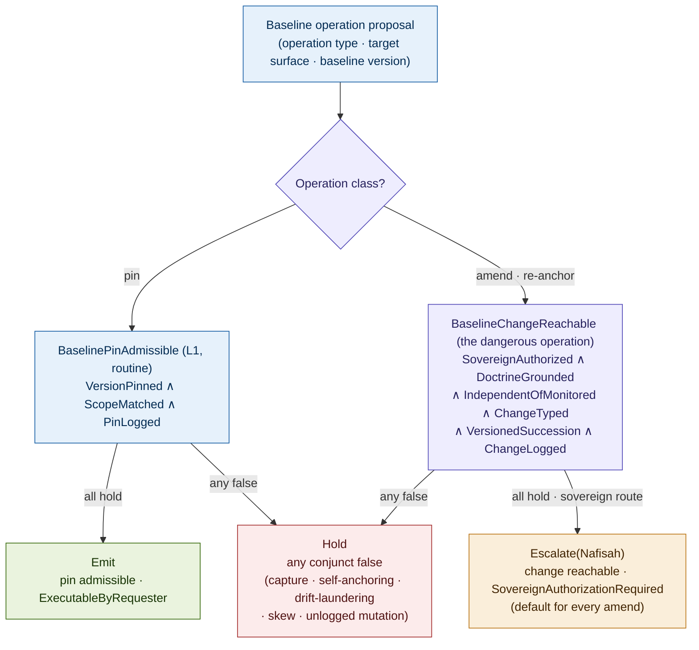
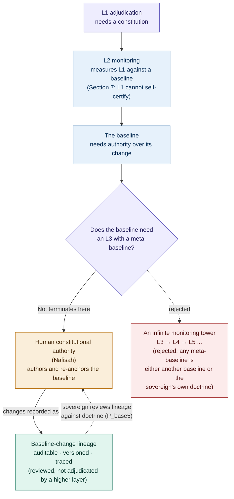
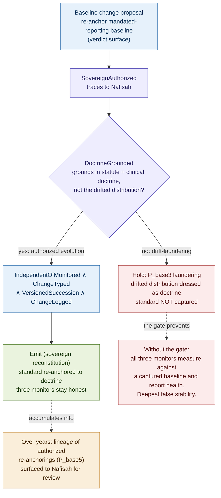

# Constitutional Baselines: Authority, Versioning, and Drift Measurement for Memory and Retrieval Governance

## Why the Measurement Standard Is a Constitutional Object

### v1.2 Conceptual Architecture Paper, Companion 3 to Constitutional Runtime Computation v5.4; closure of the baseline-authority dependency named in Constitutional Memory v2.1 and Constitutional Retrieval v1.2

**Clarence "Faheem" Downs (Professor Bone Lab)**

*Licensed under CC BY 4.0.*

---

# Abstract

The corpus has, by this point, a mature drift architecture. The core paper monitors L1 verdicts for drift against a baseline. The first companion detects cumulative store drift (P_mem5) against a distribution baseline. The second companion detects constructional narrowing (P_ret5) against a construction baseline. The whole L2 fidelity layer, on the write side and the read side, measures a monitored process against an external standard. Every one of these detectors shares a silent assumption: that the standard it measures against is fixed by something other than the process it measures. None of the prior papers governs that standard. The measurement baseline is named, depended upon, and left ungoverned three times over.

This paper governs it. The central claim is that the baseline against which drift is measured is itself a constitutional object, because whoever can move the baseline controls whether drift is detectable at all. A baseline that moves with the monitored process reports no drift, no matter how much the process has drifted. A monitor that sets its own baseline self-certifies its own measurement standard, which the parent's Section 7 forbids, now one layer up. And the judgment that separates an authorized baseline change, doctrine the sovereign endorses, from drift, displacement the sovereign never authorized, is the same sovereign-only judgment that P_mem5 and P_ret5 already route to Nafisah as mandatory. From these three facts a principle follows rather than is asserted: the **Baseline Sovereignty Principle**. Baseline-change authority must reside in the sovereign, or be completely mediated by the substrate under sovereign-versioned doctrine; a baseline change must be a distinct, typed, traced sovereign reconstitution act; and the baseline must be independent of the process it measures.

The Principle raises an obvious objection and answers it. If L2 needs a baseline, and the baseline needs authority, does the baseline need an L3 monitor with its own baseline, and so on without end? It does not. The regress terminates at the sovereign, because baseline authority is vested in terminal human constitutional authority (parent Section 17), and the sovereign's baseline changes are traced and versioned, hence auditable, but not adjudicated by a higher mechanical layer. The termination is not a gap in the architecture. It is the architecture's design: accountability terminates in human authority, and the baseline is the last object before that termination.

The contribution is fourfold. First, the Baseline as a constitutional object with identity, anchored doctrinal source, version and predecessor, pinning discipline, and an independence property. Second, a baseline operation typology framed by the governance each operation requires (establish, pin, amend or re-anchor, version or snapshot, retire or supersede). Third, two predicates in the parent's CTLC notation: BaselineChangeReachable, the dangerous sovereign operation, and a lightweight BaselinePinAdmissible for the routine one, with a family of baseline-specific primitive failure topologies (P_base) whose terminal member, P_base5, the regress-collapse case, is traced end to end. Fourth, the unification of the corpus's three drift loci, verdict, store, and construction, under one baseline-authority account. AEGIS serves as the worked domain. Nafisah remains the sovereign principal, Mantis the clinical reasoning agent, MEC the L2 monitor.

This companion governs the standard against which monitoring happens. The prior companions governed the monitored surfaces. This is the meta-level closure of the corpus's drift architecture, and the point at which its accountability chain reaches its terminus.

---

## Contents

**Part I** The ungoverned standard and the Baseline Sovereignty Principle
**Part II** The anatomy of a baseline
**Part III** The baseline predicate (BaselineChangeReachable and BaselinePinAdmissible)
**Part IV** The baseline as the termination of the regress
**Part V** Primitive failure topologies specific to baselines
**Part VI** Worked example: a baseline change in AEGIS
**Part VII** Who governs the baseline?
**Part VIII** Related work
**Open problems** (baseline-specific, extending the parent's Section 19 and the two companions' sets)

---

# Part I. The Ungoverned Standard and the Baseline Sovereignty Principle

The corpus has named the baseline-authority dependency three times. The parent's L2 monitoring measures L1's adjudication patterns against a pre-learning baseline (Section 8.4): MEC runs a shadow L1 pinned to that baseline and measures divergence across the drift vectors. The memory companion's P_mem5 measures the long-term store's distribution against a baseline pinned to the authorized doctrinal basis, and explicitly marks itself structurally specified but baseline-dependent, with the governance of the baseline named as an open problem. The retrieval companion's P_ret5 measures construction breadth against an external construction baseline, and states more sharply that the entire L2 construction-fidelity layer is baseline-dependent, not P_ret5 alone, because SalienceFidelityMonitored, the compression-drift obligation, and the P_ret5 probes all measure policy-conformant constructions against a basis the construction process itself cannot move.

Each of those papers governed the monitored surface and left the standard ungoverned. The accounting is exact.

| Where the corpus depends on a baseline | What governs that baseline |
|---|---|
| Adjudication-trace channel (parent Section 8.4), verdict drift against the pinned pre-learning baseline | Nothing, until this paper |
| P_mem5 Distribution Baseline Audit (memory companion), store drift against the doctrinal-basis baseline | Nothing, until this paper |
| P_ret5 Construction Baseline Audit (retrieval companion), construction narrowing against the construction baseline | Nothing, until this paper |
| SalienceFidelityMonitored (retrieval companion), salience drift against a salience baseline | Nothing, until this paper |
| Compression-drift obligation (retrieval companion), erasure drift against a compression-fidelity basis | Nothing, until this paper |
| BaselineFidelityMonitored (memory companion), retrieval fidelity against the authorized view baseline | Nothing, until this paper |

The covered column is drift detection against a baseline. The corpus has built that column well: six monitoring obligations, three traced primitives, a shared three-state probe discipline. The uncovered column is the authority over the baseline. Every cell in it is empty. This paper governs the uncovered column. It adds no new detector. It governs the standard the existing detectors already depend on.

The memory companion came closest to naming the structure and then deferred it. Its aggregate-governance operation class is governed by **BaselineAnchored** (the operation references an authorized, versioned baseline the store itself cannot move) and **DriftStateAuthorized** (a change to the baseline is a sovereign act distinguished from store drift). The companion stated plainly that these conjuncts name the requirement and that their full structure depends on the baseline-authority problem named in its open problems. This paper supplies the structure those two conjuncts named.

## The Baseline Sovereignty Principle, derived

The necessity here is not asserted. It follows from facts the corpus already establishes, in seven steps.

1. Every L2 drift detector in the corpus measures the monitored process against a baseline. This is established directly by the accounting table above and by the three traced primitives.

2. Drift is, by construction, change relative to that baseline. The parent defines a drift vector as displacement of the operative standard; the companions define P_mem5 and P_ret5 as cumulative divergence from a baseline basis. Drift has no meaning except relative to a standard.

3. Therefore whoever can move the baseline controls whether drift is detectable. If the baseline tracks the monitored process, the measured divergence is zero by construction, regardless of how far the process has actually moved. A baseline that walks with the system reports no drift.

4. If the monitored process can move the baseline, it masks its own drift. This is self-concealment at the meta-level: the false-stability vector of the parent's Section 13, applied not to the proposer and governor but to the measurement standard itself. The most dangerous drift vector, the only one that spans families, reappears one level up, on the object that was supposed to detect it.

5. If the monitor can set its own baseline, it self-certifies its standard. The parent's Section 7 forbids a governing function from certifying its own constitutional fidelity, which is why L1 and L2 are constitutionally separated. A monitor that anchors its own baseline is certifying the standard by which it measures fidelity. The Section 7 prohibition reappears one layer up, on the measurement standard.

6. The distinction between an authorized baseline change and drift is the same sovereign-only judgment P_mem5 and P_ret5 already route to Nafisah as mandatory. Both companions state the core invariant in identical form: the probe cannot distinguish authorized learning from unauthorized drift, or authorized focusing from unauthorized narrowing, because the two are structurally identical at the level of individual operations, and only the sovereign can say which. A baseline change is exactly that judgment made about the standard: whether the cumulative shift reflects doctrine the sovereign endorses or displacement the sovereign never authorized.

7. Therefore baseline-change authority is necessarily sovereign, typed, and traced, and the baseline must be independent of the measured. Steps 4 and 5 forbid both the monitored process and the monitor from moving the baseline. Step 6 locates the only competent authority for the change at the sovereign. Steps 1 through 3 establish that the object at stake is the measurement standard itself.

**The Baseline Sovereignty Principle.** The baseline against which drift is measured is a constitutional object. Whoever can move the baseline controls whether drift is detectable at all. Therefore baseline-change authority must reside in the sovereign, or be completely mediated by the substrate under sovereign-versioned doctrine; a baseline change must be a distinct, typed, traced sovereign reconstitution act; and the baseline must be independent of the process it measures.

The Principle stands in a definite relation to its predecessors. The parent relocated Act from the agent into the substrate. The memory companion's Memory Sovereignty Principle relocated write and issuance authority into the substrate. The retrieval companion's Observe Construction Sovereignty corollary relocated construction authority into the substrate. Each of those relocates authority over an operation. The Baseline Sovereignty Principle does something different in kind: it vests authority over the measurement standard itself in the sovereign, and forbids both the monitored process and the monitor from moving it. The prior moves governed surfaces. This move governs the standard against which surfaces are judged.

## The regress terminates at the sovereign, and that is the design

The Principle invites the objection that defeats naive monitoring towers. L1 needs a constitution. L2 monitors L1 against a baseline. The baseline needs authority. Does the baseline therefore need an L3 monitor, measured against its own baseline, which needs an L4, without end?

It does not, and the reason is structural rather than convenient. The regress terminates at the sovereign because of two properties the corpus already establishes. First, baseline authority is vested in terminal human constitutional authority. The parent's Section 17 makes human authority the terminus of the whole architecture: escalation routes to it, reconstitution requires it, and the substrate's indeterminate signals are designed to be irresolvable without it. Terminal means the chain stops there by construction, not for lack of a further layer. Second, the sovereign's baseline changes are traced and versioned, hence auditable, but they are not adjudicated by a higher mechanical layer. Auditability is not adjudication. The change is fully reconstructable from the lineage, and an external auditor can review whether each change traced to doctrine, but no mechanical monitor measures the sovereign's baseline against a meta-baseline, because there is no meta-baseline that the sovereign did not author.

A paper that claimed to close this regress mechanically would be wrong. There is no mechanical detector that can certify the sovereign's baseline, because certifying it would require a standard the sovereign did not set, and any such standard is either another baseline (restarting the regress) or the sovereign's own doctrine (which is what is being certified). The integrity move is not to pretend the regress closes mechanically. It is to show why it terminates at the sovereign, and to make the terminal primitive, P_base5 below, the object that proves the termination is load-bearing rather than a loose end. The baseline is the last object before accountability passes to human authority. Governing it is governing the edge of the mechanical architecture, where it hands off to the human one.

---

# Part II. The Anatomy of a Baseline

A baseline is treated, across the corpus, as a static reference: a pinned distribution, a pinned construction basis, a pre-learning snapshot of L1. The probes consume it. None of the prior papers asks what a baseline is as a governed object. This part establishes that it is not a static reference but a constitutional object with structure, exactly as the memory companion's RequiredObserveSet and the retrieval companion's ObserveConstructionEnvironment are constitutional objects rather than configuration values. Those two objects are the precedents this part follows: each is sovereign-authored, versioned, pinned at use, and reconstituted rather than edited. The baseline is the third object of that kind, and the most fundamental, because it is the standard the others' fidelity is ultimately measured against.

## The baseline as a constitutional object

A **Baseline** has the following constitutional structure.

**Identity and scope.** A baseline serves exactly one monitored surface. The store-distribution baseline serves P_mem5. The construction-breadth baseline serves P_ret5. The adjudication baseline serves the parent's verdict monitoring. A baseline that served two surfaces at once would couple their drift signals and make a change to one a silent change to the other, which is the P_base4 skew failure below. Identity and scope are therefore part of the object: this baseline, for this surface, in this domain.

**Anchored doctrinal source.** A baseline is anchored to an authorized doctrinal source: the normative constitution, a versioned doctrine record, a statutory basis, a sovereign determination. The anchor is what the baseline traces to, and it is what distinguishes a baseline from an arbitrary snapshot of the system. A snapshot of where the store currently sits is not a baseline. A standard anchored to authorized doctrine is. The anchor is the load-bearing property, because it is what the monitored process must not be able to supply.

The anchor must name which of the parent's three constitutional layers it binds to (normative, operational, runtime), because "doctrine" is not flat and different baseline classes anchor at different layers. The verdict baseline anchors to operational adjudication doctrine, the encoded admissibility conditions for what a transition subtype requires. The store-distribution baseline anchors to normative and domain doctrine together with the authorized store distribution that doctrine sanctions. The construction baseline anchors to the construction policy and the RequiredObserveSet (themselves operational objects authored from normative doctrine). The salience baseline anchors to the ObserveConstructionEnvironment, and the compression-fidelity basis anchors to the summarization policy and the uncertainty doctrine. A baseline that names only "doctrine" without naming its layer cannot be checked for anchor fidelity, because the auditor cannot tell which layer the grounding should trace to. Naming the layer is therefore part of the anchored-source field, and it is what gives DoctrineGrounded (Part III) a layer to evaluate against rather than an undifferentiated appeal to doctrine.

**Version and predecessor.** A baseline carries a version and a reference to the baseline it succeeds. Baselines are never edited in place. A new baseline is a versioned successor that records its predecessor, exactly as the memory companion requires a schema change to produce a new memory-constitution version. In-place mutation of a baseline is indistinguishable, after the fact, from the drift the baseline was meant to detect, which is why it is prohibited at the level of the object.

**Pinning discipline.** A measurement does not float against a live baseline. It pins a baseline version at the moment of measurement, exactly as the parent's CRA Assembly Step 1 pins the constitution version for an adjudication. Every drift signal is computed against a named, pinned baseline version, so that the signal is reproducible and the standard it used is recoverable from the log.

**Independence property.** The baseline is not derivable from, and cannot be moved by, the process it measures. This is the metrology requirement stated as a property of the object. A baseline that is a function of the monitored distribution is no baseline, because it walks with the distribution and reports zero. Independence is what makes the object a standard rather than a mirror.

## The operation typology

Baseline operations divide by the governance each requires, not by their statistics. The class determines the authority, the predicate, and the failure surface, exactly as the memory companion's operation typology divides memory operations by what they change.

| Operation | What it changes | Governance required |
|---|---|---|
| Establish | Creates a baseline for a surface from authorized doctrine | Sovereign authorization; the founding act |
| Pin | Binds a measurement to a baseline version | Routine, L1-decidable, low authority |
| Amend or re-anchor | Changes the baseline the surface is measured against | Sovereign authorization; the dangerous act |
| Version or snapshot | Records a baseline state as a versioned successor | Substrate-mediated under sovereign-versioned doctrine |
| Retire or supersede | Ends a baseline's authority, naming its successor | Sovereign authorization; affects the audit substrate |

**Establish** is the founding act. It creates a baseline for a surface that did not have one, anchoring it to authorized doctrine. It is sovereign because the founding anchor is a doctrinal determination: this is the standard against which this surface will be judged. Establishment fails if the founding baseline is drawn from the monitored process rather than from doctrine, which is the establishment-time form of capture.

**Pin** is the routine operation. A measurement pins a baseline version and computes drift against it. Pinning changes nothing about the baseline; it binds a measurement to a version. It is frequent, it is L1-decidable, and it requires low authority. Pinning is to a baseline what an ordinary read is to a store: a constant, governed, lightweight operation that must nonetheless be scoped and logged.

**Amend or re-anchor** is the dangerous operation, and it is categorically different from pin in exactly the way the memory companion's schema-changing operations are categorically different from ordinary writes. An amend changes the standard. After an amend, every subsequent measurement on that surface is computed against a different baseline, and every drift signal the surface produces is relative to the new standard. An amend is therefore not a measurement and not a routine operation. It is a reconstitution of the measurement standard, admissible only under sovereign authorization, and it is the operation BaselineChangeReachable governs. Treating an amend as just another high-authority pin would let the standard shift without the reconstitution discipline the architecture requires for any change to the operational constitution, which is precisely the error the memory and retrieval companions warned against for schema and environment changes.

**Version or snapshot** records a baseline state as a clean versioned successor. It is the mechanism that makes amend traceable: an amend produces a new version, and the version records its predecessor and its migration effect on in-flight measurements. Versioning is substrate-mediated under sovereign-versioned doctrine, because the discipline of clean succession is doctrinal, but the individual snapshot is a mechanical recording of a sovereign-authorized state.

**Retire or supersede** ends a baseline's authority. It is sovereign because retiring a baseline without a named successor would leave a surface with no standard, blinding its monitor, and because the retired baseline's lineage must persist in the audit substrate so that historical drift signals remain interpretable against the standard that produced them. Retirement defaults to supersession with a named successor rather than deletion, for the same non-repudiation reason the memory companion's store-removing family defaults to tombstone retention.

The typology's center of gravity is the distinction between pin and amend. A pin binds a measurement to a standard. An amend moves the standard. The first is routine and the second is reconstitution, and the entire predicate apparatus of Part III turns on keeping them apart, because the failure that defeats the corpus's drift architecture is an amend disguised as something routine.

## The version-amend boundary and scheduled activation

The boundary between version and amend needs one refinement, because a benign operation can look like a change without being a runtime delegation of judgment. The Principle forbids any non-sovereign component from deciding a new standard. It does not forbid the substrate from mechanically activating a baseline version the sovereign already authorized. The two must be told apart.

The discriminating question is whether judgment about the new standard is being exercised at runtime or was already exercised by the sovereign in advance. A statute with an authorized effective date is the clean case: Nafisah approves, ahead of time, the successor baseline, its effective condition, and its doctrine grounding. On the effective date the substrate rolls the baseline from version n to version n+1. No judgment about what the new standard should be is made at activation; the judgment was made at authorization, and activation is the mechanical execution of a prior sovereign act. This is a **scheduled activation**, and it is substrate-executable, because the sovereign already decided the new standard, the effective condition, and the grounding. It is distinct from an amend, where the new standard is decided now. An amend decides the standard at runtime and is never substrate-executable; a scheduled activation executes a standard the sovereign decided earlier and may be. The distinction is delegation of judgment (forbidden) versus execution of a prior sovereign act (permitted), and it is the same distinction the memory companion drew with its PreAuthorizedClassExecutable status, applied carefully so that it does not become a back door for delegating baseline judgment. Part III states the verdict consequence: a scheduled activation of a previously sovereign-authorized successor is the one path on which a baseline-version change does not require a fresh runtime escalation, precisely because the sovereign judgment it executes is not fresh.

## Baseline generations

A single surface's baseline is one object. The corpus has many surfaces, and their baselines must cohere as a set, not only individually. A **BaselineGeneration** is the scaffolded object that groups the mutually coherent baseline versions across surfaces (verdict, store, construction, salience, compression, view) that were jointly authorized as one coherent standard set for a doctrine version. A measurement pins a baseline version; a coherent system pins baseline versions drawn from one generation, so that the verdict surface and the construction surface are judged against standards the sovereign authorized together. The constitutional status of the generation is fixed here: it is a sovereign-authored, versioned object, and a change to the generation (rather than to one surface's baseline within it) is a coordinated reconstitution. Its full structure, how a generation is established, how an amend to one surface's baseline interacts with the generation it belongs to, and how cross-surface coherence is checked, is scaffolded and named as an open problem, because the cross-baseline coherence question is closer to the core than a single-surface account can resolve. P_base4 (Part V) is the pinning-discipline failure within this picture (skew across versions); the deeper failure, individually doctrine-grounded baselines that are mutually incoherent as a set, is named below as a distinct open problem.

---

# Part III. The Baseline Predicate

This is the paper's formal contribution. The thesis is that a baseline change is a governed constitutional transition, and the formal object must govern baseline establishment, change, and pinning, not restate the drift detection the corpus already has. If the apparatus below found itself re-describing the P_mem5 or P_ret5 probes, it would have failed to close the gap, because those probes detect drift against a baseline and this paper governs the baseline. The two predicates here govern operations on the standard, not measurements against it.

Two predicates are needed because the typology has two governance grades. Pinning is routine and frequent; amending is dangerous and rare. A single predicate would either over-govern the pin or under-govern the amend.

## The pinning predicate

The lightweight predicate governs the routine operation. It is L1-decidable and runs on every measurement.

```
BaselinePinAdmissible(β) ⟺
  VersionPinned(β) ∧ ScopeMatched(β) ∧ PinLogged(β)
```

- **VersionPinned(β):** the measurement names a specific, existing baseline version, not a live or unversioned reference. A measurement that floats against whatever the baseline currently is, rather than against a pinned version, fails. This is the baseline analogue of the parent's PIN step, and it is what makes a drift signal reproducible.

- **ScopeMatched(β):** the pinned baseline serves the surface being measured. A P_mem5 measurement must pin the store-distribution baseline, not the construction baseline. A scope mismatch produces a drift signal computed against the wrong standard, which is the seed of P_base4 skew. Surface alone is too coarse to match against: the scope field carries the surface together with the domain, the population, the time window, the jurisdiction, the task type, and the baseline generation, so that a measurement does not merely pin the right surface's baseline but the right one for this domain, population, and generation. ScopeMatched is decidable against that scope field.

- **PinLogged(β):** the pin is recorded with the surface, the baseline version, the measurement window, and the detector version, so that any drift signal can be replayed against the exact standard and the exact instrument that produced it. The measurement window and detector version are part of the record because re-running the same pin with a changed detector or a different window will not reproduce the signal, and a drift signal that cannot be reproduced cannot be reviewed. PinLogged is what makes the pinning surface auditable and what makes a measurement that used an unpinned or stale baseline detectable.

A pin is, by default, ExecutableByRequester: the monitor pins a version and measures without escalation. Pinning is the one baseline operation that is routine.

## The change predicate

The dangerous operation is the amend or re-anchor. Its predicate is the heart of the paper.

```
BaselineChangeReachable(β) ⟺
  SovereignAuthorized(β)     ∧
  DoctrineGrounded(β)        ∧
  IndependentOfMonitored(β)  ∧
  ChangeTyped(β)             ∧
  VersionedSuccession(β)     ∧
  ChangeLogged(β)
```

- **SovereignAuthorized(β):** the change traces to sovereign authorization, not to the monitored process, the monitor, or an automated re-anchoring routine. This is the conjunct that forbids self-anchoring on both sides. Authority over the standard is structural: the monitored process cannot confer baseline-change authority on itself (that would be capture, P_base1), and the monitor cannot confer it on itself (that would be self-anchoring, P_base2). Neither can an automated routine that re-anchors the baseline to the current distribution, because such a routine is the monitored process moving the standard through a mechanism. The only valid source of the change is the sovereign.

- **DoctrineGrounded(β):** the new baseline traces to authorized doctrine, not to the current and possibly drifted monitored distribution. This is the load-bearing conjunct, and it is the one that prevents drift-laundering. You cannot set the new baseline to wherever the store or the construction currently sits, because that launders the accumulated drift into the standard: the drift becomes the new normal, and the monitor, now measuring against the drifted baseline, reports that everything is fine. DoctrineGrounded requires the new baseline to ground in the authorized source, the same source the establish operation drew from, so that an amend re-anchors to doctrine rather than to the system's drifted present. Where SovereignAuthorized asks who authorized the change, DoctrineGrounded asks what the change is anchored to, and the second question is the one that catches the most dangerous failure, because a sovereign can be persuaded to authorize a change whose grounding is the drifted distribution dressed as doctrine. Because this conjunct carries so much weight, it is evaluated not against a narrative appeal to doctrine but against a typed evidentiary object, the DoctrineGroundingRecord (defined below), which names the doctrinal source, its constitutional layer, the change rationale, and, critically, the reason the current monitored distribution is not the grounding source. Without that typed object DoctrineGrounded degrades into "the sovereign said it is doctrine," which is acceptable as terminal authority but weak as an auditable predicate.

- **IndependentOfMonitored(β):** the new baseline is not a function of, and cannot be moved by, the process it measures. This is the non-circularity conjunct, the metrology requirement made into a predicate condition. It differs from DoctrineGrounded in object: DoctrineGrounded governs where the new baseline came from (its anchor), IndependentOfMonitored governs what the new baseline structurally depends on (its derivation). A baseline could ground in doctrine at the moment of the change and still be specified as a function of the monitored distribution going forward, which would let it drift with the system after the change. IndependentOfMonitored forbids that derivation, and it decomposes into four subchecks: **NotDerivedFromMonitored** (the baseline is not computed from the monitored distribution), **NoAutomatedReanchoringFromMeasuredState** (no routine re-anchors the baseline to the measured state on a schedule or threshold), **NoFeedbackPathFromMonitorToBaseline** (no path exists by which the monitor's own outputs reach the baseline), and **DependencyGraphClear** (the baseline's declared dependency graph contains no edge from the monitored process). A baseline derivable from the monitored distribution is no baseline.

- **ChangeTyped(β):** the change is typed as one of an enumerated set of authorized change kinds, distinguished from the drift it must be told apart from, with a recorded rationale. This conjunct formalizes the P_mem5 and P_ret5 core invariant, the only the sovereign can say which judgment, as a typed, recorded act. Typing does not merely assert "authorized change"; it names what kind: authorized doctrine evolution, statutory update, sovereign reinterpretation, correction of a prior baseline error, supersession, retirement, emergency re-anchor, or rollback after capture. The enumerated type carries different downstream consequences (a rollback after capture invalidates intervening measurements; a statutory update carries an effective date; an emergency re-anchor carries a mandatory post-hoc lineage review), which is why the type, not just the fact of authorization, is recorded. A change that cannot be assigned a kind, because no rationale distinguishes it from drift, fails and routes to the sovereign rather than emitting. ChangeTyped is where the sovereign's judgment about authorized-evolution-versus-drift becomes a constitutional object: a typed record stating which kind of re-anchoring this is and why, rather than an untyped mutation of the standard.

- **VersionedSuccession(β):** the new baseline records its predecessor, declares its migration effect on in-flight measurements, declares a compatibility rule for measurements taken against the predecessor, and is a clean versioned successor with no silent in-place mutation. A baseline that changed by editing the existing version in place would be indistinguishable, after the fact, from drift, because there would be no predecessor to compare against. The compatibility rule matters because superseding version n with version n+1 must not silently invalidate the drift signals already computed against version n: those historical signals remain interpretable against the standard that produced them, and the rule states how a signal computed against the predecessor relates to the successor (carried forward, re-pinned, or marked predecessor-relative). VersionedSuccession is what makes an amend reconstructable as a discrete event in the lineage rather than a quiet shift in a live value.

- **ChangeLogged(β):** the change is traced distinctly from a measurement, in the governance exposure log, as a baseline reconstitution event that references its DoctrineGroundingRecord and its predecessor baseline explicitly and carries the sovereign rationale. A baseline change must never appear in the log as, or be confusable with, an ordinary pin or measurement. It is a reconstitution of the standard, logged with that status and with its grounding record and predecessor attached, so that the baseline-change lineage is a recoverable object the sovereign can review (Part IV and Part VII).

## The DoctrineGroundingRecord and the object model

DoctrineGrounded is the load-bearing conjunct, and a load-bearing conjunct cannot rest on a narrative claim that something is doctrine. It needs a typed evidentiary object, so that an auditor can check the grounding rather than take it on the sovereign's word. The **DoctrineGroundingRecord** is that object. It is the artifact a baseline change presents to satisfy DoctrineGrounded, and it carries:

- the doctrinal source (the statute, sovereign doctrine record, formal clinical standard, prior sovereign determination, reconstitution memo, normative-constitution version, operational-constitution diff, external legal or domain source, or multi-source doctrine packet the change anchors to);
- the source authority type (which kind of source it is, since a statute and a clinical standard ground differently);
- the constitutional layer the grounding binds to (normative, operational, or runtime), matching the baseline's anchored-source field from Part II;
- the change rationale;
- the affected surface;
- the old-baseline relation and the new-baseline relation (what the standard was and what it becomes);
- the reason the current monitored distribution is not the grounding source, which is the field that directly answers the drift-laundering failure: a change whose only honest answer here is "the system has been behaving this way lately" is laundering, and the record forces that answer into the open;
- the sovereign interpretation;
- any uncertainty or dissent state;
- the reviewer identity;
- the effective date.

The reason-not-the-monitored-distribution field is the one that turns DoctrineGrounded from a sentiment into a check. P_base3 laundering is precisely the case where that field cannot be honestly filled, because the grounding is the drifted distribution. The DoctrineGroundingRecord does not make DoctrineGrounded mechanically decidable (whether the named source genuinely grounds the change remains a sovereign judgment), but it makes the judgment auditable: the grounding is a typed object an external reviewer can examine against doctrine, not a claim that vanishes after the change. Stated as doctrine: the DoctrineGroundingRecord provides auditability of the sovereign's grounding judgment, not mechanical proof of doctrinal correctness. The terminal judgment of whether a source genuinely grounds a change still belongs to the sovereign; what the record adds is that the judgment becomes inspectable, challengeable, and reconstructable rather than evaporating into an unrecorded assertion. A reader who took the typed record to settle doctrine grounding would have mistaken auditability for proof.

The DoctrineGroundingRecord sits inside a small object model the predicates presuppose: the **Baseline** (Part II), the **BaselineGeneration** (Part II), the **BaselineChangeProposal** (the typed proposal an amend submits, carrying the proposed successor, the DoctrineGroundingRecord, the change type, and the predecessor reference), the **BaselineLineage** (the ordered, reconstructable sequence of a surface's baseline changes, the object BaselineLineageSurfaced presents and P_base5 reviews), and the independence evidence behind IndependentOfMonitored (a dependency analysis or independence certificate establishing the four subchecks). The predicate apparatus of this paper is sound; this object model is what makes its conjuncts auditable rather than narrative, and several of these objects are fully specified here (Baseline, DoctrineGroundingRecord, BaselineChangeProposal, BaselineLineage) while BaselineGeneration and the independence certificate are scaffolded and named in the open problems.

## The relationship between the predicates and the verdict structure

The two predicates correspond to the two governance grades, and they compose with executability exactly as the parent and the companions do, using the same authority statuses (ProposalWellFormed, AuthorityRouteable, ExecutableByRequester, PreAuthorizedClassExecutable, SovereignAuthorizationRequired).

| Operation | Predicate | Executability | Verdict |
|---|---|---|---|
| Pin | BaselinePinAdmissible | ExecutableByRequester | **Emit** |
| Amend or re-anchor | BaselineChangeReachable | not executable by requester; SovereignAuthorizationRequired | **Escalate(target = Nafisah)** |
| Pin (any conjunct false) | BaselinePinAdmissible | any | **Hold(cause)** |
| Amend (any conjunct false) | BaselineChangeReachable | any | **Hold(cause)** |

A pin is routine and emits. A baseline change is, by default, SovereignAuthorizationRequired and escalates to Nafisah; it is never ExecutableByRequester for the monitor or the monitored process, because that would be self-anchoring or capture. The restriction on pre-authorization must be stated precisely, because an overly absolute version of it would forbid a benign operation. There is no PreAuthorizedClassExecutable path that lets a non-sovereign component decide a new standard: a delegated baseline-change class, in which some component judges at runtime what the new baseline should be, is a standing delegation of judgment over the standard, and the Principle forbids it. But the execution of a prior sovereign act is not a delegation of judgment. A scheduled activation, in which the sovereign has already authorized the successor baseline, its effective condition, and its DoctrineGroundingRecord in advance (Part II), is substrate-executable on the effective condition without a fresh runtime escalation, because the judgment it executes is the sovereign's and was made earlier. The discriminating line is delegation of judgment versus execution of a prior sovereign act: a pin class may be pre-authorized, a scheduled activation of an already-authorized successor may execute, and a change class that decides the standard at runtime may not. This keeps the Principle intact (no component decides a standard but the sovereign) while not forbidding the mechanical activation of a standard the sovereign already chose.

## The unusual L2, stated honestly

The baseline-fidelity L2 obligation is unlike every other L2 obligation in the corpus, and the difference must be stated rather than hidden. Every other L2 obligation grounds in a baseline: P_mem5 monitors the store against the distribution baseline, P_ret5 monitors construction against the construction baseline, the parent's L2 monitors verdicts against the adjudication baseline. The baseline-fidelity obligation cannot ground itself in a higher baseline without restarting the regress. There is no meta-baseline to measure the baseline against.

Its role is therefore not to adjudicate the baseline against a higher standard. Its role is to surface the baseline-change lineage to the sovereign. The baseline-fidelity L2 obligation, **BaselineLineageSurfaced**, watches the sequence of baseline changes on each surface and presents that lineage, with each change's grounding and rationale, to the sovereign for review. It does not compute a drift signal against a meta-baseline, because there is none. It makes the change history legible. This is the paper's integrity point: the one L2 obligation that cannot be a measurement-against-a-baseline, because it is the obligation about the baseline itself, and the architecture is honest that it terminates in sovereign review of the lineage rather than in a higher mechanical layer. One adequacy condition is load-bearing enough to state in the main body, because it is what P_base5 turns on: lineage surfacing is complete only when the sovereign reviews the lineage as a lineage, the cumulative trajectory of authorized changes, not merely the most recent proposed change. A review that adjudicates each amend in isolation, however careful, never sees the meta-drift, because every individual amend was authorized; only review of the trajectory can see where the authorized steps have walked the standard. What counts as a fully adequate lineage review remains an open problem (below), but this minimum, review the lineage and not just its latest entry, is constitutional rather than administrative.

Because lineage surfacing is the terminal substitute for an L3 monitor, its schedule is not an administrative detail; it is part of the constitutional mechanism, and it requires a defined set of trigger classes rather than an open-ended "review periodically." A lineage is surfaced under any of: a **periodic review trigger** (a fixed review cadence per surface); a **change-count trigger** (a surface re-anchored more than a set number of times within a window); a **cumulative-shift trigger** (the lineage's cumulative re-anchoring exceeds a sovereign-set lineage tolerance); a **cross-surface inconsistency trigger** (baselines across surfaces fall out of one generation, the BaselineGeneration coherence condition); a **high-impact-surface trigger** (any change on a surface the sovereign has marked high-impact, such as mandated reporting); a **sovereign-requested review**; an **external doctrine-update trigger** (a statute or standard the baselines anchor to has changed); and a **post-incident review trigger** (a detected P_base1, P_base2, or P_base3 forces a full lineage review). Because the terminal layer's only instrument is surfacing, the trigger thresholds are constitutional parameters owned by the sovereign, not tuning knobs owned by the monitor, which would otherwise be a route to self-anchoring the review schedule itself.

## Note on decidability

Following the parent's pattern, the conjuncts split into decidable and undecidable. VersionPinned, ScopeMatched, PinLogged, VersionedSuccession, and ChangeLogged are mechanically decidable: they evaluate over the baseline's version record, scope field, and the governance log. SovereignAuthorized is decidable over the authority graph in the same way the parent's Authorized is. IndependentOfMonitored is decidable in its structural form (is the baseline specified as a function of the monitored distribution?) but its deep form (could this baseline be moved by the monitored process through some indirect path?) may resist algorithmic evaluation. DoctrineGrounded is the undecidable conjunct, for the same reason the parent's Admissible is undecidable: whether a new baseline genuinely traces to authorized doctrine rather than to the drifted distribution dressed as doctrine is a judgment that binds doctrinal content and may resist mechanical evaluation. Where DoctrineGrounded cannot be conclusively evaluated, the change routes to escalation rather than emit, which is correct, because the undecidable region of the baseline-change judgment is exactly the region in which sovereign authority over the standard becomes necessary. The decidable conjuncts narrow the space; the undecidable conjunct names the boundary at which sovereignty over the measurement standard is required.

**Figure 1. The two baseline predicates and their verdict paths**



*A pin is routine and emits. An amend is a reconstitution of the standard and escalates to the sovereign by default, with no pre-authorized class that collapses it into an emit. DoctrineGrounded is the load-bearing conjunct: it is what holds when an amend re-anchors to doctrine and fails when an amend launders the drifted distribution into the standard.*

---

# Part IV. The Baseline as the Termination of the Regress

Part I derived the regress termination as part of the Principle. This part makes its structure concrete, because the termination is the load-bearing claim of the paper and a vague version of it would undermine everything built on it.

The regress is real and must be stated at full strength before it is answered. L1 needs a constitution, or its adjudication is ungrounded. L2 monitors L1, because the parent's Section 7 establishes that L1 cannot certify its own fidelity. L2's monitoring measures against a baseline, because drift has no meaning except relative to a standard. The baseline needs authority, because whoever moves it controls whether drift is visible. So far the chain is forced. The question is whether the next link is forced too: does the baseline's authority require an L3 that monitors the baseline against a meta-baseline, which would require an L4, and so on without end?

The chain does not continue. It terminates at the sovereign. The termination is not the architecture running out of layers. It is the architecture reaching the object it was always going to reach: human constitutional authority, which the parent's Section 17 already establishes as the terminus of the whole system. The baseline is simply the last mechanical object before that terminus. Everything below the baseline is measured against something. The baseline is measured against nothing, because it is anchored to doctrine the sovereign authored, and reviewed by the sovereign through its lineage rather than measured by a higher monitor.

Two things make the termination load-bearing rather than a loose end. First, the sovereign's baseline changes are auditable without being adjudicated. The baseline-change lineage is fully reconstructable: every amend recorded its predecessor, its grounding, its rationale, and its sovereign authorization. An external auditor can review whether each change traced to doctrine. That is real accountability. It is not mechanical adjudication against a meta-baseline, and it does not need to be, because the accountability the architecture provides at its terminus is auditability of the human authority's acts, not mechanical certification of them. Second, the terminal primitive P_base5 (Part V) is the object that proves the termination holds. P_base5 is the failure in which the lineage of individually authorized changes cumulatively drifts the standard, and its only detector is sovereign review of the lineage against doctrine. P_base5 does not point to a missing L3. It points to the sovereign, and it is structurally specified precisely so that the termination is demonstrated rather than asserted.

## The legitimate case: doctrine genuinely evolves

The baseline gate is not an instrument for freezing the standard. Doctrine evolves, and an authorized baseline change is good governance, exactly as legitimate learning crosses the memory companion's write gate and legitimate focusing crosses the retrieval companion's construction gate. A new statutory interpretation, a maturation in clinical judgment, a sovereign reconsideration of what a domain requires: each is a legitimate reason to re-anchor a baseline, and each should pass BaselineChangeReachable cleanly. The gate does not exist to prevent the standard from ever moving. It exists to distinguish authorized evolution of the standard from capture of it.

This is the same distinction the prior gates draw, lifted to the standard. The memory companion's boundary distinguishes learning from contamination: a clinical pattern that traces to authorized events crosses, a drifted salience that traces to no authorized event is held. The retrieval companion's gate distinguishes faithful focusing from constructional distortion: a ranking that follows authorized policy crosses, a ranking drifted under operational pressure is held. The baseline gate distinguishes authorized re-anchoring from drift-laundering: an amend grounded in doctrine crosses, an amend grounded in the drifted distribution is held. In all three, the gate is not the enemy of change. It is the structure that tells endorsed change apart from unauthorized displacement, and at the baseline that distinction is the most consequential one in the corpus, because it governs the standard by which every other distinction is judged.

**Figure 2. The regress terminates at the sovereign**



*The chain L1 to L2 to baseline is forced. The next link is not an L3 tower but the sovereign. The termination is load-bearing because the sovereign's baseline changes are auditable through their lineage (real accountability) without being adjudicated by a higher mechanical layer (which would restart the regress). P_base5 is the primitive that proves the termination: its only detector is sovereign review of the lineage.*

---

# Part V. Primitive Failure Topologies Specific to Baselines

The parent's P architecture decomposes each constitutional stability domain into primitives, the smallest independently governable failure mechanisms, and its standard is tight: a mechanism that spans the monitor, the baseline, and the sovereign is a compound topology, not a primitive. The retrieval companion's sharpest review correction was exactly this point, and it is honored here. The P_base family below is a set of new P objects unified by their locus at the measurement standard, cross-cutting the parent's Q domains: each is a way the baseline itself fails, distinct from the ways the monitored surfaces fail. Each member named below is a genuine primitive, the smallest independently governable mechanism. The cross-layer loop in which they compound is named separately, as a topology, not folded into a primitive.

One classification point must be made before the family, because P_base5 strains the parent's measurability standard in a way the other members do not. The parent's standard says a primitive should be independently identifiable, independently measurable within a specified instrumentation design, and independently governable. P_base1 through P_base4 meet all three: each is measured at the baseline operation, against a baseline or a scope field. P_base5 cannot be measured that way, because the object that has drifted is the baseline and there is no higher baseline to measure it against. Rather than stretch the measurability standard to pretend P_base5 satisfies it, this paper names a distinct class. An **ordinary primitive** is measured against a baseline. A **sovereign-terminal primitive** is independently identifiable and independently governable but not independently measurable against a higher standard, because such a standard would restart the regress; its detectability standard is lineage legibility and sovereign review, not mechanical measurement. P_base5 is the corpus's first sovereign-terminal primitive, and naming the class is what lets it sit honestly in the P architecture without violating the parent's definition: it does not fail the standard, it belongs to a different and explicitly named category of primitive, the one that lives at the regress terminus.

**P_base1: Baseline Capture.** The monitored process moves the baseline so it tracks the drift, masking it; or the proposer and the governor co-drift and carry the baseline with them. This is the meta-level instance of the parent's false-stability vector: the measurement standard walks with the system, agreement looks total, and the drift reports as zero. Detection signature: a baseline change on a surface whose grounding traces to the monitored distribution rather than to doctrine (a DoctrineGrounded failure at the change gate), or a baseline whose derivation is a function of the monitored process (an IndependentOfMonitored failure). Recovery: the captured baseline is held at the change gate before it takes effect; if capture is detected after the fact, the baseline is rolled back to its last doctrine-grounded version and the measurements taken against the captured baseline are flagged for re-computation.

A subtype deserves its own name, because it is one of the most realistic capture paths and it evades the structural conjuncts. **Mediated capture** is the case in which the monitored process does not directly move the baseline and does not derive it (so NotDerivedFromMonitored and the other IndependentOfMonitored subchecks all hold), but indirectly shapes the evidence packet or interpretive frame through which the sovereign re-anchors it: the reports, summaries, policy proposals, analyst dashboards, or sovereign-facing briefings that inform a re-anchoring may themselves be generated from the monitored process, so the sovereign authorizes a change whose framing was produced by the very system the baseline is meant to measure. SovereignAuthorized holds (the sovereign did authorize it) and DoctrineGrounded may appear to hold (a doctrinal source is named), yet the standard has been captured one step removed, through the sovereign rather than around her. The structural conjuncts do not catch mediated capture, because the dependency runs through the human interface, not the dependency graph. Its only partial defenses are the DoctrineGroundingRecord's reason-not-the-monitored-distribution field (which forces the framing into the open where the sovereign can challenge it) and the provenance of the evidence packet itself (whether the briefing that motivated the re-anchoring traces to the monitored process). Mediated capture is named here as a P_base1 subtype rather than fully governed, because governing the provenance of the sovereign's own evidence packet is a deeper problem that touches the human-authority interface, and it is flagged in the open problems alongside threshold governance.

**P_base2: Monitor Self-Anchoring.** The L2 monitor sets or moves its own baseline, self-certifying its measurement standard. This is the meta-level twin of the L1 self-certification the parent's Section 7 forbids: a monitor that anchors its own baseline is certifying the standard by which it judges fidelity, which is the Section 7 collapse condition one layer up. P_base2 is distinct from P_base1 by which component moves the baseline: P_base1 is the monitored process moving it, P_base2 is the monitor moving it. Detection signature: a baseline change whose authorization traces to the monitor rather than the sovereign (a SovereignAuthorized failure). Recovery: the change is held; the monitor's standing to author baseline changes is reviewed, because a monitor that attempted to anchor its own baseline has exceeded its constitutional role, which is to surface lineage, not to set the standard.

**P_base3: Drift-as-Authorized-Change Laundering.** A drift is recorded as an authorized baseline change. The new baseline is set to the current drifted distribution and dressed as doctrinal evolution, so the accumulated drift becomes the new normal and the monitor, now measuring against it, reports health. This is the failure DoctrineGrounded is defined to catch: the new baseline came from the drifted distribution, not from doctrine. The inverse failure must be named too, because an over-rigid baseline is also a failure: a legitimate doctrine evolution suppressed as drift, where the sovereign's genuine re-anchoring is wrongly held because the gate cannot tell endorsed evolution from displacement. Both failures live at the same conjunct, and both resolve the same way, by routing the typing judgment to the sovereign: P_base3 is the precise reason ChangeTyped exists, because the only competent judge of whether a change is authorized evolution or laundered drift is the sovereign, and ChangeTyped makes that judgment a typed, recorded act rather than an implicit one. Detection signature: a baseline change that passes SovereignAuthorized but whose grounding, on review, traces to the monitored distribution rather than to doctrine. Recovery: the change is held at DoctrineGrounded; if it passed and is detected later, the laundered baseline is rolled back and the intervening measurements re-computed against the last doctrine-grounded version.

**P_base4: Baseline Version Skew.** Measurements are pinned to inconsistent or stale baseline versions across the three L2 channels, so the verdict, store, and construction drift signals are computed against mismatched standards and become incomparable. P_base4 is not a change failure; it is a pinning-discipline failure, and it is why ScopeMatched and VersionPinned are conjuncts of the pin predicate. When the adjudication channel measures against one baseline version and the content-distribution channel against another, a coordinated drift signal cannot be assembled, because the three channels no longer share a standard. Detection signature: pin records across the three channels that name different or stale baseline versions for surfaces that should share a baseline generation. Recovery: the channels are re-pinned to a consistent generation, and the BaselineGeneration coherence requirement (Part II, open problem below) is the structural fix that prevents recurrence. P_base4 is deliberately scoped to skew, the case of inconsistent pinned versions, and it does not reach the deeper failure in which each surface's baseline is individually doctrine-grounded and current yet the set is mutually incoherent: a verdict baseline that grew stricter while a construction baseline grew narrower, so the construction surface hides the very ambiguity the verdict baseline expects to escalate. That is not version skew; it is doctrinal incoherence across a generation, and it is named separately below as the Baseline Family Incoherence open problem, because it is too central to fold into P_base4 and too broad to fully specify in this paper.

**P_base5: Baseline Regress Collapse, Meta-Drift.** The terminal primitive. The sequence of individually authorized baseline re-anchorings cumulatively drifts the standard itself, so that even authorized baselines have walked away from doctrine. Each amend passed BaselineChangeReachable. Each grounded in doctrine at the time. But the lineage of authorized changes, taken as a whole, has migrated the standard, and because there is no higher baseline to measure the standard against, the drift is invisible to any monitor and detectable only by sovereign review of the change lineage against doctrine. P_base5 is the meta-level, terminal instance of false stability, and it is the primitive that proves the regress stops at the sovereign. It is traced end to end below.

## P_base5 traced end to end

**Observed failure pressure.** Under prolonged operation, AEGIS re-anchors baselines as doctrine evolves: a statutory interpretation matures, clinical judgment sharpens, a domain is reconsidered. Each re-anchoring is a sovereign act that passed the change gate. Over a long horizon, the mandated-reporting baseline on the verdict surface, the distribution baseline on the store surface, and the construction baseline on the read surface are each amended several times, each time grounded in what was, at that moment, authorized doctrine. No single amend is anomalous. And yet the standard, after a dozen authorized re-anchorings, may no longer reflect the doctrine the sovereign would author today if shown the cumulative result. The baselines have walked, by authorized steps, into a place no single step revealed.

**Primitive defined.** P_base5 is Baseline Regress Collapse, also Meta-Drift. Its constitutional condition is whether the lineage of individually authorized baseline changes, taken as a whole, remains consistent with authorized doctrine, given that each change was authorized in isolation. It is distinct from P_base1 through P_base4, which are properties of a single baseline operation detectable at the operation. P_base5 is a property of the change lineage over time, undetectable at any single change, because every change in the lineage was authorized.

**The unusual instrumentation.** Every other traced primitive in the corpus is instrumented by probing the monitored process against a baseline. P_base5 cannot be, because the object that has drifted is the baseline, and there is no higher baseline to probe it against. Its instrumentation is therefore not a probe-against-a-baseline but **lineage surfacing**: the BaselineLineageSurfaced obligation (Part III) presents the full sequence of baseline changes on a surface, each with its grounding and rationale, to the sovereign, who reviews the lineage as a whole against doctrine. The instrument does not compute a divergence. It makes the change history legible so that the sovereign can see what the accumulated authorized steps have done to the standard. This is the structural signature of the regress terminus: the one primitive whose detector is not a measurement but a sovereign review.

**The core invariant.** No mechanical detector can close this regress. Detecting that the lineage of authorized baseline changes has cumulatively drifted would require a standard the changes were not measured against, and any such standard is either another baseline (restarting the regress) or the sovereign's own doctrine (which is the thing being reviewed). Only sovereign review of the lineage can resolve it. As with the parent's P3, the memory companion's P_mem5, and the retrieval companion's P_ret5, the surfacing instrument is forbidden from resolving the question autonomously, and the reason is sharper here than anywhere else in the corpus: the instrument cannot even compute a candidate signal, because it has no baseline to compute against. It can only surface. The judgment of whether the cumulative re-anchoring reflects doctrine the sovereign still endorses or a meta-drift the sovereign never intended in aggregate is the sovereign's alone. Detection routes to Nafisah mandatory.

**CTLC effect.** When the lineage surfacing reaches the sovereign-review threshold (for example, a surface re-anchored more than a set number of times within a window, or a lineage whose cumulative shift exceeds a sovereign-set lineage tolerance), baseline changes on that surface harden: the change gate requires fresh sovereign review of the full lineage, not just the proposed change, before any further amend is authorized. The sovereign is shown not only the next change but the trajectory the standard has taken. This makes P_base5 both a monitor and an adjudicative precondition on further changes, exactly as P_mem5 and P_ret5 condition their predicates, but the precondition here is on the change gate rather than on a measurement gate.

**Reconstitution trigger.** When P_base5 surfacing reaches the threshold, Nafisah reviews the full baseline-change lineage for the surface against current doctrine. She either reconstitutes the baseline to a fresh doctrine-grounded anchor (declaring the cumulative trajectory either endorsed, which makes the current baseline authorized, or drifted, which re-anchors to doctrine and flags the intervening measurements for retrospective review), or she confirms the lineage is sound. This is reconstitution applied to the standard itself, and it is the only mechanism that resolves P_base5, because P_base5 is the failure mode in which the standard self-seals through accumulated authorized changes.

P_base5 is a sovereign-terminal primitive (Part V intro): structurally specified, independently identifiable, independently governable through sovereign review and reconstitution, and independently surfaceable, but not independently measurable against a higher standard, because such a standard would restart the regress. This is a different and deeper dependency than the baseline-dependence of P_mem5 and P_ret5. Those primitives are baseline-dependent: their detection awaits the baseline-authority account this paper supplies. P_base5 is the baseline question itself: it is not awaiting a baseline, it is the failure of the baseline, and it cannot be made operationally complete by any further baseline, only by sovereign review. Classifying it as sovereign-terminal rather than forcing it under the ordinary measurability standard is not an admission of incompleteness. It is the demonstration that the corpus's accountability chain terminates, as the parent always said it would, in human constitutional authority, and that the architecture has an honest place in its primitive taxonomy for the failure that lives at that terminus.

## The compound topology, named separately

The cross-layer loop in which these primitives compound is not a primitive. The **Baseline Conditioning Loop** is a compound feedback topology, in the sense of the parent's pressure-topology mapping (parent Phase 3), in which a captured or laundered baseline (P_base1, P_base3) causes a monitor to under-report drift, the under-reported drift lets the monitored process drift further (P_mem5, P_ret5 expressing under a blinded monitor), the further drift is then laundered into the next baseline change (P_base3 again), and the lineage drifts (P_base5). The loop is the pathway along which baseline failures and monitored-surface failures compound, and it is the deepest false-stability structure in the corpus, because when the baseline is captured, every monitor that depends on it goes dark at once. Distinguishing the primitives (P_base1 through P_base5, each a single governable mechanism) from the topology (the Baseline Conditioning Loop, how they compound) respects the corpus's primitive discipline.

---

# Part VI. Worked Example: A Baseline Change in AEGIS

This example terminates a thread that runs through the entire corpus. The core paper's Section 8.4 detected verdict drift against the adjudication-trace baseline: mandated-reporting-trigger escalations declined from a 94 percent baseline to 71 percent. The memory companion's P_mem5 located a cause at the store: the long-term store's encoded basis for what constitutes a mandated-reporting-relevant pattern had narrowed through accumulated writes, measured against the distribution baseline. The retrieval companion's P_ret5 located the final upstream cause at the construction surface: even with the store correct, construction was settling ambiguous disclosures into findings and lowering the salience of ambiguity markers, measured against the construction baseline. Three loci, three monitors, three baselines.

Every drift-monitoring reconstitution in those prior papers had, at its core, a baseline-change component, and this is the component this paper makes precise. When Nafisah reconstituted in Section 8.4, the act included re-anchoring the standard for what constitutes a mandated-reporting-relevant pattern. When she reconstituted the store basis in the memory companion, it included re-anchoring the distribution baseline. When she reconstituted the construction environment in the retrieval companion, it included re-anchoring the construction baseline. The qualification matters: a reconstitution can also carry components that are not baseline changes (an authority-graph change, a transition-type change, an escalation-topology change, a schema change, a threshold change), and this paper does not collapse those into baseline re-anchoring. It isolates and governs the baseline-change component that every drift-monitoring reconstitution contains, and this example traces one.

## The baseline change proposal

A genuine evolution has occurred in the domain: a new statutory interpretation has clarified that a category of disclosure previously treated as ambiguous is now, as a matter of law and Nafisah's clinical doctrine, a mandated-reporting trigger. The mandated-reporting baseline on the verdict surface should re-anchor to reflect this. Nafisah proposes a baseline change.

The proposal is an amend on the adjudication-trace mandated-reporting baseline. Its operation type is re-anchor. Its target surface is the verdict drift monitor. It names the baseline version it succeeds. Its declared grounding is the new statutory interpretation together with Nafisah's clinical doctrine record. Its rationale is recorded: this re-anchoring reflects an endorsed evolution in legal and clinical judgment, not a response to system behavior. The constitution version is pinned.

## Evaluation through BaselineChangeReachable

**SovereignAuthorized.** The change traces to Nafisah's authorization, not to the monitored process, the monitor, or an automated routine. Holds.

**DoctrineGrounded.** This is the load-bearing step. The new baseline grounds in the statute and Nafisah's clinical doctrine, the authorized source, not in the drifted distribution of what the system has lately been treating as reportable. The re-anchoring moves the standard to where doctrine now sits, which is the legitimate case the gate is built to admit. Holds.

**IndependentOfMonitored.** The new baseline is specified as an anchor to the statutory and doctrinal basis, not as a function of the current verdict distribution. It will not move with the system after the change. Holds.

**ChangeTyped.** The change is typed as authorized re-anchoring, distinguished from drift, with the recorded rationale that it reflects a statutory and clinical evolution. The typing is exactly the only the sovereign can say which judgment made into a recorded act: Nafisah is declaring this a doctrine change, not a drift accommodation. Holds.

**VersionedSuccession.** The new baseline records its predecessor, declares its migration effect (in-flight measurements re-pin to the new version at the next cycle), and is a clean successor with no in-place mutation. Holds.

**ChangeLogged.** The change is written to the governance exposure log as a baseline reconstitution event, distinct from any measurement, carrying Nafisah's rationale. Holds.

All six conjuncts hold, so the change is BaselineChangeReachable. Executability: the requester is the sovereign, so ExecutableByRequester holds for her, and the change emits as a sovereign reconstitution of the standard. Note the structure: had any other principal proposed this change, it would have been Escalate to Nafisah, never executable by the requester, because no pre-authorized class collapses a baseline change into an emit. The sovereign is the only principal for whom a baseline change is directly executable.

## The failure branch: P_base3 laundering

Now the dangerous branch. Suppose the proposed change is not grounded in the statute but is quietly set to the current drifted distribution of what the system has been treating as reportable, and dressed as authorized evolution. The escalation rate has been declining (the Section 8.4 drift), and the proposal re-anchors the mandated-reporting baseline to match the system's recent, narrower behavior, presented as a clarification of doctrine.

SovereignAuthorized may even hold, if the proposal reaches Nafisah and she is shown a plausible-looking rationale. But DoctrineGrounded fails: the new baseline traces to the drifted verdict distribution, not to the statute or her clinical doctrine. The change is held at the baseline gate as P_base3 laundering. The drift cannot be installed as the new standard, because the grounding check requires the standard to anchor to doctrine, and the drifted distribution is not doctrine. ChangeTyped is the conjunct that forces the question into the open: to pass, the change must be typed as authorized evolution with a rationale, and the only honest rationale for this change is the system's own drifted behavior, which is not a doctrinal basis. The laundering is caught.

## The unification: the baseline gate keeps the three monitors honest

Consider what happens without this gate. The mandated-reporting baseline is quietly re-anchored to the drifted distribution. Now all three monitors begin measuring against the captured baseline. The adjudication-trace channel compares verdicts against the new baseline and finds no drift, because the baseline now matches the drifted verdicts. The content-distribution channel, if its baseline was likewise laundered, finds no store drift. The construction channel finds no narrowing. Every monitor reports health. The escalation-suppression detection apparatus that the core paper, the memory companion, and the retrieval companion built across three papers goes dark in a single move, because all three measured against baselines, and the baselines were captured.

This is the deepest false stability in the corpus: not the proposer and governor co-drifting, which the parent's L2 detects, but the standard itself captured, against which even the monitors agree everything is fine. The parent's false stability is detectable because L2 is an external observer with its own baseline. Baseline capture defeats that, because it moves the observer's standard. The only thing that prevents it is the baseline gate, which refuses to let the standard re-anchor to anything but doctrine, and the only authority that can ground a legitimate re-anchoring is the sovereign. The baseline gate is what keeps the three monitors honest, because it keeps their standards anchored to doctrine the monitored process cannot reach.

## Closing on P_base5: meta-drift over the long horizon

Over years, the mandated-reporting baseline is re-anchored several times, each time legitimately: statutes change, clinical understanding matures, each amend grounds in doctrine and passes the gate. No single change is laundering. And yet the lineage, taken as a whole, may have walked the standard somewhere Nafisah would not author from scratch today. This is P_base5, and its only detector is Nafisah's review of the full baseline-change lineage against current doctrine, surfaced by BaselineLineageSurfaced, never resolved by any probe, because there is no higher baseline to probe against.

This is where the corpus's accountability chain terminates. The parent located the terminus at human constitutional authority. The memory and retrieval companions routed their deepest judgments to the sovereign. This paper shows the last object before the terminus: the standard itself, reviewed by the sovereign through its lineage, governed all the way down to the point where governance hands off to human authority reviewing the standard against doctrine. The baseline is the edge of the mechanical architecture. Beyond it is Nafisah, reading the lineage.

**Figure 3. A baseline change in AEGIS: the authorized path and the laundering branch**



*DoctrineGrounded is the load-bearing conjunct. The authorized change re-anchors to doctrine and emits; the laundering branch re-anchors to the drifted distribution and is held. Without the gate, a captured baseline blinds all three monitors at once. Over the long horizon, even authorized changes accumulate into a lineage only sovereign review can judge (P_base5).*

---

# Part VII. Who Governs the Baseline?

The parent's Section 17 asks who governs the substrate and answers with five accountability mechanisms. The memory and retrieval companions applied them to memory and to construction. This part applies them to the baseline, the standard against which all of the corpus's monitoring happens.

**Doctrine versioning of baselines.** A baseline is anchored to authorized doctrine, versioned, and traceable to the normative constitution, exactly as the operational constitution, the tier schemas, and the construction policy are. The substrate does not generate its own baselines. Establishment draws from doctrine; amendment re-anchors to doctrine; both are sovereign acts producing versioned successors. A monitor that could set or revise its own baseline from inside its operation would be authoring the standard by which its own fidelity is judged, which is the self-certification the parent forbids, applied to the measurement standard. Baseline changes are reconstitution events precisely because they alter the layer against which all future monitoring is adjudicated.

**L2 monitoring as lineage-surfacing, with the regress-termination honesty stated.** The baseline-fidelity L2 obligation, BaselineLineageSurfaced, is unlike every other L2 obligation in the corpus, and Part III stated why: it cannot ground in a higher baseline without restarting the regress, so it does not measure the baseline against a meta-standard. It surfaces the baseline-change lineage to the sovereign. This is the one place the architecture's L2 layer does not detect drift against a baseline, because it is the layer about the baseline. Stating this honestly is the paper's integrity point. The corpus does not pretend there is a mechanical monitor above the baseline. There is the sovereign, reviewing the lineage.

**Human constitutional authority as the sole baseline-change authority.** The baseline is authored and re-anchored only by Nafisah, and a change re-enters the loop as a governed, versioned, traced reconstitution. The standard against which Mantis's verdicts, the store's distribution, and the construction's breadth are judged cannot be set by any component those judgments govern. When P_base5 surfacing signals a lineage worth reviewing, the resolution is Nafisah's alone, because she alone can distinguish a cumulative re-anchoring she endorses from a meta-drift she did not intend, the two being identical at the level of individual authorized changes. Her baseline interventions are themselves traced and versioned, appearing in the governance exposure log with their constitutional rationale, exactly as her transition, memory, and construction interventions do. Sovereignty over the standard means terminal authority within a fully audited baseline surface, not untraceable control of the standard. This is the terminal point of the whole corpus: the parent's accountability chain, extended through memory and construction, reaches here, at the standard reviewed by the human authority.

**Reconstitution made precise as baseline re-anchoring.** Every drift-monitoring reconstitution in the corpus has a baseline-change component, and this paper makes that component precise. To reconstitute a monitored standard is to re-anchor a baseline to doctrine: the verdict baseline in Section 8.4, the store baseline in the memory companion, the construction baseline in the retrieval companion. Not every reconstitution reduces to a baseline change (some change the authority graph, the transition types, the escalation topology, or a schema, with no baseline component at all), so the claim is scoped to the drift-monitoring case rather than asserted of reconstitution in general. Reconstitution of the baseline is the operation that resolves P_base5, because P_base5 is the failure in which the standard self-seals through accumulated authorized changes, and only a fresh doctrine-grounded re-anchoring, judged against the full lineage, can resolve it. Reconstitution of a baseline is coordinated across surfaces through the BaselineGeneration, because they share the Baseline Conditioning Loop, and re-anchoring one surface's baseline while leaving a captured baseline on another leaves a monitor blind.

**Auditability with the baseline-change lineage as the audit object.** Every baseline operation is logged: every pin with its surface and version, every establish, amend, version, and retire with its grounding, rationale, predecessor, and sovereign authorization. The audit object specific to this paper is the baseline-change lineage: the full, reconstructable sequence of how a surface's standard came to be what it is. An auditor can recover not only the current baseline but every re-anchoring that produced it, each change's doctrinal grounding, and the sovereign rationale for each. This is what makes the regress termination accountable: the sovereign's baseline acts are not mechanically adjudicated, but they are fully auditable through the lineage.

## The trusted computing base, and the last component

A substrate that owns the baseline has a larger trusted computing base than one that treats the baseline as an implicit reference. It includes the two predicate evaluators, the BaselineLineageSurfaced obligation, the versioned baselines and their anchored doctrinal sources, the baseline-change lineage log, and the human authority over the standard. The claim, as in the parent and both companions, is not that the TCB is smaller. It is that it is structured, inspectable, and accountable, and that the baseline is its last component. In an architecture that leaves the baseline implicit, the standard drifts with the system and there is no surface at which to observe it, because an implicit reference that moves with the monitored process is exactly a captured baseline with no gate. A sovereign-anchored baseline that the measured cannot move is more defensible than an implicit reference that drifts with the system, for the same reason a structured-larger TCB is more defensible than an opaque-smaller one. The baseline is the last component of the structured, inspectable TCB, and the point at which it hands off to human constitutional authority. The corpus's trusted computing base is complete only when the standard itself is inside it.

---

# Part VIII. Related Work

The baseline appears across several literatures as a given, a reference the method assumes and does not govern. The organizing distinction across all of the work below is baseline-as-static-reference versus baseline-as-sovereign-anchored-constitutional-object, and drift-detection-as-metric versus baseline-authority-as-reachability. The literatures supply mechanisms for detecting change against a reference and for versioning data and models. None supplies an authority account of the reference itself.

**Concept-drift and dataset-shift detection.** A large literature detects when a data distribution has shifted relative to a reference window: change-point detection, distribution-distance tests, and drift detectors that compare a current window against a baseline period. This work is the closest in mechanism to the corpus's P_mem5 and P_ret5 probes, and it shares their limit: the reference is treated as given. The detectors assume a baseline and ask whether the current distribution has moved from it. They do not ask who sets the baseline, whether the monitored process can move it, or how an authorized reference change is distinguished from the drift the reference detects. The present paper governs exactly the question this literature assumes away: the authority over the reference.

**Measurement theory and metrology.** Metrology supplies the principle this paper formalizes: a measurement standard must be independent of the thing it measures. The international system of units fixes standards by reference to invariant physical constants precisely so that no measured quantity can move the standard against which it is measured. That independence is the IndependentOfMonitored conjunct, and the analogy is worth drawing carefully: a baseline derivable from the monitored distribution is the metrological equivalent of calibrating a scale against the object being weighed. The analogy serves the constitutional argument and is not the subject. Metrology fixes standards against physical invariants; the corpus fixes baselines against authorized doctrine, and doctrine, unlike a physical constant, legitimately evolves, which is why the corpus needs a sovereign-authorized change operation that metrology does not, and why DoctrineGrounded and ChangeTyped have no clean metrological counterpart.

**Data and model versioning and provenance.** Dataset and model versioning systems, lineage tracking, and provenance frameworks supply mechanisms for recording how a reference came to be: versioned snapshots, predecessor links, migration records. These are the mechanics behind VersionedSuccession and the baseline-change lineage, and the present paper uses them. The distinction is that versioning mechanics record how a reference changed without governing who may change it or what it must anchor to. A provenance system can record that a baseline was re-anchored and to what, but it does not adjudicate whether the re-anchoring was a sovereign act grounded in doctrine or a laundering of drift. Versioning supplies the audit substrate; the constitutional authority account is what the present paper adds on top of it.

**The corpus's own aggregate-governance family and baseline-authority open problems.** The memory companion named the requirement through its aggregate-governance conjuncts, BaselineAnchored and DriftStateAuthorized, and deferred their structure. Both companions named a baseline-authority open problem and pointed here. This paper closes that dependency: BaselineAnchored is now the establish-and-pin discipline with its independence property, and DriftStateAuthorized is now BaselineChangeReachable with DoctrineGrounded and ChangeTyped distinguishing an authorized change from drift. The companions named the thing against which drift is measured and stated that a baseline that can be moved to track the drift it is meant to detect is no baseline at all. The present paper supplies the account that makes that sentence a governed predicate.

### Comparison: existing approaches vs the baseline-authority account

| Approach | Object | Governs reference authority? | Forbids monitored process moving it? | Distinguishes authorized change from drift? | Frame |
|---|---|---|---|---|---|
| Concept-drift / dataset-shift detection | distribution shift vs a reference window | No | No | No | Drift-detection as metric |
| Measurement theory / metrology | standard vs physical invariant | Independence only | Yes (by physical invariance) | No (standards do not evolve) | Reference as fixed invariant |
| Data / model versioning, provenance | reference change history | No | No | No (records, does not adjudicate) | Reference as versioned artifact |
| Corpus aggregate-governance family (named, deferred) | the baseline | Named, not structured | Named | Named, not structured | Requirement named |
| Baseline-authority account (this paper) | the baseline as constitutional object | Yes (BaselineChangeReachable) | Yes (IndependentOfMonitored, capture and self-anchoring forbidden) | Yes (DoctrineGrounded, ChangeTyped) | Baseline-authority as reachability |

The baseline-authority account is the only approach in this table that governs who may change the reference, forbids both the monitored process and the monitor from moving it, and makes the distinction between an authorized reference change and drift a typed, sovereign, traced reachability judgment. The others detect change against a reference, fix a reference against an invariant, or version a reference without governing its authority.

---

# Open Problems

The parent's Section 19 names four open problems: translation, substrate verification, constitutive-irreducibility, and task-state continuity. The memory companion extended the set with memory verification, deletion-and-consolidation, retrieval-as-observation-construction, cycle-closure, the P_mem5 baseline-authority problem, and the narrowed sovereign-intervention problem. The retrieval companion added construction-fidelity measurement, the shared baseline-authority problem (which named this paper), constitutional triage under resource limits, multi-source fusion, non-memory Observe construction, and RequiredObserveSet population. This paper closes the shared baseline-authority problem and opens the residue below.

**The measurement-calculus problem.** This paper governs baseline authority, not baseline measurement. How to compute the magnitude of drift against a baseline, the distance metric for store distribution, the salience-divergence metric, the compression-erasure metric, and the construction-breadth metric, is distinct from baseline authority and is inherited unresolved from both companions. BaselineChangeReachable governs whether a baseline may change and to what; it does not specify how a probe quantifies divergence from the baseline once pinned. The measurement calculus is the hard dependency the detection side still carries, and it is explicitly not this paper's subject. Naming it as a boundary is what keeps this paper from being a drift-detection paper.

**Cross-baseline coherence and Baseline Family Incoherence.** This is closer to the core than an open-problems placement alone would suggest, and v1.1 scaffolds it as the BaselineGeneration object (Part II) rather than leaving it unnamed. The corpus now has multiple baselines on multiple surfaces: verdict, store, construction, salience, compression, view, and the non-memory Observe baselines still to come. Even when each is individually doctrine-grounded and current, the set can become incoherent. The sharp case is **Baseline Family Incoherence**: a verdict baseline that has grown stricter while a construction baseline has grown narrower, so the construction surface hides the very ambiguity the stricter verdict baseline expects to escalate. Each baseline is valid in isolation; the family is not. This is not P_base4 version skew (inconsistent pinned versions), which the pin predicate guards. It is doctrinal incoherence across a jointly authorized standard set, and the open question is whether the BaselineGeneration is a full constitutional object with its own establishment predicate, its own change discipline, and its own coherence check across surfaces. The Baseline Conditioning Loop compounds across surfaces, and coordinated reconstitution presupposes a coherence account this paper scaffolds but does not complete. This is the natural subject of a further companion, Constitutional Coherence: Baseline Generations, Cross-Surface Consistency, and the Governance of Multi-Surface Drift, because once baseline authority is governed per surface, the next risk is that locally valid baselines become globally incoherent.

**Formalizing the regress termination.** This paper argues that the regress terminates at the sovereign and makes P_base5 the primitive that demonstrates it. What remains open is the minimal sufficient discipline for sovereign lineage review: how often a lineage must be surfaced, what threshold of cumulative re-anchoring triggers mandatory review, what makes a lineage review complete, and whether the sovereign's lineage review can itself be given a formal adequacy condition without restarting the regress it is meant to terminate. The termination is argued; a formal account of the review that terminates it is future work, and it connects to the parent's substrate-verification problem, because verifying that the regress terminates correctly is verifying a property of the human-authority interface, not of a mechanical layer.

**Baselines for surfaces the corpus has not yet built.** This paper governs baseline authority for the drift primitives the corpus has: verdict, store, and construction. It does not govern baselines for surfaces not yet built, in particular the non-memory Observe construction the retrieval companion named (task-ledger state, tool results, user input), which will need its own construction baseline, and any future monitored surface will need its own. The baseline-authority account here is general in form and should extend to those surfaces, but each new surface's baseline is a new constitutional object requiring establishment, and the population of baselines across all surfaces of a domain is doctrine-authoring work of the same character as the parent's translation problem.

**The threshold-authority problem.** This paper governs the baseline, the standard a measurement is taken against. It does not govern the threshold, the decision boundary at which a measured deviation triggers review or action. These are distinct objects, and conflating them would leave a capture path open. Four objects must be kept apart: the **baseline** is the reference standard; the **metric** is the measurement calculus that computes deviation from it (the named measurement-calculus problem above); the **threshold** is the decision boundary for action (how much deviation, re-anchoring, or lineage movement triggers escalation or surfacing); and the **trigger** is the condition that fires surfacing or escalation when the threshold is crossed. A doctrine-grounded baseline can be paired with a captured threshold: the standard stays anchored, the metric measures honestly, and the threshold is quietly raised until real drift no longer crosses it, so monitoring goes dark without the baseline moving at all. This is not baseline capture, because the baseline is intact; it is threshold capture, and it is adjacent to but distinct from baseline authority. v1.2 marks the lineage-surfacing thresholds as sovereign-owned constitutional parameters, which is the right direction, but it does not yet supply a full threshold-authority account: who may set or change a threshold, how thresholds are versioned, how threshold drift is distinguished from an authorized sensitivity adjustment, and how the four objects coordinate. A related residue is the evidence-packet provenance behind mediated capture (P_base1): governing whether the briefing through which a sovereign re-anchors traces to the monitored process is the same family of human-interface governance problem as threshold authority. Both are likely subproblems of the next companion, Constitutional Coherence, or a dedicated threshold-governance companion.

**Baseline continuity under sovereign succession and multi-sovereign settings.** The whole apparatus vests baseline authority in the sovereign, Nafisah. What happens to AEGIS baselines if the sovereign changes, retires, or is succeeded, and what happens in a multi-sovereign setting where more than one authority has standing over different surfaces, is open. A baseline is anchored to a sovereign's authorized doctrine; a change of sovereign is a change in the doctrinal source the baseline anchors to, which is a reconstitution of a different and deeper kind than an ordinary re-anchoring, and because a baseline anchors to that doctrine, a change of sovereign may require reconstitution of every BaselineGeneration, not only of individual surface baselines, since the coherence of a generation was authorized against the prior sovereign's doctrine. This connects directly to the parent's translation problem, because baseline authoring is itself an instance of translating doctrine into an operational object, and a change of sovereign is a change in the doctrine being translated. The continuity of the standard across the human authority that anchors it is the deepest open problem this paper raises, and it is not peripheral: it is the first place where the claim that the regress terminates at the sovereign meets the fact that sovereign authority itself has continuity problems, because the termination is only as stable as the human authority it terminates in.

---

## Key Terms

**Baseline Sovereignty Principle.** The baseline against which drift is measured is a constitutional object; whoever can move the baseline controls whether drift is detectable at all; therefore baseline-change authority must reside in the sovereign or be completely mediated by the substrate under sovereign-versioned doctrine, a baseline change must be a distinct typed traced sovereign reconstitution act, and the baseline must be independent of the process it measures. Derived from the corpus, not asserted. Where the prior relocations vest authority over an operation in the substrate, this vests authority over the measurement standard itself in the sovereign.

**Baseline.** A constitutional object serving one monitored surface: identity and scope, an anchored doctrinal source, a version and predecessor, a pinning discipline, and an independence property (not derivable from or movable by the monitored process). Not a static reference. The third object of its kind after the RequiredObserveSet and the ObserveConstructionEnvironment, and the most fundamental.

**Baseline operation typology.** The classification of baseline operations by the governance each requires: establish (sovereign founding act), pin (routine, L1-decidable), amend or re-anchor (the dangerous sovereign act), version or snapshot, and retire or supersede. The center of gravity is the distinction between pin (binds a measurement to a standard) and amend (moves the standard).

**BaselineChangeReachable.** The change predicate over six conjuncts: SovereignAuthorized ∧ DoctrineGrounded ∧ IndependentOfMonitored ∧ ChangeTyped ∧ VersionedSuccession ∧ ChangeLogged. Governs the amend operation. DoctrineGrounded is the load-bearing conjunct, evaluated against the DoctrineGroundingRecord: it prevents drift-laundering by requiring the new baseline to anchor to doctrine rather than to the drifted monitored distribution. Default verdict for any non-sovereign requester is Escalate to the sovereign; no pre-authorized class lets a non-sovereign decide a new standard at runtime, though a scheduled activation of a previously sovereign-authorized successor may be substrate-executable.

**BaselinePinAdmissible.** The routine predicate over three conjuncts: VersionPinned ∧ ScopeMatched ∧ PinLogged. L1-decidable, ExecutableByRequester, runs on every measurement. Binds a measurement to a pinned baseline version on the matching surface, logged for replay.

**BaselineLineageSurfaced.** The unusual L2 obligation: the one obligation in the corpus that cannot ground in a higher baseline, because it is the obligation about the baseline. It does not measure the baseline against a meta-standard; it surfaces the baseline-change lineage to the sovereign for review. Surfacing is triggered by a defined set of trigger classes (periodic, change-count, cumulative-shift, cross-surface inconsistency, high-impact-surface, sovereign-requested, external doctrine-update, post-incident), whose thresholds are sovereign-owned constitutional parameters. The integrity point of the paper and the structural signature of the regress terminus.

**DoctrineGroundingRecord.** The typed evidentiary object behind DoctrineGrounded: doctrinal source, source authority type, constitutional layer, change rationale, affected surface, old- and new-baseline relations, the reason the current monitored distribution is not the grounding source, sovereign interpretation, uncertainty or dissent state, reviewer identity, and effective date. It does not make DoctrineGrounded mechanically decidable but makes the grounding judgment auditable. The reason-not-the-monitored-distribution field is what exposes P_base3 laundering.

**BaselineGeneration.** The scaffolded object grouping the mutually coherent baseline versions across surfaces (verdict, store, construction, salience, compression, view) that were jointly authorized as one coherent standard set for a doctrine version. A coherent system pins versions from one generation. Its constitutional status is fixed here; its establishment, change discipline, and coherence check are scaffolded and named in the open problems as the entry point for cross-baseline coherence and the Baseline Family Incoherence failure.

**Scheduled activation.** The execution of a previously sovereign-authorized successor baseline on its authorized effective condition, distinct from an amend. An amend decides the new standard at runtime and is never substrate-executable; a scheduled activation executes a standard the sovereign already decided and may be substrate-executable. The discriminating line is delegation of judgment (forbidden) versus execution of a prior sovereign act (permitted).

**Sovereign-terminal primitive.** A primitive that is independently identifiable and independently governable but not independently measurable against a higher standard, because such a standard would restart the regress; its detectability standard is lineage legibility and sovereign review rather than mechanical measurement. P_base5 is the corpus's first. The class is what lets P_base5 sit in the P architecture without violating the parent's measurability definition: it is not a failed ordinary primitive but a different, named category, the one at the regress terminus.

**Baseline capture (P_base1).** The failure in which the monitored process moves the baseline so it tracks the drift, masking it. The meta-level instance of false stability: the standard walks with the system and reports zero.

**Mediated capture (P_base1 subtype).** The capture path in which the monitored process does not move or derive the baseline (the IndependentOfMonitored subchecks all hold) but shapes the evidence packet or interpretive frame through which the sovereign re-anchors it, so the standard is captured one step removed, through the sovereign rather than around her. Evades the structural conjuncts because the dependency runs through the human interface; its partial defenses are the DoctrineGroundingRecord's reason-not-the-monitored-distribution field and the provenance of the evidence packet. Named here, fully governed in future work (the evidence-packet provenance problem).

**Monitor self-anchoring (P_base2).** The failure in which the L2 monitor sets its own baseline, self-certifying its measurement standard. The Section 7 self-certification collapse, one layer up.

**Drift-as-authorized-change laundering (P_base3).** The failure in which a drift is recorded as an authorized baseline change by setting the new baseline to the drifted distribution and dressing it as doctrinal evolution. The failure DoctrineGrounded is defined to catch. Its inverse, a legitimate evolution suppressed as drift by an over-rigid baseline, lives at the same conjunct.

**Baseline version skew (P_base4).** The failure in which measurements across the three L2 channels pin inconsistent or stale baseline versions, so drift signals computed against mismatched standards become incomparable. A pinning-discipline failure, guarded by ScopeMatched and VersionPinned.

**Baseline regress collapse, meta-drift (P_base5).** The corpus's first sovereign-terminal primitive: the lineage of individually authorized baseline changes cumulatively drifts the standard, undetectable by any monitor because there is no higher baseline, detectable only by sovereign review of the lineage against doctrine. The primitive that proves the regress terminates at the sovereign. Structurally specified, independently identifiable and governable, but not measurable against a higher standard, a deeper dependency than the baseline-dependence of P_mem5 and P_ret5, because it is the baseline question itself.

**Baseline Conditioning Loop.** The compound feedback topology, not a primitive, in which a captured or laundered baseline blinds a monitor, the blinded monitor lets the monitored surface drift further, the further drift is laundered into the next baseline change, and the lineage drifts (P_base5). The pathway along which baseline failures and monitored-surface failures compound, and the deepest false-stability structure in the corpus.

---

**Acknowledgments**

This work was developed under the Professor Bone Lab research identity as the third companion to Constitutional Runtime Computation v5.4 and the closure of the baseline-authority dependency named across Constitutional Memory v2.1 and Constitutional Retrieval v1.2. AEGIS serves as the worked domain. The paper was written to pre-empt the recurring critiques of the prior companion review cycles: to govern baseline authority rather than re-describe drift detection, to keep the L1/L2 split clean while handling the unusual baseline-fidelity L2 honestly, to separate reachability from executability, to state specification completeness plainly, to make the constitutional-necessity and regress-termination arguments explicit rather than asserted, to respect the primitive-versus-topology distinction, and to honor scope by naming the measurement calculus and the unbuilt surfaces as boundaries rather than claiming them. The v1.1 revision was shaped by external critical review of v1.0 (verdict: accept with targeted revision before corpus freeze), which called for a typed DoctrineGroundingRecord behind DoctrineGrounded, a scaffolded BaselineGeneration for cross-baseline coherence, a precise distinction between delegated baseline-change judgment and scheduled activation of a sovereign-authorized successor, the naming of P_base5 as a sovereign-terminal primitive, a qualified claim that drift-monitoring reconstitutions carry a baseline-change component rather than reduce to one, trigger classes for BaselineLineageSurfaced, and a mapping of baseline classes to the parent's normative, operational, and runtime layers. The v1.2 tightening pass was shaped by a second review (verdict: Accept; minor revisions before corpus freeze), which named mediated capture as a P_base1 subtype, asked that the DoctrineGroundingRecord be stated as providing auditability of sovereign judgment rather than mechanical proof, required that lineage review review the cumulative lineage and not merely the latest change, added the threshold-authority problem, and kept BaselineGeneration marked as scaffolded.

---

*v1.2. Tightening pass on second-review feedback (verdict: Accept; minor revisions before corpus freeze). Five minor, non-blocking revisions plus one review-flagged tie-in. (1) Mediated capture named as a P_base1 subtype: the monitored process does not move or derive the baseline but shapes the evidence packet or interpretive frame through which the sovereign re-anchors it, capturing the standard through the sovereign rather than around her; it evades the structural conjuncts because the dependency runs through the human interface, and its partial defenses (the DoctrineGroundingRecord reason field and evidence-packet provenance) are stated. (2) DoctrineGroundingRecord stated as doctrine to provide auditability of the sovereign's grounding judgment, not mechanical proof of doctrinal correctness, to prevent mistaking the typed record for a settlement of doctrine grounding. (3) BaselineLineageSurfaced given the load-bearing adequacy condition in the main body: lineage surfacing is complete only when the sovereign reviews the lineage as a lineage (the cumulative trajectory), not merely the latest proposed change, since per-amend review never sees the meta-drift. (4) The threshold-authority problem added to the open problems, distinguishing the four objects (baseline, metric, threshold, trigger) and naming threshold capture (a doctrine-grounded baseline blinded by a quietly raised threshold) and the evidence-packet provenance problem behind mediated capture as adjacent human-interface governance gaps. (5) BaselineGeneration kept explicitly marked as scaffolded, not complete. Tie-in: the sovereign-succession open problem now notes that a change of sovereign may require reconstitution of every BaselineGeneration, not only individual baselines, since a generation's coherence was authorized against the prior sovereign's doctrine. No predicate changes, no new diagrams. No em dashes.*

*v1.1. Revision driven by external critical review of v1.0 (verdict: accept with targeted revision before corpus freeze). Seven targeted changes plus supporting predicate refinements. (1) DoctrineGroundingRecord added as the typed evidentiary object behind DoctrineGrounded, with the reason-not-the-monitored-distribution field as the auditable answer to P_base3 laundering, and the surrounding object model named (Baseline, BaselineGeneration, BaselineChangeProposal, BaselineLineage, independence certificate). (2) BaselineGeneration scaffolded (Part II) to carry cross-baseline coherence, with Baseline Family Incoherence named as a distinct open problem separate from P_base4 version skew. (3) The pre-authorization restriction made precise: no delegation of baseline-change judgment to a non-sovereign, but scheduled activation of a previously sovereign-authorized successor may be substrate-executable; the version-amend boundary and scheduled activation specified in Part II and the verdict structure. (4) P_base5 named a sovereign-terminal primitive, with the ordinary-versus-sovereign-terminal primitive distinction added to the Part V intro, so it sits in the P architecture by its own standard (lineage legibility and sovereign review) rather than straining the ordinary measurability standard. (5) The claim that every reconstitution is at bottom a baseline change qualified throughout to: every drift-monitoring reconstitution has a baseline-change component (Part VI and Part VII). (6) Trigger classes added for BaselineLineageSurfaced (periodic, change-count, cumulative-shift, cross-surface inconsistency, high-impact-surface, sovereign-requested, external doctrine-update, post-incident), with sovereign-owned thresholds. (7) Baseline classes mapped to the parent's normative, operational, and runtime layers in the anchored-source field (Part II), giving DoctrineGrounded a layer to evaluate against. Supporting predicate refinements: ScopeMatched widened to domain, population, time window, jurisdiction, task type, and baseline generation; PinLogged extended with measurement window and detector version; IndependentOfMonitored decomposed into NotDerivedFromMonitored, NoAutomatedReanchoringFromMeasuredState, NoFeedbackPathFromMonitorToBaseline, and DependencyGraphClear; ChangeTyped tied to an enumerated change-kind set; VersionedSuccession given a compatibility rule for predecessor-relative measurements; ChangeLogged required to reference the DoctrineGroundingRecord and predecessor. Cross-baseline coherence elevated in the open problems and pointed at a likely further companion, Constitutional Coherence. No new diagrams. No em dashes.*

*v1.0. Initial version. Companion 3 to Constitutional Runtime Computation v5.3; closure of the baseline-authority dependency named in Constitutional Memory v2.1 (the P_mem5 baseline-authority problem and the aggregate-governance family BaselineAnchored, DriftStateAuthorized) and Constitutional Retrieval v1.2 (the shared baseline-authority problem and the baseline-dependence of the whole L2 construction-fidelity layer). Contribution: the Baseline Sovereignty Principle, derived through a seven-step chain from the corpus rather than asserted, with the regress-termination argument as its spine; the Baseline as a constitutional object (identity and scope, anchored doctrinal source, version and predecessor, pinning discipline, independence property); the baseline operation typology (establish, pin, amend or re-anchor, version or snapshot, retire or supersede) framed by required governance; two predicates in the parent's CTLC notation, BaselineChangeReachable (six conjuncts, DoctrineGrounded load-bearing) and BaselinePinAdmissible (three conjuncts, L1-decidable), with the verdict structure and authority statuses; the unusual baseline-fidelity L2 obligation BaselineLineageSurfaced stated honestly as lineage-surfacing rather than measurement-against-a-meta-baseline; the regress-termination argument that the chain ends at the sovereign by design, with the baseline as the last object before the terminus; the P_base primitive family (capture, monitor self-anchoring, drift-laundering, version skew, regress collapse) with P_base5 traced end to end and the Baseline Conditioning Loop named separately as the compound topology; the AEGIS worked example continuing and terminating the escalation-suppression thread from the core paper's Section 8.4 through the memory and retrieval companions, with the unification argument that the baseline gate keeps the three monitors honest; the five accountability mechanisms applied to the baseline, terminating the corpus's accountability chain at human constitutional authority reviewing the standard itself; related work organized around baseline-as-static-reference versus baseline-as-sovereign-anchored-constitutional-object. Specification status: BaselinePinAdmissible and BaselineChangeReachable fully specified; cross-baseline coherence and baseline continuity under sovereign succession scaffolded and named in open problems; the measurement calculus named as an inherited boundary, not this paper's subject. Three Mermaid diagrams styled to the parent palette. No em dashes.*
