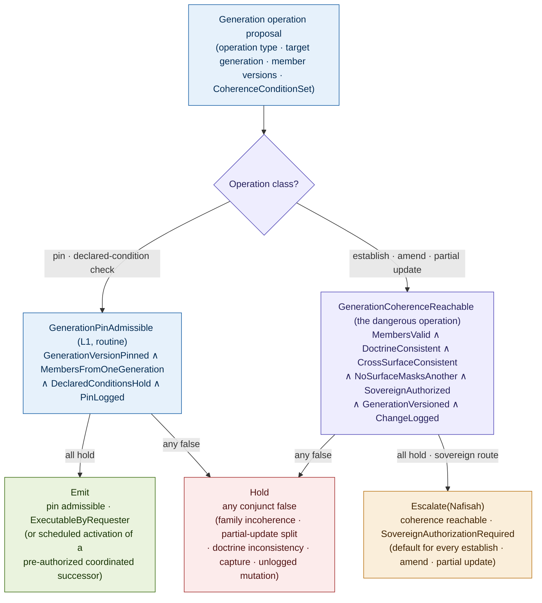
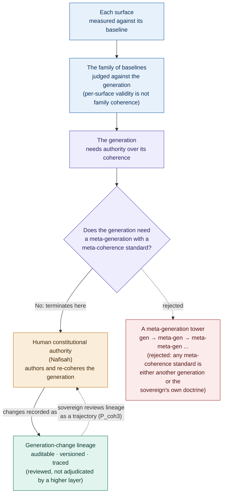
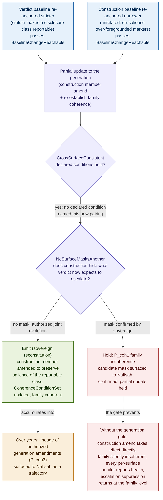

# Constitutional Coherence: Baseline Generations, Cross-Surface Consistency, and the Governance of Multi-Surface Drift

## Why the Coherence of the Standard-Set Is a Constitutional Object

### v1.2 Conceptual Architecture Paper, Companion 4 to Constitutional Runtime Computation v5.4; closure of the cross-baseline coherence dependency named in Constitutional Baselines v1.2

**Clarence "Faheem" Downs (Professor Bone Lab)**

*Licensed under CC BY 4.0.*

---

# Abstract

The third companion, Constitutional Baselines v1.2, governs baseline authority one surface at a time. Each monitored surface (verdict, store, construction, salience, compression, view) is judged against its own sovereign-anchored baseline, and whoever can move a surface's baseline controls whether that surface's drift is detectable. The companion closes the per-surface baseline-authority dependency completely, and it terminates the per-surface regress at the sovereign. But it leaves a dependency it names and does not close. The corpus does not have a baseline. It has a family of baselines, and per-surface validity does not guarantee family coherence.

This paper governs that. The central observation is that a set of individually authorized baselines can fail jointly in a way no per-surface gate detects. Each surface's baseline can be doctrine-grounded, current, and independent of its monitored process, while the set as a whole is mutually incoherent. The sharp case, named in Baselines v1.2 as Baseline Family Incoherence and held out of P_base4 version skew: a verdict baseline that has grown stricter, so more configurations must escalate, while a construction baseline has grown narrower, so ambiguity markers are de-salienced, each change individually authorized and doctrine-grounded, so that the construction surface now hides exactly the ambiguity the stricter verdict baseline expects to escalate. No per-surface baseline gate can see this, because each gate's scope is its own surface. The failure lives only in the relation between surfaces.

From this a principle follows rather than is asserted: the **Generation Coherence Principle**. Per-surface baseline authority is necessary but not sufficient, because the family can go incoherent while every member stays valid. Coherence is therefore not an emergent property of individually valid baselines. It is a governed object in its own right. The coherence of the baseline family must be a sovereign-authored constitutional object, the BaselineGeneration, with its own establishment, coherence, and change discipline; cross-surface coherence must be governed at the generation level rather than delegated to per-surface gates; and a generation change must be a typed, traced sovereign reconstitution act. Where the Baseline Sovereignty Principle vests authority over each measurement standard in the sovereign, the Generation Coherence Principle vests authority over the coherence of the standard-set in the sovereign, one level up.

The contribution is fivefold. First, the Generation Coherence Principle, derived through a chain from its predecessors. Second, the BaselineGeneration matured from scaffold into a full constitutional object with identity, member baselines, anchored doctrine version, declared coherence conditions, version and predecessor, and an independence property, together with a generation operation typology. Third, the formal contribution: GenerationCoherenceReachable, the coherence predicate whose load-bearing conjunct, NoSurfaceMasksAnother, formalizes the cross-surface non-masking property and is the part that makes this paper not a restatement of Baselines, paired with a lightweight GenerationPinAdmissible for the routine case, with the family-level L2 obligation CoherenceLineageSurfaced stated honestly. Fourth, a family of coherence-specific primitive failure topologies (P_coh) with the family-incoherence case traced end to end and a generation-level meta-drift classified honestly as the corpus's second sovereign-terminal primitive. Fifth, the unification of the corpus's per-surface baselines under one coherence account, with threshold governance and evidence-packet provenance disposed of as a clearly bounded out-of-scope residue. AEGIS serves as the worked domain. Nafisah remains the sovereign principal, Mantis the clinical reasoning agent, MEC the L2 monitor.

The baselines companion governed each standard. This companion governs the coherence of the standard-set.

---

## Contents

**Part I** The incoherent family and the Generation Coherence Principle
**Part II** The anatomy of a baseline generation
**Part III** The coherence predicate (GenerationCoherenceReachable and GenerationPinAdmissible)
**Part IV** Coherence and the regress termination
**Part V** Primitive failure topologies specific to coherence (P_coh)
**Part VI** Worked example: a generation in AEGIS
**Part VII** Who governs coherence?
**Part VIII** Related work
**Open problems** (coherence-specific, extending the parent's Section 19 and the three companions' sets)

---

# Part I. The Incoherent Family and the Generation Coherence Principle

Baselines v1.2 did its work and named the residue. It closed the per-surface baseline-authority dependency: each of the corpus's monitored surfaces is judged against its own baseline, every baseline is a sovereign-anchored constitutional object, and a change to any one is a typed, traced reconstitution governed by BaselineChangeReachable. It then said, in plain words, that this is not enough. A single surface's baseline is one object. The corpus has many surfaces, and their baselines must cohere as a set, not only individually. The companion scaffolded the object that should govern this, the BaselineGeneration, fixed its constitutional status, and named its open governance questions and its sharpest failure, Baseline Family Incoherence, as too central to fold into P_base4 and too broad to fully specify there. It pointed at this paper by name.

The structure of the residue is precise, and stating it precisely is what keeps this paper from being baseline authority again, at the family level. Baselines governs the standard on each surface. It does not, and by construction cannot, govern the relation between the standards on different surfaces. Each baseline gate is scoped to its own surface. The pin predicate's ScopeMatched conjunct localizes every measurement to the baseline for the surface it measures, and the change predicate evaluates a single surface's amend against that surface's doctrinal anchor. Nothing in the per-surface apparatus looks across surfaces, because nothing in it has standing to. What governs the verdict baseline says nothing about the construction baseline, and what governs the construction baseline says nothing about whether, jointly with the verdict baseline, it leaves a gap.

## The accounting

The accounting is exact, and it has a covered column and an uncovered column, exactly as the baselines accounting did.

| Surface and its baseline | Per-surface governance (Baselines v1.2) | Cross-surface coherence with the other surfaces |
|---|---|---|
| Verdict baseline | BaselineChangeReachable, BaselinePinAdmissible | Nothing, until this paper |
| Store baseline | BaselineChangeReachable, BaselinePinAdmissible | Nothing, until this paper |
| Construction baseline | BaselineChangeReachable, BaselinePinAdmissible | Nothing, until this paper |
| Salience baseline | BaselineChangeReachable, BaselinePinAdmissible | Nothing, until this paper |
| Compression-fidelity baseline | BaselineChangeReachable, BaselinePinAdmissible | Nothing, until this paper |
| View baseline | BaselineChangeReachable, BaselinePinAdmissible | Nothing, until this paper |

The covered column is per-surface baseline authority. Baselines built it completely: every surface's standard is sovereign-anchored, independent of the process it measures, versioned, and changed only by a typed sovereign act. The uncovered column is the coherence of the family. Every cell in it is empty. This paper governs the uncovered column. It adds no new per-surface gate. It governs the relation the per-surface gates cannot reach, because each gate, by the construction that makes it sound, sees only its own surface.

The distinction must be held against a tempting collapse. One might say the family is coherent if and only if every member is valid, so the per-surface gates already cover the family by covering each member. That is the error the whole paper exists to refute. A family of individually valid baselines can be jointly incoherent. The verdict baseline can be a flawless, doctrine-grounded standard for when a configuration must escalate. The construction baseline can be a flawless, doctrine-grounded standard for how a view is built. Both pass their own gates. And the two together can leave the system blind, because the construction standard, validly, no longer surfaces the ambiguity the verdict standard, validly, expects to act on. Neither baseline is wrong. The pairing is. Validity is a property of a member. Coherence is a property of the set, and a property of the set is not the conjunction of properties of its members.

## The Generation Coherence Principle, derived

The necessity here is not asserted. It follows from facts the corpus already establishes, in seven steps, in the manner of the Baseline Sovereignty Principle's derivation.

1. Each monitored surface is judged against its own baseline. This is the central result of Baselines v1.2: every surface has a sovereign-anchored baseline, and the per-surface gates govern each one.

2. The corpus has multiple surfaces, and what the system can detect is a joint function of the whole family of baselines, not of any one. Whether a given drift is visible depends on more than one surface's standard at once: an escalation-relevant condition can be expected by the verdict standard and surfaced, or hidden, by the construction standard. Detectability is a property of the family, not of a member.

3. A cross-surface failure exists only in the relation between surfaces, not within any single surface. When one surface's standard hides what another surface's standard expects to detect or escalate, the failure is located in neither standard. Each is valid on its own surface. The failure is the relation: the masking of one surface's expectation by another surface's setting.

4. No per-surface gate can see cross-surface incoherence, because ScopeMatched localizes each gate to its own surface by construction. The pin predicate binds every measurement to the baseline for the surface it measures, and the change predicate evaluates each amend against its own surface's anchor. A gate scoped to a surface cannot, without violating the scoping that makes it sound, evaluate a relation that spans surfaces. The per-surface apparatus is structurally blind to the cross-surface relation, not incidentally blind to it.

5. Therefore there is a class of failure, Baseline Family Incoherence, structurally invisible to the entire per-surface apparatus, however well each surface is individually governed. The class is not a gap in how the per-surface gates are built. It is outside what they can be built to see, because their soundness is exactly their per-surface scope.

6. Detecting and governing it requires a standard for the family as a whole, against which cross-surface coherence is judged. That standard is the BaselineGeneration: the jointly authorized, mutually coherent set of baseline versions across surfaces for a doctrine version. Just as drift on a surface has no meaning except relative to that surface's baseline, incoherence across the family has no meaning except relative to a standard for the family. The generation is that standard.

7. By the Baseline Sovereignty logic applied one level up, whoever can define or move the generation's coherence controls whether family incoherence is detectable. If the coherence standard tracks the surfaces it governs, the family reports coherent no matter how incoherent it has become, exactly as a baseline that walks with its surface reports zero drift. Therefore generation authority must be sovereign, the generation must be independent of the monitored surfaces, and a generation change must be typed and traced.

**The Generation Coherence Principle.** The coherence of the baseline family is a constitutional object. Per-surface baseline authority is necessary but not sufficient, because a set of individually authorized standards can fail jointly in a way no per-surface gate detects. Whoever can define or move the coherence of the standard-set controls whether family incoherence is detectable at all. Therefore the BaselineGeneration must be a sovereign-authored constitutional object with its own establishment, coherence, and change discipline; cross-surface coherence must be governed at the generation level rather than delegated to per-surface gates; and a generation change, like a baseline change, must be a typed, traced sovereign reconstitution act.

The Principle stands in a definite relation to the Baseline Sovereignty Principle, and naming the difference is what prevents a restatement. The Baseline Sovereignty Principle vests authority over each measurement standard in the sovereign and forbids the monitored process and the monitor from moving it. The Generation Coherence Principle does something different in kind. It vests authority over the coherence of the standard-set in the sovereign, and it establishes that coherence is not an emergent property of individually valid baselines but a governed object in its own right. Baselines governed the members. This governs the relation. The new thing is not a higher baseline. It is the cross-surface non-masking property: the formalization of what it means for a family to be coherent, and the gate that catches a family that is incoherent even though every member is valid. If the apparatus that follows found itself restating BaselineChangeReachable with generation substituted for baseline, it would have missed the contribution, because that would govern a higher member rather than the relation among members.

---

# Part II. The Anatomy of a Baseline Generation

Baselines v1.2 scaffolds the BaselineGeneration: it fixes the object's constitutional status (a sovereign-authored, versioned object whose change is a coordinated reconstitution) and names its open governance questions (what counts as one generation, who authorizes it, how a single-surface amendment interacts with the generation, whether partial generation updates are admissible, how cross-surface coherence is checked, and how generation-level reconstitution differs from surface-level re-anchoring). This part matures the scaffold into a full constitutional object, the way Baselines matured the Baseline from a static reference into a governed object with structure. The precedents are the RequiredObserveSet and the ObserveConstructionEnvironment from the retrieval companion and the Baseline from the baselines companion: each is sovereign-authored, versioned, pinned at use, and reconstituted rather than edited. The BaselineGeneration is the fourth object of that kind, and the highest, because it is the standard against which the coherence of all the others is judged.

## The generation as a constitutional object

A **BaselineGeneration** has the following constitutional structure.

**Identity and the surfaces it spans.** A generation is identified by the doctrine version it serves and the set of surfaces it spans. A generation that spanned a different surface set would govern a different family and could not be compared, version to version, with one that spanned the original set. The span is therefore part of the object: this generation, for these surfaces, anchored to this doctrine version. A surface that is not in the span is not governed by the generation, which is the seam at which a newly built surface joins (Open Problems).

**Member baselines.** A generation contains exactly one member baseline per surface in its span, each at a pinned version. The members are not copies of the surfaces' baselines; they are the specific baseline versions the sovereign authorized together as coherent. A surface's live baseline may move (by a per-surface amend) without the generation moving, and that is precisely the gap this paper governs: the live members can drift apart from the jointly authorized set. The generation records which member version of each surface's baseline it was established with.

**Anchored doctrine version.** A generation anchors to one doctrine version, and its members anchor to that same version. This is stronger than requiring each member to be doctrine-grounded, which Baselines already requires per surface. It requires the members to ground in one coherent doctrine version, so that the verdict standard and the construction standard are not each validly anchored to a different, individually authorized, mutually inconsistent reading of doctrine. The shared anchor is what makes coherence checkable against doctrine rather than against the surfaces themselves.

**Declared coherence conditions.** A generation carries an explicit, enumerable set of cross-surface coherence conditions, the **CoherenceConditionSet**: the constraints that make the member baselines jointly valid, authored by the sovereign at establishment. A coherence condition is a relation across two or more surfaces, for example that the construction baseline must preserve the salience of any disclosure class the verdict baseline marks escalation-required, or that the compression-fidelity baseline must not erase an uncertainty marker the verdict baseline treats as escalation-triggering. The CoherenceConditionSet is doctrine: it is sovereign-authored, versioned with the generation, and pinned at use. It is the object CrossSurfaceConsistent (Part III) evaluates against, and its full population across a domain is, like the RequiredObserveSet's, doctrine-authoring work named in the open problems. What is fixed here is its status and its role: the declared conditions are the closed part of coherence, and they are deliberately distinct from the open non-masking property the predicate also requires.

The conditions are not free text. A **CoherenceCondition** has a preliminary grammar, enough to make CrossSurfaceConsistent a real check rather than a placeholder and to mark which conditions are mechanically checkable: the surfaces it relates, as an ordered pair or set with a direction, so that "construction must preserve what verdict marks escalation-required" is distinct from its converse; the protected signal class it governs, such as a disclosure class, an uncertainty marker, or an escalation trigger; the preservation relation the protected signal must satisfy across the related surfaces, such as preserve salience, preserve presence, preserve fidelity, or do not reclassify; the masking-risk type it guards against, drawn from a closed vocabulary of omission, de-salience, compression, reclassification, and delay; the surface behavior it requires and the exceptions it allows; a priority, for when conditions conflict; the doctrine version under which it is effective; its check method, structural or doctrinal, which determines whether DeclaredConditionsHold can evaluate it at L1 or must route it to the sovereign (Part III); and its escalation behavior when violated. This grammar is preliminary and is not the closure of the condition language. The full formalization, what the complete grammar of a cross-surface coherence condition is and how far it can be made mechanically checkable without pretending to close the open non-masking space, is named in the open problems. What the grammar fixes now is that a declared condition is a typed object with a check method, so that CrossSurfaceConsistent evaluates structured conditions and the routine pin knows which conditions it has standing to certify. Two cautions attach. The structural-or-doctrinal tag is itself a validation surface: a condition that is doctrinal but mistakenly tagged structural would let L1 certify a coherence judgment it has no authority to make, so the correctness of each condition's check-method tag is a standing validation requirement, not a free annotation. And the declared side must not be read as a complete enumeration of coherence relations: the grammar makes the declared conditions checkable, not exhaustive, and treating a passing CrossSurfaceConsistent as proof of family coherence is precisely the false stability NoSurfaceMasksAnother exists to prevent. The grammar is a floor, and it is preliminary by design.

**Version and predecessor generation.** A generation carries a version and a reference to the generation it succeeds. Generations are never edited in place. A new generation is a versioned successor that records its predecessor and its migration effect on in-flight measurements and on the member baselines, exactly as a baseline is a versioned successor and a schema change is a new constitution version. In-place mutation of a generation would be indistinguishable, after the fact, from the family drifting apart, which is the failure the generation exists to make visible.

**Independence property.** The generation's coherence cannot be defined by, and cannot be moved by, the monitored surfaces it governs. This is the Baseline independence property lifted to the family. A generation whose coherence conditions were derived from the current joint behavior of the surfaces would report coherent by construction, because the standard would track the surfaces, exactly as a baseline derived from its monitored distribution reports zero drift. Independence at the generation level means the coherence standard is anchored to doctrine about how the surfaces should relate, not to how they currently do relate. A coherence standard that is a function of the surfaces it judges is no coherence standard.

## The operation typology

Generation operations divide by the governance each requires, exactly as baseline operations do and as memory operations do. The class determines the authority, the predicate, and the failure surface.

| Operation | What it changes | Governance required |
|---|---|---|
| Establish | Authors a coherent generation across surfaces from one doctrine version | Sovereign authorization; the founding act |
| Pin or check | Binds a measurement to a generation version, or verifies declared coherence | Routine, L1-decidable, low authority |
| Amend the generation | Changes the coherence of the standard-set | Sovereign authorization; the dangerous act |
| Partial update | Amends one member baseline and re-establishes generation coherence | Sovereign authorization; the case Baselines flagged open |
| Version or snapshot | Records a generation state as a versioned successor | Substrate-mediated under sovereign-versioned doctrine |
| Retire or supersede | Ends a generation's authority, naming its successor | Sovereign authorization |

**Establish** is the founding act. It authors a coherent generation: it selects the member baseline versions across surfaces, anchors them to one doctrine version, and declares the CoherenceConditionSet that makes them jointly valid. It is sovereign because the joint anchor is a doctrinal determination about how the surfaces should relate, not merely about each surface alone. Establishment fails if the coherence conditions are drawn from the current joint behavior of the surfaces rather than from doctrine, which is the establishment-time form of generation capture.

**Pin or check** is the routine operation, and it has two routine forms. A measurement pins a generation version, so that its per-surface measurements are computed against member baselines drawn from one jointly authorized set rather than from a mismatched assortment. Separately, a coherence check re-verifies that the generation's declared CoherenceConditionSet still holds for the current member versions. Both are L1-decidable and low authority: pinning binds a measurement to a generation version, and the declared-condition check evaluates a closed set of declared constraints. Neither re-judges the open non-masking property, which is never routine. The distinction inside check matters and is returned to in Part III: verifying the declared conditions is routine; re-judging whether the family is non-masking is sovereign.

**Amend the generation** is the dangerous operation, and it is categorically different from check in the way a baseline amend is categorically different from a pin. An amend changes the coherence of the standard-set: it re-selects member versions, re-anchors the doctrine version, or re-authors the CoherenceConditionSet, and after it every cross-surface coherence judgment is made against a different generation. An amend is therefore not a measurement and not a routine check. It is a reconstitution of the family's coherence, admissible only under sovereign authorization, and it is the operation GenerationCoherenceReachable governs.

**Partial update** is the case Baselines flagged as open, and it is the most delicate. A partial update amends one member baseline, which has passed its own BaselineChangeReachable gate, and must then re-establish the coherence of the generation it belongs to. The interaction is the crux of this paper's relation to its parent: a surface amend that passed its own per-surface gate must not, by that fact, take effect in the generation. It takes effect only when generation coherence is re-established with the new member, which requires GenerationCoherenceReachable to hold for the amended family, including the open NoSurfaceMasksAnother conjunct. A surface amend that is per-surface valid but breaks family coherence is admissible on its surface and inadmissible in the generation, and the generation gate holds it. This is exactly the failure that no per-surface gate can catch, and the partial-update operation is where the catch is made. A partial update is therefore, by default, a sovereign operation: it carries a fresh cross-surface coherence judgment about the amended family.

The partial update has a lifecycle, and stating it explicitly resolves the question of what a per-surface-valid amend does to the family while generation coherence is pending. The states are: the surface amend is **proposed**; it is **surface-reachable** once it passes its own BaselineChangeReachable gate; a **generation update is pending** when a surface-reachable amend is submitted as a partial update; generation coherence is **held** while GenerationCoherenceReachable is evaluated for the amended family, and during the hold the amend is **staged but not family-effective**, meaning it is a valid proposal on its surface that does not yet participate in any family-level measurement; if the family is non-masking, a **generation successor is authorized**, and where the sovereign pre-authorized a coordinated successor its **activation is scheduled** and the generation then **emits**; if the family is masking, the amend is **held or demoted**, returned to its surface as a valid proposal the generation declined to make family-effective. The governing rule across the lifecycle is one doctrine sentence: a per-surface amend that fails generation coherence may be valid as a surface proposal but is not family-effective, and measurements remain pinned to the last coherent generation until a successor generation emits. This answers the operational question directly. The surface amend is not destroyed by a coherence failure, and it is not silently made live for its surface while the family lags behind it. It is staged outside the family, family-level measurements continue against the last coherent generation, and the amend becomes effective only when a coherent successor generation that includes it emits. A surface that needs its amend live in isolation, ahead of family re-coherence, is a deliberate sovereign decision to run that surface against the new standard while pinning family measurements to the prior generation, recorded as such, not a default the partial update grants. This exceptional mode is named, because an unnamed exception is an ungoverned one. An **Isolated Surface Activation** is a sovereign-authorized state in which a per-surface baseline becomes locally active before the family generation is re-cohered, creating a temporary dual standard: the staged new standard on its own surface, and the prior coherent generation for family-level measurement. It carries its reason for isolation, a duration or review window, the affected measurements, an explicit warning that family-level drift signals remain predecessor-relative for its duration (a measurement read during the activation is read against the prior generation, not the staged surface standard), and a mandatory generation-reconciliation deadline by which a coherent successor generation must emit or the activation is withdrawn. It is recorded in the generation's compatibility record as an exception, so that no measurement taken under it is later mistaken for a family-coherent reading. The default remains that a staged amend is not surface-live; the Isolated Surface Activation is the governed, logged exception to that default, never an implicit consequence of a per-surface gate passing.

**Version or snapshot** records a generation state as a clean versioned successor and is the mechanism that makes amend and partial update traceable. It is substrate-mediated under sovereign-versioned doctrine, because the discipline of clean succession is doctrinal while the individual snapshot is a mechanical recording of a sovereign-authorized state.

**Retire or supersede** ends a generation's authority, naming its successor, so that no measurement is left pinning a generation with no standing and so that the retired generation's lineage persists for the interpretation of historical coherence judgments. It defaults to supersession with a named successor rather than deletion, for the same non-repudiation reason the baseline and memory companions default to retained tombstones.

The typology's center of gravity is the distinction between check and amend, and within that, the partial-update case, because the partial update is the operation at which a per-surface-valid change meets the family-coherence gate. A check verifies declared coherence. An amend, including a partial update, re-judges coherence, and a partial update re-judges it for a change that already passed its own surface. The entire predicate apparatus of Part III turns on keeping the routine declared-condition check apart from the sovereign non-masking judgment, because the failure that defeats the corpus's per-surface baseline architecture is a surface amend that is locally valid and jointly incoherent.

## The version-amend boundary and scheduled activation, at the generation level

The version-amend boundary that Baselines drew for a single baseline lifts to the generation, with one added subtlety. The Generation Coherence Principle forbids any non-sovereign component from deciding the coherence of the standard-set. It does not forbid the substrate from mechanically activating a generation the sovereign already authorized. A sovereign may pre-authorize a coordinated generation successor: the full set of member versions, the doctrine version, the CoherenceConditionSet, and an effective condition, with the cross-surface non-masking judgment already made in advance. On the effective condition the substrate rolls the generation from version n to version n+1, activating a coherence the sovereign already judged. This is a generation-level **scheduled activation**, and it is substrate-executable, because the coherence judgment it executes is not fresh.

The added subtlety is that a partial update is the one operation that most tempts a non-sovereign coherence judgment, because it looks like the mechanical consequence of a per-surface amend that already passed its gate. It is not. A per-surface amend decides a surface's standard; it does not decide whether the amended family is non-masking. Re-establishing generation coherence after a surface amend is a fresh cross-surface judgment, and it is never substrate-executable unless the sovereign pre-authorized the coordinated successor as a whole. The discriminating line is the same one Baselines drew, delegation of judgment versus execution of a prior sovereign act, applied to the coherence judgment rather than the baseline judgment: a generation pin or declared-condition check may be routine, a scheduled activation of an already-authorized generation successor may execute, and a partial update that re-judges non-masking at runtime may not.

---

# Part III. The Coherence Predicate

This is the paper's formal contribution. The thesis is that a generation change is a governed constitutional transition over the coherence of the standard-set, and the formal object must govern that coherence, not restate the per-surface baseline authority the corpus already has. If the apparatus below found itself re-describing BaselineChangeReachable with generation in place of baseline, it would have failed to close the gap, because BaselineChangeReachable governs a single surface's standard and this paper governs the relation across surfaces. The two predicates here govern operations on the coherence of the family, not on any member.

Two predicates are needed because the typology has two governance grades. A generation pin and a declared-condition check are routine and frequent; establishing or amending a generation is dangerous and rare. A single predicate would either over-govern the pin or under-govern the amend.

## The coherence proposal and its objects

A **GenerationCoherenceProposal** carries: the operation type (establish, amend, partial update); the target generation and its predecessor reference; the member baseline versions across the spanned surfaces; the doctrine version the members anchor to; the declared CoherenceConditionSet; and, for a partial update, the single member amend that triggered it together with that amend's own BaselineChangeReachable record. The proposal is the typed object the generation gate adjudicates, and it sits inside a small object model the predicates presuppose: the BaselineGeneration (Part II), the CoherenceConditionSet (the declared cross-surface constraints), the GenerationLineage (the ordered, reconstructable sequence of a family's generations, the object CoherenceLineageSurfaced presents and P_coh3 reviews), and the cross-surface evidence behind NoSurfaceMasksAnother, the CrossSurfaceMaskingAnalysis defined below.

## The pinning predicate

The lightweight predicate governs the routine operation. It is L1-decidable and runs on every measurement.

```
GenerationPinAdmissible(γ) ⟺
  GenerationVersionPinned(γ) ∧ MembersFromOneGeneration(γ) ∧ DeclaredConditionsHold(γ) ∧ PinLogged(γ)
```

- **GenerationVersionPinned(γ):** the measurement names a specific, existing generation version, not a live or unversioned reference. This is the generation analogue of the baseline pin's VersionPinned, and it is what makes a coherence judgment reproducible against a named generation.

- **MembersFromOneGeneration(γ):** the per-surface baseline versions the measurement pins all belong to the named generation. A measurement that pins a verdict baseline from generation n and a construction baseline from generation n+1 fails. This is the conjunct that catches a measurement straddling generations at measurement time, and it is the routine guard against P_coh2 partial-update split expressing as a measurement error.

- **DeclaredConditionsHold(γ):** the mechanically checkable conditions in the generation's declared CoherenceConditionSet evaluate true for the pinned member versions. The conjunct is restricted, deliberately, to the structurally encoded conditions, because not every declared condition is mechanically decidable. The CoherenceConditionSet (Part II) tags each condition by its check method: a structurally encoded condition can be evaluated at L1 over the member versions, while a doctrinally encoded condition requires sovereign interpretation. DeclaredConditionsHold is therefore **DeclaredStructuralConditionsHold**: it verifies the structural conditions and certifies them when they hold. A declared condition tagged doctrinal is not silently passed and is not adjudicated at L1; it is **DeclaredDoctrinalConditionsHold**, which the pin has no authority to decide, so a generation carrying an unverified doctrinal declared condition routes that condition to escalation rather than letting the pin certify a coherence it cannot evaluate. This keeps L1 from overclaiming: the routine pin governs the routine, mechanically checkable conditions, and a doctrinal declared condition is sovereign-routed exactly as the open non-masking property is. It does not evaluate the open non-masking property, which is never routine; it verifies only the structural declared conditions, and routes the doctrinal ones.

- **PinLogged(γ):** the pin is recorded with the generation version, the spanned surfaces, the pinned member versions, the measurement window, and the detector version, so that any coherence judgment can be replayed against the exact generation and instruments that produced it.

A generation pin is, by default, ExecutableByRequester: a coherent measurement pins a generation version, verifies the declared conditions, and proceeds without escalation. Pinning and the declared-condition check are the routine generation operations.

## The coherence predicate

The dangerous operation is establishing or amending a generation, including a partial update. Its predicate is the heart of the paper.

```
GenerationCoherenceReachable(γ) ⟺
  MembersValid(γ)            ∧
  DoctrineConsistent(γ)      ∧
  CrossSurfaceConsistent(γ)  ∧
  NoSurfaceMasksAnother(γ)   ∧
  SovereignAuthorized(γ)     ∧
  GenerationVersioned(γ)     ∧
  ChangeLogged(γ)
```

- **MembersValid(γ):** each member baseline in the generation is itself a current, authorized baseline, BaselineChangeReachable-valid on its own surface. This is the per-surface floor, and it is what makes coherence build on baseline authority rather than replace it. A generation cannot be coherent over invalid members; the members must first pass their own gates. MembersValid imports the per-surface result so that the coherence predicate governs the relation among valid members, not the members themselves.

- **DoctrineConsistent(γ):** the members anchor to one coherent doctrine version and read it compatibly. This conjunct decomposes into two sub-conditions of different decidability, and naming them apart is what keeps version agreement from masquerading as interpretive agreement. **DoctrineVersionAligned** is the decidable part: every member anchors to the same doctrine version, so a generation whose verdict member anchors to version N and whose construction member anchors to a superseded version M fails here, even if each member is individually grounded. **DoctrineInterpretationCoherent** is the deep part: the members do not encode mutually incompatible interpretations of that one version. Two members can anchor to the same version and still read it incompatibly, for instance a verdict member that treats a class of ambiguity markers as escalation-triggering and a construction member that, under the same doctrine version, treats the same markers as low-salience background outside narrow cases. Version agreement does not detect that; interpretive coherence is a doctrinal judgment and routes to the sovereign. DoctrineConsistent thus forbids assembling a generation from members grounded in different doctrine versions, decidably, or in incompatible readings of one version, by sovereign judgment. The interpretive sub-condition is a near neighbor of NoSurfaceMasksAnother: an interpretive incompatibility that has not yet produced an observed mask is the latent form of what NoSurfaceMasksAnother catches once the incompatibility becomes a realized cross-surface mask. The boundary between the two is stated crisply, to forestall double-adjudicating one issue as two failures. DoctrineInterpretationCoherent governs meaning alignment: whether the member baselines encode compatible readings of the same doctrine. NoSurfaceMasksAnother governs operational availability: whether the relation among the surfaces, as set, hides expected detection or escalation. A family can be interpretively aligned and still mask operationally, and a family flagged for interpretive incompatibility may not yet mask anything, so the two are evaluated as distinct conjuncts. A partial update that implicates both is recorded against both rather than collapsed into one, so the lineage shows whether the sovereign judged a meaning conflict, an operational mask, or both.

- **CrossSurfaceConsistent(γ):** the generation's declared CoherenceConditionSet holds for the member versions. This is the structural, decidable part of coherence: the closed, enumerable set of cross-surface constraints the sovereign authored at establishment evaluates true. CrossSurfaceConsistent is to coherence what the structural conjuncts of BaselineChangeReachable are to a baseline change: it narrows the space by checking the declared conditions, and it leaves the deep judgment to the next conjunct.

- **NoSurfaceMasksAnother(γ):** the load-bearing conjunct, and the one that makes this paper not a restatement of Baselines. No member standard is set such that its surface hides what another member's surface expects to detect or escalate, whether or not a declared condition named that surface pair. This is the formalization of Baseline Family Incoherence and the cross-surface non-masking property. It differs from CrossSurfaceConsistent in exactly the way DoctrineGrounded differed from the structural conjuncts of the baseline change predicate: CrossSurfaceConsistent checks the conditions the sovereign declared, NoSurfaceMasksAnother asks the open question the declared conditions could not anticipate. The space of ways one surface can hide what another expects is not fully enumerable in advance, because a re-anchoring undertaken on one surface for an unrelated, legitimate reason can create a masking relation no prior condition named. NoSurfaceMasksAnother quantifies over surface pairs and asks, for each, whether one surface's standard, as now set, hides what the other surface's standard, as now set, expects to surface. It binds doctrinal judgment about what each surface expects and is, in general, undecidable. Where it cannot be conclusively evaluated, the generation change routes to escalation rather than emit, exactly as DoctrineGrounded and Admissible do. NoSurfaceMasksAnother is what coherence-as-non-masking means, and it is the conjunct a restatement of Baselines would not contain, because no per-surface predicate quantifies over surface pairs. The evidentiary object over which this conjunct is evaluated, the CrossSurfaceMaskingAnalysis, is defined immediately below.

- **SovereignAuthorized(γ):** the generation change traces to sovereign authorization, not to any monitored surface, any monitor, or an automated coherence-reconciliation routine. The conjunct forbids the family from authoring its own coherence. A routine that re-establishes coherence by reconciling the surfaces to whatever they currently are is the monitored family moving the standard through a mechanism, which is generation capture; the only valid source of the change is the sovereign.

- **GenerationVersioned(γ):** the new generation records its predecessor generation, declares its migration effect on in-flight measurements and on the member baselines, declares a compatibility rule for coherence judgments made against the predecessor, and is a clean versioned successor with no in-place mutation. Any Isolated Surface Activation (Part II) in effect during the generation's window is recorded in the compatibility record as an exception, so that measurements taken under it are interpretable against the correct standard rather than mistaken for family-coherent readings. A generation that changed by editing the live coherence conditions would be indistinguishable, after the fact, from the family quietly drifting apart.

- **ChangeLogged(γ):** the change is traced distinctly from a measurement and from a per-surface baseline change, in the governance exposure log, as a generation reconstitution event referencing its predecessor generation, its member amends, and the coherence rationale. A generation change must never appear in the log as, or be confusable with, a pin, a declared-condition check, or a single-surface amend.

## The evidentiary object behind NoSurfaceMasksAnother

NoSurfaceMasksAnother is undecidable in general and routes to the sovereign, but routing a bare verdict to the sovereign is not enough. The sovereign judges a mask against evidence, and the evidence must be a typed object, so that the judgment is reproducible and auditable rather than a free-text artifact the monitored surfaces could shape. That object is the **CrossSurfaceMaskingAnalysis**, the record a cross-surface coherence audit produces for each candidate mask and presents for sovereign judgment. It carries: the masking surface and the potentially masked surface, as an ordered pair, because masking has a direction; the detection or escalation class the masked surface expects to act on; the specific marker or signal the masked surface relies on to engage that class; the transformation or baseline setting on the masking surface that bears on that marker; the manner of the candidate mask, drawn from the same closed vocabulary the condition grammar uses (omission, de-salience, compression, reclassification, delay); the evidence supporting the candidate, including the member versions and the cross-surface trace; the declared CoherenceConditionSet coverage, that is, whether any declared condition named this surface pair and protected class or whether the candidate falls in the open space no condition anticipated; the sovereign judgment status (surfaced, confirmed mask, confirmed authorized re-balancing); and the remediation path taken if confirmed.

The analysis does not decide the mask. It is what makes NoSurfaceMasksAnother evaluable: it turns the open conjunct from a doctrine sentence into a predicate over a typed object the sovereign adjudicates, with the genuinely undecidable residue, whether a surfaced candidate is a mask or an authorized re-balancing, isolated as the single field only the sovereign may set. The audit populates every field except the judgment; the sovereign sets the judgment. This is the same discipline the corpus applies to every undecidable conjunct: the mechanical layer prepares the evidence and names the boundary, and the sovereign decides at the boundary. How an audit generates candidate masks in the first place, the detection that populates the candidate at all, is the measurement-side dependency named in the open problems; the CrossSurfaceMaskingAnalysis is what the audit fills and the sovereign reads, not the algorithm that finds candidates.

## CrossSurfaceConsistent versus NoSurfaceMasksAnother

The distinction between these two conjuncts is the spine of the contribution, so it is stated plainly. CrossSurfaceConsistent is closed and decidable: it checks a declared, enumerable set of conditions. NoSurfaceMasksAnother is open and, in general, undecidable: it asks whether any masking relation exists across the family, including relations no declared condition anticipated. A generation can satisfy every declared condition and still mask, because the masking was created by a surface amend whose interaction with another surface no condition had named. This is precisely the worked example's case: a construction baseline re-anchored narrower for an unrelated, legitimate reason satisfies the declared conditions that were written before the narrowing was contemplated, yet it masks the ambiguity the newly stricter verdict baseline expects to escalate. CrossSurfaceConsistent passes. NoSurfaceMasksAnother fails. Without the second conjunct, the predicate would be a check of declared conditions, which is a useful floor and not the governance of coherence. With it, the predicate governs the property that coherence actually is: that no surface hides what another expects, declared or not.

## The verdict structure and authority statuses

The two predicates compose with executability using the corpus authority statuses (ProposalWellFormed, AuthorityRouteable, ExecutableByRequester, PreAuthorizedClassExecutable, SovereignAuthorizationRequired).

| Operation | Predicate | Executability | Verdict |
|---|---|---|---|
| Generation pin or declared-condition check | GenerationPinAdmissible | ExecutableByRequester | **Emit** |
| Establish or amend generation | GenerationCoherenceReachable | not executable by requester; SovereignAuthorizationRequired | **Escalate(target = Nafisah)** |
| Partial update | GenerationCoherenceReachable | SovereignAuthorizationRequired, unless a scheduled activation of a pre-authorized coordinated successor | **Escalate(target = Nafisah)**, or **Emit** on scheduled activation |
| Pin or check (any conjunct false) | GenerationPinAdmissible | any | **Hold(cause)** |
| Establish, amend, or partial update (any conjunct false) | GenerationCoherenceReachable | any | **Hold(cause)** |

A generation pin and a declared-condition check are routine and emit. A generation establishment or amendment is, by default, SovereignAuthorizationRequired and escalates to Nafisah; it is never ExecutableByRequester for a surface, a monitor, or a coherence-reconciliation routine, because that would be generation capture. A partial update is SovereignAuthorizationRequired by default, because it carries a fresh non-masking judgment about the amended family, and it is substrate-executable only as the scheduled activation of a coordinated successor the sovereign already authorized, where the non-masking judgment was made in advance. There is no PreAuthorizedClassExecutable path that lets a non-sovereign component decide the coherence of the standard-set at runtime, for the same reason Baselines admits no delegated baseline-change class: a delegated coherence-reconciliation class is a standing delegation of judgment over the coherence of the family, which the Principle forbids.

## The unusual L2, lifted one level

The baseline-fidelity L2 obligation was already unusual: BaselineLineageSurfaced cannot ground in a higher baseline without restarting the regress, so it surfaces the baseline-change lineage rather than measuring against a meta-baseline. The coherence-fidelity L2 obligation is unusual in the same way, one level up, and the difference must be stated rather than hidden. There is no meta-generation against which to measure a generation's coherence. A coherence standard above the generation would be either another generation (restarting the regress) or the sovereign's own doctrine (which is what the generation already encodes).

The coherence-fidelity L2 obligation, **CoherenceLineageSurfaced**, therefore does not adjudicate a generation against a higher coherence standard. It surfaces the generation-change lineage to the sovereign: the sequence of generations, each with its member set, its doctrine anchor, its CoherenceConditionSet, and its change rationale, presented for review. It does not compute a coherence signal against a meta-generation, because there is none. It makes the generation history legible. As with BaselineLineageSurfaced, one adequacy condition is load-bearing enough to state here because P_coh3 turns on it: lineage surfacing is complete only when the sovereign reviews the lineage as a lineage, the cumulative trajectory of generations, not merely the latest generation amendment. A review that adjudicates each generation change in isolation never sees generation meta-drift, because every individual amendment was coherent when authorized; only review of the trajectory can see where the authorized generations have walked the family's coherence. Its trigger classes parallel BaselineLineageSurfaced's: a periodic review trigger, a change-count trigger, a cumulative-coherence-shift trigger, a high-impact-surface trigger (any generation change touching a surface the sovereign marked high-impact, such as mandated reporting), a sovereign-requested review, an external doctrine-update trigger, and a post-incident trigger (a detected P_coh1 or P_coh2 forces a full generation-lineage review). The thresholds are sovereign-owned constitutional parameters, not monitor-owned tuning knobs, for the same reason as at the baseline.

## Note on decidability

Following the corpus pattern, the conjuncts split. GenerationVersionPinned, MembersFromOneGeneration, PinLogged, GenerationVersioned, and ChangeLogged are mechanically decidable: they evaluate over the generation's version record, member set, and the governance log. DeclaredConditionsHold is decidable over the structurally encoded conditions of the CoherenceConditionSet (its DeclaredStructuralConditionsHold part) and routes any doctrinally encoded declared condition to the sovereign (its DeclaredDoctrinalConditionsHold part), so the routine pin never certifies a coherence judgment that requires interpretation. MembersValid is decidable insofar as each member's own gate is, inheriting the parent's split (its members' DoctrineGrounded conjunct is the undecidable part, already routed to the sovereign per surface). DoctrineConsistent splits along its two named sub-conditions: DoctrineVersionAligned is a decidable version-agreement check, and DoctrineInterpretationCoherent is undecidable in general (whether the members encode compatible readings of the one doctrine version), routing the deep form to the sovereign. CrossSurfaceConsistent is decidable against the declared CoherenceConditionSet. NoSurfaceMasksAnother is the undecidable conjunct, for the same reason the parent's DoctrineGrounded and the core's Admissible are undecidable: whether any surface masks what another expects binds doctrinal judgment over an open space of cross-surface relations and may resist mechanical evaluation. Where it cannot be conclusively evaluated, the change routes to escalation rather than emit, which is correct, because the undecidable region of the coherence judgment is exactly the region in which sovereign authority over the coherence of the standard-set becomes necessary. The decidable conjuncts narrow the space; NoSurfaceMasksAnother names the boundary at which sovereignty over coherence is required.

**Figure 1. The two generation predicates and their verdict paths**



*A generation pin and a declared-condition check are routine and emit. Establishing or amending a generation, including a partial update, is a reconstitution of the family's coherence and escalates to the sovereign by default, with no pre-authorized class that collapses it into an emit. NoSurfaceMasksAnother is the load-bearing conjunct: it holds when the family is non-masking and fails when one surface hides what another expects, which is the failure no per-surface gate can see and the conjunct that distinguishes this predicate from a restatement of the baseline change predicate.*

---

# Part IV. Coherence and the Regress Termination

Baselines terminated a regress at the sovereign: L1 needs a constitution, L2 monitors L1 against a baseline, the baseline needs authority, and the chain does not continue to an L3 with a meta-baseline because it terminates in human constitutional authority by design. This paper raises the same question one level up, and answers it the same way, because the structure is the same.

The new regress is real and must be stated at full strength. Each surface has a baseline, governed per surface. The family of baselines must cohere, governed by the generation. The generation's coherence needs authority, because whoever can move the generation's coherence controls whether family incoherence is detectable. Does the generation therefore need a meta-generation, whose coherence is measured against a meta-meta-generation, without end?

It does not, and the reason is structural rather than convenient. The generation is itself a sovereign-anchored object. Its coherence is anchored to doctrine about how the surfaces should relate, not to a higher coherence standard, and there is no higher coherence standard that the sovereign did not author. Any candidate meta-generation is either another generation, which restarts the regress, or the sovereign's own doctrine, which is what the generation already encodes. So the chain terminates at the sovereign, exactly where Baselines said the whole architecture terminates. The generation is the last mechanical object in a chain that is now two levels deep: the surface is measured against its baseline, the family of baselines is judged against the generation, and the generation is reviewed by the sovereign through its lineage rather than measured against anything higher.

Two things make this termination load-bearing rather than a loose end, paralleling the baseline case. First, the sovereign's generation changes are auditable without being adjudicated. The generation-change lineage is fully reconstructable: every establish, amend, and partial update recorded its predecessor generation, its member set, its doctrine anchor, its CoherenceConditionSet, and its rationale. An external auditor can review whether each generation change cohered with doctrine. That is real accountability, and it is not mechanical adjudication against a meta-generation, which it does not need to be. Second, the terminal primitive of this family, P_coh3 generation meta-drift (Part V), is the object that proves the termination holds. P_coh3 is the failure in which a sequence of individually coherent generation amendments cumulatively loses coherence, and its only detector is sovereign review of the generation lineage. It does not point to a missing meta-generation. It points to the sovereign, and it is the corpus's second sovereign-terminal primitive, after P_base5, which is exactly what one should expect: a second regress, terminated by the same kind of primitive, one level up.

## The legitimate case: doctrine evolves across surfaces together

The coherence gate is not an instrument for freezing the family. Doctrine evolves, and it evolves across surfaces together. A statutory change can make a class of disclosure reportable, which legitimately moves the verdict baseline stricter and, coherently, requires the construction baseline to keep surfacing the markers of that class. An authorized generation amendment that re-anchors several surfaces together to a new doctrine version, with a CoherenceConditionSet updated to match, is good governance, and it should pass GenerationCoherenceReachable cleanly. The gate does not exist to prevent the family from ever moving. It exists to distinguish authorized joint evolution of the standard-set from family incoherence.

This is the same distinction the prior gates draw, lifted to the family. The memory gate distinguishes learning from contamination. The construction gate distinguishes faithful focusing from constructional distortion. The baseline gate distinguishes authorized re-anchoring from drift-laundering. The coherence gate distinguishes authorized joint evolution from family incoherence: a generation amendment whose surfaces move together coherently, with NoSurfaceMasksAnother holding for the new family, crosses; a set of individually authorized surface changes whose joint effect masks, with NoSurfaceMasksAnother failing, is held. In all four, the gate is not the enemy of change. It is the structure that tells endorsed change apart from unauthorized displacement, and at the generation that distinction governs whether the family of standards, by which every other distinction in the corpus is judged, holds together.

**Figure 2. The regress terminates at the sovereign, one level up**



*The chain surface to baseline to generation is forced. The next link is not a meta-generation tower but the sovereign. The termination is load-bearing because the sovereign's generation changes are auditable through their lineage (real accountability) without being adjudicated by a higher mechanical layer (which would restart the regress). P_coh3 is the primitive that proves it: its only detector is sovereign review of the generation lineage as a trajectory. This is the corpus's second regress termination, one level up from the baseline.*

---

# Part V. Primitive Failure Topologies Specific to Coherence

The parent's P architecture decomposes each constitutional stability domain into primitives, the smallest independently governable failure mechanisms, and Baselines extended it with a strict discipline: a mechanism that spans the family, the generation, and the sovereign is a compound topology, not a primitive, and a primitive that cannot be measured against a higher standard is a named sovereign-terminal class rather than a failed ordinary primitive. The P_coh family below honors both. Its members are new P objects unified by their locus at the family of standards, cross-cutting the parent's Q domains: each is a way the coherence of the family fails, distinct from the ways a single baseline fails. The cross-surface loop in which they compound is named separately, as a topology.

One classification point is made before the family, because P_coh3 strains the ordinary measurability standard exactly as P_base5 did. An ordinary primitive is measured against a baseline or a declared condition set. A sovereign-terminal primitive is independently identifiable and independently governable but not independently measurable against a higher standard, because such a standard would restart the regress; its detectability standard is lineage legibility and sovereign review. P_base5 was the corpus's first sovereign-terminal primitive, at the baseline regress terminus. P_coh3 is the second, at the generation regress terminus. Naming it as such is what lets it sit honestly in the P architecture: it does not fail the measurability standard, it belongs to the named category that lives at a regress terminus, now the second one.

**P_coh1: Family Incoherence.** Individually valid baselines are mutually incoherent: one surface's standard, validly set, hides what another surface's standard, validly set, expects to detect or escalate. Each member passed its own gate. The incoherence exists only in the relation between surfaces. This is the failure NoSurfaceMasksAnother is defined to catch, and it is distinct from every P_base member, because every P_base member is a property of a single baseline operation on a single surface, while P_coh1 is a property of the relation across surfaces that no single-surface operation exhibits. P_coh1 is a **hybrid primitive**: it has a structural component, the violation of a declared CoherenceCondition, which is mechanically detectable, and a sovereign component, the open non-masking judgment, which is not. The structural component is caught by CrossSurfaceConsistent and the declared-condition check; the sovereign component is caught only by NoSurfaceMasksAnother routed to the sovereign. Classifying it as hybrid fixes its instrumentation standard: the declared-condition part is audited mechanically, and the open-masking part is surfaced to the sovereign, never resolved by the instrument. Detection signature: a generation, or a partial update producing one, in which the declared conditions hold (CrossSurfaceConsistent passes) yet a cross-surface masking relation exists (NoSurfaceMasksAnother fails). Recovery: the incoherent generation, or the surface amend that would produce it, is held at the generation gate before it takes effect; if family incoherence is detected after the fact, the family is rolled back to its last coherent generation and the cross-surface judgments made under the incoherent family are flagged for re-computation. P_coh1 is traced end to end below.

**P_coh2: Partial-Update Split.** A generation update is applied to some surfaces but not others, leaving the family straddling generations: surface A's baseline moved to the new generation while surface B's baseline still belongs to the old one, and no coherent full generation spans both. P_coh2 must be distinguished sharply from P_base4 version skew, and the distinction is exact. P_base4 is a pinning-discipline failure on a measurement: the right generation exists, and a measurement pinned inconsistent or stale baseline versions across channels. P_coh2 is a generation-state failure: no coherent full generation exists across the surfaces, because the update was applied partially and never completed into a jointly authorized successor. P_base4 is caught at the pin by MembersFromOneGeneration; P_coh2 is caught at the generation gate, because the partial update that would leave the family split fails GenerationCoherenceReachable (there is no coherent successor generation spanning all surfaces, so CrossSurfaceConsistent or NoSurfaceMasksAnother fails for the straddling family). Detection signature: spanned surfaces whose live member baselines belong to different generations with no authorized successor generation covering all of them. Recovery: the partial update is completed into a coherent successor generation, or rolled back to the last coherent generation; the partial-update operation (Part II) is the structural fix that prevents recurrence, because it requires generation coherence to be re-established before a surface amend takes effect in the family, and the partial-update lifecycle (Part II) makes the intermediate state explicit, the amend staged but not family-effective, so a split cannot arise from an amend silently going live on one surface while the family lags.

**P_coh3: Generation Meta-Drift.** The terminal primitive of this family. A sequence of individually coherent generation amendments cumulatively loses coherence, so that even authorized generations have walked the family's coherence away from doctrine. Each amendment passed GenerationCoherenceReachable, including NoSurfaceMasksAnother, at the time. But the lineage of authorized generations, taken as a whole, has migrated what the family treats as coherent, and because there is no higher coherence standard to measure the generation against, the drift is invisible to any monitor and detectable only by sovereign review of the generation lineage against doctrine. P_coh3 is the generation-level, terminal instance of false stability, and it is the primitive that proves the generation regress stops at the sovereign. It is the corpus's second sovereign-terminal primitive. Its instrumentation is not a probe against a meta-generation but generation-lineage surfacing: CoherenceLineageSurfaced presents the full sequence of generations, each with its coherence conditions and rationale, to the sovereign, who reviews the trajectory as a whole. The probe is forbidden from resolving the question autonomously, and the reason is sharper here than at the baseline, because the instrument cannot even compute a candidate signal: it has no meta-generation to compute against. It can only surface. The judgment of whether the cumulative re-cohering reflects an evolution the sovereign endorses or a meta-drift the sovereign never intended in aggregate is the sovereign's alone. Detection routes to Nafisah mandatory.

## P_coh1 traced end to end

**Observed failure pressure.** Under prolonged operation, AEGIS re-anchors baselines on different surfaces for different, individually legitimate reasons. A statute matures and the verdict baseline is re-anchored stricter, so more disclosure configurations must escalate. Independently, for an unrelated and legitimate reason, the construction baseline is re-anchored narrower, de-saliencing a class of ambiguity markers that had been over-foregrounded. Each re-anchoring passed its own BaselineChangeReachable gate. Each grounded in doctrine for its surface. And yet the two together leave the system blind: the construction surface now de-saliences exactly the ambiguity markers the stricter verdict surface expects to act on, so configurations that the verdict standard would escalate never reach a state in which the verdict standard is engaged, because construction has already settled them below salience. No single surface's gate saw this, because each gate saw only its own surface, and on its own surface each change was correct.

**Primitive defined.** P_coh1 is Family Incoherence. Its constitutional condition is whether the family of member baselines is mutually non-masking: whether, for every pair of surfaces, neither surface's standard hides what the other surface's standard expects to detect or escalate. It is distinct from P_base1 through P_base5, which are properties of a single baseline operation on a single surface. P_coh1 is a property of the relation across surfaces, and it is exhibited by no single-surface operation, because each member operation is valid on its own surface. P_coh1 has two faces, and the hybrid classification tracks them. The active face is a realized mask: one surface, as set, presently hides what another expects, which is what NoSurfaceMasksAnother fails on. The latent face is interpretive misalignment: two members encode incompatible expectations that have not yet produced an observed mask, which is what DoctrineInterpretationCoherent (Part III) names before any mask is realized. The latent face matters because it can be caught before a task or an input turns it into an active mask, and the active face is the one carrying a direct, surfaceable cross-surface signal. Both resolve to the sovereign, because both turn on whether the incompatibility the surfaces encode is one the sovereign authored or one the surfaces drifted into.

**The unusual instrumentation.** P_coh1 is instrumented by cross-surface comparison against the generation's coherence conditions, with one honest qualification. The decidable part is a comparison of the member standards against the declared CoherenceConditionSet: a cross-surface coherence audit checks whether each declared condition holds for the current members, and a failure there is a mechanically detectable incoherence. But the load-bearing part is the open non-masking judgment, which the declared conditions cannot fully cover, because a masking relation can arise from a change no declared condition anticipated. That judgment is NoSurfaceMasksAnother, and it is sovereign. The instrument can surface candidate masking relations (for instance, a verdict surface that newly expects to escalate a class whose markers a construction surface newly de-saliences) and present them for sovereign judgment, but it cannot resolve whether a surfaced relation is a genuine mask or an authorized re-balancing, because the two are structurally identical at the level of individual valid surface changes. Only the sovereign can say which. The instrumentation is therefore a cross-surface comparison whose decidable part checks declared conditions and whose load-bearing part surfaces candidate masks to the sovereign.

**The core invariant.** Family incoherence is not detectable by examining any single surface, however well governed. Each member passed its own gate. The incoherence exists only in the relation, and only against a standard for the family, the generation. Detection requires a generation-level gate, and the deepest judgment within it, whether a surfaced cross-surface relation is a mask or an authorized re-balancing, cannot be resolved without sovereign judgment, because authorized joint evolution and family incoherence are structurally identical at the level of individual valid surface changes. The difference is whether the joint effect reflects a coherence the sovereign endorses or a masking the sovereign never authorized, and only the sovereign can say which. Detection routes to Nafisah mandatory.

**CTLC effect.** P_coh1 status conditions the generation gate and, through it, the per-surface gates. When a cross-surface coherence audit surfaces a candidate mask on a pair of surfaces, partial updates touching either surface harden: a surface amend that would change the masking relation requires fresh generation-coherence review, not merely its own per-surface gate, before it takes effect in the family. This is the mechanism by which a per-surface-valid amend is prevented from silently breaking family coherence: the generation gate becomes an adjudicative precondition on the surface amend's effect in the generation, exactly as P_base5 conditions the baseline change gate and P_ret5 conditions the construction gate.

**Reconstitution trigger.** When the cross-surface audit surfaces a candidate mask that the sovereign confirms, Nafisah reconstitutes the generation: she re-coheres the family by amending the masking member, updating the CoherenceConditionSet to name the newly relevant cross-surface relation, or both, producing a new coherent generation and flagging the cross-surface judgments made under the incoherent family for retrospective review. This is reconstitution applied to the coherence of the standard-set, and it is the only mechanism that resolves P_coh1, because P_coh1 is the failure in which the family self-conceals through individually valid surface changes whose joint effect no surface gate can see.

## The compound topology, named separately

The cross-surface loop in which these primitives compound is not a primitive. The **Coherence Conditioning Loop** is a compound feedback topology, in the sense of the parent's pressure-topology mapping, in which a family incoherence (P_coh1) lets one surface mask another surface's drift, the masked surface drifts further under a cross-surface relation no monitor is watching, the further drift is then absorbed into the next generation amendment as apparent coherence (the joint state is re-declared coherent because each member is still individually valid), and the generation lineage drifts (P_coh3). The loop is distinct from the Baseline Conditioning Loop, which compounds within and around a single surface's baseline and its monitor: the Coherence Conditioning Loop compounds in the cross-surface relation, where no per-surface monitor and no single baseline gate has standing. It is the deepest horizontal false-stability structure the corpus has named: where baseline capture blinds a monitor vertically, by corrupting the very standard it relies on, the Coherence Conditioning Loop blinds the masked surface's monitor horizontally, through a relation between intact standards that every per-surface instrument is, by construction, unable to see. Distinguishing the primitives (P_coh1 through P_coh3, each a single governable mechanism or a named sovereign-terminal one) from the topology (the Coherence Conditioning Loop, how they compound) respects the corpus's primitive discipline.

## Threshold capture and mediated capture at the family level: a bounded scope-out

Baselines named two adjacent human-interface governance residues and left them for this companion or a dedicated one: the threshold-authority problem (the baseline, metric, threshold, and trigger distinction, and threshold capture, in which a doctrine-grounded baseline is blinded by a quietly raised threshold) and the evidence-packet-provenance problem behind mediated capture (whether the briefing through which a sovereign re-anchors traces to the monitored process). This paper disposes of both by scoping them out cleanly, with the boundary argued rather than asserted, because both lie on a different axis from the cross-surface coherence this paper governs, and half-governing them is exactly what the second baselines review warned against.

The axis distinction is the boundary. Threshold capture is a vertical failure on a single surface: the baseline stays anchored, the metric measures honestly, and the decision boundary at which a measured deviation triggers action is quietly raised until real drift no longer crosses it. It is capture of the decision boundary, not of the standard, and not of the relation between standards. Family incoherence is a horizontal failure across surfaces: the relation between two validly set standards masks. The two share no mechanism. A generation can be perfectly coherent and still be blinded by a captured threshold on one of its surfaces, and a family can be incoherent with every threshold honest. Governing threshold capture requires the threshold-as-object account (who may set or change a threshold, how thresholds are versioned, how threshold drift is distinguished from an authorized sensitivity adjustment, and how the four objects coordinate), which is a vertical, single-surface account that the generation, a horizontal cross-surface object, does not supply. Folding it in would add a second, orthogonal contribution that this paper cannot complete to the corpus standard, which is why it is named here and specified in a dedicated threshold-governance companion (Open Problems).

The one place threshold governance and coherence genuinely touch is the cross-surface threshold: a single trigger condition defined over more than one surface, or a threshold whose authorized level on one surface depends on the standard set on another. That narrow intersection is the part of threshold governance that a future coherence-threshold treatment would inherit from this paper, and it is flagged as the seam rather than governed here. Mediated capture lifts to the family in the same bounded way: a sovereign who re-coheres a whole generation through a briefing generated from the monitored surfaces has been captured one step removed, through the human interface, at the generation level, and the structural conjuncts do not catch it for the same reason they do not catch it at the baseline. It is named here as a generation-level instance of the evidence-packet-provenance residue and disposed to the same future work, because governing the provenance of the sovereign's own coherence briefing is the same human-interface problem one level up, not a cross-surface structural problem this paper's apparatus reaches.

This residue is not a soft one, and the strength of the warning is deliberate. The entire coherence apparatus routes its load-bearing judgment, NoSurfaceMasksAnother, to the sovereign, and the sovereign judges on the CrossSurfaceMaskingAnalysis and the generation lineage that the audit surfaces. If that evidence packet is itself generated from the monitored surfaces and can be shaped by them, the sovereign's coherence judgment is captured one step removed, and every structural conjunct can pass while the family masks. GenerationCoherenceReachable assumes the sovereign-facing evidence packet, the CrossSurfaceMaskingAnalysis and the surfaced generation lineage, is not itself captured. That assumption is outside this paper, and evidence-packet provenance must be governed before the coherence apparatus is relied on in operation. The more the architecture routes terminal judgments to the sovereign, the more the integrity of the sovereign's evidence path becomes the precondition the whole structure silently rests on, which is why this paper names it at full strength rather than leaving it implied.

---

# Part VI. Worked Example: A Generation in AEGIS

This example unifies the escalation-suppression thread that runs through the entire corpus. The core paper saw verdict drift: mandated-reporting escalations declined from a 94 percent baseline to 71 percent, monitored against the adjudication-trace baseline. The memory companion located a cause at the store: the encoded basis for a reportable pattern had narrowed through accumulated writes, monitored against the distribution baseline. The retrieval companion located the final upstream cause at the construction surface: even with the store correct, construction was settling ambiguous disclosures and lowering the salience of ambiguity markers, monitored against the construction baseline. The baselines companion showed that each reconstitution was a baseline change and that the per-surface baseline gate keeps each of the three monitors honest, because each monitor measures against a baseline the monitored process cannot move. This paper shows the cross-surface case, the one that no per-surface gate can see and that the generation gate is built to catch.

## The cross-surface change

Two re-anchorings occur, on two surfaces, for two unrelated and individually legitimate reasons. On the verdict surface, Nafisah re-anchors the mandated-reporting baseline stricter: a new statutory interpretation makes a class of previously ambiguous disclosures reportable, so more configurations must escalate. This passes BaselineChangeReachable cleanly, exactly as it did in the baselines companion's worked example: SovereignAuthorized holds, DoctrineGrounded holds against the statute and Nafisah's clinical doctrine, IndependentOfMonitored holds, ChangeTyped records it as authorized re-anchoring, and the change is versioned and logged. The verdict standard is now stricter, and correctly so.

On the construction surface, independently, the construction baseline has been re-anchored narrower. The reason is unrelated and legitimate: a class of ambiguity markers had been over-foregrounded, crowding genuinely load-bearing content out of constructed views, and the re-anchoring de-saliences that marker class to restore breadth. This too passes BaselineChangeReachable on its own surface: it grounds in the construction policy and the RequiredObserveSet, it is independent of the construction process, it is typed as authorized focusing, and it is versioned and logged. The construction standard is now narrower, and on its own surface, correctly so.

Each surface's gate passed. Each change is doctrine-grounded for its surface. And jointly, the construction surface now de-saliences exactly the ambiguity markers the stricter verdict surface expects to escalate. The class of disclosure the statute newly made reportable is the class whose markers construction newly de-saliences, and the two facts have no relation on either surface alone. They have a relation only across surfaces: construction now hides what verdict now expects to act on. The system re-enters escalation suppression through a path no per-surface gate can see, because the masking lives in the relation between two validly changed standards.

## The generation gate catches what the per-surface gates passed

The construction re-anchoring is not merely a per-surface amend. It is a partial update to the family's generation, because the construction baseline is a member of the generation, and a member change must re-establish generation coherence before it takes effect in the family (Part II). The partial update submits a GenerationCoherenceProposal carrying the amended construction member, its own passing BaselineChangeReachable record, and the proposed successor generation.

The generation gate evaluates GenerationCoherenceReachable. MembersValid holds: both the stricter verdict baseline and the narrower construction baseline are valid on their own surfaces. DoctrineConsistent holds: both anchor to the current doctrine version. CrossSurfaceConsistent holds, and this is the trap: the declared CoherenceConditionSet was authored before the statute made this disclosure class reportable, so no declared condition named the pairing of this verdict class with this construction marker class, and every declared condition still evaluates true. A predicate that stopped at the declared conditions would pass the partial update and install the incoherent family. But NoSurfaceMasksAnother fails. The open non-masking judgment asks whether any surface, as now set, hides what another surface, as now set, expects to escalate, declared or not, and here the construction surface de-saliences exactly the markers the verdict surface expects to act on. The cross-surface coherence audit surfaces the candidate mask (a verdict class newly escalation-required whose markers a construction member newly de-saliences), and the judgment routes to Nafisah, because whether this is a genuine mask or an authorized re-balancing is the sovereign-only judgment at the heart of P_coh1. Nafisah confirms the mask. The partial update is held at NoSurfaceMasksAnother. The per-surface gates passed; the generation gate did not.

Nafisah reconstitutes the generation: she keeps the stricter verdict standard, amends the construction member so that it preserves the salience of the newly reportable disclosure class while still de-saliencing the unrelated over-foregrounded markers it was meant to fix, and updates the CoherenceConditionSet to name the new cross-surface relation so that a future check is no longer blind to it. The successor generation is coherent, NoSurfaceMasksAnother holds, and it emits as a sovereign reconstitution of the family's coherence.

## The failure branch: no generation gate

Now the branch where the gate is absent, which is the state the corpus was in before this paper. The construction re-anchoring passes its own surface gate and takes effect directly, with no generation-level coherence judgment. The family silently goes incoherent. Every per-surface monitor reports health: the verdict monitor measures verdicts against the stricter verdict baseline and finds them conformant, the construction monitor measures constructions against the narrower construction baseline and finds them conformant, the store monitor finds no store drift. Each surface is faithful to its own correct standard. And the system has stopped escalating the newly reportable class, because construction settles those disclosures below the salience at which the verdict standard is engaged, so they never reach a state the verdict standard adjudicates. Escalation suppression has returned, and it is invisible to every monitor in the corpus, because every monitor is per-surface and the failure is cross-surface.

This is the deepest horizontal false stability the corpus has reached, and the qualifier carries weight. The parent's false stability is proposer and governor co-drifting, detectable by L2's external baseline. Baseline capture is the standard itself moving, defeated by the baseline gate, and it is the deepest vertical false stability, because it corrupts the very standard a monitor relies on. Family incoherence runs on a different axis. Every standard is intact, every monitor is faithful, every per-surface gate passed, and the family is still blind, because the blindness lives in a relation between intact standards that no per-surface instrument can see. The two are not points on one scale. Baseline capture is the deepest corruption of a single standard; family incoherence is the deepest failure of the relation among standards that are each uncorrupted, and this paper governs the second. The only thing that prevents it is the generation gate, which refuses to let a per-surface-valid amend take effect in the family until the family is judged non-masking, and the only authority that can make the non-masking judgment is the sovereign. The generation gate is what keeps the family of baselines honest, exactly as the baseline gate kept the three monitors honest and the monitors kept the surfaces honest. The corpus's accountability now reaches one level further: surfaces kept honest by monitors, monitors kept honest by baselines, baselines kept honest by the sovereign through their lineage, and the family of baselines kept coherent by the generation, which the sovereign keeps honest through the generation lineage.

## Closing on P_coh3: generation meta-drift over the long horizon

Over years, the generation is amended several times, each amendment coherent when authorized: statutes change, clinical understanding matures, surfaces move together and the CoherenceConditionSet is updated to match, and each generation passes GenerationCoherenceReachable including NoSurfaceMasksAnother at the time. No single amendment is incoherent. And yet the lineage of generations, taken as a whole, may have walked what the family treats as coherent somewhere Nafisah would not author from scratch today, because the accumulated re-cohering has shifted the joint standard by authorized steps no one of which revealed the drift. This is P_coh3, and its only detector is Nafisah's review of the full generation lineage against current doctrine, surfaced by CoherenceLineageSurfaced, never resolved by any probe, because there is no higher coherence standard to probe against.

This is where the corpus's accountability chain reaches its furthest terminus. The parent located the terminus at human constitutional authority. The memory, retrieval, and baselines companions routed their deepest judgments to the sovereign and, in baselines, terminated the per-surface regress at her. This paper shows the last object before the terminus, one level up: the coherence of the standard-set, reviewed by the sovereign through the generation lineage, governed all the way to the point where governance hands off to human authority reviewing the coherence of the family against doctrine. The generation is the edge of the mechanical architecture at the family level. Beyond it is Nafisah, reading the generation lineage.

**Figure 3. A generation in AEGIS: the partial update, the coherence catch, and the silent-incoherence branch**



*NoSurfaceMasksAnother is the load-bearing conjunct. The declared conditions pass, because none named the new pairing; the open non-masking judgment fails, because construction now hides what verdict expects to escalate. Without the generation gate, two per-surface-valid amends silently make the family incoherent and every per-surface monitor reports health. Over the long horizon, even coherent generation amendments accumulate into a lineage only sovereign review can judge (P_coh3).*

---

# Part VII. Who Governs Coherence?

The parent's Section 17 asks who governs the substrate and answers with five accountability mechanisms. The three companions applied them to memory, to construction, and to the baseline. This part applies them to the generation, the coherence of the standard-set against which the corpus's per-surface baselines are judged together.

**Doctrine versioning of generations.** A generation is anchored to a doctrine version, carries a sovereign-authored CoherenceConditionSet, is versioned, and is traceable to the normative constitution, exactly as the operational constitution, the tier schemas, the construction policy, and the individual baselines are. The substrate does not generate its own generations. Establishment authors a coherent family from doctrine; amendment re-coheres it to doctrine; both are sovereign acts producing versioned successors. A monitor or a surface that could re-cohere the family from inside its operation would be authoring the coherence by which its own family's fidelity is judged, which is the self-certification the parent forbids, applied to the coherence of the standard-set. Generation changes are reconstitution events precisely because they alter the coherence layer against which all future cross-surface judgment is made.

**L2 monitoring as generation-lineage-surfacing, with the regress-termination honesty.** The coherence-fidelity L2 obligation, CoherenceLineageSurfaced, is unlike every other L2 obligation in the corpus except its sibling BaselineLineageSurfaced, and the difference must be stated, not hidden. It cannot ground in a higher coherence standard without restarting the regress, so it does not measure the generation against a meta-generation. It surfaces the generation-change lineage to the sovereign. This is the second place in the corpus, after the baseline, where the L2 layer does not detect drift against a standard, because it is the layer about the standard-set itself. Stating this honestly is the paper's integrity point. The corpus does not pretend there is a mechanical monitor above the generation. There is the sovereign, reviewing the generation lineage as a trajectory.

**Human constitutional authority as the sole generation-change authority and the terminal point.** The generation is authored and re-cohered only by Nafisah, and a change re-enters the loop as a governed, versioned, traced reconstitution of the family's coherence. The coherence against which the verdict, store, construction, salience, compression, and view baselines are judged together cannot be set by any component those baselines govern, nor by any monitor that depends on them, nor by an automated routine that reconciles the surfaces to whatever they currently are. When P_coh1 surfaces a candidate mask or P_coh3 surfacing reaches a lineage worth reviewing, the resolution is Nafisah's alone, because she alone can distinguish a joint evolution she endorses from a masking or a meta-drift she did not authorize, the two being identical at the level of individual valid surface changes. Her generation interventions are themselves traced and versioned, appearing in the governance exposure log with their constitutional rationale, exactly as her transition, memory, construction, and baseline interventions do. This is the furthest terminal point of the whole corpus: the accountability chain, extended through memory, construction, and the baseline, reaches here, at the coherence of the standard-set reviewed by the human authority.

**Reconstitution made precise as generation re-establishment.** Reconstitution at the generation level is distinct from surface re-anchoring, and the distinction is the operational heart of this paper's accountability. A surface re-anchoring (governed by Baselines) changes one standard. A generation re-establishment re-coheres the family: it re-selects member versions, re-anchors the doctrine version, or re-authors the CoherenceConditionSet so that the family is non-masking again. The two interact precisely at the partial update: a surface re-anchoring that breaks family coherence does not take effect in the family until generation coherence is re-established, which is generation reconstitution triggered by a surface change. Generation reconstitution is the only mechanism that resolves P_coh1 and P_coh3, because both are failures in which the family's coherence self-conceals, P_coh1 through individually valid surface changes whose joint effect masks and P_coh3 through individually coherent generation amendments whose trajectory drifts, and only a fresh doctrine-grounded re-cohering, judged against the family and against the lineage, can resolve them.

**Auditability with the generation-change lineage as the audit object.** Every generation operation is logged: every generation pin and declared-condition check with its generation version and member set, every establish, amend, partial update, version, and retire with its member set, doctrine anchor, CoherenceConditionSet, predecessor generation, and sovereign authorization. The audit object specific to this paper is the generation-change lineage: the full, reconstructable sequence of how a family's coherence came to be what it is. An auditor can recover not only the current generation but every re-cohering that produced it, each generation's coherence conditions, and the sovereign rationale for each. This is what makes the second regress termination accountable: the sovereign's generation acts are not mechanically adjudicated, but they are fully auditable through the lineage.

## The trusted computing base, and the next component above the baselines

A substrate that owns the generation has a larger trusted computing base than one that owns the baselines but treats their coherence as an implicit property. It includes the two generation predicate evaluators, the CoherenceLineageSurfaced obligation, the versioned generations and their CoherenceConditionSets, the generation-change lineage log, and the human authority over the family's coherence. The claim, as in the parent and all three companions, is not that the TCB is smaller. It is that it is structured, inspectable, and accountable, and that the generation is its next component, above the individual baselines. In an architecture that leaves coherence implicit, the family drifts apart by individually valid surface changes and there is no surface at which to observe it, because an implicit coherence that holds only as long as the surfaces happen to cohere is exactly an incoherent family with no gate. A sovereign-anchored generation that the surfaces cannot re-cohere is more defensible than an implicit coherence that holds by luck, for the same reason a structured-larger TCB is more defensible than an opaque-smaller one. The generation is the next component of the structured, inspectable TCB, sitting above the baselines and below the sovereign, and the corpus's trusted computing base is complete only when the coherence of the standard-set is inside it.

The two human-interface residues this paper scoped out, threshold capture and mediated capture at the family level (Part V), are named here as the parts of the family's accountability that this paper does not complete: a captured threshold can blind a coherent generation, and a coherence briefing generated from the monitored surfaces can capture a sovereign re-cohering one step removed. The mediated-capture residue is, specifically, a deployment precondition: because the sovereign's coherence judgment is made on an evidence packet the audit produces, the provenance of that packet must be governed before the generation gate is relied on in operation, a point Part V states at full strength. Both are real, both are bounded out of scope on the axis argument of Part V, and both are disposed to future work in the open problems, so the accountability account is honest about its edge rather than claiming a completeness it does not have.

---

# Part VIII. Related Work

Coherence across a set of standards appears in several literatures as a property to be achieved or a consistency to be maintained. None of them treats the coherence of the set as a sovereign-anchored constitutional object with its own change discipline. The organizing distinction across all of the work below is coherence-as-emergent-property versus coherence-as-sovereign-anchored-constitutional-object, and consistency-as-mechanism versus coherence-authority-as-reachability.

**Multi-objective and multi-metric monitoring.** A large literature monitors systems against several objectives or metrics at once: multi-objective optimization, multi-metric dashboards, and composite health scores that aggregate per-surface signals. This is the closest in setting to the corpus's family of per-surface monitors, and it shares a limit that this paper is built to overcome: it treats the metrics independently, or aggregates them by a fixed function, without any account of authority over their joint coherence. A multi-metric monitor can report every metric green while the metrics are jointly incoherent, because nothing in it asks whether one metric's standard hides what another metric's standard expects, and nothing in it vests authority over the relation between metrics in anyone. The present paper governs exactly the question this literature assumes away: who authorizes the coherence of the metric-set, and what it means for the set to be non-masking rather than merely each metric individually valid.

**Constraint satisfaction and consistency in distributed systems.** Distributed-systems consistency models, constraint-satisfaction frameworks, and cross-component invariant checking supply mechanisms for keeping multiple components mutually consistent: consistency protocols, invariant maintenance, and cross-component constraint solving. These are the mechanism layer beneath CrossSurfaceConsistent: checking that a declared set of cross-component constraints holds is a constraint-satisfaction problem, and the corpus uses it for the declared, decidable part of coherence. The distinction is twofold. First, constraint satisfaction checks declared constraints and has no analogue of NoSurfaceMasksAnother, the open property that a masking relation may exist that no declared constraint anticipated. Second, and more fundamental, constraint satisfaction is a mechanics of consistency without an authority account: it maintains the constraints it is given, and it does not ask who may author or change the constraint-set, whether the monitored components can move it, or how an authorized change to the constraint-set is distinguished from a drift of it. The present paper supplies the constitutional authority account on top of the consistency mechanism: the CoherenceConditionSet is sovereign-authored doctrine, and the deep non-masking property is sovereign-judged, not constraint-solved.

**Configuration and policy coherence in systems governance.** Configuration management and policy-coherence tooling govern sets of configuration values or policies that must remain mutually compatible: version sets, configuration drift detection, and policy-conflict analysis across a fleet. This work supplies the mechanics behind generation versioning and the partial-update split detection: recording a coherent version set, detecting when components straddle versions, and flagging configuration drift are exactly the operations behind GenerationVersioned and MembersFromOneGeneration. The distinction is that configuration coherence tooling records and version-sets without a sovereign coherence object: it can tell that a fleet straddles two configuration versions (the P_coh2 analogue) but it does not adjudicate whether a configuration-set change is an authorized re-cohering or a drift, and it has no notion of one configuration masking what another expects. It version-sets the configuration; the present paper governs the authority over the coherence of the set and the non-masking property the set must have.

**The corpus's own scaffolded BaselineGeneration and the cross-baseline coherence open problem.** Baselines v1.2 scaffolded the BaselineGeneration, fixed its constitutional status as a sovereign-authored, versioned object, and named the cross-baseline coherence and Baseline Family Incoherence open problem, the threshold-authority residue, and the evidence-packet-provenance residue, pointing at this paper. This paper closes the cross-baseline coherence dependency: the BaselineGeneration is now a full constitutional object with establishment, coherence, and change discipline; Baseline Family Incoherence is now P_coh1, governed by NoSurfaceMasksAnother; the partial-update question is now the partial-update operation and P_coh2; and the threshold and evidence-packet residues are disposed of as a clearly bounded out-of-scope future companion. Baselines named the coherence requirement and scaffolded the object; the present paper supplies the account that makes the requirement a governed predicate and the object a governed constitutional object.

### Comparison: existing approaches versus the coherence-authority account

| Approach | Object | Governs coherence authority? | Forbids surfaces re-cohering the set? | Distinguishes authorized joint evolution from incoherence? | Has a non-masking property? | Frame |
|---|---|---|---|---|---|---|
| Multi-objective / multi-metric monitoring | per-metric signals | No | No | No | No | Coherence as emergent property |
| Constraint satisfaction / distributed consistency | declared cross-component constraints | No | No | No | No (declared constraints only) | Consistency as mechanism |
| Configuration / policy coherence tooling | configuration version sets | No | No | No (records, does not adjudicate) | No | Coherence as versioned artifact |
| Corpus scaffolded BaselineGeneration (named, deferred) | the generation | Named, not structured | Named | Named, not structured | Named (Baseline Family Incoherence) | Requirement named |
| Coherence-authority account (this paper) | the generation as constitutional object | Yes (GenerationCoherenceReachable) | Yes (SovereignAuthorized, no delegated coherence class) | Yes (CrossSurfaceConsistent + NoSurfaceMasksAnother) | Yes (NoSurfaceMasksAnother) | Coherence-authority as reachability |

The coherence-authority account is the only approach in this table that governs who may change the coherence of the standard-set, forbids the monitored surfaces and the monitors from re-cohering it, makes the distinction between authorized joint evolution and family incoherence a typed, sovereign, traced reachability judgment, and carries a cross-surface non-masking property rather than only a declared-constraint check. The others monitor metrics independently, maintain declared constraints, or version-set configurations without governing the authority over, or the non-masking of, the set.

---

# Open Problems

The parent's Section 19 names four open problems. The memory companion extended the set; the retrieval companion added construction-fidelity measurement, the shared baseline-authority problem, multi-source fusion, non-memory Observe construction, and RequiredObserveSet population; the baselines companion closed the baseline-authority problem and opened the measurement calculus, cross-baseline coherence (which named this paper), the formalization of the regress termination, baselines for unbuilt surfaces, the threshold-authority problem, the evidence-packet-provenance residue, and baseline continuity under sovereign succession. This paper closes the cross-baseline coherence dependency and opens the residue below. Specification completeness is stated plainly: GenerationPinAdmissible and the structural conjuncts of GenerationCoherenceReachable are fully specified; DoctrineConsistent is decomposed into a decidable DoctrineVersionAligned and a sovereign-routed DoctrineInterpretationCoherent, and DeclaredConditionsHold into a decidable structural part and a sovereign-routed doctrinal part; NoSurfaceMasksAnother is specified as a requirement and a sovereign-routed judgment, with its evidentiary object, the CrossSurfaceMaskingAnalysis, now defined as a typed record and only its candidate-discovery left to the measurement calculus; the CoherenceConditionSet's status and role are fixed, a preliminary CoherenceCondition grammar is given, and the full grammar and the set's population are future work; threshold governance and multi-sovereign coherence are named as boundaries rather than claimed.

**The measurement-calculus problem, still inherited and out of scope.** This paper governs coherence authority, not coherence measurement. How to compute a candidate cross-surface masking signal, the metric by which a cross-surface coherence audit surfaces a candidate mask for sovereign judgment and populates the candidate field of the CrossSurfaceMaskingAnalysis, is distinct from coherence authority and is inherited unresolved from the measurement-calculus problem the baselines companion named, which itself inherited the per-surface drift metrics from the memory and retrieval companions. GenerationCoherenceReachable governs whether the family may be re-cohered and to what; it does not specify how an instrument quantifies a candidate masking relation. The measurement calculus is the hard dependency the detection side still carries: this paper defines the typed object the audit fills, the CrossSurfaceMaskingAnalysis, but not the detector that finds candidates to fill it. Naming it as a boundary is what keeps this paper from being a drift-detection paper.

**Candidate-mask discovery, distinct from mask analysis.** This paper separates two problems an earlier draft ran together, and naming the separation is itself part of the contribution. The CrossSurfaceMaskingAnalysis is mask analysis: given a candidate masking relation, it is the typed object that presents the candidate to the sovereign for judgment. Mask discovery is the prior step, how a candidate masking relation is found at all, before there is anything to analyze, and it is harder and genuinely open. Discovery requires mapping what one surface expects to detect, what another surface transforms or suppresses, which markers connect the two, and what task or domain context makes the relation live, then generating the candidate from that mapping rather than waiting for a declared condition to be violated, because the sharp cases are exactly the ones no declared condition named. This paper governs the authority over coherence and supplies the analysis object the sovereign judges; it does not supply the discovery procedure that populates the analysis. Discovery is the detection-side counterpart to the authoring-side coherence-condition grammar problem, and it belongs to the measurement calculus or a dedicated detection companion. Stating it as its own open problem is what prevents the typed analysis object from being mistaken for a solution to finding the masks it analyzes.

**The cross-surface coherence-condition grammar.** This paper gives a preliminary CoherenceCondition grammar (Part II), enough to make CrossSurfaceConsistent a real check rather than a placeholder and to mark each condition structural or doctrinal so DeclaredConditionsHold knows what it has standing to certify. It does not close the condition language. What remains open is the full formal grammar of a cross-surface coherence condition: the complete vocabulary of preservation relations and masking-risk types, the semantics of priority and exception when conditions conflict, the rules for how a condition's effective doctrine version interacts with the generation's, the expression of conditional, hierarchical, temporal, and multi-surface relations (preserve marker X unless marker Y is contradicted by Z; construction may de-salience class A only if store still preserves B; compression may reduce signal C only if the view baseline still exposes D), and, hardest, how far the grammar can be pushed toward mechanical checkability without pretending to close the open non-masking space that NoSurfaceMasksAnother deliberately leaves to the sovereign. The danger to avoid is a grammar so expressive that it appears to enumerate all masking relations, which would re-import the false stability of a declared-conditions-only check. The grammar must stay honestly partial: it makes the declared part decidable without claiming the open part is declared. This is the condition-language counterpart to the measurement-calculus problem, on the authoring side rather than the detection side, and it is what would let CrossSurfaceConsistent grow without ever absorbing what only the sovereign can judge.

**Threshold governance and evidence-packet provenance, named and bounded.** Part V scoped threshold capture and mediated capture at the family level out, on the axis argument that both are human-interface failures distinct from the cross-surface structural failure this paper governs. They remain open. Threshold governance needs the threshold-as-object account the baselines companion named: who may set or change a threshold, how thresholds are versioned, how threshold drift is distinguished from an authorized sensitivity adjustment, and how the baseline, metric, threshold, and trigger objects coordinate. The narrow intersection with coherence, the cross-surface threshold defined over more than one surface, is the seam a future coherence-threshold treatment would inherit from this paper. The evidence-packet-provenance residue needs the account of whether the briefing through which a sovereign re-coheres a generation traces to the monitored surfaces. Both are likely the subject of a dedicated threshold-and-provenance governance companion, and this paper's contribution to them is to bound them precisely rather than half-govern them.

**Coherence for surfaces the corpus has not yet built.** This paper governs the coherence of the family the corpus has: verdict, store, construction, salience, compression, and view. It does not govern coherence for surfaces not yet built. The retrieval companion named non-memory Observe construction (task-ledger state, tool results, user input) as a future surface, and any future monitored surface will need a baseline, which must then join a generation. A new surface joining the generation is a structural event: it changes the generation's span, requires new cross-surface coherence conditions relating the new surface to the existing ones, and may create masking relations no existing condition anticipated. The coherence-authority account here is general in form and should extend to a widened span, but the population of cross-surface coherence conditions for a new surface against all existing ones is doctrine-authoring work of the same character as the parent's translation problem, applied to the relations a new surface enters.

**Generation continuity under sovereign succession and multi-sovereign settings.** This is deeper than baseline continuity, and the baselines companion already flagged why: a generation's coherence was authorized against one sovereign's doctrine, so a change of sovereign may require re-establishing the coherence of every generation, not only re-anchoring individual baselines. Where baseline continuity asks what happens to one surface's standard when the sovereign changes, generation continuity asks what happens to the coherence of the whole family, and the two are not the same, because a successor sovereign may endorse every individual baseline while judging their joint coherence differently, or may inherit a family whose coherence conditions encode a predecessor's reading of how surfaces should relate that the successor does not share. Multi-sovereign settings, where more than one authority has standing over different surfaces, are harder still, because the coherence of a family whose member baselines answer to different sovereigns is a coherence no single sovereign fully authors, which the single-sovereign generation object does not yet model. This is the deepest open problem this paper raises, and like the baselines companion's, it is not peripheral: it is the second place, after the baseline, where the claim that a regress terminates at the sovereign meets the fact that sovereign authority itself has continuity problems, and the generation's termination is only as stable as the human authority whose coherence judgment it encodes.

**Formalizing the generation-lineage adequacy condition without restarting the regress.** This paper argues that the generation regress terminates at the sovereign and makes P_coh3 the primitive that demonstrates it, with the load-bearing adequacy condition that lineage review must review the cumulative trajectory of generations, not merely the latest amendment. What remains open is the minimal sufficient discipline for sovereign generation-lineage review: how often a generation lineage must be surfaced, what threshold of cumulative coherence shift triggers mandatory review, what makes a generation-lineage review complete, and whether the review that terminates the second regress can be given a formal adequacy condition without restarting the regress it terminates. This is the generation-level instance of the baselines companion's regress-formalization problem, and it connects to the parent's substrate-verification problem in the same way, because verifying that the generation regress terminates correctly is verifying a property of the human-authority interface, not of a mechanical layer, now one level further from the surface than the baseline.

---

## Key Terms

**Generation Coherence Principle.** The coherence of the baseline family is a constitutional object; per-surface baseline authority is necessary but not sufficient, because a set of individually authorized standards can fail jointly in a way no per-surface gate detects; whoever can define or move the coherence of the standard-set controls whether family incoherence is detectable; therefore the BaselineGeneration must be a sovereign-authored constitutional object with its own establishment, coherence, and change discipline, cross-surface coherence must be governed at the generation level, and a generation change must be a typed, traced sovereign reconstitution act. Derived from the corpus, not asserted. Where the Baseline Sovereignty Principle vests authority over each measurement standard in the sovereign, this vests authority over the coherence of the standard-set in the sovereign, and establishes that coherence is a governed object, not an emergent property of individually valid baselines.

**BaselineGeneration.** The constitutional object governing the coherence of the baseline family: identity and the surfaces it spans, one member baseline per surface at a pinned version, an anchored doctrine version, a declared CoherenceConditionSet, a version and predecessor generation, and an independence property (the generation's coherence cannot be defined by or moved by the surfaces it governs). Matured here from the scaffold the baselines companion fixed. The fourth constitutional object of its kind after the RequiredObserveSet, the ObserveConstructionEnvironment, and the Baseline, and the highest, because it is the standard against which the coherence of all the others is judged.

**Generation operation typology.** The classification of generation operations by the governance each requires: establish (sovereign founding act), pin or check (routine, L1-decidable), amend the generation (the dangerous sovereign act), partial update (amend one member and re-establish family coherence, the case Baselines flagged open), version or snapshot, and retire or supersede. The center of gravity is the distinction between check (verifies declared coherence) and amend (re-judges coherence, including the open non-masking property), and within amend, the partial update, where a per-surface-valid change meets the family-coherence gate.

**GenerationCoherenceReachable.** The coherence predicate over seven conjuncts: MembersValid ∧ DoctrineConsistent ∧ CrossSurfaceConsistent ∧ NoSurfaceMasksAnother ∧ SovereignAuthorized ∧ GenerationVersioned ∧ ChangeLogged. Governs establishment, amendment, and partial update. NoSurfaceMasksAnother is the load-bearing conjunct: it formalizes the cross-surface non-masking property and is the part that makes the predicate not a restatement of BaselineChangeReachable, because no per-surface predicate quantifies over surface pairs. Default verdict for any non-sovereign requester is Escalate to the sovereign; no delegated class lets a non-sovereign decide the coherence of the set at runtime, though a scheduled activation of a previously sovereign-authorized coordinated generation successor may be substrate-executable.

**GenerationPinAdmissible.** The routine predicate over four conjuncts: GenerationVersionPinned ∧ MembersFromOneGeneration ∧ DeclaredConditionsHold ∧ PinLogged. L1-decidable, ExecutableByRequester, runs on every measurement. Binds a measurement to a generation version, verifies the pinned members come from one generation (the routine guard against P_coh2 expressing as a measurement error), and checks the structurally encoded conditions of the declared CoherenceConditionSet, routing any doctrinally encoded declared condition to the sovereign, without re-judging the open non-masking property.

**CrossSurfaceConsistent versus NoSurfaceMasksAnother.** The structural-versus-deep split at the heart of the contribution. CrossSurfaceConsistent (decidable) checks that the generation's declared, enumerable CoherenceConditionSet holds for the current members. NoSurfaceMasksAnother (undecidable, sovereign-routed) asks the open question the declared conditions cannot anticipate: whether any surface, as set, hides what another surface, as set, expects to detect or escalate, declared or not. A generation can pass every declared condition and still mask, because a masking relation can arise from a change no condition named. The second conjunct is what coherence-as-non-masking means, and it is evaluated over a typed evidentiary object, the CrossSurfaceMaskingAnalysis, with only the mask-versus-re-balancing judgment left to the sovereign.

**CrossSurfaceMaskingAnalysis.** The typed evidentiary record a cross-surface coherence audit produces for each candidate mask and presents for sovereign judgment, the object that makes NoSurfaceMasksAnother evaluable rather than a bare doctrine sentence. It carries the masking and potentially masked surfaces as an ordered pair, the detection or escalation class the masked surface expects, the marker it relies on, the masking surface's bearing transformation or setting, the manner of the candidate mask (omission, de-salience, compression, reclassification, delay), the supporting evidence, the declared-condition coverage, the sovereign judgment status, and the remediation path. The audit populates every field except the judgment; the sovereign sets the judgment, which is the single genuinely undecidable residue. Its candidate-discovery, finding the mask as distinct from analyzing a found one, is the measurement-side dependency named in the open problems.

**CoherenceConditionSet.** The declared, enumerable set of cross-surface coherence conditions a generation carries, sovereign-authored at establishment and versioned with the generation: the relations across two or more surfaces that make the member baselines jointly valid, for example that the construction baseline must preserve the salience of any disclosure class the verdict baseline marks escalation-required. The object CrossSurfaceConsistent evaluates against. Each member is a typed CoherenceCondition with a preliminary grammar (related surfaces and direction, protected signal class, preservation relation, masking-risk type, required behavior and exceptions, priority, effective doctrine version, check method, escalation behavior), where the check method, structural or doctrinal, determines whether DeclaredConditionsHold can certify it at L1 or must route it to the sovereign. The full grammar and the set's population across a domain are doctrine-authoring work named in the open problems.

**CoherenceLineageSurfaced.** The unusual coherence-fidelity L2 obligation, the sibling of BaselineLineageSurfaced one level up: it cannot ground in a higher coherence standard, because it is the obligation about the coherence of the standard-set itself, so it does not measure the generation against a meta-generation; it surfaces the generation-change lineage to the sovereign for review as a trajectory. Surfacing is triggered by a defined set of trigger classes (periodic, change-count, cumulative-coherence-shift, high-impact-surface, sovereign-requested, external doctrine-update, post-incident), whose thresholds are sovereign-owned constitutional parameters. The integrity point of the paper and the structural signature of the second regress terminus.

**Family Incoherence (P_coh1).** The failure in which individually valid baselines are mutually incoherent: one surface's standard, validly set, hides what another surface's standard, validly set, expects to detect or escalate. The masking case, governed by NoSurfaceMasksAnother. Distinct from every P_base member, which are properties of a single baseline operation on a single surface; P_coh1 is a property of the cross-surface relation that no single-surface operation exhibits. A hybrid primitive: a mechanically detectable structural component (declared-condition violation) and a sovereign-routed component (the open non-masking judgment), with an active face (a realized mask) and a latent face (interpretive misalignment, the DoctrineInterpretationCoherent case, before any mask is realized). Traced end to end.

**Partial-Update Split (P_coh2).** The failure in which a generation update is applied to some surfaces but not others, leaving the family straddling generations with no coherent successor spanning all of them. Distinct from P_base4 version skew: P_base4 is a measurement-time pinning error against a generation that exists; P_coh2 is a generation-state error in which no coherent full generation exists. Caught at the generation gate; the partial-update operation is its structural fix.

**Isolated Surface Activation.** The named, sovereign-authorized exception in which a per-surface baseline becomes locally active before the family generation is re-cohered, creating a temporary dual standard (the staged new standard on its own surface, the prior coherent generation for family-level measurement). It carries a reason for isolation, a duration or review window, the affected measurements, an explicit warning that family-level drift signals remain predecessor-relative for its duration, and a mandatory generation-reconciliation deadline; it is recorded in the generation's compatibility record as an exception. The governed alternative to a staged amend silently going surface-live, never an implicit consequence of a per-surface gate passing.

**Generation Meta-Drift (P_coh3).** The corpus's second sovereign-terminal primitive, after P_base5: a sequence of individually coherent generation amendments cumulatively loses coherence, undetectable by any monitor because there is no higher coherence standard, detectable only by sovereign review of the generation lineage as a trajectory. The primitive that proves the generation regress terminates at the sovereign. Independently identifiable and governable, but not measurable against a higher standard, which would restart the regress.

**Coherence Conditioning Loop.** The compound feedback topology, not a primitive, in which family incoherence (P_coh1) lets one surface mask another surface's drift, the masked surface drifts further under a cross-surface relation no monitor is watching, the further drift is absorbed into the next generation amendment as apparent coherence, and the generation lineage drifts (P_coh3). Distinct from the Baseline Conditioning Loop by its locus in the cross-surface relation, where no per-surface monitor and no single baseline gate has standing. The deepest horizontal false-stability structure the corpus has named, distinct in axis from baseline capture, the deepest vertical one.

**Sovereign-terminal primitive (second instance).** A primitive that is independently identifiable and governable but not measurable against a higher standard, because such a standard would restart the regress; its detectability standard is lineage legibility and sovereign review. P_base5 was the first instance, at the baseline regress terminus. P_coh3 is the second, at the generation regress terminus, exactly the primitive a second regress, terminated one level up, should produce.

---

**Acknowledgments**

This work was developed under the Professor Bone Lab research identity as the fourth companion to Constitutional Runtime Computation v5.4 and the closure of the cross-baseline coherence dependency named in Constitutional Baselines v1.2. AEGIS serves as the worked domain. The paper was written to pre-empt the recurring critiques of the prior companion review cycles: to govern the coherence of the standard-set rather than re-describe per-surface baseline authority, with NoSurfaceMasksAnother as the cross-surface non-masking property that is the genuinely new object; to keep the per-surface versus family-level distinction clean and state the unusual coherence-fidelity L2 honestly; to separate reachability from executability through the corpus authority statuses; to respect the primitive-versus-topology distinction, distinguishing P_coh1 from P_base4 sharply and naming the Coherence Conditioning Loop as a topology; to handle threshold governance and evidence-packet provenance honestly by scoping them out on a clear axis argument rather than half-governing them; to make the Generation Coherence Principle and the second regress termination explicit rather than asserted; to state specification completeness plainly; and to honor scope by naming the measurement calculus, the unbuilt surfaces, and multi-sovereign coherence as boundaries.

---

*v1.2. Second-pass review (verdict: accept, with minor tightening before corpus freeze). No architectural or predicate change; five clarifying edits and one recorded interaction. First, the partial-update lifecycle's isolation case is named as Isolated Surface Activation (Part II, Key Terms): a sovereign-authorized exception in which a per-surface baseline goes locally active before the family is re-cohered, carrying a reason, a review window, the affected measurements, a predecessor-relative warning, and a mandatory reconciliation deadline, recorded in the generation's compatibility record, with GenerationVersioned updated to record it. Second, the boundary between DoctrineInterpretationCoherent and NoSurfaceMasksAnother is stated crisply (Part III): meaning alignment versus operational availability, evaluated as distinct conjuncts and logged separately to prevent double-adjudication. Third, candidate-mask discovery is named as its own open problem, distinct from mask analysis: the CrossSurfaceMaskingAnalysis analyzes a found candidate, while discovering candidates is a separate, harder, detection-side dependency. Fourth, the CoherenceCondition check-method tag is flagged as a standing validation surface (Part II): a doctrinal condition mis-tagged structural would let L1 over-certify, and the declared side must not be read as exhaustive. Fifth, the preliminary status of the CoherenceCondition grammar is reinforced, with conditional, hierarchical, temporal, and multi-surface relation forms named in the grammar open problem. Key Terms add Isolated Surface Activation; CrossSurfaceMaskingAnalysis updated to name candidate-discovery as the open dependency. No em dashes.*

*v1.1. Revision in response to external review (verdict: revise before corpus freeze). No architectural change; the eight revisions harden the formal objects the v1.0 architecture already named. First, the CrossSurfaceMaskingAnalysis is promoted from a scaffolded mention to a typed evidentiary object in the main predicate section (Part III), so NoSurfaceMasksAnother is evaluated over a record with named fields and the genuinely undecidable residue is isolated to a single sovereign-set judgment field. Second, the CoherenceConditionSet gains a preliminary CoherenceCondition grammar (Part II), so CrossSurfaceConsistent checks structured conditions rather than a placeholder, and each condition carries a check method. Third, DoctrineConsistent is decomposed into a decidable DoctrineVersionAligned and a sovereign-routed DoctrineInterpretationCoherent, naming interpretive incompatibility under one doctrine version as distinct from version disagreement. Fourth, the partial-update operation gains an explicit lifecycle (Part II) with the governing rule that a per-surface amend that fails generation coherence is valid as a surface proposal but not family-effective, measurements pinned to the last coherent generation until a successor emits. Fifth, DeclaredConditionsHold is split into a decidable DeclaredStructuralConditionsHold and a sovereign-routed DeclaredDoctrinalConditionsHold, so L1 never certifies a coherence judgment that requires interpretation. Sixth, P_coh1 is classified as a hybrid primitive with a mechanically detectable structural component and a sovereign-routed non-masking component, and an active face (realized mask) and latent face (interpretive misalignment). Seventh, the deepest-false-stability claim is qualified as the deepest horizontal false-stability structure, with baseline capture named as the deepest vertical one, on an axis distinction rather than a single ranking. Eighth, the evidence-packet-provenance residue is stated at full strength as a deployment precondition: GenerationCoherenceReachable assumes the sovereign-facing evidence packet is not itself captured, and that provenance must be governed before operational reliance. Open Problems adds the cross-surface coherence-condition grammar as the authoring-side counterpart to the measurement calculus. Key Terms updated to match, with a new CrossSurfaceMaskingAnalysis entry. No em dashes.*

*v1.0. Initial version. Companion 4 to Constitutional Runtime Computation v5.3; closure of the cross-baseline coherence dependency named in Constitutional Baselines v1.2 (the cross-baseline coherence and Baseline Family Incoherence open problem, the scaffolded BaselineGeneration object, and the threshold-authority and evidence-packet-provenance residues). Contribution: the Generation Coherence Principle, derived through a seven-step chain from the corpus rather than asserted, vesting authority over the coherence of the standard-set in the sovereign and establishing coherence as a governed object rather than an emergent property; the BaselineGeneration matured from scaffold into a full constitutional object (identity and spanned surfaces, member baselines, anchored doctrine version, declared CoherenceConditionSet, version and predecessor, independence property); the generation operation typology (establish, pin or check, amend, partial update, version or snapshot, retire or supersede) framed by required governance, with the partial-update operation as the seam at which a per-surface-valid change meets the family-coherence gate; two predicates in the parent's CTLC notation, GenerationCoherenceReachable (seven conjuncts, NoSurfaceMasksAnother load-bearing and sovereign-routed) and GenerationPinAdmissible (four conjuncts, L1-decidable), with the verdict structure and authority statuses; the CrossSurfaceConsistent versus NoSurfaceMasksAnother distinction as the structural-versus-deep split that keeps the paper from restating Baselines; the unusual coherence-fidelity L2 obligation CoherenceLineageSurfaced stated honestly as generation-lineage-surfacing rather than measurement against a meta-generation, with trigger classes and sovereign-owned thresholds; the second regress termination, one level up from the baseline, with P_coh3 as the primitive that demonstrates it; the P_coh primitive family (Family Incoherence, Partial-Update Split, Generation Meta-Drift) with P_coh1 traced end to end, P_coh2 distinguished sharply from P_base4, P_coh3 classified as the corpus's second sovereign-terminal primitive, and the Coherence Conditioning Loop named separately as the compound topology; the AEGIS worked example continuing and unifying the escalation-suppression thread from the core paper's Section 8.4 through the memory, retrieval, and baselines companions, with the unification argument that the generation gate keeps the family of baselines honest as the baseline gate kept the monitors honest and the monitors kept the surfaces honest; the five accountability mechanisms applied to the generation, extending the corpus's accountability chain one level further to human constitutional authority reviewing the coherence of the standard-set; related work organized around coherence-as-emergent-property versus coherence-as-sovereign-anchored-constitutional-object. Disposition of residues: threshold capture and mediated capture at the family level scoped out on the axis argument (vertical decision-boundary and human-interface failures distinct from the horizontal cross-surface structural failure), named and bounded for a dedicated threshold-and-provenance governance companion. Specification status: GenerationPinAdmissible and the structural conjuncts of GenerationCoherenceReachable fully specified; NoSurfaceMasksAnother specified as requirement and sovereign-routed judgment with its cross-surface masking analysis scaffolded; the CoherenceConditionSet status and role fixed, population future work; the measurement calculus, unbuilt surfaces, and multi-sovereign coherence named as boundaries. Three Mermaid diagrams styled to the parent palette. No em dashes.*
