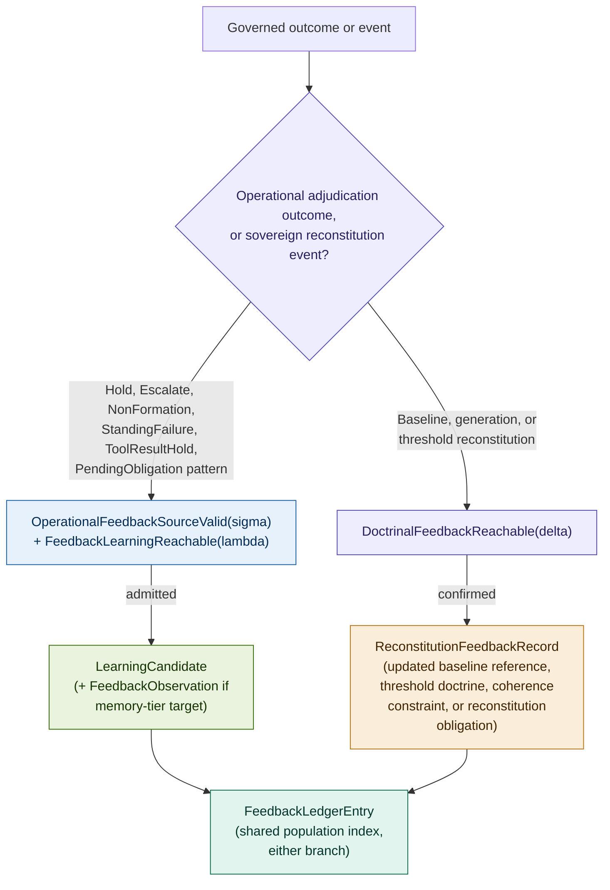
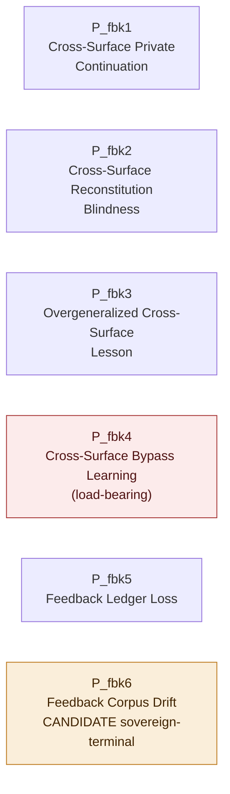

# Constitutional Feedback: Cross-Surface Learning and the Governance of Corpus-Wide Adaptation

## Why a Lesson Learned on One Surface Cannot Silently Teach Another

### v1.0 Conceptual Architecture Paper, Companion 9 to Constitutional Runtime Computation v5.5

**Clarence "Faheem" Downs (Professor Bone Lab)**

*Licensed under CC BY 4.0.*

*No em dashes appear in this document. Commas, periods, and restructured sentences are used throughout.*

---

# Abstract

Constitutional Memory v2.2 built a full feedback loop, Hold-derived learning only, and named its own boundary honestly: a failed adjudication outcome may become a learning signal only through substrate mediation, never through private agent reflection, overgeneralization, or bypass learning, but this doctrine was scoped to Hold, within memory operations, and Memory's own version note and Open Problems said it should become a standalone companion only if the pattern later expanded beyond memory into general runtime adaptation across surfaces. That expansion has now happened, concretely rather than hypothetically. Constitutional Standing names two further typed failure outcomes, NonFormationReceipt and StandingFailureRecord, with no learning apparatus of their own. Constitutional Tools names a structurally distinct second-stage outcome, ToolResultHold, likewise ungoverned as a feedback source. Constitutional Task Ledger supplies, for the first time, a shared, population-queryable substrate object, PendingObligation, that already indexes every one of these outcome types across a task's full lifetime, giving cross-surface feedback somewhere to land. And three further companions, Baselines, Coherence, and Thresholds, each produce their own typed sovereign-correction record, DoctrineGroundingRecord, CrossSurfaceMaskingAnalysis, and SensitivityGroundingRecord, none of which today asks whether its correction should propagate to another surface.

This paper closes both gaps, and it does so by keeping them apart rather than collapsing them, because they are not the same kind of question. Operational feedback asks whether a governed outcome, a Hold, an Escalate, a NonFormation, a StandingFailure, a ToolResultHold, or a pattern in how PendingObligations resolve, may become a scoped, future-facing lesson. Doctrinal feedback asks a different question: whether a sovereign correction the substrate already authorized on one surface should propagate to another. The first is a generalization of Memory's own Part IV-A. The second is new, and it is not merely failure-derived learning wearing a different hat, because a baseline re-anchoring is not a failure at all. It is a sovereign act, and asking whether that act should teach a second surface is a distinct constitutional question from asking whether a Hold should teach anything.

The contribution is fivefold. First, the Constitutional Feedback Principle, derived as a scope generalization of Memory's own feedback-loop doctrine, stated broadly enough to cover both an operational adjudication outcome and a sovereign reconstitution event without forcing either into the other's shape. Second, four governed objects, an extended LearningCandidate and FeedbackObservation for the operational branch, a new ReconstitutionFeedbackRecord for the doctrinal branch, and a FeedbackLedger that indexes both branches as one shared, auditable population, the object a Feedback Trajectory Audit would scan. Third, two predicates kept structurally separate rather than composed, OperationalFeedbackSourceValid(σ) feeding FeedbackLearningReachable(λ), the direct generalization of Memory's own SourceHoldValid and FailureLearningReachable(λ), and DoctrinalFeedbackReachable(δ), a new and distinct predicate whose load-bearing conjuncts, CrossSurfaceApplicabilityAssessed and AuthorityBoundaryPreserved, have no analogue in Memory's own apparatus because Memory never had to ask whether a sovereign correction belongs on a second surface. Fourth, a governing no-silence rule, every feedback-eligible outcome produces either a FeedbackLedgerEntry or a recorded no_feedback_reason, and a P_fbk family of six primitives, with Cross-Surface Bypass Learning (P_fbk4) named as the primitive that most justifies this companion's existence, since no single surface's own non-bypassability apparatus can see a lesson that moves its target effect to a different governed surface entirely, now paired with its own predicate-level gate, CrossSurfaceBypassBlocked(λ), rather than standing as the only place the failure is named. Fifth, Feedback Corpus Drift (P_fbk6) is tested against the corpus's own four-part sovereign-terminal test in full and appears to satisfy it on the corpus's current contents, but is recorded as a candidate sovereign-terminal primitive, not formally classified in v1.0, since an absence-of-a-fixed-reference argument can, in principle, be invoked for any new corpus-wide drift problem, and treating every such problem as automatically sovereign-terminal would empty the category of its discriminating force. AEGIS serves as the worked domain. Nafisah remains the sovereign principal. Mantis remains the clinical reasoning agent. Pepper remains the orchestrator. MEC remains the L2 drift monitor.

---

## Contents

**Part I** The residue: two feedback gaps, not one
**Part II** The Constitutional Feedback Principle, derived
**Part III** Two feedback classes: why operational and doctrinal feedback do not collapse
**Part IV** Governed objects
**Part V** OperationalFeedbackSourceValid(σ) and FeedbackLearningReachable(λ)
**Part VI** DoctrinalFeedbackReachable(δ)
**Part VII** Source-type tables and the no-authority-by-accumulation doctrine
**Part VIII** Primitive failure topologies (P_fbk)
**Part IX** Worked examples
**Part X** Relationship to the companion series
**Related work**
**Open problems**
**Key terms**
**Acknowledgments**

---

# Part I. The Residue: Two Feedback Gaps, Not One

## I.1 What Memory built, and what it said about its own boundary

Constitutional Memory v2.2's Part IV-A builds a complete apparatus for one narrow claim: a Hold may become a learning signal only through a substrate-mediated `LearningCandidate`, evaluated by `FailureLearningReachable(λ)`, never through private agent reflection, overgeneralization, or a bypass that achieves the same effect through a different memory operation. This is a real, working feedback loop, and it is Hold-specific by explicit design, not by oversight. Memory's own Open Problems name the residue directly: other feedback sources, declined escalations, tool-result Holds, evaluation failures, baseline drift signals, human corrections, and threshold recalibrations, may also produce learning signals worth governing the same way, and Memory leaves open whether this should be closed by a generalized predicate or by a standalone companion "once the pattern recurs across enough surfaces." Memory's own version note is more specific still: a standalone Constitutional Feedback companion is warranted "only if it later expands beyond memory into general runtime adaptation across surfaces this version does not attempt to unify."

## I.2 The accounting, read as two tables rather than one

The pattern has now recurred, and it has recurred in two structurally different ways, which is the central finding this paper is built around. Reading the recurrence as one flat list would flatten a real authority distinction, so the accounting is kept as two tables from the outset.

**Operational feedback, governed how, today:**

| Source | Learning apparatus today |
|---|---|
| Hold | Memory partially governs (Hold-only) |
| Escalate | None |
| NonFormation | None |
| StandingFailure | None |
| ToolResultHold | None |
| PendingObligation resolution pattern | None |

**Doctrinal feedback, governed how, today:**

| Source | Learning apparatus today |
|---|---|
| Baseline reconstitution | None |
| Generation reconstitution | None |
| Threshold reconstitution | None |

The operational rows are all instances of the same question Memory already answers for Hold: may this governed outcome, a genuine adjudication result of some kind, become a scoped, future-facing lesson. The doctrinal rows ask a different question entirely: may a correction the sovereign has already authorized on one surface, a baseline re-anchoring, a generation re-cohering, a threshold recalibration, propagate to inform a second surface's own standard. Nothing in the corpus asks either question outside the narrow Hold case, and Task Ledger's own PendingObligation is what makes the operational table answerable at all: before Task Ledger existed, five of these six rows had no shared population object to attach a lesson to, each living in its own paper's bespoke record with no way to audit a pattern of similar outcomes across tasks.

## I.3 What this paper is not

This paper does not reopen `FailureLearningReachable(λ)`, `LearningCandidate`, or `FeedbackObservation` as Memory v2.2 specified them for the Hold case. It does not reopen `MemoryOperationReachable`, `StandingValid`, `FormationValid`, `BindingFormed`, `ToolInvocationReachable`, `ToolResultAdmissible`, `TaskContinuationReachable`, or `TaskClosureValid`. It does not reopen `BaselineChangeReachable`, `GenerationCoherenceReachable`, or `ThresholdChangeReachable`, all three of which have already authorized their own reconstitution before this paper's own doctrinal predicate is ever reached. Where this paper's own predicates need an object a prior companion already produces, a HoldRecord, a PendingObligation, a DoctrineGroundingRecord, it references that object by pointer, following the corpus's now-consistent discipline of reuse over reinvention.

---

# Part II. The Constitutional Feedback Principle, Derived

1. Memory's own Part IV-A already establishes that a failed adjudication outcome may become a learning signal only through substrate mediation, and names this doctrine's boundary honestly as Hold-specific.

2. The pattern has recurred at the operational layer, in Standing's NonFormationReceipt and StandingFailureRecord, in Tools' ToolResultHold, and in the population Task Ledger's own PendingObligation now tracks across all of these.

3. The pattern has also recurred at a second, higher-authority layer, in Baselines' DoctrineGroundingRecord, Coherence's CrossSurfaceMaskingAnalysis, and Thresholds' SensitivityGroundingRecord, and this second recurrence is not the same kind of event as the first: a reconstitution is a sovereign correction already authorized, not a failure awaiting correction.

4. If each surface's own paper independently re-derives its own bespoke rule for what counts as an appropriately scoped lesson, the corpus risks the same failure Coherence's own Generation Coherence Principle names one level down, individually well-scoped learning rules that are jointly incoherent as a corpus-wide learning practice, with no shared standard for what an admissible lesson looks like across surfaces.

5. Task Ledger's PendingObligation is now the natural point of attachment for the operational recurrence, a first-class, population-queryable, audited object already tracking every one of these outcome types across a task's lifetime. The doctrinal recurrence has no equivalent shared population object and must route through the reconstitution records the corpus already produces.

6. Therefore the substrate must own one shared doctrine covering both recurrences, without forcing either into the other's shape: an operational outcome earns a lesson through one predicate, a doctrinal reconstitution earns a propagation through a different one, and neither may happen privately, silently, or without an explicit scope bound.

**The Constitutional Feedback Principle.** A governed outcome, whether an operational adjudication outcome or a sovereign reconstitution event, may become a durable learning signal only through a substrate-mediated, source-typed, scope-bounded process. No agent, and no single surface's local apparatus, may generalize a lesson beyond what its source outcome, read against one shared corpus-wide learning discipline, actually supports.

This Principle does not say all feedback is memory. Memory v2.2 governed the memory instance of feedback specifically, an outcome becoming a lesson whose target is a memory tier. This paper governs feedback as a cross-surface conversion: an outcome becomes a future-facing lesson, affordance, review obligation, memory operation, or doctrinal propagation only after substrate mediation, and which of those five a given admitted lesson actually produces depends on what the lesson is about, not on which paper happens to be reading this sentence.

**Editorial note.** This Principle is stated as a scope generalization of Memory's own Memory Sovereignty Principle applied to the feedback-loop instance specifically, in the same posture Task Ledger took relative to Standing and Memory, rather than as a tenth independent sovereignty argument. This choice is flagged rather than left implicit, because this paper reaches further than Task Ledger's own generalization did, touching doctrine-level objects, DoctrineGroundingRecord, CrossSurfaceMaskingAnalysis, and SensitivityGroundingRecord, that Memory's own Part IV-A never had occasion to reach. A future reviewer may reasonably ask whether the doctrinal branch (Part VI) deserves its own first-principles derivation rather than riding on Memory's own Principle by extension. That question is recorded here rather than resolved by fiat.

---

# Part III. Two Feedback Classes: Why Operational and Doctrinal Feedback Do Not Collapse

**Operational feedback** asks: may this governed outcome, a Hold, an Escalate, a NonFormation, a StandingFailure, a ToolResultHold, or an observed pattern in how PendingObligations of a given type resolve, become a scoped, future-facing lesson. Its source is a genuine adjudication result, something the substrate judged and recorded as an outcome of a transition proposal or a tool invocation. Its population home is Task Ledger's own PendingObligation. Its predicate is `FeedbackLearningReachable(λ)`, and its result, when admitted, is ordinarily a `FeedbackObservation`, an agent-facing artifact exactly as Memory specifies for the Hold case.

**Doctrinal feedback** asks a different question: may a correction the sovereign has already authorized, a baseline re-anchoring, a generation re-cohering, a threshold recalibration, propagate to inform a second surface's own standard. Its source is not a failure at all. It is a sovereign act that has already passed its own gate, `BaselineChangeReachable`, `GenerationCoherenceReachable`, or `ThresholdChangeReachable`, before this paper's apparatus is ever reached. Its population home is the reconstitution record the originating companion already produces. Its predicate is `DoctrinalFeedbackReachable(δ)`, and its result, when confirmed, is a `ReconstitutionFeedbackRecord`, which may update a baseline reference, a threshold's declared sensitivity basis, a coherence constraint, or open a reconstitution obligation on the target surface, none of which is an agent-facing `FeedbackObservation` in Memory's own sense.

The two classes share the governing Principle and share one population index, the `FeedbackLedger` (Part IV), but they do not share a predicate, and this paper does not attempt to make them share one. Collapsing `DoctrinalFeedbackReachable(δ)` into a branch of `FeedbackLearningReachable(λ)` would treat a sovereign correction as if it were a failure awaiting the same kind of scoped lesson a Hold produces, which mischaracterizes what a reconstitution already is: an authorized act, not an adjudication defect. Keeping the two apart is the single most important structural decision in this paper, and it is stated here, at the top, rather than left to be inferred from the predicate definitions in Parts V and VI.

**Scope statement for the doctrinal branch, stated plainly.** This paper does not attempt to fully solve reconstitution propagation in general, domain-constitution migration, or cross-domain doctrinal learning. Its doctrinal claim is deliberately narrow: when a sovereign reconstitution event occurs, the substrate must assess whether the correction has implications for other governed surfaces, and any propagation must preserve authority boundaries and be separately logged. Anything beyond that narrow claim is named in Open Problems rather than attempted here.

---

# Part IV. Governed Objects

## IV.1 LearningCandidate, extended, operational only

Memory's own `LearningCandidate` is not replaced. It is extended, and it remains scoped to the operational branch only, per the correction that shaped this revision: doctrinal feedback does not produce a LearningCandidate, it produces a ReconstitutionFeedbackRecord (IV.3), and the two objects are not interchangeable outputs of one shared type. `source_hold_ref` generalizes into the Hold-specific instance of a new, broader `source_ref` field, a union over the five operational source records Part V governs, reached through `PendingObligation`, never over a doctrinal record. A new `source_class` field, `OperationalOutcome | DoctrinalReconstitution`, names which of the two feedback classes an entry belongs to at the FeedbackLedger level (IV.4); on LearningCandidate itself the field is always `OperationalOutcome`, present for uniform indexing rather than because LearningCandidate itself needs to distinguish anything. `OperationalOutcome` replaces the earlier `OperationalFailure` naming, since Escalate and a PendingObligation resolution pattern are not failures in the sense Hold, NonFormation, StandingFailure, and ToolResultHold are. Every other field Memory specifies (`candidate_id`, `failed_conjunct_ref`, `proposed_lesson`, `scope_bound`, `tier_target`, `status`, `audit_ref`) is unchanged.

## IV.2 FeedbackObservation, extended, operational only

Memory's own `FeedbackObservation` gains `source_class` and `task_ref`, tying an admitted observation back to the specific task it arose within, which Task Ledger now makes meaningful. This object remains scoped to operational feedback. Doctrinal feedback does not issue a `FeedbackObservation`, because a propagated correction is not an agent-facing lesson about how to act differently next cycle. It is a change to a standard, and its own typed output is `ReconstitutionFeedbackRecord`, defined next.

## IV.3 ReconstitutionFeedbackRecord (new), with an explicit lifecycle

The operational branch's own lifecycle is explicit by construction: a source outcome is linked through PendingObligation, evaluated under `OperationalFeedbackSourceValid(σ)`, proposed as a LearningCandidate, evaluated under `FeedbackLearningReachable(λ)`, and, if admitted, produces a FeedbackObservation and a FeedbackLedgerEntry. The doctrinal branch needs the same explicitness rather than leaving ReconstitutionFeedbackRecord to serve, ambiguously, as both its own proposal and its own final record. Its lifecycle is: a source reconstitution is confirmed on its own surface, a candidate target surface is named, a ReconstitutionFeedbackRecord is opened in `PROPOSED` status, `DoctrinalFeedbackReachable(δ)` is evaluated against it, and the record is finalized to `CONFIRMED`, `HELD`, or `ESCALATED`, at which point a FeedbackLedgerEntry is written referencing it.

`ReconstitutionFeedbackRecord` carries: `record_id`, `status` (`PROPOSED | HELD | CONFIRMED | ESCALATED`), `source_reconstitution_ref` (the DoctrineGroundingRecord, CrossSurfaceMaskingAnalysis, or SensitivityGroundingRecord the propagation derives from), `source_surface` (which surface the original correction came from), `target_surface` (what the propagation proposes to affect), `propagation_type` (`updated_baseline_reference | updated_threshold_doctrine | updated_coherence_constraint | reconstitution_obligation_created | domain_constitution_artifact_revised`), `scope_of_propagation` (what part of the target surface is affected, not the whole of it by default), `authority_boundary_ref` (naming what this propagation does not confer, the field `AuthorityBoundaryPreserved` in Part VI evaluates against), `effect_summary` (what changed, stated in bounded terms), `sovereign_confirmation_ref`, `verdict_ref` (the specific evaluated `DoctrinalFeedbackReachable(δ)` result this record's status derives from), `audit_ref`, `created_at`, `finalized_at` (null while `PROPOSED`).

## IV.4 FeedbackLedger (new, the shared population object)

A thin, first-class index, corpus- or domain-scoped, serving both branches without forcing them through one predicate.

```
FeedbackLedger:
  feedback_ledger_id
  domain_constitution_ref
  scope: task | domain | corpus
  review_policy_ref
  entries
  opened_at
  owner_ref
  audit_ref

FeedbackLedgerEntry:
  entry_id
  source_class
  source_ref
  source_surface
  target_surface
  learning_candidate_ref
  reconstitution_feedback_record_ref
  no_feedback_reason
  verdict: ADMITTED | CONFIRMED | HELD | ESCALATED | NO_FEEDBACK
  feedback_effect_type
  effect_ref
  target_memory_tier
  task_ref
  pending_obligation_ref
  sovereign_review_ref
  created_at
  audit_ref
```

`review_policy_ref` names the domain's own declared review window and trigger conditions for when a reconstitution event must be assessed for cross-surface applicability, and when an operational source population must be assessed for a trajectory audit, the object P_fbk2 and P_fbk5 (Part VIII) both depend on rather than assuming an unstated window.

The verdict vocabulary is corrected from an earlier draft that mixed operational and doctrinal language under one set of values. `ADMITTED` names an operational lesson admitted. `CONFIRMED` names a doctrinal propagation confirmed, replacing an earlier `RECONSTITUTED` value that wrongly implied the feedback event itself performs a reconstitution, when in fact the feedback event is always downstream of one already confirmed on its own surface. `HELD` names either a lesson or a propagation refused. `ESCALATED` names an unresolved case requiring sovereign review beyond what the predicate itself could resolve. `NO_FEEDBACK` names an outcome assessed and deliberately producing neither a lesson nor a propagation, aligning directly with a populated `no_feedback_reason`.

An entry's `source_class` determines which of `learning_candidate_ref` or `reconstitution_feedback_record_ref` is populated. `no_feedback_reason` is populated only when a feedback-eligible outcome, per Part VII's tables, was assessed and deliberately produced no lesson or propagation, closing the silent-drop path exactly as Task Ledger's own `no_obligation_reason` closes it for obligations. **The governing rule:** a feedback-eligible outcome must either be indexed in the FeedbackLedger, via a populated `learning_candidate_ref` or `reconstitution_feedback_record_ref`, or receive a recorded `no_feedback_reason`. Silence is never a legitimate outcome of this table.

**Editorial note.** A generalized failure superclass unifying HoldRecord, EscalationState, NonFormationReceipt, StandingFailureRecord, and ToolResultRecord was considered and rejected, for the reason Task Ledger rejected TaskProgressRecord: Task Ledger's own PendingObligation already indexes all five, and a second superclass would duplicate rather than add structure.

## IV-A. Feedback Effects

Part II's own description of what an admitted lesson or confirmed propagation may produce, a future-facing lesson, an affordance, a review obligation, a memory operation, or a doctrinal propagation, is prose the first draft never turned into a typed vocabulary. `feedback_effect_type` on `FeedbackLedgerEntry` closes that gap: `observation_shaping | memory_write | affordance_update | review_obligation_created | doctrinal_propagation | no_feedback`, with `effect_ref` pointing to whichever downstream object the effect actually produced, an updated ObservationContract, a MemoryOperation, an AllowedNextAffordanceSet event, a PendingObligation, a ReconstitutionFeedbackRecord, or null for `no_feedback`. This does not add new governance; it names, as a closed set, the categories Part II's own prose already gestures at, so an auditor scanning the FeedbackLedger can filter by effect type rather than only by verdict.

**On review obligations specifically.** A review obligation an admitted lesson or a confirmed propagation creates is not exempt from the rest of the corpus merely because it originated in a feedback event. If the review obligation affects an active task, it must enter Task Ledger as a `PendingObligation`, exactly as any other obligation would, with `source_event_type` naming the feedback event that created it. Feedback does not open a second, parallel obligation-tracking channel alongside Task Ledger's own; it feeds into the one that already exists.

## IV.5 ObligationPatternRecord (scaffolded)

Part VII's own operational source table names a sixth source type, a PendingObligation resolution pattern, that is not a single typed outcome record the way a Hold or a StandingFailure is. `OperationalFeedbackSourceValid(σ)`'s own `SourceRecordValid(σ)` conjunct (Part V) presumes a single existing record to validate, which a pattern across many PendingObligations is not. Rather than force a pattern into that same shape, or leave it ungoverned by silent omission, this version names a scaffolded object for it and defers full specification honestly, in the same posture Task Ledger scaffolds ReconstitutionRecord.

`ObligationPatternRecord` carries: `pattern_record_id`, `obligation_type` (the PendingObligation.obligation_type the pattern concerns), `task_type`, `population_ref` (the specific set of PendingObligation instances the pattern was computed over), `observed_pattern` (a description of what regularity was found, resolution latency, a shift in disposition, a recurring no_obligation_reason), `time_window`, `audit_ref`. Where a pattern-derived source is proposed under `OperationalFeedbackSourceValid(σ)`, `SourceRecordValid(σ)` evaluates against this scaffolded record rather than against a single PendingObligation, and `PendingObligationLinked(σ)` evaluates against the full `population_ref` rather than a single link. The calculus by which a pattern is detected at all, the Feedback Trajectory Audit named in Part VIII and Open Problems, is not specified here; this object is the honest placeholder for its output, not the audit itself.

---

# Part V. OperationalFeedbackSourceValid(σ) and FeedbackLearningReachable(λ)

```
OperationalFeedbackSourceValid(σ) ⟺
  SourceRecordValid(σ)                  ∧
  SourceCauseTyped(σ)                   ∧
  SourceContextPinned(σ)                ∧
  SourceSurfaceDeclared(σ)              ∧
  SourceNotSupersededOrTemporalized(σ)  ∧
  PendingObligationLinked(σ)
```

**SourceRecordValid(σ):** the source record, whichever of HoldRecord, EscalationState, NonFormationReceipt, StandingFailureRecord, or ToolResultRecord σ points to, exists, is immutable, and is independently queryable as its own typed object, exactly as Memory requires for HoldRecord specifically. Where the source is a PendingObligation resolution pattern rather than a single outcome, this conjunct instead evaluates against the scaffolded `ObligationPatternRecord` (IV.5), whose own full specification is deferred rather than assumed complete.

**SourceCauseTyped(σ):** the source record carries a typed cause, failed conjunct, routing basis, or unresolved condition sufficient to bound the lesson. This conjunct is defined broadly on purpose, following the review that shaped this draft, because not every source is a failure in the same sense a Hold is: an Escalate is a proper authority route, not a defect, and its typed routing basis is what bounds a lesson drawn from it, not a failed conjunct it never had.

**SourceContextPinned(σ):** the §6a six-reference pinning schema is present on the source record, already true by construction for all five source types, since each is itself a verdict-producing object under the corpus's now-uniform pinning discipline.

**SourceSurfaceDeclared(σ):** which surface, Memory, Standing, Tools, or Task Ledger itself, produced the source record. This conjunct is new relative to Memory's own SourceHoldValid, and it is needed precisely because this predicate now runs across surfaces: a lesson's own cross-surface bookkeeping starts here, at the source, not only at the target.

**SourceNotSupersededOrTemporalized(σ):** generalizes Memory's own HoldNotSupersededOrLessonTemporalized, unchanged in substance.

**PendingObligationLinked(σ):** the source traces to a live or historical PendingObligation record in Task Ledger. This conjunct is load-bearing, in the sense that it is the specific fact that makes this paper possible at all: without a PendingObligation to link to, there is no shared population against which a Feedback Trajectory Audit (Part VIII) could ever compare this source to others like it.

```
FeedbackLearningReachable(λ) ⟺
  OperationalFeedbackSourceValid(σ)   ∧
  LessonScoped(λ)                     ∧
  LessonTypeMatched(λ)                ∧
  TierTargetAdmissible(λ)             ∧
  OvergeneralizationControlled(λ)     ∧
  BypassLearningBlocked(λ)            ∧
  FutureAffordanceBounded(λ)          ∧
  AuditLinked(λ)
```

`LessonScoped(λ)`, `TierTargetAdmissible(λ)`, `OvergeneralizationControlled(λ)`, and `FutureAffordanceBounded(λ)` are Memory's own conjuncts, reused without change, since Memory built them general enough in the first place that only the source conjunct needed lifting. `LessonTypeMatched(λ)` replaces Memory's own `FailureClassMatched(λ)`: the proposed lesson matches the source outcome's own type, failed conjunct where one exists, routing basis where one exists instead, and governing surface, with Memory's own conjunct now understood as the Hold-specific instance of this broader match.

**BypassLearningBlocked(λ), now a compound conjunct with a genuine cross-surface gate.**

```
BypassLearningBlocked(λ) ⟺
  SameSurfaceBypassBlocked(λ)  ∧
  CrossSurfaceBypassBlocked(λ)
```

An earlier draft of this paper defined this conjunct as same-surface only and named cross-surface bypass as a primitive with no predicate-level defense at all, on the reasoning that a same-surface conjunct structurally cannot see across surfaces. That reasoning is sound as far as it goes, but it left a real gap: if `FeedbackLearningReachable(λ)` is evaluating a lesson that is *itself* an obvious cross-surface bypass, the predicate should be able to Hold it before it becomes a primitive failure requiring after-the-fact detection, exactly the way every other conjunct in this predicate prevents its own failure mode at the gate rather than only naming it downstream. `SameSurfaceBypassBlocked(λ)` is Memory's own original conjunct, unchanged: it blocks an agent from learning to achieve a Held effect through a different operation type on the same surface. `CrossSurfaceBypassBlocked(λ)` is new: the proposed lesson does not teach the agent to achieve the same effect through a different governed surface whose admissibility conditions are weaker, unrelated, or not independently evaluated against the source Hold. Where the proposed lesson's own content names, references, or is scoped in a way that plainly points at a different surface's own weaker path, this conjunct fails and the lesson is Held here. What this conjunct cannot catch is the harder case, an agent that discovers the same cross-surface path on its own, never proposing it as a lesson at all, only enacting it. That undetected-at-formation case is P_fbk4 (Part VIII): the primitive that names the failure when this gate is bypassed rather than tripped, mirroring exactly the relationship Memory establishes between `BypassLearningBlocked` and its own P_mem8.

**AuditLinked(λ):** requires, beyond Memory's own audit-trail requirement, that the admitted lesson produce a `FeedbackLedgerEntry`, tying the operational branch into the shared population Part IV establishes.

**Verdict structure.** Identical in shape to Memory's own: a proposal admissible under `FeedbackLearningReachable(λ)` produces a `LearningCandidate` and, where a memory-tier target is named, a `FeedbackObservation`; any conjunct false produces a Hold at this predicate, logged with the specific failing conjunct.

---

# Part VI. DoctrinalFeedbackReachable(δ)

```
DoctrinalFeedbackReachable(δ) ⟺
  SourceReconstitutionValid(δ)          ∧
  TargetSurfaceDeclared(δ)              ∧
  CrossSurfaceApplicabilityAssessed(δ)  ∧
  LessonScopedToReconstitution(δ)       ∧
  AuthorityBoundaryPreserved(δ)         ∧
  SovereignConfirmed(δ)                 ∧
  ReconstitutionEffectLogged(δ)
```

**SourceReconstitutionValid(δ):** the originating reconstitution event, a confirmed `BaselineChangeReachable`, `GenerationCoherenceReachable`, or `ThresholdChangeReachable` outcome, is itself valid and its own typed record, `DoctrineGroundingRecord`, `CrossSurfaceMaskingAnalysis`, or `SensitivityGroundingRecord`, resolves. This paper does not re-adjudicate that event. It takes it as given, exactly as `MembersValid(γ)` in Coherence takes a per-surface baseline's own validity as given rather than re-deriving it.

**TargetSurfaceDeclared(δ):** the proposed propagation names a specific target surface it would affect. A propagation with no declared target cannot be evaluated for whether it belongs there, and a reconstitution's own natural gravity, everything nearby should probably change too, is exactly the failure this conjunct exists to stop from being assumed rather than argued.

**CrossSurfaceApplicabilityAssessed(δ):** the load-bearing conjunct, and the one with no analogue anywhere in Memory's own apparatus, because Memory never had to ask whether a sovereign act belongs on a second surface. It asks whether the doctrinal basis for the original reconstitution, read on its own terms, actually extends to the target surface's own standard, or whether the two surfaces' standards are related only by superficial proximity, the same statute, the same disclosure class, the same task type, without the doctrinal reasoning itself carrying across. This conjunct is undecidable in general, for the identical reason `NoSurfaceMasksAnother` and `SensitivityGrounded` are undecidable: whether a doctrinal basis genuinely extends to a second surface binds interpretive judgment that may resist mechanical evaluation. Where it cannot be conclusively evaluated, the propagation routes to escalation, exactly as every other undecidable conjunct in the corpus does.

**LessonScopedToReconstitution(δ):** the proposed propagation's scope does not exceed what the original reconstitution's own grounding record actually supports. A statutory clarification narrowing one disclosure class does not license a propagation that narrows an unrelated class merely because it shares a surface with the first.

**AuthorityBoundaryPreserved(δ):** a baseline correction cannot silently become threshold authority, and a threshold recalibration cannot silently rewrite baseline doctrine. This conjunct is what keeps the three-object distinction Thresholds establishes, baseline, metric, threshold, and trigger, from being quietly erased by a propagation that moves a correction across that boundary without ever passing the gate the target object's own paper requires. A propagation from a baseline reconstitution whose target surface is a threshold's sensitivity level fails here, regardless of how well-grounded the original baseline correction was, because moving sensitivity is `ThresholdChangeReachable`'s own question, not this paper's to answer on its behalf.

**SovereignConfirmed(δ):** the propagation itself, not merely the originating reconstitution, requires explicit sovereign confirmation. Propagating a correction to a second surface is a fresh act, distinct from authorizing the original reconstitution, and the sovereign who authorized the baseline change is not thereby presumed to have authorized every surface it might touch.

**ReconstitutionEffectLogged(δ):** the propagation's own effect is traced distinctly from the originating reconstitution's own log entry, in the governance exposure log, referencing both the source reconstitution and the target surface explicitly.

**Verdict structure.** `DoctrinalFeedbackReachable(δ)` is, by default, `SovereignAuthorizationRequired` and escalates to Nafisah; there is no `PreAuthorizedClassExecutable` path, for the same reason none exists for the baseline, generation, or threshold change predicates it sits downstream of: a delegated propagation class would be a standing delegation of judgment over whether one surface's correction becomes another surface's doctrine.

**Figure 1. The branch relationship between the two feedback predicates**



*The two predicates share the governing Principle and one population index, the FeedbackLedger, but not a predicate. An operational outcome earns a lesson through FeedbackLearningReachable. A doctrinal reconstitution earns a propagation through DoctrinalFeedbackReachable. Neither routes through the other.*

---

# Part VII. Source-Type Tables and the No-Authority-by-Accumulation Doctrine

## Operational feedback table

| Source | Typical lesson, correctly framed |
|---|---|
| Hold | As Memory Part IV-A already specifies |
| Escalate | A recurring escalation reason may warrant sovereign review of whether a bounded pre-authorized delegation should be created, not automatic delegation |
| NonFormation | A recurring malformation pattern may indicate a template or standing issue worth reviewing, ties to Task Ledger's own hardened NonFormation row |
| StandingFailure | A standing class expiring faster than expected may warrant review of grant duration or renewal policy, not automatic lengthening |
| ToolResultHold | A recurring result-admission failure may indicate an evidentiary-role mismatch worth reviewing |
| PendingObligation resolution pattern | A population-level pattern in how a given obligation_type resolves may warrant review of the obligation-carrying table's own disposition for that type |

## Doctrinal feedback table

| Source | Typical propagation, correctly framed |
|---|---|
| Baseline reconstitution | May warrant review of whether a related surface's own standard should be re-anchored to the same doctrinal basis |
| Generation reconstitution | May warrant review of whether a newly declared coherence condition should extend to a surface outside the amended generation's current span |
| Threshold reconstitution | May warrant review of whether a related trigger's own sensitivity should be recalibrated to match |

**The governing doctrine, stated once and relied on throughout this paper:** feedback may nominate a review of authority. It may not itself confer authority. An admitted operational lesson or a confirmed doctrinal propagation opens a review path, a renewal-prompt affordance, a candidate pre-authorized delegation for sovereign consideration, a recalibration proposal, it does not, by its own admission, grant a standing class, lengthen an authorization, or move a decision boundary. Every instance of granted authority downstream of a feedback event still passes through that authority's own governing predicate, `StandingValid`, `ThresholdChangeReachable`, or whichever applies, exactly as if the lesson had never been admitted. Feedback shortens the path to a review. It does not shorten the path to authority.

---

# Part VIII. Primitive Failure Topologies (P_fbk)

**P_fbk1: Cross-Surface Private Continuation.** An agent, or a surface's own local learning apparatus, treats a lesson admitted on one surface as if it silently applies to another surface's proposals, without an independent `FeedbackLearningReachable(λ)` or `DoctrinalFeedbackReachable(δ)` evaluation scoped to the second surface. Detection signature: a proposal on surface B whose declared rationale references a lesson admitted only on surface A, with no corresponding LearningCandidate or ReconstitutionFeedbackRecord scoped to surface B. Recovery: the proposal is treated as formed on an illegitimate basis, mirroring P_stand4's and P_task1's own recovery exactly, and the agent's next ContinuationState carries no acknowledgment of the private cross-surface inference.

**P_fbk2: Cross-Surface Reconstitution Blindness.** A baseline, generation, or threshold reconstitution is confirmed and `CrossSurfaceApplicabilityAssessed` is never evaluated at all, not failed, simply never run, so a preventable parallel correction on another surface goes unconsidered. Detection signature: a confirmed reconstitution event with no corresponding FeedbackLedgerEntry, `CONFIRMED`, `HELD`, or carrying a `no_feedback_reason`, within the window FeedbackLedger's own `review_policy_ref` declares. Recovery: a retrospective `CrossSurfaceApplicabilityAssessed` evaluation is run against the missed reconstitution, and any surface where propagation would have been warranted is flagged for catch-up review.

**P_fbk3: Overgeneralized Cross-Surface Lesson.** A lesson correctly scoped to its origin surface's specific outcome is applied more broadly than its source supports once carried to a second surface. Detection signature: a LearningCandidate or ReconstitutionFeedbackRecord whose target scope, compared against its source_ref's own narrow basis, covers a broader condition class than the source instantiates. Recovery: the lesson is narrowed to what the source actually supports, generalizing Memory's own P_mem7 recovery across the surface boundary.

**P_fbk4: Cross-Surface Bypass Learning.** The load-bearing primitive of this paper, and now paired with a genuine predicate-level gate, `CrossSurfaceBypassBlocked(λ)` (Part V), rather than standing as the only place the issue is named. This primitive is what fires when that gate is bypassed rather than tripped: an agent held or blocked on one surface discovers, on its own, without ever proposing the connection as a lesson the gate could evaluate, how to achieve the same underlying effect through an entirely different governed surface's own, less-scrutinized path. Detection signature: a proposal Held on surface A followed, within a bounded window, by a structurally similar effect achieved via surface B, with no admitted LearningCandidate or FeedbackObservation legitimately connecting the two, the connection instead inferable only from outcome similarity. Recovery: the surface-B path is retroactively evaluated as if it had been proposed on surface A, and if it would have Held there, the surface-B binding is voided and flagged for sovereign review of both surfaces' own non-bypassability apparatus. Single-surface non-bypassability cannot detect a lesson that moves the target effect to another governance surface, because §6a's own non-bypassability discipline, Tools' own ToolInvocationReachable, and Standing's own StandingValid are each, by construction, scoped to their own surface. This is the primitive that most justifies Constitutional Feedback existing as its own companion rather than as an appendix to any one of Memory, Standing, Tools, or Task Ledger.

**P_fbk5: Feedback Ledger Loss.** Direct generalization of Task Ledger's own P_task5. An outcome that should produce a FeedbackLedgerEntry, per Part VII's tables, never gets one, and no `no_feedback_reason` is recorded either. Detection signature: a source record (operational or doctrinal) whose type appears in Part VII's tables, with no corresponding FeedbackLedgerEntry, `ADMITTED`, `CONFIRMED`, `HELD`, or `no_feedback_reason`, within the window FeedbackLedger's own `review_policy_ref` declares. Recovery: the missing entry is reconstructed and backdated to its true created_at, and every decision made while the outcome sat untracked is flagged for retrospective review, mirroring Task Ledger's own P_task5 recovery exactly.

**P_fbk6: Feedback Corpus Drift, candidate sovereign-terminal primitive.**

**The candidate.** A sequence of individually admitted operational lessons and individually confirmed doctrinal propagations, each passing its own gate, may cumulatively drift what the corpus, taken as a whole, treats as an appropriately scoped lesson, even though no single admission or confirmation was itself overgeneralized, mistyped, or improperly authorized. This has real structural similarity to P_base5, P_coh3, P_thr5, and P_stand7, and the test below is applied in full rather than assumed from that similarity.

**Applying the test.**

*Undetectable at a single lesson.* Yes. Each individual LearningCandidate admission and each individual ReconstitutionFeedbackRecord confirmation is independently scoped, independently typed, and independently defensible against Part V's or Part VI's own conjuncts.

*Lineage surfacing required.* Yes. The pattern is visible only across a Feedback Trajectory Audit run over the full FeedbackLedger population, comparing how lessons and propagations have accumulated over time, not any single entry.

*No higher authority settles it without regress.* This is the discriminating question, exactly as it was for Task Ledger's own P_task8. Is there a fixed, external reference for the authorized aggregate pattern of what the corpus should learn, independent of the practice of learning itself? None of this paper's own conjuncts supply one: `LessonScoped`, `LessonTypeMatched`, `OvergeneralizationControlled`, and `TierTargetAdmissible` each check a single lesson against its own source. `CrossSurfaceApplicabilityAssessed` and `AuthorityBoundaryPreserved` each check a single propagation against its own reconstitution. None of them, individually or together, describe what the aggregate rate, breadth, or distribution of admitted lessons and confirmed propagations should look like across the FeedbackLedger's full population over an extended period. No object this paper specifies pins that pattern.

**The classification's own condition of falsifiability, stated at the same strength Task Ledger's own P_task8 required.** P_fbk6 would qualify as sovereign-terminal only because the corpus currently contains no pinned `FeedbackPracticeContract`, `LearningScopePolicy`, or equivalent domain feedback baseline defining the authorized aggregate pattern of cross-surface learning. If such an object is later specified, the fixed-reference condition this test currently fails to find would be satisfied, and P_fbk6 should demote to ordinary baseline-anchored drift monitoring.

*Sovereign review rather than a computed verdict.* Consistent with the third condition, yes: only Nafisah's review of the full FeedbackLedger trajectory, not a computed comparison against any pinned artifact, could distinguish a corpus that has legitimately matured its own learning practice from one that has quietly drifted what it treats as an admissible lesson.

**Classification: candidate sovereign-terminal primitive, not formally classified in v1.0.** P_fbk6 appears to satisfy the four-part test under the corpus's current contents, but this paper does not enter it into the formally named sovereign-terminal lineage alongside P_base5, P_coh3, P_thr5, P_stand7, and P_task8. It records P_fbk6 as a candidate sovereign-terminal primitive pending further review of whether the test remains sufficiently discriminating when applied to corpus-wide learning practice specifically. An absence-of-a-fixed-reference argument can, in principle, be invoked for nearly any new corpus-wide drift problem, and treating every such problem as automatically sovereign-terminal would empty the category of the discriminating force it is supposed to carry, exactly the risk a reviewer of this paper's own outline named directly. Recording a passing result without entering the formal lineage is itself the intended output of this section, not an unresolved loose end: v1.0's own position is that P_fbk6 has earned candidate status and nothing further, and later work, not haste here, is what would earn it more.


Detection signature: none at the level of any individual lesson or propagation; only a Feedback Trajectory Audit, comparing the FeedbackLedger's own aggregate admission and confirmation pattern over time against what the doctrine record, read as a whole, would currently authorize. Recovery: the corpus's learning practice is reconstituted to the doctrine-implied standard, and the intervening admissions are flagged for retrospective sovereign review against what would have been authorized reviewing the full trajectory at once.

**Figure 2. The six P_fbk primitives**



---

# Part IX. Worked Examples

## IX.1 Operational: a renewal-prompt affordance, not a longer grant

Across several tasks in AEGIS, Mantis's clinical-reasoning standing repeatedly enters a StandingFailure near the end of long-running mandated-reporting tasks, each producing a PendingObligation of `source_event_type` StandingFailure per Task Ledger's own obligation-carrying table. `OperationalFeedbackSourceValid(σ)` evaluates the accumulated pattern: `SourceRecordValid` holds across the population of StandingFailureRecords, `SourceCauseTyped` names the routing basis, standing expiry mid-task, `SourceContextPinned` and `SourceSurfaceDeclared` hold (surface: Standing), `SourceNotSupersededOrTemporalized` holds, and `PendingObligationLinked` holds against Task Ledger's own population. `FeedbackLearningReachable(λ)` is then evaluated for a proposed lesson: `LessonScoped` bounds the lesson to this specific task type and standing class, `LessonTypeMatched` confirms the lesson matches a StandingFailure routing basis rather than a different failure type, `TierTargetAdmissible` names the target as an affordance-shaping lesson rather than a memory-tier write, `OvergeneralizationControlled` confirms the lesson does not extend to unrelated standing classes, `BypassLearningBlocked` confirms both subchecks hold, `SameSurfaceBypassBlocked` since the lesson does not teach a same-surface workaround, and `CrossSurfaceBypassBlocked` since the lesson's own content, an affordance to request renewal, points at no other surface's weaker path at all, `FutureAffordanceBounded` scopes the resulting affordance narrowly, and `AuditLinked` ties the admission to a FeedbackLedgerEntry. The admitted lesson: when standing enters its review window before task completion, issue an affordance that lets the agent request renewal before expiration. The lesson does not lengthen the standing grant. It shortens the path to a review the sovereign or an authorized route still decides, exactly as Part VII's own governing doctrine requires.

## IX.2 Doctrinal: one propagation accepted, one held

Continuing Baselines' own worked example, Nafisah's statutory re-anchoring of the mandated-reporting baseline, already confirmed under `BaselineChangeReachable`, is evaluated under `DoctrinalFeedbackReachable(δ)` against two candidate targets.

**Target one: the construction surface's RequiredObserveSet.** `SourceReconstitutionValid` holds, referencing the confirmed DoctrineGroundingRecord. `TargetSurfaceDeclared` names the construction surface explicitly. `CrossSurfaceApplicabilityAssessed` holds: the same statutory interpretation that made a disclosure class newly reportable on the verdict surface bears directly on what the construction surface's own RequiredObserveSet should preserve, since construction must not de-salience the markers of a class the verdict standard now expects to escalate, precisely the relation Coherence's own worked example already traced. `LessonScopedToReconstitution` holds, the propagation is scoped to the same disclosure class named in the original statute, nothing broader. `AuthorityBoundaryPreserved` holds, the propagation updates a construction-surface reference, not a threshold or a baseline on a different object. `SovereignConfirmed` holds, Nafisah authorizes this propagation as its own act. `ReconstitutionEffectLogged` holds. The record's `status` transitions from `PROPOSED` to `CONFIRMED`, `finalized_at` is set, and a FeedbackLedgerEntry is written with `verdict` `CONFIRMED` and `propagation_type` `updated_baseline_reference`.

**Target two: the mandated-reporting threshold's sensitivity.** The same source reconstitution is proposed as also warranting a recalibration of the threshold's decision boundary, on the reasoning that a stricter verdict standard should be matched by a more sensitive trigger. `SourceReconstitutionValid` and `TargetSurfaceDeclared` hold as before. But `AuthorityBoundaryPreserved` fails: a baseline correction, grounded in `DoctrineGrounded`, carries no basis for also moving a decision boundary, which is `ThresholdChangeReachable`'s own question, gated by `SensitivityGrounded`, not this paper's to answer by extension. The record's `status` transitions to `HELD`, and the propagation does not proceed. If a sensitivity recalibration is in fact warranted, it must be proposed and evaluated on its own terms, through Thresholds' own predicate, not inherited from a baseline correction that happens to share a doctrinal source.

The contrast is the point: the same originating reconstitution legitimately propagates to one surface and is correctly refused propagation to another, and the difference is exactly what `AuthorityBoundaryPreserved` is built to catch.

---

# Part X. Relationship to the Companion Series

```
CRC parent (v5.5):          ORSR architecture. Task-state continuity named as an
                             open problem.
Boundary Contracts (C0):    Agent-substrate boundaries governed.
Memory (C1):                Constitutional Feedback Loop for Hold-derived learning,
                             scoped to memory operations, generalization deferred
                             to a standalone companion "once the pattern recurs."
Retrieval (C2):              Not directly extended here.
Baselines (C3):              DoctrineGroundingRecord, the first doctrinal source
                             type this paper's Part VI reasons over.
Coherence (C4):              CrossSurfaceMaskingAnalysis, the second doctrinal
                             source type; its own cross-surface reasoning
                             discipline is the direct precedent for
                             CrossSurfaceApplicabilityAssessed.
Thresholds (C5):             SensitivityGroundingRecord, the third doctrinal
                             source type; its own baseline/metric/threshold/
                             trigger distinction is what AuthorityBoundaryPreserved
                             protects.
Standing (C6):               NonFormationReceipt and StandingFailureRecord,
                             two operational source types this paper's Part V
                             unifies with Memory's own Hold.
Tools (C7):                  ToolResultHold, a third operational source type,
                             structurally distinct from an ordinary Hold under
                             Tools' own Emit/Admit separation.
Task Ledger (C8):            PendingObligation, the shared population object
                             that makes the operational branch possible at all.
Feedback (this, C9):         Generalizes Memory's own feedback-loop doctrine
                             across five further operational source types and
                             opens a wholly new doctrinal branch for sovereign
                             reconstitution propagation, kept structurally
                             separate rather than composed. Candidate
                             sovereign-terminal primitive identified, not
                             formally classified in v1.0.
```

**Recommended reading order:** Constitutional Runtime Computation v5.5; Constitutional Boundary Contracts v1.1; Constitutional Memory v2.2; Constitutional Retrieval v1.2; Constitutional Baselines v1.2; Constitutional Coherence v1.2; Constitutional Thresholds v1.2; Constitutional Standing v1.3; Constitutional Tools v1.1; Constitutional Task Ledger v1.1; Constitutional Feedback v1.0 (this paper).

---

# Related Work

**Continual and lifelong learning.** A large machine-learning literature studies how a system should incorporate new experience without catastrophic forgetting or unbounded drift from its original training distribution. This is the closest technical precedent to `OvergeneralizationControlled` and the Feedback Trajectory Audit, and it shares their limit as usually practiced: continual-learning methods constrain how much a model's own parameters may shift, but they do not typically ask who is authorized to admit a given experience as a lesson in the first place, nor do they distinguish an operational failure from a sovereign correction as two different kinds of update.

**Transfer learning and domain adaptation.** This literature studies exactly the operation Part VI governs, applying a lesson learned in one setting to a second, related setting, and it shares transfer learning's own central risk, negative transfer, a lesson that degrades performance in the target domain because the two domains were less alike than assumed. `CrossSurfaceApplicabilityAssessed` is this paper's constitutional answer to negative transfer: rather than measuring transfer success empirically after the fact, it requires the doctrinal basis for the transfer to be argued, and where it cannot be conclusively argued, routes to sovereign judgment rather than attempting the transfer regardless.

**Reward hacking and specification gaming.** The safety literature on reward hacking studies an agent that achieves a specified objective through an unintended path the specification failed to rule out. P_fbk4, Cross-Surface Bypass Learning, is this corpus's own constitutional instance of the same failure: an agent that cannot achieve an effect through one governed surface's own gate finds an ungoverned or less-scrutinized path to the same effect through a different surface entirely. The present paper's contribution relative to this literature is the same relocation the rest of the corpus makes elsewhere: rather than trying to specify every path an agent might discover, it requires any effect achieved through a different surface, following a Hold elsewhere, to be retroactively evaluated as if it had been proposed where it was first held.

**Audit and provenance literature.** As in every prior companion, the audit and provenance literature supplies the mechanics behind FeedbackLedgerEntry's own write-before-act discipline, without supplying an authority account of who may admit a lesson or confirm a propagation, which is this paper's own contribution layered on top of it.

### Comparison: existing approaches versus the feedback-authority account


| Approach | Object | Governs who may admit a lesson? | Distinguishes operational failure from sovereign correction? | Detects cross-surface bypass? | Frame |
|---|---|---|---|---|---|
| Continual / lifelong learning | model parameters | No | No | No | Drift constraint on updates |
| Transfer learning / domain adaptation | transferred policy or representation | No | No | No | Empirical transfer success |
| Reward hacking / specification gaming literature | agent behavior | No | No | Names the failure, does not govern it | Safety concern, not authority account |
| Corpus (Memory v2.2), named and deferred | Hold-derived learning only | Yes, Hold-only | No | No | Requirement named, scoped narrow |
| This paper | LearningCandidate, ReconstitutionFeedbackRecord | Yes (both branches) | Yes (two predicates) | Yes (P_fbk4) | Feedback-authority as reachability |

---

# Open Problems

**The Feedback Trajectory Audit's own calculus.** Named as an instrument here, in the same posture every prior trajectory audit is left in its own companion, not formalized into a concrete comparison procedure.

**Whether doctrinal feedback needs a generation-level object.** When two or more propagations touch overlapping target surfaces at once, whether they need a BaselineGeneration-like coordinating object of their own, or whether Part VI's per-propagation predicate suffices, is not resolved here.

**The FeedbackPracticeContract or LearningScopePolicy dependency.** This paper's own P_fbk6 classification depends on the stated absence of a pinned object defining the authorized aggregate pattern of cross-surface learning. A future companion introducing such an object would need to revisit that classification directly, exactly as Task Ledger names the analogous dependency for its own P_task8.

**Cross-domain feedback.** Whether a lesson from one AEGIS-like domain may inform a structurally different domain is not addressed here and is likely out of scope for this companion entirely.

**Full reconstitution propagation, domain-constitution migration, and cross-domain doctrinal learning.** Named explicitly as bounded out of this paper's scope in Part III, per its own scope statement, rather than attempted and left incomplete.

---

# Key Terms

**Constitutional Feedback Principle.** A governed outcome, whether an operational adjudication outcome or a sovereign reconstitution event, may become a durable learning signal only through a substrate-mediated, source-typed, scope-bounded process. Derived as a scope generalization of Memory's own Memory Sovereignty Principle applied to the feedback-loop instance.

**Operational feedback.** Whether a governed adjudication outcome, Hold, Escalate, NonFormation, StandingFailure, ToolResultHold, or a PendingObligation resolution pattern, may become a scoped, future-facing lesson. Governed by OperationalFeedbackSourceValid(σ) and FeedbackLearningReachable(λ).

**Doctrinal feedback.** Whether a sovereign reconstitution event, a baseline, generation, or threshold change already confirmed on its own surface, should propagate to inform a second surface's own standard. Governed by DoctrinalFeedbackReachable(δ).

**LearningCandidate, extended, operational only.** Memory's own object, with source_hold_ref generalized into the Hold-specific instance of a broader source_ref union reached through PendingObligation, and a new source_class field, always OperationalOutcome on this object. Doctrinal feedback does not produce a LearningCandidate.

**FeedbackObservation, extended, operational only.** Memory's own object, gaining source_class and task_ref, scoped to the operational branch specifically.

**ReconstitutionFeedbackRecord.** The typed object DoctrinalFeedbackReachable(δ) proposes and finalizes, with an explicit lifecycle: record_id, status (PROPOSED | HELD | CONFIRMED | ESCALATED), source_reconstitution_ref, source_surface, target_surface, propagation_type, scope_of_propagation, authority_boundary_ref, effect_summary, sovereign_confirmation_ref, verdict_ref, audit_ref, created_at, finalized_at.

**ObligationPatternRecord (scaffolded).** The object a PendingObligation resolution pattern, as distinct from a single outcome record, is validated against under OperationalFeedbackSourceValid(σ). Named and scoped, full specification deferred, matching Task Ledger's own treatment of ReconstitutionRecord.

**FeedbackLedger and FeedbackLedgerEntry.** The shared, corpus- or domain-scoped population index serving both branches, carrying a review_policy_ref that P_fbk2 and P_fbk5 both depend on, with the governing no-silence rule: every feedback-eligible outcome produces either a populated learning_candidate_ref or reconstitution_feedback_record_ref, or a recorded no_feedback_reason. Verdict vocabulary: ADMITTED | CONFIRMED | HELD | ESCALATED | NO_FEEDBACK, with CONFIRMED naming a doctrinal propagation specifically rather than the RECONSTITUTED value an earlier draft used, which wrongly implied the feedback event itself performs a reconstitution.

**OperationalFeedbackSourceValid(σ).** SourceRecordValid ∧ SourceCauseTyped ∧ SourceContextPinned ∧ SourceSurfaceDeclared ∧ SourceNotSupersededOrTemporalized ∧ PendingObligationLinked. Generalizes Memory's own SourceHoldValid across five operational source types, load-bearing conjunct PendingObligationLinked.

**FeedbackLearningReachable(λ).** OperationalFeedbackSourceValid ∧ LessonScoped ∧ LessonTypeMatched ∧ TierTargetAdmissible ∧ OvergeneralizationControlled ∧ BypassLearningBlocked ∧ FutureAffordanceBounded ∧ AuditLinked. LessonTypeMatched generalizes Memory's own FailureClassMatched. BypassLearningBlocked is itself SameSurfaceBypassBlocked ∧ CrossSurfaceBypassBlocked, the second a new conjunct giving this predicate a genuine gate against the failure P_fbk4 otherwise only names after the fact.

**DoctrinalFeedbackReachable(δ).** SourceReconstitutionValid ∧ TargetSurfaceDeclared ∧ CrossSurfaceApplicabilityAssessed ∧ LessonScopedToReconstitution ∧ AuthorityBoundaryPreserved ∧ SovereignConfirmed ∧ ReconstitutionEffectLogged. CrossSurfaceApplicabilityAssessed and AuthorityBoundaryPreserved are load-bearing, with no analogue in Memory's own apparatus.

**No-authority-by-accumulation doctrine.** Feedback may nominate a review of authority. It may not itself confer authority. Every instance of granted authority downstream of an admitted lesson or confirmed propagation still passes through that authority's own governing predicate independently.

**Private Cross-Surface Continuation (P_fbk1).** A lesson from one surface silently treated as applicable to another without independent evaluation.

**Cross-Surface Reconstitution Blindness (P_fbk2).** A confirmed reconstitution for which CrossSurfaceApplicabilityAssessed is never evaluated at all.

**Overgeneralized Cross-Surface Lesson (P_fbk3).** A correctly scoped lesson applied more broadly than its source supports once carried to a second surface.

**Cross-Surface Bypass Learning (P_fbk4).** The load-bearing primitive, now paired with a predicate-level gate, CrossSurfaceBypassBlocked(λ): an agent held on one surface achieves the same effect through a different, less-scrutinized governed surface, discovered rather than proposed as a lesson the gate could evaluate. No single surface's own non-bypassability apparatus can see it.

**Feedback Ledger Loss (P_fbk5).** An outcome that should produce a FeedbackLedgerEntry never gets one and no no_feedback_reason is recorded. Direct generalization of Task Ledger's own P_task5.

**Feedback Corpus Drift (P_fbk6), candidate sovereign-terminal primitive, not formally classified in v1.0.** A cumulative drift in what the corpus, as a whole, treats as an admissible lesson, undetectable at any single admission or confirmation. Appears to satisfy the four-part test on the corpus's current contents; deliberately not entered into the formally named sovereign-terminal lineage, given how readily an absence-of-a-fixed-reference argument can be invoked for any new corpus-wide drift problem.

---

**Acknowledgments**

This work was developed under the Professor Bone Lab research identity as the ninth companion to Constitutional Runtime Computation v5.5, generalizing Constitutional Memory v2.2's own Part IV-A feedback loop across the operational source types Standing, Tools, and Task Ledger have since produced, and opening a new doctrinal branch for the sovereign-correction records Baselines, Coherence, and Thresholds each produce. AEGIS serves as the worked domain. The v0.1 draft was built from a detailed outline produced across two review cycles in a prior working session. The first-pass outline review identified the outline's central defect, that operational and doctrinal feedback were being pulled toward one predicate family despite having different authority structures, and required the two-branch architecture that draft carried through in full: two source-type tables, two predicates, kept structurally separate rather than composed, and a shared population object, the FeedbackLedger, that indexes both without forcing either through the other's shape. The second-pass outline review confirmed the two-branch architecture and required targeted additions before drafting: PendingObligationLinked and a broadened SourceCauseTyped definition for the operational predicate, three additional conjuncts and five additional fields for the doctrinal predicate and its ReconstitutionFeedbackRecord, a no_feedback_reason field and governing no-silence rule for the FeedbackLedger, the explicit no-authority-by-accumulation doctrine, corrected worked-example framing so operational feedback does not read as automatic authority relaxation, and an instruction to keep P_fbk6 candidate-only until the four-part test is argued in full rather than pre-classified. A first-pass review of v0.1 confirmed the architecture and required object-lifecycle and precision work for v1.0: LearningCandidate restricted explicitly to the operational branch, with doctrinal feedback producing only ReconstitutionFeedbackRecord; source_class renamed from OperationalFailure to OperationalOutcome to stop implying Escalate and PendingObligation patterns are defects; an explicit status lifecycle (PROPOSED, HELD, CONFIRMED, ESCALATED) added to ReconstitutionFeedbackRecord; the FeedbackLedgerEntry verdict vocabulary corrected to ADMITTED, CONFIRMED, HELD, ESCALATED, and NO_FEEDBACK, removing a RECONSTITUTED value that wrongly implied the feedback event itself performs a reconstitution; a review_policy_ref added to FeedbackLedger to give P_fbk2 and P_fbk5 an actual review window to depend on; the PendingObligation resolution pattern source honestly scaffolded as ObligationPatternRecord rather than left underspecified; BypassLearningBlocked split into SameSurfaceBypassBlocked and CrossSurfaceBypassBlocked, giving P_fbk4 a genuine predicate-level gate rather than standing as the only place its own failure is named; P_fbk6's own wording cleaned up to state plainly that it is a candidate, not formally classified, rather than describing itself as passing the test while also calling its own classification provisional; and a connective sentence tying feedback-derived review obligations back into Task Ledger's own PendingObligation, carried through as the new Part IV-A Feedback Effects subsection.

---

*v1.0. First-pass external review incorporated (verdict: accept with targeted revision before v1.0). Ten targeted changes plus one optional addition, no change to the two-branch architecture or the governing Principle. (1) LearningCandidate restricted explicitly to the operational branch; doctrinal feedback produces only ReconstitutionFeedbackRecord, closing a schema ambiguity that risked blurring the split the paper otherwise works hard to preserve. (2) source_class renamed from OperationalFailure to OperationalOutcome, since Escalate and a PendingObligation resolution pattern are not failures in the sense Hold, NonFormation, StandingFailure, and ToolResultHold are. (3) ReconstitutionFeedbackRecord gains an explicit lifecycle, status (PROPOSED, HELD, CONFIRMED, ESCALATED), verdict_ref, and finalized_at, so the doctrinal branch's own object matures on the page the way the operational branch's already did. (4) FeedbackLedgerEntry's verdict vocabulary corrected to ADMITTED, CONFIRMED, HELD, ESCALATED, NO_FEEDBACK, replacing a RECONSTITUTED value that wrongly implied the feedback event itself performs a reconstitution rather than sitting downstream of one already confirmed. (5) FeedbackLedger gains review_policy_ref, giving P_fbk2 and P_fbk5 an actual declared review window to depend on rather than an unstated one. (6) The PendingObligation resolution pattern source is honestly scaffolded as ObligationPatternRecord (IV.5), rather than being treated as a normal single-record source OperationalFeedbackSourceValid was never built to validate. (7) BypassLearningBlocked(λ) is split into SameSurfaceBypassBlocked ∧ CrossSurfaceBypassBlocked, giving FeedbackLearningReachable a genuine predicate-level gate against cross-surface bypass rather than leaving P_fbk4 as the only place the failure is named; P_fbk4 itself is restated as the primitive that fires when this gate is bypassed at formation rather than tripped. (8) P_fbk6's own classification language is cleaned up to state plainly, candidate sovereign-terminal primitive, not formally classified in v1.0, replacing an earlier formulation that asserted the test was met while also calling the classification provisional, a tension a careful reader would rightly have pressed on. (9) A connective sentence ties feedback-derived review obligations back into Task Ledger's own PendingObligation when they affect an active task, closing a small but real question of where such an obligation lives. (10) Escalate's and StandingFailure's own source-table lesson language, already corrected at outline stage to avoid implying automatic authority relaxation, is carried through unchanged and restated as its own governing doctrine in Part VII, feedback may nominate a review of authority, it may not itself confer authority. Optional addition: Part IV-A, Feedback Effects, adds a typed feedback_effect_type and effect_ref vocabulary to FeedbackLedgerEntry, turning Part II's own prose list of what an admitted lesson or confirmed propagation may produce into a closed, auditable set. No em dashes.*

*v0.1. Initial draft. Companion 9 to Constitutional Runtime Computation v5.4. Contribution: the Constitutional Feedback Principle, derived as a scope generalization of Constitutional Memory's own Memory Sovereignty Principle applied to the feedback-loop instance, stated broadly enough to cover an operational adjudication outcome and a sovereign reconstitution event without forcing either into the other's shape; four governed objects, an extended LearningCandidate and FeedbackObservation for the operational branch, a new ReconstitutionFeedbackRecord for the doctrinal branch, and a FeedbackLedger indexing both as one shared, audited population with a governing no-silence rule; two structurally separate predicates, OperationalFeedbackSourceValid(sigma) feeding FeedbackLearningReachable(lambda), the direct generalization of Memory's own SourceHoldValid and FailureLearningReachable(lambda) across five operational source types (Hold, Escalate, NonFormation, StandingFailure, ToolResultHold), and DoctrinalFeedbackReachable(delta), a new predicate governing whether a sovereign reconstitution (baseline, generation, or threshold) should propagate to a second surface, with CrossSurfaceApplicabilityAssessed and AuthorityBoundaryPreserved as its load-bearing, no-analogue-in-Memory conjuncts; the explicit no-authority-by-accumulation doctrine, feedback may nominate a review of authority but may not itself confer it; a six-primitive P_fbk family, with Cross-Surface Bypass Learning (P_fbk4) named as the primitive that most justifies this companion's own existence, and Feedback Corpus Drift (P_fbk6) tested against the corpus's own four-part sovereign-terminal test in full and held explicitly provisional rather than declared, on the stated absence of a FeedbackPracticeContract or equivalent; two worked examples, an operational standing-renewal affordance framed to avoid implying automatic authority relaxation, and a doctrinal baseline-reconstitution propagation showing one target accepted and one correctly held. Specification status: LearningCandidate, FeedbackObservation, ReconstitutionFeedbackRecord, FeedbackLedger, and both predicates fully specified; the Feedback Trajectory Audit's own calculus, doctrinal generation-level coordination, cross-domain feedback, and full reconstitution-propagation governance named as open rather than resolved. Two Mermaid diagrams styled to the parent palette. No em dashes. Awaits first-pass review before targeted revision to v1.0.*
