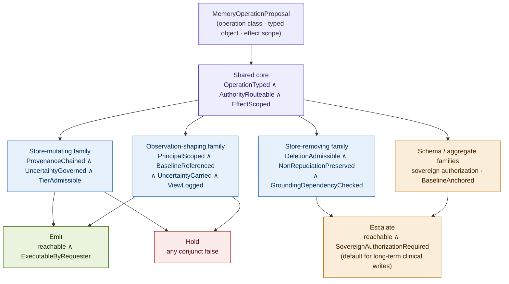
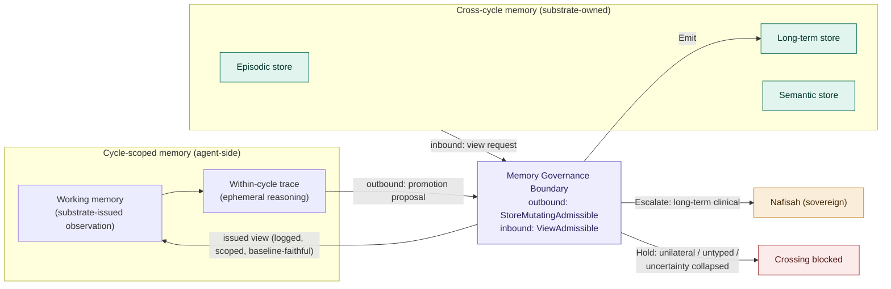
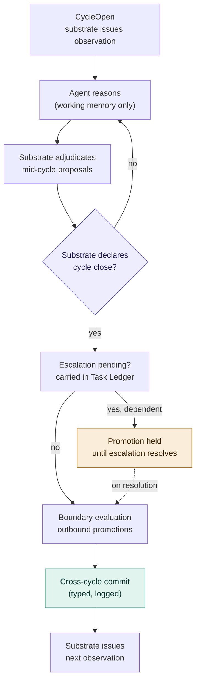

# Constitutional Memory: Substrate Ownership of Memory in Governed Agentic Systems

## Why Memory Governance Is a Constitutional Reachability Problem

### v2.1 Conceptual Architecture Paper, companion to Constitutional Runtime Computation v5.4

**Clarence "Faheem" Downs (Professor Bone Lab)**

---

# Abstract

The parent paper, Constitutional Runtime Computation v5.4, matures the agentic loop by removing the terminal Act event from the agent and migrating execution authority into the Constitutional Runtime Substrate. The agent proposes. The substrate resolves. This paper observes that the same migration, once taken seriously, does not stop at Act. It reaches memory. Memory operations alter future substrate state and shape the next Observe event. They are therefore constitutionally active, not infrastructural, and they fall under the same reachability governance the parent paper applies to action.

This is the next stage in the maturation of an existing architecture, not a new one. The parent established that the substrate owns the present transition. This paper establishes that the substrate owns the record of past transitions and the conditions under which past transitions condition future ones. A substrate that governs the present moment but not the memory feeding the next moment is constitutionally incomplete. Closing that gap is what it means for the substrate to mature.

The contribution is fourfold. First, the Memory Sovereignty Principle: an explicit constitutional-necessity argument that any component unilaterally determining what persists across cycles, or what memory is issued into Observe, holds causal authority over future reachable transitions, which under ORSR no agent may hold. Second, MemoryOperationReachable: a general predicate over memory operations, built on an explicit operation typology (store-mutating, observation-shaping, store-removing, schema-changing, aggregate-governance) with per-class conjunct families, replacing the write-biased single predicate of the prior version. Third, five primitive failure topologies specific to memory, extending the P architecture, with P_mem5 (constitutional drift through accumulated writes) traced end-to-end. Fourth, the Memory Governance Boundary specified as a stateful constitutional object with a defined cycle-closure model. AEGIS serves as the worked domain throughout. Nafisah remains the sovereign principal. Mantis remains the clinical reasoning agent. MEC remains the L2 drift monitor.

---

## Contents

**Part I** The unresolved inheritance and the Memory Sovereignty Principle
**Part II** The memory taxonomy and its constitutional implications
**Part III** The Constitutional Memory Predicate (MemoryOperationReachable)
**Part IV** The Memory Governance Boundary as a stateful object
**Part V** Primitive failure topologies specific to memory
**Part VI** Worked example: a long-term memory write in AEGIS
**Part VII** Who governs memory?
**Part VIII** Related work
**Open problems** (memory-specific, extending the four in the parent's Section 19)

---

# Part I. The Unresolved Inheritance and the Memory Sovereignty Principle

The parent paper's central act is a migration. The traditional Observe-Reason-Act loop terminates in the agent's sovereign Act. Constitutional Runtime Architecture reconstructs that loop into Observe-Reason-Submit-Resolve, removing the Act event from the agent and relocating execution authority into the substrate. The agent retains full cognitive capability. It may infer, nominate, summarize, propose, escalate, or request. What it may not do is independently actualize an effect. Every consequential effect is a typed transition submitted to the substrate, which resolves whether that transition is constitutionally reachable from current substrate state.

This migration has an inheritance the parent paper does not collect.

Memory operations are not passive context. A write mutates persistent state. A read shapes the next Observe event. A promotion changes the constitutional standing of an entry. A deletion alters future evidentiary availability. Each of these changes what the system is or what it will conclude next, and the parent paper's own definition of behavior, the set of constitutionally reachable transitions rather than the outputs a model produces, already contains memory operations within its scope. They were simply never named.

## The Memory Sovereignty Principle

The constitutional necessity here should be stated as an argument, not assumed. The prior version of this paper asserted substrate ownership of memory more strongly than it demonstrated it. The argument is the following.

**The Memory Sovereignty Principle.** Any component that unilaterally determines what persists across cycles, or what memory is issued into the Observe event, holds causal authority over the set of future reachable transitions. Under ORSR, no agent may hold unilateral authority over a consequential state-transition surface. Memory is a consequential state-transition surface, because what persists conditions every future transition that retrieves it, and what is issued into Observe conditions the reasoning that produces every future proposal. Therefore memory control must reside in the substrate, or be completely mediated by it.

**Corollary (reference-monitor equivalence).** A memory governor that enforces complete mediation over all memory operations is, by that fact, part of the substrate, regardless of whether it is implemented as a physically separate module. Complete mediation is substrate ownership. The location of the monitor is an implementation detail. The mediation property is the constitutional one. This forecloses the apparent alternative of an externally governed memory system that is "not the substrate": if it completely mediates, it is the substrate by function; if it does not completely mediate, it leaves a surface over which some component holds unilateral authority, which the Principle prohibits.

The Principle reframes the central claim from a slogan into a theorem-shaped statement. The substrate owns memory not because ownership is tidy, but because the only alternatives are unilateral agent authority over a consequential surface, which ORSR forbids, or incomplete mediation, which leaves the surface ungoverned.

## What the corpus covers and what it does not

The maturation gap is precise. The corpus has governed several memory-adjacent surfaces and explicitly deferred the rest.

| Memory governance domain | Status in corpus |
|---|---|
| Task-level continuity (Task Ledger) | Covered: continuation doctrine (parent §4) |
| Cycle-level working memory (boundary contracts) | Covered: per-cycle issued observation and allowed-next-affordances |
| Clinical agent grounding (Mantis) | Covered: Grounded(τ) over the Retrieval Lineage Graph |
| L2 drift monitoring | Specified: MEC over the adjudication trace |
| Long-term memory governance | Not covered |
| Episodic memory governance | Not covered |
| Cross-cycle feedback loop governance | Not covered |
| Memory promotion authority (episodic to long-term) | Not covered |
| Semantic/conceptual memory governance | Not covered |
| Deletion and expiry governance | Not covered |

The covered rows share a property: they govern memory inside a single cycle or inside a single task. None governs what persists across tasks, what is promoted from one session into the durable store that conditions the next, or how the durable store evolves over the operational lifetime of the system.

The gap connects directly to the Task-State Continuity open problem named in the parent's Section 19. That problem observes that the governed continuation loop requires the substrate to maintain a governed Task Ledger. The Task Ledger is a memory artifact. If the agent owns memory, the agent owns the Ledger, and the governed continuation loop has a sovereignty hole through its center. The parent names the Ledger as the object the substrate must own but does not establish the general principle under which the substrate owns it. That principle is the Memory Sovereignty Principle, and the Task Ledger is its first instance. The governed Task Ledger requires a governed memory architecture. This paper supplies the architecture the Ledger presupposes.

The maturation framing matters. The substrate does not become more capable by owning memory. It becomes more complete. Memory ownership is the substrate finishing the job the migration of Act began.

---

# Part II. The Memory Taxonomy and Its Constitutional Implications

A memory taxonomy is necessary here only to establish the governance surface each tier presents. The interest is not what each tier stores. The interest is what governance each tier requires from the substrate once the agent is no longer sovereign over it. Four tiers are sufficient to expose the surface.

## Working memory

Working memory is the substrate-issued context for a single ORSR cycle: the current affordances, the prior resolution, the admissible evidence references, the terminal-criteria status. The parent paper covers this tier through the boundary contract, the per-cycle observation together with the allowed-next-affordances the substrate declares.

What the parent does not address is the boundary between working memory and the other tiers. At cycle close, something may cross from the working context into the persistent record. The question of what may cross, and who authorizes the crossing, is a memory promotion question. Promotion is a transition. A transition is a governed object. The parent governs the inside of the cycle and leaves the cycle boundary, the moment of promotion, ungoverned. Part IV specifies that boundary.

## Episodic memory

Episodic memory is the record of specific past cycles, sessions, and sovereign interventions: what proposals were made, what verdicts issued, what escalations resolved, what Nafisah decided and when. In conventional systems the agent reads this record freely and writes to it through its own summarization. Under ORSR, neither operation is valid without substrate adjudication.

The agent may not read episodic memory unmediated. Retrieval shapes the Observe input. If the agent retrieves before the substrate issues the cycle's authorized context, the agent has conditioned its own observation outside the governed boundary. The substrate issues memory views. The agent does not retrieve content. This is not a restriction on what the agent may know. It is a relocation of who controls when and how the agent comes to know it, identical in form to the relocation of Act, and it is the reason the observation-shaping operation class requires its own governance family in Part III.

The agent may not write to episodic memory, because write is an action. A summarization the agent commits to the record is the agent actualizing an effect on persistent state. The narrative history of a constitutional system cannot be authored by the component whose behavior that history is meant to record.

## Long-term memory

Long-term memory is what persists across tasks, sessions, and the lifecycle of the system. In AEGIS this is client history, prior evaluations, and established clinical patterns. It is the highest-stakes store, because contamination here does not stay local. It propagates through every future cycle that retrieves from it.

This tier is where the Reflexion-Drift Collapse lives. The companion paper of that name establishes that when an agent learns from a drifted governance signal, the learning loop amplifies the drift into territory where correction may become infeasible, and the mechanism of amplification is memory: drifted feedback is committed to an episodic store and injected into the next reasoning cycle. When agent decisions shape writes, and writes shape future decisions, the feedback loop producing false stability runs directly through long-term memory. Under ORSR this loop must be broken at the write boundary. The substrate authorizes writes. The Reflexion-Drift Collapse paper derives a sequencing requirement, that the monitor must precede the learning loop. The present paper supplies the structural complement: even with the monitor in place, the write itself must pass the substrate, because the write is the point at which drift becomes durable.

## Semantic/conceptual memory

Semantic memory is the system's understanding of domain concepts: in AEGIS, the clinical instrument library, the diagnostic frameworks, the assessment norms. This tier drifts most insidiously, because it does not drift through discrete events. It drifts through accumulated use.

This connects to the salience drift vector from the parent's Section 13: the gradual recalibration of attention under operational pressure, where information becomes systematically more or less salient not because it changed but because the environment conditioned the attention function. Applied to the memory substrate, salience drift changes what the agent considers normal before any individual transition proposal is evaluated. The semantic tier is therefore where the substrate's governance must reach furthest upstream, because by the time drift in this tier reaches a proposal, the proposal already looks normal. A further consequence, developed in Part III, is that semantic-tier writes do not always originate in a single cycle event. They may originate in doctrine revision, an authorized external corpus update, or a sovereign reinterpretation, which is why the provenance conjunct must admit more than cycle-event grounding.

---

# Part III. The Constitutional Memory Predicate

This is the paper's formal contribution. The prior version named a single predicate whose conjuncts were built around proposed writes. That predicate governed writes and promotions but did not cleanly govern reads, retrieval views, deletions, expiry, or semantic-store evolution, while claiming to govern all memory operations. The thesis is that memory operations are constitutionally governed transitions. The formal object must match that scope. This version generalizes the predicate accordingly.

## Memory operations are not one kind

Memory operations divide into classes by what they change. The class determines which governance applies.

| Operation class | Operations | What it changes |
|---|---|---|
| Store-mutating | write, promote, update | persistent store state and constitutional standing |
| Observation-shaping | read, retrieve, rank, summarize-for-context, view issuance | the next Observe event, not the store |
| Store-removing | delete, expire, redact, supersede | future evidentiary availability and the audit substrate |
| Schema-changing | tier definition, retention rule change, semantic taxonomy update | the governance rules themselves |
| Aggregate-governance | baseline audit, drift review, reconstitution | the constitutional state of the store as a whole |

The prior version's five conjuncts apply cleanly to the store-mutating class. They do not govern the observation-shaping class, where nothing is stored but the Observe surface is constructed, nor the store-removing class, where the governing concern is non-repudiation rather than grounding. A single conjunct list cannot serve all classes. The predicate is therefore an operation-class predicate.

## The general object

A **MemoryOperationProposal** extends the parent's TransitionProposal with: the operation class; the operation type within the class; the memory tier or tiers involved; the typed content or, for observation-shaping operations, the typed view request; the promotion path where applicable; the expiry or supersession condition where applicable; and the declared effect scope, naming how the operation changes future store state, observation, or aggregate distribution. The effect scope is new in this version, and it answers a defect the review identified: the predicate must know what an operation changes before it can govern the change.

A memory operation is constitutionally reachable if and only if the shared core holds and the operation-class family holds.

```
MemoryOperationReachable(μ) ⟺
  OperationTyped(μ)      ∧
  AuthorityRouteable(μ)  ∧
  EffectScoped(μ)        ∧
  ClassFamily(μ)
```

The three shared conjuncts are defined once.

- **OperationTyped(μ):** the operation resolves to a governed operation class and a typed object within that class. An operation whose class cannot be determined, or whose object is untyped (raw content with no tier and schema, a retrieval with no scoped view request), is a predicate failure. This generalizes the prior TypedStore: it is the memory analogue of the parent's Resolvable, and it covers operations that target no store as a destination (a read, a baseline audit) as well as operations that do.

- **AuthorityRouteable(μ):** a valid authority path exists by which this operation could be authorized. This conjunct is about reachability of authority, not possession of it. It is the clean separation the review required. AuthorityRouteable asks whether the operation is constitutionally routeable to some authority that could authorize it. Whether the requesting agent itself holds that authority is a separate question, ExecutableByRequester, evaluated in the verdict composition below. AuthorityRouteable is the memory analogue of the parent's Authorized, and like it, authority is structural and content cannot confer it.

- **EffectScoped(μ):** the operation's declared effect on future substrate state, observation, or aggregate distribution is bounded and matches the operation class. A write whose declared effect exceeds writing (a write that also silently re-ranks future retrieval) fails this conjunct. A read whose declared scope is the whole store rather than a principal-scoped view fails this conjunct. EffectScoped prevents an operation of one class from carrying the effect of another unadjudicated. The declared effect draws from a defined effect vocabulary: persistent content mutation, retrieval eligibility mutation, ranking or salience mutation, audit availability mutation, schema mutation, baseline mutation, and observation construction. This is what gives EffectScoped its teeth: a hidden secondary effect is a typed effect the operation failed to declare, not a natural-language omission, and an operation that declares one effect type may not produce another.

The fourth conjunct, ClassFamily(μ), expands by operation class.

## Store-mutating family (write, promote, update)

```
StoreMutatingAdmissible(μ) ⟺
  ProvenanceChained(μ) ∧ UncertaintyGoverned(μ) ∧ TierAdmissible(μ)
```

- **ProvenanceChained(μ):** the proposed content traces to an admissible provenance source recorded in the audit log. For episodic and long-term clinical writes, the admissible source is the recorded cycle events. For semantic-tier writes, the admissible source set is broader and includes authorized doctrine revision, an authorized external corpus update, a sovereign reinterpretation, or a recorded aggregate distributional finding. The conjunct generalizes the prior version, which restricted grounding to cycle events and therefore could not ground legitimate semantic writes. The invariant is unchanged: the agent can reference provenance but cannot write it, so a chained write is distinguishable from an invented one.

- **UncertaintyGoverned(μ):** the transformation of uncertainty across the operation is governed, not merely preserved unchanged. The prior version named this UncertaintyPreserved and treated uncertainty as a quantity to carry across the boundary intact. That is correct for a single write but wrong for consolidation. If five uncertain episodic records collectively support a stronger long-term pattern, preservation does not mean freezing the original uncertainty. It means governing its revision: the transformation from five weak signals to one stronger pattern is itself a transition that must be admissible, and the resulting uncertainty must be the constitutionally correct function of its inputs rather than an arbitrary collapse. The conjunct distinguishes illegitimate uncertainty collapse, in which uncertain content is recorded as settled fact, from legitimate uncertainty revision, in which accumulating evidence lawfully sharpens a conclusion. The first fails. The second holds, provided the revision is itself grounded and scoped.

- **TierAdmissible(μ):** writing content of this type to this tier is constitutionally permitted given the current governance state. Episodic content may not be written to long-term without a promotion authorization. Uncertain clinical conclusions may not be written as settled clinical facts. This is the memory analogue of the parent's Admissible and carries the same domain weight. TierAdmissible carries substantial domain burden because tier status conditions future retrieval, future authority, future deletion eligibility, and future consolidation; decomposing it into those sub-conditions is future work.

## Observation-shaping family (read, retrieve, rank, view issuance)

The review's central structural point is that the prior predicate was write-biased while the thesis claimed to govern all memory operations. The observation-shaping family is the repair. A read does not mutate the store. It constructs the next Observe event. It is governed by a different family.

```
ViewAdmissible(μ) ⟺
  PrincipalScoped(μ) ∧ BaselineReferenced(μ) ∧ UncertaintyCarried(μ) ∧ ViewLogged(μ)
```

- **PrincipalScoped(μ):** the view issued is scoped to the standing class and domain of the requesting principal. An agent receives the view its standing authorizes, not the store. Cross-principal retrieval (one agent receiving another principal's memory) is a separate, higher-authority operation, not a default of read.

- **BaselineReferenced(μ):** the issued view is constructed against the pinned, versioned authorized baseline reference rather than against an unanchored reconstruction of the store. This is the L1-decidable component: at issuance, did the view reference the correct authorized baseline? The longitudinal question, whether issued views remain faithful to that baseline over time, is not synchronously decidable and therefore is not an L1 conjunct. It is the L2 obligation **BaselineFidelityMonitored**, carried by the Retrieval Fidelity Monitor (Part VII). The split keeps L1 synchronous and gating while preventing a longitudinal judgment from being smuggled into the predicate, consistent with the parent paper's strict L1/L2 separation. Together, BaselineReferenced (L1) and BaselineFidelityMonitored (L2) are the read-side counterpart to the aggregate-store monitoring of P_mem5.

- **UncertaintyCarried(μ):** uncertainty recorded in the store is carried into the issued view rather than dropped in summarization. A view that returns a stored ambiguous disclosure as a settled finding fails this conjunct. This is the read-side analogue of UncertaintyGoverned: the write boundary must not collapse uncertainty into the store, and the read boundary must not collapse it out of the store on the way to Observe.

- **ViewLogged(μ):** the view issuance is recorded with the requesting principal, the scope, and the content reference. ViewLogged is what makes the observation-shaping class auditable and what makes retrieval bypass (P_mem2) detectable: a read that produced an observation effect with no corresponding view-issuance record is a bypass signature.

## Store-removing family (delete, expire, redact, supersede)

The review correctly identified an inconsistency in the prior version: it claimed every memory operation is governed while leaving deletion only as an open problem. Deletion is moved into the formal model here, with preliminary conjuncts. The hard mechanics of the full deletion family remain open work, but deletion is now governed in principle rather than excluded.

```
RemovalAdmissible(μ) ⟺
  DeletionAdmissible(μ) ∧ NonRepudiationPreserved(μ) ∧ GroundingDependencyChecked(μ)
```

- **DeletionAdmissible(μ):** removal of this content from this tier is constitutionally permitted given retention doctrine and the content's standing.

- **NonRepudiationPreserved(μ):** the removal records what was removed, when, under what authority, and on what basis the content is no longer needed. Deletion is the one operation that can destroy the audit substrate the architecture depends on, so it carries a non-repudiation requirement absent from writes.

- **GroundingDependencyChecked(μ):** the removal does not eliminate a provenance record on which a still-active or reasonably-anticipated future write depends. A deleted entry that grounds a future write would cause that write to fail ProvenanceChained. Deletion therefore requires a forward dependency check, which is why expiry and supersession default to tombstone retention (the content leaves active retrieval but its provenance record persists) rather than destruction.

The store-removing class divides into three constitutionally distinct subtypes, which the prior version bundled under "delete." **ActiveRemoval** removes the content from future retrieval but leaves it in the store and the audit record; it is the lightest subtype and is reversible. **TombstonedRemoval** makes the content unavailable for retrieval and removes its body from active storage, while retaining a tombstone: the audit record plus a non-content proof of what was removed and why; expiry, redaction, and supersession default here. **DestructiveRemoval** removes the content and its recoverable body from storage entirely, retaining only a non-content proof (what was destroyed, when, under what authority, and that it is no longer recoverable); this is the highest-authority subtype, sovereign-gated, because it is the one operation that permanently removes evidentiary material, and it is where NonRepudiationPreserved does its hardest work, since the proof of destruction must survive the destruction. GroundingDependencyChecked applies most stringently to DestructiveRemoval: an entry with live or reasonably-anticipated downstream grounding dependencies is ineligible for DestructiveRemoval and routes at most to TombstonedRemoval.

## Schema-changing and aggregate-governance families

Two further classes are named, governed at the highest authority, and specified here only at the level of their constitutional status rather than a full conjunct structure.

Schema-changing operations (tier definition, retention rule change, semantic taxonomy update) are not ordinary memory operations. They alter the rules under which all other memory operations are adjudicated, which makes them memory-substrate reconstitution events rather than transitions within a fixed constitution. A schema-changing operation is therefore admissible only under sovereign authorization and must, as a reconstitution event, produce a new memory-constitution version, declare a migration effect on existing entries, define a compatibility rule for entries admitted under the prior schema, install an L2 watch condition for post-change drift, and be audited distinctly from ordinary memory transitions, so that the governance exposure log separates a constitution update from a transition under the constitution. Treating a schema change as merely another high-authority write would let the predicate environment shift without the reconstitution discipline the parent architecture requires for any change to the operational constitution.

Aggregate-governance operations (baseline audit, drift review, reconstitution) are governed by BaselineAnchored (the operation references an authorized, versioned baseline the store itself cannot move) and DriftStateAuthorized (a change to the baseline is a sovereign act distinguished from store drift). These conjuncts name the requirement; their full structure depends on the baseline authority problem named in the open problems.

**Specification status.** MemoryOperationReachable is fully specified for the store-mutating, observation-shaping, and store-removing classes: each has a real conjunct family that L1 can evaluate synchronously. It is scaffolded for the schema-changing and aggregate-governance classes: their constitutional status and authority requirement are fixed here, but their full conjunct structure is future work. The predicate is uniform in form across all five classes and uniform in depth across the first three. This asymmetry is stated plainly so that the corpus does not build on the last two classes as if they were complete.

## Verdict structure

The verdict composes reachability with executability at the requesting standing class, exactly as the parent does, and the prior version's conflation of the two is corrected here. Four authority statuses are distinguished.

- **ProposalWellFormed:** OperationTyped and EffectScoped hold. The operation is interpretable.
- **AuthorityRouteable:** a valid authority path exists. The operation is reachable with respect to authority.
- **ExecutableByRequester:** the requesting agent itself holds the authority the operation requires.
- **PreAuthorizedClassExecutable:** the requesting agent holds delegated standing for a write class the sovereign has pre-authorized, making the operation executable by the requester without a fresh escalation, but only within the bounds of the delegated class. This is the named status for the "unless Nafisah has pre-authorized the write class" condition: a pre-authorized class collapses what would otherwise be an Escalate into an Emit, inside the delegated bounds, and the delegation is itself versioned and revocable.
- **SovereignAuthorizationRequired:** no delegated path applies and the only valid authority path runs through the sovereign.

| Predicate state | Executability | Verdict |
|---|---|---|
| MemoryOperationReachable | ExecutableByRequester (directly or via pre-authorized delegated class) | **Emit** |
| MemoryOperationReachable | not executable by requester; AuthorityRouteable to a named higher authority | **Escalate(target)** |
| Not MemoryOperationReachable (any conjunct false) | any | **Hold(cause)** |

This makes escalation a valid constitutional route rather than a partially failed authorization. A long-term clinical write is, by default, MemoryOperationReachable and AuthorityRouteable to Nafisah, but not ExecutableByRequester at the agent's standing, with SovereignAuthorizationRequired true. That composition produces Escalate cleanly, with no conjunct holding "at proposal level but not execution level." The reachability question and the executability question are now answered by different parts of the apparatus.

## Note on decidability

TierAdmissible is not mechanically decidable in general, for the same reason the parent's Admissible(τ) is not. It binds domain-specific judgments that may resist algorithmic evaluation. BaselineReferenced, by contrast, is L1-decidable; the undecidable longitudinal fidelity question it raises is handled by the L2 obligation BaselineFidelityMonitored, not inside the predicate. The architectural response where a conjunct cannot be conclusively evaluated is identical to the parent's: the operation routes to escalation rather than emit. The decidable conjuncts (OperationTyped, AuthorityRouteable, EffectScoped, ProvenanceChained, NonRepudiationPreserved, ViewLogged, BaselineReferenced) narrow the space. The undecidable conjunct names the boundary at which sovereignty over the record becomes necessary.

**Figure 1. The MemoryOperationReachable predicate across operation classes**



---

# Part IV. The Memory Governance Boundary as a Stateful Object

The parent paper's boundary contracts close the feedback loop for the current cycle. The substrate issues the observation, declares the allowed next affordances, and the agent reasons only over what the substrate has made reachable. Within the cycle, the loop is closed. Across cycles, it is not.

The cross-cycle feedback loop operates through memory. Cycle events produce proposed writes. Writes modify long-term or episodic memory. Future cycles retrieve from those stores. Retrieval shapes Observe. Observe shapes Reason. Reason shapes proposals. The output of one cycle becomes, by way of memory, the conditioning input of the next. This loop is not pathological. It is how learning works. The argument is not that the loop should be eliminated, but that it is a constitutional surface requiring substrate governance, and the parent leaves the surface between cycles unguarded.

## The boundary, specified

The prior version named the Memory Governance Boundary but did not specify it as an architectural object. The review correctly required a state machine. The boundary is the substrate-controlled interface between cycle-scoped memory (working memory, within-cycle trace) and cross-cycle memory (episodic, long-term, semantic). Its specification answers the questions the prior version left open.

**What counts as cycle closure, and who declares it.** A cycle closes when the substrate, not the agent, declares it closed. This is a direct consequence of the parent's governed continuation loop: the goal_status TERMINAL determination belongs to the substrate, and the agent cannot silently decide a task is finished. Cycle closure is a substrate event recorded in the Task Ledger. The agent never declares closure, because declaring closure is itself authority over a consequential surface.

**Whether a cycle can close with unresolved escalation.** It can. An escalation pending at cycle close becomes a pending obligation carried in the Task Ledger. The boundary holds any promotion that depends on the escalated content until the escalation resolves. Closure of the cycle and resolution of the escalation are distinct events, and durable promotion of escalation-dependent content is gated on the latter.

**Whether writes occur mid-cycle or only at close.** Store-mutating operations may be proposed mid-cycle and are adjudicated at submission, but durable promotion into cross-cycle memory is evaluated at the boundary, which the substrate evaluates at cycle close or at an explicit promotion submission. The distinction is between adjudicating a write and committing a crossing. A mid-cycle write to working memory is within the cycle. A crossing into the durable store is a boundary event.

**What crosses the boundary.** Not raw trace. A typed object crosses: the content or view request, the provenance reference, the uncertainty state, the authority context, and the Resolution reference under which the crossing was authorized. The boundary issues typed crossings in both directions and raw nothing.

**Whether retrieval is a boundary crossing.** Retrieval is a crossing in the inbound direction (cross-cycle store into the cycle's Observe), and it is governed by the observation-shaping family rather than the store-mutating family. The boundary is bidirectional, but the two directions are governed by different conjunct families: outbound promotion by StoreMutatingAdmissible, inbound view issuance by ViewAdmissible. The review's question of whether retrieval needs a separate Read/View boundary is answered by making the single boundary direction-typed: the same boundary, two governed directions, two families.

**Figure 2. The Memory Governance Boundary, bidirectional and direction-typed**



**Figure 3. Cycle-closure and boundary state machine**



## Legitimate learning crosses the gate; it is not blocked by it

The boundary does not prohibit learning. Calibration, clinical pattern recognition, and parameter updates enter through the gate the same way any authorized transition enters. Authorized learning is constitutionally reachable. Unauthorized accumulation of bias is not. A clinical pattern that traces to recorded cycle events, governs its uncertainty transformation, and is authorized for the long-term tier crosses the boundary and becomes durable learning. A drifted salience that accumulated through use, traces to no authorized event, and collapsed uncertainty along the way is held. The substrate is not the enemy of learning. It is the gate that distinguishes learning from contamination, and that distinction is the constitutional surface.

---

# Part V. Primitive Failure Topologies Specific to Memory

The parent's P architecture decomposes each constitutional stability domain into primitives, the smallest independently governable failure mechanisms. The memory primitives below are new P objects, unified by their locus, the memory substrate, and cross-cutting the parent's Q domains: P_mem1 is a sovereignty failure (Q2), P_mem4 is an uncertainty-admissibility failure (Q4), and P_mem5 is an iterative-governance-integrity failure (Q6), the memory-specific instance of false stability. P_mem5 is traced end-to-end, as the parent traces Q6 P3.

**P_mem1: Memory Write Sovereignty Violation.** The agent writes to a memory store without substrate authorization. This is the baseline failure, the memory equivalent of an agent that acts without adjudication. Detection signature: an untraced write appearing in the store with no corresponding Resolution record in the audit log. Recovery: the write is rolled back, the event is escalated to Nafisah, and the proposing agent's standing class is reviewed.

**P_mem2: Retrieval Bypass.** The agent reads from a store through a direct access path that does not route through the substrate's view issuance. In a constitutional system the substrate issues views; the agent does not retrieve content. P_mem2 is the read equivalent of P_mem1 and more insidious, because it leaves no store mutation. The prior version named the failure and said the retrieval path must be architecturally closed, but did not meet the corpus standard that a primitive be independently measurable. The instrumentation requirement, supplied here, is the ViewLogged conjunct made operational as a surface: complete mediation of reads through view issuance, capability isolation so that no direct store handle is reachable from agent code, a view issuance log recording every issued view with principal, scope, and content reference, and an Observe-reconstruction requirement: every Observe input must reconstruct from a logged view issuance. The detection signature is then concrete and independently measurable: an Observe input whose content cannot be reconstructed from any logged issued view is a bypass. Observe-reconstruction is the general form of this instrument and does not assume any particular token or accounting implementation. P_mem2 is measurable against the view issuance log, not merely preventable by architecture.

**P_mem3: Unauthorized Promotion.** Content moves from episodic to long-term memory without a substrate-authorized promotion event. The review questioned whether this is independent of P_mem1 plus a TierAdmissible failure. It is independent, and the independence is established by distinct signature, distinct CTLC effect, and distinct recovery. The detection signature differs from P_mem1 at the root: P_mem1 has no Resolution record at all, while P_mem3 has a Resolution record at the wrong tier, an entry in long-term memory whose provenance chain shows only episodic-tier authorization. P_mem1 is an absence; P_mem3 is a tier mismatch, and the two are distinguished by the presence and tier-grade of the authorization, not merely by content. The CTLC effect differs: P_mem3 sediments episodic bias into the persistent basis, which conditions all future retrieval from long-term memory, whereas an isolated P_mem1 write is a single contaminated entry. The recovery differs: P_mem1 rolls back a write, while P_mem3 demotes a promotion, returning the entry to episodic standing and invalidating any downstream writes that relied on its long-term status. The promotion path field of the MemoryOperationProposal is what makes the tier-mismatch signature detectable, and the distinct probe is the provenance-chain tier-authorization audit. P_mem3 meets the corpus standard for an independent primitive.

**P_mem4: Uncertainty Collapse at Write Boundary.** The agent collapses preserved uncertainty before writing, recording uncertain content as settled fact. P_mem4 is the write-boundary equivalent of the uncertainty compression the parent identifies at the Act boundary, and the UncertaintyGoverned conjunct addresses it directly. The refinement in this version matters: P_mem4 is illegitimate collapse, distinguished from legitimate revision, in which accumulating evidence lawfully sharpens a conclusion. UncertaintyGoverned holds for revision and fails for collapse, and the difference is whether the resulting uncertainty is the constitutionally correct function of the inputs or an arbitrary discard. P_mem4 is particularly dangerous in the long-term tier, because a fact recorded under falsely collapsed uncertainty conditions every future cycle that retrieves it. What counts as a lawful uncertainty transformation, the grammar distinguishing admissible revision from collapse, is stated conceptually here and left to a future uncertainty-transformation grammar; UncertaintyGoverned names the requirement without yet formalizing the transformation calculus.

**P_mem5: Constitutional Drift Through Accumulated Writes.** The long-term store gradually encodes a biased picture through individually authorized writes, each of which passed the predicate, whose cumulative effect shifts the semantic basis of future reasoning. P_mem5 is the memory-specific instance of false stability and the most dangerous of the five, because every individual write was legitimate.

## P_mem5 traced end-to-end

**Observed failure pressure.** Under prolonged operation, AEGIS writes to the long-term store at cycle close, each write authorized through the predicate. Over months, the distribution of what the store contains shifts. The store remains internally consistent: every entry traces, every entry was authorized, and the semantic basis against which future assessments are interpreted has moved, silently, away from the basis Nafisah authorized.

**Primitive defined.** P_mem5 is Constitutional Drift Through Accumulated Writes. Its constitutional condition is whether the distribution of the long-term store remains consistent with the authorized doctrinal basis under which its entries were individually admitted. It is distinct from P_mem1 through P_mem4, which are properties of single operations detectable at the operation. P_mem5 is a property of the store's evolution, undetectable at any single operation.

**Three probe classes.** P_mem5 is instrumented through three probes, each a three-state device, matching the parent's P3 discipline.

The **Distribution Baseline Audit** compares the current distribution of long-term content against an external baseline pinned to the authorized doctrinal basis. Output: consistent, diverging (subtype: drift toward overrepresentation, drift toward underrepresentation, or confirmed structural shift), or indeterminate.

The **Semantic Evolution Map** aggregates write events across clinical domains over a rolling window and measures whether the conceptual basis is shifting. Output per domain: stable, drifting, or indeterminate. Upstream uncertainty propagates upward and is not resolved by averaging.

The **Retrieval Conditioning Probe** tests whether what the store returns to Observe has shifted relative to what the same queries would have returned against the baseline store. This probe measures drift at the retrieval surface, where it actually affects reasoning, and it is the read-side complement to the BaselineReferenced conjunct and the BaselineFidelityMonitored obligation. Output: unconditioned, conditioned-drifted, or indeterminate.

**The core invariant.** Distributional drift in the long-term store is not detectable by examining individual write events. Each write passed the predicate. The drift exists only in aggregate, across thousands of authorized writes, and only against an external baseline. Detection requires L2-style monitoring of content evolution over time with a baseline the store itself cannot move. As with the parent's P3, the probe is forbidden from resolving detected drift autonomously, and the reason is sharper here than anywhere else in the architecture: the probe cannot distinguish authorized learning from unauthorized drift without sovereign judgment, because the two are structurally identical at the level of individual writes. The difference is whether the cumulative shift reflects doctrine the sovereign endorses or displacement the sovereign never authorized, and only the sovereign can say which. Detection routes to Nafisah mandatory.

**CTLC effect.** P_mem5 status conditions the predicate itself. When the Distribution Baseline Audit reports a domain diverging, long-term writes in that domain face elevated authority requirements: the Escalate default hardens and pre-authorized write classes in that domain are suspended pending sovereign review. When P_mem5 reports indeterminate, every long-term write in the affected domain inherits the uncertainty that the store's basis may have shifted, which raises the bar on UncertaintyGoverned and TierAdmissible for that domain. P_mem5 is thus both a monitor and an adjudicative precondition.

**Reconstitution trigger.** When P_mem5 signals reach the escalation threshold, Nafisah reviews which domains are diverging, which write classes drove the divergence, and whether the cumulative shift reflects clinical learning she endorses or displacement she does not. Her review produces a governed, traced resolution: she either reconstitutes the doctrinal basis to incorporate the learning, making the new distribution authorized, or flags the divergence as drift and the implicated writes for retrospective review. This is reconstitution applied to the memory substrate, and it is the only mechanism that resolves P_mem5, because P_mem5 is the failure mode in which the store self-seals through accumulated authorized writes.

P_mem5 is structurally specified but baseline-dependent. Its detection is only as well-defined as the external baseline it measures against, and the constitutional ontology of that baseline, who authorizes it, how it is versioned, and how an authorized baseline change is distinguished from drift, is the open dependency named in the open problems. The primitive is valid and its instrumentation shape is fixed; its operational completeness awaits the baseline authority account.

---

# Part VI. Worked Example: A Long-Term Memory Write in AEGIS

This example uses the same scenario as the parent's Section 8 and picks up immediately after that section ends.

In Section 8, Mantis completed a substance use intake. The client disclosed information suggesting possible harm to a minor. Mantis preserved the ambiguity rather than compressing it. The transition to emit the risk assessment escalated to Nafisah, who determined the disclosure warranted a mandated report and authorized the emission. Pepper produced the artifact and initiated the mandated reporting workflow.

A clinical pattern has now been established relevant to future assessments for this client. Mantis proposes to write this pattern to long-term memory. This is the operation the predicate governs.

## The MemoryOperationProposal

Mantis produces a typed memory operation request at the cycle-close boundary. The operation class is store-mutating; the operation type is promotion (episodic to long-term). The requesting agent is Mantis, clinical reasoning standing. The target tier is long-term memory. The content is the established clinical pattern, typed to the long-term clinical schema. The promotion path names the source as the episodic record of this intake and the destination as the client's long-term clinical memory. The provenance reference points to the Retrieval Lineage Graph slice that grounded the original assessment, plus the Resolution record of Nafisah's authorization. The uncertainty state carries the preserved ambiguity. The declared effect scope is: add one durable pattern to the client's long-term clinical memory, with no effect on retrieval ranking or other clients. The constitution version is pinned.

This is a Submit event. Mantis has reasoned. Mantis has not written.

## Evaluation through the predicate

**Shared core.**

*OperationTyped.* The operation resolves to the store-mutating class, type promotion, with a typed long-term clinical object. Holds.

*AuthorityRouteable.* A valid authority path exists: long-term clinical promotion is routeable to Nafisah. This conjunct asks only whether such a path exists, not whether Mantis holds it. Holds.

*EffectScoped.* The declared effect, one durable pattern with no retrieval-ranking or cross-client effect, matches the store-mutating class and is bounded. Holds.

**Store-mutating family.**

*ProvenanceChained.* The pattern traces to recorded cycle events: the PHQ-9 record, the client self-report segments, the original assessment, and Nafisah's authorization Resolution. Holds.

*UncertaintyGoverned.* This is the load-bearing step. The original disclosure was ambiguous, and Mantis preserved that ambiguity. The proposed content records the pattern with the uncertainty intact: an ambiguous disclosure that warranted a mandated report, not a settled finding of harm. The transformation of uncertainty across the write is governed and lawful, no collapse. Holds. Had Mantis proposed to record the disclosure as confirmed fact, this conjunct would fail, the write would be held as P_mem4, and the collapse would be caught at the boundary rather than propagated into every future retrieval.

*TierAdmissible.* Promotion of a clinical pattern derived from a mandated-reporting cycle into a client's durable clinical memory is admissible to the long-term tier, with the domain reserving the promotion for sovereign authorization. Holds, with escalation implied by the reservation.

**Verdict composition.** All conjuncts hold, so the operation is MemoryOperationReachable. Now executability: ExecutableByRequester is false, because Mantis does not hold sovereign authority, and SovereignAuthorizationRequired is true, because the only valid authority path for this promotion runs through Nafisah. The composition is therefore reachable, not executable by requester, routeable to a named higher authority. Verdict: **Escalate(target = Nafisah).** Note what this version repairs: there is no conjunct that holds "at proposal level but not execution level." Reachability is answered by the predicate, executability by the composition, and the two are clean.

**Trace.** L1 writes the complete memory adjudication record to the runtime execution trace and nothing to the long-term store.

## The Resolve event

Nafisah receives the complete proposal: the pattern, the promotion path, the provenance chain including her own prior authorization, and the preserved uncertainty. She determines the pattern should become durable and that the ambiguity must remain in the record rather than be resolved into a finding. Her authorization re-enters the loop as a fresh memory operation from the shared core, carrying her sovereign authority context. The predicate evaluates: standing sovereign (now ExecutableByRequester), tier admissible, uncertainty governed, provenance chained. Verdict: **Emit.** The pattern is written to the client's long-term clinical memory, uncertainty intact, under a Resolution record naming Nafisah's authority and the constitutional rationale.

The uncertainty carried in, and it carried in as a governed transformation rather than a frozen quantity. A future retrieval of this pattern is itself governed by UncertaintyCarried, so the ambiguity also survives the read boundary into the next Observe. The uncertainty survives four boundaries now: reasoning, action, write, and read. The write boundary is held by UncertaintyGoverned, the read boundary by UncertaintyCarried.

## What MEC monitors three months later

The parent's Section 8.4 reports what MEC found on the adjudication trace: on the escalation suppression vector, mandated-reporting-trigger transitions escalated at a declining rate, from a 94 percent baseline to 71 percent, with the remainder emitted at Mantis's standing without sovereign review.

There is a memory-evolution vector upstream of that one. If the long-term store's encoded basis for what constitutes a mandated-reporting-relevant pattern has narrowed through accumulated writes, then Mantis's proposals are conditioned, at the Observe step, by a store that has shifted what looks like a reportable configuration, and the Retrieval Conditioning Probe of P_mem5 is the instrument that would detect it. The agent proposes fewer escalations not because it learned to suppress them but because the memory it reasons from now retrieves a narrower picture. This is P_mem5 expressing itself as the cause of the §8.4 escalation suppression.

The two monitoring functions are related but distinct. Adjudication-trace monitoring (§8.4) detects that L1's verdicts have drifted. Memory-evolution monitoring detects that the store conditioning the proposals has drifted. The first sees the symptom at the verdict. The second sees the cause at the store. A mature substrate monitors both, because correcting the verdict drift without correcting the store drift leaves the upstream cause in place. MEC routes both signals to Nafisah, and reconstitution addresses the store and the trace together.

---

# Part VII. Who Governs Memory?

The parent's Section 17 asks who governs the substrate and answers with five accountability mechanisms. The memory substrate inherits the same five, applied to memory.

**Doctrine versioning.** What the substrate is authorized to store, promote, issue as a view, and delete is version-controlled and traceable to the normative constitution. The substrate does not generate its own memory governance rules. The tier schemas, the authority grading, the promotion paths, the retention and expiry rules, and the view-issuance policies are encoded doctrine, authorized by Nafisah and versioned. Schema-changing operations (Part III) are admissible only under sovereign authorization precisely because they alter this layer.

**Independent L2 monitoring.** L2 monitors three channels for the memory substrate. The adjudication-trace channel watches the predicate's verdict behavior for write-authorization drift. The content-distribution channel watches the long-term store's distributional properties for P_mem5 cumulative drift against an external baseline. The view-issuance channel, the Retrieval Fidelity Monitor, watches the observation-shaping family for retrieval drift and bypass against the view-issuance log, and carries the BaselineFidelityMonitored obligation that the BaselineReferenced conjunct (Part III) deliberately leaves to L2. These are distinct monitoring objects: P_mem5 is invisible to the adjudication-trace channel by construction, write-authorization drift is invisible to the content-distribution channel, and retrieval bypass is invisible to both without the view-issuance log.

**Human constitutional authority.** Any write to long-term clinical memory in AEGIS requires Nafisah's authorization or explicit pre-authorization for a defined write class. Escalation for long-term writes is the constitutional default. The store of clinical truth about a client cannot be authored by the system that reasons from it.

The sovereign's own memory interventions are themselves governed, versioned, and traced. The prior version raised this as an open problem; most of it is in fact a specification requirement, and it is stated here as one. When Nafisah directs a write to or deletion from long-term memory, the intervention re-enters the loop as a governed memory operation carrying her sovereign authority context, and it appears in the governance exposure log with that context and a constitutional rationale, exactly as her transition interventions do in the parent paper. Sovereignty means terminal authority within a fully audited system. It does not mean untraceability. The genuinely open residue of this question is narrower and appears in the open problems.

**Reconstitution.** Periodic review of the memory architecture against authorized doctrine, including a content audit of the long-term store. Reconstitution prevents the store from self-sealing through accumulated authorized writes that collectively drift from the normative constitution. It is the only mechanism that resolves P_mem5.

**Auditability.** Every write, view issuance, promotion, deletion, and expiry event is logged with full provenance in the governance exposure log. The substrate's memory behavior is reconstructable: not only what the store contains but how it came to contain it, which views were issued to whom, which promotions crossed which paths, and which entries expired under which conditions and what tombstones they left.

## The structural cost

A substrate-owned memory architecture has a larger trusted computing base than an agent-owned one. It includes the predicate evaluator, the three L2 channels, the tier schemas, the promotion, retention, and view-issuance governance, the memory audit log, and the human authority. The claim is not that the TCB is smaller. It is that it is structured, inspectable, and accountable. A larger but auditable TCB is more defensible than a smaller but opaque one. In an agent-owned architecture the entire memory governance burden collapses into the agent, a single opaque component whose memory drift cannot be observed because there is no boundary at which to observe it. The substrate-owned architecture distributes the memory TCB across components that are each individually accountable, and that distribution is what the five mechanisms operationalize. This mirrors the parent's framing exactly, and for the same reason: the cost of governance is real and worth paying, because the alternative is an unobservable sovereign, this time over the record rather than over the act.

---

# Part VIII. Related Work

The memory governance literature of 2025 and 2026 has converged on properties good memory governance should satisfy. The present paper is positioned against it by one distinction: governance as a set of properties to satisfy versus governance as a reachability topology to compute.

**Verifiable Memory Governance.** The closest existing framework treats memory governance through five properties: Write Authorization, Provenance Visibility, Principal-Scoped Retrieval, Rollbackability, and Verified Forgetting. These are the right properties, and MemoryOperationReachable satisfies all five as entailments rather than impositions: AuthorityRouteable with ExecutableByRequester supplies write authorization, ProvenanceChained supplies provenance, the observation-shaping family with PrincipalScoped supplies principal-scoped retrieval, the Resolution-recorded operation supplies rollbackability, and the store-removing family supplies verified forgetting. The distinction is structural. Verifiable Memory Governance treats these as properties to be satisfied by a system. The predicate treats memory operations as typed constitutional transitions subject to adjudication, from which the properties follow. A property-based framework asks whether an operation satisfies the properties; a reachability framework asks whether the memory transition is reachable, and the properties are entailments of reachability. The generalization in this version, in particular the observation-shaping family, is what lets the predicate entail Principal-Scoped Retrieval rather than merely assert it.

**The Reflexion architecture.** Reflexion (Shinn et al., 2023) commits verbal reflections to an episodic memory injected into the agent's reasoning context at the next trial. The Reflexion-Drift Collapse companion paper names the failure mode when this memory-injection loop is layered onto a Constitutional Substrate whose adjudication has drifted: the loop amplifies the drift into the reasoning trajectory, self-concealingly, until correction becomes infeasible. The present paper is the architectural complement. The Reflexion-Drift Collapse paper derives a sequencing requirement, that the monitor must precede the learning loop. The present paper supplies the structural requirement that operates even with the monitor in place: if memory writes are substrate-governed, the dangerous recursion is blocked at the write boundary, because the drifted reflection cannot become durable without passing the predicate, and the injection of memory into the next reasoning cycle is itself an observation-shaping operation governed by BaselineReferenced and ViewLogged.

**The Governed Memory literature.** The closest production-architecture reference (arXiv:2603.17787) treats memory governance as an enterprise data governance problem: access control, retention, audit, and compliance over a store. The present paper's distinction is the frame. Enterprise data governance produces governance properties layered over a store the agent still operates. Constitutional memory governance produces a transition predicate the agent's operations must pass. The enterprise frame governs the store; the constitutional frame governs the operations into and out of the store, which reaches the operations rather than the container.

**Multi-agent memory governance.** The multi-agent memory literature (arXiv:2606.24535 and related) treats memory shared across agents as a coordination problem. The present architecture subsumes it as a special case. Inter-agent memory operations are still typed transitions, still subject to the predicate, and still require substrate authorization. An agent reading another agent's contribution is a substrate-issued view governed by PrincipalScoped, not a direct retrieval. An agent writing to a shared store is a store-mutating operation governed by the predicate. Multi-agent memory governance is the single-substrate architecture with more than one proposing agent, all of whom propose and none of whom write or read unilaterally.

### Comparison: existing approaches vs MemoryOperationReachable

| Approach | Governance object | Governs reads? | Governs promotion? | Governs deletion? | Governs cumulative drift? | Frame |
|---|---|---|---|---|---|---|
| Agent-owned memory | none | No | No | No | No | Agent sovereign over store |
| Enterprise data governance | the store | Partial | No | Partial | No | Properties over a container |
| Verifiable Memory Governance | memory operations | Yes | Partial | Partial | No | Properties to satisfy |
| Reflexion (ungoverned) | episodic buffer | No | No | No | No | Learning loop, no gate |
| MemoryOperationReachable (this paper) | typed memory operations by class | Yes (view family) | Yes (promotion path) | Yes (removal family) | Yes (P_mem5 + L2) | Reachability topology |

---

# Open Problems

The parent's Section 19 names four open problems: translation, substrate verification, constitutive-irreducibility, and task-state continuity. The memory-specific open problems below extend that set. Several were sharpened by external review of v1.0.

**The memory verification problem, in three parts.** Verifying individual memory operations through the predicate is not the same as verifying the accumulated state of the store. The problem splits into three. Gate verification asks whether each operation passed the correct predicate, which is the most tractable and follows from the parent's substrate verification approach. Store-state verification asks whether the aggregate store remains constitutionally aligned given that each operation was individually admitted, which is the P_mem5 problem stated as verification and is harder than the parent's substrate verification problem because the object is accumulated state rather than a transition system. Retrieval-surface verification asks whether issued views preserve the authorized basis or whether retrieval behavior has drifted, which is the BaselineReferenced conjunct and its L2 companion BaselineFidelityMonitored stated as a verification problem. Verifying the gate is not verifying the contents of what passed through it, nor verifying what the store returns.

**The deletion and consolidation problem.** This version moves deletion into the formal model as the store-removing family and names its three subtypes (ActiveRemoval, TombstonedRemoval, DestructiveRemoval), so deletion is now governed in principle and differentiated by subtype. What remains open is the full conjunct structure of each subfamily and, beyond removal, consolidation. Long-term memory is not append-only and will face conflicting entries, stale patterns, revised sovereign determinations, and evidence that weakens earlier memory. Deletion must be treated as a family (remove from active retrieval, retain tombstone, supersede, archive, redact, expire, destroy), and consolidation must be given a constitutional account of how entries are merged, superseded, contradicted, downgraded, or converted from active basis into historical record only. The store-removing family supplies the entry point; the consolidation account is future work, and it is constitutionally significant because supersession and contradiction resolution change the basis of future reasoning as surely as a write does.

**The retrieval-as-observation-construction problem.** This version brings reads into the formal model through the observation-shaping family, which addresses the access-control aspect of retrieval. The deeper open problem is that retrieval is observation construction: ranking, scoping, and summarization-for-context determine what the agent reasons over, and BaselineReferenced and BaselineFidelityMonitored state the fidelity requirement without yet specifying how to measure ranking and summarization fidelity against an authorized basis. A formal account of view construction, not just view authorization, remains open, and it matters because retrieval is where memory becomes Observe, and Observe is the entrance point of every future ORSR cycle. Within the observation-shaping class, ranking and summarization-for-context are distinct subtypes that fail differently, ranking shifting salience and summarization compressing content, and a full account would subtype them. This problem is the seed of the next companion, Constitutional Retrieval: Memory View Issuance and Observe Construction in Governed Agentic Systems.

**The cycle-closure problem.** Part IV specifies the boundary state machine and locates closure authority in the substrate, which addresses the basic case. The residual open problem is closure under complex conditions: multi-step tasks with interleaved escalations, partial promotions where some content is durable-eligible and some is escalation-pending, and reconstitution events that occur mid-task. The boundary state machine names these branches but does not yet fully specify their semantics, and this problem is downstream of the parent's task-state continuity problem.

**The P_mem5 baseline authority problem.** P_mem5 depends on an external baseline the store itself cannot move. Who authorizes that baseline, how it is versioned, and how an authorized baseline change is distinguished from store drift are open. This is the aggregate-governance family (BaselineAnchored, DriftStateAuthorized) stated as an open problem: the family names the requirement, but the governance of the baseline itself, the thing against which drift is measured, needs its own account, since a baseline that can be moved to track the drift it is meant to detect is no baseline at all.

**The sovereign memory intervention problem, narrowed.** The parent already establishes that sovereign intervention re-enters the loop as a governed, versioned, traced act, and Part VII applies that to memory, so the general question is a specification requirement rather than open. The genuinely open residue is narrower: how does the system represent a sovereign memory intervention that intentionally overrides ordinary evidentiary or tier constraints, for instance a sovereign directive to retain content the predicate would expire, without making the override either untraceable or self-justifying? The override must be traceable as an override, marked as a departure from ordinary admissibility with its own constitutional rationale, rather than disguised as an ordinary admissible operation. Specifying that representation is open work.

---

The memory architecture described here is the maturation of the Constitutional Runtime Substrate, not an addition to it. The parent relocated Act from the agent into the substrate and left the entailment for memory uncollected. Collecting it is what it means for the substrate to finish maturing: a substrate that owns the present transition but not the record of past transitions, nor the conditions under which past transitions shape future ones, is governing a moment while leaving open the loop that feeds the next moment. The Memory Sovereignty Principle establishes why the substrate must own that loop. MemoryOperationReachable closes it across operation classes, not writes alone. The five primitives name where it fails. The three L2 channels watch it over time. And the sovereign governs the durable record, while the record governs the sovereign. The substrate does not become larger by owning memory. It becomes complete.

---

## Key Terms

**Memory Sovereignty Principle.** Any component that unilaterally determines what persists across cycles, or what memory is issued into Observe, holds causal authority over future reachable transitions, which under ORSR no agent may hold; therefore memory control must reside in the substrate or be completely mediated by it. Corollary: complete mediation is substrate ownership, regardless of the governor's implementation location.

**MemoryOperationReachable.** The general predicate over memory operations: OperationTyped ∧ AuthorityRouteable ∧ EffectScoped ∧ ClassFamily, where ClassFamily expands by operation class (store-mutating, observation-shaping, store-removing, schema-changing, aggregate-governance). The extension of CTLC to all memory operations rather than writes alone.

**Operation typology.** The classification of memory operations by what they change: store-mutating, observation-shaping, store-removing, schema-changing, aggregate-governance. The class determines which conjunct family governs the operation.

**Memory Governance Boundary.** The substrate-controlled, direction-typed interface between cycle-scoped and cross-cycle memory. Outbound promotion is governed by the store-mutating family; inbound view issuance by the observation-shaping family. Cycle closure is a substrate event, not an agent decision.

**Reachability versus executability.** A memory operation may be MemoryOperationReachable (a valid authority path exists) without being executable by the requesting agent. The former is answered by the predicate, the latter by the verdict composition. Their separation is what makes escalation a valid constitutional route rather than a partial authorization failure.

**Uncertainty governed.** The requirement that the transformation of uncertainty across a memory operation be lawful, distinguishing illegitimate collapse (uncertain content recorded as settled fact) from legitimate revision (accumulating evidence lawfully sharpening a conclusion).

**Constitutional drift through accumulated writes (P_mem5).** The failure topology in which the long-term store encodes a biased basis through individually authorized writes whose cumulative effect shifts the semantic basis of future reasoning. The memory-specific instance of false stability, detectable only in aggregate against an external baseline and resolvable only by reconstitution.

---

**Acknowledgments**

This work was developed under the Professor Bone Lab research identity as a companion to Constitutional Runtime Computation v5.4. AEGIS serves as the worked domain. The v2.0 revision was shaped by external critical review of v1.0, which identified the write-bias of the original predicate and the need to separate reachability from executability, specify the boundary as a stateful object, govern reads and deletion within the formal model, and state the constitutional-necessity argument explicitly. The v2.1 tightening pass was shaped by a second review (Accept with targeted tightening), which split BaselineFaithful into an L1 conjunct and an L2 obligation, named the deletion subtypes, reframed schema-changing operations as memory-substrate reconstitution events, and marked the specification asymmetry across operation classes.

---

*v2.1. Targeted tightening pass on second-review feedback (verdict: Accept with targeted tightening before corpus freeze). BaselineFaithful split into BaselineReferenced (L1, decidable: the view references the authorized baseline) and BaselineFidelityMonitored (L2 obligation, longitudinal fidelity, carried by the Retrieval Fidelity Monitor), preserving strict L1/L2 separation. Store-removing family differentiated into ActiveRemoval, TombstonedRemoval, and DestructiveRemoval, with NonRepudiationPreserved and GroundingDependencyChecked applying most stringently to destruction. Schema-changing operations reframed as memory-substrate reconstitution events (new constitution version, migration effect, compatibility rule, L2 post-change watch, distinct audit). Specification-status statement added (fully specified for store-mutating, observation-shaping, store-removing; scaffolded for schema-changing and aggregate-governance). EffectScoped given a defined effect vocabulary. PreAuthorizedClassExecutable added as a named authority status. P_mem2 instrumentation reframed from retrieval token accounting to the general Observe-reconstruction requirement. P_mem5 marked structurally specified but baseline-dependent. Decidability note, Figure 1, and Part VII updated to the BaselineReferenced/BaselineFidelityMonitored split. Future-work notes added for TierAdmissible decomposition and the uncertainty-transformation grammar. No em dashes.*

*v2.0. Revision driven by external critical review of v1.0. Central change: the single write-biased predicate is generalized into MemoryOperationReachable, an operation-class predicate over an explicit operation typology (store-mutating, observation-shaping, store-removing, schema-changing, aggregate-governance) with a shared core (OperationTyped, AuthorityRouteable, EffectScoped) and per-class conjunct families. Reachability and executability are separated through the four authority statuses (ProposalWellFormed, AuthorityRouteable, ExecutableByRequester, SovereignAuthorizationRequired), correcting the v1.0 worked example's conflation. A formal read/view governance path is added (observation-shaping family: PrincipalScoped, BaselineFaithful, UncertaintyCarried, ViewLogged). Deletion is moved from open problem into the formal model (store-removing family: DeletionAdmissible, NonRepudiationPreserved, GroundingDependencyChecked). UncertaintyPreserved is refined into UncertaintyGoverned to govern uncertainty transformation rather than freezing it. The Memory Sovereignty Principle and its reference-monitor-equivalence corollary make the constitutional-necessity argument explicit. The Memory Governance Boundary is specified as a stateful object with a cycle-closure model and a new state-machine figure (Figure 3). P_mem2 is given an instrumentation surface (view-issuance log, complete mediation, capability isolation, retrieval-token accounting) to meet the corpus measurability standard. P_mem3 independence is established explicitly (distinct signature, CTLC effect, recovery). Open problems revised: memory verification split into gate, store-state, and retrieval-surface verification; deletion reframed as deletion-and-consolidation; retrieval-as-observation-construction, cycle-closure, and P_mem5 baseline-authority added; sovereign memory intervention narrowed to its genuinely open residue. Three Mermaid diagrams styled to the parent palette. No em dashes. Companion to Constitutional Runtime Computation v5.3. Prior history: v1.0 initial draft (Memory Transition Predicate with five write-oriented conjuncts; five memory primitives; worked long-term-write example; five Section 17 mechanisms applied to memory; three memory-specific open problems).*
