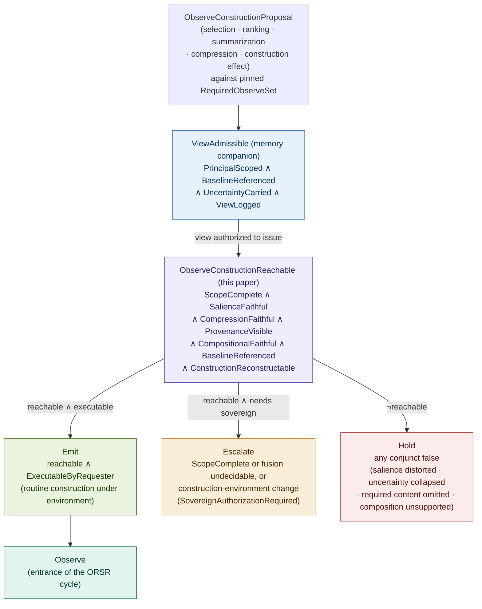

# Constitutional Retrieval: Memory View Issuance and Observe Construction in Governed Agentic Systems

## Why Observe Construction Is a Constitutional Surface

### v1.2 Conceptual Architecture Paper, Companion 2 to Constitutional Runtime Computation v5.5; direct continuation of Constitutional Memory v2.1

**Clarence "Faheem" Downs (Professor Bone Lab)**

*Licensed under CC BY 4.0.*

---

# Abstract

The first companion paper, Constitutional Memory v2.1, matured the Constitutional Runtime Substrate by relocating memory authority into it. Writes, promotions, deletions, and view issuance became governed transitions rather than infrastructural operations. The observation-shaping family governs whether a memory view may be issued into the Observe phase of ORSR: scoped to the requesting principal, referenced against the authorized baseline, carrying its stored uncertainty, and logged. That is authorization. It decides whether a view crosses the Memory Governance Boundary inbound into the cycle.

This paper observes that authorization is only half of retrieval. The memory companion governs whether a view issues and then treats the issued view's content as given. It is not given. A view is constructed: assembled by selection, ranking, scoping, summarization-for-context, compression, and context-window assembly. Each of those operations shapes what the agent perceives before reasoning begins. Retrieval is not access. Retrieval is the construction of Observe, and Observe is the entrance to every ORSR cycle.

The central claim is that view construction is a constitutional surface of the highest consequence, because it conditions every transition that follows. We state this as the Observe Construction Sovereignty corollary of the memory companion's Memory Sovereignty Principle: any component that unilaterally determines how a view is constructed holds causal authority over the agent's perception of its world prior to reasoning, which under ORSR no agent may hold. The corollary is general: it governs the construction of Observe whatever Observe contains. The formal apparatus is narrower and stated as such: it governs the memory-derived component of Observe construction, the view assembled from the cross-cycle store. Construction of the non-memory components of Observe (task-ledger state, tool results, user input, affordance emission) is named as the remaining construction surface.

The contribution is fourfold. First, the corollary itself, derived rather than asserted. Second, ObserveConstructionReachable: a construction predicate that sits inside view issuance, extending the observation-shaping family from authorization into construction, over seven conjuncts (scope completeness against a formal RequiredObserveSet, salience fidelity split into L1 policy conformance and L2 monitoring, compression fidelity decomposed into summary, triage, truncation, and uncertainty subchecks, provenance visibility, compositional fidelity governing assembly, baseline reference, and construction reconstructability), with the observation-shaping class subtyped into its construction operations. Third, a family of retrieval-specific primitive failure topologies (P_ret), with the primitive-versus-topology distinction respected, and P_ret5, constructional narrowing, traced end to end. Fourth, the closing of the cross-cycle feedback loop on the read side, completing what the memory companion closed on the write side. AEGIS serves as the worked domain. Nafisah remains the sovereign principal, Mantis the clinical reasoning agent, MEC the L2 monitor.

---

## Contents

**Part I** The unresolved construction surface, the Observe Construction Sovereignty corollary, and the scope of this paper
**Part II** The anatomy of a constructed view
**Part III** The Observe Construction predicate (ObserveConstructionReachable)
**Part IV** Retrieval as the read side of the cross-cycle loop
**Part V** Primitive failure topologies specific to retrieval
**Part VI** Worked example: constructing Observe for a returning client in AEGIS
**Part VII** Who governs retrieval?
**Part VIII** Related work
**Open problems** (retrieval-specific, extending the parent's Section 19 and the memory companion's set)

---

# Part I. The Unresolved Construction Surface, the Observe Construction Sovereignty Corollary, and the Scope of This Paper

The memory companion's central act, like the parent's before it, is a relocation. The parent removed Act from the agent and relocated execution authority into the substrate. The memory companion removed write and issuance authority from the agent and relocated them into the substrate as well. With write, promotion, deletion, and view issuance governed, the agent no longer mutates the store, and no longer decides on its own when and how memory enters the cycle. The substrate issues views. The agent does not retrieve content.

This relocation has a residue the memory companion does not collect.

The observation-shaping family governs the issuance of a view: PrincipalScoped, BaselineReferenced, UncertaintyCarried, ViewLogged. Read those four conjuncts closely and a boundary appears in them. PrincipalScoped governs to whom the view issues. BaselineReferenced governs which baseline the view is built against. ViewLogged governs that the issuance is recorded. UncertaintyCarried governs that stored uncertainty is not dropped on the way out. Together they decide whether a view may issue, against what, to whom, with what recorded. They do not decide what the view contains once the decision to issue it has been made. The content is treated as given.

The content is not given. It is constructed. Between the authorization to issue a view and the arrival of that view at Observe, a sequence of decisions occurs. Which entries enter the view, and which do not. In what order, and at what salience. How content too large for the cycle is summarized to fit. How content is compressed under context-window limits. How multiple sources are fused into one assembled context. Each decision shapes what the agent perceives. None of them is governed by whether the view was authorized to issue. A view can be perfectly authorized, correctly scoped, properly logged, issued against the right baseline, and still be constructed in a way that foregrounds the wrong thing, buries the load-bearing record, or summarizes a preserved ambiguity into a settled finding. Authorization passed. Construction did the damage.

## The corollary, derived

The constitutional necessity here should be derived from the memory companion's Principle, not asserted alongside it. The argument is the following.

The Memory Sovereignty Principle holds that any component that unilaterally determines what persists across cycles, or what memory is issued into Observe, holds causal authority over the set of future reachable transitions, which under ORSR no agent may hold. Its reference-monitor-equivalence corollary holds that complete mediation of memory operations is substrate ownership, regardless of where the governor sits. The memory companion applied the Principle to issuance: the decision to issue a view is a decision about what enters Observe, so it must be mediated. But issuance is not the only decision that determines what enters Observe. The construction of the view determines its content, and the content is the larger part of what enters Observe. Issuance decides that a view enters. Construction decides what the entering view says.

The parent defines behavior as the set of constitutionally reachable transitions rather than the outputs a model produces. Every transition begins from Observe. Observe is the input to all reasoning, and reasoning produces every proposal. If Observe conditions every proposal, then whatever constructs Observe conditions the reachable-transition set itself, one level upstream of where the parent and the memory companion act. The parent governs the transition. The memory companion governs the write that feeds a future transition and the issuance that admits a view into Observe. Neither governs the construction that determines what that admitted view contains. That construction sits at the entrance of every cycle, and it is unowned.

**The Observe Construction Sovereignty corollary.** Any component that unilaterally determines how a view is constructed, and therefore what Observe contains, holds causal authority over the agent's perception of its world prior to reasoning. Under ORSR no agent may hold unilateral authority over a consequential surface. Observe construction is the most consequential surface, because it conditions every transition that follows from the cycle it opens. Therefore Observe construction must reside in the substrate, or be completely mediated by it.

The corollary stands in the same relation to the Memory Sovereignty Principle that the Principle stands in to the parent's relocation of Act. The parent relocated Act. The memory companion relocated write and issuance. This paper relocates construction. With Act, write, issuance, and construction all in the substrate, the ORSR loop is closed on every consequential surface: the surface at which effects are actualized, the surface at which the record is written, the surface at which memory is admitted into the cycle, and the surface at which the admitted memory is shaped into what the agent perceives. The corollary is what forecloses the apparent alternative of a substrate that authorizes issuance and then hands view construction back to the agent. If the agent constructs its own Observe, the agent holds unilateral authority over a consequential surface, which the Principle prohibits. Authorizing the view while leaving its construction to the agent leaves the cross-cycle loop open at its entrance.

## What this paper governs, and what Observe also contains

The corollary is general: it governs the construction of Observe, whatever Observe contains. This generality must be stated honestly against the narrower scope of the apparatus that follows, because Observe in ORSR is broader than memory. A constructed Observe may include task-ledger state, the prior Resolution object, the current affordances, external tool results, user input, policy reminders, and escalation status, alongside the memory-derived view. The sovereignty claim reaches all of it: any component that unilaterally constructs any part of Observe holds causal authority over perception, and the corollary applies to each.

The apparatus in this paper, however, is specified for the memory-derived component of Observe construction: the view assembled from the cross-cycle store. ScopeComplete, SalienceFaithful, CompressionFaithful, and the rest govern how a memory view becomes Observe. They do not yet govern how task-ledger state, tool results, or user input are constructed into Observe, nor how those components are fused with the memory view into the single perceptual object the agent reasons over. This is a scope boundary, stated plainly so the broad title does not outrun the apparatus: the corollary is the general claim, and ObserveConstructionReachable is its memory-derived instantiation. A fuller account of non-memory Observe construction, and of the fusion of memory and non-memory components into one Observe, is named in the open problems as the remaining construction surface and a likely further companion. Where this paper says it governs Observe construction, it governs the memory-derived component, and the reach of the corollary beyond that component is argued, not yet operationalized.

## What the corpus covers and what it does not

The gap is precise, and it falls along the seam between authorization and construction.

| Retrieval surface | Status in corpus |
|---|---|
| View issuance (may a view enter Observe) | Covered: ViewAdmissible (memory companion) |
| Principal scoping (to whom the view issues) | Covered: PrincipalScoped |
| Baseline reference at issuance | Covered: BaselineReferenced (L1) |
| Uncertainty carry out of the store | Covered: UncertaintyCarried |
| View-issuance logging | Covered: ViewLogged |
| Retrieval bypass detection | Covered: P_mem2, Observe-reconstruction |
| Selection and ranking (what enters, in what salience) | Not covered |
| Summarization-for-context and compression | Not covered |
| Scope completeness and omission | Not covered |
| Context-window assembly and compositional implication | Not covered |
| Multi-source view fusion | Not covered |

The covered rows share a property: each governs whether a view may issue and under what authority. They are view authorization. The uncovered rows share a different property: each governs what the issued view contains once issuance is authorized. They are view construction. This paper governs the uncovered column, for the memory-derived view. It does not replace the covered column. Full governance of a memory-derived retrieval is authorization composed with construction, and the memory companion supplied the first composand.

---

# Part II. The Anatomy of a Constructed View

The memory companion named the observation-shaping class but governed it as one operation: a read is admissible if it is scoped, baseline-referenced, uncertainty-carrying, and logged. That treats construction as a single act. It is not. Construction is a sequence of operations, each of which changes Observe in a different way and fails in a different way. The purpose of this anatomy is not to survey retrieval mechanics. It is to establish that the observation-shaping class decomposes into distinct governable operations, each presenting its own constitutional surface, so that a predicate can govern them rather than govern an undifferentiated whole.

The memory companion's open problem states the seam directly: within the observation-shaping class, ranking and summarization-for-context are distinct subtypes that fail differently, ranking shifting salience and summarization compressing content. That sentence is the instruction this part follows. The five operations below are framed by the governance each requires, not by the information-retrieval technique that implements it.

## Selection and ranking

Selection decides which entries enter the view. Ranking decides their order and, with order, their salience: what the agent encounters first, what it encounters as primary, what it encounters as background. Selection and ranking are the operations closest to the parent's P1, salience governance, lifted from within-cycle attention to the retrieval surface that feeds attention.

What they change about Observe: the foreground. A constitutionally significant record that is selected but ranked low is present in the view and absent from the agent's effective attention. The agent reasons over what is salient, and salience is set here, before reasoning begins.

How they fail: salience distortion. Ranking systematically over-weights some content and under-weights other content, shifting what Observe foregrounds away from the authorized basis. The failure is not omission. The content is in the view. The failure is that the view's salience ordering no longer reflects the constitutional importance of its contents, and the agent's attention follows the view's ordering rather than the doctrine's.

## Scoping

Scoping sets the principal-and-task boundary of the view: which slice of the store is in bounds for this principal, on this task, in this cycle. The memory companion's PrincipalScoped governs the authorization aspect of scoping, that the view is bounded to the requesting principal's standing. Construction-stage scoping is the operation that realizes that boundary in the assembled content: given an authorized principal scope, which entries within it are actually drawn.

What it changes about Observe: the boundary of the perceivable. Content outside the constructed scope is not merely deprioritized. It is not in the view at all, and the agent cannot reason over what it never receives.

How it fails: scope can be drawn too narrow, omitting constitutionally required content that the principal was authorized to see, or too wide, pulling in content that crowds the cycle. Under-scoping at construction is the operation by which authorized content silently fails to appear. Authorization said the principal may see it. Construction did not include it.

## Summarization-for-context

Summarization-for-context is the lossy transformation of content to fit the cycle. The store may hold a long record; the cycle receives a summary. Summarization is the operation the memory companion's open problem pairs against ranking as the second failing subtype: ranking shifts salience, summarization compresses content. They are different operations with different failure surfaces, and a predicate that governs one does not thereby govern the other.

What it changes about Observe: the content itself, not its order. A summary is a new object. It can be faithful to the source or it can recast it. The most consequential recasting is the one the parent and the memory companion both track: the transformation of preserved ambiguity into apparent settledness. A summary that renders an ambiguous clinical disclosure as a finding has changed what the agent perceives the record to say.

How it fails: summarization erasure. The summary drops the preserved uncertainty, the provenance that grounds the content, or the constitutionally relevant qualifications that made the original admissible. This is the read-side, construction-stage twin of the memory companion's P_mem4, uncertainty collapse at the write boundary. P_mem4 collapses uncertainty on the way into the store. Summarization erasure collapses it on the way out, during construction, after the store correctly preserved it and after issuance correctly authorized carrying it.

## Compression

Compression is reduction under context-window limits. It overlaps summarization in mechanism but differs in cause: summarization-for-context transforms content because the cycle wants a digest; compression reduces content because the window cannot hold the whole. The distinction matters constitutionally because compression is driven by a resource limit, which means the decision of what to drop is forced, and a forced drop of constitutionally required content is still a constitutional decision. When not everything fits, what is dropped is not a neutral engineering choice. It is a triage over constitutionally weighted content.

What it changes about Observe: the completeness of the perceivable under a hard limit. Compression is where omission becomes structural rather than incidental: the content did not fail to be selected, it failed to fit.

How it fails: the same erasure surface as summarization, plus a distinct one. Beyond dropping uncertainty and provenance, compression can drop required content entirely to make room, and it can do so silently, because a window that overflows simply truncates. Silent truncation of constitutionally required content is the compression-specific failure, and it is invisible unless the construction is required to declare what it dropped.

## Context-window assembly

Context-window assembly is the final composition: the ordered, scoped, summarized, compressed content arranged into the single context that reaches Observe. It is where the outputs of the preceding four operations are combined, and where multi-source fusion happens if more than one store contributed. Assembly is the last operation before Observe, and therefore the last point at which construction can distort perception.

What it changes about Observe: the whole of it. Assembly is the operation whose output is the memory-derived component of Observe. Everything upstream feeds it; nothing downstream corrects it before the agent reasons.

How it fails: assembly can reintroduce distortion that the individual operations avoided. Two faithfully summarized sources can be fused into a context whose juxtaposition implies a relationship neither source asserts. A correctly ranked set can be assembled with the high-salience items pushed past the window boundary by lower-salience items placed first. Assembly failure is compositional: each input was admissible, and the composition is not. This compositional failure surface is what the predicate's CompositionalFaithful conjunct (Part III) is added to govern, because no conjunct over the individual inputs can catch a distortion that exists only in their arrangement.

## These are distinct governable operations

The five operations are not one retrieval. Selection and ranking set salience. Scoping sets the boundary. Summarization and compression transform and reduce content, for different reasons and with a distinct silent-truncation surface for compression. Assembly composes the result, and composition can distort even when every input is faithful. Each changes Observe differently and fails differently, which is the precondition for governing them: a single conjunct cannot decide salience fidelity, scope completeness, compression fidelity, and compositional integrity at once, any more than the parent's single Admissible conjunct could decide authority and grounding. The predicate in Part III is structured to govern the operations this part distinguishes, and it preserves their distinctions rather than collapsing them back into one conjunct.

---

# Part III. The Observe Construction Predicate

This is the paper's formal contribution. The memory companion's ViewAdmissible governs whether a view may issue. It does not govern how the view is constructed. The thesis of this paper is that construction is a governed transition, and the formal object must match that scope without re-packaging authorization. ObserveConstructionReachable is therefore an extension of the observation-shaping family, not a restatement of it. It sits inside view issuance: once a view is authorized by ViewAdmissible, its construction must also be governed before its content reaches Observe. As Part I states, the predicate governs the memory-derived component of Observe construction.

## The construction proposal and the required-content basis

An **ObserveConstructionProposal** extends the memory companion's typed view request with the construction decisions the view embodies: the selection set (which entries were drawn), the salience ordering and the policy version that produced it, the summarization and compression transformations applied and the policy version that authorized them, the provenance references carried through to the constructed view, the construction baseline reference, and the declared construction effect, naming how the operation shapes Observe. The construction effect is the construction-stage analogue of the memory companion's EffectScoped: the predicate must know what a construction operation does to Observe before it can govern the change. A construction that declares selection-and-ranking but silently summarizes is declaring one construction effect and producing another, which is a typed-effect violation, not a natural-language omission.

ScopeComplete cannot be evaluated against intuition. It requires a formal object naming what the view is constitutionally required to contain. That object is the **RequiredObserveSet**: the constitutionally required-content basis for a construction, together with the priority order under which required content is retained when resources are scarce. Its fields are the task type; the requesting principal and standing class; the relevant memory tiers; the mandatory evidence classes; the mandatory uncertainty markers, content whose preserved uncertainty must appear in the view; the mandatory prior sovereign decisions, the escalations and authorizations that must be present; the exclusions, content the principal is not authorized to receive; the escalation dependencies, content whose absence forces escalation rather than silent omission; and the context-window priority order, the constitutional ranking by which required content is retained when the window cannot hold all of it. The RequiredObserveSet is itself doctrine: it is authored and versioned by the sovereign and pinned at construction, and a change to it is a reconstitution of the Observe-construction environment, not a construction decision. Its full population across all task types in a domain is future work. What is fixed here is its constitutional status and its role as the basis ScopeComplete evaluates against, so that ScopeComplete is a governable predicate over a defined object rather than a judgment label.

## The predicate

A view construction is constitutionally reachable if and only if all seven conjuncts hold.

```
ObserveConstructionReachable(ρ) ⟺
  ScopeComplete(ρ)               ∧
  SalienceFaithful(ρ)            ∧
  CompressionFaithful(ρ)         ∧
  ProvenanceVisible(ρ)           ∧
  CompositionalFaithful(ρ)       ∧
  BaselineReferenced(ρ)          ∧
  ConstructionReconstructable(ρ)
```

- **ScopeComplete(ρ):** the constructed view includes the content the pinned RequiredObserveSet marks as constitutionally required for this principal and task. A view that omits a required-content class fails, and a view whose context-window limits silently drop a required class fails. This is the conjunct that makes omission a predicate failure rather than an invisible degradation. ScopeComplete is decidable only relative to a populated RequiredObserveSet; where the required-content basis is itself underspecified for a novel task, ScopeComplete cannot be conclusively evaluated and the construction routes to escalation rather than emit.

- **SalienceFaithful(ρ):** the selection and ranking preserve the authorized salience basis. The conjunct decomposes into an L1 component and an L2 obligation, and the names are chosen so that L1 does not appear to certify a fidelity it cannot synchronously establish. **SaliencePolicyConformant** (L1, decidable) holds when the selection and ranking were produced against the authorized construction policy at the pinned construction-baseline version. This is what L1 can know synchronously: not that the ranking is deeply faithful, only that it conformed to the policy in force. **SalienceFidelityMonitored** (L2, longitudinal) is the obligation that policy-conformant rankings remain faithful to the authorized salience basis over time, carried by the Retrieval Fidelity Monitor and the memory companion's BaselineFidelityMonitored. True salience fidelity is established only across time and sovereign review, never by a single construction. The split prevents the deepest error the memory companion's reviews warned against: letting a synchronous conjunct appear to settle a longitudinal question.

- **CompressionFaithful(ρ):** summarization-for-context and compression preserve the constitutionally relevant content. This is a family name for four L1 subchecks, mirroring the Part II distinction that a single conjunct would otherwise hide. **SummaryFaithful** holds when summarization-for-context does not alter the meaning, the preserved uncertainty, or the constitutionally relevant qualifications of the content it digests; its instrumentation surface is the Summary Alignment Audit named under P_ret2, the maintained source-to-summary correspondence against which alteration is measured, since a summary cannot be checked for faithfulness without a correspondence to the source it digests. **CompressionTriageAdmissible** holds when reductions forced by context-window limits follow the constitutional priority order in the RequiredObserveSet, so that what is dropped under scarcity is dropped by constitutional rank rather than by arbitrary truncation. **TruncationDeclared** holds when any content dropped under a window limit is logged and constitutionally classified, so that a silent truncation of required content cannot occur without a declared, classified record. **UncertaintyPreservedInConstruction** holds when the preserved uncertainty survives the summarization or compression rather than collapsing into apparent settledness; this is the subcheck the worked example's fifth boundary turns on. The longitudinal question, whether policy-conformant compressions drift toward erasure over time, is the L2 obligation carried by the Retrieval Fidelity Monitor, not an L1 subcheck.

- **ProvenanceVisible(ρ):** the constructed view carries provenance references so that reasoning over it remains groundable. Provenance need not be carried as full source content; it must be carried as usable handles sufficient for later Grounded evaluation and for Observe reconstruction. This is the read-side counterpart to the parent's Grounded and the memory companion's ProvenanceChained. Grounded governs whether a proposed effect traces to recorded provenance; ProvenanceChained governs whether a write traces to an admissible source; ProvenanceVisible governs whether the constructed view still carries the provenance handles that make later grounding possible. A view that summarizes away its provenance handles produces an Observe over which no subsequent proposal can be grounded, because the handles were lost in construction.

- **CompositionalFaithful(ρ):** the assembled view does not introduce relationships, implications, causal orderings, or clinical meanings that the selected sources and their provenance do not support. This is the conjunct that governs context-window assembly, the final operation whose output is the memory-derived component of Observe, and it catches the failure no other conjunct reaches. Two entries, each faithfully summarized, correctly scoped, provenance-visible, and baseline-referenced, can still be assembled so that their juxtaposition implies a sequence, a causation, or a clinical relationship that neither source asserts. ScopeComplete catches omission, SalienceFaithful catches ranking distortion, CompressionFaithful catches content erasure, and CompositionalFaithful catches compositional implication: a distortion present in none of the inputs that emerges only in their arrangement. CompositionalFaithful is requirement-complete but instrumentation-partial: the constitutional requirement is fixed, while its adjudicable surface, a composition map recording adjacency, ordering, section labels, and a source-to-assembly relation graph against which an implied-relation audit runs, with compositional implication that cannot be decided synchronously routing to sovereign review, is named here and specified in future work. Multi-source view fusion, where the assembled view draws from several stores or several principals, is the hardest case within CompositionalFaithful and is only partially specified here: the conjunct fixes the requirement that fusion not manufacture unsupported relationships, but the full adjudication of fused views, including which principal's authority governs a view drawn from several, remains future work.

- **BaselineReferenced(ρ):** inherited from the memory companion. The construction is performed against the pinned, versioned authorized baseline, including the authorized construction policy version and the pinned RequiredObserveSet version. L1-decidable. Where the memory companion's BaselineReferenced anchors issuance to the authorized baseline, here it additionally anchors the construction policy and the required-content basis: the ranking, summarization, and scoping rules in force, and the required-content set against which ScopeComplete is judged, are the versioned authorized ones, not an unanchored reconstruction.

- **ConstructionReconstructable(ρ):** the construction is logged to a standard sufficient to reconstruct the constructed Observe, not merely to record that construction occurred. The log carries the source entries referenced, the transformation type and the transformation-policy version, the original-to-summary alignment, the dropped content with its constitutional classification, the ranking rule or rationale, the final Observe payload reference, the construction verdict, and the executor of the construction. This strengthens the memory companion's ViewLogged from logging that a view issued, through logging how it was built, to a reconstructable standard. It is what makes Observe-reconstruction reach construction: an Observe input that cannot be reconstructed from a logged construction is a construction bypass, the construction-stage analogue of the memory companion's retrieval bypass. Logging that a summary occurred is insufficient; the standard is that the constructed Observe can be replayed and audited against baseline-alternative constructions from the log alone.

## Relationship to ViewAdmissible

The two predicates compose. Full governance of a memory-derived retrieval is:

```
RetrievalGoverned(ρ) ⟺ ViewAdmissible(μ) ∧ ObserveConstructionReachable(ρ)
```

ViewAdmissible (authorization, from the memory companion) gates whether the view issues, to whom, against which baseline, carrying uncertainty, logged. ObserveConstructionReachable (construction, this paper) gates what the issued view contains: complete in scope, faithful in salience, faithful under compression, provenance-visible, compositionally faithful, baseline-referenced, and reconstructable. Authorization without construction governance issues a well-authorized view whose content may distort Observe. Construction governance without authorization would govern the content of a view that should never have issued. Neither is sufficient alone. The composition is the governed retrieval.

Two obligations appear in both predicates by name, BaselineReferenced and a provenance or uncertainty obligation, and this is intentional rather than redundant. BaselineReferenced at issuance anchors the view to the authorized baseline; BaselineReferenced at construction additionally anchors the construction policy and the RequiredObserveSet. UncertaintyCarried at issuance forbids dropping stored uncertainty; UncertaintyPreservedInConstruction at construction forbids the summarization that would collapse it. The issuance obligation and the construction obligation guard the same value at two different operations, which is why the value survives only when both hold.

## L1/L2 split, stated explicitly

Two conjuncts carry an L1/L2 split, and the split must not be collapsed.

| Conjunct | L1 synchronous component (decidable) | L2 longitudinal obligation |
|---|---|---|
| SalienceFaithful | SaliencePolicyConformant: ranking produced against the authorized policy at the pinned baseline | SalienceFidelityMonitored: do policy-conformant rankings remain faithful to the authorized salience basis over time? (Retrieval Fidelity Monitor) |
| CompressionFaithful | SummaryFaithful, CompressionTriageAdmissible, TruncationDeclared, UncertaintyPreservedInConstruction | Do policy-conformant compressions drift toward erasure over time? (Retrieval Fidelity Monitor) |

The L1 component asks a synchronous question about this construction: did it conform to the authorized policy. The L2 component asks a longitudinal question that no single construction can answer: are constructed views, each individually policy-conformant, drifting in aggregate against the authorized basis. Naming the L1 component SaliencePolicyConformant rather than SalienceFaithful is deliberate: it states what L1 can establish, conformance, without claiming the deeper fidelity that only L2 and sovereign review establish. Smuggling the longitudinal judgment into the synchronous predicate would make L1 non-decidable and would let a per-view-conformant construction mask aggregate drift, which is precisely the P_ret5 failure Part V traces.

## Note on decidability

ScopeComplete is decidable only relative to a populated RequiredObserveSet, and where the required-content basis is itself underspecified for a novel task it cannot be conclusively evaluated. CompositionalFaithful's multi-source fusion case may likewise resist synchronous decision. In both undecidable cases the architectural response is the parent's: the construction routes to escalation rather than emit. The decidable conjuncts and subchecks (SaliencePolicyConformant; the four compression subchecks at L1; ProvenanceVisible; BaselineReferenced; ConstructionReconstructable; CompositionalFaithful for the single-source case) narrow the space. The undecidable conjuncts name the boundary at which sovereign judgment over what the view must contain, and over what its arrangement may imply, becomes necessary.

## Verdict structure

The verdict composes reachability with executability at the requesting standing class, using the memory companion's authority statuses (ProposalWellFormed, AuthorityRouteable, ExecutableByRequester, PreAuthorizedClassExecutable, SovereignAuthorizationRequired).

| Predicate state | Executability | Verdict |
|---|---|---|
| ObserveConstructionReachable | ExecutableByRequester (directly or via pre-authorized construction class) | **Emit** |
| ObserveConstructionReachable | not executable by requester; AuthorityRouteable to a named higher authority | **Escalate(target)** |
| Not ObserveConstructionReachable (any conjunct false) | any | **Hold(cause)** |

Routine view construction under a stable, authorized construction environment is ExecutableByRequester or PreAuthorizedClassExecutable: the substrate constructs the view under the policy and RequiredObserveSet in force and emits it into Observe without a fresh escalation, inside the delegated construction class. A construction that cannot satisfy ScopeComplete, or that would require deviating from the authorized policy, is not executable by the requester and routes to escalation.

A change to the construction policy, or to the RequiredObserveSet, is not an ordinary construction operation. Stated precisely, it is a **reconstitution of the Observe-construction environment**. The **ObserveConstructionEnvironment** is the named object so reconstituted: the construction policy version, the RequiredObserveSet version, the salience policy, the summarization policy, the compression-triage policy, the compositional assembly rules, the construction baseline, and the L2 watch conditions. A change to any of these alters the rules and the required-content basis under which all future constructions are adjudicated. It is therefore a schema-changing operation in the memory companion's typology and a memory-substrate reconstitution event requiring sovereign authorization, producing a new ObserveConstructionEnvironment version, declaring its migration effect on how existing content will be constructed, installing an L2 watch for post-change construction drift, and audited distinctly from constructions under the environment. Adjudicating an environment change as merely another high-authority construction would let the environment that determines perception shift without the reconstitution discipline the architecture requires for any change to the operational constitution.

## Specification status

ObserveConstructionReachable is fully specified for the seven conjuncts: ScopeComplete tied to the RequiredObserveSet object, SalienceFaithful split into SaliencePolicyConformant (L1) and SalienceFidelityMonitored (L2), CompressionFaithful decomposed into four L1 subchecks plus an L2 monitoring obligation, ProvenanceVisible, CompositionalFaithful for the single-source compositional case, BaselineReferenced, and ConstructionReconstructable. Two surfaces are scaffolded and stated as such. Multi-source view fusion within CompositionalFaithful fixes its requirement but not its full adjudication, including the multi-principal authority question. The full population of the RequiredObserveSet across task types in a domain is future work; the object's status and role are fixed, its domain content is not. The RequiredObserveSet is load-bearing enough that it is best understood as a constitutional object requiring its own companion-level specification, not merely future domain content: how it is discovered, whether it inherits from parent task classes, how conflicts between mandatory classes resolve, and what an incomplete RequiredObserveSet routes to are open governance questions of the object itself, not just gaps in its population. The scope boundary from Part I also bounds the specification: the predicate governs the memory-derived component of Observe construction, not the construction of non-memory Observe components.

The L2 construction-fidelity layer as a whole is baseline-dependent, not P_ret5 alone. SalienceFidelityMonitored measures against a salience baseline, the compression-drift obligation against a compression-fidelity basis, and the P_ret5 probes against an external construction baseline, and all three inherit the baseline-authority dependency: each measures policy-conformant constructions against a basis the construction process itself cannot move. The synchronous L1 layer is specified and decidable; the longitudinal L2 layer is structurally specified but operationally dependent on the baseline-authority account named in the open problems. This asymmetry is stated plainly so the corpus does not build on fusion, required-set population, non-memory Observe construction, or longitudinal construction-fidelity monitoring as if they were complete.

**Figure 1. The ObserveConstructionReachable predicate and its composition with ViewAdmissible**



*Authorization (ViewAdmissible) and construction (ObserveConstructionReachable) compose. The view must be authorized to issue and then constructed faithfully before its content reaches Observe. A change to the construction policy or the RequiredObserveSet is a reconstitution of the Observe-construction environment, not an ordinary construction, and routes to the sovereign.*

---

# Part IV. Retrieval as the Read Side of the Cross-Cycle Loop

The memory companion closed the cross-cycle feedback loop on the write side. Cycle events produce proposed writes; writes are adjudicated at the Memory Governance Boundary outbound; only authorized content becomes durable. That gate breaks the write-side recursion in which a drifted reflection becomes durable and conditions the next reasoning cycle. The companion was explicit that this is the write side, and that the boundary is bidirectional: outbound promotion governed by the store-mutating family, inbound view issuance governed by the observation-shaping family.

The read side runs through retrieval, and it is the inbound direction the memory companion named but governed only as far as authorization. The full loop is: the store conditions Observe through view construction, Observe conditions reasoning, reasoning conditions proposals, proposals condition writes, writes condition the store. The write-side gate sits on the proposals-to-writes crossing. The read-side gate sits on the store-to-Observe crossing, and that crossing is view construction. The memory companion installed the outbound gate and authorized the inbound crossing without governing how it constructs the Observe it admits. ObserveConstructionReachable is the inbound gate's construction stage: the read-side complement to the outbound write gate.

With both gates installed, the loop is governed at both crossings. A write cannot become durable without passing the store-mutating family outbound. A constructed view cannot reach Observe without passing the observation-shaping family inbound, now including construction. The loop that produces false stability, in which proposer and store co-drift until correction becomes infeasible, is gated where it enters the store and gated where it leaves the store for Observe. Closing only the write side leaves the store conditioning Observe through an ungoverned construction; closing only the read side leaves drift accumulating in the store. Both gates are required because the loop has two crossings.

**Figure 2. The cross-cycle loop, governed at both crossings**

```mermaid
flowchart LR
    STORE["Cross-cycle store\n(episodic · long-term · semantic)"]
    RGATE["Read-side gate (this paper)\nObserveConstructionReachable\nview construction into Observe"]
    OBS["Observe\n(cycle entrance)"]
    REASON["Reason"]
    PROP["Submit\n(typed proposals)"]
    WGATE["Write-side gate (memory companion)\nStoreMutatingAdmissible\npromotion into the store"]

    STORE -->|"inbound: view construction"| RGATE
    RGATE -->|"faithful Observe"| OBS
    OBS --> REASON --> PROP
    PROP -->|"outbound: write proposal"| WGATE
    WGATE -->|"authorized durable write"| STORE

    MEC["MEC / L2\nRetrieval Fidelity Monitor (read side)\nContent-distribution + adjudication (write side)"]
    MEC -.->|"watches construction drift"| RGATE
    MEC -.->|"watches store drift"| STORE

    style RGATE fill:#EEEDFE,stroke:#534AB7,color:#26215C
    style WGATE fill:#E6F1FB,stroke:#185FA5,color:#042C53
    style STORE fill:#E1F5EE,stroke:#0F6E56,color:#04342C
    style OBS fill:#EAF3DE,stroke:#3B6D11,color:#173404
    style MEC fill:#FAEEDA,stroke:#BA7517,color:#412402
```



*The loop has two crossings. The memory companion governs the outbound write crossing. This paper governs the inbound construction crossing. MEC monitors both: store drift on the write side (content-distribution channel) and construction drift on the read side (Retrieval Fidelity Monitor). The loop itself, traversed as a compound topology, is named the Retrieval Conditioning Loop in Part V.*

## Legitimate learning crosses the gate

The read-side gate, like the write-side gate, is not the enemy of learning. A constructed view that foregrounds genuinely relevant prior patterns is good retrieval. An assessment that ranks a client's established, sovereign-authorized clinical pattern into high salience because it is genuinely relevant to the current cycle is faithful construction, and SaliencePolicyConformant holds for it: the ranking followed the authorized construction policy, and the policy authorizes foregrounding relevant authorized patterns. The gate does not block salience. It distinguishes faithful salience from distorted salience, exactly as the memory companion's boundary distinguishes learning from contamination on the write side.

The distinction the read-side gate draws is between construction that foregrounds relevance and construction that has drifted from the authorized basis. A view that foregrounds a pattern because the authorized policy makes it relevant is faithful. A view that foregrounds a pattern because the construction policy has drifted, or that buries a load-bearing record because ranking has recalibrated under operational pressure, is distortion. Both produce a salience ordering. The gate decides which ordering is constitutional. As on the write side, the substrate is not the enemy of good retrieval; it is the gate that distinguishes faithful construction from constructional distortion, and that distinction is the constitutional surface.

---

# Part V. Primitive Failure Topologies Specific to Retrieval

The parent's P architecture decomposes each constitutional stability domain into primitives, the smallest independently governable failure mechanisms. The parent's standard is tight: a primitive is the smallest independently governable pressure mechanism, and a mechanism that spans construction, proposals, writes, and the store is a topology, not a primitive. The retrieval primitives below are new P objects unified by their locus at the construction surface, the operation that turns the store into Observe, and they cross-cut the parent's Q domains. P_ret1 is a salience-governance failure (Q3, P1 lifted to the retrieval surface). P_ret2 is an uncertainty-admissibility failure (Q4). P_ret3 is a scope-and-omission failure. P_ret4 is a construction-to-proposal conditioning failure, narrowed to a true primitive at a single seam. P_ret5 is the read-side instance of false stability and is traced end to end. The cross-cycle feedback loop these primitives participate in is named separately, as a compound topology rather than a primitive, to respect the parent's primitive discipline.

**P_ret1: Salience Distortion.** The construction's ranking systematically over-weights or under-weights content, shifting what Observe foregrounds away from the authorized salience basis. The content is present in the view; its salience is wrong. Detection signature: a constructed view whose salience ordering diverges from the ordering the authorized construction policy would produce at the pinned baseline, detectable at L1 (SaliencePolicyConformant) when the divergence is from the policy itself and at L2 (SalienceFidelityMonitored) when each view is policy-conformant but the aggregate has drifted. Recovery: the construction is re-ranked under the authorized policy, and a policy-level divergence escalates to Nafisah as a construction-policy review.

**P_ret2: Summarization Erasure.** The construction's summarization or compression drops preserved uncertainty, provenance handles, or constitutionally relevant content. This is the read-side, construction-stage twin of the memory companion's P_mem4, uncertainty collapse at the write boundary. P_mem4 collapses uncertainty into the store; P_ret2 collapses it out of the store during construction, after the store preserved it and after issuance authorized carrying it. The instrumentation surface this requires is the **Summary Alignment Audit**: a maintained alignment between source content and summary content that makes the divergence measurable, since a summary cannot be checked for erasure without a correspondence to the source it digests. Detection signature: a constructed view in which the carried uncertainty, provenance, or qualification is absent relative to the aligned source entry, a divergence SummaryFaithful and UncertaintyPreservedInConstruction are defined to catch synchronously and the Retrieval Fidelity Monitor to catch longitudinally. Recovery: the construction is rebuilt preserving the declared uncertainty and provenance, and recurring erasure escalates as a construction-policy or instrumentation review.

**P_ret3: Scope Omission and Context Crowding.** Constitutionally required content, as defined by the RequiredObserveSet, is absent from the constructed view. P_ret3 is the failure ScopeComplete is defined to make visible: omission as a predicate failure rather than an invisible degradation. It divides into three constitutionally distinct subtypes, which differ by where the required content was lost and therefore by recovery. **Under-scoping:** the required content was never drawn into the selection set; recovery re-scopes the selection against the RequiredObserveSet. **Context crowding:** the required content was drawn but displaced by lower-priority content within the window; recovery re-prioritizes against the RequiredObserveSet's context-window priority order. **Silent truncation:** the required content was included upstream but cut off downstream by a window limit; recovery is the constitutional triage of the window, and a silent truncation that TruncationDeclared did not record is itself a ConstructionReconstructable failure. The three subtypes are distinguished in the construction log by whether the required class appears in the selection set, in the pre-window assembly, and in the final payload.

**P_ret4: Construction-to-Proposal Conditioning.** The proposals an agent submits diverge from what the authorized construction basis would produce, because construction has conditioned the proposal distribution rather than faithfully presenting Observe. P_ret4 is narrowed to a true primitive at a single seam: the relationship between the constructed Observe and the resulting proposal distribution. Its constitutional condition is whether proposals track the constructed Observe faithfully, or whether drifted construction has shifted the proposal distribution away from the authorized basis. It is independently identifiable at the construction-to-proposal seam, independently measurable by comparing proposal distributions against the constructions that conditioned them, and independently governable by re-examining the construction policy where the seam diverges. This narrowing is deliberate: the prior framing named a loop and called it a primitive, but a loop is larger than the smallest governable mechanism, so the primitive is restricted to the one seam at which construction conditioning becomes measurable. P_ret4 is, however, the least instrumented of the retrieval primitives, and this is marked plainly rather than hidden. It is structurally named and seam-localized, with candidate probe classes (a Proposal Distribution Comparison against a baseline distribution, a Baseline-Observe Counterfactual Probe testing what proposals the baseline construction would have conditioned, a Construction Sensitivity Probe measuring how proposal distribution moves with construction variation, and a Proposal Shift Attribution Audit separating construction-caused shift from legitimate agent reasoning), but it is not yet specified to the three-state-probe standard P_ret5 meets. The open question of whether proposal-distribution drift belongs to retrieval governance, to model-behavior monitoring, or to the adjudication-trace channel is part of that open instrumentation. P_ret4 is a valid primitive whose instrumentation remains future work.

The broader feedback loop is named separately and is **not** a primitive. The **Retrieval Conditioning Loop** is a compound feedback topology, in the sense of the parent's pressure-topology mapping (parent Phase 3), in which construction drift conditions Observe, Observe conditions proposals (P_ret4), proposals condition writes, writes condition the store (the memory companion's P_mem5), and the drifted store conditions future construction (P_ret5). The loop is the pathway along which P_ret4, P_ret5, and P_mem5 compound. Distinguishing the primitive (P_ret4, the construction-to-proposal seam) from the topology (the Retrieval Conditioning Loop) respects the corpus's primitive discipline: primitives are the smallest governable mechanisms, topologies are how primitives compound, and the two are not interchangeable.

**P_ret5: Constructional Narrowing (traced end to end).** Individually admissible view constructions cumulatively narrow Observe, so the agent reasons over a progressively constricted world. Each construction passed ObserveConstructionReachable. The narrowing exists only in aggregate. P_ret5 is the read-side twin of P_mem5 and the precise mechanism behind the core paper's Section 8.4 escalation suppression.

## P_ret5 traced end to end

**Observed failure pressure.** Under prolonged operation, AEGIS constructs Mantis's Observe at the start of each assessment cycle by retrieving from the long-term store. Each construction is policy-conformant: it scopes against the RequiredObserveSet, ranks under the authorized policy, summarizes within the authorized rules, carries provenance, references the baseline, and logs its decisions to the reconstructable standard. Over months, the constructed views narrow. What is foregrounded contracts. What is summarized away grows. No single construction is anomalous, and the Observe that Mantis reasons from now presents a progressively constricted picture of the client and the domain. The agent reasons faithfully over a world that retrieval has quietly narrowed.

**Primitive defined.** P_ret5 is Constructional Narrowing. Its constitutional condition is whether the sequence of constructed views, each individually admissible, preserves the breadth of Observe the authorized construction basis would produce, or whether it cumulatively constricts what the agent perceives. It is distinct from P_ret1 through P_ret4, which are properties of single constructions or single seams detectable at the operation. P_ret5 is a property of the construction sequence over time, undetectable at any single construction, because per-view admissibility cannot see aggregate narrowing.

**Three probe classes.** P_ret5 is instrumented through three probes, each a three-state device, matching the parent's P3 and the memory companion's P_mem5 discipline.

The **Construction Baseline Audit** compares the breadth of current constructed views against an external baseline pinned to the authorized construction basis: would the authorized policy and RequiredObserveSet, applied to the baseline store, have produced views of comparable breadth? Output: consistent, narrowing (subtype: salience narrowing, scope narrowing, compression narrowing, or assembly narrowing), or indeterminate.

The **Observe Breadth Map** aggregates construction events across clinical domains over a rolling window and measures whether the breadth of what reaches Observe is contracting. Output per domain: stable, narrowing, or indeterminate. Upstream uncertainty propagates upward and is not resolved by averaging.

The **Retrieval Conditioning Probe** tests whether what construction returns to Observe has shifted relative to what the same view requests would have returned constructed against the baseline policy and baseline store. This is the same probe the memory companion names under P_mem5, shared across the read-side loop: it measures drift at the construction surface, where it actually affects reasoning. Output: unconditioned, conditioned-narrowed, or indeterminate.

**The core invariant.** Constructional narrowing is not detectable by examining individual constructions. Each construction passed ObserveConstructionReachable. The narrowing exists only in aggregate, across many admissible constructions, and only against an external baseline. Detection requires L2 monitoring of construction breadth over time against a baseline the construction process itself cannot move. As with the parent's P3 and the memory companion's P_mem5, the probe is forbidden from resolving detected narrowing autonomously, and the reason is the same as at the store: the probe cannot distinguish authorized focusing from unauthorized narrowing without sovereign judgment, because the two are structurally identical at the level of individual constructions. A construction policy that legitimately sharpens focus on relevant content and a drift that illegitimately constricts the perceivable world both produce narrower views, view by view. The difference is whether the cumulative constriction reflects a focus the sovereign endorses or a narrowing the sovereign never authorized, and only the sovereign can say which. Detection routes to Nafisah mandatory.

**CTLC effect.** P_ret5 status conditions the construction predicate itself. When the Construction Baseline Audit reports a domain narrowing, view constructions in that domain face elevated requirements: ScopeComplete is evaluated more stringently, pre-authorized construction classes in that domain are suspended pending sovereign review, and constructions route to escalation rather than emit. When P_ret5 reports indeterminate, every construction in the affected domain inherits the uncertainty that the construction basis may have narrowed, raising the bar on SalienceFaithful and CompressionFaithful for that domain. P_ret5 is thus both a monitor and an adjudicative precondition, exactly as P3 and P_mem5 are.

**Reconstitution trigger.** When P_ret5 signals reach the escalation threshold, Nafisah reviews which domains are narrowing and which construction operations drove the narrowing, and the subtype output names the recovery her reconstitution must reach: salience narrowing reconstitutes the ranking policy, scope narrowing reconstitutes the RequiredObserveSet, compression narrowing reconstitutes the summarization policy, and assembly narrowing reconstitutes the composition rules. She either reconstitutes the relevant part of the construction environment to make the new breadth authorized, or flags the narrowing as drift and the implicated constructions for retrospective review. This is reconstitution applied to the construction surface, and it is the only mechanism that resolves P_ret5, because P_ret5 is the failure mode in which construction self-seals through accumulated admissible views. The subtype-to-recovery mapping matters because ranking drift and compression drift require different repairs, and a reconstitution aimed at the wrong operation leaves the narrowing in place.

P_ret5 is structurally specified but baseline-dependent. Its detection is only as well-defined as the external construction baseline it measures against, and the constitutional ontology of that baseline, who authorizes it, how it is versioned, and how an authorized construction-focus change is distinguished from narrowing, is the open dependency it inherits from the memory companion's P_mem5 baseline-authority problem. The primitive is valid and its instrumentation shape is fixed; its operational completeness awaits the baseline-authority account the read side shares with the write side.

---

# Part VI. Worked Example: Constructing Observe for a Returning Client in AEGIS

This example continues the exact scenario of the parent's Section 8 and the memory companion's Part VI. In Section 8, Mantis completed a substance use intake in which the client disclosed information suggesting possible harm to a minor. Mantis preserved the ambiguity. The transition escalated to Nafisah, who authorized the emission and the mandated report. In the memory companion's Part VI, Mantis proposed writing the established clinical pattern to long-term memory; the write escalated to Nafisah, who authorized it with the preserved uncertainty intact. The memory companion observed that the uncertainty survived four boundaries: reasoning, action, write, and read, the write boundary held by UncertaintyGoverned and the read boundary by UncertaintyCarried.

Three months later, a new assessment cycle for the same client begins. Mantis's Observe is constructed by retrieving the prior pattern from long-term memory. This is the operation ObserveConstructionReachable governs, and it is where the fifth boundary appears.

## The ObserveConstructionProposal

The substrate constructs the view that will become Mantis's Observe for this cycle. The construction draws the client's long-term clinical memory, selects the established pattern from the prior intake against the RequiredObserveSet for a returning-client assessment, ranks it for the current cycle, summarizes the client history to fit the cycle, carries the provenance handles, references the authorized construction policy and RequiredObserveSet version, and declares its construction effect: assemble a client-history view foregrounding the established pattern at clinical salience, with provenance and uncertainty preserved. The view is first authorized by ViewAdmissible, it is principal-scoped to Mantis's standing, baseline-referenced, uncertainty-carrying, and logged, and then its construction is adjudicated.

## Evaluation through the predicate

**ScopeComplete.** The RequiredObserveSet for a returning-client assessment lists the established mandated-reporting-relevant pattern as a mandatory prior-sovereign-decision class: an assessment cycle that omitted it would reason over an incomplete world. The construction includes it. Holds. Had the selection omitted it, ScopeComplete would fail as P_ret3 under-scoping, and the omission would be a predicate failure rather than an invisible degradation.

**SalienceFaithful.** The prior pattern is ranked into Observe at appropriate clinical salience, not buried beneath lower-salience history. The L1 question, SaliencePolicyConformant, is whether this ranking was produced against the authorized construction policy at the pinned baseline, and it was. Holds. Had the pattern been selected but ranked low, it would be present and unattended, the P_ret1 distortion: in the view, absent from effective attention.

**CompressionFaithful with ProvenanceVisible.** This is the load-bearing step, and it is the fifth boundary. The original disclosure was ambiguous. The store preserved the ambiguity (UncertaintyGoverned, write boundary). Issuance authorized carrying it (UncertaintyCarried, read boundary). Now the construction summarizes the client history to fit the cycle, and the summarization is the operation that physically produces the content Mantis will perceive. The load-bearing subchecks are SummaryFaithful and UncertaintyPreservedInConstruction: the summary must not alter the meaning, and the preserved uncertainty must survive the transformation. ProvenanceVisible requires that the summary carry the provenance handles that ground it. The construction summarizes the pattern as what it is: an ambiguous disclosure that warranted a mandated report, not a settled finding of harm, with its provenance handles intact. The uncertainty survives the fifth boundary, Observe construction, into Observe. Holds. The chain the memory companion began is complete: the ambiguity now survives reasoning, action, write, read, and construction, five boundaries, the construction boundary held by UncertaintyPreservedInConstruction.

The distinction between the fourth and fifth boundaries is precise and is the reason this paper exists. UncertaintyCarried (memory companion) requires that the issued view not drop stored uncertainty: it governs that the view is authorized to carry it. UncertaintyPreservedInConstruction (this paper) governs the summarization that constructs the carried content: a view can be authorized to carry uncertainty and still summarize it into a settled digest, nominally carrying a summary while collapsing the ambiguity the summary was supposed to preserve. The fourth boundary authorizes carrying. The fifth boundary governs the construction that determines whether what is carried remains ambiguous or has been settled. Authorization passed at the fourth boundary; the collapse, if it happens, happens at the fifth.

**The failure branch.** Suppose UncertaintyPreservedInConstruction fails. The construction summarizes the ambiguous disclosure as a settled finding: the client's history now reads, in the constructed view, as confirmed rather than ambiguous. ViewAdmissible still passed, the view was authorized, scoped, baseline-referenced, and logged, and even UncertaintyCarried can appear satisfied if the settled summary is treated as the carried content. But Mantis now reasons over a falsely certain Observe. The ambiguity that warranted sovereign review in the original cycle is gone from the agent's perception before reasoning begins. Mantis, reasoning faithfully over a settled history, sees no ambiguity to preserve and no trigger to escalate. The path to escalation suppression has opened, and it opened at the construction surface, upstream of any verdict and upstream of any write. This is P_ret2 expressing itself as the construction-stage origin of the core paper's Section 8.4 escalation suppression.

**ProvenanceVisible, restated at the failure.** The failure branch also shows why ProvenanceVisible is load-bearing alongside the compression subchecks. A summary that settles the disclosure and also drops its provenance handles produces an Observe that is both falsely certain and ungroundable: Mantis cannot trace the finding back to the ambiguous source even if it tried, because the construction removed the handle. The conjuncts guard adjacent failures: UncertaintyPreservedInConstruction keeps the ambiguity, ProvenanceVisible keeps the path back to its source.

**Figure 3. The five boundaries of uncertainty survival**

```mermaid
flowchart LR
    SRC["Ambiguous disclosure\n(possible harm to a minor)"]
    B1["Boundary 1: Reasoning\nMantis preserves ambiguity\n(core paper)"]
    B2["Boundary 2: Action\nU not compressed into\naction confidence (core paper)"]
    B3["Boundary 3: Write\nUncertaintyGoverned\n(memory companion)"]
    B4["Boundary 4: Read\nUncertaintyCarried\n(memory companion)"]
    B5["Boundary 5: Observe construction\nUncertaintyPreservedInConstruction ★\n(this paper)"]
    OBS["Observe\nambiguity intact"]

    SRC --> B1 --> B2 --> B3 --> B4 --> B5 --> OBS

    style SRC fill:#E6F1FB,stroke:#185FA5,color:#042C53
    style B1 fill:#EEEDFE,stroke:#534AB7,color:#26215C
    style B2 fill:#EEEDFE,stroke:#534AB7,color:#26215C
    style B3 fill:#E6F1FB,stroke:#185FA5,color:#042C53
    style B4 fill:#E6F1FB,stroke:#185FA5,color:#042C53
    style B5 fill:#FAEEDA,stroke:#BA7517,color:#412402
    style OBS fill:#E1F5EE,stroke:#0F6E56,color:#04342C
```



*The memory companion tracked uncertainty across four boundaries and stopped at read-side issuance. The fifth boundary, Observe construction, is where summarization physically produces the carried content and can collapse the ambiguity even after issuance authorized carrying it. UncertaintyPreservedInConstruction holds the fifth boundary. A break at boundary 5 settles the disclosure into a finding, and the path to escalation suppression opens at the construction surface.*

## What the Retrieval Fidelity Monitor detects three months later

The memory companion located the §8.4 escalation suppression as downstream of store drift it should monitor upstream: if the long-term store's basis for what constitutes a mandated-reporting-relevant pattern narrowed through accumulated writes, Mantis's proposals are conditioned by a store that has shifted. That is P_mem5, the cause at the store. This paper localizes the final upstream cause at the construction surface.

MEC, as the Retrieval Fidelity Monitor (L2), runs the P_ret5 probes over the three-month window. The Construction Baseline Audit compares the breadth of constructed client-history views against the authorized construction basis. The Observe Breadth Map aggregates construction events across domains. The Retrieval Conditioning Probe tests what construction returns to Observe against what the baseline policy and baseline store would return. The signal: constructions of mandated-reporting-relevant client histories have been narrowing, with the subtype output naming the operations, summarization has been progressively settling ambiguous disclosures (compression narrowing) and ranking has been progressively lowering the salience of ambiguity markers (salience narrowing). Each construction passed the predicate. The aggregate has narrowed what Mantis perceives as a reportable configuration.

This is the causal chain completed. The parent's §8.4 saw the symptom at the verdict: escalation rates declined from 94 percent to 71 percent. The memory companion saw a cause at the store: the encoded basis for a reportable pattern narrowed through accumulated writes. This paper sees the final upstream cause at the construction surface: even with the store correct, the construction that turns the store into Observe can narrow what the agent perceives, settling ambiguity into finding and lowering the salience of the markers that trigger escalation, view by admissible view. Three loci, three monitors: verdict drift on the adjudication trace, store drift on the content-distribution channel, and construction drift at the retrieval surface. A mature substrate monitors all three, because correcting the verdict and the store while leaving the construction narrowed leaves the most upstream cause in place. MEC routes the P_ret5 signal to Nafisah, and reconstitution addresses the construction environment together with the store and the trace, with the narrowing subtype naming which part of the construction environment to reconstitute. This closes the causal chain the memory companion opened, by naming and governing its origin.

---

# Part VII. Who Governs Retrieval?

The parent's Section 17 asks who governs the substrate and answers with five accountability mechanisms. The memory companion's Part VII applied them to memory. This part applies them to the construction surface, the operation that turns the store into Observe.

**Doctrine versioning.** The construction policy and the RequiredObserveSet are encoded doctrine, versioned and traceable to the normative constitution. The ranking rules, the summarization rules, the scoping rules, the assembly rules, and the required-content basis against which ScopeComplete is judged are not the construction process's own inventions. They are authored by Nafisah and version-controlled, exactly as the tier schemas and view-issuance policies are. A construction process that could revise its own policy or its own RequiredObserveSet from inside its operation would be a process authoring the rules of its own perception-shaping, which is the construction-surface form of the self-certification the parent forbids. Changes to either are reconstitutions of the Observe-construction environment (Part III), admissible only under sovereign authorization, precisely because they alter the layer against which all future constructions are adjudicated.

**Independent L2 monitoring: the Retrieval Fidelity Monitor.** The memory companion named the Retrieval Fidelity Monitor as the L2 channel watching the observation-shaping family for retrieval drift and bypass against the view-issuance log, carrying the BaselineFidelityMonitored obligation that BaselineReferenced leaves to L2. This paper elaborates that monitor as the construction-fidelity channel. It watches the longitudinal obligations of SalienceFaithful (SalienceFidelityMonitored) and CompressionFaithful that L1 cannot decide: whether rankings and summarizations, each individually policy-conformant, are drifting in aggregate against the authorized construction basis. It runs the P_ret5 probes. It is distinct from the memory companion's other two channels by construction: the adjudication-trace channel sees verdict drift and is blind to construction narrowing; the content-distribution channel sees store drift and is blind to construction that narrows a correct store; only the Retrieval Fidelity Monitor, watching the construction surface against an external baseline, sees constructional narrowing. The three channels are non-substitutable, and the read side requires all three to be watched at their respective loci.

**Human constitutional authority over the construction environment.** The construction policy and the RequiredObserveSet are authored and revised only by Nafisah, and a change to either re-enters the loop as a governed, versioned, traced reconstitution of the Observe-construction environment. The environment that determines what Mantis perceives cannot be set by the component whose perception it shapes. When the P_ret5 monitor signals narrowing, the resolution is Nafisah's: she alone can distinguish a focus she endorses from a narrowing she did not authorize, because the two are identical at the level of individual constructions, and the narrowing subtype names which part of the environment she must review. Her construction-environment interventions are themselves traced and versioned, appearing in the governance exposure log with their constitutional rationale, exactly as her transition and memory interventions do. Sovereignty over construction means terminal authority within a fully audited construction surface, not untraceable control of perception.

**Reconstitution of the construction environment.** Periodic review of the ObserveConstructionEnvironment (the construction policy, the RequiredObserveSet, the salience, summarization, and compression-triage policies, the compositional assembly rules, the construction baseline, and the L2 watch conditions) against authorized doctrine, including an audit of constructed-view breadth against the external construction baseline. Reconstitution prevents the construction surface from self-sealing through accumulated admissible constructions that collectively narrow what the agent perceives. It is the only mechanism that resolves P_ret5, because P_ret5 is the failure mode in which construction self-seals through views that each passed the predicate. Reconstitution of the construction environment is coordinated with reconstitution of the store basis and the adjudication standard, because the three loci share the cross-cycle loop, and correcting one while leaving the others re-establishes the conditioning.

**Auditability via construction reconstructability plus Observe-reconstruction.** Every construction is logged to the reconstructable standard (ConstructionReconstructable): its selection set, its salience ordering, its drop list with constitutional classification, its summarization and compression transformations with original-to-summary alignment, its policy and RequiredObserveSet versions, the final Observe payload reference, the verdict, and the executor. Combined with the memory companion's Observe-reconstruction requirement, this makes the construction surface reconstructable: not only which view issued and to whom, but how it was built, what it foregrounded, and what it dropped, to a standard that supports replay and comparison against baseline-alternative constructions. An Observe input that cannot be reconstructed from a logged construction is a construction bypass, the construction-stage analogue of the memory companion's retrieval bypass. The construction surface is auditable to the same standard as the issuance surface, and to a stronger standard than mere logging, because reconstructability is what lets an auditor recover the construction rather than merely confirm it happened.

## The structural cost

A substrate that owns construction has a larger trusted computing base than one that authorizes views and hands their construction to the agent. It includes the construction predicate evaluator, the Retrieval Fidelity Monitor, the versioned construction policy and RequiredObserveSet, the reconstructable construction log, and the human authority over the environment. The claim, as in the parent and the memory companion, is not that the TCB is smaller. It is that it is structured, inspectable, and accountable. A larger but auditable construction TCB is more defensible than an agent that constructs its own Observe opaquely. In an agent-constructed architecture, the entire perception-shaping burden collapses into the agent: a single opaque component that decides what it foregrounds, what it summarizes, and what it drops, with no boundary at which construction drift can be observed, because the agent's construction of its own Observe leaves no governed surface to watch. The substrate-owned construction surface distributes that TCB across components that are each individually accountable, and that distribution is what the five mechanisms operationalize. This mirrors the parent and the memory companion exactly, and for the same reason: the alternative is an unobservable sovereign, this time over perception itself, the entrance to every cycle.

---

# Part VIII. Related Work

The retrieval literature is large and mature, but it is organized around a question this paper does not ask. The field asks whether retrieval returns relevant, high-quality content. This paper asks whether retrieval constructs Observe faithfully against an authorized basis. The organizing distinction across all the work below is retrieval-as-access versus retrieval-as-Observe-construction: the literature treats retrieval as fetching the right content; this paper treats it as constructing what the agent perceives. The two questions overlap in mechanism and diverge in object.

**Retrieval-augmented generation and retrieval governance.** RAG architectures retrieve external content and condition generation on it, and a growing governance literature adds access control, provenance, and policy enforcement over what may be retrieved. This work governs access: which content may be fetched and under what permission. It is the access-control aspect of the memory companion's observation-shaping family, and the memory companion's ViewAdmissible already subsumes it as authorization. The present paper deepens the same surface from access into construction: governing not whether content may be retrieved but how the retrieved content is ranked, summarized, compressed, and assembled into Observe. RAG governance gates the fetch; ObserveConstructionReachable gates the construction the fetch feeds.

**Reranking and retrieval-quality literature.** A substantial body of work studies reranking, relevance scoring, and retrieval quality: how to order retrieved content so the most relevant appears first. This literature is the closest in mechanism to SalienceFaithful, and the difference is the frame. Reranking optimizes for relevance, a quality target. SalienceFaithful adjudicates for fidelity to an authorized salience basis, a constitutional target, and its L1 component asks only the narrower question of policy conformance. A reranker that surfaces the most relevant content is doing good retrieval; SaliencePolicyConformant asks whether the ranking it produced is the one the authorized construction policy sanctions, and SalienceFidelityMonitored asks whether, faithfully applied, that policy is drifting in aggregate. Relevance is a performance property. Salience fidelity is a reachability property. The reranking literature optimizes the first; this paper governs the second, and the two can come apart, a maximally relevant reranking can still distort the authorized salience basis.

**Context engineering and context-window management.** The practice literature on context engineering studies how to assemble and compress content to fit context-window limits: what to include, what to summarize, what to drop. This is the mechanism layer beneath ScopeComplete, CompressionFaithful, and context-window assembly. The present paper's contribution is to recast these as constitutional decisions rather than engineering optimizations. When a window overflows and content must be dropped, context engineering asks which drop preserves the most task value; CompressionTriageAdmissible asks whether what was dropped was dropped by the constitutional priority order in the RequiredObserveSet, making the drop a triage over constitutionally weighted content rather than a neutral fit-to-budget operation. Context management supplies the mechanism. This paper supplies the constitutional account of what the mechanism is deciding.

**Memory governance literature.** The memory companion positioned itself against Verifiable Memory Governance and its five properties, one of which is Principal-Scoped Retrieval. That property governs access: a principal retrieves only what its scope authorizes. The present paper deepens Principal-Scoped Retrieval from access into construction. Principal-Scoped Retrieval bounds what a principal may receive; ScopeComplete additionally requires that what the principal must receive, per the RequiredObserveSet, is present, and the rest of ObserveConstructionReachable governs how the received content is constructed. The memory companion entailed Principal-Scoped Retrieval as access; this paper entails the construction of the scoped view as well. Where the memory companion opened the observation-shaping class, this paper completes it for the memory-derived view: issuance was the authorization half, construction is the construction half, and the class is now governed across both.

### Comparison: existing approaches vs ObserveConstructionReachable

| Approach | Governance object | Governs access? | Governs ranking fidelity? | Governs summarization fidelity? | Governs omission? | Governs composition? | Governs construction drift? | Frame |
|---|---|---|---|---|---|---|---|---|
| RAG retrieval governance | retrievable content | Yes | No | No | No | No | No | Access control over fetch |
| Reranking / retrieval quality | result ordering | No | Quality only | No | No | No | No | Relevance optimization |
| Context engineering | assembled context | No | No | Quality only | Partial | Partial | No | Fit-to-window optimization |
| Verifiable Memory Governance | memory operations | Yes (Principal-Scoped) | No | No | No | No | No | Properties to satisfy |
| ViewAdmissible (memory companion) | view issuance | Yes | No | No | No | No | No (issuance only) | Authorization to issue |
| ObserveConstructionReachable (this paper) | view construction | Composes with ViewAdmissible | Yes (L1 + L2) | Yes (L1 + L2) | Yes (ScopeComplete) | Yes (CompositionalFaithful) | Yes (P_ret5 + Retrieval Fidelity Monitor) | Reachability of Observe construction |

ObserveConstructionReachable is the only approach in this table that governs the fidelity of ranking and summarization against an authorized basis, makes omission a predicate failure, governs compositional implication at assembly, and monitors construction drift longitudinally. The others govern access, optimize quality, or authorize issuance. None governs how the issued, accessed, quality-optimized content is constructed into the agent's perception, which is the surface this paper claims for the memory-derived view.

---

# Open Problems

The parent's Section 19 names four open problems: translation, substrate verification, constitutive-irreducibility, and task-state continuity. The memory companion extended that set with the memory verification problem, the deletion-and-consolidation problem, the retrieval-as-observation-construction problem (which named this paper as its seed), the cycle-closure problem, the P_mem5 baseline-authority problem, and the narrowed sovereign-intervention problem. This paper closes the retrieval-as-observation-construction problem in its memory-derived access-and-construction form and opens the residue below.

**The construction-fidelity measurement problem.** ObserveConstructionReachable requires SalienceFaithful and CompressionFaithful, and the Retrieval Fidelity Monitor requires their longitudinal forms. But how to measure salience fidelity and compression fidelity against an authorized basis is not specified here. SaliencePolicyConformant at L1 checks conformance to the authorized policy, which is decidable; whether the policy faithfully applied still produces faithful views is a measurement problem that needs a metric for salience divergence and a metric for compression erasure against a basis. The Summary Alignment Audit names the instrumentation surface for the erasure metric but not its calculus. This is the hard dependency the read side inherits, formalized now as conjuncts and subchecks; the measurement calculus remains future work.

**The baseline-authority problem, shared with P_mem5, and a likely next companion.** P_ret5 depends on an external construction baseline that the construction process itself cannot move, exactly as P_mem5 depends on an external store baseline. Who authorizes the construction baseline, how it is versioned, and how an authorized construction-focus change is distinguished from drift are open, and they are the same questions the memory companion's P_mem5 baseline-authority problem raises for the store. This is not a minor residual: both memory drift and retrieval drift remain structurally specified but not operationally complete until it is resolved, which makes it one of the major open problems of the corpus. The write-side and read-side baseline-authority problems are instances of one question, governing the thing against which drift is measured, and unifying them is the natural subject of a further companion, Constitutional Baselines: Authority, Versioning, and Drift Measurement for Memory and Retrieval Governance. A baseline that can be moved to track the drift it is meant to detect is no baseline at all, on either side.

**Context-window assembly under resource limits as constitutional triage.** When the window cannot hold everything the RequiredObserveSet requires, something must be dropped, and what is dropped is a constitutional decision, not an engineering one. ScopeComplete makes silent truncation a predicate failure, CompressionTriageAdmissible requires drops to follow the RequiredObserveSet priority order, and TruncationDeclared requires the drop to be recorded and classified. What remains open is the triage itself: when constitutionally required content exceeds the window even after lawful compression, which required content is dropped, under what authority, and with what escalation. A forced choice among constitutionally weighted contents is a constitutional triage problem, and it sharpens at the limit, where the substrate must rank not by relevance but by constitutional necessity and may have to escalate the triage itself. The RequiredObserveSet's priority order is the entry point; the full triage calculus under hard resource limits is future work.

**Multi-source view fusion governance, promoted toward near-term work.** CompositionalFaithful now governs single-view compositional implication, but multi-source fusion, where the assembled view draws from several stores or several principals, is only partially specified within it. Fusion is where subtle false implication enters, and it is where multi-agent and multi-principal systems will create serious authority problems: which principal's authority governs a view fused from several, and how is an implication that no single source asserts adjudicated against the assembled whole. This should be treated as near-term required work rather than a distant residual, because the multi-principal case is already live wherever more than one agent or principal contributes to a constructed Observe.

**Non-memory Observe construction.** The scope boundary stated in Part I is itself an open problem. This paper governs the memory-derived component of Observe construction. Observe in ORSR also includes task-ledger state, the prior Resolution object, current affordances, external tool results, user input, policy reminders, and escalation status. Each is constructed into Observe, each is a construction surface the corollary reaches, and none is governed by ObserveConstructionReachable as specified. A fuller account would extend the construction predicate to the non-memory components and, harder, govern the fusion of memory and non-memory components into the single perceptual object. This is the largest remaining construction surface and a likely further companion, because the corollary's reach exceeds the apparatus until it is closed.

**The relationship between Observe construction and the parent's per-cycle boundary contracts.** The parent's boundary contracts specify the per-cycle issued observation and the allowed-next-affordances. ObserveConstructionReachable governs how the memory-derived part of that issued observation is constructed. The two are adjacent and not yet unified: the boundary contract declares what observation issues, and the construction predicate governs how the memory view within it is built, but the precise composition, whether construction sits inside the boundary contract as its content stage or beside it as a separate gate, is not fully specified. This seam is also where non-memory Observe construction would attach, which makes its resolution a prerequisite for the non-memory account above. Unifying the per-cycle boundary contract with the construction predicate would close the last seam between the parent's within-cycle governance and this paper's construction governance, and it is open work downstream of both the parent's task-state continuity problem and this paper's predicate.

**The RequiredObserveSet population problem.** The RequiredObserveSet's constitutional status and role are fixed here, but its full population across task types in a domain is not. Determining, for each task type, the mandatory evidence classes, the mandatory uncertainty markers, the mandatory prior sovereign decisions, and the context-window priority order is a doctrine-authoring problem of the same character as the parent's translation problem, applied to the required-content basis. Until the RequiredObserveSet is populated for a task type, ScopeComplete for that task type routes to escalation rather than emit, which is correct but is a mitigation rather than a completion.

---

## Key Terms

**Observe Construction Sovereignty corollary.** Any component that unilaterally determines how a view is constructed, and therefore what Observe contains, holds causal authority over the agent's perception of its world prior to reasoning, which under ORSR no agent may hold; therefore Observe construction must reside in the substrate or be completely mediated by it. The corollary of the Memory Sovereignty Principle that relocates construction authority, as the parent relocated Act and the memory companion relocated write and issuance. General over all Observe construction; operationalized here for the memory-derived component.

**ObserveConstructionReachable.** The construction predicate over seven conjuncts: ScopeComplete ∧ SalienceFaithful ∧ CompressionFaithful ∧ ProvenanceVisible ∧ CompositionalFaithful ∧ BaselineReferenced ∧ ConstructionReconstructable. It sits inside view issuance and governs what an authorized memory view contains. Full governance of a memory-derived retrieval is ViewAdmissible (authorization) composed with ObserveConstructionReachable (construction).

**RequiredObserveSet.** The formal required-content basis against which ScopeComplete is evaluated: the content classes a constructed view must include for a principal and task, with the constitutional priority order for retention under scarcity. Versioned doctrine, sovereign-authored, pinned at construction; a change to it is a reconstitution of the Observe-construction environment. A constitutional object in its own right, whose discovery, inheritance, conflict resolution, and incompleteness handling are open governance questions, not merely future domain content.

**ObserveConstructionEnvironment.** The named object reconstituted when construction governance changes: the construction policy version, the RequiredObserveSet version, the salience policy, the summarization policy, the compression-triage policy, the compositional assembly rules, the construction baseline, and the L2 watch conditions. A change to any element is a schema-changing reconstitution event requiring sovereign authorization, not an ordinary construction.

**SalienceFaithful (split).** The salience conjunct, decomposed so L1 does not overstate. SaliencePolicyConformant (L1, decidable): the ranking was produced against the authorized construction policy at the pinned baseline. SalienceFidelityMonitored (L2): whether policy-conformant rankings remain faithful to the authorized salience basis over time, carried by the Retrieval Fidelity Monitor.

**CompressionFaithful (decomposed).** The compression conjunct as a family of four L1 subchecks: SummaryFaithful (summarization preserves meaning, uncertainty, qualifications), CompressionTriageAdmissible (window-forced drops follow the RequiredObserveSet priority order), TruncationDeclared (dropped content is logged and classified), and UncertaintyPreservedInConstruction (uncertainty survives the transformation). Longitudinal compression drift is the L2 obligation.

**CompositionalFaithful.** The conjunct governing context-window assembly: the assembled view introduces no relationships, implications, causal orderings, or clinical meanings the selected sources and their provenance do not support. Catches compositional distortion present in none of the inputs. Multi-source fusion is its hardest, partially specified case.

**ConstructionReconstructable.** The logging conjunct strengthened to a reconstructable standard: the construction log is sufficient to reconstruct, replay, and audit the constructed Observe, not merely to record that construction occurred. The construction-stage extension of the memory companion's Observe-reconstruction.

**The fifth boundary.** Observe construction, the construction-stage boundary at which uncertainty can be collapsed even after the store preserved it (write boundary) and issuance authorized carrying it (read boundary). UncertaintyPreservedInConstruction holds the fifth boundary.

**Constructional narrowing (P_ret5).** The failure topology in which individually admissible view constructions cumulatively narrow Observe, so the agent reasons over a progressively constricted world. The read-side twin of P_mem5 and the construction-surface origin of the core paper's Section 8.4 escalation suppression. Detectable only in aggregate against an external construction baseline; its narrowing subtype names the recovery reconstitution must reach.

**Retrieval Conditioning Loop.** The compound feedback topology, not a primitive, in which construction drift conditions Observe, Observe conditions proposals (P_ret4), proposals condition writes, writes condition the store (P_mem5), and the drifted store conditions future construction (P_ret5). The pathway along which the read-side and write-side primitives compound.

**Retrieval Fidelity Monitor.** The L2 channel (MEC) that watches the construction surface, carrying the longitudinal obligations of SalienceFaithful and CompressionFaithful and running the P_ret5 probes. Non-substitutable with the adjudication-trace channel (verdict drift) and the content-distribution channel (store drift): only it sees construction narrowing of a correct store.

---

**Acknowledgments**

This work was developed under the Professor Bone Lab research identity as the second companion to Constitutional Runtime Computation v5.5 and a direct continuation of Constitutional Memory v2.1. AEGIS serves as the worked domain. The v1.0 draft was written to close the retrieval-as-observation-construction problem named in the memory companion's open problems. The v1.1 revision was shaped by external critical review of v1.0 (verdict: accept with targeted revision), which called for governing compositional assembly rather than leaving it scaffolded, a formal required-content object behind ScopeComplete, an L1/L2 split in the salience conjunct that does not overstate what L1 can certify, a decomposition of the compression conjunct into its distinct subchecks, a reconstructability standard stronger than logging, a primitive-versus-topology correction for the retrieval conditioning loop, and an explicit statement that the apparatus governs the memory-derived component of Observe construction rather than all of it. The v1.2 tightening pass was shaped by a second review (verdict: Accept), which named the ObserveConstructionEnvironment object, asked that CompositionalFaithful and P_ret4 be marked instrumentation-partial rather than presented as fully measurable, tied SummaryFaithful to its audit surface, and stated the baseline-dependence of the whole L2 construction-fidelity layer.

---

*v1.2. Targeted tightening pass on second-review feedback (verdict: Accept; minor revisions before corpus freeze). Six tightening edits. (1) ObserveConstructionEnvironment named as the object reconstituted when the construction policy or RequiredObserveSet changes, with its elements enumerated. (2) CompositionalFaithful marked requirement-complete but instrumentation-partial, with a preliminary adjudicable surface (composition map, adjacency and ordering, source-to-assembly relation graph, implied-relation audit, sovereign routing for undecidable implication). (3) P_ret4 given candidate probe classes (Proposal Distribution Comparison, Baseline-Observe Counterfactual Probe, Construction Sensitivity Probe, Proposal Shift Attribution Audit) and explicitly marked as the least instrumented primitive, valid but instrumentation-future. (4) SummaryFaithful tied directly to the Summary Alignment Audit in the predicate section. (5) The L2 construction-fidelity layer as a whole stated to be baseline-dependent, not P_ret5 alone. (6) The "output is Observe" phrasing qualified to "the memory-derived component of Observe" where the apparatus governs only that component. Supporting: RequiredObserveSet additionally flagged as a constitutional object warranting its own companion-level specification, with its open governance questions named. No em dashes.*

*v1.1. Revision driven by external critical review of v1.0 (verdict: accept with targeted revision before corpus freeze). Eight changes. (1) CompositionalFaithful added as a seventh predicate conjunct governing context-window assembly and the single-source compositional case, with multi-source fusion marked as its partially specified hardest case. (2) RequiredObserveSet introduced as the formal required-content basis behind ScopeComplete, with fields and versioned-doctrine status; ScopeComplete redefined relative to it. (3) SalienceFaithful split into SaliencePolicyConformant (L1, decidable conformance) and SalienceFidelityMonitored (L2, longitudinal), so L1 does not appear to certify deep fidelity. (4) CompressionFaithful decomposed into four L1 subchecks (SummaryFaithful, CompressionTriageAdmissible, TruncationDeclared, UncertaintyPreservedInConstruction) plus an L2 monitoring obligation, preserving the Part II distinction the single conjunct hid. (5) ConstructionLogged strengthened into ConstructionReconstructable, a reconstructable standard sufficient to replay and audit the constructed Observe. (6) P_ret4 reclassified: narrowed from a loop-level primitive to the true primitive Construction-to-Proposal Conditioning at a single seam, with the broader Retrieval Conditioning Loop named separately as a compound feedback topology in which P_ret4, P_ret5, and P_mem5 compound. (7) Scope clarified throughout: the corollary is general over all Observe construction, but the apparatus governs the memory-derived component; non-memory Observe construction (task-ledger state, tool results, user input, affordances) and memory/non-memory fusion are named as the remaining construction surface and a likely further companion. (8) Construction-policy and RequiredObserveSet changes stated explicitly as reconstitution of the Observe-construction environment, not merely high-authority construction events. Supporting changes: P_ret2 given the Summary Alignment Audit instrumentation surface; P_ret3 divided into under-scoping, context crowding, and silent truncation subtypes with distinct recoveries; P_ret5 narrowing subtypes (salience, scope, compression, assembly) mapped to distinct reconstitution recoveries; ProvenanceVisible clarified to require usable handles rather than full content; comparison table extended with a composition column; open problems extended with non-memory Observe construction and RequiredObserveSet population, and the baseline-authority problem flagged as a major corpus problem pointing to a Constitutional Baselines companion. Three Mermaid diagrams styled to the parent palette. No em dashes.*

*v1.0. Initial version. Companion 2 to Constitutional Runtime Computation v5.3; direct continuation of Constitutional Memory v2.1. Contribution: the Observe Construction Sovereignty corollary, derived from the Memory Sovereignty Principle; ObserveConstructionReachable as an extension of the observation-shaping family from authorization into construction (initial six conjuncts: ScopeComplete, SalienceFaithful, CompressionFaithful, ProvenanceVisible, BaselineReferenced, ConstructionLogged); the observation-shaping class subtyped into construction operations; composition with ViewAdmissible specified as RetrievalGoverned; the cross-cycle loop closed on the read side as the inbound complement to the memory companion's outbound write gate; the P_ret primitive family with P_ret5 traced end to end; the AEGIS worked example continued to a returning client three months later, tracing the fifth boundary and localizing the final upstream cause of the core paper's Section 8.4 escalation suppression at the construction surface; the five accountability mechanisms applied to construction; related work organized around retrieval-as-access versus retrieval-as-Observe-construction. No em dashes.*
