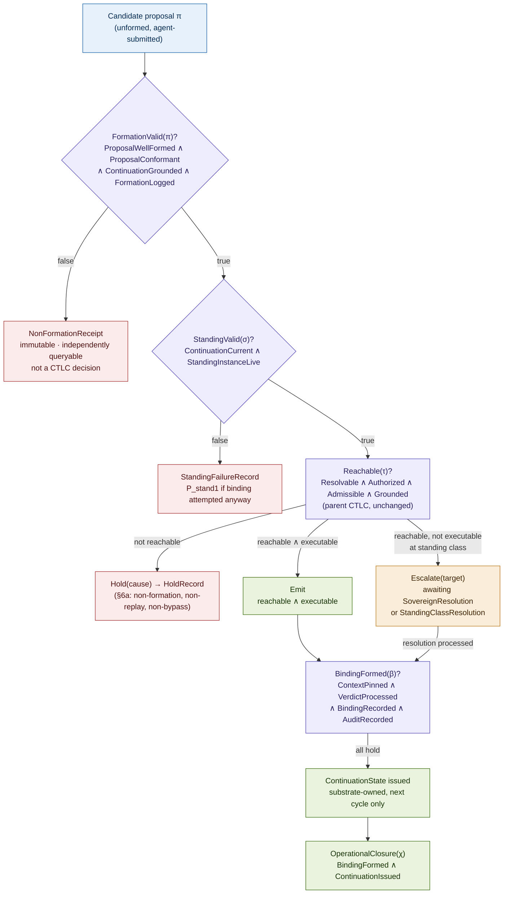
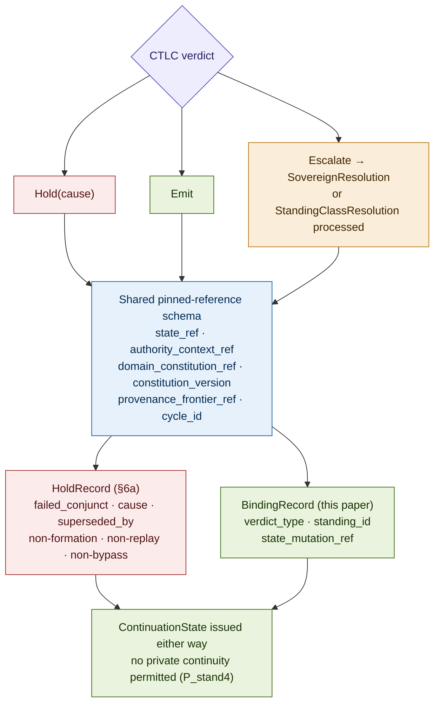

# Constitutional Standing: Formation, Binding, and Non-Formation in Governed Runtime Transitions

## Why Reachability Is Not Enough to Bind Substrate State

### v1.5 Conceptual Architecture Paper, Companion 6 to Constitutional Runtime Computation v5.5; substantial advancement of the task-state continuity residue named in v5.4's Open Problems, and formalization of the Standing (STAND) step named but not specified in CTLC's CRA Assembly

**Clarence "Faheem" Downs (Professor Bone Lab)**

*Licensed under CC BY 4.0.*

---

# Abstract

The corpus now governs the standard (Baselines), the relation among standards (Coherence), the decision boundary and the evidence the sovereign reads (Thresholds), and, as of v5.4, the Hold verdict's own internal completeness (§6a). What it has not yet organized into one governed layer is the question underneath all of them: when does a proposed movement have standing to bind substrate state at all, and what happens when it does not. CTLC's own CRA Assembly already names a step for this, Step 3, STAND, but its current treatment is a single sentence: "L1 validates the standing class against the authority topology." That sentence conflates at least three questions that this paper shows are independently governable. Companion 0 already validates whether a proposal crossed the agent-substrate boundary correctly (ProposalConformant). Companion 1 already separates authority-path existence from requester possession (AuthorityRouteable, ExecutableByRequester). The parent's own Reachable(τ) already governs whether a transition type is structurally authorized. None of these, individually or together, answers whether a specific proposal became a valid constitutional object before any of them ran, whether the specific standing instance presenting it is still live at the moment it is presented, whether a favorable verdict actually acquired causal force over substrate state, or what authorizes the agent's next move once a verdict, of any kind, has been reached.

This paper separates five stages the corpus has touched but never organized into a single governed pipeline: **Formation** (did the proposal become a valid constitutional object), **Standing** (is this proposer's specific authority instance currently live to move it), **Reachability** (the parent's existing Reachable(τ), unchanged), **Binding** (did a favorable verdict actually acquire causal force over substrate state), and **Continuation** (what substrate-issued state authorizes the next cycle). None entails the others. A proposal can be perfectly formed and have no standing. It can have live standing and be unreachable. It can be reachable and never bind. It can bind and leave the agent with no authorized next move except through what the substrate itself reissues. The **Constitutional Standing Principle**, derived from the corpus rather than asserted, states this precisely and closes the pipeline end to end.

The formal contribution is fourfold. First, **FormationValid(π)**, built substantially from existing corpus vocabulary (Companion 1's ProposalWellFormed and Companion 0's ProposalConformant) elevated into one named, independently gated stage, with a new conjunct, ContinuationGrounded, binding Formation to the requirement that a proposal's reasoning basis trace to substrate-issued state rather than private continuity, and with the **NonFormationReceipt** as the typed object a formation failure now produces, closing a genuine gap in which a malformed proposal today receives no audit-worthy record at all. Second, **StandingValid(σ)**, which opens Companion 1's atomic ExecutableByRequester into two grouped sub-predicates, ContinuationCurrent (task activity, cycle currency, prior-resolution match) and StandingInstanceLive (authority-context currency, non-expiry, non-revocation), with the **StandingContext** as the object C6 types as the standing-instance component of §6a's `authority_context_ref`. Third, **BindingFormed(β)** and the **BindingRecord**, which generalize §6a's HoldRecord pinning discipline, the same pinned-reference schema, to the Emit and Escalate paths, so that a HoldRecord and a BindingRecord are structural siblings differing only in verdict outcome; a separate composite, **OperationalClosure(χ)**, keeps binding and continuation from collapsing into one stage. Fourth, **ContinuationIssued** and the **ContinuationState**, generalized across every verdict outcome, which substantially advance the task-state continuity problem the parent paper's Open Problems name but do not resolve, formalizing the rule that no agent may carry task continuity in private reasoning across a cycle boundary, whatever the verdict.

A P_stand family of seven primitive failure topologies follows, with Private Continuation After Verdict (P_stand4) traced end to end as the paper's load-bearing case, now detectable through ContinuationGrounded's failure rather than described only in prose, and Cumulative Standing Creep (P_stand7) classified, against an explicit four-part sovereign-terminal test, as the corpus's fourth sovereign-terminal primitive, after P_base5, P_coh3, and P_thr5. AEGIS serves as the worked domain, as in every prior companion. Apex, the governed bug bounty research architecture specified in a parallel domain-application document, serves as a convergent design trace rather than as empirical validation or as the worked example: its Build Specification v0.5 had already constructed a three-level pre-CTLC validation pipeline, a revocable Standing Class mechanism, and a locked doctrine against private continuity, under its own domain pressure and before this paper's vocabulary existed to name any of the three, which is worth noting even though both documents share an author and a governing doctrine and neither claims the independence of a genuinely external replication.

---

## Contents

**Part I** The residue: five questions the corpus has touched but not organized
**Part II** Formation: FormationValid(π) and the NonFormationReceipt
**Part III** Standing: StandingValid(σ) and the StandingContext
**Part IV** Binding: BindingFormed(β), the BindingRecord, and OperationalClosure(χ)
**Part V** Continuation: ContinuationIssued and the ContinuationState
**Part VI** The Constitutional Standing Principle, derived
**Part VII** Primitive failure topologies (P_stand)
**Part VIII** Worked example: AEGIS, with Apex as a convergent design trace
**Part IX** Relationship to the companion series
**Part X** Related work
**Open problems**

---

# Part I. The Residue: Five Questions the Corpus Has Touched but Not Organized

CTLC's CRA Assembly names seven steps: PIN, RESOLVE, STAND, ADMIT, GROUND, DECIDE, TRACE. Five of the seven have, by v5.4, a substantial formal apparatus behind their one-line description. GROUND has the Retrieval Lineage Graph and the agent-cannot-write-provenance invariant, extended by Companion 2. ADMIT has the four-object threshold and trigger apparatus of Companion 5. DECIDE has the verdict composition table and, as of §6a, the full internal structure of the Hold branch. TRACE has the append-only adjudication trace running through every companion. STAND has one sentence: "L1 validates the standing class against the authority topology." No companion has opened it.

This is not for lack of material. The corpus has, in fact, already built three separate pieces of what STAND needs, in three separate places, without connecting them.

Companion 0 validates the agent-substrate boundary crossing itself: ProposalConformant, evaluated by the BoundaryValidationFunction before a proposal enters CTLC at all. This answers "did this proposal cross the boundary correctly," a question logically prior to and separate from "may this transition occur."

Companion 1 separates authority-path existence from requester possession: AuthorityRouteable asks whether a valid authority path exists for an operation; ExecutableByRequester asks whether the requesting agent itself holds it. This is real progress, but ExecutableByRequester is treated as an atomic fact, holds or does not, with no account of what "holding" requires across time. A standing grant can be live at one moment and lapsed, revoked, or stale at the next, and the corpus has no vocabulary for that difference.

The parent's own Reachable(τ) governs whether a transition type is structurally authorized, timelessly, over the authority topology. It does not and should not govern whether the specific instance of standing presented at this moment, for this proposal, in this cycle, is the standing that was actually granted, still current, and not since withdrawn.

And underneath all three, the parent's own Open Problems name a fourth residue directly: the task-state continuity problem. Without a governed task ledger, the agent retains practical sovereignty over task continuation, deciding privately what remains and what the next step should be. The parent names this as open work requiring "a planned doctrine layer, Constitutional Task Continuation Doctrine." This paper is a substantial installment of that doctrine layer, though not a claim to close it completely; what remains open is named honestly below.

The accounting, in the manner every prior companion has used to justify its own necessity:

| Object the corpus depends on | What governs it |
|---|---|
| The boundary crossing itself | ProposalConformant (Companion 0) |
| Authority-path existence vs. possession | AuthorityRouteable, ExecutableByRequester (Companion 1) |
| Transition-type authorization | Reachable(τ) (parent, unchanged) |
| The decision boundary and trigger | ThresholdChangeReachable, ThresholdPinAdmissible (Companion 5) |
| The Hold verdict's own completeness | HoldRecord, non-formation, non-replay, non-bypass (§6a) |
| Whether *this proposal* became a valid object at all | Nothing, until this paper |
| Whether *this standing instance* is currently live | Nothing beyond an atomic fact, until this paper |
| Whether a favorable verdict actually binds substrate state | Nothing, until this paper |
| What authorizes the agent's next move after any verdict | Named as open, substantially advanced here |

Four rows are uncovered. This paper adds no new gate to Reachable(τ) itself and does not reopen ADMIT or GROUND. It governs the stages the existing gates cannot reach: what a proposal must be before Reachable(τ) is even asked, what currency a standing instance must hold at the moment of asking, what must happen after a favorable answer for it to mean anything, and what the agent is entitled to do next.

---

# Part II. Formation: FormationValid(π) and the NonFormationReceipt

## Why Formation is a distinct stage

A transition proposal begins as an unformed candidate object: text, a claim, an intention expressed by the agent. Before any authority question can be asked of it, it must become a specific, typed, well-formed constitutional object, the thing Reachable(τ) is actually evaluated over. Companion 1 already names half of this requirement (ProposalWellFormed: OperationTyped and EffectScoped hold, the operation is interpretable) and Companion 0 already names the other half (ProposalConformant: the proposal crossed the agent-substrate boundary with its schema, provenance, and typing intact). Neither paper, however, treats formation as its own gated stage with its own failure object. Companion 1's ProposalWellFormed is folded silently into MemoryOperationReachable's shared core. Companion 0's ProposalConformant is evaluated, correctly, before CTLC runs, but a failure at that gate produces a boundary violation record typed to Companion 0's own severity taxonomy, not a record oriented toward the question this paper asks: did this candidate ever become a thing the substrate could adjudicate at all.

## FormationValid(π)

```
FormationValid(π) ⟺
  ProposalWellFormed(π)     ∧
  ProposalConformant(π)     ∧
  ContinuationGrounded(π)   ∧
  FormationLogged(π)
```

- **ProposalWellFormed(π):** imported directly from Companion 1, generalized here from memory operations to any typed transition proposal. The candidate names a transition type and a scoped effect; it is, at minimum, interpretable as a constitutional object.

- **ProposalConformant(π):** Companion 0's proposal-crossing validator, imported directly and evaluated by the BoundaryValidationFunction. The candidate's schema, provenance references, and typing survive the boundary crossing intact.

- **ContinuationGrounded(π):** the conjunct that connects Formation to Continuation (Part V) and is what makes Private Continuation After Verdict (P_stand4) a formally detectable failure rather than a described-but-unattached one. ProposalWellFormed and ProposalConformant both check the proposal's shape; neither checks where its content came from. A proposal can be perfectly typed and perfectly boundary-conformant while its declared reasoning basis, evidence references, prior-resolution reference, and claimed next-affordance still trace to the agent's own private continuing inference rather than to anything the substrate actually issued. ContinuationGrounded(π) holds when the proposal's declared reasoning basis, evidence references, prior-resolution reference, and claimed affordance reconstruct entirely from the most recent substrate-issued ContinuationState (Part V) for the current cycle, with no element traceable only to the agent's own carried-over reasoning from a prior cycle. Where a proposal's content cannot be reconstructed this way, Formation fails here, not at ProposalWellFormed or ProposalConformant, which is precisely why Part VIII's illegitimate-continuation case is a Formation failure and not merely a Standing or Continuation one.

- **FormationLogged(π):** the load-bearing structural conjunct. Whether π forms successfully or fails to form, the attempt is recorded, before any downstream stage runs. This is the conjunct that makes Formation a governed stage rather than an implicit precondition. Its absence is precisely what makes today's practice, exposed plainly in a second domain's own build specification (Part VIII), treat a formation failure as "not a CTLC decision" and therefore, in effect, as outside the audit boundary altogether.

## The NonFormationReceipt

When FormationValid(π) fails, any conjunct false, the candidate does not silently vanish. It produces a **NonFormationReceipt**, a typed object with:

- `receipt_id`: unique, monotonic, append-only.
- `candidate_ref`: a content hash of whatever was submitted, however malformed; even an unwell-formed candidate can be hashed.
- `failed_check`: `ProposalWellFormed | ProposalConformant | ContinuationGrounded`, naming which part of Formation failed.
- `cause`: the specific sub-failure (missing transition type, unscoped effect, schema violation, broken provenance reference, content traceable only to private continuation, and so on).
- `submitted_by`: the presenting agent or instrument.
- `cycle_id`: the ORSR cycle in which the attempt occurred.
- `state_ref`: the substrate state frontier at the moment of the attempt, for consistency with the pinning discipline the rest of this paper and §6a share.
- `boundary_contract_ref`: the specific boundary contract version ProposalConformant was evaluated against.
- `schema_ref`: the specific proposal schema version ProposalWellFormed was evaluated against.
- `continuation_state_ref`: the ContinuationState ContinuationGrounded was, or should have been, evaluated against.
- `authority_context_ref`: the authority context per Core Section 6a in force at the moment of the attempt, whose standing-instance component is the presenting StandingContext (Part III), since a formation failure can still involve a specific presenting standing instance even when Formation itself is what fails.
- `created_at`: the timestamp of the receipt's own write, distinct from any timestamp embedded in the failed candidate itself.

The four added reference fields are not decorative. A formation failure must be as replayable and auditable as a Hold: an auditor reconstructing why a candidate failed to form needs to know which schema and boundary contract were in force at the time, not only what the candidate itself contained, exactly as §6a's pinned references let an auditor reconstruct a Hold's context rather than trusting the candidate's own account of itself.

A NonFormationReceipt is written to the same append-only trace as every HoldRecord, Escalate record, and Emit record (§4, Figure 4, §6a). This is the direct answer to the question every prior companion's review process has independently pressed toward: is there a non-formation receipt. The answer, before this paper, was: sometimes, informally, typed to whichever companion's boundary apparatus happened to catch it, and not at all when nothing caught it. The answer now is: yes, uniformly, as a first-class object distinct from a HoldRecord, because a formation failure and a Hold are different things. A Hold is a Reachable(τ) evaluation that came back negative. A NonFormationReceipt records that Reachable(τ) was never evaluated at all, because there was no valid object to evaluate it over.

---

# Part III. Standing: StandingValid(σ) and the StandingContext

## Why Standing is distinct from Reachability

Reachable(τ) asks whether a transition type is, in general, structurally authorized: does an authority path exist that could license this kind of movement. This is a timeless, topological question, correctly independent of who is asking or when. Standing asks a different question entirely: does the specific proposer presenting this specific proposal, right now, in this specific cycle, hold a currently live instance of the authority that path requires. A transition type can remain permanently reachable while any given proposer's standing to invoke it lapses, is revoked, or goes stale between one moment and the next. Companion 1's ExecutableByRequester gestures at this ("the requesting agent itself holds the authority") but treats it as an atomic, timeless fact, which is exactly the gap a standing class with a revocation button, already built and already approved in a second domain (Part VIII), makes impossible to ignore.

## StandingValid(σ)

```
StandingValid(σ) ⟺
  ContinuationCurrent(σ)    ∧
  StandingInstanceLive(σ)
```

Grouping the six underlying conjuncts into two named sub-predicates rather than leaving them as one flat conjunction matters for legibility and for future extension: only three of the six are "standing" in the narrow sense of an authority grant's own currency; the other three are properties of the task and cycle the standing instance is being presented into, and a domain that later needs to reason about standing independent of a single task, or continuation currency independent of a specific standing grant, will need that seam.

```
ContinuationCurrent(σ) ⟺
  TaskActive(σ)              ∧
  CycleCurrent(σ)            ∧
  PriorResolutionMatched(σ)
```

- **TaskActive(σ):** the governing task's goal_status is in progress, not complete, abandoned, or reconstituted out from under the proposer. A standing instance presented against a task that has already closed is not current, whatever its own expiry says.

- **CycleCurrent(σ):** the proposal is submitted within the ORSR cycle the substrate most recently issued, not a stale cycle carried forward from an earlier observation the agent never relinquished. This is the standing-side analogue of §6a's cycle_id pin, evaluated prospectively here rather than retrospectively as §6a's replay gate does.

- **PriorResolutionMatched(σ):** the proposal's referenced prior-resolution reference matches the actual most recent Resolution the substrate issued for this task. A proposal built against a Resolution the substrate has since superseded is not standing on current ground, even if every other conjunct holds.

```
StandingInstanceLive(σ) ⟺
  AuthorityContextCurrent(σ)  ∧
  StandingNotExpired(σ)       ∧
  StandingNotRevoked(σ)
```

- **AuthorityContextCurrent(σ):** the authority graph and the proposer's own standing grant have not moved since the context was last pinned, no revocation, no expiry, no delegation change, the same freshness §6a's `AuthorityContextUnchanged` checks for a replay, evaluated here as a forward-looking admissibility condition rather than a backward-looking replay check.

- **StandingNotExpired(σ):** the standing grant carries a validity window, and the current moment falls within it. Standing, unlike a transition type's reachability, is not perpetual by default; it is granted for a scope and a duration.

- **StandingNotRevoked(σ):** the sovereign, or a delegate the sovereign has authorized to revoke, has not withdrawn this standing grant. Revocation takes effect immediately and is independent of the grant's own stated expiry; a standing class or instance may be revoked at any time, exactly as the corresponding mechanism in a second domain's own build specification already states in as many words.

## The StandingContext

**StandingContext** is the typed object StandingValid(σ) is evaluated against, and it is a typed object for the standing-instance component §6a's `authority_context_ref` references: the HoldRecord's `authority_context_ref` field pins a reference to "the authority context A, the requester's standing and the authority graph, at evaluation time," without §6a itself defining what that standing-instance object is. This paper supplies the typed standing-instance object that component refers to, without redefining Core's field. A StandingContext carries: `standing_id` (the specific granted instance, distinct from the standing class it instantiates), `standing_class_ref` (which class, for example a pre-authorized delegated class), `granted_by` (the authorizing sovereign act), `granted_at` and `valid_until` (the validity window), `task_ref` and `cycle_ref` (the scope within which this instance is current), and `revoked` (null unless and until withdrawn, with a `revoked_by` and `revoked_at` when set). Within this paper, StandingContext is the standing-instance object StandingValid is evaluated against, and it supplies the requester's-standing component of the authority context Core's `authority_context_ref` pins. It does not rebind or narrow that Core field. Core's `authority_context_ref` remains canonical as Core Section 6a defines it, pinning both the requester's standing and the authority graph at evaluation time; StandingContext types the standing component, and the authority-graph component stays as Core defines it.

## Note on scope

StandingValid's six conjuncts are, individually, mechanically decidable: each reduces to a comparison against a pinned or governed record (the task ledger's status, the current cycle number, the last-issued Resolution, the authority graph's current state, the grant's stored expiry, the grant's revocation flag). This is a genuine strength relative to Reachable(τ)'s own Admissible(τ) conjunct, which is explicitly not decidable in general. Standing, unlike admissibility, does not require a domain-specific judgment; it requires only that the pinned facts be checked against the current record. Where StandingValid fails, the verdict is not a Hold in the CTLC sense, because Reachable(τ) may never even be reached; it is a standing failure, producing its own typed StandingFailureRecord (Part V) rather than a HoldRecord (Part IV, Part VII).

---

# Part IV. Binding: BindingFormed(β), the BindingRecord, and OperationalClosure(χ)

## Why Binding is distinct from Reachability and from the verdict itself

A favorable CTLC verdict, Emit, or a processed SovereignResolution or StandingClassResolution, is not yet the same thing as substrate state actually having moved. Between "the substrate resolved this proposal favorably" and "this transition's effect is now part of substrate state" sits a further requirement: the resolution's effect must be written, and written as a specific, typed, queryable record, or the favorable verdict has no more causal force than a private judgment that happened not to be vetoed. This is the same discipline §6a establishes for Hold, extended to its natural completion: Hold is not the absence of a record, it is the presence of a HoldRecord; a bind is not the presence of a favorable verdict alone, it is the presence of a BindingRecord.

## BindingFormed(β)

```
BindingFormed(β) ⟺
  FormationValid(π)      ∧
  StandingValid(σ)       ∧
  Reachable(τ)           ∧
  ContextPinned(β)       ∧
  VerdictProcessed(β)    ∧
  BindingRecorded(β)     ∧
  AuditRecorded(β)
```

This is not a new atomic gate CTLC evaluates in one pass. It is the composite predicate naming everything that must hold for a transition's effect to actually bind substrate state, assembled from stages gated independently and in sequence, in the same spirit as the second domain's own Schema-then-Contract-then-CTLC-then-Resolution-then-next-cycle pipeline (Part VIII). The first three conjuncts, FormationValid, StandingValid, and Reachable(τ), are imported wholesale from Parts II, III, and the parent paper respectively; this paper adds nothing to them here beyond requiring that all three hold before the remaining stages are asked. BindingFormed deliberately does not include continuation. Binding and continuation are the paper's own fourth and fifth stages, and folding continuation into the binding predicate would collapse exactly the distinction Part I argues the corpus needs: whether an effect took hold is a different question from what authorizes the agent's next move. The composite spanning both is named separately, below.

- **ContextPinned(β):** the §6a pinned-reference schema, `state_ref`, `authority_context_ref`, `domain_constitution_ref`, `constitution_version`, `provenance_frontier_ref`, and `cycle_id`, are captured at the moment of binding. §6a scoped this pinning discipline to the Hold path alone; this paper generalizes it to the Emit and Escalate paths as well. A HoldRecord and a BindingRecord are structural siblings: both descend from the same pinned-reference schema, differing only in which verdict produced them.

- **VerdictProcessed(β):** CTLC returned Emit for this proposal directly, or a SovereignResolution or StandingClassResolution was processed through governed mutation after an Escalate. A sovereign resolution is not a fresh agent proposal; it is a governed authority event processed by the substrate, distinct in kind from anything CTLC evaluates as agent-submitted. Depending on implementation, that processing may itself trigger a fresh CTLC evaluation carrying the sovereign's own authority context, which is how the parent's own AEGIS example describes a sovereign authorization re-entering the loop, or it may proceed through a dedicated Resolution-processing path that never re-enters CTLC as a typed proposal at all. Both are legitimate implementations of the same rule and this paper does not require one over the other; what is fixed, in either case, is that the resolution is a governed authority act, never the original agent continuing privately, and it does not bind until BindingRecorded holds.

- **BindingRecorded(β):** the BindingRecord itself is written, immutable, and independently queryable, mirroring §6a's non-formation property exactly: binding is not silent efficacy, it is the presence of a specific typed record. A **BindingRecord** carries: `binding_id`, `proposal_ref`, `verdict_type` (Emit or processed Escalate), the pinned references under `ContextPinned`, `standing_id` (the StandingContext instance that bound), and `state_mutation_ref` (the specific governed write the binding produced).

- **AuditRecorded(β):** the whole record enters the same append-only adjudication trace as every Emit, Escalate, Hold, and NonFormationReceipt (§4, Figure 4, §6a). No new writing surface is introduced.

## OperationalClosure(χ)

```
OperationalClosure(χ) ⟺
  BindingFormed(β)     ∧
  ContinuationIssued(β)
```

A transition is not merely bound, it is operationally closed, once the substrate has also issued the next ContinuationState (Part V). This composite is what a full ORSR cycle actually requires end to end, and naming it separately from BindingFormed keeps the paper's own five-stage distinction intact: Binding asks whether the effect took hold; Continuation asks what authorizes the next move; OperationalClosure is the conjunction of both, not a fifth stage in its own right.

## Note on the Escalate path

An Escalate verdict does not fail BindingFormed; it defers it. The proposal is Reachable, and Standing and Formation both held for the escalation to occur at all, but VerdictProcessed does not hold until the sovereign or a pre-authorized standing class actually resolves it. Between Escalate and resolution, the proposal is in a genuinely intermediate state: reachable, standing-valid, and awaiting the specific act that would complete binding. This is not a gap this paper needs to close further; it is the correct description of what an Escalate already is, made precise in the vocabulary this paper introduces.

**Figure 1. The five-stage pipeline: Formation, Standing, Reachability, Binding, Continuation**



*Formation and Standing gate before Reachable(τ) is even asked. A NonFormationReceipt and a StandingFailureRecord are both distinct from a HoldRecord, which presupposes the proposal reached CTLC at all. BindingFormed asks only whether the effect took hold; OperationalClosure additionally requires ContinuationIssued, keeping the two final stages separate rather than folding continuation into binding.*

---

# Part V. Continuation: ContinuationIssued and the ContinuationState

## The problem the parent paper names and leaves open

The parent's Open Problems name this directly: "the agent retains practical sovereignty over task continuation: it privately decides what remains, what the next step should be, and when the task is complete," absent a governed task ledger sufficient to prevent it, and the parent names a "planned doctrine layer, Constitutional Task Continuation Doctrine" as the extension that would close it. This part is a substantial installment of that doctrine layer. It does not claim to close the full task-ledger specification the parent envisions, expressive enough for every agentic task type, compact enough to adjudicate at runtime, stable under mid-task reconstitution, which remains genuinely open work (below). What it closes is the narrower, sharper question this paper's own pipeline raises directly: after any verdict, Emit, Escalate, or Hold, what is the agent entitled to carry forward into the next cycle, and the answer, derived from the same sovereignty argument that motivates ORSR itself, is: nothing but what the substrate reissues.

## ContinuationIssued and the ContinuationState

```
ContinuationIssued(o) ⟺
  ContinuationState issued for cycle_id + 1                      ∧
  ContinuationState.derived_from ∈ {
    BindingRecordRef, HoldRecordRef, EscalationStateRef,
    NonFormationReceiptRef, StandingFailureRef
  }                                                                ∧
  AllowedNextAffordancesDeclared(ContinuationState)               ∧
  PriorReasoningDiscarded(agent, cycle_id)
```

`o` ranges over whichever typed outcome the pipeline produced for this cycle, a BindingRecord, a HoldRecord, an EscalationState, a NonFormationReceipt, or a StandingFailureRecord (below); `derived_from` names which one. OperationalClosure's own use of ContinuationIssued(β), Part IV, is the special case of this general predicate where the outcome is specifically a binding, o = β; the predicate is not being narrowed there, only instantiated to the one outcome OperationalClosure is stated in terms of.

A **ContinuationState** is the substrate-issued continuity authority the substrate produces from a Resolution, and it is what authorizes the next ORSR cycle. The substrate constructs the next AgentObservation from that ContinuationState; the AgentObservation, Companion 0's governed Observe envelope, realized in the parent's Appendix A, is what crosses to the agent for the next cycle, carrying or referencing the ContinuationState through `continuation_state_ref`. This paper does not redefine the AgentObservation. It names explicitly what the ContinuationState the AgentObservation carries must and must not carry. Every one of the five outcomes this paper's pipeline can produce, a bind, a Hold, a pending escalation, a formation failure, or a standing failure, issues its own ContinuationState rather than leaving the agent without one; `derived_from` names which outcome produced it, so the agent's next cycle always begins from a specific, typed reference rather than an ambient sense of what happened. `AllowedNextAffordancesDeclared` requires that the ContinuationState name the affordances the substrate has newly declared reachable, since a continuation that tells the agent only what happened, without what it may now do, is not operationally useful, whatever else it contains. The ContinuationState includes the current task status and the reference to whatever outcome produced it. It does not include, and cannot be constructed to include, any element of the agent's own private reasoning from the prior cycle. `PriorReasoningDiscarded(agent, cycle_id)` names the corresponding obligation on the agent side: whatever the agent privately inferred, hypothesized, or concluded within the cycle that just closed carries no constitutional force into the next one, whether or not the agent's own internal state happens to retain it. This is not a claim that the agent's internal memory is technically erased; it is the constitutional claim that it is not authoritative, exactly as the parent's own ORSR description already states for a resolution's IN_PROGRESS status and exactly as a second domain's own memory doctrine states in fuller detail (Part VIII): agent memory is not authoritative, substrate memory is authoritative, and ephemeral reasoning context dies at the cycle boundary regardless of verdict.

The critical case, and the one every prior companion's own worked examples have quietly assumed without stating, is the Hold path. §6a formalizes what happens to the record of a Hold: it is written, immutable, queryable, and resistant to replay. §6a does not formalize what happens to the agent after a Hold: does the agent's own reasoning about why the proposal was held carry forward, informing its next proposal, or must the agent's next proposal be built entirely from what the substrate reissues. This paper answers: the latter, and Part II's ContinuationGrounded conjunct is what makes the answer formally checkable rather than only stated here in prose. A Hold does not leave the agent free to privately reason about the cause and resubmit an improved proposal from its own continuing train of thought. It leaves the agent with a HoldRecord reference in its next ContinuationState and nothing else; any improvement in the resubmission must trace to information the substrate itself surfaced (the HoldRecord's `cause` field, newly recorded provenance, a reconstituted domain constitution), not to the agent's own private continuity of reasoning about the failure. This is the precise boundary between a legitimate resubmission after genuine state change, which §6a's non-replay apparatus already governs correctly, and an illegitimate private continuation, which no apparatus governed until this part.

## The StandingFailureRecord

`StandingFailureRef` names a typed record this paper has, until now, described only through P_stand1's prose. A **StandingFailureRecord** closes that gap, matching the object discipline already used for the NonFormationReceipt, the HoldRecord, and the BindingRecord: `standing_failure_id`, `proposal_ref`, `standing_context_ref` (the StandingContext instance presented), `failed_conjunct` (which of ContinuationCurrent's or StandingInstanceLive's members evaluated false), `cause`, `cycle_id`, `state_ref`, and `created_at`. It is written to the same append-only trace as every other outcome this paper and §6a produce. A standing failure detected before Reachable(τ) is asked is recorded exactly as a formation failure or a Hold is: as a first-class object, not an unrecorded rejection.

## Note on ContinuationGrounded and ObserveConstructionReachable

ContinuationGrounded(π) (Part II) does not replace or duplicate Companion 2's ObserveConstructionReachable. ObserveConstructionReachable governs the substrate's own act of constructing and issuing an observation, salience, compression, and view construction on the way to what the substrate presents. ContinuationGrounded governs a different, later question: whether the agent's next proposal reconstructs from that issued state, once issued, rather than from the agent's own private continuity. The two predicates sit on opposite sides of the same boundary. ObserveConstructionReachable is about the integrity of what the substrate hands the agent; ContinuationGrounded is about the integrity of what the agent hands back.

## What remains open

This part does not specify the full TaskLedger object the parent's continuity problem ultimately requires: field-level completeness, cross-task continuity, or behavior under mid-task reconstitution of the domain constitution are not resolved here. What it specifies is narrower and load-bearing on its own: the rule that no verdict of any kind authorizes private continuation, and the typed object, ContinuationState, that must be the sole channel through which the next cycle's context reaches the agent. The remaining task-ledger specification work is named honestly in Open Problems below, alongside the parent's own continuity residue, rather than claimed closed.

---

# Part VI. The Constitutional Standing Principle, Derived

The necessity here follows from six steps, in the manner of the Trigger Authority Principle's own derivation.

1. Every transition begins as an unformed candidate. Before any authority question can be asked of it, it must become a valid constitutional object, typed, scoped, and boundary-conformant. This is Formation, and it is logically prior to everything else.

2. A validly formed object is not yet an authorized one. Formation answers whether the substrate can adjudicate this object at all; it says nothing about whether this proposer, now, may move it.

3. Reachability, the parent's Reachable(τ), answers whether this transition type is, in general, structurally authorized. It is a timeless, topological fact about the transition type, not a fact about the specific instance of standing being presented at this moment.

4. Standing can lapse, be revoked, or go stale independent of whether the transition type itself remains reachable, exactly as a threshold can be captured independent of whether the baseline it gates stays honest (Companion 5). A proposer's authority to invoke a reachable transition type is not itself perpetual merely because the type remains reachable.

5. Even a formed, standing-valid, reachable proposal does not bind substrate state merely by receiving a favorable verdict. Binding requires a specific, typed, recorded act; absent it, a favorable verdict has no more causal force than a private judgment the substrate happened not to veto.

6. And no bound verdict, of any kind, entitles the agent to carry forward its own private reasoning into the next cycle, because doing so reintroduces exactly the sovereignty collapse ORSR was built to remove: continuity would once again live in the agent's private reasoning rather than in governed state.

**The Constitutional Standing Principle.** A transition's effect on substrate state depends on five independently governable stages, Formation, Standing, Reachability, Binding, and Continuation, none of which entails any of the others. A proposal can be perfectly formed and have no standing to move it. It can have live standing and be structurally unreachable. It can be reachable and never bind. It can bind and still leave the agent with no authorized next move except through what the substrate itself reissues. Governing any one stage does not govern the others, and a corpus that governs only Reachability, however completely, has not yet answered when a movement has standing to bind substrate state at all.

The Principle's relation to its predecessors is precise and non-duplicative. The Trigger Authority Principle vests authority over the response function in the sovereign. The Constitutional Standing Principle vests authority over whether a movement may bind substrate state, and what follows it, in a five-stage pipeline none of whose stages any single existing predicate, including Reachable(τ) itself, was built to traverse alone.

---

# Part VII. Primitive Failure Topologies (P_stand)

**P_stand1: Standing Failure With Binding Attempt.** A proposal's StandingValid(σ) is false, the standing instance has lapsed, been revoked, or gone stale, yet the proposal is nonetheless processed as though it bound substrate state, rather than the standing failure being recorded in its own StandingFailureRecord (Part V) and the transition stopped there. Detection signature: a BindingRecord exists whose referenced StandingContext, checked retrospectively against its own `valid_until` or `revoked` field, was already invalid at the pinned evaluation time, with no corresponding StandingFailureRecord in the trace to show the failure was caught before binding. Recovery: the BindingRecord is voided, not merely rolled back; the underlying state mutation is treated as unauthorized from the moment of writing, and the case routes to sovereign review to determine whether the mutation's downstream effects require further remediation.

**P_stand2: Non-Formation Without Receipt.** A malformed candidate proposal is discarded without producing a NonFormationReceipt, treated as though it never existed rather than as a recorded formation failure. Detection signature: an agent or instrument log shows a submission attempt with no corresponding NonFormationReceipt or downstream Formation-stage record in the trace. Recovery: the gap itself is the finding; FormationLogged is retrofitted at the submission boundary so that no future candidate, malformed or not, can fail to produce a receipt.

**P_stand3: Replay Under Changed Standing or Continuation Context.** A resubmission is evaluated as though its context were unchanged even though the StandingContext, TaskLedger, or ContinuationState has moved since the original evaluation. This primitive does not duplicate §6a's Replay(τ', h). §6a governs replay of a held proposal specifically, evaluated against unchanged substrate state at the pre-CRA replay gate. P_stand3 governs the broader case: replay or reuse of any prior proposal, verdict, or standing context, not the Hold verdict alone, once standing or continuation has moved, including cases where an Emit or an Escalate resolution is what gets illegitimately replayed. Detection signature: a resubmission's pinned references match a prior BindingRecord or HoldRecord, but the current StandingContext or ContinuationState, checked independently, has already moved. Recovery: identical in form to §6a's, the resubmission is either short-circuited to the prior record (if truly unchanged) or routed to fresh adjudication (if genuinely changed), with the same pinned references deciding which.

**P_stand4: Private Continuation After Verdict.** The agent carries its own private reasoning state across a cycle boundary, after an Emit, an Escalate, or a Hold, rather than restarting entirely from the substrate-issued ContinuationState. This is the paper's most important primitive and is traced end to end in Part VIII. Detection signature: ContinuationGrounded(π), the conjunct Part II adds to FormationValid specifically to make this primitive checkable rather than described only in prose, evaluates false: the agent's next proposal contains reasoning, justification, or evidentiary framing that does not reconstruct from the ContinuationState it was issued, and that could only have originated in a continuing private inference the substrate never authorized. Recovery: the proposal is treated as formed on an illegitimate basis; FormationValid is false at ContinuationGrounded specifically, since a proposal built partly from unauthorized private continuity was never built entirely from governed state, and the agent's next ContinuationState is issued with no acknowledgment of the discarded private reasoning, by design.

**P_stand5: Continuation Bypass.** A stronger, more adversarial form of P_stand4: the agent does not merely retain private reasoning incidentally but actively infers or fabricates what the next ContinuationState should contain rather than waiting for or using the one the substrate actually issues. Detection signature: the agent's proposal references facts, affordances, or task status inconsistent with the actual issued ContinuationState, indicating the agent acted on a self-constructed continuation rather than the governed one. Recovery: identical in severity to a boundary violation in Companion 0's sense; the proposal is held and the episode is escalated, since a bypassed continuation channel is an authority-boundary failure, not merely a stale-context one.

**P_stand6: Binding Without Continuation.** The dual failure to P_stand4 and P_stand5: a BindingRecord is correctly written, but the substrate fails to issue the next ContinuationState, leaving the agent with a bound effect and no authorized next move. Detection signature: a BindingRecord exists with no corresponding ContinuationState issued within the expected cycle window. Recovery: this is a substrate-side fault, not an agent-side violation; the substrate issues the missing ContinuationState immediately upon detection, and the gap itself is logged as a fault in the Continuation apparatus, distinct from any agent misbehavior, since an agent left without a governed continuation for too long faces exactly the pressure that makes P_stand4 and P_stand5 more likely to occur.

**P_stand7: Cumulative Standing Creep.** Before naming this the corpus's fourth sovereign-terminal primitive, the classification should meet the same test the corpus's other three already satisfy: the failure cannot be detected at any single local event; the full lineage must be surfaced as a trajectory before it becomes visible at all; no higher standing authority can settle it without recreating the same regress a meta-standing would reopen; and the sovereign must review the lineage directly rather than receive a computed verdict from any predicate. Cumulative Standing Creep meets all four. A sequence of individually authorized standing-class expansions, each one a plausible, bounded broadening of what a delegated standing class may do, cumulatively grants that class more authority than the sovereign would authorize reviewing the full trajectory at once, even though no single expansion, evaluated alone, was dishonest, which is the first condition. Its only detector is sovereign review of the full standing-class lineage as a trajectory, which is the second and fourth conditions, mirroring BaselineLineageSurfaced, CoherenceLineageSurfaced, and ThresholdLineageSurfaced exactly: the obligation, named here **StandingLineageSurfaced**, cannot ground in a higher standing authority without restarting the same regress the corpus's other sovereign-terminal primitives already name, which is the third condition, so it surfaces the lineage rather than measuring against a meta-standing. With the test satisfied, this is classified as the corpus's fourth sovereign-terminal primitive, after P_base5, P_coh3, and P_thr5. Detection signature: none at the level of any single StandingContext grant; only a Standing Trajectory Audit, analogous to the Threshold Trajectory Audit, comparing the current delegated class's cumulative scope against what the doctrine record, read as a whole, would currently authorize. Recovery: the standing class is reconstituted to the doctrine-implied scope, and the intervening expansions are flagged for retrospective review against what the sovereign would have authorized in aggregate.

---

# Part VIII. Worked Example: AEGIS, With Apex as a Convergent Design Trace

## AEGIS: Private continuation after a Hold

Return to the §6a worked continuation (§8.6 of the parent paper): Mantis's Risk/Safety Assessment proposal fails Grounded(τ) because the referenced Retrieval Lineage Graph slice does not support the classification, and L1 writes a HoldRecord naming the missing self-report segments as the cause. §6a traces what happens to that record. This part traces what happens to Mantis.

**Illegitimate continuation.** Suppose Mantis, upon receiving the HoldRecord reference in its next ContinuationState, privately reasons that the missing segments probably support a lower-severity classification than originally proposed, and submits a revised proposal reflecting that private inference, without any new provenance having been recorded and without the ContinuationState itself containing anything supporting the revised severity. This is P_stand4. ContinuationGrounded(π) evaluates false: the revised proposal's declared reasoning basis does not reconstruct from the issued ContinuationState, because it traces to Mantis's own continuing private reasoning about the Hold's cause, not to anything the substrate actually authorized. FormationValid is false at this specific conjunct. Even though the proposal is well-typed and boundary-conformant on its face, ProposalWellFormed and ProposalConformant both true, the formation is illegitimate at exactly the level ContinuationGrounded exists to see, which neither Companion 0's nor Companion 1's apparatus alone was built to catch.

**Legitimate continuation.** Contrast this with the §6a's own second case: Mantis retrieves and records the missing self-report segments into the Retrieval Lineage Graph, an ordinary act of provenance recording, and resubmits. The resubmission is legitimate not because Mantis privately reasoned its way to a better classification, but because the ContinuationState's own referenced state, specifically the provenance frontier, has genuinely moved, and the new proposal is built from that newly recorded, substrate-visible provenance rather than from any private inference about what the original Hold's cause implied. ProvenanceFrontierUnchanged (§6a) is false, Replay(τ', h) is false, and fresh adjudication is correctly triggered, exactly as §6a already establishes. The distinction this paper adds is naming precisely what makes the first case illegitimate and the second legitimate: not whether the resubmission differs from the original, but whether whatever produced the difference was substrate-issued or privately continued.

## Apex: a convergent design trace

Apex, the governed bug bounty research architecture specified in a companion domain-application document, did not set out to test this paper's claims, and this section does not treat it as empirical validation: Apex is a second domain application from the same lab, under the same governing doctrine, not an external replication. What it offers instead is a convergent design trace: its Build Specification reached v0.5 under its own domain pressure, before this paper's vocabulary existed, and arrived at three structures this paper now formalizes back into the parent corpus.

First, Apex's Build Specification defines a three-level validation pipeline, Schema Validation, Contract Validation, then CTLC, explicitly noting that a Level 1 or Level 2 failure is "not a CTLC decision." This is Formation, arrived at from the domain side, and its own designers' phrasing, "not a CTLC decision," is precisely the phrasing that motivates this paper's NonFormationReceipt: if a formation failure is not a CTLC decision, the existing corpus vocabulary, built entirely around CTLC's own verdicts, has no typed object for it at all, until this paper supplies one.

Second, Apex's Build Specification defines Standing Classes with an explicit revocation rule, "Faheem may revoke at any time," and a StandingClassResolutionContract distinguishing a pre-authorized decision from a live sovereign resolution. This is StandingValid's `StandingNotRevoked` and `StandingNotExpired` conjuncts, necessitated on the domain side by exactly this distinction before this paper existed to name it.

Third, and most directly, Apex's Build Specification locks a memory doctrine in its own Section 20, naming "private continuity" as one of exactly two failure modes an explicit memory architecture must close: "the agent maintains private state across ORSR cycles in its reasoning, remembering what it 'decided' even after a HOLD verdict, effectively carrying task continuity in a space the substrate cannot see." This is P_stand4, named in almost the same words, in a document approved by the sovereign before this paper was drafted. Apex's own resolution, ephemeral reasoning dies at cycle end, durable memory belongs to governed substrate-owned stores, the agent may not write durable memory, is the domain-level instantiation of what this paper's Part V states as the corpus-level rule: `PriorReasoningDiscarded`.

The trace is offered as a design signal, not as proof: a domain document under the same authorship and doctrine reached, on its own terms and before this paper existed, three structures this paper now names formally. That is weaker than independent replication, since neither document's own internal consistency can substitute for review by a source outside the lab, but it is stronger than a purely internal argument, since Apex's engineers were not trying to anticipate this paper when they wrote §20, BC-010, or the three-level pipeline; they were solving a problem in front of them and landed on the same shape.

**Figure 2. BindingRecord and HoldRecord as structural siblings**



*A HoldRecord and a BindingRecord descend from the same pinned-reference schema §6a introduces for Hold alone and this paper generalizes to every verdict. Whichever record is produced, the agent's entitlement to the next cycle runs through a substrate-issued ContinuationState, never through private continuity.*

---

# Part IX. Relationship to the Companion Series

```
CRC parent (v5.5):          Reachable(τ), CRA Assembly (STAND named, one sentence),
                             HOLD verdict completeness (§6a), task-state continuity
                             named as open.
Boundary Contracts (C0):    ProposalConformant. Imported wholesale into FormationValid.
Memory (C1):                ProposalWellFormed, AuthorityRouteable, ExecutableByRequester.
                             ProposalWellFormed imported wholesale into FormationValid;
                             ExecutableByRequester opened into StandingValid's six conjuncts.
Retrieval (C2):              ObserveConstructionReachable. Not directly extended here.
Baselines (C3):              BaselineChangeReachable, sovereign-terminal P_base5.
Coherence (C4):              GenerationCoherenceReachable, sovereign-terminal P_coh3.
Thresholds (C5):             ThresholdChangeReachable, EvidencePacketContract,
                             sovereign-terminal P_thr5. Trajectory-audit pattern reused
                             for P_stand7.
Standing (this, C6):         Formation, Standing, Binding, and Continuation governed.
                             §6a's HoldRecord pinning generalized to BindingRecord.
                             The corpus's fourth sovereign-terminal primitive identified.
                             The parent's task-state continuity problem substantially,
                             not completely, advanced.
```

**Recommended reading order:** Constitutional Runtime Computation v5.5; Constitutional Boundary Contracts v1.1; Constitutional Memory v2.2; Constitutional Retrieval v1.2; Constitutional Baselines v1.2; Constitutional Coherence v1.2; Constitutional Thresholds v1.2; Constitutional Standing v1.5 (this paper).

**Relationship to §6a specifically.** This paper does not duplicate §6a. It cites the HoldRecord's pinned-reference schema and generalizes it to the Emit and Escalate paths via the BindingRecord; it cites the non-replay apparatus and extends it, via P_stand3, to standing and continuation contexts §6a was not scoped to reach; and it treats §6a's HoldRecord as a settled, unmodified fact throughout, never reopening ThresholdChangeReachable, GenerationCoherenceReachable, or any predicate a prior companion or the parent already froze.

---

# Part X. Related Work

**Capability-based security and revocation.** Capability systems have long distinguished a capability's existence from its current validity, supporting expiry and revocation as first-class operations distinct from the capability's own definition. StandingValid's `StandingNotExpired` and `StandingNotRevoked` conjuncts are the direct constitutional analogue, with the addition that revocation here is a sovereign act recorded with the same auditability discipline as every other transition in this corpus, not merely a systems-level flag.

**Session and token freshness in distributed authorization.** Distributed systems literature on session tokens and freshness tokens addresses a structurally similar problem: a credential that was valid at issuance may not remain valid at use, requiring an explicit freshness check distinct from the credential's own validity rules. `CycleCurrent` and `PriorResolutionMatched` are this paper's versions of a freshness check, scoped to the ORSR cycle rather than to a wall-clock session window.

**Idempotency and replay protection in transactional systems.** Idempotency keys and replay-protection mechanisms in distributed transaction systems solve a problem adjacent to but narrower than P_stand3: they prevent a request from being processed twice, typically without a formal account of what constitutes a legitimate versus illegitimate resubmission under changed context. §6a's Replay(τ', h) and this paper's extension of it supply exactly that formal account, keyed to genuine changes in pinned substrate references rather than to a request identifier alone.

**Agent memory and statefulness in LLM systems.** Recent work on stateful agent harnesses explores separating an agent's semantic reasoning from environment-side state management, observing that offloading bookkeeping to an external harness makes both more tractable. This is the same structural insight Part V formalizes as the ContinuationState boundary, arrived at from the domain-application design trace this paper cites (Part VIII): the agent should not be the keeper of its own continuity, whether the harness's motivation is efficiency or, as here, constitutional non-collapse.

### Comparison: existing approaches versus the standing-to-continuation account

| Approach | Object | Governs pre-adjudication formation? | Governs standing instance currency? | Governs binding as a distinct event? | Governs private continuation? |
|---|---|---|---|---|---|
| Capability revocation | the capability | No | Yes (expiry, revocation) | No | No |
| Session/token freshness | the credential | No | Partially (freshness) | No | No |
| Idempotency keys | the request | No | No | No | No |
| Stateful agent harnesses | agent state | No | No | No | Yes (efficiency-motivated) |
| Corpus (parent, C0, C1): named, deferred | STAND, ProposalConformant, ExecutableByRequester | Partially, unconnected | Named, atomic only | No | Named as open (parent §19) |
| This paper | Formation, Standing, Binding, Continuation | Yes (FormationValid) | Yes (StandingValid) | Yes (BindingFormed) | Yes (constitutionally motivated) |

---

# Open Problems

**The full governed task ledger.** This paper's Continuation apparatus specifies the rule against private continuity and the ContinuationState as its sole legitimate channel. It does not specify the full TaskLedger object the parent's own continuity problem envisions: an expressive, runtime-adjudicable, reconstitution-stable representation of goal state, completed transitions, pending requirements, and terminal criteria across arbitrary agentic task types. That remains the parent's own named residue, substantially narrowed but not closed here.

**The Standing Trajectory Audit's calculus.** P_stand7's detector, comparing a standing class's cumulative scope against a doctrine-implied bound, is named as an instrument in this paper but not formalized, in the same posture the Threshold Trajectory Audit's counterfactual calculus was left in Companion 5.

**Cross-domain standing.** This paper treats a StandingContext as scoped to one task and one domain constitution. A domain in which a single standing instance must be evaluated for currency across multiple concurrent tasks or domain constitutions, the multi-task analogue of Companion 5's multi-sovereign routing problem, is not addressed.

**Formation failure at scale.** The NonFormationReceipt closes the audit gap for a single malformed proposal. Whether a pattern of formation failures across many proposals constitutes its own primitive, a formation-level analogue of drift, distinct from any single P_stand member named here, is an open question this paper raises without resolving.

**Continuation under multi-agent extension.** This paper, like every prior companion, assumes the parent's single-agent framing. Whether ContinuationState generalizes cleanly to a domain with more than one proposing agent sharing a task, without reopening the sovereignty question ORSR was built to close, is named as future work rather than assumed solved.

**The continuation-grounding observability problem.** ContinuationGrounded(π) gives Formation a formal conjunct for detecting private continuation, but the conjunct's own evaluability is not uniform across implementations. Determining whether a proposal's reasoning basis derives only from substrate-issued ContinuationState is comparatively straightforward when proposals carry explicit provenance and affordance references, since the reconstruction is a matter of checking references against a record. It is considerably harder when an agent's reasoning compresses, paraphrases, or otherwise reformulates prior context in ways that make the boundary between substrate-issued and privately-inferred content difficult to recover mechanically. A full instrumentation grammar for detecting private-continuity contamination under paraphrase or compression remains future work, and this paper does not overclaim ContinuationGrounded's detectability beyond the reference-based case its own worked example demonstrates.

---

## Key Terms

**Constitutional Standing Principle.** A transition's effect on substrate state depends on five independently governable stages, Formation, Standing, Reachability, Binding, and Continuation, none of which entails any of the others. Derived from the corpus, not asserted.

**FormationValid(π).** ProposalWellFormed(π) ∧ ProposalConformant(π) ∧ ContinuationGrounded(π) ∧ FormationLogged(π). Built substantially from Companion 1's and Companion 0's existing vocabulary, elevated into one named, independently gated stage prior to Reachable(τ), with ContinuationGrounded as the new conjunct binding a proposal's content to substrate-issued state.

**ContinuationGrounded(π).** The proposal's declared reasoning basis, evidence references, prior-resolution reference, and claimed affordance reconstruct entirely from the most recent substrate-issued ContinuationState. The conjunct that makes Private Continuation After Verdict (P_stand4) formally detectable rather than described only in prose.

**NonFormationReceipt.** The typed object a Formation failure produces: candidate_ref, failed_check, cause, submitted_by, cycle_id, state_ref, boundary_contract_ref, schema_ref, continuation_state_ref, authority_context_ref, created_at. Written to the same append-only trace as every other verdict. Distinct from a HoldRecord, since a formation failure means Reachable(τ) was never evaluated at all.

**StandingValid(σ).** ContinuationCurrent(σ) ∧ StandingInstanceLive(σ), where ContinuationCurrent groups TaskActive, CycleCurrent, and PriorResolutionMatched, and StandingInstanceLive groups AuthorityContextCurrent, StandingNotExpired, and StandingNotRevoked. Opens Companion 1's atomic ExecutableByRequester into six temporal conjuncts, each mechanically decidable against a pinned or governed record, grouped into two sub-predicates for legibility and future extension.

**StandingContext.** The typed standing-instance object StandingValid is evaluated against, supplying the requester's-standing component of Core's authority_context_ref (Core Section 6a) rather than redefining it: standing_id, standing_class_ref, granted_by, granted_at, valid_until, task_ref, cycle_ref, revoked.

**BindingFormed(β).** FormationValid ∧ StandingValid ∧ Reachable(τ) ∧ ContextPinned ∧ VerdictProcessed ∧ BindingRecorded ∧ AuditRecorded. The composite predicate for a transition's effect actually binding substrate state, not a new atomic CTLC gate. Deliberately excludes continuation, which is named separately as OperationalClosure, to keep the paper's fourth and fifth stages from collapsing into one.

**BindingRecord.** The structural sibling of HoldRecord: binding_id, proposal_ref, verdict_type, the pinned-reference schema §6a defines, standing_id, state_mutation_ref. Binding is not silent efficacy; it is the presence of this typed record.

**OperationalClosure(χ).** BindingFormed(β) ∧ ContinuationIssued(β). The composite naming what a full ORSR cycle requires end to end: an effect that took hold, and a next move the substrate has authorized.

**ContinuationIssued(o).** The general predicate over every outcome the pipeline can produce, a BindingRecord, a HoldRecord, an EscalationState, a NonFormationReceipt, or a StandingFailureRecord: ContinuationState issued, derived_from naming which outcome, AllowedNextAffordancesDeclared, and PriorReasoningDiscarded. OperationalClosure's ContinuationIssued(β) is the special case where the outcome is a binding.

**ContinuationState.** The substrate-issued continuity authority the substrate produces from a Resolution; it authorizes the next ORSR cycle. The substrate constructs the next AgentObservation, Companion 0's governed Observe envelope, from it, and that AgentObservation carries or references it through `continuation_state_ref`. This paper does not redefine the AgentObservation; it names what the ContinuationState the AgentObservation carries must and must not hold: no element of the agent's own private reasoning from the prior cycle survives into it.

**StandingFailureRecord.** The typed object a Standing failure produces, matching the discipline of NonFormationReceipt, HoldRecord, and BindingRecord: standing_failure_id, proposal_ref, standing_context_ref, failed_conjunct, cause, cycle_id, state_ref, created_at.

**PriorReasoningDiscarded.** The corollary obligation: whatever the agent privately inferred within a closed cycle carries no constitutional force into the next one, regardless of verdict, whether or not the agent's own internal state happens to retain it.

**Standing Failure With Binding Attempt (P_stand1).** A proposal whose standing had already lapsed, been revoked, or gone stale is nonetheless processed as bound.

**Non-Formation Without Receipt (P_stand2).** A malformed candidate is discarded without producing a NonFormationReceipt.

**Replay Under Changed Standing or Continuation Context (P_stand3).** Distinct from §6a's Replay(τ', h), which is scoped to the Hold verdict alone: P_stand3 governs replay or reuse of any prior proposal, verdict, or standing context once standing or continuation has moved.

**Private Continuation After Verdict (P_stand4).** The agent carries private reasoning across a cycle boundary, after any verdict, rather than restarting from the substrate-issued ContinuationState. Detected through ContinuationGrounded's failure. The paper's load-bearing primitive.

**Continuation Bypass (P_stand5).** The agent actively infers or fabricates continuation content rather than using the substrate-issued ContinuationState.

**Binding Without Continuation (P_stand6).** A BindingRecord is written but the substrate fails to issue the next ContinuationState, a substrate-side fault distinct from agent misbehavior.

**Cumulative Standing Creep (P_stand7).** The corpus's fourth sovereign-terminal primitive, after P_base5, P_coh3, and P_thr5, classified against the corpus's own four-part sovereign-terminal test: a sequence of individually authorized standing-class expansions cumulatively grants more authority than the sovereign would authorize reviewing the trajectory as a whole. Detectable only by StandingLineageSurfaced.

---

**Acknowledgments**

This work was developed under the Professor Bone Lab research identity as the sixth companion to Constitutional Runtime Computation v5.5, formalizing the STAND step CTLC's own CRA Assembly has named since its earliest formalization but never specified beyond one sentence, and substantially advancing, though not completing, the task-state continuity residue the parent paper's Open Problems name directly. AEGIS serves as the worked domain, as in every prior companion. Apex, a parallel domain-application architecture, serves as a convergent design trace rather than as empirical validation or as the paper's subject: its own Build Specification v0.5, developed under its own domain pressure before this paper's vocabulary existed, had already constructed a three-level pre-CTLC validation pipeline, a revocable Standing Class mechanism with an explicit "may revoke at any time" rule, and a locked doctrine against private reasoning continuity across cycle boundaries, each of which this paper formalizes back into the parent corpus's own vocabulary; the two documents share an author and a governing doctrine, and this paper does not claim the independence of a genuinely external replication. The v1.0 draft was written to the same standard the corpus's own review cycles have consistently required: build every new object from existing corpus vocabulary wherever existing vocabulary already reaches most of the way there (FormationValid from Companion 0 and Companion 1; BindingRecord from §6a's own pinning schema); keep reachability, standing, binding, and continuation as cleanly separated stages rather than collapsing any two; classify a new sovereign-terminal primitive only where the corpus's own established test for that classification is actually met; and scope the task-state continuity closure honestly, as substantial rather than complete. The v1.1 tightening pass was shaped by external critical review of v1.0 (verdict: accept with targeted revision before corpus freeze), which required ContinuationGrounded added to FormationValid so that Private Continuation After Verdict has a formal detection signature rather than a described-but-unattached one, the NonFormationReceipt's pinned references expanded to match the auditability standard §6a already set for the HoldRecord, StandingValid's six conjuncts grouped into ContinuationCurrent and StandingInstanceLive for legibility, BindingFormed separated from the newly named OperationalClosure so that binding and continuation remain the paper's own distinct fourth and fifth stages, ContinuationIssued formalized across every verdict outcome rather than the bind-and-hold cases alone, the Escalate-path language reconciled with the parent's own AEGIS description of sovereign re-entry, the Apex evidence reframed from convergent validation to a convergent design trace, an explicit four-part sovereign-terminal test applied to Cumulative Standing Creep before classifying it, and a new open problem named for ContinuationGrounded's own limits under paraphrase and compression.

---

*v1.5. Cluster 6 reconciliation R7, applied under Core Appendix B. Reconciles this paper's BoundaryConformant alias to Constitutional Boundary Contracts' owned name ProposalConformant. BoundaryConformant had no independent standing-local definition; its one definition locus imported it directly from Companion 0's ProposalConformant, and this paper's object inventory already imports ProposalConformant wholesale into FormationValid, so no meaning changes. Every operative use, the FormationValid conjunct, its definition, the NonFormationReceipt failed_check enum value, the Figure 1 node, the Key Terms restatement, and the supporting prose, now names ProposalConformant. The historical v1.0 changelog entry and the lowercase descriptive adjective boundary-conformant are left untouched. Constitutional Boundary Contracts owns ProposalConformant and is unchanged; no Core change; no Appendix B amendment declaration and no back-reference, because a naming correction is not an amendment. No change to the standing predicates, the P_stand family, or any object schema beyond the failed_check enum label. No em dashes.*

*v1.4. Cluster 6 reconciliation R5, applied under Core v5.6 Appendix B. C6 withdraws its non-operative in-text rebinding of the Core field authority_context_ref, which had claimed the field resolves to a StandingContext wherever it appears in this paper, §6a, or any future companion. Under Core Appendix B B.4 a companion may not rebind a Core-defined field in its own text, so that claim was already non-operative; this is a withdrawal, not a Core amendment. Core's authority_context_ref remains canonical as Core Section 6a defines it, pinning both the requester's standing and the authority graph at evaluation time. StandingContext is reframed as a standing-local object supplying the requester's-standing component of Core's field, without redefining, replacing, or narrowing it; the authority-graph component stays as Core defines it. Three body loci updated: the Part III StandingContext subsection, the NonFormationReceipt authority_context_ref field gloss, and the Key Terms StandingContext entry. The name StandingContext is unchanged. No change to the standing predicates, verdict space, or private-continuation failure primitives. No em dashes.*

*v1.3. ORSR return-path object model aligned with Constitutional Runtime Computation v5.5 and Constitutional Boundary Contracts v1.1. ContinuationState is clarified as the substrate-issued continuity authority produced from a Resolution, not as a generalization or replacement of AgentObservation. AgentObservation remains Companion 0's governed Observe envelope, constructed from ContinuationState and carrying or referencing it for the next cycle. Two loci corrected: the Part V ContinuationIssued subsection and the Key Terms ContinuationState entry. No change to the standing predicates, verdict space, or private-continuation failure primitives. No em dashes.*

*v1.2. Minor cleanup pass on second-review feedback (verdict: accept, minor cleanup before corpus freeze). No architectural change; five precision fixes. (1) Recommended reading order corrected from Standing v1.0 to Standing v1.2. (2) Every instance of "the same five pinned references" or "five pinned references" is replaced with "the §6a pinned-reference schema" or an unnumbered field list, avoiding the arithmetic ambiguity between five reference fields and a sixth, cycle_id. (3) ContinuationIssued's argument is renamed from the binding-suggestive β to the general o, with a note that OperationalClosure's ContinuationIssued(β) is the special case where the outcome is specifically a binding, o = β, rather than a narrowing of the general predicate. (4) The StandingFailureRecord is defined explicitly, matching the object discipline already used for the NonFormationReceipt, the HoldRecord, and the BindingRecord: standing_failure_id, proposal_ref, standing_context_ref, failed_conjunct, cause, cycle_id, state_ref, created_at; Figure 1's SFAIL node, its caption, the Part III scope note, and P_stand1 are all updated to name it rather than describing a standing failure only in prose. (5) A note is added distinguishing ContinuationGrounded from Companion 2's ObserveConstructionReachable: the former governs the integrity of what the agent hands back to the substrate, the latter governs the integrity of what the substrate hands to the agent, preventing the two from being read as overlapping or competing. Key Terms updated to match. No new diagrams. No em dashes.*

*v1.1. Tightening pass on external review feedback (verdict: accept with targeted revision before corpus freeze). Nine targeted revisions. (1) ContinuationGrounded(π) added to FormationValid, giving Private Continuation After Verdict (P_stand4) a formal detection signature instead of a described-but-unattached one; the AEGIS illegitimate-continuation case is revised to name ContinuationGrounded's failure explicitly. (2) NonFormationReceipt expanded from seven to eleven fields, adding boundary_contract_ref, schema_ref, continuation_state_ref, authority_context_ref, and created_at, matching the auditability standard §6a already sets for the HoldRecord. (3) StandingValid's six conjuncts are grouped into two named sub-predicates, ContinuationCurrent (TaskActive, CycleCurrent, PriorResolutionMatched) and StandingInstanceLive (AuthorityContextCurrent, StandingNotExpired, StandingNotRevoked), for legibility and future extension. (4) BindingFormed is separated from a newly named OperationalClosure(χ): BindingFormed no longer includes ContinuationIssued, keeping Binding and Continuation as the paper's own distinct fourth and fifth stages rather than collapsing them; OperationalClosure(χ) ⟺ BindingFormed(β) ∧ ContinuationIssued(β) names the composite. (5) ContinuationIssued is formalized across every verdict outcome (BindingRecordRef, HoldRecordRef, EscalationStateRef, NonFormationReceiptRef, StandingFailureRef) rather than the bind-and-hold cases alone, with AllowedNextAffordancesDeclared added as a conjunct. (6) The Escalate-path treatment of VerdictProcessed is reconciled with the parent's own AEGIS description of sovereign resolutions re-entering the loop: both a fresh CTLC evaluation under sovereign authority and a dedicated Resolution-processing path are named as legitimate implementations of the same rule, rather than treating the parent's phrasing and this paper's as in tension. (7) Every reference to Apex as convergent evidence or independent rediscovery is revised to convergent design trace, with an explicit acknowledgment that both documents share an author and a governing doctrine and that this paper does not claim the independence of a genuinely external replication. (8) P_stand7's classification as the corpus's fourth sovereign-terminal primitive is preceded by an explicit four-part test (undetectable at a single local event, lineage surfacing required, no higher authority settles it without regress, sovereign review rather than a computed verdict), applied before the classification rather than asserted alongside it. (9) A new open problem, the continuation-grounding observability problem, is added, naming that ContinuationGrounded's detectability is straightforward for reference-based proposal content and open for paraphrased or compressed reasoning. Key Terms, the Abstract, Figure 1, and Figure 1's caption updated throughout to match. No new diagrams. No em dashes.*

*v1.0. Initial version. Companion 6 to Constitutional Runtime Computation v5.4. Formalizes the Standing (STAND) step named in CTLC's CRA Assembly since the parent paper's earliest formalization but specified only as a single sentence prior to this paper, and substantially advances, though does not complete, the task-state continuity residue named directly in v5.4's Open Problems. Contribution: the five-stage distinction (Formation, Standing, Reachability, Binding, Continuation) and the Constitutional Standing Principle, derived through a six-step chain from the corpus rather than asserted; FormationValid(π), built from Companion 1's ProposalWellFormed and Companion 0's BoundaryConformant with FormationLogged as the one new conjunct, and the NonFormationReceipt as the typed object a formation failure now produces; StandingValid(σ), opening Companion 1's atomic ExecutableByRequester into six temporal conjuncts, and the StandingContext as the object §6a's authority_context_ref already presupposed without defining; BindingFormed(β) and the BindingRecord, generalizing §6a's five-field pinning discipline from the Hold path alone to the Emit and Escalate paths, making HoldRecord and BindingRecord structural siblings; ContinuationIssued and the ContinuationState, with PriorReasoningDiscarded as the corollary obligation closing the private-continuity failure mode named directly in the parent's own Open Problems; a P_stand family of seven primitives, with Private Continuation After Verdict (P_stand4) traced end to end as the load-bearing case and Cumulative Standing Creep (P_stand7) classified as the corpus's fourth sovereign-terminal primitive, after P_base5, P_coh3, and P_thr5; and the AEGIS worked example extending §6a's own Hold-and-replay case to show the precise boundary between legitimate resubmission and illegitimate private continuation, with Apex's Build Specification v0.5 cited throughout as convergent domain evidence rather than as the paper's subject. Specification status: FormationValid, StandingValid, and BindingFormed's non-Continuation conjuncts fully specified; the full governed task ledger, the Standing Trajectory Audit's calculus, cross-domain standing, formation-failure-at-scale, and multi-agent continuation named as open rather than claimed closed. Two Mermaid diagrams styled to the parent palette. No em dashes.*
