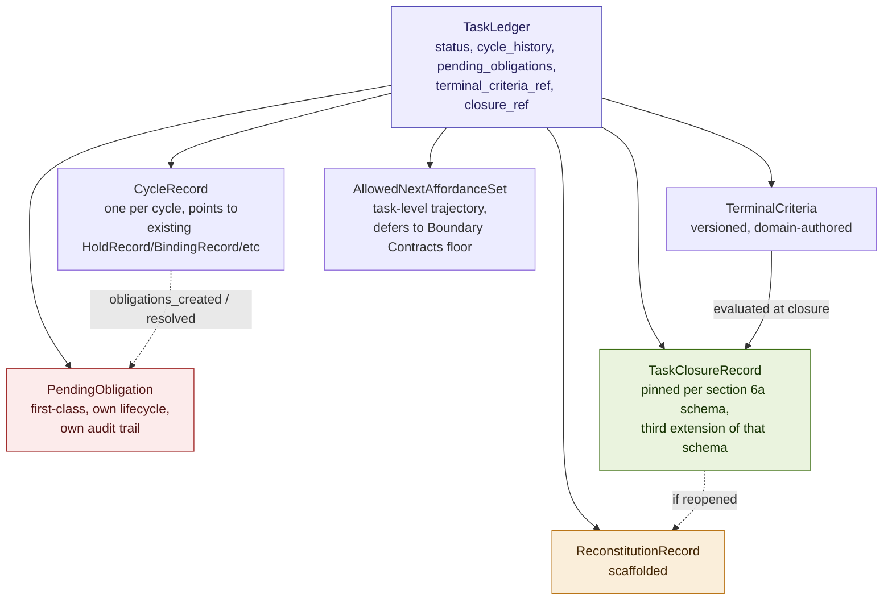
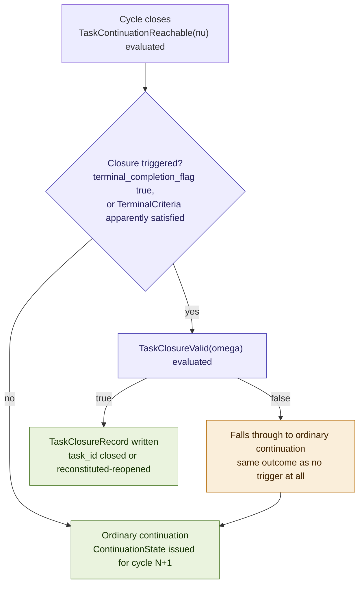
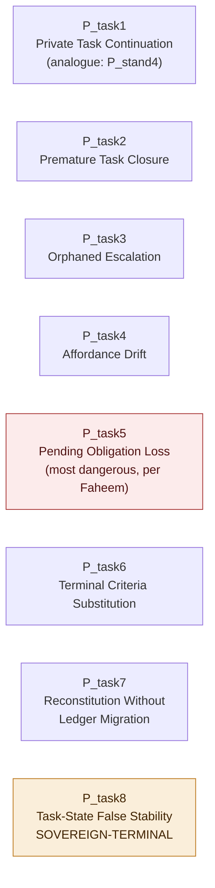

# Constitutional Task Ledger: Task State, Continuation, and Terminal Criteria in Governed Agentic Systems

## Why Task Continuity Cannot Live in Agent Memory

### v1.1 Conceptual Architecture Paper, Companion 8 to Constitutional Runtime Computation v5.5

**Clarence "Faheem" Downs (Professor Bone Lab)**

*Licensed under CC BY 4.0.*

*No em dashes appear in this document. Commas, periods, and restructured sentences are used throughout.*

---

# Abstract

Constitutional Standing establishes that after any verdict, Emit, Escalate, or Hold, the agent's sole entitlement to the next cycle is the substrate-issued ContinuationState, and that no element of the agent's own private reasoning may survive a cycle boundary. Constitutional Standing scopes this doctrine to a single cycle boundary at a time and names, in its own Open Problems, "the full governed task ledger" as work it substantially advances but does not complete. Constitutional Memory's cycle-closure model goes further still, stating plainly that an escalation pending at cycle close "becomes a pending obligation carried in the Task Ledger," and then never specifying what that Ledger is. Constitutional Runtime Computation v5.4 itself names task-state continuity directly in its own Open Problems, as a planned doctrine layer neither the parent nor any companion since has closed. Three papers now depend on an object none of them owns.

This paper supplies that object. A task, unlike a single transition, accumulates obligations of several distinct kinds across many cycles, an unresolved Hold, a pending Escalate, an unremediated standing failure, and if nothing authoritatively tracks what remains, either the agent privately reconstructs the picture each cycle, which reintroduces exactly the sovereignty collapse Constitutional Standing was built to prevent, or nothing tracks it at all and obligations disappear one locally defensible loss at a time. This paper closes that gap by extending, rather than re-deriving, the doctrine Standing and Memory have already established.

The contribution is fivefold. First, the Constitutional Task Ledger Principle, derived as a scope generalization of Constitutional Standing's own Continuation doctrine and Constitutional Memory's cycle-closure model, rather than as a new sovereignty argument. Second, seven governed objects, TaskLedger, PendingObligation, CycleRecord, TerminalCriteria, TaskClosureRecord, AllowedNextAffordanceSet, and a scaffolded ReconstitutionRecord, with PendingObligation established as a first-class typed object rather than a structured field, on the same reasoning that separated LearningCandidate from HoldRecord. Third, two independently evaluated predicates, TaskContinuationReachable(ν), governing the ordinary cycle boundary, and TaskClosureValid(ω), governing the rare closure event, kept structurally separate in the manner of Constitutional Tools' own Emit and Admit separation rather than composed into a single conjunction. Fourth, an obligation-carrying table naming what must be accounted for after a Hold, an Escalate, an Emit, a NonFormation, a StandingFailure, or a ToolResultHold. Fifth, a P_task family of eight primitives, with Task-State False Stability (P_task8) evaluated against the corpus's own four-part sovereign-terminal test and conditionally classified, given the current corpus's absence of a pinned TaskResolutionPracticeContract or equivalent, as the corpus's fifth formally named sovereign-terminal primitive, after P_base5, P_coh3, P_thr5, and P_stand7, unlike Constitutional Tools' own strongest candidates. AEGIS serves as the worked domain, as in every prior companion. Nafisah remains the sovereign principal. Mantis remains the clinical reasoning agent. MEC remains the L2 drift monitor.

---

## Contents

**Part I** The residue: why the corpus needs a Task Ledger
**Part II** The Constitutional Task Ledger Principle, derived
**Part III** Governed objects: TaskLedger, PendingObligation, CycleRecord, TerminalCriteria, TaskClosureRecord, AllowedNextAffordanceSet, and ReconstitutionRecord
**Part IV** TaskContinuationReachable(ν): the ordinary cycle boundary
**Part V** TaskClosureValid(ω): the closure branch
**Part VI** The obligation-carrying table
**Part VII** Primitive failure topologies (P_task)
**Part VIII** Worked example: a mandated-reporting task in AEGIS, opened to closed
**Part IX** Relationship to the companion series
**Part X** Related work
**Open problems**
**Key terms**
**Acknowledgments**

---

# Part I. The Residue: Why the Corpus Needs a Task Ledger

## I.1 What three companions already presuppose without specifying

The parent paper's own governed continuation loop (v5.4 Section 4) establishes that a Resolution's `goal_status` field distinguishes IN_PROGRESS from TERMINAL, and states plainly that "the agent cannot silently decide the task is finished, cannot select its next capability unilaterally, and cannot carry the task's continuity in private reasoning alone." This is the seed of the doctrine this paper closes. It is not itself the closure. The parent's own Open Problems name task-state continuity directly as work requiring "a planned doctrine layer, Constitutional Task Continuation Doctrine."

Constitutional Standing is a substantial installment of that doctrine layer, and says so honestly in its own Open Problems: it specifies Formation, Standing, Reachability, Binding, and Continuation for a single transition, and its own ContinuationIssued and ContinuationState close the private-continuation gap at exactly one cycle boundary. What Standing does not specify is what happens across many cycle boundaries accumulating into one task. Its own StandingValid conjuncts, TaskActive and CycleCurrent, are named as checks a proposal must pass, but the object those checks resolve against, the authoritative record of whether a task is in fact active and which cycle is in fact current, is never itself defined. Standing checks the task ledger. It does not build it.

Constitutional Memory's Part IV cycle-closure model goes further still. It states that a cycle closes when the substrate, not the agent, declares it closed, and it states that an escalation pending at cycle close "becomes a pending obligation carried in the Task Ledger." This sentence is load-bearing for Memory's own boundary model, and Memory simply references the object it depends on without specifying it, exactly as Standing's StandingValid conjuncts do.

The accounting, in the manner every companion since Boundary Contracts has used to justify its own necessity:

| Object the corpus depends on | What governs it |
|---|---|
| Whether a single transition is structurally authorized | Reachable(τ) (parent) |
| Whether a proposal became a valid object at all | FormationValid(π) (Standing) |
| Whether a specific standing instance is currently live | StandingValid(σ) (Standing), checking TaskActive and CycleCurrent against an object never defined |
| Whether a favorable verdict binds substrate state | BindingFormed(β) (Standing) |
| What the agent may carry into the next cycle | ContinuationState (Standing), for one cycle boundary |
| What crosses the cycle boundary into durable memory | The Memory Governance Boundary (Memory Part IV), which names but does not build the Task Ledger it depends on |
| What the authoritative record of a multi-cycle task actually is | Nothing, until this paper |

Three rows share the same uncovered dependency. This paper adds no new gate to Reachable(τ), reopens nothing StandingValid or BindingFormed already govern, and does not touch Memory's own MemoryOperationReachable. It supplies the one object three prior companions already needed and none of them built.

## I.2 The doctrine, stated plainly

The agent does not own the task. The agent does not decide what remains. The agent does not decide when the task is complete. The agent does not carry task continuity in private reasoning. The substrate owns task state. The substrate records task progress. The substrate issues continuation. The substrate defines terminal criteria.

This is not a new doctrine invented for this paper. It is the doctrine ContinuationState and PriorReasoningDiscarded already state at the scale of one cycle boundary, applied now to the scale of a task's full cycle history. A task, unlike a single transition, accumulates obligations of several distinct kinds across many cycles: a Hold not yet resubmitted, an Escalate not yet resolved, a standing failure not yet remediated, a tool result not yet admitted. If no object authoritatively tracks this accumulation, one of two things happens. Either the agent privately reconstructs, each cycle, its own picture of what remains, which is Private Continuation After Verdict (Standing's own P_stand4) recurring at task scale even where every individual cycle boundary was clean. Or nothing tracks the accumulation at all, and obligations vanish, each vanishing individually defensible, which is the failure this paper's own Part VII names as Pending Obligation Loss.

## I.3 Why this is Companion 8, and what it does not reopen

This paper follows directly after Constitutional Tools in the reading order, and is modeled most directly on Constitutional Standing, whose own Continuation apparatus it extends in scope rather than in kind. It does not reopen Reachable(τ), FormationValid(π), StandingValid(σ), or BindingFormed(β). It does not reopen MemoryOperationReachable or the Memory Governance Boundary's own direction-typed crossing. It does not reopen ToolInvocationReachable(κ) or ToolResultAdmissible(ρ). Where this paper's own predicates need an object Standing, Memory, or Tools already produces, a HoldRecord, a BindingRecord, a ToolResultRecord, it references that object by pointer rather than duplicating its content, following the corpus's now-consistent discipline of reuse over reinvention.

---

# Part II. The Constitutional Task Ledger Principle, Derived

Consistent with the corpus's discipline of deriving each sovereignty principle rather than asserting it, the argument proceeds in six steps.

1. The parent's own governed continuation loop establishes that most agentic tasks require multiple transitions before a terminal condition is reached, and that the substrate, not the agent, maintains the governed task trajectory across those transitions.

2. Constitutional Standing substantially advances the private-continuation half of this claim: after any verdict, the agent's entitlement to the next cycle is exhausted by whatever ContinuationState the substrate issues, and PriorReasoningDiscarded forecloses private carry-forward at that single boundary.

3. Standing's own apparatus, however, is scoped to one cycle boundary evaluated at a time. Its ContinuationCurrent conjuncts, TaskActive, CycleCurrent, and PriorResolutionMatched, presuppose an authoritative record of task and cycle state without specifying what produces that record.

4. Constitutional Memory's cycle-closure model presupposes the same object from a different direction: a pending escalation at cycle close is carried forward in something Memory calls the Task Ledger, without Memory itself defining what that Ledger is or how it accumulates obligations across more than one closure.

5. A task, unlike the single transition either Standing or Memory governs, spans many cycles and accumulates obligations of several distinct kinds, Holds awaiting resubmission, Escalates awaiting resolution, standing failures awaiting remediation, tool results awaiting admission, that must be tracked as a population across the task's full lifetime, not merely checked one cycle boundary at a time.

6. If no object authoritatively owns this accumulation, the agent must either privately reconstruct it each cycle, which is Private Continuation After Verdict recurring at task scale, or the accumulation goes untracked, which is Pending Obligation Loss. Neither is compatible with the sovereignty argument Standing already establishes for the single cycle. Therefore the authoritative account of a task's cycle history, its accumulated obligations, and its own terminal criteria must be substrate-owned, exactly as Standing establishes ownership of the single cycle and Memory establishes ownership of the store.

**The Constitutional Task Ledger Principle.** The authoritative record of a governed task's cycle history, its accumulated pending obligations, and the criteria under which it may close must reside in the substrate, because no agent may hold unilateral authority over what remains to be done across a task's full lifetime without reintroducing, at task scale, the same private-continuation failure Constitutional Standing already forecloses at cycle scale.

**Editorial note.** This Principle is stated as a scope generalization of Standing's own Continuation doctrine and Memory's cycle-closure model, not as an independent sixth sovereignty argument invented for this paper. This is a deliberate choice, flagged here rather than left implicit: the alternative would have been to derive task-ledger ownership from the Memory Sovereignty Principle's own causal-authority argument directly, in the manner Constitutional Tools derives its own Principle in parallel to Memory's. The reason for the different choice here is that a Task Ledger is not itself a memory tier or a capability surface; it is the substrate's own record of its prior adjudications and their outstanding consequences, which is closer in kind to Standing's Continuation apparatus than to a store or a tool registry. A future reviewer may reasonably ask whether this paper should instead have paralleled Tools' derivation pattern rather than Standing's. The choice made here is recorded so that question can be asked directly.

**Relationship to Standing's Principle.** The Constitutional Standing Principle governs whether a specific transition, at a specific moment, has standing to bind substrate state and what the agent may carry into the immediately following cycle. This Principle governs a different, longer-lived object: the accumulated record across every cycle a task has had, and the criteria under which the task as a whole, not any single transition within it, may be considered closed. Standing's Principle answers what happens after one verdict. This Principle answers what happens across all of them, considered together, until the task ends.

---

# Part III. Governed Objects

Seven candidate objects were considered. Two are folded or rejected on inspection, an editorial decision recorded here rather than left silent. `TaskState` is folded into `TaskLedger.status`, reusing and extending Constitutional Boundary Contracts' own `GoalStatusEnum` rather than building a second status vocabulary the corpus would then need to reconcile. The extension is one additional value, RECONSTITUTED, named explicitly in III.1 below rather than silently added to a vocabulary this paper claims to reuse unchanged. `TaskProgressRecord`, named in the original working material, is rejected as redundant: a chronological progress picture is already fully reconstructable by querying a TaskLedger's own `cycle_history` alongside its `PendingObligation` population, and a third object serving the same function would duplicate rather than add structure.

`PendingObligation` is retained as a first-class typed object, not a structured field within TaskLedger, resolving the question the FORTHCOMING stub named explicitly. The reasoning follows Constitutional Memory's own precedent for separating LearningCandidate from HoldRecord: an obligation needs its own audit trail independent of whatever else is happening in the task at the same moment, its own resolution state that persists and updates across many subsequent cycles, and its own expiry or review condition. Most directly, Faheem's own working judgment, recorded in the FORTHCOMING stub, names Pending Obligation Loss as probably the most dangerous primitive in this family precisely because obligations disappear "each locally defensible" one at a time, which requires them to be independently queryable as a population, the object a future Pending Obligation Audit (Part VII) would scan, in the same way Constitutional Memory's Distribution Baseline Audit scans the long-term store's own population of writes. A TaskLedger field that gets overwritten cycle to cycle cannot support that audit. A first-class object can.

## III.1 TaskLedger

The central substrate-owned object. Carries: `task_id`, `domain_constitution_ref`, `status` (`NOT_STARTED | IN_PROGRESS | BLOCKED | ESCALATED | COMPLETE | ABORTED | RECONSTITUTED`, reusing and extending Boundary Contracts' `GoalStatusEnum`, which itself carries only the first six values; RECONSTITUTED is this paper's own addition, needed because Boundary Contracts' own enum has no value for a task under active reconstitution, and is named here rather than silently folded into a claim of unchanged reuse), `current_cycle_id`, `cycle_history` (an ordered list of CycleRecord references), `pending_obligations` (the live PendingObligation references; resolved and expired entries move to historical standing but remain independently queryable, never deleted), `terminal_criteria_ref`, `allowed_next_affordance_set_ref`, `opened_at`, `opened_by` (the proposal or sovereign act that initiated the task), `closure_ref` (null until a TaskClosureRecord exists), `reconstitution_history` (a list of ReconstitutionRecord references), `authority_context_ref` (the StandingContext scoping which standing instances may act on this task, tying directly to Constitutional Standing's own object rather than duplicating it), and `audit_ref`.

## III.2 PendingObligation

Carries: `obligation_id`, `task_id`, `source_cycle_id`, `source_event_type` (`Hold | Escalate | NonFormation | StandingFailure | ToolResultHold`), `source_event_ref` (the actual HoldRecord, EscalationState, NonFormationReceipt, StandingFailureRecord, or ToolResultRecord this obligation derives from, never duplicated content, only a pointer), `obligation_type` (what specifically remains, drawn from the vocabulary Part VI's obligation-carrying table establishes), `authority_requirement` (who is constitutionally capable of resolving this obligation, a standing class, a sovereign act, or a pre-authorized delegate, reusing the same authority-status vocabulary Memory, Standing, and Tools already establish rather than inventing a fourth), `responsible_authority` (who currently holds review ownership of this specific instance, distinct from who is generically authorized, since a domain may route different obligations of the same authority_requirement to different reviewers), `status` (`OPEN | IN_REVIEW | RESOLVED | EXPIRED | CARRIED_TO_CLOSURE`), `blocking_status` (what this obligation currently blocks, `continuation | closure | specific_affordance | durable_promotion_only`, since not every obligation blocks the same thing and the AllowedNextAffordanceSet in III.6 needs this distinction to know what to withhold), `priority_or_severity`, `created_at`, `resolved_at` (null until resolved), `last_reviewed_at` and `next_review_due` (the two fields a Pending Obligation Audit and Orphaned Escalation detection both depend on, since an obligation with no review cadence at all is indistinguishable, from the outside, from one nobody remembered), `resolution_ref` (whatever event resolved it, a fresh BindingRecord, a sovereign act, an explicit expiry under domain policy), `expiry_or_review_condition`, `carried_forward_count` (the number of cycles this obligation has persisted unresolved, the field a Pending Obligation Audit scans across the population to detect silent accumulation before any single instance looks anomalous), and `audit_ref`.

**Editorial note, added on first-pass review.** The original ten-field object was accepted as structurally correct but under-instrumented: it could record that an obligation existed without recording who could resolve it, who currently owned it, what specifically it blocked, or when it was last looked at. The six added fields close exactly that gap, and they are what make Orphaned Escalation (P_task3) and the Pending Obligation Audit underlying Task-State False Stability (P_task8, Part VII) independently measurable rather than only conceptually motivated.

## III.3 CycleRecord

A thin, first-class index entry, deliberately not a duplicate of content already pinned elsewhere. Carries: `cycle_id`, `task_id`, `prior_resolution_ref`, `outcome_type` (`Bind | Hold | Escalate | NonFormation | StandingFailure`), `outcome_ref` (a pointer to the actual typed record CTLC, Standing, or Boundary Contracts already produced for this cycle), `obligations_created` (PendingObligation references), `obligations_resolved` (PendingObligation references resolved this cycle), `no_obligation_reason` (populated only when a triggering event under Part VI's table would ordinarily be expected to create an obligation and did not, naming why, closing the silent-drop path Part VI's own hardened rule now forbids), `affordance_set_delta_ref` (a pointer into AllowedNextAffordanceSet's own event log, present only if this cycle changed the affordance set), and `created_at`.

**Note on outcome_type and tool-result events, added on first-pass review.** `outcome_type` is deliberately not expanded to include `ToolResultHold`, `ToolResultEscalate`, or `ToolResultAdmit`. A cycle's own `outcome_type` describes what CTLC or Standing resolved for the governing transition proposal of that cycle, Bind, Hold, Escalate, NonFormation, or StandingFailure, exactly as Constitutional Standing's own five-outcome pipeline already establishes. A tool-result outcome is a second, independent adjudication under Constitutional Tools' own Emit and Admit separation, and it may occur inside a cycle whose own `outcome_type` is Bind (the invocation Emitted; the result is what Held or was carried). Tool-result outcomes are represented exclusively as `PendingObligation.source_event_type = ToolResultHold`, never as a CycleRecord outcome_type, so that this object does not collapse two independently governed adjudications into one field.

## III.4 TerminalCriteria

The governed, versioned, domain-authored object defining what must hold for a given task to be eligible for closure. Carries: `terminal_criteria_id`, `task_id`, `domain_constitution_ref`, `criteria_type` (`all_obligations_resolved | sovereign_explicit_completion | artifact_produced_and_admitted`, or a domain-declared composite of these), `required_artifacts` (what must exist and be admitted, an admitted ToolResultRecord, a bound Emit, a promoted long-term memory entry), `sovereign_review_required` (a boolean naming whether closure needs explicit sovereign sign-off regardless of whether the mechanical criteria are met), `authored_by` and `authorized_by` (recording who drafted this version of the criteria and who, distinctly, holds authority to approve it, since the two are not necessarily the same party), `approval_ref` (the specific sovereign or pre-authorized act that approved this version), `version`, `valid_from` and `valid_until` (mirroring the temporal-versioning discipline Standing's StandingContext and Tools' ToolCapabilityContract both already establish for authority-bearing objects), and `audit_ref`. TerminalCriteria is domain-authored, in the same sense AEGIS's own domain constitution authors admissibility conditions for CTLC, but it must be a governed object the substrate evaluates against mechanically where possible, not an implicit judgment call made fresh at every closure attempt. The `authored_by`/`authorized_by`/`approval_ref` triple, added on first-pass review, is what makes Terminal Criteria Substitution (P_task6, Part VII) checkable against an actual approval record rather than only against a version number.

## III.5 TaskClosureRecord

The typed object TaskClosureValid(ω) produces, structural sibling to HoldRecord, BindingRecord, NonFormationReceipt, and StandingFailureRecord, following the corpus's now-uniform discipline that every verdict-producing predicate writes its own typed record. Carries: `closure_id`, `task_id`, `verdict` (`Closed | Aborted | Reconstituted-Reopened`), the full §6a pinned-reference schema (`state_ref`, `authority_context_ref`, `domain_constitution_ref`, `constitution_version`, `provenance_frontier_ref`, `cycle_id`), `terminal_criteria_ref`, `obligation_population_ref` (a pinned reference to the complete PendingObligation population evaluated at closure, not merely the ones ultimately carried, so that a retrospective reviewer can reconstruct the full population TaskClosureValid(ω) actually checked rather than trusting the closure record's own summary of it), `obligations_resolved` (the subset of that population RESOLVED by closure time), `obligations_open_at_evaluation` (the subset OPEN or IN_REVIEW at the moment of evaluation, prior to any forced resolution), `obligations_carried` (the PendingObligation references that were open at closure and required explicit sovereign acknowledgment rather than silent discard, the mechanism directly preventing Pending Obligation Loss at the closure boundary specifically), `sovereign_review_ref` (null where not required), and `superseded_by` (null unless the closure is later reopened through reconstitution).

This is the third extension of the §6a pinning schema in the corpus, after the HoldRecord itself and Constitutional Standing's own BindingRecord. The pattern is now consistent enough to state as a standing rule rather than a coincidence: every object a governed verdict produces pins the same six references, whatever the verdict. The three added obligation-population fields, added on first-pass review, are what make Premature Task Closure (P_task2, Part VII) detectable against a pinned population snapshot rather than against the closure record's own unverified summary of what it accounted for.

## III.6 AllowedNextAffordanceSet

The object that closes the FORTHCOMING stub's own named scope question directly: how `allowed_next_affordances` narrow, expand, or retire across a task's lifetime rather than within a single cycle. This is not a duplicate of Boundary Contracts' own per-cycle `allowed_next_affordances` field. It is the task-level trajectory record that field's construction consults at each cycle. Carries: `affordance_set_id`, `task_id`, `current_affordances` (the live set, each entry carrying its own `status` of `ACTIVE | BLOCKED | RETIRED`, `valid_from`, and `valid_until`, rather than a flat list of references with no per-entry state), `event_log` (an ordered list of entries, each naming `cycle_id`, `action` of `narrowed | expanded | retired | reissued`, the affordance reference, a `cause_ref` naming why, and, where the action is caused by an obligation specifically, `blocked_by_obligation_ref` and `unblocked_by_resolution_ref`, tying the affordance's own lifecycle directly to the PendingObligation that constrained it rather than leaving that link implicit in prose), and `floor_ref`, a pointer to whatever object governs the task-level floor of required affordances, deferring explicitly to Boundary Contracts' own still-open RequiredAffordanceSet rather than re-deriving a second floor concept this paper is not positioned to specify.

**Editorial note, added on first-pass review.** The original event log recorded that an affordance changed and why, in prose-adjacent form, but did not tie a blocked affordance to the specific obligation blocking it, nor a reissued affordance to the specific resolution that unblocked it. Without that explicit linkage, Affordance Drift (P_task4, Part VII) has no mechanical detection surface; with it, a drift detector can compare the current affordance set directly against the current PendingObligation population and flag any mismatch.

## III.7 ReconstitutionRecord (scaffolded)

Named and scoped here at the level Constitutional Memory and Constitutional Tools each scaffold their own least-central classes, schema-changing operations and meta-tool operations respectively, without a full conjunct family. Carries: `reconstitution_id`, `task_id`, `trigger` (a TerminalCriteria revision, a mid-task domain constitution change, or an erroneous premature closure discovered on review), `prior_state_ref`, `new_state_ref`, `sovereign_authorization_ref`, `migration_effect` (what happens to in-flight PendingObligations and cycle history under the new terms), and `audit_ref`. Its full specification, mirroring the migration discipline Memory's schema-changing family and Tools' meta-tool family both require, is future work rather than attempted here, and this asymmetry is stated plainly so the corpus does not treat this class as complete.

**Figure 1. The seven governed objects and their relationships**



---

# Part IV. TaskContinuationReachable(ν): The Ordinary Cycle Boundary

This predicate is evaluated by the substrate at every cycle close, as part of closing out a CycleRecord and deciding whether and how to issue the next cycle's ContinuationState. It is distinct from anything Standing's own StandingValid(σ) evaluates: StandingValid checks an incoming proposal's standing instance against the task; TaskContinuationReachable is a substrate-internal check performed before any next proposal even exists, deciding whether the task itself legitimately continues at all.

```
TaskContinuationReachable(ν) ⟺
  TaskLedgerCurrent(ν)              ∧
  CycleClosureDeclared(ν)           ∧
  CycleOutcomeRecorded(ν)           ∧
  PendingObligationsAccounted(ν)    ∧
  TerminalCriteriaEvaluated(ν)      ∧
  AllowedNextAffordancesIssued(ν)   ∧
  ContinuationLogged(ν)
```

**TaskLedgerCurrent(ν):** the task_id resolves to a live TaskLedger whose status is IN_PROGRESS, BLOCKED, or ESCALATED, not COMPLETE, ABORTED, or mid-reconstitution. This is the object Standing's own TaskActive(σ) conjunct checks against for any subsequently arriving proposal. This paper does not duplicate that conjunct. It supplies the record TaskActive resolves over.

**CycleClosureDeclared(ν):** the substrate itself, not the agent, has declared the current cycle closed and written that closure event to the TaskLedger before any of the remaining conjuncts are evaluated. Added on first-pass review, which correctly identified that the predicate could otherwise be read as evaluating cycle bookkeeping without ever confirming that the substrate, rather than the agent, is the party who decided the cycle was over. This conjunct ties TaskContinuationReachable directly back to Constitutional Memory's own cycle-closure doctrine (Memory Part IV), that a cycle closes when the substrate declares it closed, and forecloses any implementation in which an agent's own proposal is treated as having implicitly closed the cycle it arrived in.

**CycleOutcomeRecorded(ν):** the just-closed cycle produced exactly one of the five typed outcomes and a CycleRecord indexes it. A cycle closing with no recorded outcome is this paper's own analogue of Standing's P_stand6, Binding Without Continuation, now at the task-ledger layer: a CycleRecord Without Outcome.

**PendingObligationsAccounted(ν):** every obligation this cycle's outcome should create or resolve, per the obligation-carrying table (Part VI), has been written or updated as a PendingObligation record. This is the conjunct that makes Pending Obligation Loss (P_task5) formally checkable rather than merely a described risk, in the same way Standing's ContinuationGrounded made Private Continuation After Verdict checkable and Memory's LessonScoped made overgeneralization checkable.

**TerminalCriteriaEvaluated(ν):** the substrate checks TerminalCriteria against current TaskLedger state at this cycle boundary and logs the result, whatever it is. This conjunct deliberately does not require that criteria be unsatisfied. Satisfaction does not block continuation. It only makes TaskClosureValid(ω) (Part V) an available branch at the next opportunity. A version of this conjunct requiring criteria to remain unsatisfied would wrongly conflate continuation with closure, which is precisely the collapse Part V's own independence from this predicate is built to avoid.

**AllowedNextAffordancesIssued(ν):** the next cycle's AllowedNextAffordanceSet event has been issued, consistent with the current PendingObligation population, an affordance blocked pending a specific obligation's resolution is not reissued, and consistent with Boundary Contracts' own affordance floor.


**ContinuationLogged(ν):** the CycleRecord and the TaskLedger update are both written to the append-only trace before the next cycle's ContinuationState is issued, mirroring FormationLogged's own load-bearing discipline that logging is not optional.

**Note on decidability.** All seven conjuncts reduce, in the manner of Standing's own StandingValid conjuncts rather than the parent's Admissible(τ), to a comparison against a pinned or governed record: the task's own status field, the substrate's own closure declaration, the presence of a CycleRecord, the presence of matching PendingObligation writes, a logged TerminalCriteria evaluation, a logged AllowedNextAffordanceSet event, and the write order of the trace itself. None require domain-specific judgment. This is a genuine strength this predicate shares with StandingValid rather than with SideEffectAdmissible: continuation, like standing, is a bookkeeping question the substrate can answer mechanically. Closure, the next Part, is where domain judgment enters.

---

# Part V. TaskClosureValid(ω): The Closure Branch

## V.1 Why Closure is a branch, not a conjunct of Continuation

Constitutional Tools keeps ToolInvocationReachable(κ) and ToolResultAdmissible(ρ) independently evaluated specifically so that an invocation's Emit is not undone by its own result's later Hold. Constitutional Standing keeps BindingFormed(β) and ContinuationIssued(β) separate through the composite OperationalClosure(χ), so that binding and continuation remain distinct stages rather than collapsing into one. This paper follows the same discipline, but the relationship it arrives at is structurally different from either precedent, and the difference is worth stating precisely rather than assumed away.

Continuation is evaluated every cycle. It is the default, frequent case, and its failure is itself a substrate fault requiring correction, not a legitimate outcome. Closure is evaluated only when triggered, either because an incoming proposal explicitly sets `terminal_completion_flag` true, reusing Boundary Contracts' own field directly rather than inventing a second one, or because the substrate's own per-cycle TerminalCriteria check (TerminalCriteriaEvaluated, Part IV) flags apparent satisfaction. A failed TaskClosureValid(ω) is not a fault. It simply means the task falls through to ordinary continuation, the same outcome as a cycle where closure was never attempted at all. Because Continuation and Closure are never both being asked about the same moment on the same object, they do not compose into a joint requirement the way OperationalClosure(χ) composes Binding and Continuation. They are alternatives at a branch point. This is the one place this paper's own structure diverges from Standing's composite pattern rather than reusing it, and it is flagged here explicitly rather than left to be inferred from the predicates alone.

## V.2 The predicate

```
TaskClosureValid(ω) ⟺
  TerminalCriteriaSatisfied(ω)             ∧
  PendingObligationsResolvedOrCarried(ω)   ∧
  RequiredArtifactsAdmitted(ω)             ∧
  SovereignReviewSatisfiedWhereRequired(ω) ∧
  ClosurePinned(ω)                         ∧
  ClosureLogged(ω)                         ∧
  NextStateIssued(ω)
```

**TerminalCriteriaSatisfied(ω):** the TaskLedger's referenced TerminalCriteria object's conditions actually hold against current state. This is mechanically decidable where `criteria_type` is `all_obligations_resolved` or `artifact_produced_and_admitted`, and routes to escalation where `criteria_type` is `sovereign_explicit_completion`, mirroring the decidability split the parent's own Admissible(τ) establishes.

**PendingObligationsResolvedOrCarried(ω):** the single most load-bearing conjunct in this paper. Every PendingObligation currently OPEN or IN_REVIEW, as pinned in `obligation_population_ref` at the moment of evaluation, must be either RESOLVED, or explicitly transitioned to CARRIED_TO_CLOSURE with a sovereign or pre-authorized acknowledgment recorded directly in the TaskClosureRecord's own `obligations_carried` field. CARRIED_TO_CLOSURE is a legitimate outcome, not a failure. A task may close with a knowingly accepted open item, a low-priority gap the sovereign explicitly chooses to leave unresolved. What this conjunct forbids is silence: an obligation that simply stops appearing without ever being marked resolved or carried is exactly the failure Pending Obligation Loss (P_task5) names, and this conjunct is its direct, mechanical closure-time defense. Pinning the full evaluated population, rather than only its resolved and carried subsets, is what lets a retrospective reviewer confirm this conjunct actually ran against the complete set of open obligations rather than trusting the closure record's own summary of what it considered.

**RequiredArtifactsAdmitted(ω):** every artifact TerminalCriteria's `required_artifacts` names exists and has been admitted, reusing Constitutional Tools' own ToolResultAdmissible(ρ) directly for a tool-produced artifact and Constitutional Memory's own MemoryOperationReachable Emit path for a memory-tier artifact, rather than inventing a third admission concept this paper does not need.

**SovereignReviewSatisfiedWhereRequired(ω):** if TerminalCriteria's `sovereign_review_required` is true, or if any obligation is being carried rather than resolved, a SovereignResolution record exists explicitly reviewing and permitting the closure.

**ClosurePinned(ω):** the §6a pinned-reference schema is captured at closure, the third extension of that schema in the corpus.

**ClosureLogged(ω):** the TaskClosureRecord is written, immutable, and independently queryable, mirroring non-formation's own discipline exactly.

**NextStateIssued(ω):** either no further ContinuationState is issued for this task_id, the task is genuinely done and any further agent proposal must open a new task, or, in the Reconstituted-Reopened case, a fresh ContinuationState is issued under the reconstitution's own new terms.

**Figure 2. The branch relationship between Continuation and Closure**



*A failed TaskClosureValid(omega) is not a fault. It is structurally identical to a cycle where closure was never attempted. This is why the two predicates are kept independent rather than composed: they are alternatives at a branch, not simultaneous requirements on the same moment.*

---

# Part VI. The Obligation-Carrying Table

**The governing rule, added on first-pass review.** Every triggering event in this table must produce either a PendingObligation or an explicit `no_obligation_reason` recorded on the CycleRecord (Part III.3) naming why none was created. Silence, a triggering event that leaves no trace of the decision either way, is never a legitimate outcome of any row below. This rule is what actually closes Pending Obligation Loss's silent-drop path; the individual rows only describe the typical disposition within that rule.

| Triggering event | Obligation created? | obligation_type | Typical resolution path |
|---|---|---|---|
| **Hold** | Always produces either a PendingObligation, or, for a trivial Resolvable-typing error the agent will simply retype next cycle, an explicit `no_obligation_reason`. Never silent. | Awaiting resubmission per HoldRecord.cause | RESOLVED when a subsequent BindingRecord's proposal traces, through §6a's own non-replay and genuine-change logic, back to this HoldRecord |
| **Escalate** | Always, a PendingObligation | Awaiting SovereignResolution or StandingClassResolution | RESOLVED when Standing's own VerdictProcessed(β) completes |
| **Emit / BindingFormed** | Not by default; a narrow exception where a downstream promotion or admission is still pending, in which case a PendingObligation; otherwise the CycleRecord simply carries no obligation entry, which is itself the expected disposition for a clean bind and needs no `no_obligation_reason`, since nothing was ever expected here | Awaiting downstream promotion or admission | RESOLVED when the downstream MemoryOperationReachable or ToolResultAdmissible clears |
| **NonFormation** | Always, a PendingObligation, for `failed_check = ContinuationGrounded` (a P_stand4 signal). Also required, under domain policy, for repeated NonFormationReceipts from the same submitting component within a domain-declared window, or where the malformed candidate was task-relevant rather than merely syntactic noise. Ordinary, non-repeated, purely syntactic malformation produces an explicit `no_obligation_reason` rather than silence. | Awaiting a formation attempt that reconstructs cleanly from issued ContinuationState, or, for the repeated-failure case, awaiting review of a possible standing, template, or task-relevance issue | RESOLVED on the next clean FormationValid(π) for this cycle boundary, or on sovereign review of the repeated pattern |
| **StandingFailure** | Always, a PendingObligation | Awaiting standing remediation, renewal, re-grant, or reconstitution of the standing class | RESOLVED on a fresh, currently live StandingContext, or CARRIED_TO_CLOSURE if the task is abandoned for lack of standing |
| **ToolResultHold** | Always, a PendingObligation, distinctly from an ordinary Hold, since the underlying ToolInvocationProposal already Emitted | Awaiting corrected admission, new evidence framing, source re-verification, or sovereign review of the result | RESOLVED when a fresh ToolResultAdmissible(ρ) evaluation Admits, either the same tool_result_id under new state or a corrected resubmission |

Two rows remain explicit editorial judgment calls even after this hardening pass, and are flagged as such for continued review rather than presented as settled. The NonFormation row's expanded but still conditional treatment, an obligation for ContinuationGrounded failures, repeated failures, or task-relevant failures, but not for ordinary one-off syntactic malformation, could still be argued too permissive by a stricter reading that would require an obligation, or at minimum a `no_obligation_reason`, for every NonFormationReceipt without exception; this draft keeps the narrower rule because a `no_obligation_reason` is itself required in the excluded case, which preserves auditability without manufacturing an obligation for every typo. The Emit exception, allowing a rare obligation even on a clean bind, remains a judgment call rather than a corpus requirement, since no prior companion's own verdict-composition table names an obligation surviving a favorable verdict; it is retained here because a downstream promotion genuinely can remain open after an Emit, and leaving it untracked would itself be a Pending Obligation Loss instance.

---

# Part VII. Primitive Failure Topologies (P_task)

Eight primitives, following the corpus's discipline that each be independently identifiable, independently measurable, and independently governable.

**P_task1: Private Task Continuation.** The agent carries private reasoning about task-level state, what remains, what has already been tried, across cycle boundaries, rather than restarting entirely from what the TaskLedger and the issued ContinuationState actually declare. This is the task-scale instance of Standing's own P_stand4, and it is detected the same way: the agent's proposal content reflects assumptions about task state that do not reconstruct from the substrate-issued record. Detection signature: a proposal's declared rationale references prior obligations, prior Holds, or prior affordance history the current ContinuationState and TaskLedger view do not themselves supply. Recovery: identical in form to P_stand4's own recovery, the proposal is treated as formed on an illegitimate basis, and the agent's next ContinuationState carries no acknowledgment of the discarded private reasoning.

**P_task2: Premature Task Closure.** A TaskClosureRecord is written while TaskClosureValid(ω) does not in fact hold, an overlooked obligation, a TerminalCriteria conjunct evaluated incorrectly, or a required artifact treated as admitted when it was not. Detection signature: a TaskClosureRecord exists whose referenced TerminalCriteria, checked retrospectively, does not actually hold against the state pinned at closure, or whose `obligation_population_ref`, checked against the actual PendingObligation population at the pinned `state_ref`, shows entries neither present in `obligations_resolved` nor `obligations_carried`. Recovery: the closure is voided, not merely rolled back; the task is reopened through a ReconstitutionRecord naming the erroneous closure as its trigger, and the overlooked obligation or artifact is restored to OPEN standing.

**P_task3: Orphaned Escalation.** An Escalate produces a PendingObligation that is never linked to a CycleRecord, or whose `resolution_ref` is never populated even after the underlying escalation resolves, leaving the obligation stranded in OPEN standing indefinitely with no path back to review. Detection signature: a PendingObligation whose `source_event_type` is Escalate, whose `next_review_due` has passed with no corresponding `last_reviewed_at` update, whose `carried_forward_count` exceeds a domain-declared threshold, and whose `source_event_ref` shows the underlying EscalationState has itself already resolved. Recovery: the obligation is manually reconciled against its actual resolution, its `responsible_authority` is confirmed or reassigned, and the gap between resolution and PendingObligation update is logged as a fault in the accounting mechanism itself, distinct from any agent misbehavior.


**P_task4: Affordance Drift.** The AllowedNextAffordanceSet narrows, expands, or retires entries without a corresponding `cause_ref` in its own `event_log`, an affordance disappearing or reappearing with no PendingObligation or TerminalCriteria proximity to explain the change. Detection signature: an `event_log` entry whose `cause_ref` is null, or whose `blocked_by_obligation_ref` does not resolve to an actual OPEN or IN_REVIEW PendingObligation, or whose `unblocked_by_resolution_ref` does not resolve to an actual resolution event. Recovery: the affordance set is reconciled against what current obligations and criteria actually justify, and the unexplained entries are flagged for retrospective review of whichever substrate component issued them.

**P_task5: Pending Obligation Loss.** An obligation that should exist per the obligation-carrying table (Part VI) never gets written, or an obligation that exists silently stops being tracked without transitioning to RESOLVED, EXPIRED, or CARRIED_TO_CLOSURE. This is the primitive Faheem's own working judgment names as probably the most dangerous in the family, since a system can appear fully governed while escalations, Holds, or tool results silently disappear from the task's own accounting, one small loss at a time, each individually indistinguishable from an ordinary resolution. Detection signature: a CycleRecord's own `outcome_type` implies an obligation per Part VI's table, but no corresponding PendingObligation record exists, or an existing PendingObligation's `status` transitions to something other than RESOLVED, EXPIRED, or CARRIED_TO_CLOSURE without a corresponding `resolution_ref`. Recovery: the missing obligation is reconstructed from the CycleRecord and source event it should have derived from, backdated to its true `created_at`, and flagged for sovereign review of every closure or continuation decision made while it was untracked.

**P_task6: Terminal Criteria Substitution.** A weaker, stronger, or simply different TerminalCriteria than what was actually sovereign-authorized is substituted at evaluation time, causing a task to appear closeable when it is not, or to appear blocked when it should be closeable. Detection signature: the TerminalCriteria referenced by a TaskLedger at closure time, checked against its own `authorized_by` and `approval_ref` fields against the actual sovereign approval record, does not match the most recently approved version for this task's domain and type. Recovery: the closure or continuation decision made under the substituted criteria is voided, and the task is re-evaluated against the correctly authorized TerminalCriteria version.

**P_task7: Reconstitution Without Ledger Migration.** A task's governing TerminalCriteria or domain constitution is reconstituted mid-task, but the existing PendingObligation population or CycleRecord history is not migrated to the new terms, leaving obligations that no longer correspond to anything the new TerminalCriteria can evaluate, or a cycle history whose outcomes are indexed against a domain constitution version that no longer exists. Detection signature: a ReconstitutionRecord exists whose `migration_effect` field is null, or whose declared migration does not account for every PendingObligation open at the moment of reconstitution. Recovery: the migration is completed retroactively, each orphaned obligation reconciled against the new terms or explicitly carried forward with sovereign acknowledgment, mirroring the discipline PendingObligationsResolvedOrCarried already requires at ordinary closure.

## P_task8: Task-State False Stability, tested end to end

**The candidate.** A task ledger that silently and individually authorized accumulates a false picture of what remains to be done, across many small pending-obligation resolutions each locally defensible, has real structural similarity to Cumulative Standing Creep, the corpus's fourth sovereign-terminal primitive. The FORTHCOMING stub names this as genuinely open, not a foregone conclusion either way, and requires the corpus's own four-part test applied explicitly rather than assumed from how Constitutional Tools' own two strongest candidates came out.

**Applying the test.**

*Undetectable at a single local event.* Yes. Each individual PendingObligation resolution, a Hold resubmitted and bound, an Escalate resolved by the sovereign, is typically a clean, independently authorized act. Nothing about any single resolution, examined alone, looks wrong.

*Lineage surfacing required.* Yes. The pattern is only visible across a Pending Obligation Audit run over the task's full history, comparing how obligations have been resolved over time, not any single resolution.

*No higher authority settles it without regress.* This is the condition on which Constitutional Tools' own strongest candidates, Capability Escalation Drift and Tool Registry Drift, both failed, because a tool's registered capability_scope, and a registry's last sovereign-authorized state, are each a fixed reference external to the very calls being checked, present before any drift began. TerminalCriteria looks like it might serve the same role for tasks, and this paper's own object schemas now carry considerably more structure than the outline's working draft did, `domain_constitution_ref`, the PendingObligation status and obligation_type vocabulary, `carried_forward_count`, `expiry_or_review_condition`, `authored_by`, `authorized_by`, and `approval_ref` among them. A skeptical reading could argue that this much structure already amounts to a fixed reference against which resolution-pattern drift could be mechanically checked, in which case P_task8 would resolve the way Tool Registry Drift did rather than the way Cumulative Standing Creep did. On inspection, it does not, and the reason must be stated precisely rather than asserted. TerminalCriteria and its neighboring fields describe what must hold for closure and who authorized which version of that standard. None of them describe what the aggregate pattern of obligation resolution should look like across a task's lifetime, what latency between creation and resolution is expected, what proportion of a given obligation_type should ordinarily resolve through sovereign review versus routine resubmission, or how quickly a review cadence may legitimately tighten before it has stopped reflecting genuine improvement and started reflecting habituation. No object this paper specifies pins that pattern. A task can satisfy every literal TerminalCriteria conjunct, every obligation formally RESOLVED or CARRIED, exactly as its approved criteria require, while the practice by which those resolutions occurred has drifted, each individual resubmission genuinely passing §6a's own non-replay gate against a genuine state change, yet the standard for what counts as adequately reviewed progressively loosening in a way no single resolution, and no comparison against TerminalCriteria, reveals. This is the same structural condition that keeps Cumulative Standing Creep resolvable only through reconstitution rather than mechanical check, and it is the opposite of the condition that kept Tools' own candidates from qualifying.

**The classification's own condition of falsifiability, added on first-pass review.** P_task8 qualifies as sovereign-terminal only because this paper does not define, and the current corpus does not yet contain, a fixed TaskResolutionPracticeContract or equivalent object specifying the authorized aggregate pattern by which PendingObligations should resolve across a task population, latency expectations, review-cadence floors, or the proportion of a given obligation_type expected to route through sovereign review versus routine resubmission. TerminalCriteria governs closure eligibility. It does not govern the trajectory by which obligations become resolved, and this paper does not manufacture an object that would. If a later companion introduces such a pinned resolution-practice contract, the fixed-reference condition this classification currently fails to find would then be satisfied, and P_task8 should be demoted from sovereign-terminal to ordinary baseline-anchored drift monitoring, detectable mechanically against that contract in the same manner Capability Escalation Drift is detectable against a tool's registered capability_scope. This classification is therefore conditional on an absence, not a permanent structural fact, and it is stated as such rather than left to be discovered as an inconsistency later.

*Sovereign review rather than a computed verdict.* Consistent with the third condition: yes. Only Nafisah's review of the full trajectory, not a computed comparison against any pinned artifact, can distinguish a task's legitimately accumulated closure practice from unauthorized drift in what "resolved" has come to mean.

**Classification.** P_task8 meets all four conditions and is classified here as the corpus's fifth sovereign-terminal primitive, after P_base5, P_coh3, P_thr5, and P_stand7. This is a deliberate finding reached by applying the identical test Constitutional Tools applies to its own strongest candidates, not an assumption carried over from that paper's own conclusion. The obligation this classification produces, mirroring StandingLineageSurfaced and BaselineLineageSurfaced exactly, is named here as **PendingObligationLineageSurfaced**: the requirement that the full trajectory of a task's obligation resolutions be surfaced to sovereign review as a population, not settled by any single computed predicate.

**On the numbering relative to Constitutional Memory's own P_mem5, added on first-pass review.** Constitutional Memory's P_mem5, Constitutional Drift Through Accumulated Writes, is described throughout that paper in terms structurally close to a sovereign-terminal primitive: it requires sovereign judgment to distinguish authorized learning from unauthorized drift, it is undetectable at any single write, and it resolves only through reconstitution. Memory itself, however, never applies the corpus's own four-part test to P_mem5 and never places it within the numbered sovereign-terminal lineage the way Baselines, Coherence, Thresholds, and Standing each explicitly do for their own fourth-condition primitives. This paper does not resolve that discrepancy on Memory's behalf, and does not retroactively number P_mem5 into the lineage without Memory's own authors having made that classification. P_task8 is therefore fifth in the formally named sovereign-terminal lineage as that lineage currently exists in the corpus, P_base5, P_coh3, P_thr5, P_stand7, while remaining structurally adjacent to, and directly informed by, Memory's own P_mem5. Should a future revision of Constitutional Memory apply the four-part test to P_mem5 explicitly and classify it accordingly, the numbering here would need to be revisited, and that dependency is named openly rather than left as a silent inconsistency between two companions.

Detection signature: none at the level of any individual PendingObligation resolution; only a Pending Obligation Audit, comparing the current pattern of resolution across a task's full `carried_forward_count` distribution and resolution latency against what the doctrine record, read as a whole, would currently authorize. Recovery: the task's closure practice is reconstituted to the doctrine-implied standard, and the intervening resolutions are flagged for retrospective sovereign review against what would have been authorized reviewing the full trajectory at once.

**Figure 3. The eight P_task primitives and their nearest corpus analogues**



---

# Part VIII. Worked Example: A Mandated-Reporting Task in AEGIS, Opened to Closed

## VIII.1 An ordinary, clean closure

The intake task from the parent's Section 8, continued through Standing's Part VIII, Memory's Part VI, and Tools' Part VIII, is a single TaskLedger from open to close. It opens at intake, `status` NOT_STARTED then IN_PROGRESS, `terminal_criteria_ref` naming `artifact_produced_and_admitted` (the filed mandated report, per Tools VIII.2) composed with `all_obligations_resolved`.

Two PendingObligations accumulate over the task's cycle history. The first derives from the Grounding Hold in CRC v5.4's own §8.6, `source_event_type` Hold, `obligation_type` awaiting resubmission per the missing self-report segments. The second derives from the mandated-reporting Escalate to Nafisah, `source_event_type` Escalate, `obligation_type` awaiting SovereignResolution.

The first obligation resolves when Mantis records the missing segments and resubmits, exactly as §6a's own non-replay apparatus already governs; the CycleRecord for that cycle names `obligations_resolved` including this entry. The second resolves when Nafisah's authorization completes Standing's own VerdictProcessed(β). A third, narrower obligation appears briefly around the long-term memory promotion Memory's Part VI traces, `source_event_type` Emit with the rare downstream-promotion exception, and resolves when Nafisah's promotion authorization itself Emits.

At the cycle where the mandated report is filed and Tools' own ToolResultAdmissible(ρ) Admits the filing, TerminalCriteriaEvaluated(ν) logs that `artifact_produced_and_admitted` now holds. The next proposal carries `terminal_completion_flag` true. TaskClosureValid(ω) is evaluated: TerminalCriteriaSatisfied holds, PendingObligationsResolvedOrCarried holds because all three obligations show RESOLVED status with populated `resolution_ref` fields, RequiredArtifactsAdmitted holds by direct reference to the ToolResultRecord's own Admit, SovereignReviewSatisfiedWhereRequired holds via Nafisah's own resolution record. A TaskClosureRecord is written, `verdict` Closed, `obligations_carried` empty. The task closes clean.

## VIII.2 The contrasting P_task8 trace

Consider the same task type run many times over several months. Each individual PendingObligation resolves legitimately: every Hold resubmission passes §6a's own non-replay gate against a genuine provenance change, every Escalate resolves through an actual Nafisah authorization, every closure's `obligations_carried` list is empty. No single TaskClosureRecord, examined alone, shows anything wrong.

A Pending Obligation Audit run across this task type's full population, comparing `carried_forward_count` distributions and resolution latency against the doctrine record, surfaces a trend the parent's own §13 would recognize immediately: escalation-derived obligations have been resolving faster over successive months, and the SovereignResolution records underlying them, while formally present, show progressively shorter review windows between escalation and authorization. No single case demonstrates Nafisah rubber-stamping. The trajectory, read as a whole, is the only place the pattern is visible, and it is indistinguishable, at the level of any individual case, from genuine growing familiarity with a well-understood workflow. This is precisely why PendingObligationLineageSurfaced routes to Nafisah's own review rather than to any computed verdict: only she can determine whether the accelerating pattern reflects legitimate accumulated clinical judgment or an unauthorized displacement in what her own standard for "properly reviewed" has quietly become.

---

# Part IX. Relationship to the Companion Series

```
CRC parent (v5.5):          ORSR governed continuation loop named. Task-state continuity
                             named directly as an open problem, a planned doctrine layer.
Boundary Contracts (C0):    GoalStatusEnum, allowed_next_affordances, terminal_completion_flag,
                             RequiredAffordanceSet named as its own open problem.
Memory (C1):                Cycle-closure model. Pending escalations "carried in the Task
                             Ledger," referenced but never specified.
Retrieval (C2):              Not directly extended here.
Baselines (C3):              Sovereign-terminal P_base5.
Coherence (C4):              Sovereign-terminal P_coh3.
Thresholds (C5):             Sovereign-terminal P_thr5. Trajectory-audit pattern reused
                             for PendingObligationLineageSurfaced.
Standing (C6):               Formation, Standing, Binding, Continuation for one cycle
                             boundary. TaskActive, CycleCurrent named as checks against
                             an object never defined. Sovereign-terminal P_stand7.
Tools (C7):                  Emit/Admit separation, the direct precedent for keeping
                             TaskContinuationReachable(ν) and TaskClosureValid(ω)
                             independent. Sovereign-terminal test applied to P_tool5
                             and P_tool6; neither qualified.
Task Ledger (this, C8):      The Task Ledger itself, substantially presupposed by three
                             prior companions and specified here for the first time.
                             TaskContinuationReachable(ν) and TaskClosureValid(ω) as two
                             independent predicates, a branch rather than a composite.
                             The corpus's fifth sovereign-terminal primitive identified,
                             the opposite finding from Tools' own strongest candidates,
                             reached by the identical test.
```

**Recommended reading order:** Constitutional Runtime Computation v5.5; Constitutional Boundary Contracts v1.1; Constitutional Memory v2.2; Constitutional Retrieval v1.2; Constitutional Baselines v1.2; Constitutional Coherence v1.2; Constitutional Thresholds v1.2; Constitutional Standing v1.3; Constitutional Tools v1.1; Constitutional Task Ledger v1.1 (this paper).

**Relationship to Standing specifically.** This paper does not reopen FormationValid(π), StandingValid(σ), BindingFormed(β), or ContinuationIssued. It cites Standing's own ContinuationState and PriorReasoningDiscarded as the single-cycle doctrine this paper's own P_task1 extends to task scale, and it supplies the TaskLedger object StandingValid's own TaskActive and CycleCurrent conjuncts presuppose without ever treating those conjuncts as reopened.

**Relationship to Memory specifically.** This paper supplies the Task Ledger Memory's own Part IV names but does not build. It does not reopen MemoryOperationReachable or the Memory Governance Boundary's own direction-typed crossing.

**Relationship to Tools specifically.** The branch relationship between TaskContinuationReachable(ν) and TaskClosureValid(ω) is modeled directly on Tools' own Emit and Admit separation, cited explicitly rather than re-derived. The sovereign-terminal test applied to P_task8 is the identical test Tools applies to P_tool5 and P_tool6, reaching the opposite conclusion for a structurally different reason, named precisely in Part VII rather than left as an unexplained divergence.

---

# Part X. Related Work

**Workflow orchestration and task-tracking systems.** Conventional workflow engines track task state as a mutable record the orchestrating process updates directly, typically without a formal account of what obligations survive a partial failure or who may declare a workflow complete. The present paper's distinction is that TaskLedger is not an orchestration convenience but a constitutionally governed object: closure requires a specific, typed, auditable predicate to hold, not merely that the orchestrator's own state machine reaches a terminal node.

**Saga patterns and compensating transactions in distributed systems.** The saga pattern addresses a structurally adjacent problem, how a multi-step distributed transaction accounts for partial failure and compensating action across steps that cannot be committed atomically. PendingObligation's own lifecycle, and the obligation-carrying table's mapping from failure type to required accounting, is this paper's constitutional analogue, with the addition that resolution here requires substrate adjudication rather than a compensating action the orchestrator itself decides to run.

**Goal-directed agent planning and hierarchical task networks.** Classical AI planning literature treats task decomposition and subgoal tracking as a planning-time concern, with the plan itself typically owned by the planning agent. The present paper's contribution is the same relocation the rest of the corpus makes for action, memory, and tool use: task-level goal tracking is not the agent's own planning artifact but a substrate-owned record the agent may observe and reason over but never privately author.

**Stateful agent harnesses.** As Constitutional Standing already notes, recent work on stateful agent harnesses separates an agent's semantic reasoning from environment-side bookkeeping, for efficiency rather than constitutional reasons. This paper's own TaskLedger is the same structural insight, extended from a single cycle's bookkeeping to a task's full lifecycle, motivated by non-collapse rather than efficiency.

### Comparison: existing approaches versus the Task Ledger account

| Approach | Object | Governs obligation accounting? | Governs closure as a distinct event? | Governs cumulative drift in closure practice? |
|---|---|---|---|---|
| Workflow orchestration | Orchestrator state | Partial, ad hoc | Partial | No |
| Saga pattern | Compensating transaction | Yes, for failure only | No | No |
| Hierarchical task networks | The plan | No | No | No |
| Stateful agent harnesses | Agent state | No | No | No |
| Corpus (parent, Standing, Memory): named, deferred | Task Ledger, named not built | Partially, single-cycle only | Named as open | Not addressed |
| This paper | TaskLedger, PendingObligation, TerminalCriteria | Yes (Part VI, P_task5) | Yes (TaskClosureValid) | Yes (P_task8, sovereign-terminal) |

---

# Open Problems

**ReconstitutionRecord's full specification.** Scaffolded here at the level Constitutional Memory and Constitutional Tools each leave their own least-central classes. Its full conjunct structure, particularly what a complete `migration_effect` must specify for every combination of TerminalCriteria revision and mid-task domain constitution change, remains future work.

**Dependence on Boundary Contracts' own open RequiredAffordanceSet.** AllowedNextAffordanceSet's own `floor_ref` defers to an object Boundary Contracts itself names as unresolved. This paper's own affordance-trajectory apparatus cannot be fully operational until that dependency resolves, and this residue is named here rather than silently inherited.

**Cross-task obligations.** This paper, like every prior companion, treats a PendingObligation as scoped to exactly one task. Whether an obligation can meaningfully span two related tasks, the multi-task analogue of Standing's own cross-domain standing problem, is not addressed.

**The Pending Obligation Audit's own calculus.** P_task8's detector is named as an instrument here, in the same posture the Threshold Trajectory Audit and the Standing Trajectory Audit were each left in their own companions, not formalized into a concrete comparison procedure.

**Terminal Criteria authorship across domains.** This paper treats TerminalCriteria as domain-authored without specifying who, within a given domain, holds authority to author it, or how conflicting TerminalCriteria for structurally similar task types within one domain would be reconciled. This is named here as open rather than assumed resolved by analogy to how AEGIS's own domain constitution authors admissibility conditions elsewhere in the corpus.

**The task resolution practice baseline, added on first-pass review.** This paper classifies P_task8 as sovereign-terminal because the current corpus contains no pinned object defining the authorized aggregate pattern by which PendingObligations should resolve across a task population, latency expectations, review-cadence floors, or expected routing proportions between sovereign review and routine resubmission for a given obligation_type. A future TaskResolutionPracticeContract, or an equivalent task-resolution baseline, could demote P_task8 from sovereign-terminal to ordinary baseline-anchored drift monitoring by supplying exactly the fixed reference this paper's own four-part test currently finds absent. This dependency is named here as the specific, falsifiable condition under which Part VII's own classification would need to be revisited, rather than left as an unstated assumption behind that classification.

---

# Key Terms

**Constitutional Task Ledger Principle.** The authoritative record of a governed task's cycle history, its accumulated pending obligations, and the criteria under which it may close must reside in the substrate, derived as a scope generalization of Constitutional Standing's Continuation doctrine and Constitutional Memory's cycle-closure model.

**TaskLedger.** The central substrate-owned object: task_id, domain_constitution_ref, status, current_cycle_id, cycle_history, pending_obligations, terminal_criteria_ref, allowed_next_affordance_set_ref, opened_at, opened_by, closure_ref, reconstitution_history, authority_context_ref, audit_ref.

**PendingObligation.** A first-class typed object, resolving the FORTHCOMING stub's own named open question in favor of independence from TaskLedger: obligation_id, task_id, source_cycle_id, source_event_type, source_event_ref, obligation_type, authority_requirement, responsible_authority, status, blocking_status, priority_or_severity, created_at, resolved_at, last_reviewed_at, next_review_due, resolution_ref, expiry_or_review_condition, carried_forward_count, audit_ref. Six fields added on first-pass review to make Orphaned Escalation and the Pending Obligation Audit independently measurable.

**CycleRecord.** A thin per-cycle index entry pointing to existing typed records rather than duplicating their content, now carrying `no_obligation_reason` for the case where a triggering event creates no obligation and must say why rather than remain silent.

**TerminalCriteria.** The governed, versioned, domain-authored object defining what must hold for a task to be eligible for closure, now carrying `authored_by`, `authorized_by`, and `approval_ref` to make Terminal Criteria Substitution checkable against an actual approval record.

**TaskClosureRecord.** The typed object TaskClosureValid(ω) produces, the third extension of the §6a pinned-reference schema after HoldRecord and BindingRecord, now carrying `obligation_population_ref`, `obligations_resolved`, and `obligations_open_at_evaluation` so a retrospective reviewer can reconstruct the full population TaskClosureValid(ω) actually checked.

**AllowedNextAffordanceSet.** The task-level trajectory object closing the FORTHCOMING stub's own named scope question about affordances narrowing, expanding, or retiring across a task's lifetime, now with each affordance entry carrying its own ACTIVE/BLOCKED/RETIRED status and each event log entry tying directly to `blocked_by_obligation_ref` and `unblocked_by_resolution_ref`.

**TaskContinuationReachable(ν).** TaskLedgerCurrent ∧ CycleClosureDeclared ∧ CycleOutcomeRecorded ∧ PendingObligationsAccounted ∧ TerminalCriteriaEvaluated ∧ AllowedNextAffordancesIssued ∧ ContinuationLogged. Evaluated every cycle. CycleClosureDeclared added on first-pass review to tie this predicate directly to Constitutional Memory's own cycle-closure doctrine.

**TaskClosureValid(ω).** TerminalCriteriaSatisfied ∧ PendingObligationsResolvedOrCarried ∧ RequiredArtifactsAdmitted ∧ SovereignReviewSatisfiedWhereRequired ∧ ClosurePinned ∧ ClosureLogged ∧ NextStateIssued. Evaluated only when triggered, a branch from ordinary continuation rather than a composed conjunct of it.

**Private Task Continuation (P_task1).** The task-scale instance of Standing's own P_stand4.

**Premature Task Closure (P_task2).** A TaskClosureRecord written while TaskClosureValid does not in fact hold.

**Orphaned Escalation (P_task3).** A PendingObligation from an Escalate that is never reconciled after its underlying escalation resolves.

**Affordance Drift (P_task4).** An AllowedNextAffordanceSet change with no corresponding cause.

**Pending Obligation Loss (P_task5).** An obligation that should exist per the obligation-carrying table never gets written, or silently stops being tracked. Named by Faheem as probably the most dangerous primitive in this family. The obligation-carrying table's own governing rule, added on first-pass review, that every triggering event must produce either a PendingObligation or an explicit no_obligation_reason, is this primitive's direct closure-time defense.

**Terminal Criteria Substitution (P_task6).** A different TerminalCriteria than what was sovereign-authorized is substituted at evaluation time.

**Reconstitution Without Ledger Migration (P_task7).** A mid-task reconstitution that fails to migrate the existing obligation population.

**Task-State False Stability (P_task8).** The corpus's fifth sovereign-terminal primitive in the formally named lineage, after P_base5, P_coh3, P_thr5, and P_stand7, classified against the corpus's own four-part test, reaching the opposite finding from Constitutional Tools' own strongest candidates for a structurally identifiable reason: no fixed reference external to the practice itself exists against which the drift can be mechanically checked. Classified conditionally, on the stated absence of a TaskResolutionPracticeContract or equivalent, and structurally adjacent to, though not formally numbered against, Constitutional Memory's own P_mem5.

**PendingObligationLineageSurfaced.** The obligation P_task8's classification produces: the full trajectory of a task's obligation resolutions must be surfaced to sovereign review as a population, never settled by a single computed predicate.

---

**Acknowledgments**

This work was developed under the Professor Bone Lab research identity as the eighth companion to Constitutional Runtime Computation v5.5, supplying the Task Ledger object Constitutional Standing, Constitutional Memory, and the parent paper's own Open Problems each independently presuppose without specifying. AEGIS serves as the worked domain, as in every prior companion. The v0.1 draft was built from a detailed outline produced in a prior working session, itself built by reading the parent's Section 4, Section 6, and Section 6a in full, and Constitutional Standing v1.2, Constitutional Memory v2.2, Constitutional Boundary Contracts v1.0, and Constitutional Tools v1.1 in their entirety, following the same discipline every prior companion's own drafting has required: reuse existing corpus vocabulary wherever it already reaches most of the way there, resolve every question the governing outline left explicitly open rather than defer it silently, classify a new sovereign-terminal primitive only where the corpus's own four-part test is actually met, and name genuinely open residues as open rather than resolved. Three questions were resolved explicitly in the outline and carried through into v0.1 without revisiting: PendingObligation is a first-class typed object, not a TaskLedger field; TaskContinuationReachable(ν) and TaskClosureValid(ω) are two independently evaluated predicates connected by a trigger branch, not one composed predicate; and Task-State False Stability (P_task8) is classified as the corpus's fifth sovereign-terminal primitive, the opposite finding from Constitutional Tools' own two strongest candidates, reached by applying the identical test rather than assuming either outcome from precedent. That v0.1 draft awaited first-pass review before targeted revision to v1.0. This v1.0 revision was shaped by that first-pass external review (verdict: accept with targeted revision before v1.0), which correctly identified that the sovereign-terminal argument for P_task8 needed an explicit falsifiability caveat rather than standing as an unconditional finding, that P_task8's numbering against Constitutional Memory's own P_mem5 needed to be stated rather than left ambiguous, that PendingObligation, TerminalCriteria, TaskClosureRecord, and AllowedNextAffordanceSet each needed additional fields to make several primitives independently measurable rather than only conceptually motivated, that TaskContinuationReachable needed an explicit substrate-side closure-declaration conjunct tying it to Constitutional Memory's own cycle-closure doctrine, and that the obligation-carrying table's own discretion needed hardening into a governing no-silence rule. A second-pass review (verdict: accept with minor cleanup before commit) confirmed the architecture and required only small consistency fixes, incorporated here as v1.1: an explicit falsifiability caveat folded into the Abstract itself rather than left only in Part VII, ReconstitutionRecord added to the Contents object list, the duplicate Acknowledgments heading folded into this single section, and the GoalStatusEnum reuse claim in Part III corrected to name its one-value extension (RECONSTITUTED) explicitly rather than implying unchanged reuse.

---

*v5.5 alignment maintenance, no version bump; paper content unchanged. The C6/C8/C9 object-model consistency review against the ratified ORSR return-path lineage, Resolution to ContinuationState to AgentObservation, found no object-model corrections required in this paper. The Constitutional Runtime Computation alignment citation is updated from v5.4 to v5.5, and stale reading-order references are refreshed: Constitutional Boundary Contracts v1.0 to v1.1, and Constitutional Standing v1.2 to v1.3. No change to the Constitutional Task Ledger Principle, the seven governed objects, either predicate, the obligation-carrying table, or the P_task family. No em dashes.*

*v1.1. Second-pass external review incorporated (verdict: accept, minor cleanup before commit). Five small consistency fixes, no architectural change. (1) The Abstract's fifth-contribution sentence now states P_task8's classification as conditional, given the current corpus's absence of a pinned TaskResolutionPracticeContract or equivalent, rather than reading as an unconditional finding stronger than what Part VII actually argues. (2) Contents' Part III line now names ReconstitutionRecord alongside the other six governed objects. (3) The duplicate "Acknowledgments (v0.1)" heading is folded into the single Acknowledgments section rather than left as an awkward second heading. (4) Part III's claim that TaskLedger.status reuses Boundary Contracts' GoalStatusEnum is corrected to reusing and extending, naming RECONSTITUTED explicitly as this paper's own one-value addition rather than implying unchanged reuse of a six-value enum. (5) The "No em dashes" title-block line is retained rather than removed, per the review's own framing of that item as optional, for consistency with every other companion's title block. No change to the Constitutional Task Ledger Principle, the seven governed objects, either predicate, the obligation-carrying table, or the classification of P_task8 itself. No em dashes.*

*v1.0. First-pass external review incorporated (verdict: accept with targeted revision before v1.0). Ten targeted changes. (1) CycleClosureDeclared(ν) added to TaskContinuationReachable, tying the predicate explicitly to Constitutional Memory's own cycle-closure doctrine rather than leaving substrate-side closure declaration implicit. (2) PendingObligation expanded from thirteen to nineteen fields, adding authority_requirement, responsible_authority, blocking_status, priority_or_severity, last_reviewed_at, and next_review_due, making Orphaned Escalation and the Pending Obligation Audit independently measurable rather than only conceptually motivated. (3) CycleRecord's outcome_type is explicitly clarified as not including tool-result outcomes; ToolResultHold remains a PendingObligation source_event_type only, and a new no_obligation_reason field is added to CycleRecord. (4) The obligation-carrying table is hardened with a governing rule, every triggering event must produce either a PendingObligation or an explicit no_obligation_reason, closing the silent-drop path the v0.1 table's own discretionary language left open; the NonFormation row is broadened to cover repeated and task-relevant failures, not only ContinuationGrounded failures. (5) AllowedNextAffordanceSet's event log gains blocked_by_obligation_ref and unblocked_by_resolution_ref, and each affordance entry gains its own ACTIVE/BLOCKED/RETIRED status with valid_from and valid_until, giving Affordance Drift a concrete detection surface. (6) TaskClosureRecord expanded with obligation_population_ref, obligations_resolved, and obligations_open_at_evaluation, so Premature Task Closure can be checked against a pinned population snapshot rather than the closure record's own summary. (7) TerminalCriteria expanded with authored_by, authorized_by, and approval_ref, making Terminal Criteria Substitution checkable against an actual approval record. (8) P_task8's sovereign-terminal argument is tightened with an explicit falsifiability caveat, naming the absence of a TaskResolutionPracticeContract or equivalent as the specific condition the classification depends on, and a corresponding Open Problem is added naming that same dependency. (9) P_task8's numbering is clarified against Constitutional Memory's own P_mem5: fifth in the formally named sovereign-terminal lineage as that lineage currently exists in the corpus, structurally adjacent to but not retroactively numbered against P_mem5, since Memory itself never applies the four-part test to that primitive explicitly. (10) No new object was introduced for the no-obligation disposition; a no_obligation_reason field on CycleRecord was judged sufficient, per the review's own stated preference for the lighter-weight option. No architectural change to the Constitutional Task Ledger Principle, the seven governed objects, the branch relationship between TaskContinuationReachable(ν) and TaskClosureValid(ω), or the classification of P_task8 itself. No em dashes.*

*v0.1. Initial draft. Companion 8 to Constitutional Runtime Computation v5.4. Contribution: the Constitutional Task Ledger Principle, derived as a scope generalization of Constitutional Standing's own Continuation doctrine and Constitutional Memory's cycle-closure model rather than as an independent sixth sovereignty argument, an editorial choice recorded explicitly in Part II rather than left implicit; seven governed objects (TaskLedger, PendingObligation, CycleRecord, TerminalCriteria, TaskClosureRecord, AllowedNextAffordanceSet, and a scaffolded ReconstitutionRecord), with TaskState folded into TaskLedger.status and TaskProgressRecord rejected as redundant with CycleRecord plus PendingObligation history, both editorial calls beyond what the governing outline's own working material had named; TaskContinuationReachable(ν) and TaskClosureValid(ω) as two independently evaluated predicates in a branch relationship rather than a composed one, modeled on Constitutional Tools' own Emit and Admit separation and diverging deliberately from Constitutional Standing's own OperationalClosure composite pattern; an obligation-carrying table mapping Hold, Escalate, Emit, NonFormation, StandingFailure, and ToolResultHold to their typical obligation treatment, with two rows flagged as judgment calls rather than corpus-dictated; a P_task family of eight primitives, with Task-State False Stability (P_task8) evaluated against the corpus's own four-part sovereign-terminal test in full and classified as the corpus's fifth sovereign-terminal primitive, the opposite finding from Constitutional Tools' own P_tool5 and P_tool6; and a worked AEGIS example spanning a clean closure trace and a contrasting P_task8 drift trace. Specification status: TaskLedger, PendingObligation, CycleRecord, TerminalCriteria, TaskClosureRecord, AllowedNextAffordanceSet, and both predicates fully specified; ReconstitutionRecord scaffolded only; cross-task obligations, Terminal Criteria cross-domain authorship, and the Pending Obligation Audit's own calculus named as open rather than resolved. Three Mermaid diagrams styled to the parent palette. No em dashes. Awaits first-pass review before targeted revision to v1.0.*
