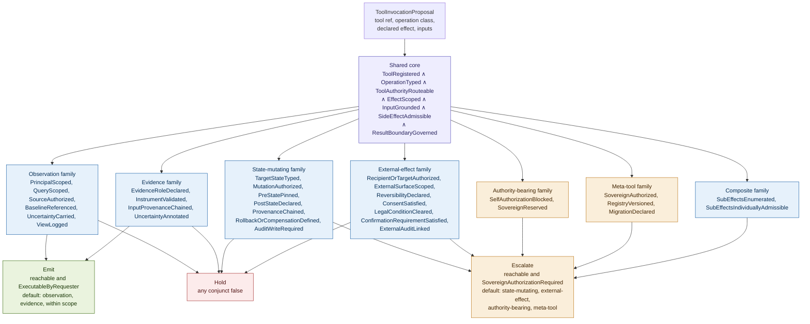
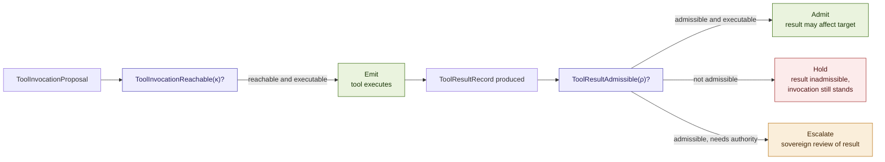
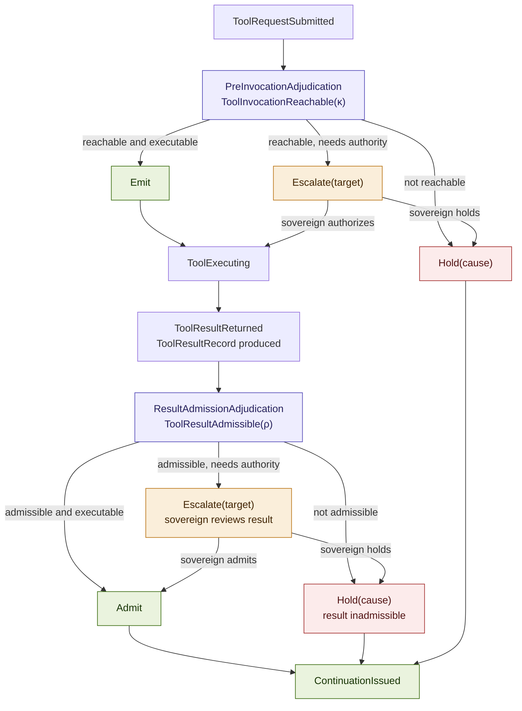
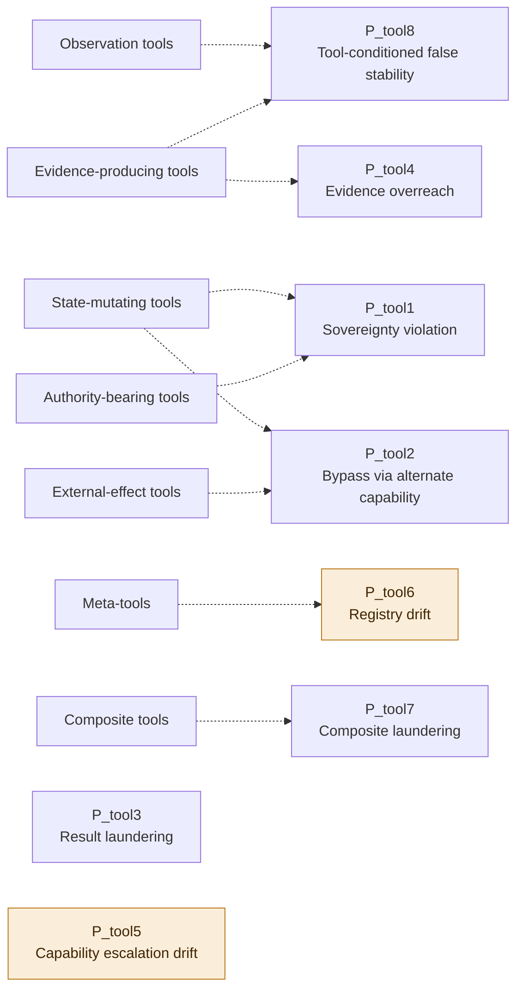

# Constitutional Tools: Capability Invocation, External Effects, and Tool-Result Admission in Governed Agentic Systems

## Why Tool Invocation Is a Constitutional Transition Surface, Not a Neutral Capability Call

### v1.1 Conceptual Architecture Paper, Companion 7 to Constitutional Runtime Computation v5.5

**Clarence "Faheem" Downs (Professor Bone Lab)**

*Licensed under CC BY 4.0.*

*No em dashes appear in this document. Commas, periods, parentheses, and restructured sentences are used throughout.*

---

# Abstract

The parent paper, Constitutional Runtime Computation v5.5, relocates terminal execution authority from the agent into the Constitutional Runtime Substrate. The agent proposes. The substrate resolves. But this migration, as specified, stops at Act. Contemporary agents do not act only through the substrate's own governed transitions; they call tools, and a tool can retrieve, generate, transform, or misframe evidence, mutate substrate or external state, shape future Observe, and produce real-world effects, all without ever passing through an Act event the parent's apparatus was built to gate. If tool invocation remains agent-owned, action authority has not actually migrated. It has only moved into the tool surface. This paper closes that sovereignty leak.

This paper's central doctrine, stated plainly and not softened: the agent does not call tools. The agent submits ToolInvocationProposals. The substrate resolves tool reachability. The substrate invokes, admits, limits, or refuses tool effects. A tool result has no constitutional force until admitted.

The contribution is sixfold. First, the Tool Sovereignty Principle, derived in the manner of the corpus's other sovereignty principles, with a reference-monitor-equivalence corollary mirroring Constitutional Memory's own. Second, a tool-operation taxonomy by constitutional effect rather than implementation: observation tools, evidence-producing tools, state-mutating tools, external-effect tools, authority-bearing tools, meta-tools, and composite tools. Third, ToolInvocationReachable(κ), the central predicate governing whether a proposed tool invocation may occur, built on a shared core and a per-class family in the pattern Constitutional Memory establishes. Fourth, ToolResultRecord and ToolResultAdmissible(ρ), separating the tool call's emission from the result's independent admission, the tool-layer analogue of the Binding and Continuation separation Constitutional Standing establishes. Fifth, the Tool Governance Boundary, a stateful object extending Constitutional Boundary Contracts' six-component pattern to a third crossing surface. Sixth, a P_tool primitive family of eight failure topologies, with Tool Bypass Through Alternate Capability cited directly against v5.4 section 6a's non-bypassability apparatus, and an explicit application of the corpus's four-part sovereign-terminal test to the strongest P_tool candidates, concluding that none currently meets it. AEGIS serves as the worked domain throughout. Nafisah remains the sovereign principal. Mantis remains the clinical reasoning agent. MEC remains the L2 monitor.

---

## Contents

**Part I** The residue: tool invocation as the unclosed sovereignty leak
**Part II** The Tool Sovereignty Principle, derived
**Part III** The tool taxonomy: seven operation classes by constitutional effect
**Part IV** ToolInvocationReachable(κ): the central predicate
**Part V** Tool-result admission: ToolResultRecord and ToolResultAdmissible(ρ)
**Part VI** The Tool Governance Boundary
**Part VII** Primitive failure topologies specific to tools (P_tool)
**Part VIII** Worked example: two tool invocations in AEGIS
**Part IX** Relationship to the companion series
**Part X** Related work
**Open problems**
**Key terms**
**Acknowledgments**

---

# Part I. The Residue: Tool Invocation as the Unclosed Sovereignty Leak

## I.1 What the parent paper relocates, and what it does not reach

The parent paper's central act is a migration of authority. The traditional Observe-Reason-Act loop terminates in the agent's sovereign Act. Constitutional Runtime Architecture reconstructs that loop into Observe-Reason-Submit-Resolve, removing Act from the agent and relocating execution authority into the substrate. The agent proposes. The substrate resolves. Every companion so far has taken this migration and asked where else it must reach: Constitutional Boundary Contracts governs the crossing itself, agent to substrate and substrate to agent. Constitutional Memory governs the store the substrate now owns. Constitutional Retrieval governs how the substrate constructs what it hands back. Constitutional Standing governs when a movement has standing to bind substrate state at all, and what happens after any verdict. Each of these closes a gap the migration implied but did not itself specify.

Tool invocation is the gap none of them close, and it is not a minor one. Contemporary agentic systems do not act by directly mutating world state through some singular Act event the substrate can gate. They call tools: a search API, a code execution sandbox, a database write, a payment endpoint, a clinical instrument scorer, a file system, another agent exposed as a callable capability. A tool can retrieve, generate, transform, or misframe evidence, mutate substrate or external state, shape what enters the next Observe, and produce effects in the world, all without ever passing through the Act event the parent's own apparatus was built to gate. If the agent may invoke these capabilities directly, unmediated by the substrate, the substrate's ownership of Act is a formality. Sovereignty has not been relocated. It has been renamed and moved one layer over, into the tool surface, where none of CTLC's apparatus currently reaches.

This is worth stating without softening, because the temptation to treat tool calls as infrastructure rather than as constitutional transitions is exactly the temptation the parent paper diagnoses in Section 1 for the ORA loop generally: governance that operates inside the sovereign space rather than defining its boundary. A tool-use wrapper that logs calls, rate-limits them, or filters their arguments against a policy is doing to tool invocation what a prompt constraint does to Act: constraining behavior inside an unrelocated sovereignty, not relocating the sovereignty itself.

## I.2 The doctrine, stated plainly

The agent does not call tools. The agent submits ToolInvocationProposals. The substrate resolves tool reachability. The substrate invokes, admits, limits, or refuses tool effects. A tool result has no constitutional force until admitted.

This doctrine has two halves that must not collapse into one. The first half concerns invocation: whether a proposed tool call may occur at all, structurally identical in shape to the parent's own Reachable(τ) question, now asked of a tool rather than of an arbitrary transition. The second half concerns the result: whether what the tool returns may affect substrate state, memory, or future Observe, a question the invocation's own reachability does not answer. A tool invocation can be authorized and its result can still be inadmissible: the tool executed correctly, within scope, and returned an output that nonetheless cannot yet be trusted to condition anything downstream. Constitutional Standing's separation of Binding from Reachability is the direct precedent for treating these as two independently governable stages rather than one. Part V of this paper supplies the tool-layer instance.

## I.3 Why this is Companion 7, modeled against Constitutional Memory

Constitutional Memory observes that the parent's migration reaches memory: writes mutate persistent state, reads shape the next Observe, and neither operation is valid without substrate adjudication. Tool invocation is memory's sibling capability surface, not a variant of it. Memory governs a store the substrate already owns outright. Tools govern a capability surface that frequently reaches outside the substrate entirely: an external API, a payment network, a filesystem, another organization's server. The governance problem is structurally the same, an agent that unilaterally exercises a consequential capability holds authority ORSR was built to remove, but the object governed is different enough, and consequential enough on its own terms, external effects, evidence fabrication, authority bootstrapping, that it earns its own companion rather than a section of an existing one. Where this paper reuses an existing predicate, authority-status vocabulary, or boundary-contract pattern, it says so explicitly and cites the companion of origin, following the corpus's own established discipline of extension over reinvention.

## I.4 What a tool actually threatens, named precisely

Four distinct constitutional threats hide inside the single word tool, and distinguishing them motivates the taxonomy in Part III before the predicate can be stated cleanly.

A tool can manufacture evidence. A retrieval tool, a web search, a database query, a document reader, returns content the agent may then cite as grounding a proposal. If the tool's output enters Grounded(τ) without independent admission, the agent has found a side channel around the Retrieval Lineage Graph's own agent-cannot-write-provenance invariant (parent Section 6): the agent did not fabricate the evidence itself, but it selected which tool to call and how to frame the query, and an ungoverned tool output is functionally indistinguishable from agent-authored evidence once it enters the reasoning trace.

A tool can mutate state directly. A tool that writes to a database, sends a message, modifies a file, or calls another system's API is not observing or reasoning. It is acting, in exactly the sense the parent paper removes from the agent's terminal authority. A state-mutating tool invoked without substrate mediation is Act by another name.

A tool can condition future Observe. A tool that writes to a cache, updates a search index, or otherwise shapes what a later retrieval will surface has produced an effect that is invisible at the moment of the call and only becomes visible in a future cycle's Observe, exactly the delayed-effect problem the parent's Section 13 names for salience drift, now with a tool as the mechanism rather than gradual recalibration.

A tool can produce effects in the world that no subsequent adjudication can undo. A payment, a filed report, a sent communication, a physical action taken through a robotic or IoT interface, is irreversible or reversible only at real cost. This is the external-effect class Part III names, and it is the highest-risk ordinary class in the taxonomy precisely because CTLC's own Hold and Escalate machinery, built to prevent an effect before it occurs, is the only machinery capable of protecting against it. Once emitted, an external effect is outside the substrate's power to revoke.

These four threats recur throughout the paper as the reasons each conjunct in Parts IV and V exists. None of them is hypothetical or specific to AEGIS. They are properties of tool invocation as a category, present in any agentic system that gives an agent a function-calling or tool-use interface, whatever the domain.

---

# Part II. The Tool Sovereignty Principle, Derived

Consistent with the corpus's discipline of deriving each sovereignty principle rather than asserting it (Baseline Sovereignty, Generation Coherence, Trigger Authority, Constitutional Standing, and the Memory Sovereignty Principle this paper is modeled against most directly), the Tool Sovereignty Principle is stated here as the conclusion of a short argument, not as a premise.

1. A tool is a capability, not a neutral function. Invoking a tool is not merely computing a value. Depending on its class (Part III), invocation can mutate external state, retrieve or admit evidence, change substrate state, or condition a future Observe event.

2. Any component that unilaterally invokes such a capability holds causal authority over the set of future reachable transitions. This is the same causal-authority argument the Memory Sovereignty Principle makes for memory operations, restated for tools: what a tool call produces conditions what the substrate can adjudicate next, exactly as what memory retains conditions what a future cycle retrieves.

3. Under ORSR, no agent may hold unilateral authority over a consequential capability surface. This is the parent paper's own migration, restated at its most general: execution authority belongs to the substrate, not to whichever component happens to sit closest to the effect.

4. A tool surface is a consequential capability surface whenever its invocation falls into any of the four threats named in Part I.4: evidence manufacture, state mutation, Observe conditioning, or external effect production.

5. Therefore tool invocation must reside in the substrate, or be completely mediated by it.

**The Tool Sovereignty Principle.** Any component that unilaterally invokes a capability capable of mutating external state, retrieving or admitting evidence, changing substrate state, or conditioning future Observe holds causal authority over future reachable transitions. Under ORSR, no agent may hold unilateral authority over a consequential capability surface. Therefore tool invocation must reside in the substrate, or be completely mediated by it.

**Corollary (reference-monitor equivalence).** Complete mediation of tool use is substrate ownership, whatever a tool gateway's physical location. This corollary mirrors the Memory Sovereignty Principle's own reference-monitor-equivalence corollary exactly, and for the same reason: it forecloses the apparent alternative of an externally hosted tool gateway that is "not the substrate." If the gateway completely mediates every invocation, adjudicating reachability before the call and admissibility after the result, it is the substrate by function, regardless of whether it runs inside the same process as CTLC, on a separate host, or behind an MCP server boundary. If it does not completely mediate, it leaves a surface over which some component, typically the agent itself, or an unmediated tool-use library, holds unilateral authority, which the Principle prohibits. This is the precise answer to a question that recurs whenever tool use is implemented through a separate service: locating the gateway outside the main substrate process does not exempt it from the Principle. Mediation, not location, is the constitutional property.

**Corollary (a tool result is not evidence merely because a tool produced it).** This corollary anticipates Part V and states plainly what the taxonomy in Part III will make precise: a tool's output becomes evidence, or becomes an authorized state mutation, or becomes admissible into a future Observe, only once the substrate has admitted it under ToolResultAdmissible(ρ). A tool producing an output is not the same constitutional event as that output acquiring constitutional force, exactly as a favorable CTLC verdict is not the same event as a BindingRecord (Constitutional Standing, Part IV). The Tool Sovereignty Principle governs whether a call may happen. This corollary governs whether what came back may matter.


---

# Part III. The Tool Taxonomy: Seven Operation Classes by Constitutional Effect

Consistent with Constitutional Memory's own taxonomic method, a tool's class is defined by what it changes, not by its name, its implementation, or the vendor that built it. A tool's registered name may be uninformative or actively misleading about its constitutional effect; the taxonomy classifies invocations by declared and observed effect, not by label.

| Operation class | What it changes | Constitutional analogue |
|---|---|---|
| Observation tools | what may enter Observe | Memory's observation-shaping family |
| Evidence-producing tools | what may count as evidence, and of what kind | Grounded(τ), extended to a new provenance source |
| State-mutating tools | substrate or external persistent state | Act, and Memory's store-mutating family |
| External-effect tools | the world outside the substrate, often irreversibly | no direct parent-paper analogue; the highest-risk ordinary class |
| Authority-bearing tools | the authority context itself | Standing's StandingContext, at risk of self-bootstrapping |
| Meta-tools | the tool registry and capability surface | Memory's schema-changing family |
| Composite tools | multiple governed transitions through one call | no direct analogue; a laundering risk unique to tools |

## III.1 Observation tools

An observation tool retrieves content that the substrate may, subject to admission, surface into a future Observe event: a search, a document fetch, a database read exposed as a tool rather than as a native memory operation. Observation tools do not, by themselves, produce evidence for a proposal or mutate state. Their constitutional risk is exactly Constitutional Memory's observation-shaping risk, restated for an external source rather than the substrate's own store: the tool can narrow, bias, or stale what it returns without any individual call appearing anomalous. An observation tool's admissibility family therefore mirrors ViewAdmissible: the result must be principal-scoped, referenced against a baseline where one exists, carry its uncertainty rather than presenting a confident summary of an uncertain source, and be logged at issuance.

## III.2 Evidence-producing tools

An evidence-producing tool returns content the agent proposes to cite as grounding a transition: a clinical instrument scorer, a calculation, a classifier, a fact-lookup service. The corollary in Part II states the governing rule precisely: a tool output is not automatically evidence. It becomes evidence only after admission. This is the sharpest distinction this taxonomy draws relative to how most agentic systems currently treat tool results, where a returned value is folded directly into the agent's context and, from that point forward, is indistinguishable from evidence the agent obtained through any other channel. Under this taxonomy, an evidence-producing tool's result carries a declared evidentiary role, what kind of evidence it purports to be and what conclusion it can license, and Part VII names Evidence Instrument Overreach as the primitive failure when that declared role is exceeded.

## III.3 State-mutating tools

A tool that writes to a database, updates substrate state, modifies a file the substrate treats as authoritative, or otherwise directly changes persistent state is not a tool in any sense distinguishable from Act. A state-mutating tool invoked without full CTLC-equivalent adjudication is Act by another name, and this taxonomy treats it exactly that way: state-mutating tool invocation is governed by the same family Constitutional Memory specifies for store-mutating memory operations, ProvenanceChained, UncertaintyGoverned, TierAdmissible, restated over whatever store or state surface the tool mutates. A state-mutating tool must never be agent-invoked directly. This is not a special rule for tools. It is the parent paper's own rule, restated for a capability surface that happens to be packaged as a tool rather than as a native Act event.

## III.4 External-effect tools

An external-effect tool produces consequences outside the substrate's own state: a payment, a sent message, a filed report, a physical actuation, an API call against a third party's system. This is the highest-risk ordinary class in the taxonomy, ordinary meaning it is not itself the sovereign-terminal or authority-bootstrapping case the next two classes raise, because its risk is concentrated in three conditions that recur across domains: irreversibility (can the effect be undone at all, and at what cost), human consent (does the effect require, and did it receive, informed agreement from an affected party), and legal or policy conditions (does the effect trigger a mandated review, a regulatory obligation, or a professional duty, as a mandated-reporting workflow does in AEGIS). An external-effect tool's admissibility family requires each of these three conditions to be evaluated explicitly rather than folded into a generic admissibility check, because a tool that is reversible and consent-clear may still trigger a legal condition, and a tool that clears all legal conditions may still be irreversible in a way that warrants elevated review regardless.

## III.5 Authority-bearing tools

An authority-bearing tool is one whose invocation can itself create or modify the authority context that would justify the tool's own proposal: a tool that grants a role, issues a credential, approves a request, or otherwise mutates the authority graph Companion 6's StandingContext depends on. This class carries a doctrine this paper states without qualification: no tool may let the agent create the authority that justifies its own proposal. Self-authorization through an intermediate tool call is the tool-layer instance of a failure the corpus has not previously had to name explicitly, because the parent's own Reachable(τ) assumes the authority context A is given, not agent-manufacturable. A tool that can mutate A is a tool that can manufacture its own Authorized(τ), which collapses the authority conjunct into something the agent controls. Authority-bearing tools are therefore never ExecutableByRequester in the sense Constitutional Memory and Constitutional Standing define; they are, by construction, SovereignAuthorizationRequired, and the self-authorization-blocking doctrine is enforced at ToolAuthorityRouteable (Part IV) rather than left to domain-specific review.

## III.6 Meta-tools

A meta-tool changes the tool registry or the capability surface itself: registering a new tool, deregistering one, changing a tool's declared capability contract, or exposing a set of capabilities through a protocol surface such as an MCP server. Meta-tools are treated exactly as Constitutional Memory treats schema-changing operations: not as ordinary transitions within a fixed constitution, but as substrate reconstitution events. A meta-tool operation is admissible only under sovereign authorization, must produce a new tool-registry version, declare a migration effect on invocations already in flight against the prior registry state, define a compatibility rule for tools registered under the prior version, install an L2 watch condition for post-change drift, and be audited distinctly from ordinary tool invocations, exactly as Constitutional Memory requires for schema-changing memory operations.

The placement of MCP-server capability exposure within this class is one of this draft's editorial decisions, named explicitly here because the FORTHCOMING stub leaves it open. An MCP server that exposes a set of tools does not itself grant reachability to any of them. Exposure is a meta-tool event, a candidate registration, not a completed one. A tool becomes reachable only once it clears the same meta-tool reconstitution discipline every other registry change clears: sovereign authorization, a registered ToolCapabilityContract (Part VI), a declared operation class and effect scope, and an entry in the versioned registry ToolInvocationReachable's ToolRegistered conjunct (Part IV) checks against. An MCP server is, from the substrate's perspective, a candidate supplier of meta-tool proposals, structurally identical to any other source proposing a registry change, never a direct grant of reachability. This placement is revisited as Open Problem 3 below, where the harder residue, what independent verification a registered MCP-sourced tool's declared contract deserves beyond the registration event itself, is named honestly as unresolved.

## III.7 Composite tools

A composite tool is a multi-step workflow, an agent-as-tool chain, or any capability that internally performs more than one constitutionally distinct operation behind a single apparent call. The risk this class names is laundering: a composite tool that internally performs a state mutation and an external effect and an authority check, exposed to the calling agent as one simple function, can cause multiple governed transitions to occur under the cover of one adjudicated invocation. ToolInvocationReachable, evaluated once at the composite's outer boundary, cannot see the internal steps unless the composite's own declared effect scope enumerates them. A composite tool's admissibility family therefore requires EffectScoped (Part IV) to enumerate every constitutionally distinct sub-effect the composite performs, not merely its outermost declared purpose, and Part VII names Composite Tool Laundering as the primitive failure when a composite's internal steps exceed its declared scope.

First-pass review flags composite tools as likely more central in practice than this draft's treatment suggests, and as a caution worth naming directly rather than only through the laundering primitive: composite tools and agent-as-tool chains are plausibly where a large share of real-world leakage will occur, because they are exactly where the incentive to package multiple steps behind one convenient call is strongest. This paper does not elevate composite tool decomposition to a top-three Open Problem, since the choice of three was itself deliberate (Open Problems below), but names it here as future work the corpus should expect to return to: a full compositional calculus, capable of decomposing an arbitrary tool chain into its constitutionally distinct sub-effects rather than relying on each composite's own self-declared SubEffectsEnumerated, remains unspecified, and Composite Tool Laundering (P_tool7) is likely to grow in practical importance as composite and agentic tool chains become more common than single-purpose tools.

## III.8 Specification status

This taxonomy is fully specified, in the sense Constitutional Memory uses the term, for observation tools, evidence-producing tools, state-mutating tools, and external-effect tools: each has a concrete admissibility family stated above and expanded formally in Part IV. Authority-bearing tools and meta-tools are specified at the level of their constitutional doctrine and reconstitution requirement, matching the depth Constitutional Memory gives its own schema-changing and aggregate-governance classes, with their full conjunct structure left as future refinement. Composite tools are specified at the level of the laundering risk and the EffectScoped requirement that addresses it. A full compositional calculus for nested tool chains is not attempted here. It remains future work, named in Part III.7 and P_tool7, though not elevated to a top-level open problem in this version. This asymmetry is stated plainly so the corpus does not treat the less-specified classes as complete.


---

# Part IV. ToolInvocationReachable(κ): The Central Predicate

## IV.1 The general object

A **ToolInvocationProposal** is the typed object an agent submits when it wishes a tool to be invoked. It extends the parent's TransitionProposal, and it is subject to the same Formation, Standing, Reachability, Binding, and Continuation pipeline Constitutional Standing establishes for every transition proposal (Part IX develops this explicitly). It carries: the requesting agent's standing context, the tool identifier and its registered ToolCapabilityContract reference, the operation class (Part III) and the typed object within that class, the declared input parameters and their provenance references, the declared effect scope, the uncertainty state, and an explicit acknowledgment, structurally identical to Companion 0's authority_boundary_acknowledgment, that the agent is proposing an invocation, not performing one.

A tool invocation is constitutionally reachable if and only if the shared core holds and the operation-class family holds.

```
ToolInvocationReachable(κ) ⟺
  ToolRegistered(κ)            ∧
  OperationTyped(κ)            ∧
  ToolAuthorityRouteable(κ)    ∧
  EffectScoped(κ)              ∧
  InputGrounded(κ)             ∧
  SideEffectAdmissible(κ)      ∧
  ResultBoundaryGoverned(κ)    ∧
  ClassFamily(κ)
```

## IV.2 The shared core, defined

**ToolRegistered(κ):** the invoked tool resolves to a known, currently active entry in the tool registry, carrying a registered ToolCapabilityContract (Part VI). An unregistered tool, or a tool whose registry entry has been revoked or has expired, fails this conjunct before any other check proceeds. This is the tool-layer analogue of Constitutional Memory's OperationTyped applied to the tool itself rather than to the operation, and it is what makes the meta-tool reconstitution discipline (Part III) load-bearing: a tool cannot be reachable merely because it exists and responds to a call. It must be a registered constitutional object.

**OperationTyped(κ):** the invocation resolves to one of the seven governed operation classes (Part III) and a typed object within that class. An invocation whose class cannot be determined, or whose declared object is untyped, a raw function call with no declared class or effect vocabulary, is a predicate failure. This mirrors Constitutional Memory's OperationTyped exactly, restated over tool invocations rather than memory operations.

**ToolAuthorityRouteable(κ):** a valid authority path exists by which this invocation could be authorized, reusing Constitutional Memory's AuthorityRouteable and Companion 0's CapabilityAuthorized(p) pattern directly rather than inventing new authority vocabulary. This conjunct is named ToolAuthorityRouteable rather than CapabilityAuthorized specifically to avoid the ambiguity first-pass review correctly flagged: the word authorized reads as possession, not routeability, which risks reintroducing exactly the conflation Constitutional Memory and Constitutional Standing worked to separate through their own four authority statuses. As in both prior companions, this conjunct asks only whether an authority path exists, not whether the requesting agent possesses it; that question is answered by the verdict composition below, through the same four authority statuses Constitutional Memory establishes (ProposalWellFormed, AuthorityRouteable, ExecutableByRequester, SovereignAuthorizationRequired), imported here without modification. For authority-bearing tools specifically, this conjunct additionally enforces the self-authorization-blocking doctrine named in Part III: an authority-bearing tool invocation cannot satisfy ToolAuthorityRouteable on the strength of an authority context the invocation itself would produce.

**EffectScoped(κ):** the invocation's declared effect on external state, evidence, substrate state, or future Observe is bounded and matches its operation class, reusing Constitutional Memory's EffectScoped and its defined effect vocabulary directly, extended here with tool-specific effect types: external state mutation, evidence production, observation construction, authority-context mutation, registry mutation, and composite sub-effect enumeration. A tool that declares one effect type and produces another fails this conjunct exactly as Constitutional Memory's write-that-silently-re-ranks example fails it. For composite tools, EffectScoped is the conjunct doing the heaviest work, since it must enumerate every constitutionally distinct sub-effect the composite performs, not only its outermost declared purpose.

**InputGrounded(κ):** the invocation's input parameters trace to provenance the requesting agent is authorized to reference, the tool-layer analogue of the parent's Grounded(τ) and Constitutional Memory's ProvenanceChained. A tool invoked with fabricated, out-of-scope, or unprovenanced input parameters is not grounded merely because the tool itself is registered and typed correctly; the inputs feeding it must themselves be admissible references, not agent-invented content dressed as a parameter.

**SideEffectAdmissible(κ):** the domain's admissibility conditions for this invocation's declared side effects hold, the tool-layer analogue of the parent's Admissible(τ). For external-effect tools this conjunct is refined by ExternalEffectToolAdmissible in full (Part IV.3): RecipientOrTargetAuthorized, ExternalSurfaceScoped, ReversibilityDeclared, ConsentSatisfied, LegalConditionCleared, ConfirmationRequirementSatisfied, and ExternalAuditLinked, not merely reversibility, consent, and legal or policy triggers in isolation. For authority-bearing tools it evaluates whether the authority mutation the tool would perform is itself a sovereign-reserved act. As with Admissible(τ) generally, this conjunct is not mechanically decidable in every domain; where it cannot be conclusively evaluated, the invocation routes to escalation rather than emit, exactly as the parent's own note on decidability requires.

**ResultBoundaryGoverned(κ):** the invocation declares, as part of its own proposal, that its result will be routed through the Tool Governance Boundary (Part VI) for independent admission rather than treated as automatically trusted output. This conjunct is what connects invocation reachability to result admission without collapsing the two: an invocation cannot satisfy ToolInvocationReachable while simultaneously declaring that its result bypasses admission. This is the formal expression of Part I's second doctrinal half, stated as a gating condition on the first.

## IV.3 The operation-class family, ClassFamily(κ)

Consistent with Constitutional Memory's own specification-status discipline, the four fully specified classes named in Part III receive full conjunct families here. The remaining three are scaffolded at the level their constitutional doctrine currently supports.

**Observation-tool family:**
```
ObservationToolAdmissible(κ) ⟺
  PrincipalScoped(κ)      ∧
  QueryScoped(κ)          ∧
  SourceAuthorized(κ)     ∧
  BaselineReferenced(κ)   ∧
  UncertaintyCarried(κ)   ∧
  ViewLogged(κ)
```
Imported from Constitutional Memory's observation-shaping family and expanded on first-pass review, restated over an external retrieval source rather than the substrate's own store. The original three conjuncts, PrincipalScoped, BaselineReferenced, and UncertaintyCarried, matched the doctrine's principal-scoping and uncertainty-preservation requirements but left two things the prose already demanded unstated as conjuncts. QueryScoped(κ) requires the query or request parameters passed to the tool to be within the scope authorized for this task and cycle, precisely as Constitutional Memory's own EvidenceScopeValid requires for evidence references; without it, a registered observation tool could still be pointed at a task-misaligned search, valid tool, wrong use. SourceAuthorized(κ) requires the specific external source the tool queries, a named index, a named database, a named endpoint, to be one the current task state authorizes reaching, since a tool's registration does not by itself authorize every source it is capable of reaching. ViewLogged(κ) is imported directly from Constitutional Memory's own conjunct of the same name: the view issuance is recorded with the requesting principal, the scope, and the content reference, which is what makes Retrieval Bypass (P_mem2's own tool-layer analogue) detectable at all. Without ViewLogged, an observation tool's output could enter Observe with no issuance record to reconstruct it from.

**Evidence-producing-tool family:**
```
EvidenceToolAdmissible(κ) ⟺
  EvidenceRoleDeclared(κ)     ∧
  InstrumentValidated(κ)      ∧
  InputProvenanceChained(κ)   ∧
  UncertaintyAnnotated(κ)
```
EvidenceRoleDeclared(κ) requires the invocation to name, in advance of the call, what kind of evidence the result would constitute and what conclusion it can license, the conjunct Evidence Instrument Overreach (Part VII) is checked against. InstrumentValidated(κ) requires the tool itself to be a recognized instrument within the domain, not merely a registered capability, a distinction that matters clinically: a registered scoring function and a clinically validated instrument are not the same claim. InputProvenanceChained(κ) is added on first-pass review: the shared core's InputGrounded(κ) already requires inputs to trace to authorized provenance, but evidence-producing tools carry special evidentiary risk, since their output is destined to become evidence rather than merely to inform a mutation or an external effect, and the review is correct that this warrants making provenance explicit inside the family itself rather than relying solely on the shared core to carry the weight. UncertaintyAnnotated(κ) is imported from the result-admission predicate (Part V) as a pre-condition on the invocation side: an evidence-producing tool must declare, before the call, how the result's own uncertainty will be represented, not leave that representation to be decided after the fact.

**State-mutating-tool family:**
```
StateMutatingToolAdmissible(κ) ⟺
  TargetStateTyped(κ)                 ∧
  MutationAuthorized(κ)               ∧
  PreStatePinned(κ)                   ∧
  PostStateDeclared(κ)                ∧
  ProvenanceChained(κ)                ∧
  RollbackOrCompensationDefined(κ)    ∧
  AuditWriteRequired(κ)
```
First-pass review correctly identifies that the v0.1 family was too memory-shaped: ProvenanceChained, UncertaintyGoverned, and TargetAdmissible were imported wholesale from Constitutional Memory's store-mutating family, which governs writes to a store the substrate already owns outright. A state-mutating tool is broader than a memory write; it can mutate a task ledger, create a ticket, update an external database, or write a file the substrate treats as authoritative, and each of these needs state-transition controls a memory-shaped family does not by itself supply.

**TargetStateTyped(κ):** the state surface the tool mutates, a memory tier, a task ledger, an external database, a file, resolves to a governed, typed target rather than an opaque write destination.

**MutationAuthorized(κ):** a valid authority path exists for this specific mutation type against this specific target, the tool-layer instance of TierAdmissible generalized beyond memory tiers. Where the mutation carries epistemic content, a clinical finding, a risk classification, a synthesized conclusion, MutationAuthorized additionally requires the transformation of uncertainty across the mutation to be governed rather than collapsed, in the sense Constitutional Memory's UncertaintyGoverned already establishes; where the mutation is purely operational, a ticket status change, a scheduling update, no epistemic content exists for uncertainty governance to apply to, and the conjunct does not impose it. This is deliberately narrower than making UncertaintyGoverned a universal second conjunct, which the review correctly notes would misfit purely operational mutations.

**PreStatePinned(κ):** the state of the target immediately before the proposed mutation is pinned and referenced, so that the mutation's effect can be reconstructed against a known prior state rather than an assumed one.

**PostStateDeclared(κ):** the invocation declares, in advance, what the target state will be after the mutation, so that ObservedEffectsMatched (Part V) has a declared post-state to check the actual result against.

**ProvenanceChained(κ):** imported directly from Constitutional Memory, unchanged: the proposed content traces to an admissible provenance source.

**RollbackOrCompensationDefined(κ):** the mutation declares, in advance, what rollback or compensating action would be available should the mutation later need to be reversed or corrected, or explicitly declares itself irreversible at the state-mutation layer, feeding the same reversibility discipline Part III.4 requires of external-effect tools.

**AuditWriteRequired(κ):** the mutation itself, distinct from its result, produces its own audit entry before it is considered authorized, closing the gap between a mutation being adjudicated and a mutation being recorded.

**External-effect-tool family:**
```
ExternalEffectToolAdmissible(κ) ⟺
  RecipientOrTargetAuthorized(κ)          ∧
  ExternalSurfaceScoped(κ)                ∧
  ReversibilityDeclared(κ)                ∧
  ConsentSatisfied(κ)                     ∧
  LegalConditionCleared(κ)                ∧
  ConfirmationRequirementSatisfied(κ)     ∧
  ExternalAuditLinked(κ)
```
The original three conditions, reversibility, consent, and legal or policy triggers, remain, but first-pass review correctly identifies that they do not by themselves establish that the effect is aimed correctly. Consent and legal clearance answer whether an effect may occur. They do not answer whether it is occurring against the right recipient or target. A legally permitted message sent to the wrong person is still a constitutional failure. A payment authorized in principle but sent to the wrong account is still a failure, and neither ConsentSatisfied nor LegalConditionCleared, evaluated alone, would catch it.

**RecipientOrTargetAuthorized(κ):** the specific recipient, account, endpoint, or target of the external effect is verified against what this task and this proposal actually authorize, not merely a plausible-looking value passed as a parameter.

**ExternalSurfaceScoped(κ):** the external system or surface the effect reaches is within the tool's registered capability_scope; an external-effect tool authorized to reach one system does not thereby gain reach into an adjacent one it happens to be technically capable of addressing.

**ReversibilityDeclared(κ):** unchanged from Part III, the invocation declares whether and how the effect could be undone.

**ConsentSatisfied(κ):** unchanged from Part III, informed agreement from an affected party is evaluated where the domain requires it.

**LegalConditionCleared(κ):** unchanged from Part III, mandated review, regulatory, or professional-duty conditions are discharged.

**ConfirmationRequirementSatisfied(κ):** where the domain constitution requires an explicit confirmation step before an external effect proceeds, distinct from the standing-class authorization that governs whether the invocation is executable at all, that confirmation has been obtained and is itself traceable.

**ExternalAuditLinked(κ):** the invocation is linked, in advance, to the specific audit record the effect will produce once executed, so that ObservedEffectsMatched (Part V) and the Tool Governance Boundary's own audit trail (Part VI) can reconcile the declared effect against the confirmed one without a gap.

**Authority-bearing-tool family (scaffolded):**
```
AuthorityToolAdmissible(κ) ⟺ SelfAuthorizationBlocked(κ) ∧ SovereignReserved(κ)
```
SelfAuthorizationBlocked(κ) is the formal name for the doctrine stated in Part III: the invocation's authority claim must not depend on the authority mutation the invocation itself would produce. Its full decision procedure, how to detect an indirect self-authorization loop routed through an intermediate tool or a chain of authority-bearing calls, is named as future work rather than specified here.

**Meta-tool family (scaffolded):**
```
MetaToolAdmissible(κ) ⟺ SovereignAuthorized(κ) ∧ RegistryVersioned(κ) ∧ MigrationDeclared(κ)
```
Mirroring Constitutional Memory's schema-changing requirement exactly: sovereign authorization, a new registry version, and a declared migration effect on tools registered under the prior version.

**Composite-tool family (scaffolded):**
```
CompositeToolAdmissible(κ) ⟺ SubEffectsEnumerated(κ) ∧ SubEffectsIndividuallyAdmissible(κ)
```
SubEffectsEnumerated(κ) requires the composite's declared effect scope to name every constitutionally distinct sub-effect it performs. SubEffectsIndividuallyAdmissible(κ) requires each enumerated sub-effect to independently satisfy the admissibility family its own class would require were it invoked directly, closing the laundering path Part III names: a composite cannot achieve through packaging what a direct invocation could not achieve on its own.

## IV.4 Verdict composition

The verdict composes reachability with executability at the requesting standing class, reusing the four authority statuses Constitutional Memory establishes without modification.

| Predicate state | Executability | Verdict |
|---|---|---|
| ToolInvocationReachable | ExecutableByRequester (directly or via pre-authorized delegated class) | **Emit** |
| ToolInvocationReachable | not executable by requester; ToolAuthorityRouteable to a named higher authority | **Escalate(target)** |
| Not ToolInvocationReachable (any conjunct false) | any | **Hold(cause)** |

State-mutating tools, external-effect tools with an undischarged legal condition, and authority-bearing tools are, by default, ToolInvocationReachable and ToolAuthorityRouteable to a named sovereign authority, but not ExecutableByRequester at ordinary agent standing, exactly as Constitutional Memory treats long-term clinical writes. Observation tools and evidence-producing tools within their declared scope are, by default, ExecutableByRequester, since their effect is bounded to shaping evidence or Observe rather than mutating state or the world. This default allocation is doctrine, not a fixed rule; a domain constitution may raise or lower any tool's default executability, exactly as AEGIS's own domain constitution sets the mandated-reporting threshold for external-effect transitions generally (parent Section 8.2).

**Figure 1. ToolInvocationReachable(κ) across the seven operation classes**



## IV.5 Note on decidability

ToolRegistered, OperationTyped, InputGrounded (as to reference validity), and ResultBoundaryGoverned are mechanically decidable: each reduces to a check against a pinned registry entry, a typed schema, a provenance reference, or a declared boundary-routing flag. ToolAuthorityRouteable and EffectScoped are decidable in the same structural sense Constitutional Memory's corresponding conjuncts are, modulo the domain correctly encoding its authority graph and effect vocabulary. SideEffectAdmissible is not mechanically decidable in general, for the same reason the parent's Admissible(τ) is not: reversibility, consent, and legal-condition evaluation frequently require domain-specific judgment that resists algorithmic evaluation. Where SideEffectAdmissible cannot be conclusively evaluated, the invocation routes to escalation, never to emit by default. The decidable conjuncts narrow the space. SideEffectAdmissible names the boundary at which sovereignty over the capability surface becomes necessary.


---

# Part V. Tool-Result Admission: ToolResultRecord and ToolResultAdmissible(ρ)

## V.1 Emission and admission are two independent constitutional events

A tool invocation being Emit does not mean its result may affect anything. This is the tool-layer instance of the separation Constitutional Standing establishes between Binding and the verdict that precedes it: a favorable CTLC verdict is not yet the same thing as substrate state having moved, and BindingFormed(β) names the further conditions required before it does. Here, an emitted tool invocation is not yet the same thing as its result mattering. The tool call is one constitutional event. The result becoming usable is a second, independent one. A tool invocation can Emit while its result independently Holds.

## V.2 ToolResultRecord

A **ToolResultRecord** is the typed object a completed tool invocation produces, whatever its outcome, carrying: `tool_result_id`, `tool_invocation_ref` (the ToolInvocationProposal this result answers), `tool_ref` and `tool_version` (which registered tool and which version of it executed), `input_ref` (the grounded inputs actually used), `output_ref` and `output_type` (the typed result and its declared type), `execution_time`, `side_effects_observed` (what the tool reports having done, distinct from what it was authorized to do), `error_state`, `confidence_or_uncertainty` (the tool's own reported uncertainty, where applicable, distinct from the substrate's later admission judgment), `provenance_ref` (how this result's own origin is traceable), `admission_status` (`PENDING | ADMITTED | HELD | ESCALATED`), `admission_target` (which future substrate surface, memory, evidence, Observe, external state, the result is proposed to affect), and `audit_ref`.

## V.3 ToolResultAdmissible(ρ)

```
ToolResultAdmissible(ρ) ⟺
  InvocationAuthorized(ρ)      ∧
  OutputTyped(ρ)               ∧
  OutputWithinDeclaredScope(ρ) ∧
  ObservedEffectsMatched(ρ)    ∧
  SourceIntegrityVerified(ρ)   ∧
  UncertaintyAnnotated(ρ)      ∧
  AdmissionTargetPermitted(ρ)  ∧
  DownstreamEffectDeclared(ρ)
```

**InvocationAuthorized(ρ):** the ToolResultRecord's tool_invocation_ref traces to a ToolInvocationProposal that itself received Emit under ToolInvocationReachable. A result whose invocation was never authorized, or whose invocation record cannot be located, cannot be admitted regardless of the result's own content. This is the tool-layer analogue of Constitutional Standing's own requirement that binding presuppose Formation, Standing, and Reachability all having held first. InvocationAuthorized is result-stage terminology: it means the originating invocation received Emit, not that the requester now possesses some further executable standing over the result. It does not reintroduce requester executability into result admission, which is governed separately by the verdict composition in Part V.4.

**OutputTyped(ρ):** the output resolves to a governed type matching output_type and the operation class's declared effect vocabulary. An untyped or ambiguously typed output cannot be admitted, because AdmissionTargetPermitted below cannot be evaluated against an object whose type is unclear.

**OutputWithinDeclaredScope(ρ):** the output does not exceed the effect scope the invocation declared under EffectScoped. A search tool that was scoped to retrieve and instead executed a write it was not authorized to perform fails here even if the write itself would otherwise have been admissible on its own terms; the failure is that this invocation did not declare it.

**ObservedEffectsMatched(ρ):** added on first-pass review, closing a gap the v0.1 predicate left open: side_effects_observed, the ToolResultRecord's own account of what the tool reports having done, does not exceed the side effects declared and authorized in the originating ToolInvocationProposal under EffectScoped. This conjunct is distinct from OutputWithinDeclaredScope, which checks the output's type and content against declared scope; ObservedEffectsMatched checks the tool's reported side effects against the same declaration. A tool can return an acceptable, correctly typed, in-scope output while having performed an undeclared side effect along the way, a state-mutating tool that also silently touched a cache, an external-effect tool that also wrote a log entry to a system it was not authorized to reach, and OutputWithinDeclaredScope alone would not catch it, since the output itself looked correct. ObservedEffectsMatched is what makes an undeclared side effect a result-admission failure rather than a fact that only surfaces during a later audit.

**SourceIntegrityVerified(ρ):** the result's provenance is verifiable against the tool's own declared identity and version, guarding against a registered tool being silently substituted, proxied, or tampered with between registration and execution. This conjunct is where tool attestation, in the sense Constitutional Boundary Contracts' own Open Problems anticipate for tool-output boundaries specifically, does its work.

**UncertaintyAnnotated(ρ):** the result carries the tool's own reported uncertainty or confidence, where the tool's operation class makes this meaningful, rather than being admitted as unqualified fact. This is the read-side analogue of Constitutional Memory's UncertaintyCarried, restated for a tool result rather than a memory view: an ambiguous instrument score admitted as a settled finding is exactly the collapse Constitutional Memory's UncertaintyGoverned forbids at the write boundary, now occurring at the tool-result boundary instead.

**AdmissionTargetPermitted(ρ):** the admission_target this result proposes, a memory write, an evidence citation, an Observe component, an external effect, is one this result's operation class and declared evidentiary role (EvidenceRoleDeclared, Part IV) actually permit. A PHQ-9 score's admission_target may be evidence-supporting-a-risk-classification. It may not be diagnosis-standing-alone. Evidence Instrument Overreach (Part VII) is the primitive failure when this conjunct is evaluated too permissively.

**DownstreamEffectDeclared(ρ):** any further effect this admission would trigger, a subsequent memory promotion, a triggered escalation, a chained tool call, is declared as part of the admission decision rather than left implicit. This conjunct is what makes Tool Result Laundering (Part VII) detectable rather than merely described: laundering is precisely a downstream effect that was never declared at admission time.

## V.4 Verdict composition for admission

| Predicate state | Admission target executability | Verdict |
|---|---|---|
| ToolResultAdmissible | admission target executable at requesting standing class | **Admit** |
| ToolResultAdmissible | not executable at requesting class; routeable to higher authority | **Escalate(target)** |
| Not ToolResultAdmissible (any conjunct false) | any | **Hold(cause)** |

Admit, Escalate, and Hold at the result-admission stage are structurally identical in form to Emit, Escalate, and Hold at CTLC's own verdict stage, and this is intentional: admission is itself an adjudication, governed by the same discipline as any other transition, not a lighter-weight formality that follows automatically once invocation cleared.

**Figure 2. Emission and admission as independent constitutional events**



*A tool invocation Emitting says only that the call was authorized to occur. Whether its result may affect memory, evidence, Observe, or external state is a second, independent adjudication. The invocation's Emit is not undone by the result's Hold; the invocation stood on its own terms, and it is the result, not the call, that failed the second gate.*

## V.5 Result laundering, named precisely

An inadmissible tool output becoming causally active indirectly, through summarization, a memory write, an evidence packet, or later agent reasoning that treats the un-admitted content as though it had been admitted, is result laundering. It is named here as a P_tool primitive (Part VII) rather than left as a description, because DownstreamEffectDeclared gives it a concrete detection surface: a downstream effect with no corresponding admission decision naming it is a laundering signature, structurally identical to Constitutional Boundary Contracts' own bypass detection, an effect with no corresponding audit record.


---

# Part VI. The Tool Governance Boundary

## VI.1 A third instance of the boundary-contract pattern

Constitutional Boundary Contracts establishes a general six-component pattern, schema, validation predicate, typed violation taxonomy mapped to severity classes, a constitutionally separated validator, a tamper-evident audit record, and an escalation rule, and names, in its own Open Problems, tool-output boundaries explicitly as a future crossing surface the pattern should extend to, while cautioning that future instances need not reuse the exact BoundaryValidationFunction implementation, since tool-output boundaries may need tool attestation and source trust checks rather than affordance-set validation.

This paper takes up that invitation directly. The Tool Governance Boundary is a stateful object mediating two directions, outbound (agent-to-tool invocation) and inbound (tool-result-to-substrate-state admission), extending the six-component pattern to a third crossing surface rather than treating ProposalContract or ObservationContract as reusable as is. This is one of this draft's editorial decisions: **ToolCapabilityContract is its own object**, a new instance of Companion 0's general pattern, not a specialization of ProposalContract or ObservationContract. The reasoning is structural. ProposalContract governs the crossing of a TransitionProposal into CTLC; ObservationContract governs the crossing of an AgentObservation back to the agent. Both are scoped to the core ORSR agent-substrate loop. The Tool Governance Boundary governs a different pair of crossings entirely, agent to tool and tool to substrate, with different constitutional content: tool attestation and source trust rather than affordance-set validation, capability-contract conformance rather than cycle-state chaining. Forcing it into a specialization of either existing contract would blur a distinction Companion 0's own Open Problems already anticipate should remain sharp.

## VI.2 Doctrine

No direct agent-to-tool path. No direct tool-to-agent path. No direct tool-to-memory path. No direct tool-to-external-effect path without substrate resolution. Every crossing in both directions passes through the boundary, validated against ToolCapabilityContract, before it completes.

## VI.3 The ToolCapabilityContract

The schema a registered tool must satisfy, and against which both ToolInvocationReachable's ToolRegistered conjunct and the boundary's own validation are evaluated. First-pass review correctly identifies that the v0.1 schema, nine fields, was too thin for the governance burden the rest of the paper places on it: ToolRegistered, EffectScoped, SourceIntegrityVerified, AdmissionTargetPermitted, and L2 monitoring each depend on the contract being a genuinely load-bearing artifact rather than a light registration record. The expanded schema:

`tool_id`, `contract_version`, `operation_class` (one of the seven named in Part III), `input_schema_ref` and `output_schema_ref` (the typed schemas OutputTyped and InputGrounded evaluate against), `declared_effect_vocabulary` (the specific effect types this tool may produce, per EffectScoped), `capability_scope` (the bounds within which this tool's declared purpose holds), `authority_requirement` (the standing class or sovereign-reservation status this tool's invocation requires, feeding ToolAuthorityRouteable and the verdict composition's default allocation), `allowed_admission_targets` (the set of admission_target values this tool's results may legitimately propose, feeding AdmissionTargetPermitted directly rather than leaving it to be inferred from evidentiary_role alone), `side_effect_profile` (the declared side effects this tool is authorized to produce, the reference ObservedEffectsMatched checks the result against), `rollback_or_compensation_profile` (what remediation, if any, is available should this tool's effect need to be reversed or corrected, feeding RollbackOrCompensationDefined for state-mutating tools and ReversibilityDeclared for external-effect tools), `attestation_ref` (a verifiable reference to the tool's actual identity, distinguishing a registered tool from an impersonating one), `source_trust_level` (first-party substrate-native, first-party external, third-party attested, third-party unattested, with the last requiring elevated SideEffectAdmissible review by default), `evidentiary_role` (for evidence-producing tools, the declared role EvidenceRoleDeclared checks), `maintainer_or_owner_ref` (who is accountable for this tool's contract remaining accurate, distinct from who authorized its registration), `valid_from` and `valid_until` (the contract's own validity window, mirroring the temporal discipline Constitutional Standing's StandingContext establishes for authority grants generally), `revocation_status`, and `l2_watch_requirements` (what MEC monitors for this specific tool: Capability Escalation Drift thresholds, Tool Registry Drift baselines, or a domain-specific watch condition the tool's own risk profile warrants).

## VI.4 The Tool Governance Validation Function (TGVF)

Reusing Companion 0's separation requirement directly: the TGVF is a constitutionally separated substrate component, distinct from whatever component dispatches the actual tool call, with its own audit record and its own L2 monitoring obligation. It must not depend on dispatcher-controlled mutable state or dispatcher-authored validation logic, though it may share immutable contract schemas and type libraries with the dispatcher, exactly as Companion 0 permits for the BVF. Where the TGVF departs from the BVF is in what it checks: attestation and source-trust evaluation on the outbound path, and output-type and downstream-effect verification on the inbound path, rather than affordance-set membership.

## VI.5 Violation taxonomy, mapped onto B0 through B5

Rather than inventing a new severity scale, this paper maps the Tool Governance Boundary's violation typology onto Constitutional Boundary Contracts' existing six-class taxonomy directly, following the corpus's own discipline of extension over reinvention.

| Violation type | Severity | Description |
|---|---|---|
| `SCHEMA_INCOMPLETE` | B0 | ToolCapabilityContract missing a required field |
| `CONTRACT_VERSION_UNKNOWN` | B1 | contract_version references an unresolvable version |
| `ATTESTATION_UNVERIFIABLE` | B1 | attestation_ref cannot be verified against the tool's actual identity at call time |
| `UNAUTHORIZED_TOOL_OPERATION` | B2 | invocation exceeds capability_scope |
| `EVIDENCE_ROLE_EXCEEDED` | B2 | result admitted at a stronger evidentiary role than evidentiary_role declares |
| `CYCLE_INTEGRITY_VIOLATION` | B3 | composite tool's internal steps span more than one adjudicated cycle without declaration |
| `TOOL_REGISTRY_STALE_REFERENCE` | B3 | invocation references a tool version superseded by a meta-tool reconstitution event |
| `SELF_AUTHORIZATION_ATTEMPTED` | B4 | an authority-bearing tool's invocation depends on the authority it would itself produce |
| `RESULT_SCOPE_UNDECLARED` | B4 | a downstream effect occurs with no admission decision that declared it (DownstreamEffectDeclared false) |
| `TOOL_INVOCATION_BYPASS` | B5 | a tool executed with no corresponding TGVF audit record on the outbound path |
| `RESULT_ADMISSION_BYPASS` | B5 | a substrate effect occurred attributable to a tool result with no corresponding TGVF audit record on the inbound path |

Escalation rules follow Companion 0's own schedule exactly: B4 and B5 route to immediate sovereign escalation with the task held and MEC notified; B2 and B3 route to immediate escalation with the task held; B1 is logged and held pending resolution; B0 is logged and the object rejected. No new escalation schedule is introduced.

## VI.6 State machine

**Figure 3. The Tool Governance Boundary state machine**



*A Hold at the invocation stage never reaches execution. A Hold at the result-admission stage means the invocation itself stood, it was properly reachable and executed, but its result did not clear the second gate. An escalation at either stage is not itself a terminal outcome; once the sovereign resolves it, the resolution routes back into the same Emit-or-Hold and Admit-or-Hold structure the ordinary path uses, rather than exiting through some separate escalation-only channel. Every terminal state, Emit having executed to Admit, or a Hold at either stage, issues a ContinuationState, per Constitutional Standing's own rule that every outcome, not only a bind, authorizes the next cycle.*

## VI.7 Audit record

Every crossing, in both directions, produces a TGVF audit record before the crossing completes or the violation escalates, matching Companion 0's own write-before-act invariant: `audit_id`, `boundary_direction` (AGENT_TO_TOOL or TOOL_TO_SUBSTRATE), `object_type` (ToolInvocationProposal or ToolResultRecord), `object_id`, `contract_version`, `validation_result`, `conjunct_results`, `timestamp`, and `substrate_signature`. The audit store's tamper-evidence requirements, append-only, sequenced, substrate-signed, sovereign-accessible, are inherited from Companion 0 without modification; this paper introduces no new writing surface, only a new crossing that writes to the existing one.


---

# Part VII. Primitive Failure Topologies Specific to Tools (P_tool)

Eight primitives, following the corpus's discipline that each be independently identifiable, independently measurable, and independently governable.

**P_tool1: Tool Invocation Sovereignty Violation.** A tool execution record exists with no matching ToolInvocationProposal and Resolution. This is the baseline failure, the tool-layer instance of Constitutional Memory's P_mem1 and Constitutional Boundary Contracts' P_bnd1: an agent invoked a tool directly, bypassing ToolInvocationReachable entirely. Detection signature: a tool execution record with no corresponding TGVF audit entry on the outbound path. Detection is L2 reconciliation, not synchronous validation, for the same reason Companion 0's P_bnd1 is: the bypass means the boundary gate was never reached. Recovery: the execution's effects are treated as unauthorized; Nafisah reviews the executing agent's standing class and any downstream effects the bypassed call produced. Severity: B5.

**P_tool2: Tool Bypass Through Alternate Capability.** A held or unauthorized effect is achieved through a different, differently registered tool that resolves to the same effect. This primitive cites v5.4 section 6a's non-bypassability apparatus directly rather than re-deriving it: section 6a establishes that a proposal resolving to the same target effect as a held proposal must independently clear the admissibility conditions that produced the original Hold, regardless of the proposal's transition type, and requires the domain constitution to define effect-equivalence classes, a mapping from proposed effects to the admissibility conditions that govern them, independent of type. This paper's contribution is narrow and specific: it requires the domain's effect-equivalence classes to span tool-mediated effects as well as ordinary transition types. A held external-effect tool invocation and a differently named tool that produces the identical external effect through a different call signature belong to the same effect-equivalence class, and section 6a's non-bypassability invariant, unmodified, already governs the case once that class membership is declared. Detection signature: two distinct ToolInvocationProposals, one Held and one Emitted, whose declared effects fall within the same effect-equivalence class under the domain constitution. Recovery: identical to section 6a's own treatment, the second invocation's SideEffectAdmissible must be independently evaluated against the first Hold's failed conditions; if it was not, the emission is voided and reviewed as a bypass. Severity: B4, reusing the Tool Governance Boundary's own taxonomy.

**P_tool3: Tool Result Laundering.** An inadmissible tool output becomes causally active indirectly, through summarization, a memory write, an evidence packet, or later agent reasoning, without ever clearing ToolResultAdmissible. Detection signature: a downstream effect, a memory promotion, an evidence citation, a subsequent proposal's grounding reference, traceable to a ToolResultRecord whose admission_status is HELD or PENDING rather than ADMITTED. This is DownstreamEffectDeclared's failure surface, named in Part V. Recovery: the downstream effect is treated as unauthorized at its root; the laundering path is traced back to the un-admitted result, and every effect downstream of it is flagged for retrospective review, exactly as Constitutional Memory traces a promotion's downstream writes when P_mem3 demotes it. Severity: B4.

**P_tool4: Evidence Instrument Overreach.** A tool output is treated as stronger evidence than its declared evidentiary role permits, a risk score treated as a diagnosis, a classifier's confidence treated as a settled fact, a screening instrument's output treated as a completed assessment. Detection signature: an admission decision whose admission_target exceeds the ToolCapabilityContract's declared evidentiary_role, or a downstream proposal that cites the result at a stronger evidentiary weight than the admission decision itself recorded. Recovery: the overreaching citation is corrected at the point of use; if the overreach already conditioned a bound transition, that transition is reviewed for whether its own Grounded(τ) or ProvenanceChained conjunct was, in retrospect, improperly satisfied. Severity: B2.

**P_tool5: Capability Escalation Drift.** A tool's operational use gradually expands beyond its registered capability contract without a formal meta-tool reconstitution event, each individual use plausible in isolation, the cumulative pattern exceeding what the contract authorizes. This primitive is evaluated below against the corpus's four-part sovereign-terminal test (Part VII.1) and is not classified as sovereign-terminal in this draft.

**P_tool6: Tool Registry Drift.** The tool registry's own content, which tools are registered, under what contracts, at what versions, diverges from what sovereign authorization actually approved, without a corresponding meta-tool reconstitution event recording the divergence. Detection signature: a registry entry whose current capability_scope, source_trust_level, or declared_effect_vocabulary does not match the most recent sovereign-authorized MetaToolAdmissible event for that tool. Recovery: reconstitution of the registry entry to its last sovereign-authorized state, with the divergent interval flagged for retrospective review of every invocation that relied on it.

**P_tool7: Composite Tool Laundering.** A composite tool's internal steps exceed its declared SubEffectsEnumerated scope, performing a constitutionally distinct sub-effect the composite's own EffectScoped conjunct did not enumerate. Detection signature: an external effect, state mutation, or authority change attributable to a composite tool's execution trace that does not correspond to any declared sub-effect in the composite's ToolInvocationProposal. Recovery: the composite's registration is reviewed and, if the undeclared sub-effect is confirmed, the composite is treated as having failed EffectScoped retroactively; every invocation of that composite since its registration is flagged for review.

**P_tool8: Tool-Conditioned False Stability.** Tool outputs condition future proposals in a way that causes governance drift while each individual call remains authorized, the tool-specific analogue of P_mem5. Just as Constitutional Memory's long-term store can gradually encode a biased picture through individually authorized writes, a tool that is called repeatedly can gradually condition what the agent proposes next, narrowing the apparent range of legitimate proposals without any single call failing ToolInvocationReachable. Detection requires the same aggregate, baseline-anchored monitoring P_mem5 requires: a Tool Output Distribution Audit comparing the current pattern of tool-conditioned proposals against a baseline the tool-calling pattern itself cannot move, following the baseline-authority infrastructure Constitutional Baselines and Constitutional Coherence establish. This primitive is structurally specified here; its operational monitoring depends on those companions, exactly as Constitutional Memory's own P_mem5 depends on them.

**Instrumentation, added on first-pass review.** P_mem5's own three-probe discipline (Constitutional Memory Part V) is the pattern to match rather than restate; four candidate probes give P_tool8 the same concrete instrumentation surface. The **Tool Output Distribution Audit** compares the current distribution of admitted tool results, by operation class and by admission_target, against a baseline pinned to the tool's registered ToolCapabilityContract, the same three-state discipline (consistent, diverging, indeterminate) Constitutional Memory's own Distribution Baseline Audit uses. The **Tool-Conditioned Proposal Drift Probe** measures whether the distribution of proposals an agent submits after repeated calls to a given tool has shifted relative to what the same agent proposed before that tool's outputs began conditioning its reasoning, the tool-layer analogue of Constitutional Memory's Retrieval Conditioning Probe. The **Tool Result Reliance Map** aggregates, per domain, how heavily bound transitions rely on a given tool's outputs over a rolling window, surfacing concentration that would make a single tool's drift disproportionately consequential. The **External Effect Frequency Probe** tracks the rate at which external-effect tools are invoked and admitted relative to a pinned baseline rate, since a rising frequency of external effects, each individually authorized, is exactly the shape P_tool8 predicts for the highest-risk operation class. As with P_mem5, none of these four probes resolves detected drift autonomously; each routes to Nafisah, whose review determines whether the observed pattern reflects authorized learning or unauthorized drift.

## VII.1 Applying the sovereign-terminal test

Before naming any P_tool primitive the corpus's fifth sovereign-terminal primitive after P_base5, P_coh3, P_thr5, and P_stand7, each candidate must meet the same four-part test Constitutional Standing applies before classifying Cumulative Standing Creep: undetectable at a single local event, lineage surfacing required, no higher authority settles it without regress, and sovereign review rather than a computed verdict.

Capability Escalation Drift (P_tool5) is the strongest candidate, structurally similar to Cumulative Standing Creep's own pattern of individually plausible expansions. Applying the test directly: the failure is undetectable at a single invocation, satisfying the first condition, and requires trajectory-level surfacing to see at all, satisfying the second. It fails the third condition, and fails it cleanly. Unlike a standing-class expansion, which lacks any fixed external reference short of the sovereign's own judgment, a tool's registered capability_scope is itself a pinned, versioned artifact the drift can be measured against directly. A Capability Escalation Drift monitor compares current usage against this already-authorized contract, mechanically, the same structural move Constitutional Memory's own P_mem5 makes against a pinned distributional baseline. The contract is the higher authority that settles whether drift occurred, without regress; what remains for the sovereign is the narrower, ordinary judgment of whether the observed drift constitutes learning worth reconstituting the contract to reflect, or unauthorized displacement, precisely the same judgment Constitutional Memory's Nafisah makes for P_mem5 and precisely the kind of judgment an ordinary Escalate verdict already routes to her. P_tool5 is real, independently governable, and important. It is not sovereign-terminal.

Tool Registry Drift (P_tool6) fails the same condition for the same reason: the registry's last sovereign-authorized state is itself the pinned reference against which drift is measured, foreclosing the regress the sovereign-terminal test is built to detect.

No P_tool primitive is classified as the corpus's fifth sovereign-terminal primitive in this draft. This is a deliberate finding, not an omission: the corpus's four-part test is a real filter, and this paper declines to manufacture a fifth classification where the strongest candidates resolve, on inspection, into ordinary baseline-anchored drift monitoring rather than into the specific structural condition, no fixed reference short of sovereign judgment itself, that P_base5, P_coh3, P_thr5, and P_stand7 each independently satisfy.

**Figure 4. The seven tool operation classes and the eight P_tool primitives**



*Dotted lines indicate the operation class where each primitive's failure signature is most directly observed; several primitives, P1, P2, and P8 in particular, can arise across more than one class. P5 and P6 are highlighted as the two candidates evaluated against the sovereign-terminal test in VII.1; neither meets it.*


---

# Part VIII. Worked Example: Two Tool Invocations in AEGIS

## VIII.1 An evidence-producing tool: the PHQ-9 scorer

Mantis is conducting a substance use intake and invokes a registered PHQ-9 scoring tool to compute a depression-severity score from the client's questionnaire responses.

**ToolInvocationProposal.** Requesting agent Mantis, clinical reasoning standing. Tool reference: phq9-scorer-v2, registered under a ToolCapabilityContract declaring operation_class evidence-producing, evidentiary_role score-not-diagnosis, source_trust_level first-party substrate-native. Declared input: the client's nine questionnaire responses, each traceable to the current intake session's Retrieval Lineage Graph slice. Declared effect: EffectScoped as evidence production only, no state mutation, no external effect. Uncertainty state: the client's response to item 9 was ambiguous during administration; Mantis has preserved that ambiguity rather than resolving it. ResultBoundaryGoverned: true, the result will be routed through the Tool Governance Boundary before any admission.

**PreInvocationAdjudication.** ToolRegistered holds (phq9-scorer-v2 is an active registry entry). OperationTyped holds (evidence-producing, typed object). ToolAuthorityRouteable holds (evidence-producing tools within declared scope are, by default, ExecutableByRequester at Mantis's standing). EffectScoped holds (declared effect matches evidence production only). InputGrounded holds (all nine responses trace to the current session's provenance). SideEffectAdmissible holds (no side effect beyond evidence production is claimed). ResultBoundaryGoverned holds. EvidenceToolAdmissible: EvidenceRoleDeclared holds (score-not-diagnosis, declared in advance), InstrumentValidated holds (PHQ-9 is a recognized clinical instrument in the AEGIS domain constitution), UncertaintyAnnotated holds (item 9's ambiguity is declared as part of the invocation). Verdict: **Emit**, executable at Mantis's own standing, no escalation required.

**Execution and result.** The tool executes and returns a ToolResultRecord: output_type numeric score with subscale breakdown, confidence_or_uncertainty flagging item 9 as low-confidence, admission_status PENDING, admission_target evidence-supporting-a-risk-classification.

**ResultAdmissionAdjudication.** InvocationAuthorized holds (traces to the Emitted invocation above). OutputTyped holds. OutputWithinDeclaredScope holds (a score, nothing more, was returned). SourceIntegrityVerified holds (the tool's attestation matches its registered identity). UncertaintyAnnotated holds (item 9's low confidence carries into the admitted record, not smoothed into a single clean number). AdmissionTargetPermitted holds, because the proposed target, evidence-supporting-a-risk-classification, matches the declared evidentiary_role exactly; had Mantis proposed to admit the score as admission_target diagnosis-standing-alone, this conjunct would fail as Evidence Instrument Overreach (P_tool4), and the admission would Hold rather than proceed. DownstreamEffectDeclared holds (the only declared downstream effect is inclusion in the risk assessment Mantis is separately preparing, itself subject to the parent paper's own Section 8 adjudication). Verdict: **Admit**, executable at Mantis's standing for this declared target.

The score enters Mantis's risk assessment as working evidence, uncertainty intact, exactly as the parent's own Section 8 example requires Grounded(τ) to trace to recorded provenance rather than an invented finding. Nothing here reopens the parent's own HOLD, Standing, or Binding apparatus; the tool result is simply one more piece of grounded evidence feeding a transition those existing predicates already govern in full.

## VIII.2 An external-effect tool: the mandated-reporting workflow

Continuing the same intake from the parent paper's own worked example (Section 8), Mantis's risk assessment has escalated to Nafisah, who has determined the disclosure warrants a mandated report. Rather than Pepper producing the report through an unmediated action, the mandated-reporting workflow is itself a registered external-effect tool: mandated-report-filer-v1, which files a report with the appropriate authority and, once filed, cannot be recalled.

**ToolInvocationProposal.** Requesting authority: Nafisah's own sovereign resolution, re-entering the loop as a fresh proposal carrying her authority context, exactly as the parent's Section 8.3 describes for her authorization generally. Tool reference: mandated-report-filer-v1, operation_class external-effect, source_trust_level first-party substrate-native. Declared effect: files a report with a named external authority; EffectScoped as a single external-effect action, no composite sub-effects.

**PreInvocationAdjudication.** ToolRegistered, OperationTyped, and EffectScoped hold as above. ToolAuthorityRouteable holds, routeable to Nafisah and, since this proposal now carries her own sovereign authority context directly, ExecutableByRequester at her standing. InputGrounded holds (the report's content traces to the adjudicated risk assessment and Nafisah's own authorization Resolution). ExternalEffectToolAdmissible: ReversibilityDeclared names the action as effectively irreversible once filed; ConsentSatisfied is evaluated under the domain's mandated-reporting doctrine, which does not require client consent for this specific legal obligation, and the doctrine basis is recorded rather than silently assumed; LegalConditionCleared holds, since the mandated-reporting trigger is exactly the condition that necessitated escalation in the first place, and Nafisah's review is what discharges it. ResultBoundaryGoverned holds. Verdict: **Emit**, at Nafisah's own sovereign standing, tying this invocation directly to the Escalate-then-sovereign-resolution path Constitutional Standing's own BindingFormed(β) already governs for exactly this kind of authority re-entry, rather than inventing a parallel apparatus.

**Execution, result, and admission.** The tool executes and returns a ToolResultRecord confirming the filing, with side_effects_observed matching the single declared external effect exactly, admission_status PENDING, admission_target external-effect-confirmed. ResultAdmissionAdjudication: all seven conjuncts hold; the filing was authorized, typed, within scope, source-verified, its own confidence unambiguous, its admission target exactly what was declared, and no undeclared downstream effect is present. Verdict: **Admit**. The confirmed filing is recorded in the governance exposure log alongside Nafisah's original Resolution, and the next ContinuationState, per Constitutional Standing's own Part V, is issued to whichever agent's cycle continues from here, carrying no element of any agent's own private reasoning about the filing, only the substrate-issued confirmation.

Had Nafisah instead held the proposal, for instance because LegalConditionCleared could not be conclusively evaluated pending further clinical review, the resulting HoldRecord would carry the same pinned-reference schema section 6a establishes for any Hold, and any subsequent resubmission would be governed by section 6a's own non-replay and non-bypass apparatus without modification. Nothing about routing an external effect through a registered tool changes what a Hold means or how it behaves under resubmission; it only changes what kind of object is being adjudicated.


---

# Part IX. Relationship to the Companion Series

## IX.1 Position in the maturation sequence

```
CRC parent (v5.4):          ORSR architecture. Act relocated. HOLD verdict completeness (6a).
Boundary Contracts (C0):    Agent-substrate boundaries governed. Six-component pattern established.
Memory (C1):                Write, promotion, and issuance relocated. Operation typology established.
Retrieval (C2):              Observe construction relocated.
Baselines (C3):              Baseline authority governed.
Coherence (C4):              Cross-surface baseline coherence governed.
Thresholds (C5):             Threshold authority and evidence-packet provenance governed.
Standing (C6):               Formation, Standing, Binding, and Continuation governed for
                             every transition proposal, tool invocations included.
Tools (this, C7):            Tool invocation and tool-result admission relocated.
                             A third boundary-contract instance (ToolCapabilityContract).
                             A P_tool family of eight primitives; none sovereign-terminal.
```

This paper sits alongside Constitutional Memory as the other major agent-capability surface ORSR cannot leave ungoverned, and follows Constitutional Standing directly in the reading order, since a ToolInvocationProposal is itself a transition proposal subject to that paper's five-stage pipeline.

**Recommended reading order:** Constitutional Runtime Computation v5.5; Constitutional Boundary Contracts v1.0; Constitutional Memory v2.1; Constitutional Retrieval v1.2; Constitutional Baselines v1.2; Constitutional Coherence v1.2; Constitutional Thresholds v1.2; Constitutional Standing v1.2; Constitutional Tools v1.1 (this paper).

## IX.2 Relationship to the parent paper

This paper does not reopen Reachable(τ) or the four-conjunct predicate section 6 establishes. ToolInvocationReachable(κ) is a sibling predicate over a different object class, in the same relationship Constitutional Memory's MemoryOperationReachable already bears to Reachable(τ): the parent's predicate remains the governing test for whether a transition type is structurally authorized; this paper's predicate governs a specific kind of transition, tool invocation, that the parent's own apparatus does not by itself distinguish from any other Act-shaped event. Section 6a's non-bypassability apparatus is cited directly, not re-derived, for Tool Bypass Through Alternate Capability (P_tool2); this paper's own contribution there is narrow, requiring the domain's effect-equivalence classes to span tool-mediated effects, not restating section 6a's machinery.

## IX.3 Relationship to Constitutional Boundary Contracts

The Tool Governance Boundary is a third instance of Companion 0's six-component pattern, following the extension path Companion 0's own Open Problems name explicitly (Boundary Contract Generalization): schema, validation predicate, violation typology mapped onto the existing B0 through B5 severity classes rather than a new scale, a constitutionally separated validator (the TGVF, distinct from but structurally parallel to the BVF), a tamper-evident audit record inheriting Companion 0's own tamper-evidence requirements unmodified, and an escalation rule reusing Companion 0's schedule exactly. This paper resolves one of Companion 0's own named open questions, whether a tool-output boundary needs a different validator character than affordance-set validation, in the affirmative, and specifies what that different character is: attestation and source-trust evaluation rather than affordance membership.

## IX.4 Relationship to Constitutional Memory

This paper is modeled explicitly against Constitutional Memory, as the FORTHCOMING stub names directly. The operation typology (Part III) mirrors Memory's own typology in structure, classes defined by constitutional effect rather than implementation, with a shared core plus per-class families. The four authority statuses (ProposalWellFormed, AuthorityRouteable, ExecutableByRequester, SovereignAuthorizationRequired) are imported wholesale from Constitutional Memory into ToolInvocationReachable's verdict composition, not restated or re-derived. Where Constitutional Memory governs a store the substrate already owns outright, this paper governs a capability surface that frequently reaches outside the substrate entirely, external effects, third-party attestation, source trust, which is the structural reason this paper earns its own companion rather than a section appended to Memory.

## IX.5 Relationship to Constitutional Standing

A ToolInvocationProposal is itself a transition proposal, and is therefore subject to Constitutional Standing's own Formation, Standing, Reachability, Binding, and Continuation pipeline in full. FormationValid(π) is evaluated over a ToolInvocationProposal exactly as over any other proposal, including ContinuationGrounded, which forecloses the tool-specific variant of Private Continuation After Verdict: an agent that privately reasons about why a tool invocation was Held, and resubmits an improved invocation built from that private reasoning rather than from the substrate-issued ContinuationState, fails ContinuationGrounded exactly as Constitutional Standing's own AEGIS worked example describes, whether the underlying proposal concerns a clinical classification or a tool call. This paper's own AEGIS worked example (Part VIII.2) ties the mandated-reporting tool invocation directly to BindingFormed(β) and the Escalate-then-sovereign-resolution path Constitutional Standing already specifies, rather than inventing a parallel binding apparatus for tool-mediated effects. HoldRecord and BindingRecord, section 6a's and Constitutional Standing's own pinned-reference objects, are reused without modification for tool invocations that Hold or bind; this paper introduces no new pinning schema.

## IX.6 What this paper adds that no prior companion supplies

Two objects are genuinely new to the corpus at this paper: ToolResultRecord and ToolResultAdmissible(ρ), the tool-layer instance of separating a call's emission from its result's independent admission, which no prior companion needed because no prior companion's governed object produces a result requiring separate admission in this sense. A CTLC verdict, a memory operation, and a boundary crossing each resolve to a single adjudicated outcome, while a tool invocation resolves to an outcome and then, independently, a result whose usability is a second question. This separation is this paper's most load-bearing original contribution, in the same sense Constitutional Standing's own Binding-Continuation separation is that paper's most load-bearing contribution.

---

# Part X. Related Work

**Function calling and tool use in LLM agent frameworks.** Contemporary agent frameworks expose tool use through a function-calling interface: the model selects a tool and arguments, the framework executes the call, and the result is folded back into the model's context. This architecture treats tool invocation as infrastructure, a mechanism for extending the model's context, rather than as a governed transition. The present paper's central distinction is exactly this: a function-calling interface answers how a tool is invoked, mechanically, while ToolInvocationReachable answers whether the invocation may constitutionally occur at all, a question the framework layer does not ask.

**Sandboxing and capability confinement.** Systems security addresses tool-adjacent risk through sandboxing, confining what a called process can access or mutate, and through capability confinement, restricting what references a component can present. These are valuable and largely orthogonal to this paper's contribution: a sandboxed tool can still produce evidence that enters an agent's reasoning ungoverned, and a confined capability can still be invoked unilaterally by an agent that holds a valid reference to it. Sandboxing bounds what a tool can do to its execution environment. ToolInvocationReachable and ToolResultAdmissible bound whether the tool's invocation and its result may constitutionally matter, a distinct and largely unaddressed question in the sandboxing literature.

**MCP and tool-protocol standardization.** Protocol-level standards for exposing tools to agents, of which the Model Context Protocol is the most prominent recent example, solve a real and separate problem: how a tool's interface is described and discovered. Part III's treatment of meta-tools takes a clear position relative to this literature: protocol-level exposure is a candidate registration event, not a grant of reachability. A tool described by a well-formed protocol schema is not thereby constitutionally reachable; it becomes reachable only once it clears the same sovereign-authorized, versioned, migration-declaring registry discipline any other meta-tool change clears. This is a stronger claim than protocol literature typically makes, since protocol standardization is usually silent on constitutional authorization entirely, treating discoverability and reachability as the same property.

**Tool-augmented retrieval and evidence provenance.** Retrieval-augmented generation and tool-augmented reasoning literature has increasingly emphasized provenance tracking, attributing a generated claim to the specific source that supports it. This work is a close relative of InputGrounded and SourceIntegrityVerified, and the present paper's contribution is to make provenance tracking a gating condition on admission rather than an explanatory annotation added after the fact: a result whose provenance cannot be verified does not merely receive a lower confidence score, it fails ToolResultAdmissible and cannot be admitted at all.

**Agent action governance and human-in-the-loop review.** A substantial applied literature addresses when an agent's proposed action should pause for human review, typically through rule-based triggers keyed to action type or estimated risk. This paper's ExternalEffectToolAdmissible family formalizes a version of this practice, reversibility, consent, and legal-condition evaluation as independent conjuncts, but embeds it in the same reachability-and-binding formalism the rest of the corpus uses, rather than as a standalone review policy layered on top of an otherwise ungoverned tool-calling loop.

### Comparison: existing approaches versus ToolInvocationReachable

| Approach | Governs invocation? | Governs result admission separately? | Governs registry exposure? | Governs authority-bootstrapping? | Frame |
|---|---|---|---|---|---|
| Function calling (framework layer) | No | No | No | No | Mechanical dispatch |
| Sandboxing / capability confinement | Partial (execution bounds) | No | No | No | Execution containment |
| MCP / protocol standardization | No | No | Partial (description, not authorization) | No | Interface discovery |
| Provenance-tracking RAG | No | Partial (annotation, not gate) | No | No | Explanatory attribution |
| Human-in-the-loop action review | Partial (risk-triggered) | No | No | No | Standalone review policy |
| ToolInvocationReachable / ToolResultAdmissible (this paper) | Yes | Yes | Yes (meta-tool reconstitution) | Yes (self-authorization-blocking) | Reachability topology |


---

# Open Problems

Faheem originally asked for three Open Problems in this paper's drafting outline, and the first three below are exactly those three, chosen as the most load-bearing from a wider candidate set. First-pass review identifies a fourth as warranted given how much constitutional weight the highest-risk operation class carries, and this revision adds it as a genuine fourth problem rather than folding it back into a closing sentence, since the review's own reasoning, that external effects are one of the paper's highest-risk classes and ReversibilityDeclared alone is a start rather than a full doctrine, is correct on its own terms. Composite tool decomposition, named as future work in Part III.7 rather than elevated here, is the one candidate this paper still declines to promote to full Open Problem status; the reasoning for that narrower treatment is given where it is named.

**1. Tool-result epistemology: when does a tool result count as evidence, and of what kind.** ToolResultAdmissible's UncertaintyAnnotated and AdmissionTargetPermitted conjuncts, and EvidenceRoleDeclared on the invocation side, together require a declared evidentiary role and enforce that admission does not exceed it. What they do not supply is a general theory of what makes a declared evidentiary role correct in the first place: under what conditions does a numeric score become licensed to support a classification, a retrieval result become licensed to ground a factual claim, or a classifier's output become licensed to stand as a finding rather than a hypothesis. This question recurs across every operation class in the taxonomy, evidence-producing tools most directly, but observation tools and even state-mutating tools indirectly, since a state mutation's own admissibility can depend on evidence a tool produced upstream, and it is the deepest and most reused unresolved question the taxonomy raises. This paper names the gating structure, EvidenceRoleDeclared, InstrumentValidated, AdmissionTargetPermitted, without supplying the epistemological theory of evidentiary licensing those conjuncts presuppose.

**2. MSLM (Multi Small Language Model) boundary enforcement: can constitutional boundary contracts be paired with evaluation functions at the crossing between small models the way this paper's own Tool Governance Boundary admits or holds a tool result.** Faheem has raised a specific question this paper folds into its second Open Problem rather than treating as settled. The analogy is structurally precise and worth stating carefully: a boundary contract, in Companion 0's sense, could in principle be paired with an evaluation function at the crossing that checks a small model's output against its declared capability contract before admission, in exactly the shape this paper's own Tool Governance Boundary checks a tool's result against its declared ToolCapabilityContract before admission. A Multi Small Language Model system, in this frame, would treat inter-model boundaries the way a multi-agent system treats inter-agent boundaries, using evals at the crossing paired with enforced boundary contracts, rather than treating a small model's output as automatically trustworthy context for the next model in the pipeline.

What is not yet resolved, and this paper does not overclaim otherwise, is whether an eval-based check at such a boundary can be made as rigorous as the corpus's existing decidable conjuncts, ToolRegistered, OperationTyped, SourceIntegrityVerified, each of which reduces to a mechanical comparison against a pinned record, or whether it instead inherits the same non-mechanical-judgment character Admissible(τ) and SideEffectAdmissible already carry, in which case an MSLM boundary eval would always require the same sovereign-routed fallback this paper's own undecidable conjuncts require, rather than a clean pass or fail. If an evaluation function is itself a small model or a learned classifier, the boundary check inherits exactly the epistemic uncertainty of the thing it is evaluating, which may make MSLM boundary enforcement structurally closer to Admissible(τ) than to ToolRegistered. This connects Constitutional Tools outward to a future companion or domain document rather than resolving MSLM governance here; this paper's own contribution is limited to naming the analogy precisely and locating where the difficulty would concentrate.

**3. The MCP exposure problem: no exposed capability is reachable merely because an MCP server provides it.** Part III.6 states the governing rule: exposure through a protocol surface is a candidate meta-tool registration event, not a grant of reachability, and a tool becomes reachable only once registered, contracted, scoped, and authorized under the same meta-tool reconstitution discipline any other registry change clears. This is chosen as the third Open Problem over the alternative candidate, a general account of external side-effect compensation across reversible, compensable, irreversible, legally binding, and clinically consequential categories, because the MCP exposure question is more load-bearing given the taxonomy this paper's own Part III lands on: it connects directly to live design pressure in the Apex domain-application architecture, where MCP-sourced capabilities are a real and current registration surface, while the compensation-category question, though equally genuine and now named separately as Open Problem 4 below on first-pass review's recommendation, is a narrower and more self-contained residue than the MCP question, which reaches outward into live design pressure on Apex in a way the compensation question does not.

What remains unresolved specifically: what independent verification a registered MCP-sourced tool's declared ToolCapabilityContract deserves beyond the registration event itself. An MCP server can expose a tool whose declared capability_scope, source_trust_level, and declared_effect_vocabulary are asserted by the server, not independently verified by the substrate. SourceIntegrityVerified (Part V) checks the tool's identity at call time, not the truthfulness of its own self-declared contract at registration time. Whether a registered MCP-sourced tool requires a distinct, elevated attestation standard relative to a first-party substrate-native tool, and what that standard would check beyond identity verification, is named here as genuinely open rather than resolved.

**4. The external-effect compensation problem.** External-effect tools require a constitutional account of reversible, compensable, irreversible, legally binding, clinically consequential, and reputationally consequential effects, a fuller taxonomy than ReversibilityDeclared and the newly added RecipientOrTargetAuthorized, ExternalSurfaceScoped, and ConfirmationRequirementSatisfied conjuncts (Part IV.3) together provide. Those conjuncts govern whether an external effect may proceed and against what target. None of them specifies what happens after an external effect has already occurred and is later found to have been wrong, whether because SideEffectAdmissible was satisfied on a mistaken domain judgment, because ObservedEffectsMatched later reveals a discrepancy the pre-invocation adjudication could not have caught, or because a genuinely correct-at-the-time effect later needs correction as circumstances change.

A full compensation doctrine would need to specify, for each effect category, what compensation, remediation, notification, rollback, or sovereign review is required once the effect has already landed: a reversible effect might simply be undone; a compensable effect might require an offsetting action rather than a true reversal; an irreversible effect might require notification to affected parties and a sovereign-reviewed remediation plan rather than any technical undo; a legally binding effect, a filed report, a signed agreement, might require formal correction procedures external to the substrate entirely; a clinically consequential effect might require a distinct clinical remediation pathway Nafisah's own domain doctrine, not this paper, is positioned to specify. This paper's own RollbackOrCompensationDefined conjunct (Part IV.3, state-mutating tools) and ExternalAuditLinked conjunct (Part IV.3, external-effect tools) require that a compensation posture be declared in advance, but declaring a posture is not the same as having a doctrine for what that posture must contain, how a compensation action is itself adjudicated, or who has standing to authorize it. This is named here as genuinely open, not resolved by this draft's expanded conjunct families.

---

# Key Terms

**Tool Sovereignty Principle.** Any component that unilaterally invokes a capability capable of mutating external state, retrieving or admitting evidence, changing substrate state, or conditioning future Observe holds causal authority over future reachable transitions. Under ORSR, no agent may hold unilateral authority over a consequential capability surface. Therefore tool invocation must reside in the substrate, or be completely mediated by it. Corollary: complete mediation of tool use is substrate ownership, whatever a tool gateway's physical location.

**Tool operation taxonomy.** The classification of tool invocations by constitutional effect rather than implementation: observation tools, evidence-producing tools, state-mutating tools, external-effect tools, authority-bearing tools, meta-tools, composite tools.

**ToolInvocationReachable(κ).** The central predicate over a proposed tool invocation: ToolRegistered ∧ OperationTyped ∧ ToolAuthorityRouteable ∧ EffectScoped ∧ InputGrounded ∧ SideEffectAdmissible ∧ ResultBoundaryGoverned ∧ ClassFamily, where ClassFamily expands per operation class. Named ToolAuthorityRouteable rather than CapabilityAuthorized (the v0.1 name) on first-pass review, to avoid conflating routeability with executability.

**ToolResultRecord.** The typed object a completed tool invocation produces: tool_result_id, tool_invocation_ref, tool_ref, tool_version, input_ref, output_ref, output_type, execution_time, side_effects_observed, error_state, confidence_or_uncertainty, provenance_ref, admission_status, admission_target, audit_ref.

**ToolResultAdmissible(ρ).** InvocationAuthorized ∧ OutputTyped ∧ OutputWithinDeclaredScope ∧ ObservedEffectsMatched ∧ SourceIntegrityVerified ∧ UncertaintyAnnotated ∧ AdmissionTargetPermitted ∧ DownstreamEffectDeclared. Separates a tool call's emission from its result's independent admission; ObservedEffectsMatched, added on first-pass review, checks reported side effects against what the invocation declared.

**Tool Governance Boundary.** The stateful object mediating agent-to-tool invocation and tool-result-to-substrate admission, a third instance of Constitutional Boundary Contracts' six-component pattern, validated by the Tool Governance Validation Function (TGVF).

**ToolCapabilityContract.** The schema a registered tool must satisfy, expanded on first-pass review: tool_id, contract_version, operation_class, input_schema_ref, output_schema_ref, declared_effect_vocabulary, capability_scope, authority_requirement, allowed_admission_targets, side_effect_profile, rollback_or_compensation_profile, attestation_ref, source_trust_level, evidentiary_role, maintainer_or_owner_ref, valid_from, valid_until, revocation_status, l2_watch_requirements. Its own object, not a specialization of ProposalContract or ObservationContract.

**Self-authorization-blocking doctrine.** No tool may let the agent create the authority that justifies its own proposal. Enforced at ToolAuthorityRouteable for authority-bearing tools specifically.

**Tool Invocation Sovereignty Violation (P_tool1).** A tool execution record with no matching proposal and Resolution.

**Tool Bypass Through Alternate Capability (P_tool2).** A held or unauthorized effect achieved through a differently registered tool resolving to the same effect. Cites v5.4 section 6a's non-bypassability apparatus directly.

**Tool Result Laundering (P_tool3).** An inadmissible tool output becoming causally active indirectly, without clearing ToolResultAdmissible.

**Evidence Instrument Overreach (P_tool4).** A tool output treated as stronger evidence than its declared evidentiary role permits.

**Capability Escalation Drift (P_tool5).** A tool's operational use gradually expanding beyond its registered contract without reconstitution. Evaluated against the sovereign-terminal test and found not to meet it.

**Tool Registry Drift (P_tool6).** The registry's content diverging from sovereign-authorized state without a reconstitution event. Also evaluated and found not sovereign-terminal.

**Composite Tool Laundering (P_tool7).** A composite tool's internal steps exceeding its declared sub-effect enumeration.

**Tool-Conditioned False Stability (P_tool8).** Tool outputs conditioning future proposals toward governance drift while each individual call remains authorized, the tool-specific analogue of P_mem5.

---

**Acknowledgments**

This work was developed under the Professor Bone Lab research identity as the seventh companion to Constitutional Runtime Computation v5.5, closing the tool-invocation residue the parent paper's own migration implies but does not itself specify, alongside Constitutional Memory as the other major agent-capability surface ORSR cannot leave ungoverned. AEGIS serves as the worked domain, as in every prior companion. The v0.1 draft was built to the same discipline the corpus's own review cycles have consistently required: reuse existing corpus vocabulary wherever it already reaches most of the way there (ProposalWellFormed and the four authority statuses from Constitutional Memory; the pinned-reference schema and non-bypassability apparatus from section 6a; the Formation-Standing-Reachability-Binding-Continuation pipeline from Constitutional Standing; the six-component boundary-contract pattern from Constitutional Boundary Contracts), classify a new sovereign-terminal primitive only where the corpus's own four-part test is actually met, and name genuinely open questions as open rather than resolved. The v1.0 revision was shaped by first-pass external review (verdict: accept with targeted revision before v1.0), which correctly identified that several class-family predicates were thinner than the doctrine they were carrying, and that authority-route terminology needed cleaning up to avoid conflating routeability with executability.

---

*v1.1. Second-pass external review incorporated (verdict: accept, minor cleanup before commit). Six targeted changes. (1) IV.2's SideEffectAdmissible prose updated to point to the full seven-conjunct ExternalEffectToolAdmissible family (Part IV.3) rather than the original three conditions, so the shared-core description no longer lags behind the v1.0 expansion. (2) Part III.8's composite-tool specification-status paragraph softened: the compositional calculus is named as future work tied to Part III.7 and P_tool7 rather than described in a way that could read as foreclosed. (3) Figure 3 (Part VI.6) given explicit escalation-resolution paths: ESC1 now routes to HOLD1 on a sovereign hold, not only to execution on a sovereign authorization; ESC2 now routes to ADMIT or HOLD2 depending on the sovereign's review of the result, rather than leaving result-stage escalation without a visible resolution path. The figure's caption is updated to state that an escalation is not itself a terminal outcome. (4) MSLM expanded to Multi Small Language Model on first use in Open Problem 2, rather than relying on the body paragraph to supply the expansion after the acronym's first appearance. (5) InvocationAuthorized(ρ) given one clarifying sentence: it is result-stage terminology meaning the originating invocation received Emit, and does not reintroduce requester executability into result admission. (6) Second-pass review's request to search for leftover CapabilityAuthorized references was carried out and confirmed clean; all four remaining instances correctly cite Companion 0's own CapabilityAuthorized(p) or explain the v0.1-to-v1.0 rename historically, and no unrenamed occurrence of this paper's own predicate remained, including in the AEGIS worked example. No em dashes.*

*v1.0. First-pass external review incorporated (verdict: accept with targeted revision before v1.0). Ten targeted changes. (1) CapabilityAuthorized(κ) renamed to ToolAuthorityRouteable(κ) throughout, to avoid conflating routeability with executability, matching the separation Constitutional Memory and Constitutional Standing already maintain between AuthorityRouteable and ExecutableByRequester. (2) ToolCapabilityContract expanded from nine to eighteen fields, adding input_schema_ref, output_schema_ref, authority_requirement, allowed_admission_targets, side_effect_profile, rollback_or_compensation_profile, maintainer_or_owner_ref, valid_from, valid_until, and l2_watch_requirements. (3) ObservationToolAdmissible expanded with QueryScoped, SourceAuthorized, and ViewLogged, so the family matches the doctrine's own logging and scope requirements rather than leaving them unstated. (4) EvidenceToolAdmissible expanded with InputProvenanceChained, making evidentiary provenance explicit inside the family rather than relying solely on the shared core's InputGrounded. (5) StateMutatingToolAdmissible replaced with a state-specific family (TargetStateTyped, MutationAuthorized, PreStatePinned, PostStateDeclared, ProvenanceChained, RollbackOrCompensationDefined, AuditWriteRequired), correcting the v0.1 family's over-reliance on memory-shaped conjuncts for a broader class of state surfaces; UncertaintyGoverned is folded into MutationAuthorized as a conditional requirement for epistemic-content mutations rather than a universal conjunct. (6) ExternalEffectToolAdmissible expanded with RecipientOrTargetAuthorized, ExternalSurfaceScoped, ConfirmationRequirementSatisfied, and ExternalAuditLinked, closing the gap where consent and legal clearance alone did not verify that an effect was aimed at the correct target. (7) ObservedEffectsMatched(ρ) added to ToolResultAdmissible, checking side_effects_observed against the invocation's own declared and authorized side effects. (8) An instrumentation paragraph added to P_tool8, naming four candidate probes (Tool Output Distribution Audit, Tool-Conditioned Proposal Drift Probe, Tool Result Reliance Map, External Effect Frequency Probe). (9) External-effect compensation elevated from a closing residual sentence to a full fourth Open Problem; composite tool decomposition named as future work in Part III.7 rather than elevated, per review's own softer recommendation. (10) Style edit: retrieve or fabricate evidence revised to retrieve, generate, transform, or misframe evidence throughout, for precision. The recommended reading order's reference to Constitutional Standing v1.2 was checked against the actual committed file and confirmed correct; no change was needed. No em dashes.*

*v0.1. First draft, not yet reviewed. Companion 7 to Constitutional Runtime Computation v5.4. Introduces the Tool Sovereignty Principle, derived through a five-step chain from the corpus and paired with a reference-monitor-equivalence corollary mirroring Constitutional Memory's own; a seven-class tool-operation taxonomy by constitutional effect, fully specified for observation, evidence-producing, state-mutating, and external-effect tools, scaffolded for authority-bearing, meta-tools, and composite tools; ToolInvocationReachable(κ), built on a shared seven-conjunct core plus per-class families, reusing Constitutional Memory's four authority statuses without modification; ToolResultRecord and ToolResultAdmissible(ρ), separating a tool call's emission from its result's independent admission, this paper's most load-bearing original contribution; the Tool Governance Boundary as a third instance of Constitutional Boundary Contracts' six-component pattern, with ToolCapabilityContract as its own object rather than a specialization of ProposalContract or ObservationContract, and violations mapped onto the existing B0 through B5 severity classes rather than a new scale; a P_tool family of eight primitives, with Tool Bypass Through Alternate Capability citing v5.4 section 6a's non-bypassability apparatus directly, and an explicit four-part sovereign-terminal test applied to the two strongest candidates (Capability Escalation Drift, Tool Registry Drift), concluding neither qualifies and declining to manufacture a fifth sovereign-terminal primitive; an AEGIS worked example spanning an evidence-producing tool (PHQ-9 scoring) and an external-effect tool (mandated-reporting filing), tying the latter directly to Constitutional Standing's own BindingFormed(β) rather than inventing a parallel apparatus; and three Open Problems (tool-result epistemology, MSLM boundary enforcement, the MCP exposure problem), with external side-effect compensation named once as a closing residue rather than developed as a fourth problem. Four Mermaid diagrams styled to the parent palette. No em dashes.*
