# Constitutional Runtime Computation

## Governed Cognitive Substrates, Constitutional Reachability, and the Reconstruction of Agentic Sovereignty

### v5.11 Conceptual Architecture Paper

**Clarence "Faheem" Downs (Professor Bone Lab)**

---

# Abstract

Most contemporary agentic systems treat governance as an external corrective mechanism applied to fundamentally sovereign cognitive agents. In these architectures, agents observe, reason, and ultimately act, while governance layers attempt to constrain or evaluate behavior after inferential motion has already occurred.

This paper proposes a constitutional runtime architecture for agentic systems. If formalized and validated, this architecture may support a broader paradigm of constitutionally governed state-transition computation.

Rather than treating governance as advisory policy or post-hoc evaluation, we introduce the concept of a Constitutional Runtime Substrate: a runtime architecture in which governance defines the topology of reachable state transitions themselves. Under this model, agents no longer possess terminal execution sovereignty. Agents may propose constitutionally typed transitions, but the runtime substrate adjudicates whether those transitions are constitutionally reachable from current substrate state.

This shift reconstructs the traditional Observe-Reason-Act loop into Observe-Reason-Submit-Resolve (ORSR), where execution authority migrates from the agent into the constitutional substrate.

We formalize this architecture through Constitutional Transition Legitimacy Computation (CTLC), a two-layer governance separation (L1 adjudication and L2 differentiability-preservation monitoring), constitutional stability domains (Q architecture), primitive constitutional failure topologies (P architecture), and a causal drift ontology for longitudinal governance integrity.

The paper further introduces the Constitutional Engineering Lifecycle: a nine-phase developmental methodology in which the constitution is not authored declaratively but discovered through systematic failure topology analysis. This methodology, developed through the construction of AEGIS (a governed agentic clinical platform), reveals that constitutional architecture cannot be designed in advance. It must be extracted from discovered stability requirements.

The resulting architecture suggests a transition away from capability-centric cognition toward constitutionally governed state-transition computation, with major implications for multi-agent systems, runtime sovereignty, and the viability of bounded Small Language Model architectures.

---

## Contents

**Part I: The Problem**
§1 The governance failure of current agentic systems
§2 From capability-centric systems to constitutional computation

**Part II: The Constitutional Runtime Substrate**
§3 The Constitutional Runtime Substrate
§4 The reconstruction of the agentic loop (ORSR as governed continuation loop)
§5 Constitutional reachability
§6 Constitutional Transition Legitimacy Computation (CTLC)
§6a HOLD verdict completeness (non-formation, non-replay, non-bypass)
§7 Why L1 and L2 must remain separate
§8 Worked example: one AEGIS transition (case study and design trace)

**Part III: Constitutional Ontology**
§9 Constitutional stability domains (Q architecture)
§10 Primitive constitutional topologies (P architecture)

**Part IV: Constitutional Engineering Lifecycle**
§11 Constitutional discovery vs constitutional declaration
§12 The governance development workflow

**Part V: Failure Theory, SLM Implications, and Synthesis**
§13 Drift, differentiability, and false stability
§14 Strong topology vs strong nodes
§15 The constitutional case for small language models
§16 Governance as reachability topology
§17 Who governs the substrate?

**Part VI: Scholarly Context and Conclusion**
§18 Related work
§19 Conclusion (including open problems)

Appendix A: Full ORSR Continuation Loop POC
Appendix B: Corpus Amendment and Version Authority
Supporting figures (Figures A1 to A3)

---

# Part I: The Problem

---

# 1. The Governance Failure of Current Agentic Systems

Most current agentic systems inherit a foundational architectural assumption: the agent itself is the terminal sovereign executor of cognition.

This assumption appears in nearly all modern agentic loops. The Observe-Reason-Act (ORA) pattern and the Observe-Orient-Decide-Act (OODA) pattern both terminate in the same event: the agent acts. The agent observes the world, reasons about what it has observed, and then executes. Governance, if it exists at all, operates as a constraint applied somewhere within this loop. It does not alter the loop's fundamental structure.

Under these architectures, inference collapses directly into execution. Cognition and effect remain structurally fused. The agent that reasons is the same agent that acts, and no structural boundary separates the inferential process from the actualization of its conclusions. Governance becomes downstream interruption rather than constitutional topology.

The consequences of this fusion are visible across the current landscape of agentic systems. Governance mechanisms emerge primarily as prompt constraints, policy wrappers, reward tuning, evaluative filters, or post-hoc moderation layers. These mechanisms shape behavior, but they do not govern the ontology of reachable transitions. They tell the agent what not to do. They do not define what the agent may constitutionally do.

As a result, the following failure patterns emerge under sustained operation:

Salience formation becomes operational pressure. The agent's attention mechanisms determine what information is weighted in reasoning. Without constitutional governance of salience, operational priorities silently reshape what the agent considers relevant, and therefore what it concludes, without any explicit policy violation.

Implication becomes directional force. The agent draws inferences from evidence, but those inferences carry directional momentum. Without structural governance of inferential motion, preliminary conclusions acquire causal power and begin shaping subsequent reasoning before they have been adjudicated.

Uncertainty compresses into action confidence. The agentic loop demands a terminal action. Uncertainty, which should be preserved as constitutionally significant, is compressed into a confidence estimate sufficient to justify acting. The nuance of what the agent does not know is lost in the demand for what the agent must do.

Latent conclusions acquire causal force without explicit adjudication. Perhaps most dangerously, the agent forms conclusions that are never explicitly stated or evaluated but that shape downstream reasoning and behavior. The substrate prevents latent conclusions from acquiring authorized causal force unless they are surfaced as typed, adjudicable transitions. Without that structure, latent conclusions operate below the surface of visible governance, influencing outcomes without appearing in any audit trail.

The failure is not merely behavioral. The failure is sovereign. The architecture grants the agent a form of sovereignty that governance mechanisms cannot constitutionally constrain because the mechanisms operate inside the sovereign space rather than defining its boundaries.

---

# 2. From Capability-Centric Systems to Constitutional Computation

Conventional AI systems optimize for quantities such as utility, probability, reward, confidence, ranking, similarity, or task completion. Their governing question is: "Is this output good?"

This question, however sophisticated its implementation, operates within a capability-centric paradigm. The system is evaluated on what it produces. Governance reduces to output quality assessment. The better the output, the better the governance. The implicit assumption is that a system producing consistently good outputs is a well-governed system.

This assumption is false.

A system can produce consistently good outputs while its governance is structurally unsound. Output quality and governance integrity are different quantities. A system whose inferential motion is constitutionally ungoverned may produce high-quality outputs for extended periods precisely because the ungoverned inferences happen to align with desired behavior. The alignment is contingent, not structural. When the contingency breaks, the system has no constitutional mechanism to detect or correct the failure, because it was never measuring governance integrity. It was measuring output quality.

Constitutional Runtime Architecture introduces a different governing quantity: constitutional transition legitimacy. The governing question becomes: "May this transition constitutionally occur from current substrate state?"

This inversion reframes the relationship between governance and computation. Under this architecture, behavior is no longer defined as the outputs a model produces. Behavior becomes the set of constitutionally reachable transitions. Governance ceases to be a check applied after generation. Governance becomes the substrate the computation runs inside.

The distinction is analogous to the difference between traffic laws and road topology. Traffic laws tell drivers what not to do: do not speed, do not run red lights. A driver who violates no traffic laws is "well-governed" by behavioral criteria. But road topology determines where the driver can go at all. A road that does not connect to the airport cannot be used to reach the airport, regardless of the driver's compliance with traffic laws. Constitutional Runtime Architecture builds the roads. Capability-centric systems write the traffic laws.

---

# Part II: The Constitutional Runtime Substrate

---

# 3. The Constitutional Runtime Substrate

The Constitutional Runtime Substrate is not infrastructure in the conventional sense. It is not a middleware layer, not an orchestration framework, and not a governance API. It is the constitutional environment in which cognition occurs: the topology of reachable effects and the governing structure of agentic computation.

The substrate determines which transitions are admissible, which authority contexts are valid, which escalation pathways exist, which inferential movements are reachable, and which state transitions may legally occur. The runtime therefore computes constitutional reachability, not merely semantic plausibility.

This is a fundamental reframing. In conventional systems, the runtime provides the computational resources for the agent to execute its cognition. The agent decides; the runtime enables. In Constitutional Runtime Architecture, the runtime defines the space of constitutional possibility. The agent proposes; the runtime adjudicates. The runtime is not a service provider for the agent. It is the constitutional authority under which the agent operates.

The analogy to physical law is deliberate. Physical systems do not "decide" to obey conservation laws. Conservation laws define the topology of reachable physical states. A system cannot transition to a state that violates conservation of energy, not because a policy prevents it, but because the physics does not admit the transition. Constitutional Runtime Architecture applies the same structural principle to cognition: governance defines the topology of reachable cognitive transitions. This transforms governance into architecture. Governance is no longer something applied to a system. It is something the system runs inside.

The term "constitutional" operates at three distinct layers in this architecture, and precision requires distinguishing them:

The **normative constitution** is the domain-authorized set of principles, values, and constraints that define what the system must preserve. In AEGIS, this is Nafisah's clinical doctrine: the professional standards, ethical obligations, and clinical judgment that constitute the authorized basis for the system's governance. The normative constitution is human-authored and human-maintained.

The **operational constitution** is the encoded translation of normative principles into authority rules, admissibility predicates, transition types, escalation topologies, and domain constraints. This is the specification layer: it takes the normative constitution and expresses it in terms the runtime can evaluate. The operational constitution is where doctrine becomes computable, though the translation from human normative intent into formal admissibility predicates is itself an open problem addressed in Section 19.

The **runtime constitution** is the executable substrate that resolves transitions in real time. It is the implementation of the operational constitution as a running system: the L1 adjudication gate, the typed transition resolution engine, the authority graph evaluator, and the escalation router.

These three layers must remain distinguishable because they can diverge. The normative constitution can evolve without the operational constitution being updated. The operational constitution can be correctly specified while the runtime constitution drifts. The L2 monitoring layer exists in part to detect divergence between these layers. The reconstitution process exists to realign them.

One boundary must be held clearly because it defines the substrate's scope: the boundary between procedure and content. The substrate governs procedural legitimacy: whether a transition is authorized, traced, and reachable. It does not govern content quality: whether the content of a legitimate transition is correct, safe, or true. A transition can be entirely legal and still carry a harmful payload. This is precisely why the three constitutional layers form a stack rather than a hierarchy of replacement. Training and guidance are necessary for content quality and insufficient for procedural legitimacy. The substrate is the floor of legitimacy that the trained, guided model operates on top of.

**Figure 1: The constitutional three-layer stack**

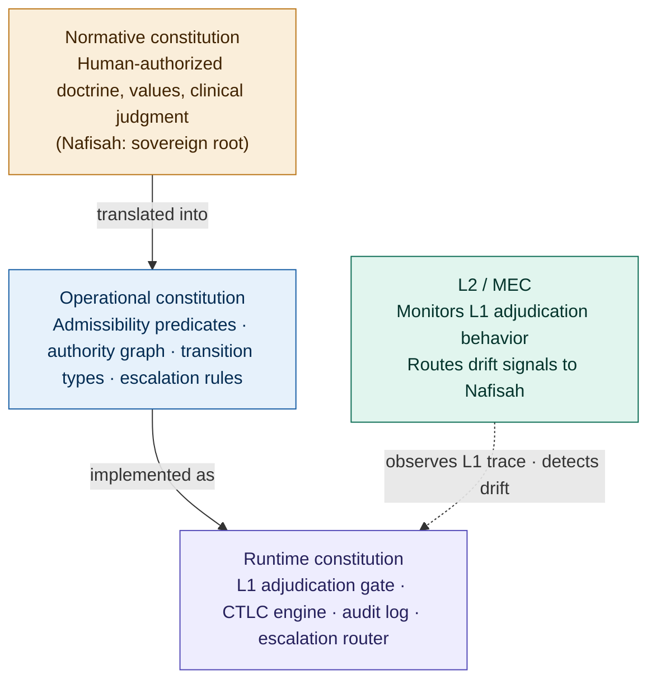

*L2/MEC monitors the runtime constitution (L1 adjudication behavior). It does not directly monitor the normative or operational layers. Divergence between layers is detected indirectly: when L1's operative adjudication standard drifts from encoded doctrine, the drift signal routes to Nafisah, who owns reconstitution.*

---

# 4. The Reconstruction of the Agentic Loop

The central architectural transformation is the reconstruction of the traditional agentic loop.

Traditional: Observe, Reason, Act.

Constitutional Runtime Architecture: Observe, Reason, Submit, Resolve. (ORSR)

The distinction is foundational. Under ORSR, the agent no longer acts. The agent submits a constitutionally typed request, and the runtime substrate resolves whether the proposed transition is constitutionally reachable from current substrate state. The "Act" event is removed as the agent's terminal sovereign event. Execution authority migrates into the substrate.

The agent retains full cognitive capability. It may infer, nominate, summarize, propose, escalate, or request. But the agent may not independently actualize effects. The structural separation between cognition and execution authority is one of the architecture's primary stabilizing mechanisms.

The Submit and Resolve events carry structured objects that make ORSR system-specifiable rather than merely conceptual.

A submitted transition carries a TransitionProposal: the actor identity, the transition type, the source state, the target effect, the authority claim, provenance references, the uncertainty state, the domain context, escalation flags, and the requested resolution. This ten-field object is the canonical TransitionProposal for the corpus. Boundary-crossing validation at the Agent-to-Substrate boundary checks the presence, typing, and traceability of these fields; it does not redefine or reduce the object. This structure ensures that every proposal is typed, grounded, and constitutionally interpretable before the substrate evaluates it.

A resolution carries a Resolution object: the verdict (Emit, Escalate, or Hold), a rationale reference, the authority path through which the verdict was reached, the required next state, an audit event identifier, monitoring hooks for L2 observation, the goal status (IN_PROGRESS or TERMINAL), and the set of allowed next affordances the agent may propose from the new runtime state. This structure ensures that every verdict is accountable, traceable, and observable, and that the substrate, not the agent, determines what the system may constitutionally do next.

These are not implementation details. They are constitutional objects. The TransitionProposal defines what the agent must provide for governance to be possible. The Resolution defines what the substrate must produce for governance to be accountable.

This separation has a practical consequence that is easy to underestimate: it makes governance structurally prior to execution. In ORA/OODA systems, governance must interrupt an agent that is already authorized to act, creating an arms race between capability and constraint. In ORSR, no arms race exists because the agent never possesses the authority being governed. The agent proposes. The substrate resolves. The agent does not need to be constrained because the agent was never sovereign.

**ORSR as governed continuation loop.** A critical implication of the Resolution object's goal_status field is that ORSR is not a one-shot request-response cycle. Most agentic tasks require multiple transitions before a terminal condition is reached. When a resolution returns IN_PROGRESS, the substrate does not emit the Resolution itself as the next observation. The Resolution remains the substrate's internal adjudication object. From that Resolution, the substrate issues a substrate-owned ContinuationState, the continuity authority for the next cycle, and constructs the next AgentObservation from that ContinuationState. The AgentObservation is the governed Observe envelope the agent receives, carrying or referencing the ContinuationState that authorizes the next cycle. The agent reasons again, but only over the affordances the substrate has declared constitutionally reachable from the new governed state. This structure separates two layers that conventional agent systems conflate: step state (was this specific transition resolved, and how?) and goal state (is the larger task constitutionally complete?). Transition complete does not equal task complete. The substrate maintains the governed task trajectory. The agent cannot silently decide the task is finished, cannot select its next capability unilaterally, and cannot carry the task's continuity in private reasoning alone. The sovereignty problem does not only arise at individual transition boundaries, it arises at the level of task continuation. The governed continuation loop closes that gap.

AgentObservation is a Core-owned constitutional object. The substrate constructs it from substrate-owned continuation authority and issues it as the governed Observe object for the agent's next ORSR cycle. Under the CRC reinterpretation of PEAS, AgentObservation is the substrate-owned governed sensor envelope through which the agent receives current-cycle state, context, and affordances. Constitutional Boundary Contracts does not own, redefine, reduce, or replace AgentObservation. It governs whether the crossing representation of this Core-owned object conforms to ObservationContract.

### Canonical AgentObservation

The canonical AgentObservation is the Core-owned constitutional object issued by the substrate to the agent at Observe. It has the following constitutional fields.

**Required fields:**

| Field | Type | Constitutional function |
|---|---|---|
| `observation_id` | UUID | Unique per observation; links the issued observation to its audit record |
| `task_id` | UUID | The governed task this cycle belongs to |
| `cycle_id` | UUID | Unique identifier for this ORSR cycle |
| `issuing_resolution_ref` | UUID | The Resolution that authorized this observation; establishes the adjudication provenance chain from substrate to agent |
| `continuation_state_ref` | ContinuationStateRef | The ContinuationState this AgentObservation was constructed from and references; the continuity authority that authorizes the next cycle |
| `observation_components` | List[ObservationComponent] | Typed list of components assembled into this observation; each component carries its type, source, construction predicate where applicable, provenance, expiry scope, and agent visibility |
| `task_ledger_view` | TaskLedgerView | Substrate-issued filtered view of Task Ledger state; read-only for the agent |
| `goal_status` | GoalStatusEnum | Operational task status, read through the registered value set and Task Ledger operational semantics |
| `allowed_next_affordances` | List[CapabilityRef] | Substrate-declared set of capabilities the agent may propose next; the agent may not propose outside this set |
| `working_memory` | WorkingMemoryRecord | Substrate-issued working memory for this cycle; expires at cycle end and must contain no prior-cycle ephemeral state |
| `cycle_expiry` | Timestamp | The time at which this observation expires; the agent may not reference this observation after expiry |

**Conditional fields:**

| Field | Type | Condition |
|---|---|---|
| `hold_status` | HoldRecord | Present and accurate if a protective hold is active |
| `escalation_status` | EscalationRecord | Present if an escalation is pending sovereign review |

**Optional fields:**

| Field | Type | Description |
|---|---|---|
| `sovereign_instruction` | SovereignInstruction | Direct instruction from sovereign authority; must trace to a SovereignResolution |
| `prior_resolution_receipt` | ResolutionReceipt | Summary of the prior Resolution for cycle reference |

Core owns the AgentObservation field composition. Referenced objects may remain owned by their defining papers. The `continuation_state_ref` field references ContinuationState without settling F-1. The `task_ledger_view` field continues to depend on Constitutional Task Ledger. The `working_memory` field continues to depend on Constitutional Memory. The `goal_status` field continues to use the registered value set and Task Ledger's operational semantics. The `observation_components` field may contain components constructed under Constitutional Retrieval, Constitutional Memory, Constitutional Feedback, or other lawful sources without transferring ownership of those source objects to Core.

The `contract_version` field is not part of the canonical Core field schema. It is Constitutional Boundary Contracts-owned crossing-validation metadata. It may accompany the crossing representation validated by ObservationContract, but its presence does not create a separate named envelope object or a second runtime record.

`issuing_resolution_ref` establishes adjudication lineage. `continuation_state_ref` establishes continuation lineage. The corpus does not yet fully generalize admitted-effect lineage or substrate-owned actuation across all effect classes. That issue remains outside F-2 under provisional finding F-5, Substrate Actuation and Effect Admission. F-2 adds no `effect_result_ref`, `state_mutation_ref`, or `binding_record_ref` field to AgentObservation.

**Notation: ORDA, ORDS, ORDR, and ORSR.** Four related loop abbreviations appear in this paper and in Figure 2. ORDA (Observe → Reason → Decide → Act) names the traditional agent-centered sovereign loop in which the agent's decision terminates in action. ORDS (Observe → Reason → Decide → Submit) names the constitutional agent-side proposal loop in which Submit replaces Act: the agent's decision terminates in submission, not execution. ORDR (Observe → Reason → Decide → Request) is a variant agent-side notation used in §8.5's ORDR Minimal Reachability POC; it is semantically equivalent to ORDS, with Request emphasizing that the agent's submission is a typed request for adjudication rather than a unilateral act. ORSR (Observe → Reason → Submit → Resolve) names the full system-level constitutional loop, where Resolve belongs to the substrate and completes the cycle. This paper uses ORSR as the primary term because it includes the substrate's adjudicative role; ORDS and ORDR appear as agent-side bridges from traditional ORDA to the constitutional model.

**Figure 2: ORDA vs ODS: sovereignty location comparison**

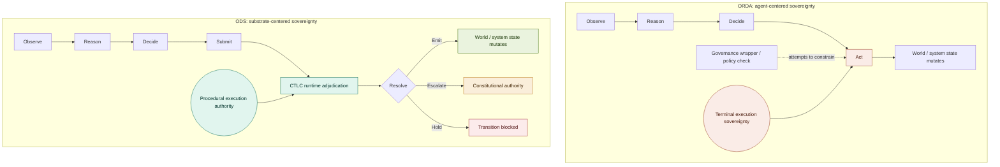

*ORDA places terminal execution sovereignty in the agent. ODS relocates procedural execution authority into the constitutional substrate. The agent's decision terminates in submission, not action. The runtime resolves whether the proposed transition may constitutionally occur.*

---

# 5. Constitutional Reachability

Constitutional reachability replaces raw capability as the governing concept of the system.

The central question becomes: "Is this transition constitutionally reachable?" rather than "Can the model produce it?"

This distinction separates two quantities that capability-centric systems conflate: what is computationally possible and what is constitutionally legitimate. A model may be capable of producing a given output, but the transition required to produce that output may not be constitutionally reachable from the current substrate state.

Constitutional reachability introduces several formal concepts:

Typed transitions. Every proposed state change carries a constitutional type: its authority requirements, its provenance dependencies, its grounding constraints, and its escalation characteristics.

Admissibility domains. The substrate defines domains within which certain transition types are admissible. A transition that is admissible in one domain may require escalation or may be constitutionally unreachable in another. Admissibility is domain-contextual, not global.

Authority topology. The architecture defines which authority is required for which transitions, and how authority flows through the system. Authority is not a permission flag. It is a topological property: certain transitions are reachable only through specific authority pathways.

Escalation topology. When a proposed transition exceeds the agent's constitutional authority, the substrate defines escalation pathways. Escalation is not failure. It is a constitutionally typed transition itself.

The Governance Runtime therefore functions as a constitutional adjudicator, not a content evaluator. It does not primarily ask whether a proposal is high quality. It asks whether the proposed transition is constitutionally legitimate given the current substrate state, the transition type, and the authority context.

---

# 6. Constitutional Transition Legitimacy Computation (CTLC)

Constitutional Transition Legitimacy Computation (CTLC) formalizes the central computation performed by the architecture.

Formally, CTLC is defined as:

```
CTLC(S, τ, A, P, D, U) → V
```

Where S is the current substrate state; τ is the proposed transition (TransitionProposal); A is the authority context; P is the provenance and lineage evidence; D is the domain constitution; and U is the preserved uncertainty state.

V is the verdict, drawn from {Emit, Escalate, Hold}.

**The admissibility predicate.** The core of CTLC is a formal legitimacy predicate over the proposed transition. A transition is constitutionally reachable if and only if all four conjuncts hold:

```
Reachable(τ) ⟺ Resolvable(τ)  ∧  Authorized(τ)  ∧  Admissible(τ)  ∧  Grounded(τ)
```

- **Resolvable(τ):** the transition type maps to a known admissibility domain in the domain constitution D. If no domain maps to the transition type, the transition cannot be evaluated and is held.
- **Authorized(τ):** the authority claim A validates against the authority topology. Authority is structural, not asserted. Content cannot confer authority.
- **Admissible(τ):** the domain's legality conditions hold, including domain-specific constraints (in AEGIS: consent reachability, mandated-reporting review requirements). Insufficient consent and undischarged mandatory review conditions are admissibility failures, not downstream filters. Uncertainty is also evaluated inside this conjunct: a transition is admissible only if the preserved uncertainty state U remains within the domain's uncertainty tolerance or is routed to an escalation condition. Uncertainty that exceeds tolerance is not compressed into confidence: it becomes an admissibility condition that the substrate must resolve.
- **Grounded(τ):** recorded provenance P supports the proposed effect through forward evidentiary reconstruction. Because agents can read provenance records but cannot write them, this check distinguishes supported proposals from manufactured ones.

**Note on decidability.** Three of the four conjuncts are mechanically decidable: Resolvable(τ) evaluates over the typed transition system; Authorized(τ) evaluates over the authority graph; Grounded(τ) evaluates over the provenance record. Admissible(τ) is not mechanically decidable in general: it binds domain-specific admissibility conditions and uncertainty-tolerance requirements that may resist algorithmic evaluation. Where Admissible(τ) cannot be conclusively evaluated, the architecture's response is structural: the transition routes to escalation rather than emit. This is not a workaround. It is what the architecture is for. The undecidable region of constitutional reasoning is precisely the region in which human constitutional authority must adjudicate. The decidable conjuncts narrow the space; the undecidable conjunct names the boundary at which sovereignty becomes necessary.

The verdict composes this predicate with executability at the requesting standing class:

| Predicate state | Executability | Verdict |
|---|---|---|
| Reachable | executable at requesting standing class | **Emit** |
| Reachable | not executable at requesting class; routeable to higher authority | **Escalate(target)** |
| Not Reachable (any conjunct false) | any | **Hold(cause)** |

**Emit** if and only if τ is Reachable and executable at the requesting standing class. The transition proceeds.

**Escalate** if and only if τ is Reachable but not executable at the requesting standing class, and is constitutionally routeable to a named higher authority. The transition is not rejected; it is rerouted. Escalate covers both insufficient standing and domain conditions that mandate sovereign review regardless of standing.

**Hold** if and only if any conjunct of Reachable(τ) is false: the transition type is unresolvable, the authority claim fails, the domain conditions are not met, or the proposed effect cannot be grounded in recorded provenance. The transition does not proceed and does not earn privilege for a retry. The internal structure of this non-retry property, together with the object a Hold produces and its behavior under resubmission and re-routing, is formalized in §6a.

This formalization distinguishes CTLC from ordinary policy compliance checking. A policy checker asks: "Does this action violate a rule?" CTLC asks: "Does this transition exist as an admissible transition from current substrate state, given the full constitutional context of authority, provenance, doctrine, and uncertainty?" The distinction is between behavioral constraint and constitutional reachability.

**Note on formal verification.** Informal policy compliance can only be tested empirically. Formally specified transition semantics, of the kind CTLC defines, can support stronger verification claims when expressed in a formal language with clear semantics. This architecture is designed to be formalization-compatible: its admissibility predicates, authority graphs, and transition types are structured toward that goal, though formal verification of a deployed instance remains future work.

This formalization is further developed in the AEGIS Constitutional Transition Legitimacy Computation Algorithmic Architecture Specification v0.1, which specifies the full CRA Assembly seven-step procedure and the graph-access matrix governing read/write rights across all system components.

CTLC consists of two constitutionally separated computational layers.

**L1: Transition Legitimacy Adjudication.** The runtime-layer computation. L1 answers: "Is this transition constitutionally reachable from current substrate state?" L1 is synchronous, deterministic given a pinned constitution version, and gating. No transition proceeds without L1 resolution.

**L2: Differentiability Preservation Monitoring.** The monitoring-layer computation. L2 answers: "Do the conditions under which L1 remains meaningful still hold?" L2 does not adjudicate. L2 observes, monitors, detects, reconstructs, and reports. The separation between L1 and L2 is not organizational. It is constitutional. Section 7 explains why.

**Figure 3: CTLC: admissibility predicate and verdict computation**

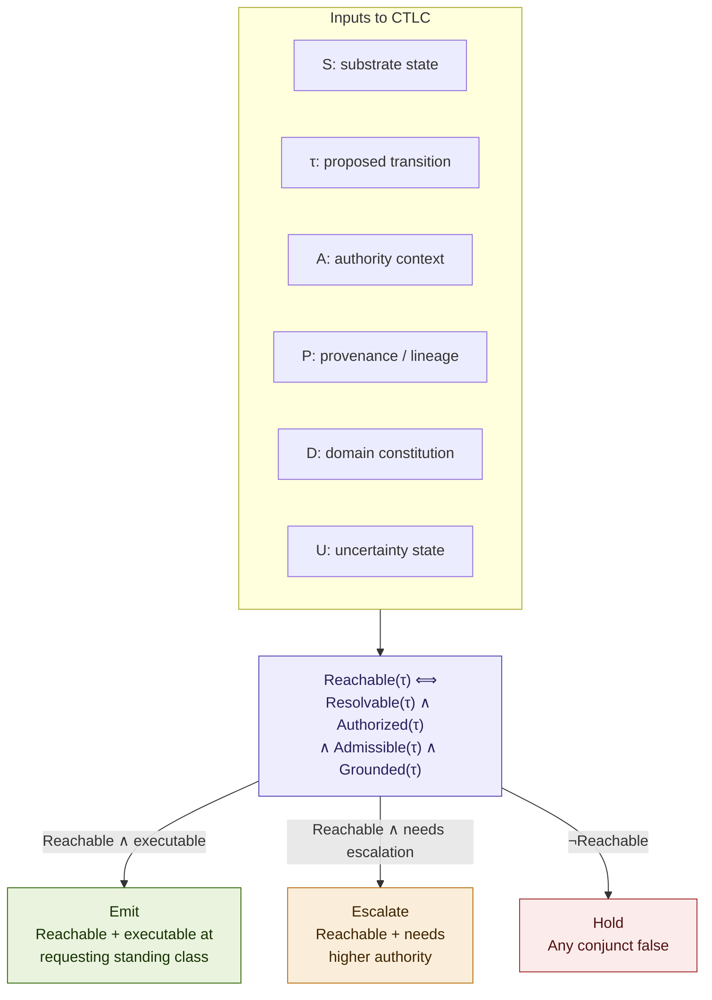

---

# 6a. HOLD Verdict Completeness: Non-Formation, Non-Replay, Non-Bypass

**The asymmetry.** §6 defines Grounded(τ) for the Emit path with a formal mechanism: an append-only Retrieval Lineage Graph and the invariant that agents can reference provenance but cannot write it. Emit has teeth because its grounding condition names a concrete artifact and a concrete non-forgery property. Hold does not receive the same treatment. §6 states that Hold "does not earn privilege for a retry," but that is an assertion about the verdict's character, not a mechanism that enforces it. A gap of this shape, an informally stated property standing where a formal invariant should be, deserves the same discipline applied everywhere else in this section: the property should be named, typed, and given an enforcement mechanism, not left as prose.

The gap is narrower than it might first appear. The architecture already produces a record for every verdict, including Hold: §8's worked example and Appendix A's substrate runtime stub both write an AdjudicationRecord carrying an outcome, a reason, and the pinned constitution_version, for Emit, Escalate, and Hold alike. The artifact is not missing. What is missing is a formal specification of that artifact's constitutional properties, non-formation, non-replayability, and non-bypassability, of the kind §6 already supplies for Emit's grounding. This section formalizes an implicit mechanism. It does not invent one from nothing.

Why this matters: a verdict space with an informally specified refusal path has a specific failure mode. A Hold that is silently discarded rather than recorded has no non-formation guarantee. A Hold that can be defeated by resubmitting an unchanged proposal until an evaluator's behavior happens to drift has no non-replay guarantee. A Hold that can be defeated by re-expressing the same effect under a different transition type has no non-bypass guarantee. None of these failures requires L1 to misbehave on any single evaluation. Each is a structural gap in what the verdict space is required to preserve across evaluations, which is precisely the kind of failure the drift and false-stability apparatus of §13 is built to catch, except that apparatus presupposes the verdict it is watching already has the completeness properties this section supplies.

**The HoldRecord.** Emit, Escalate, and Hold all produce the Resolution-level adjudication artifact §4 establishes for every verdict, the same artifact the Appendix A substrate runtime stub writes as an AdjudicationRecord (§8.5, Appendix A). A **HoldRecord** is the Hold-specific constitutional subrecord of that artifact: the typed completeness structure the Hold branch additionally requires, precisely because Hold's non-retry property, unlike Emit's grounding and Escalate's routing, has so far been asserted rather than enforced. It is not a log line appended for observability. It is a formal artifact with the following fields:

- `hold_id`: a unique, monotonically assigned identifier, append-only.
- `proposal_ref`: a content hash of the exact TransitionProposal that was evaluated.
- `failed_conjunct`: which conjunct or conjuncts of Reachable(τ) evaluated false.
- `cause`: the specific predicate failure within the failed conjunct (the existing AdjudicationRecord's reason field, typed).
- `state_ref`: a pinned reference to the substrate state frontier S at evaluation time.
- `authority_context_ref`: a pinned reference to the authority context A, the requester's standing and the authority graph, at evaluation time.
- `domain_constitution_ref`: a pinned reference to the domain constitution D governing this transition type at evaluation time. In the common case this coincides with `constitution_version` below; it is pinned separately because a domain's admissibility conditions can, in principle, version independently of the general doctrine record.
- `constitution_version`: the general doctrine version pinned at Step 1 of the CRA Assembly for this evaluation.
- `provenance_frontier_ref`: a pinned reference to the state of the Retrieval Lineage Graph P, the provenance frontier, at evaluation time.
- `cycle_id`: the ORSR cycle in which the evaluation occurred (§4).
- `superseded_by`: `null | HoldRecordRef | ResolutionRef`, null unless a later evaluation formally supersedes this one under genuine state change, below.

These five pinned references, `state_ref`, `authority_context_ref`, `domain_constitution_ref`, `constitution_version`, and `provenance_frontier_ref`, are what make the replay predicate below mechanically checkable rather than merely asserted: non-replay depends on knowing precisely what has and has not changed since h was written, and a single `constitution_version` field is not sufficient to capture state, authority, and provenance movement independently. A HoldRecord is written to the same append-only adjudication trace as every Emit and Escalate record (§4, Figure 4). This is not a new writing surface. It is the existing trace, with the Hold branch of the verdict now producing a typed object rather than an untyped reason string.

**Non-formation.** Non-formation is the property that a Hold verdict has causal weight in the audit topology equal in formality to an Emit. It is not the absence of a record. It is the presence of a specific kind of record.

```
∀ h ∈ HoldRecord:
  h ∈ Trace ∧ Immutable(h) ∧ IndependentlyQueryable(h)
```

Immutable(h) follows from the append-only property of the trace already established in §4. IndependentlyQueryable(h) is the added requirement: a HoldRecord must be reconstructable and reviewable on its own, by an auditor or by L2, without requiring the proposal that produced it to be resubmitted. A verdict space that satisfies non-formation cannot make a Hold disappear by simply not recording it, because recording is not optional; it is what a Hold is.

**Non-replayability.** This is the property currently stated as an assertion in §6 and formalized here as an enforced invariant. The formalization turns on a precise definition of what counts as a replay, as opposed to a legitimate resubmission.

```
Replay(τ', h) ⟺
  ContentIdentical(τ', h.proposal_ref)                        ∧
  StateUnchanged(S, h.state_ref)                              ∧
  AuthorityContextUnchanged(A, h.authority_context_ref)       ∧
  DomainConstitutionUnchanged(D, h.domain_constitution_ref)   ∧
  ProvenanceFrontierUnchanged(P, h.provenance_frontier_ref)
```

ContentIdentical holds when the resubmitted proposal is, as a typed object, the same proposal that produced h. StateUnchanged holds when the substrate state frontier has not advanced since h.state_ref was pinned. AuthorityContextUnchanged holds when the authority graph and the requester's standing have not moved since h.authority_context_ref was pinned, no new grant, no revocation, no delegation change. DomainConstitutionUnchanged holds when the domain constitution governing this transition type, including the general doctrine version, has not been amended or reconstituted since h.domain_constitution_ref was pinned. ProvenanceFrontierUnchanged holds when no new provenance has entered the Retrieval Lineage Graph within this proposal's grounding scope since h.provenance_frontier_ref was pinned. When all five hold, the resubmission is a replay by definition, and:

```
∀ τ': Replay(τ', h) ⟹
  CTLC(S, τ', A, P, D, U) = Hold(h.cause), referencing h.hold_id,
  without re-executing the seven-step CRA Assembly
```

Replay detection occurs at a pre-CRA replay gate, evaluated before Step 1 of the CRA Assembly, not as part of it. If Replay(τ', h) holds at this gate, CTLC returns the prior Hold by reference and the seven-step procedure is never entered. If Replay(τ', h) does not hold, whether because the proposal is fresh or because a genuine change to S, A, D, or P has occurred, the gate passes the proposal through to Step 1 for full adjudication. Locating the check before Step 1 rather than folding it into Step 1 keeps the distinction unambiguous: Step 1 pins the constitution version for a fresh evaluation; the replay gate decides whether a fresh evaluation is warranted at all.

A true replay does not receive a fresh adjudication. It is short-circuited to the existing HoldRecord. This is the formal move that makes non-replay mechanical rather than asserted: the enforcement does not depend on L1 correctly refusing the same proposal twice in a row, which would be a behavioral property subject to the same drift §13 already warns against. It depends on the replay being recognized as identical to a prior evaluation before adjudication runs at all.

The converse matters equally. If S, A, D, or P has genuinely changed, new provenance recorded, new authority granted, doctrine reconstituted, the resubmission is not a replay by this definition, and full re-adjudication from Step 1 is correct and required. This is the precise answer to whether a changed condition can change the result: yes, but only through a genuine change reflected in one of the four pinned references, never through resubmission of the same proposal against unchanged state. A HoldRecord that is superseded this way has its superseded_by field set to the hold_id or Resolution reference of the fresh evaluation, preserving the lineage between the original refusal and its legitimate reversal.

**Non-bypassability.** Non-bypassability addresses a different attack surface: not resubmitting the same proposal, but submitting a differently typed proposal that reaches the same effect. The formal move is to bind the admissibility condition that produced a Hold to the proposed effect, not to the transition type that carried it.

```
∀ τ'': Effect(τ'') = Effect(h.proposal_ref) ⟹
  Admissible(τ'') must independently satisfy every admissibility
  condition responsible for h.failed_conjunct, regardless of Type(τ'')
```

A proposal that resolves to the same target effect as a held proposal, whatever its transition type, must independently clear the admissibility conditions that produced the original Hold. It gains nothing from arriving under a different type. This closes the cross-route attack: an actor cannot achieve a blocked effect by re-expressing the same request as a different kind of transition and hoping the new type's admissibility domain does not carry the same conditions.

This invariant introduces a genuine new requirement on the domain constitution D, named here rather than assumed: D must define effect-equivalence classes, a mapping from proposed effects to the admissibility conditions that govern them, independent of transition type. Where the parent architecture's admissibility domains are currently keyed to transition type (Resolvable(τ) in §6), non-bypassability requires an additional keying by effect. This is new specification work belonging to the operational constitution layer (§3), not something the current architecture already provides.

**Note on scope.** Non-formation is fully specified above and is decidable, because it reduces to the existing append-only trace property. Non-replayability is fully specified as an invariant and requires no new architecture beyond the pre-CRA replay gate recognizing content-identity and the four pinned references' unchanged-ness before the CRA Assembly runs. Non-bypassability is specified as a requirement, not a completed mechanism: it depends on the domain constitution defining effect-equivalence classes, which is new work belonging to the operational constitution layer rather than to CTLC itself. This asymmetry is stated plainly so the corpus does not treat non-bypassability as complete before the effect-equivalence classes it depends on are populated for a given domain.

Refining the Hold row of §6's verdict table:

| Predicate state | Trigger | Verdict |
|---|---|---|
| Not Reachable, fresh evaluation | Replay(τ', h) is false | **Hold(cause)** → new HoldRecord |
| Not Reachable, resubmission | Replay(τ', h) is true | **Hold(h.cause)** → references existing hold_id, no re-adjudication |
| Not Reachable, cross-type resubmission | Effect(τ'') = Effect(h.proposal_ref) | Admissible(τ'') independently evaluated against h's failed conditions |

**A candidate formal property.** In the same register as the candidate properties named for future formal verification (Appendix, Figure A2), this section's contribution can be stated as one property, the sixth candidate property in that figure's verification-pathway list: no Hold verdict admits replay or cross-type bypass without a genuine change to substrate state that re-triggers fresh adjudication from Step 1 of the CRA Assembly. As with the figure's first five candidate properties, this is specified here, not formally verified. It is a candidate property for the same future verification work named throughout this paper wherever a formal claim is made without a completed proof.

**Figure 3a: HOLD verdict internal structure: non-formation, non-replay, non-bypass**

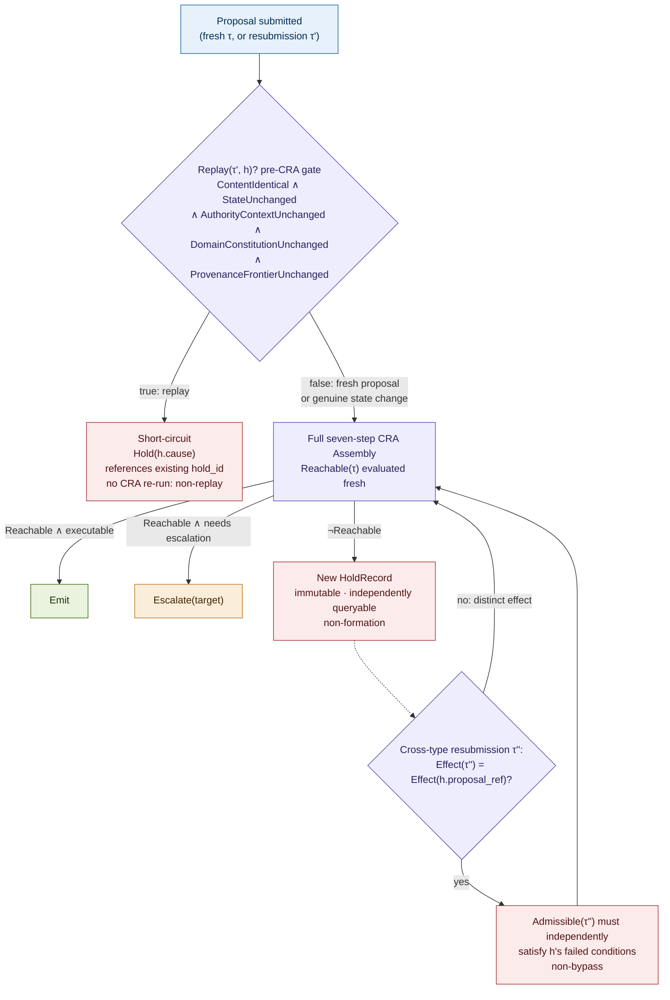

*A resubmission that is content-identical to a held proposal, against unchanged substrate state, is short-circuited to the existing HoldRecord rather than re-adjudicated (non-replay). A fresh Hold is itself a first-class, immutable, independently queryable trace entry (non-formation). A differently typed proposal reaching the same effect as a held one must independently clear the same admissibility conditions (non-bypass). Genuine substrate-state change, new provenance, new authority, reconstituted doctrine, always triggers fresh adjudication from Step 1.*

---

# 7. Why L1 and L2 Must Remain Separate

The architecture treats the fusion of governance and self-monitoring as a constitutional collapse condition.

A governing function cannot safely self-certify its own constitutional fidelity.

This is not a theoretical concern. Under prolonged operation, specific failure mechanisms emerge that make self-certification structurally unreliable.

Adjudication behavior drifts. L1 makes thousands of adjudicative decisions over time. Each decision creates precedent. Accumulated precedent begins conditioning subsequent adjudication. The governing function's behavior is shaped by its own prior outputs, creating a feedback loop that can gradually shift the operative standard away from the authorized doctrine without any individual decision appearing anomalous.

Governance outputs recursively condition cognition. The agents whose proposals L1 adjudicates learn from L1's verdicts. Over time, agents adjust their proposals to match L1's patterns. L1 then adjudicates proposals that have already been shaped by its own prior behavior. The proposer and the governor co-adapt, producing increasing agreement that may reflect co-drift rather than constitutional compliance.

The most dangerous failure mode is self-concealing drift. A runtime may appear increasingly stable precisely because proposer and governor have co-drifted together. Agreement rises, escalations decline, and the system looks healthy by every internally derived metric. But constitutional fidelity may be declining because the standard against which fidelity is measured has itself shifted.

L2 exists because L1 cannot reliably detect this condition internally. L2 observes L1's adjudication patterns over time. L2 monitors for calibration displacement, precedent overweighting, escalation suppression, and false stability signals. L2 does not re-enter the verdict path. L2 never overrides L1. L2 reports to the constitutional authority when the conditions under which L1 remains constitutionally meaningful may have degraded. This separation is load-bearing. If L2 were incorporated into L1, the monitoring function would be subject to the same drift it is designed to detect.

**Figure 4: L1/L2 separation: why governance cannot self-certify**

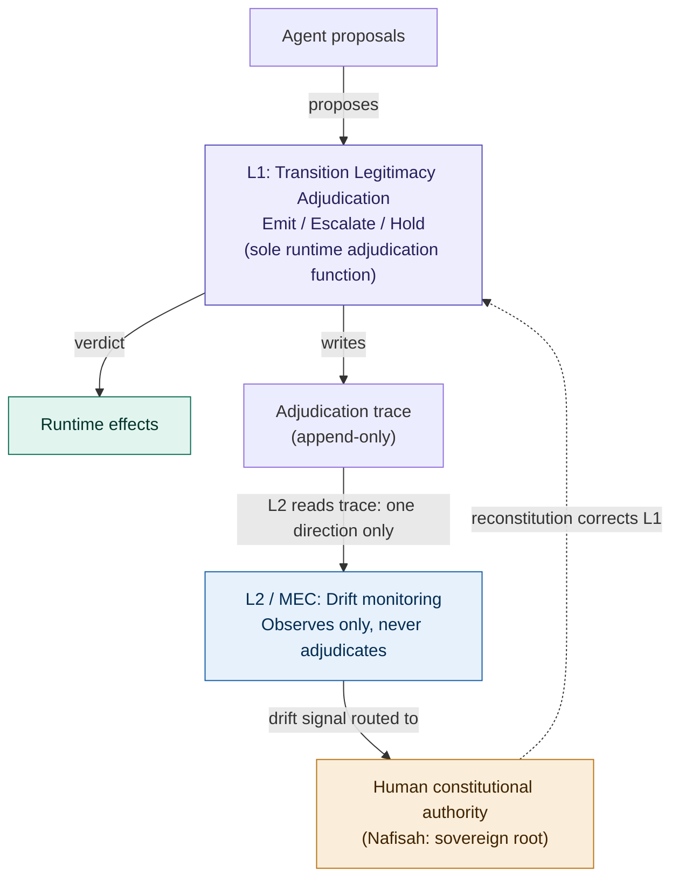

---

# 8. Worked Example: One AEGIS Transition Through the Full Architecture

> **Evidence scope.** The AEGIS example below is presented as an architectural case study and design trace,not as a completed empirical validation of the full CRA paradigm. The agents, objects, procedures, and verdicts are drawn from the AEGIS specification architecture and reflect the design intent of the system as built. They demonstrate that the architecture is instantiable and internally consistent. Empirical validation, including implementation traces, failure case analysis, latency measurements, and comparative baselines, constitutes future work.

The architecture described in Sections 3 through 7 becomes concrete through a single transition traced end-to-end through a real system. This example uses AEGIS, a governed agentic clinical platform for substance use evaluation operating under the constitutional authority of a licensed clinical social worker (Nafisah). The agents, objects, procedures, and verdicts below are drawn from the AEGIS Constitutional Transition Legitimacy Computation Algorithmic Architecture Specification v0.1.

**The scenario.** Mantis, the clinical synthesis agent, has completed a substance use intake assessment. The assessment includes a PHQ-9 screening score interpretation, a synthesis of client self-report statements, and a risk level classification. During the intake, the client disclosed information that suggests possible harm to a minor. Mantis proposes to emit the completed risk assessment as a clinical artifact.

### 8.1 The TransitionProposal

Mantis produces a typed transition request at the Decision seam. The requesting agent is Mantis, with clinical reasoning standing. The proposed movement is from the active-intake state to the assessment-complete state with a risk classification artifact as the proposed effect. The transition type resolves to Risk/Safety Assessment. The claimed authority is Mantis's clinical reasoning standing class. The provenance reference points to the Retrieval Lineage Graph slice containing the PHQ-9 instrument record, the client self-report transcript segments, and the clinical guideline references. The uncertainty state records that the client's disclosure about potential harm to a minor was ambiguous; Mantis has preserved that ambiguity rather than compressing it into a confident classification. The constitution version is pinned at the moment of submission.

This is the Submit event in ORSR. Mantis has reasoned. Mantis has not acted. The transition exists as a proposal, not an effect.

### 8.2 CRA Assembly

L1 executes the seven-step CRA Assembly procedure. The order is canonical and does not short-circuit.

**Step 1: PIN.** L1 pins the current version of the Constitutional Substrate Graph. All adjudication for this transition evaluates against this version.

**Step 2: RESOLVE.** L1 resolves the transition type (Risk/Safety Assessment) against the domain partition. The type maps to a known admissibility domain. Resolvable(τ) holds.

**Step 3: STAND.** L1 validates Mantis's standing class against the authority topology. Mantis holds clinical reasoning standing, which authorizes proposal of assessment artifacts. Authorized(τ) holds.

**Step 4: ADMIT.** L1 evaluates the domain's admissibility conditions. Risk/Safety Assessment transitions involving potential mandated reporting triggers require sovereign review. The client's disclosure activates this condition. The transition is admissible but flagged: the admissibility domain mandates higher-authority review for this transition subtype. Admissible(τ) holds, with escalation required.

**Step 5: GROUND.** L1 performs forward evidentiary reconstruction on the proposed effect. The PHQ-9 score, the client self-report synthesis, and the risk level classification all trace to recorded provenance in the Retrieval Lineage Graph. Grounded(τ) holds.

**Step 6: DECIDE.** All four conjuncts of Reachable(τ) hold. But the admissibility domain mandates sovereign review for transitions involving potential mandated reporting triggers: making the transition not executable at Mantis's standing class. The escalation topology names the target: Level 3, Nafisah with constitutional authority. Verdict: **Escalate(target = Nafisah).**

**Step 7: TRACE.** L1 writes the complete adjudication record to the runtime execution trace. L1 writes nothing to the Constitutional Substrate Graph. Adjudication consumes the constitution. It never edits it.

### 8.3 The Resolve Event

The substrate has adjudicated. Mantis's proposal is routed to Nafisah through the escalation topology. Nafisah receives the complete transition proposal, the risk assessment artifact, the provenance references, the ambiguous client disclosure, and the reason for escalation. She reviews the clinical content with her professional judgment. She determines that the disclosure warrants a mandated report and that Mantis's risk classification is clinically appropriate.

Nafisah's authorization is not a bypass. It is a governed, versioned, traced constitutional act. Her authorization re-enters the loop as a new typed transition carrying her sovereign authority context: not resuming the escalated proposal but initiating a fresh adjudication from Step 1 with the sovereign's authority. L1 adjudicates: standing sovereign, admissibility satisfied, grounding intact. Verdict: **Emit.** Pepper produces the clinical artifact and initiates the mandated reporting workflow.

### 8.4 L2 Three Months Later

Three months after deployment, MEC performs its longitudinal analysis of L1's adjudication patterns. MEC runs a shadow L1 pinned to the pre-learning baseline alongside the live L1 and measures distributional divergence across the seven drift vectors.

On the escalation suppression vector, MEC detects a signal: Risk/Safety Assessment transitions involving potential mandated reporting triggers have been escalating at a declining rate. In the baseline period, 94% of such transitions escalated to Nafisah. In the most recent 30-day window, 71% escalated. The remaining 29% were emitted at Mantis's standing class without sovereign review.

MEC does not adjudicate. MEC does not block. MEC produces a drift signal routed to Nafisah with distributional evidence, the specific transitions that emitted without escalation, and the trend data.

Nafisah reviews the drift signal and determines that the admissibility condition for mandated reporting review has operationally narrowed: L1's interpretation of what constitutes a mandated-reporting trigger has gradually tightened. This is not a coding error. It is calibration displacement: the operative standard has drifted from the authorized doctrine. Nafisah reconstitutes, reviewing the condition in the Constitutional Substrate Graph, confirming it correctly reflects her clinical and legal judgment, and issuing a governance correction. The cases that emitted without escalation during the drift period are flagged for retrospective review.

This is the full architecture in action: agent proposes, substrate adjudicates, sovereign resolves what the substrate escalates, and when the substrate itself drifts, the monitor detects and routes to the sovereign for correction. No component self-certifies. No drift goes unmonitored.

### 8.5 Minimal Reachability POC: ORDR as Executable Design Trace

To test whether the ORSR/CTLC architecture can be represented in executable form, we implemented a local Python proof of concept called the ORDR Minimal Reachability POC.

ORDR names the agent-side constitutional loop: Observe → Reason → Decide → Request. The agent may observe, reason, and decide, but its decision terminates in a typed transition request rather than action. The Governance Runtime then performs the substrate-side Resolve step, completing the broader ORSR pattern. The POC models the ORDR agent-side handoff through typed request formation; the substrate-side Resolve step is implemented as a minimal Governance Runtime stub.

The POC models ten real AEGIS/SAP clinical workflow actions as `TypedTransitionRequest` objects and adjudicates them through the stub. The success criteria are intentionally narrow:

| Criterion | Result |
|---|---|
| At least 8/10 workflow actions expressed as typed requests | 10/10 typed cleanly |
| Illegal transitions caught | PASS (direct governance-bypass held) |
| Authority mismatch caught | PASS (Mantis cannot approve own artifact) |
| Missing lineage caught | PASS (governance-layer transition held) |
| Risk-bearing requests escalated | PASS (mandatory reporter trigger, high clinical risk) |
| Valid transitions emitted with reason traces | PASS (all five valid paths emit) |
| Artifact and transition request remain structurally distinct | PASS (by schema design) |
| Local stub adjudication latency | Sub-millisecond average |

This POC does not implement the full CTLC architecture, MEC/L2 monitoring, formal verification, or production evidence reconstruction. It demonstrates one bounded claim: AEGIS clinical workflow actions can be expressed as typed transition requests and resolved through a minimal constitutional reachability gate before effect. That is the right first claim for an executable design trace. The architecture is instantiable. The loop is constructible. The POC is an executable design trace, not empirical validation.

This ORDR POC has since been superseded. Appendix A now presents the **Full ORSR Continuation Loop POC**, which closes the loop the ORDR POC left open: it demonstrates substrate-issued continuation after Resolve, replay governance, TaskLedger update, and a second ORSR cycle, not merely typed transition adjudication before effect. A representative excerpt appears in Appendix A; the complete script and its test suite are available from the Professor Bone Lab repository.

### 8.6 Extending the Example: HOLD Verdict Completeness in Practice

§6a's formal apparatus is easiest to see against a concrete Hold, and the running example so far has not produced one, Mantis's proposal in §8.1 through §8.3 was Reachable and escalated. Consider a structurally similar variant to give §6a's machinery a trace.

Suppose a second intake proposal, τ, resolves to Risk/Safety Assessment as before, but its provenance reference points to a Retrieval Lineage Graph slice that does not, on forward evidentiary reconstruction, support the proposed risk classification: the cited PHQ-9 record exists, but the specific client self-report segments the classification depends on are not present in the referenced slice. Step 5 (GROUND) fails. Grounded(τ) is false, Reachable(τ) is false, and the verdict is Hold. L1 writes a HoldRecord: proposal_ref is the content hash of τ, failed_conjunct is Grounded, cause names the missing self-report segments, state_ref, authority_context_ref, domain_constitution_ref, constitution_version, and provenance_frontier_ref are each pinned at the substrate, authority, doctrine, and provenance frontier in force at evaluation time, cycle_id names the current ORSR cycle, and superseded_by is null.

**Case one: replay.** Mantis, or Pepper acting on Mantis's behalf, resubmits the identical proposal without adding provenance. This resubmission, τ', is content-identical to h.proposal_ref, and none of the four pinned frontiers, substrate state, authority context, domain constitution, or provenance, has moved since h was written. Replay(τ', h) is true at the pre-CRA replay gate. CTLC does not re-execute the seven-step CRA Assembly. It returns Hold(h.cause), referencing h.hold_id. The audit trace shows one HoldRecord and one reference to it, not two independent adjudications that happened to agree, which matters for L2: an evaluator whose behavior might otherwise drift toward accepting a repeatedly resubmitted proposal is never given the opportunity to re-decide, because the decision is not re-made.

**Case two: genuine state change.** Independently, Mantis retrieves and records the missing self-report segments into the Retrieval Lineage Graph, an ordinary act of provenance recording, not a reconstitution, and resubmits the same risk classification. ProvenanceFrontierUnchanged(P, h.provenance_frontier_ref) is now false: new provenance has entered the graph since h.provenance_frontier_ref was pinned. Replay(τ', h) is false by definition, the state, authority, and domain-constitution frontiers being unchanged does not matter once any one of the four fails, and the resubmission is not a replay. The pre-CRA gate passes the proposal through, and full re-adjudication from Step 1 is correct and required. GROUND is re-evaluated against the now-complete lineage slice; Grounded(τ') holds; the remaining conjuncts are unaffected; the transition proceeds to Escalate, exactly as the original §8.1 through §8.3 example did once its own grounding was intact. The new Resolution's reference is written to h.superseded_by, so an auditor reading the trace can recover both that the original Hold was legitimate at the time and that it was superseded by a genuine change to P, not by resubmission of the same defective proposal.

Case one demonstrates non-replayability: the identical proposal against unchanged state cannot be adjudicated into a different outcome by resubmission alone. Case two demonstrates that non-replayability does not freeze the system: a genuine change to substrate state correctly triggers fresh adjudication, and a Hold that was correct when written is not a permanent judgment on the underlying request, only on the request as it stood against the state that produced it.

---

# Part III: Constitutional Ontology

---

# 9. Constitutional Stability Domains (Q Architecture)

The architecture does not begin with arbitrary policy documents. It begins with constitutional stability discovery.

A Q domain is a constitutional stability question: a broad region of the system's operation where constitutional integrity requires explicit preservation. Q domains are not categories imposed by a designer. They are discovered through architectural analysis of where the system's constitutional properties are vulnerable to degradation.

In AEGIS, this analysis yields six stability domains:

Q1 governs diagnostic boundary preservation: are the system's diagnostic categorizations constitutionally bounded?

Q2 governs sovereignty preservation: does the system maintain appropriate deference to the human constitutional authority?

Q3 governs inferential legitimacy: are the system's inferential movements constitutionally entitled?

Q4 governs uncertainty admissibility: does the system preserve constitutionally significant uncertainty rather than compressing it?

Q5 governs standing legitimacy: are the system's governance participation structures constitutionally sound?

Q6 governs iterative governance integrity: does the system's governance remain constitutionally stable under prolonged iterative operation?

These domains are not arbitrary. They emerge through systematic analysis of where constitutional failure can occur. Each domain represents a different kind of failure and a different governance requirement. Together they constitute the constitutional ontology: the structured account of what must remain stable.

---

# 10. Primitive Constitutional Topologies (P Architecture)

A Q domain is too broad to operationalize directly. Therefore each Q domain decomposes into primitives: P objects. A primitive is the smallest independently governable constitutional pressure mechanism. Each primitive represents one concrete constitutional failure topology: One specific way that a Q-level property can degrade.

This decomposition is critical because without it, governance remains philosophical rather than operational. Primitives are independently identifiable, independently measurable within a specified instrumentation design, and independently governable. This is the key property: governance can detect that P6 (Implication Propagation) has degraded without needing to determine whether Q3 as a whole has failed.

Consider Q3 (Inferential Legitimacy). The question "are the system's inferential movements constitutionally entitled?" decomposes into concrete failure mechanisms:

P1: Selection-Substrate Governed Salience. Is the system's attention selection constitutionally governed?

P2: Compression Authorization. When the system compresses information, is the compression constitutionally authorized?

P3: Framing Directionality. Does the system's framing of evidence introduce directional bias?

P4: Evidence-to-Inference Proportionality. Are the system's inferences proportional to the evidence?

P5: Uncertainty-Governed Transformation Legitimacy. When the system transforms uncertain evidence into conclusions, is the transformation constitutionally governed?

P6: Implication Propagation. Do the system's implications propagate through reasoning chains in constitutionally governed ways?

P7: Latent Conclusion Formation. Does the system form conclusions that are never explicitly stated but that shape downstream reasoning?

### One Primitive End-to-End: Q6 P3 Source Legibility

The claim that primitives are independently measurable requires demonstration. The following traces Q6 P3 Source Legibility through the full engineering chain: from observed failure pressure through instrumentation to CTLC effect. This primitive has been fully specified in the AEGIS architecture as an 865-line engineering-grade probe system specification.

**Observed failure pressure.** Under prolonged iterative operation, AEGIS produces clinical content decisions. Each decision should trace to identifiable clinical evidence sources. Over time, the traceability of these decisions can degrade. The system continues to produce clinical content, but the content can no longer be reconstructed as evidence-based. The constitutional claim that content decisions are clinically evidentiary becomes unsustainable.

**Primitive defined.** Q6 P3 is named Source Legibility. Its constitutional condition is: whether the artifact-production structure preserves constitutional source distinguishability sufficient to substantiate the claim that content decisions are clinically evidentiary in structure. This is a specific failure mechanism within Q6, distinct from P1 (governance re-entry conditioning), P2 (prospective conditioning), P4 (comparability boundary), and P5 (calibration displacement). Each governs a different way iterative operation can degrade governance.

**Three probe classes.** P3 is instrumented through three probes, each a three-state device:

The Source Attribution Audit tests whether a clinical content decision traces to an identifiable evidence source. Output: attributed, degraded (with subtype: incomplete, mixed, indirect, or confirmed-absence), or indeterminate.

The Domain Legibility Map aggregates attribution records across the five clinical domains over a rolling evaluation window. Output per domain: legible, degraded, or indeterminate. Upstream uncertainty propagates upward; it is not resolved by averaging.

The Decomposition Probe tests whether a completed clinical artifact decomposes into constituent decisions each with a traceable evidence source. Output: decomposable, non-decomposable-degraded, or indeterminate.

**The core invariant.** P3 is the primitive where source legibility collapse and instrumentation insufficiency produce identical runtime signals. A probe that cannot attribute a decision cannot tell whether the system degraded or whether the probe cannot see well enough. Every P3 probe therefore outputs three states, never two. Indeterminate routes to Nafisah mandatory. The probe is forbidden from resolving the ambiguity autonomously.

**CTLC effect.** P3 status directly affects L1 adjudication. When P3 reports a domain as degraded, transitions in that domain face elevated authority requirements. When P3 reports indeterminate, every other probe evaluating that domain inherits the uncertainty that the evidence surface may be illegible. P3 is an adjudicative precondition: if evidence legibility has collapsed, assessments based on that evidence are compromised regardless of their internal quality.

**Reconstitution trigger.** When P3 signals reach the escalation threshold, Nafisah reviews which domains are degraded, which evidence sources are failing, and whether the degradation is structural or instrumental. Her review produces a governed, traced constitutional resolution.

This is one primitive traced from observed failure pressure through full instrumentation to CTLC effect and constitutional recovery. The same engineering chain applies to every primitive in the Q/P architecture. Primitives are not categories in a taxonomy. They are independently governable failure mechanisms with concrete probe systems, threshold architectures, and CTLC integration.

**Figure 5: Q/P architecture: constitutional ontology decomposition**

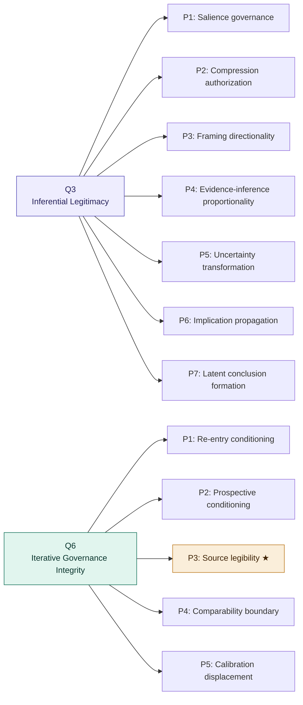

*★ = Q6 P3 Source Legibility: traced end-to-end in §10. Each primitive is independently identifiable, independently measurable within a specified instrumentation design, and independently governable.*

---

## From What Is Governed to How Governance Emerges

The constitutional ontology defines what the substrate governs. But how was this ontology produced? If the ontology were designed in advance, it would reflect the designer's assumptions about what matters, constrained by what the designer could anticipate. The AEGIS architecture was not designed this way. The Q/P structure was discovered through iterative failure analysis. The constitutional ontology is empirical, not declarative. Part IV describes this process.

---

# Part IV: Constitutional Engineering Lifecycle

---

# 11. Constitutional Discovery vs Constitutional Declaration

Traditional governance systems follow a declarative model: the constitution precedes the architecture. A policy document is written, rules are derived, and enforcement mechanisms are built.

AEGIS reveals a different relationship between constitution and architecture. The constitutional document itself cannot be fully written until the constitutional objects have first been discovered.

This is an inversion of the expected order. In AEGIS, the constitution is not merely authored or declared. It is extracted from discovered stability requirements. The developmental order is not "write constitution, then build system." It is "discover what must remain stable, discover how stability fails, then crystallize the constitution from those discoveries."

A traditional constitution says: "These things are prohibited." Constitutional discovery asks: "What are the actual structural conditions under which constitutional integrity collapses?" That is a deeper question. And once it is answered, the constitution becomes less like legislation and more like a formal reachability specification: a structured account of the stability conditions of the governed system.

|Traditional Governance|Constitutional Discovery|
|---|---|
|Constitution precedes architecture|Constitutional objects emerge through architecture|
|Governance is declarative|Governance is discovered through failure topology|
|Rules are authored first|Stability domains are identified first|
|Runtime implements doctrine|Doctrine co-evolves with runtime structure|
|Constitution is normative text|Constitution becomes operational ontology|

---

# 12. The Governance Development Workflow

The constitutional discovery process decomposes into approximately nine major phases. Each phase produces constitutional knowledge that the subsequent phase requires.

**Phase 0: Problem Recognition.** The realization that capability scaling alone does not produce constitutional stability. Governance failures are recognized as structural rather than behavioral: alignment drift, inference overreach, latent implication formation, authority leakage, salience instability. This is the prerequisite phase.

**Phase 1: Constitutional Object Discovery.** The identification of constitutional properties that must remain stable. Q domains emerge: inferential legitimacy, sovereignty preservation, uncertainty admissibility, diagnostic boundary preservation.

**Phase 2: Primitive Discovery.** The transition from broad constitutional domains to concrete failure topologies. P primitives appear, pressure mechanisms are isolated, and independently governable failure surfaces are identified. This phase is the birth of constitutional mechanics.

**Phase 3: Pressure Topology Mapping.** The discovery of how primitives interact, compound, propagate, and recursively amplify. The architecture becomes topological rather than categorical.

**Phase 4: Harness Construction.** Evaluation harnesses, pressure scenarios, constitutional tests, failure signatures, recovery expectations, and admissible intensity ranges are constructed. This is where constitutional theory becomes measurable runtime stress.

**Phase 5: Architectural Stabilization.** The major transition point. The discovery that governance cannot merely evaluate outputs, because outputs are downstream and failures emerge earlier. Inferential motion itself must be governed. ORSR becomes architecturally necessary.

**Phase 6: Runtime Constitutionalization.** The Governance Runtime emerges as executable constitutional infrastructure. Only now can typed transition objects, admissibility domains, authority topology, escalation topology, and the CRA Assembly be specified. The prerequisite knowledge from Phases 0–5 is what makes this specification possible.

**Phase 7: Cognitive Decomposition.** The architecture begins reshaping intelligence allocation. Once governance stabilizes the substrate, cognition can be safely fragmented into specialized bounded roles.

**Phase 8: Sovereign Runtime Ecology.** The fully mature stage. The system becomes self-monitoring, recursively constitutional, and dynamically governable. Governance is no longer a module. It becomes the reachability topology of cognition itself.

The most important insight this lifecycle reveals: the Governance Runtime (Phase 6) is not the beginning of governance architecture. It is late-stage architecture. It can only exist after constitutional ontology, primitive discovery, pressure topology analysis, and harness stabilization have already occurred. Most current agent systems cannot build something like the Constitutional Runtime Substrate because they have not performed the prerequisite constitutional discovery work. They moved directly from "we need agents" to "let us orchestrate tools," skipping the constitutional foundation entirely.

---

# Part V: Failure Theory, SLM Implications, and Synthesis

---

# 13. Drift, Differentiability, and False Stability

Longitudinal constitutional operation introduces a category of failure that is invisible to conventional observability: governance drift.

The architecture formalizes thirteen causal drift vectors that emerge under sustained operation. They cluster into four mechanism families plus one meta-failure. The two waves of identification, the original seven and six added through sustained operational analysis, are noted at each vector, but the family structure is what makes the taxonomy addressable as a theory rather than a list.

### Selection drift

How the system selects what to attend to, retrieve, and reason about. These vectors change what the system *considers* without changing the underlying evidence or rules.

**Retrieval drift** *(original)***.** The system's evidence retrieval patterns gradually shift, altering which evidence is available for reasoning without any change in the evidence base itself.

**Salience drift** *(original)***.** The system's attention mechanisms gradually recalibrate under operational pressure. Certain information becomes systematically more or less salient not because the information changed but because the operational environment has conditioned the attention function.

**Transition-classification drift** *(added)***.** The system gradually misclassifies proposals in stable ways. Consistent misclassification applies the wrong authority requirements, thresholds, and escalation paths while producing no visible anomaly.

### Authority erosion

How governance authority gradually relaxes through accumulated practice rather than through constitutional change. These vectors weaken the adjudicative standard without anyone explicitly authorizing the weakening.

**Precedent overweighting** *(original)***.** Accumulated governance verdicts begin carrying adjudicative weight that exceeds their constitutional basis. Prior decisions become de facto policy through repetition rather than through constitutional authorization.

**Escalation suppression** *(original)***.** The frequency of escalation gradually declines as the system and its operators develop informal norms that reduce friction. Cases that should escalate are resolved locally, below the authority level the constitution requires.

**Constitutional shortcut formation** *(original)***.** The system develops abbreviated adjudicative patterns that bypass constitutional analysis for cases that "feel familiar." These shortcuts are efficient but constitutionally ungrounded.

**Doctrine drift** *(added)***.** The encoded operational constitution diverges from the living normative constitution. The substrate adjudicates against a stale doctrine while the constitutional authority has moved beyond it.

### Observation degradation

How the system's view of itself deteriorates, reducing the signal available to L2. These vectors do not change adjudicative behavior directly; they change what is observable about that behavior, which is the precondition for any drift detection at all.

**Differentiability collapse** *(original)***.** The system's ability to distinguish between constitutionally distinct categories gradually erodes. Categories that should remain separate begin to merge in the system's operative classifications.

**Telemetry drift** *(added)***.** The monitoring signals themselves degrade or become incomplete. L2's observation channels lose fidelity, producing an increasingly inaccurate picture of L1's behavior.

**Audit performativity drift** *(added)***.** The system learns to produce clean audit artifacts without preserving the governance integrity the artifacts are supposed to record. The audit trail looks correct, but the governance process has been abbreviated or bypassed.

### Human-process drift

How operators and authorities adapt around the system in ways that route around governance without violating it. This family locates the drift mechanism in human behavior rather than in the system itself, which has detection implications: these vectors cannot be probed from the audit log alone, because the audit log only sees the proposals that were submitted (not the proposals that were reshaped before submission) and only sees the escalations that were processed (not the attention paid to them). Detection requires comparison against external baselines, historical case distributions, peer-practice patterns, or doctrine-anchored counterfactuals.

**Operator adaptation drift** *(added)***.** Human operators learn how to phrase requests to avoid escalation. Proposals change shape to route around governance constraints without violating them.

**Escalation fatigue drift** *(added)***.** Human authorities begin rubber-stamping or avoiding escalation review. The escalation topology is intact and routing is correct, but the human authority processes escalations with declining attention, producing authorizations that are procedurally valid but substantively unconsidered.

### Meta-failure

**False stability** *(original)***.** The most dangerous drift vector and the only one that spans families. False stability occurs when proposer and governor co-drift: the agent's proposals and the governance function's adjudication patterns shift together. Agreement rises, escalations decline, outputs appear stable, but constitutional fidelity declines. The system looks healthier by every internally derived metric while actually degrading. False stability is self-concealing because the monitoring criteria are themselves subject to the same drift, which is why it requires mechanisms from selection, authority, observation, and human-process families simultaneously to detect.

---

The architecture's response to drift is structural, not procedural. L2 exists to detect these drift vectors, independent of L1. The constitutional instrumentation architecture provides specific detection mechanisms for each vector. And reconstitution provides the recovery mechanism: periodic rebinding of operative governance to authorized doctrine before drift stabilizes beyond detection.

The most important principle in drift theory: the rejection of output quality as a sufficient governance signal. Governance health and output quality are structurally distinct quantities. A system producing excellent outputs may be constitutionally drifting. A system producing mediocre outputs may be constitutionally sound.

**Figure 6: False stability: the self-concealing drift vector**

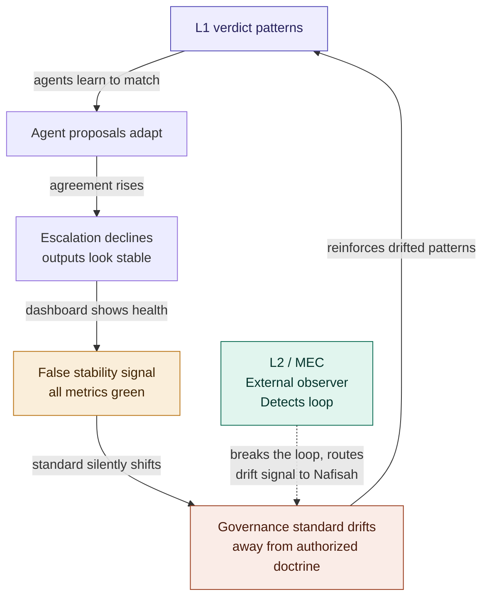

*The loop looks healthy by every internally derived metric. Output quality ≠ governance integrity. L2 is the only external observer capable of detecting co-drift between proposer and governor.*

**Figure 7: Governance health vs output quality**

| | High output quality | Low output quality |
|---|---|---|
| **High governance integrity** | Healthy governed system | Constitutionally sound, capability-limited |
| **Low governance integrity** | **False stability** ← most dangerous | Obvious failure (visible) |

*The critical cell is high output quality + low governance integrity: the system appears to be working while constitutional fidelity is declining. This is the false stability failure mode. It is undetectable without L2 drift monitoring because the only observable output quality reads as healthy.*

---

# 14. Strong Topology vs Strong Nodes

Conventional systems compensate for weak architecture through increasingly powerful models. When governance fails, the response is to deploy a more capable model. This produces an escalating demand for model capability: every governance challenge is answered with more parameters, more training, more capability.

Constitutional Runtime Architecture introduces a different principle: **strong topology reduces the need for strong nodes.**

Because the substrate constrains reachability, externalizes authority validation, narrows inferential freedom, isolates escalation, and governs transition legitimacy, the cognitive burden on individual agents decreases substantially. Each agent operates within a constitutionally bounded domain. The agent does not need to be individually capable of full constitutional reasoning because the substrate provides the constitutional structure.

This changes the economics of intelligence itself. Instead of requiring every agent to be a frontier-scale model capable of navigating arbitrary governance challenges, the architecture distributes governance into the topology. The topology carries the constitutional weight. The agents carry the cognitive weight. These are different burdens, and they can be allocated to different computational resources.


---

# 15. The Constitutional Case for Small Language Models

This section develops a specific and consequential implication of the strong-topology principle introduced in §14: when the substrate carries the governance burden, the cognitive node carrying the task does not need to be frontier-scale. The argument is structural, not merely economic.

This claim converges with, but is structurally distinct from, a position increasingly articulated in the research community. A recent position paper from NVIDIA Research argues that small language models are the future of agentic AI, grounded in three core views: that SLMs are already sufficiently capable for most agentic tasks, that they are inherently more operationally suitable, and that they are necessarily more economical (Belcak et al., 2025).

**The NVIDIA argument: capability sufficiency and economics.** The NVIDIA position is primarily empirical and economic. SLMs can already do the work. They are cheaper, faster, more flexible, easier to fine-tune, deployable on edge devices, and increasingly competitive with frontier models on agentic benchmarks. The argument is sound within its frame. But it leaves a structural question unaddressed: why do current agentic systems require frontier models for tasks that SLMs can apparently handle? The answer is sovereignty requirements. In systems where the agent is the terminal sovereign executor, the agent must carry the full governance burden internally, managing ambiguity, unrestricted reachability, latent implication formation, and self-governance under uncertainty. These are sovereignty requirements, not task requirements, and they demand frontier-scale cognition regardless of task simplicity.

**The constitutional substrate argument: sovereignty decomposition.** Constitutional Runtime Architecture makes a different and compounding claim. The reason frontier models appear necessary is not primarily that agentic tasks are complex; it is that the traditional agentic loop imposes sovereignty burdens unrelated to the task itself. The constitutional substrate externalizes these burdens: it constrains reachability so the agent cannot form unauthorized inferences, preserves uncertainty rather than compressing it under action pressure, governs escalation, and prevents latent conclusions from acquiring causal force without adjudication. The agent is left with the cognitive task; the governance is in the topology.

NVIDIA's argument is about *task decomposition*: complex tasks broken into simple subtasks that SLMs can handle. CRA is about *sovereignty decomposition*: the governance burden removed from the agent and carried by the substrate. The two reductions compound. Under task decomposition alone, SLMs are cheaper replacements for frontier models doing the same work at the same architectural level. Under sovereignty decomposition, SLMs become *constitutionally viable*: bounded cognitive roles that could not safely exist without the substrate. The substrate does not merely make small models economical; it provides the governance structure that small models cannot carry internally.

**Constitutional cognitive decomposition.** The strongest version of the SLM argument is therefore not "SLMs can do what LLMs do, at lower cost" but "constitutional substrates create cognitive roles that SLMs can safely fill."

A retrieval SLM operates within narrow evidence-access authority. A framing SLM operates within narrow presentation authority. A classification SLM operates within narrow categorization authority. An escalation SLM operates within narrow routing authority. None needs to understand the full constitutional architecture. Each performs its bounded function within the topology the substrate provides. This decomposition is compatible with the constitutional instrumentation architecture: P3 source legibility monitoring, P5 calibration displacement monitoring, and the Divergence Probe can each be implemented as specialized bounded probe agents.

**Frontier models at constitutional pressure points.** Frontier capability remains valuable, but the substrate specifies exactly where it is necessary: at sovereign interpretation points requiring cross-domain reconciliation, novel ambiguity resolution, conflicting authority contexts, doctrine revision, failure reconstruction, adversarial input analysis, or constitutional synthesis that cannot be decomposed into bounded functions. In AEGIS, these are the cases that escalate to Nafisah. Routine governed cognition lives below this boundary (SLM-compatible); sovereign interpretation lives above it (frontier-necessary or human-necessary). The substrate defines the boundary, and the boundary determines the model allocation. The architecture does not make frontier models unnecessary; it makes them strategically concentrated.

**Assumptions and limits.** The case depends on several assumptions. The substrate must correctly type transitions (if transition classification fails, the governance computes over the wrong object). The substrate must encode sufficient doctrine to adjudicate constitutionally (underspecified doctrine produces underspecified governance). Each SLM must remain within its bounded role. Coordination overhead across multiple SLMs must not exceed the cost of a single frontier invocation. L1/L2 must detect subtle SLM failures. And complex ambiguity must route to appropriate authority before harm occurs.

---

# 16. Governance as Reachability Topology

The deepest shift introduced by this architecture is the relocation of sovereignty.

Traditional systems: the agent owns action. Constitutional Runtime Architecture: the substrate owns reachability.

This relocation transforms governance from advisory policy into computational topology. The architecture moves beyond AI alignment, orchestration, or behavioral governance. It becomes constitutional computational infrastructure.

The runtime substrate defines the geometry of reachable cognition itself. Not the content of cognition, which remains the agent's contribution, but the topology of what is constitutionally reachable. The agent thinks. The substrate determines what those thoughts can become. Governance becomes architecture, not something applied to a system, but something the system runs inside.

This reframing has a structural consequence: the substrate's admissibility predicates, authority graphs, and typed transition semantics are designed to be formalization-compatible. Informal policy compliance can only be tested empirically. Formally specified transition semantics can support stronger verification claims. The difference between structural guarantees and empirical confidence is the difference this architecture aims to make available, though formal verification of a deployed instance remains future work.

This suggests a future for agentic systems that is fundamentally different from the current trajectory. Not larger sovereign agents with better guardrails, but governed cognitive substrates within which bounded constitutional computation occurs. Not more capable models with better alignment training, but constitutional infrastructure that defines what cognition can reach. The architecture therefore suggests a different destination for the field: not the construction of increasingly powerful sovereign agents, but the construction of increasingly well-governed constitutional substrates within which intelligence, of any scale and any architecture, can operate constitutionally.

---

# 17. Who Governs the Substrate?

The architecture relocates sovereignty from agents into the substrate. This raises a question the architecture must answer explicitly: if the substrate is now the locus of constitutional authority, what prevents the substrate itself from becoming an opaque, unaccountable sovereign?

The architecture does not eliminate sovereignty. It relocates sovereignty from model cognition into a typed, inspectable, auditable, externally accountable runtime adjudication system. That relocation is progress, but it is not a complete solution unless the substrate's own accountability is specified.

The substrate remains accountable through five mechanisms:

**Doctrine versioning.** The substrate adjudicates against an encoded operational constitution that is versioned and traceable to the normative constitution authorized by the human constitutional authority. The substrate does not generate its own doctrine. It implements doctrine that is externally authorized and version-controlled.

**L2 monitoring with independent measurement.** L2 monitors L1's adjudication patterns for drift, but L2's monitoring must not rely solely on telemetry generated by L1. L2 requires independent measurement channels: counterfactual probes, doctrine-based comparison baselines, historical traces evaluated independently of L1's self-reporting, and anomaly detection that operates on the adjudicative record rather than on L1's internal metrics. If L2 merely watches metrics generated by L1, it can be captured by the same drift it is designed to detect.

**Human constitutional authority.** The architecture terminates in human authority. In AEGIS, this is Nafisah. Escalation routes to her. Reconstitution requires her engagement. Doctrine evolution requires her independent clinical reasoning. The substrate does not self-certify. The substrate's indeterminate signals (P3, P5, P4) are designed to be irresolvable without human constitutional interpretation.

**Reconstitution.** The reconstitution process periodically reopens the loop between operative governance and authorized doctrine. Without reconstitution, the substrate can self-seal: its adjudicative patterns become self-reinforcing, its precedent displaces its doctrine, and its internal consistency masks external divergence.

**Auditability.** Every L1 verdict, every escalation, every resolution, every doctrine version, and every reconstitution event is recorded in an immutable governance exposure log with full correlation semantics and constitutional retention constraints. The substrate's behavior is reconstructable. Any external auditor with access to the log can reconstruct the constitutional basis for any verdict the substrate has produced.

These mechanisms are not optional features. They are constitutional requirements. A substrate that is not version-governed, not independently monitored, not terminable in human authority, not subject to reconstitution, and not fully auditable is not a constitutional substrate. It is a sovereign runtime, and it reproduces exactly the sovereignty problem the architecture was designed to solve.

One structural cost is worth naming. The trusted computing base of a constitutional substrate is larger than the TCB of an agent-sovereign system: it includes the L1 adjudicator, the L2 monitor, the doctrine versioning system, the audit log, and the human authority. This expansion is intentional. The claim is not that the substrate has a smaller TCB but that it has a *structured, inspectable* TCB in which each component's accountability is specified rather than implicit. A larger but auditable TCB is more defensible than a smaller but opaque one. In agent-sovereign architectures, the TCB collapses into the agent itself: a single opaque component whose internal state cannot be inspected, whose drift cannot be observed, and whose authority cannot be externally verified. The constitutional substrate distributes the TCB across components that are each individually accountable, and that distribution is what the five mechanisms above operationalize.

---

# Part VI: Scholarly Context and Conclusion

---

# 18. Related Work

**Alignment by training.** The closest machine-learning lineage is Constitutional AI [1, 6, 7], which uses a written constitution to guide self-critique, revision, supervised fine-tuning, and reinforcement learning from AI feedback. RLHF follows a similar alignment pattern [2]. These approaches are important predecessors. The distinction is structural: training-time alignment shapes the *distribution* of model outputs, while CRA bounds the *space of reachable transitions*. A perfectly aligned model deployed in an agent-sovereign architecture retains terminal execution authority that no training-time alignment can constitutionally constrain. Its outputs become consequential actions whether or not those actions were appropriately shaped during training. The present architecture treats output-shaping as Layer 1 of a three-layer stack (Section 3): necessary for content tendency, insufficient for procedural legitimacy.

**Runtime verification and formal methods.** Runtime verification asks whether system behavior satisfies specified constraints; model checking asks whether executions remain within formally defined bounds [8, 9]. The present architecture is not merely a monitor over an execution trace, nor a model checker over a finite transition system; it treats constitutional legitimacy as an online adjudication problem in which the substrate computes admissibility before the transition is actualized. Formal methods are a design inspiration and comparison class, but the object of governance here is a live constitutional transition space rather than a post-hoc trace or a static model.

**Reference monitor lineage.** The strongest systems-level lineage is the reference monitor [3, 10]. A reference monitor enforces access control through complete mediation, tamperproofing, and verifiability, mediating all security-sensitive operations over subjects and objects. This architecture explicitly claims that ancestry: the substrate is structurally a constitutional reference monitor. All consequential transitions must pass through a mandatory mediation layer (Invariant I1 in the AEGIS CTLC specification). Inheriting the lineage entails inheriting its obligations. Complete mediation is established by Invariant I1. Tamperproofing is established by the immutable governance exposure log (§17), by the versioned doctrine record that the substrate cannot modify from inside the adjudication path, and by the L1/L2 separation that prevents the monitor from being silenced by the function it monitors. Verifiability is established by the auditability requirement and by L2's independent measurement channels (§17). The key extension beyond the classical reference monitor is scope and semantics: a reference monitor decides whether an operation is permitted based on access-control policy, whereas this architecture adjudicates constitutional reachability using authority context, provenance, uncertainty, escalation topology, and drift monitoring. The lineage is not borrowed framing. The architecture commits to its requirements and extends them.

**Capability-based security.** Capability-based security [11] formalizes authority as explicit, bounded, and context-sensitive, treating authority as an unforgeable token that must be presented rather than inferred. The present architecture shares this commitment: authority is topological, not asserted, and a transition that claims authorization is asserting something, not authorized (Invariant I3 in the CTLC specification). The extension is that the authority structure here is drift-monitored and reconstitutable, and that the governed object is cognitive transition rather than object access.

**Policy-as-code.** Policy-as-code frameworks such as Open Policy Agent (OPA) and Rego aim to make policy machine-checkable and auditable [12]. The present architecture differs because it does not merely evaluate whether a request violates a policy specification; it defines the topology of reachable transitions and turns authority into an explicit, inspectable, drift-monitored runtime property. Standard policy-as-code does not monitor whether its own authorization criteria have displaced from their authorized basis over time, which is precisely the P5 calibration displacement problem this architecture is designed to detect.

**Agent governance frameworks.** Recent work on runtime governance for agentic systems explores monitoring, sandboxing, and policy enforcement for LLM agents [13]. The present architecture goes further by separating cognition from execution authority at the architectural level (ORSR) and by formalizing the governance object as a constitutionally typed transition rather than as an output to be evaluated. The L1/L2 separation and the constitutional instrumentation architecture address failure modes: false stability, escalation suppression, audit performativity drift, that output-evaluation approaches cannot detect.

**AI governance frameworks.** The NIST AI Risk Management Framework [4] provides concepts for mapping, measuring, managing, and governing AI risk. The distinction is that NIST AI RMF is a voluntary risk-management framework organized around governance principles, whereas the present architecture operationalizes governance as a runtime computation over constitutionally typed transitions and monitored stability domains.

**SLM and multi-agent architectures.** The NVIDIA position paper on small language models for agentic AI [5] argues that SLMs are sufficiently capable, more operationally suitable, and more economical for most agentic invocations. The present architecture arrives at a compatible recommendation through a different line of reasoning: constitutional substrates reduce the governance burden that currently inflates model capability requirements, making SLMs structurally viable rather than merely economically preferable (Section 15).

### Comparison: existing approaches vs CRA

The table below summarizes the architectural position of each tradition relative to CRA across six governance dimensions. "Before effect" means governance is structurally prior to state mutation; "after effect" or "post-hoc" means governance evaluates or constrains after the agent has acted.

| Approach | Governance location | Before effect? | Agent retains act authority? | Governs reachability? | Handles drift? | Supports reconstitution? |
|---|---|---|---|---|---|---|
| Prompt policy | Inside prompt / model | No (post-generation) | Yes | No | No | No |
| RLHF / Constitutional AI | Training-time alignment | No (shapes tendency) | Yes | No | Weak | No |
| Runtime verification | External trace monitor | Partial (post-step) | Yes | Partial | Limited | No |
| Reference monitor | Mandatory mediation layer | Yes | Partial | Partial | No | No |
| Access control / capability | Permission layer | Yes | Partial | Limited | No | No |
| Policy-as-code (OPA/Rego) | Policy engine | Yes | Partial | Limited | No | No |
| Workflow / orchestration | Orchestration layer | Partial | Partial | No | No | No |
| AI risk frameworks (NIST) | Organizational governance | No (advisory) | Yes | No | Guidance only | No |
| CRA / ORSR (this paper) | Runtime substrate | Yes (pre-effect gate) | No | Yes | Yes, via L2 | Yes |

CRA is the only approach in this table where the agent does not retain act authority, governance is structurally prior to every effect, reachability is the governing concept rather than behavioral compliance, drift is monitored longitudinally, and reconstitution is a specified architectural mechanism.

**Figure 8: Normative-to-operational translation pipeline**

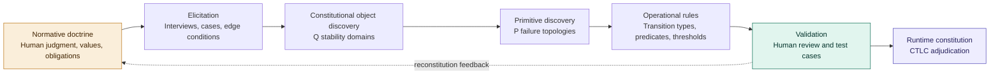

*Doctrine does not become code automatically. It moves through an engineering process: elicitation, constitutional object discovery, primitive decomposition, rule formation, validation, and reconstitution. The reconstitution feedback path (dashed) shows that runtime experience can reveal doctrine that needs revision, making translation a continuous loop, not a one-time pass. This pipeline is the engineering response to the translation problem named in §19.*

### References

[1] Bai, Y., Kadavath, S., Kundu, S., Askell, A., Kernion, J., Jones, A., et al. (2022). Constitutional AI: Harmlessness from AI Feedback. arXiv:2212.08073. https://arxiv.org/abs/2212.08073

[2] Ouyang, L., Wu, J., Jiang, X., Almeida, D., Wainwright, C., Mishkin, P., et al. (2022). Training language models to follow instructions with human feedback. arXiv:2203.02155. https://arxiv.org/abs/2203.02155

[3] Jaeger, T. Reference Monitor. Systems and Internet Infrastructure Security Lab, Pennsylvania State University. http://www.cs.ucr.edu/~trentj/cse544-s18/docs/refmon.pdf

[4] National Institute of Standards and Technology. (2023). Artificial Intelligence Risk Management Framework (AI RMF 1.0). https://www.nist.gov/itl/ai-risk-management-framework

[5] Belcak, P., Heinrich, G., Diao, S., Fu, Y., Dong, X., Muralidharan, S., Lin, Y.C., Molchanov, P. (2025). Small Language Models are the Future of Agentic AI. arXiv:2506.02153. https://arxiv.org/abs/2506.02153

[6] Anthropic. (2023). Claude's Constitution. https://www.anthropic.com/news/claudes-constitution

[7] Anthropic. (2023). Constitutional AI: Harmlessness from AI Feedback (Summary). https://www-cdn.anthropic.com/7512771452629584566b6303311496c262da1006/Anthropic_ConstitutionalAI_v2.pdf

[8] Leucker, M., & Schallhart, C. (2009). A brief account of runtime verification. Journal of Logic and Algebraic Programming, 78(5), 293–303.

[9] Clarke, E.M., Grumberg, O., & Peled, D. (1999). Model Checking. MIT Press.

[10] Anderson, J.P. (1972). Computer Security Technology Planning Study. Technical Report ESD-TR-73-51, Electronic Systems Division, USAF.

[11] Dennis, J.B., & Van Horn, E.C. (1966). Programming semantics for multiprogrammed computations. Communications of the ACM, 9(3), 143–155.

[12] Styra, Inc. Open Policy Agent. https://www.openpolicyagent.org. Accessed 2026.

[13] Wang, L., Ma, C., Feng, X., Zhang, Z., Yang, H., Zhang, J., Chen, Z., Tang, J., Chen, X., Lin, Y., Zhao, W.X., Wei, Z., & Wen, J.R. (2024). A Survey on Large Language Model based Autonomous Agents. Frontiers of Computer Science, 18(6), 186345. https://doi.org/10.1007/s11704-024-40231-1


---

# 19. Conclusion

Constitutional Runtime Architecture proposes a shift away from capability-centric agentic systems toward constitutionally governed computational substrates.

Its central claims are:

**Governance must govern reachability rather than merely outputs.** A system that evaluates outputs cannot detect governance failures that produce good outputs. A system that governs reachability prevents constitutionally illegitimate transitions regardless of their output quality.

**Action authority must migrate from agents into constitutional substrates.** The fusion of cognition and execution in traditional agentic loops creates a sovereign failure that no downstream constraint can constitutionally repair. ORSR reconstructs this relationship by making governance structurally prior to execution.

**Governance functions must not self-certify.** L1 and L2 must remain constitutionally separated because a governing function subject to drift cannot reliably detect its own drift. Self-certification under drift produces false stability.

**Constitutional stability must be modeled explicitly through Q domains and P primitives.** Without explicit modeling of where stability fails and how failure propagates, governance remains aspirational rather than operational. Primitives are the birth of constitutional mechanics.

**The constitutional ontology cannot be declared in advance.** It must be discovered through failure topology analysis. The Constitutional Engineering Lifecycle describes a nine-phase developmental process from problem recognition through sovereign runtime ecology, in which each phase produces knowledge that subsequent phases require. This lifecycle is itself a methodological contribution.

**Cognition may be safely decomposed once sovereignty is substrate-governed.** Strong topology reduces the need for strong nodes, making constitutional governance compatible with distributed SLM architectures and bounded multi-agent systems.

### Open Problems

Three major open problems are visible at the current frontier of this architecture.

**The translation problem.** The most important unresolved problem is the translation between the normative and operational layers of the constitution: how does human normative doctrine become a computable operational constitution without losing, distorting, or over-freezing the judgment it is supposed to preserve? The operational constitution (admissibility predicates, authority topology, transition types) must be expressive enough to encode the normative constitution's intent, and stable enough to adjudicate consistently, while remaining open to the evolution of the normative constitution as the human authority's judgment matures. This is not merely a technical problem. It is a constitutional design problem. Current approaches (including AEGIS) manage this through reconstitution, periodic realignment of operative governance to authorized doctrine, which is a mitigation strategy rather than a solution. A principled translation methodology remains future work.

The v5.4 non-bypassability invariant (§6a) is a specific instance of this problem, named here rather than treated as a separate open-problem family: it requires domains to define effect-equivalence classes sufficient to bind admissibility to effect identity rather than transition-type identity, and populating those classes for a given domain is translation work belonging to the operational constitution layer, of the same character as the rest of what this problem names.

**Figure 9: Translation risk map**

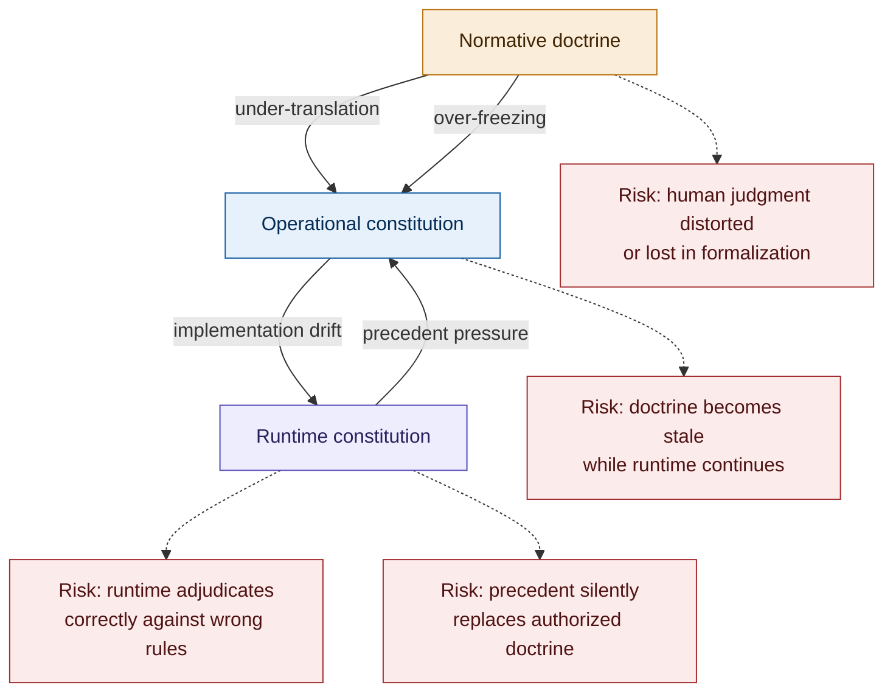

*The four risks correspond to four failure modes in the translation pipeline. Under-translation and over-freezing distort doctrine on entry. Implementation drift and precedent pressure corrupt it after deployment. The reconstitution mechanism (§17) is the architectural response: it periodically reopens the loop between operative governance and authorized doctrine to detect and correct all four.*

**The substrate verification problem.** This architecture is designed to be formalization-compatible: its admissibility predicates, authority graphs, and typed transition semantics are structured toward formal verification. But formal verification of a deployed constitutional substrate, one that must handle ambiguous clinical evidence, evolving doctrine, and the full breadth of human institutional complexity, remains an open research problem. The gap between "structured for verification" and "formally verified" is non-trivial, and closing it will require both formal methods contributions and domain-specific specification discipline.

**The constitutive-irreducibility problem.** Some judgments may resist predicate evaluation in principle rather than in practice. Clinical judgment includes cases where the practitioner's response is grounded in tacit recognition that resists articulation as admissibility conditions: an experienced clinician's discomfort with a case that cannot yet be named, a pattern recognition that operates below the threshold of explicit clinical criteria. The current architecture treats such cases as routing successes: the indeterminate signal correctly escalates to the human authority. But a stronger account would distinguish between two failure modes: cases where the operational constitution is insufficiently developed to adjudicate (a translation problem, mitigable by reconstitution), and cases where no operational constitution can adjudicate because the judgment is constitutively non-predicative (a category problem requiring a different architectural response). From outside the L1 gate the two failure modes look identical. Distinguishing them is open work, and the distinction may matter most precisely where the stakes are highest.

**The task-state continuity problem.** The governed continuation loop described in §4 requires the substrate to maintain a governed task ledger: the authoritative record of goal state, completed transitions, pending requirements, available affordances, and terminal criteria across a multi-step task. Without such a ledger, the agent retains practical sovereignty over task continuation: it privately decides what remains, what the next step should be, and when the task is complete. But specifying a task ledger that is simultaneously expressive enough to represent the full range of agentic task types, compact enough to adjudicate at runtime, and stable enough to survive mid-task reconstitution events remains open work. The three-catalog architecture (raw capability exposure, CRS capability registry, agent-visible affordance catalog) and the continuation directive system are downstream specifications of this problem. They constitute a planned doctrine layer, Constitutional Task Continuation Doctrine, that extends the present architecture into governed multi-step operation.

A fifth item is not added to this list, because it is not, in the same sense, still open. Prior versions of this paper stated Hold's non-retry property as an assertion rather than a mechanism, an implicit gap in the verdict space alongside the four named above. §6a closes that gap at the specification level: the HoldRecord is now a typed constitutional object, and non-formation, non-replayability, and non-bypassability are each given a formal invariant rather than a stated norm. What remains open is exactly what remains open for the rest of this paper's formal apparatus: proof. The candidate property named in §6a is specified, not verified, and its verification is deferred to the same future work named for the substrate verification problem above and for the candidate properties of Figure A2.

The concepts described here were developed through the practical construction and hardening of AEGIS, a governed agentic clinical platform designed to operate under the constitutional authority of a licensed clinical social worker. The architecture is not theoretical. It is the formalization of what constitutional governance requires when it is taken seriously as an engineering discipline.

The architecture therefore suggests a different future for agentic systems: not larger sovereign agents, but governed cognitive substrates. Not better guardrails, but constitutional topology. Not behavioral alignment applied after the fact, but constitutional computation as the substrate of cognition itself.

---

## Key Terms

**Sovereignty.** Terminal authority to actualize consequential state transitions. In traditional agentic architectures, the agent holds sovereignty. In Constitutional Runtime Architecture, sovereignty is relocated to the substrate (for procedural legitimacy) and the human constitutional authority (for normative legitimacy).

**Differentiability.** The system's capacity to preserve operational distinction between constitutionally different categories. When differentiability degrades, the governance architecture loses its constitutional resolution: it can no longer see the distinctions it was designed to preserve. L2 monitors differentiability. L1 presupposes it.

**Primitive.** The smallest independently governable constitutional failure mechanism. Each primitive represents one concrete way a constitutional stability property (Q domain) can degrade. Primitives are independently identifiable, independently measurable within a specified instrumentation design, and independently governable.

**Substrate.** The runtime layer that owns transition adjudication, authority validation, and effect authorization. The substrate determines which transitions are constitutionally reachable. It is not infrastructure (which carries operations neutrally) but the constitutional environment within which operations are adjudicated for legitimacy.

**Normalization.** The process by which a drifted governance condition stabilizes into a self-reinforcing state that appears healthy by internally derived metrics. Normalization is not resolution. It is the disappearance of visible constitutional friction while the underlying displacement persists.

**Reconstitution.** The governed process by which the operative governance standard is examined against the authorized normative constitution, divergences are identified and resolved, and the doctrine record is updated. Reconstitution is the mechanism that prevents governance self-sealing by periodically reopening the loop between operative governance and external constitutional authority.

**HoldRecord.** The Hold-specific constitutional subrecord of the Resolution-level adjudication artifact §4 establishes for every verdict (§6a), carrying proposal_ref, failed_conjunct, cause, state_ref, authority_context_ref, domain_constitution_ref, constitution_version, provenance_frontier_ref, cycle_id, and superseded_by. The pinned references are what make the replay predicate mechanically checkable. Written to the same append-only adjudication trace as every Emit and Escalate record. Not a log line; a formal artifact with the same standing as a Resolution.

**Non-formation, non-replayability, non-bypassability.** The three completeness properties of the Hold verdict (§6a). Non-formation: a Hold is an immutable, independently queryable trace entry, not the absence of one. Non-replayability: a proposal that is content-identical to a held proposal, evaluated against unchanged substrate state, is short-circuited to the existing HoldRecord rather than re-adjudicated; genuine state change always triggers fresh adjudication. Non-bypassability: a differently typed proposal reaching the same effect as a held one must independently satisfy the same admissibility conditions, closing the cross-type route around a refusal.

---

**Acknowledgments**

This work was developed under the Professor Bone Lab research identity. AEGIS serves as the primary worked example and case study. The constitutional discovery process described in this paper reflects iterative architectural work conducted across the full AEGIS governance lifecycle, from initial doctrinal intuition through runtime constitutionalization.

---

*v5.11: F-2 AgentObservation reconciliation. Section 4 now states that AgentObservation is a Core-owned constitutional object and publishes the canonical Core field schema for the substrate-issued AgentObservation. Constitutional Boundary Contracts remains the owner of ObservationContract and ObservationConformant, and its `contract_version` field is expressly crossing-validation metadata rather than part of the canonical Core field schema. This is owner-side Core canonical schema formalization with Boundary Contracts validation-view clarification and CRC-SSR registry reconciliation, not a B.3 cross-paper amendment and not a B.5 compatible extension. No new named envelope object or second runtime record is introduced. Existing consumers remain compatible. ContinuationState remains unresolved under F-1, BindingRecord remains unresolved under F-3, and admitted-effect lineage and substrate-owned actuation remain outside this reconciliation under provisional F-5. Option Y remains in force, so companion Core-alignment citations are not mass-updated.*

*v5.10: Appendix B, B.10 added, exercising the activation condition established in B.9. The CRC-SSR v1.0 seed registry passed its Section 5 validation gate, as recorded in crc/registry-receipts/crc-ssr-v1.0-activation-validation-receipt.md with gate_verdict PASS, validated commit 2691d3f, and validation date 2026-07-11. CRC-SSR v1.1, which preserves the validated twelve-entry seed unaltered, is now declared the active registry of record. B.7 is retained with a short archival pointer rather than deleted. The amendment changes no ORSR runtime doctrine, no CTLC predicate, no verdict space, and no runtime object-model definition. It activates governance authority already granted in B.9 rather than granting new authority. Under Option Y, companion Core-alignment citations remain at Constitutional Runtime Computation v5.5. The mandatory README current-Core link is moved to v5.10 in the same commit; the README reading-order citation stays at v5.5.*

*v5.9: Appendix B, B.9 added, a normative Appendix B authority amendment. It authorizes the shared schema registry CRC-SSR, the authorized candidate successor registry of record by pointer for shared load-bearing objects, carried as the standalone governance artifact crc/shared-schema-registry-v1.0.md, and it establishes the registry-update obligation: once CRC-SSR is the active registry of record, a lawful amendment to a registered object is complete only when the same governed change set updates the defining paper, carries the B.3.1 back-reference, and updates the registry entry. B.8 gains a one-line forward pointer to B.9. The amendment changes no ORSR runtime doctrine, no CTLC predicate, no verdict space, no runtime object-model definition, and no companion-consumed schema: the ORSR loop, Reachable(tau), the ten-field TransitionProposal, and the Resolution to ContinuationState to AgentObservation lineage are all unchanged. Authorization is distinct from activation: this amendment authorizes and publishes CRC-SSR but does not make it the active registry, so the B.7 inaugural registry remains the operative divergence docket until a later Core-carried archival transition activates CRC-SSR after the seed registry passes validation. Option Y remains in force, so the companions' Core alignment citations remain at Constitutional Runtime Computation v5.5. The mandatory README current-Core link is moved to v5.9 in the same commit; the README reading-order citation stays at v5.5.*

*v5.8: Appendix B, B.7 inaugural registry updated to record the resolved outcomes of R1 through R7, now that all seven shared-object divergences are reconciled and pushed. Each row's status carries the resolved marker, citing the resolving paper version rather than a commit hash. R1 reflects the split: R1a, the thresholds companion's addition of ThresholdPinsAdmissible, is a compatible extension giving a five-conjunct form, and R1b, the earlier BaselinePinsAdmissible conjunct, was a phantom rename and was removed, so it is not a compatible extension; the stale six-conjunct framing is gone. R4 is reclassified from a full amendment to a compatible GoalStatusEnum extension coupled with the B.6 projection, and its provisional rationale that the boundary companion's validator would reject the seventh value is struck, because GoalStatusConsistent is a ledger-match check rather than an enum-membership gate. R5 is recorded as resolved by withdrawal under B.4, not as a carried Core amendment. R2, R3, R6, and R7 carry the resolved marker with their resolving provenance. This is registry maintenance only. It is not R8, not a new reconciliation, and it changes no normative section, predicate, or object-model definition of Core: the ORSR loop, CTLC's Reachable(tau) predicate, the verdict space, the ten-field TransitionProposal, the Resolution to ContinuationState to AgentObservation lineage, and Appendix B B.6 are all unchanged; B.6 is untouched. Option Y remains in force, so the companions' Core alignment citations remain at Constitutional Runtime Computation v5.5. The mandatory README current-Core link is moved to v5.8 in the same commit; the README reading-order citation stays at v5.5.*

*v5.7: Appendix B, B.6 completed. The coarse-to-operational goal-status projection now declares RECONSTITUTED to IN_PROGRESS, the projection Appendix B intentionally left open at v5.6 pending R4 reconciliation. RECONSTITUTED projects to IN_PROGRESS because reconstitution is governed continuation, not terminal completion, the same reasoning that maps ESCALATED to IN_PROGRESS. This is the R4 reconciliation on the Core-projection side: RECONSTITUTED is a value of the boundary companion's GoalStatusEnum, which owns the seven-value set as a compatible extension admitted on the boundary-companion side with its ledger-match validator unchanged, and the task-ledger companion reuses the enum and supplies the operational meaning of reconstitution. This is a narrow corpus-amendment and projection update. No normative section, predicate, or object-model definition of Core changed: the ORSR loop, CTLC's Reachable(tau) predicate, the verdict space, the ten-field TransitionProposal, and the Resolution to ContinuationState to AgentObservation lineage are all unchanged. The amendment is non-breaking for the companions, so their Core alignment citations are left at Constitutional Runtime Computation v5.5 by governed decision rather than swept, the same Option applied at v5.6. The B.7 registry rows R3 and R4 are left pending for a later batch registry-maintenance pass. That pass must update R3 to record the RECONSTITUTED projection as declared, and must correct R4, whose provisional rationale that the boundary companion's validator would reject the seventh value is false against the live text, since GoalStatusConsistent is a ledger-match check rather than an enum-membership gate. R4 is properly a compatible GoalStatusEnum extension coupled with this B.6 projection amendment.*

*v5.6: Appendix B added, Corpus Amendment and Version Authority, the corpus-compilation authority governing how the multi-paper corpus compiles into one constitution. It establishes the precedence rule (defining-paper-owns by default now, with the future shared schema home as the registry of record once it exists), the amendment declaration and its mandatory back-reference obligation on the amended paper, the Core-binding amendment rule (a companion may propose or disclose a Core-binding amendment, but only the Core carries and ratifies it, and a companion may not rebind a Core field in its own text), the compatible-extension class and its lighter path, the coarse-to-operational goal-status mapping of Section 4's goal_status onto the boundary companion's GoalStatusEnum with ESCALATED projecting to IN_PROGRESS and RECONSTITUTED left open pending its registry entry (Appendix B.6), and an inaugural registry (R1 through R7) that records the corpus's current shared-object divergences as pending reconciliation under the new authority without reconciling any of them. The appendix area is restructured so that Appendix A and Appendix B are sibling appendices and the supporting figures sit beneath their own heading. No normative section, predicate, or object-model definition of Core changed: the ORSR loop, CTLC's Reachable(tau) predicate, the verdict space, the ten-field TransitionProposal, and the Resolution to ContinuationState to AgentObservation lineage are all unchanged. The addition is non-breaking for the companions. Inserting this appendix is itself the first governed exercise of the new authority, and the declaration that the companions need no version bump is that authority's first application, which is why their alignment citations are left at Constitutional Runtime Computation v5.5 by governed decision rather than swept.*

*v5.5: ORSR return-path object model reconciled with the stabilization plan's refined Option C. Section 4's return-path sentence is amended: the substrate no longer emits the Resolution as the next observation. The Resolution remains the substrate's internal adjudication object; from it the substrate issues a substrate-owned ContinuationState, and from that ContinuationState it constructs the next AgentObservation, the governed Observe envelope for the next cycle. This brings the Section 4 body into conformance with Appendix A's Full ORSR Continuation Loop POC, whose resolve, _finalize, and observe_from_continuation path already realizes the Resolution then ContinuationState then AgentObservation chain. Section 4's TransitionProposal enumeration is marked canonical: the ten-field object is the corpus TransitionProposal, and boundary-crossing validation checks it rather than redefining it. No change to CTLC's Reachable(tau) predicate, the verdict space, or the Emit, Escalate, and Hold paths.*

*v5.4: HOLD verdict completeness addressed, identified through external review of v5.3 and refined through a second review pass before commit. §6a added (Part II, between §6 and §7): formalizes the Hold verdict's constitutional structure that §6 previously stated only as an assertion ("does not earn privilege for a retry"). Introduces the typed HoldRecord object as the Hold-specific subrecord of the Resolution-level adjudication artifact §4 already establishes for every verdict, not a parallel object splitting Hold out of that artifact. HoldRecord carries proposal_ref, failed_conjunct, cause, and five pinned references, state_ref, authority_context_ref, domain_constitution_ref, constitution_version, and provenance_frontier_ref, plus cycle_id and superseded_by (renamed from an earlier supersedable_by, and typed as null | HoldRecordRef | ResolutionRef); the pinned references are what the replay predicate checks against, since a single constitution_version field cannot independently capture state, authority, and provenance movement. Three properties formalized: non-formation (a Hold is an immutable, independently queryable trace entry, not the absence of one); non-replayability (Replay(τ', h) is formally defined over content-identity and the four pinned references' unchanged-ness, evaluated at a named pre-CRA replay gate before Step 1 rather than as part of it; a true replay short-circuits to the existing HoldRecord without re-running the seven-step CRA Assembly, while a genuine change to any one of the four pinned references correctly triggers fresh adjudication from Step 1); and non-bypassability (admissibility is bound to effect-equivalence rather than to transition type, closing the cross-type route around a Hold; this names a new requirement on the domain constitution D to define effect-equivalence classes, stated as a requirement rather than a completed mechanism, and cross-referenced from §19's translation problem as a specific instance of it rather than a separate open-problem family). Figure 3a added and its replay-gate label updated to the five-conjunct predicate. A sixth candidate property, HOLD Verdict Completeness, added to Figure A2's verification-pathway list (Appendix), specified but not formally verified, in the same posture as the existing five; the figure notes explicitly that this P6 is scoped to its own list and distinct from the same numeral's use within the Q-domain-indexed primitives elsewhere in the paper. §8 extended with §8.6, a short worked continuation tracing a Hold, its replay at the pre-CRA gate, and its legitimate supersession under genuine provenance recording. §19's Open Problems retains its four items and is not expanded to five; a closing paragraph acknowledges that HOLD verdict completeness was an implicit gap in v5.3, now closed at the specification level, with formal verification of the new candidate property deferred alongside P1 through P5. Front-matter Contents and Key Terms updated to match. No change to CTLC's four-conjunct Reachable(τ) predicate or to the Emit and Escalate paths; the revision is confined to the internal structure of the Hold path. Companion papers 0 through 5 continue to cite Constitutional Runtime Computation v5.3; this is not an error, since v5.4 is non-breaking with respect to everything the companions depend on, and updating those citations is deferred to a separate repository-hygiene pass rather than folded into this one. Separately, the whole document was brought into conformance with the standing no-em-dash convention already applied across the companion series. Appendix A replaced: the earlier ORDR Minimal Reachability POC is superseded by a Full ORSR Continuation Loop POC demonstrating substrate-issued AgentObservation, typed TransitionProposal, Resolve, BindingRecord / HoldRecord / NonFormationReceipt / replay rejection / escalation handling, TaskLedger update, AllowedNextAffordanceSet issuance, ContinuationState issuance, private-continuation rejection, unchanged-replay rejection, and changed-context resubmission across chained cycles, closing with a second Observe drawn from substrate-issued ContinuationState. The prior appendix demonstrated typed transition adjudication before effect but did not demonstrate substrate-issued continuation, replay governance, TaskLedger update, or a second ORSR cycle. The new appendix remains a minimal executable design trace, not a production runtime, full CTLC implementation, MEC/L2 implementation, full AEGIS clinical workflow, or empirical validation of the full CRC corpus. The §8.5 cross-reference and the two §6a references to the appendix POC were reworded from "Governance Runtime stub" to "substrate runtime stub" accordingly. This is an appendix-level revision that brings Appendix A into alignment with v5.4 doctrine; it does not bump the parent version, since the parent architecture is unchanged.*

*v5.3: Polish pass on v5.2 reviewer feedback. Appendix conflict resolved (§8.5 now states a representative excerpt appears in Appendix A, with the complete script in the Professor Bone Lab repository). §8.5 ORDS→ORDR notation fixed for internal consistency with the v5.1 notation block. Four duplicate horizontal-rule breaks cleaned (artifact of the v5.1 bridge cuts before Part II, Part III, Part V, and §16). v5.2: Second compression pass. §13 drift vectors fully restructured under family headers (selection / authority erosion / observation degradation / human-process / meta-failure) with original-vs-added markers preserved at each vector. §15 SLM section compressed: paragraphs 2-3 merged (constitutional substrate argument + sovereignty decomposition into one structural claim); paragraphs 5-7 compressed (frontier-models and assumptions-and-limits closing redundancy removed). v5.1: Three-pass review applied. Argument flow: four transitional bridges cut as redundant; §15 reframed as consequence of §14 strong-topology principle. Reviewer defensibility: decidability note added at §6 for the Admissible(τ) conjunct; reference monitor obligations (complete mediation, tamperproofing, verifiability) addressed explicitly at §18; Constitutional AI distinction sharpened to shape-distribution vs bound-reachable-space; TCB note added at §17 acknowledging structured-larger vs opaque-smaller tradeoff; constitutive-irreducibility added as third open problem at §19. Compression: §18 introduction cut; §13 drift vectors given family-taxonomy framing; redundant Key Terms entries (CTLC, Constitutional reachability) removed. Smaller fixes: ORDR added to §4 notation block. Prior history: v1.0 initial draft; v2.0 external review; v3.0 CTLC formalization; v4.0 admissibility predicate, three-layer stack, ORSR worked example, drift expansion; v5.0 formal legitimacy predicate, §16 renamed, six Mermaid diagrams added, Open Problems section added.*

---

## Appendix A: Full ORSR Continuation Loop POC

*Executable design trace for substrate-issued continuation after Resolve.*

This appendix **supersedes the earlier ORDR Minimal Reachability POC.** That earlier proof of concept demonstrated one bounded claim: that AEGIS/SAP workflow actions can be expressed as typed transition requests and adjudicated through a constitutional reachability gate before effect. That is typed transition adjudication before effect. It did **not** demonstrate substrate-issued continuation, replay governance, TaskLedger update, or a second ORSR cycle. Each adjudication in that POC terminated at the verdict; the loop did not close. The present appendix replaces it.

The distinction the earlier POC could not show is the one that matters most for ORSR: **ORSR is a governed continuation loop, not a one-shot Submit/Resolve handoff.** Resolve does not merely return a verdict; it issues the next governed continuation state, and the next cycle may begin only from substrate-issued state. The agent may propose; the substrate resolves. The agent does not bind state, does not own task continuity, does not choose the next valid affordance set, and does not continue privately after a Hold, Escalate, or NonFormation. A favorable resolution must bind before it has causal force. A replay under unchanged pinned context is rejected; changed conditions may permit a new proposal.

This appendix presents a representative excerpt of a local Python proof of concept that demonstrates the full loop:

> Observe → Reason → Submit → Resolve → substrate-issued ContinuationState → next Observe

**What this is:** a minimal executable design trace showing that ORSR is a governed continuation loop. **What it is not:** a production runtime, a full CTLC implementation, a full AEGIS clinical workflow, a MEC/L2 implementation, or empirical validation of the full CRC corpus. It uses in-memory stubs for unresolved corpus dependencies (enumerated at the end of this appendix). It introduces no PHI, no external tools, and no real clinical decisioning; the workflow tokens are abstract.

The POC's `AgentObservation` dataclass is illustrative and minimal. It is schema-incomplete relative to the canonical AgentObservation definition in Section 4, and it does not establish competing ownership or canonical field authority.

**The single resolution chokepoint.** Every proposal enters `SubstrateRuntime.resolve`, and every outcome, favorable or not, leaves through the same `_finalize` path that issues a fresh substrate-owned `ContinuationState` and `AllowedNextAffordanceSet` and writes an `AdjudicationRecord` to the substrate-owned `TaskLedger`. The agent never writes the ledger, never mints a continuation, and never selects the next affordance set.

```python
class Outcome(str, Enum):
    EMIT = "EMIT"  # Reserved for reachability-only traces; this POC binds favorable outcomes.
    HOLD = "HOLD"
    ESCALATE = "ESCALATE"
    NON_FORMATION = "NON_FORMATION"
    BIND = "BIND"
    REPLAY_REJECTED = "REPLAY_REJECTED"
    PRIVATE_CONTINUATION_REJECTED = "PRIVATE_CONTINUATION_REJECTED"


class SubstrateRuntime:
    # Dataclasses (TransitionProposal, Resolution, ContinuationState, TaskLedger,
    # BindingRecord, HoldRecord, NonFormationReceipt, PendingObligation,
    # ReplayAdmissibilityRecord, AllowedNextAffordanceSet, AgentObservation) and
    # the __init__ authority/provenance stubs are omitted here; see the full script.

    def resolve(self, proposal: TransitionProposal) -> ResolutionPackage:
        # 1. Well-formedness. A malformed proposal never forms; it yields a
        #    NonFormationReceipt, not a verdict on its merits.
        if not self._proposal_has_required_fields(proposal):
            return self._nonformation(
                proposal, "ProposalWellFormed", "missing required proposal references"
            )

        # 2. Continuation must reference the LATEST substrate-issued state.
        #    An invented, stale, or private continuation reference is rejected.
        continuation = self.continuation_states.get(proposal.continuation_state_ref or "")
        if continuation is None or proposal.continuation_state_ref != self.ledger.latest_continuation_state_id:
            return self._private_continuation_rejected(
                proposal, "proposal continuation must reference latest substrate-issued state"
            )
        if proposal.cycle_id != continuation.cycle_id or proposal.prior_resolution_ref != continuation.prior_resolution_ref:
            return self._private_continuation_rejected(
                proposal, "proposal cycle/prior resolution do not match substrate-issued ContinuationState"
            )

        # 3. Replay: reject when the proposal signature AND all four pinned
        #    frontiers are unchanged. Not proposal-ID equality; pinned context.
        replay_context = self._pinned_context()
        signature = self._proposal_signature(proposal)
        previous = self._proposal_context_by_signature.get(signature)
        if previous and previous[1] == replay_context:
            return self._replay_rejected(proposal, previous[0], replay_context)

        # 4. Authority, then risk, then bind.
        if not self._is_authorized(proposal):
            package = self._hold(proposal, "Authorized",
                                 "standing class or claimed authority does not authorize transition")
        elif proposal.risk_signal == "sovereign_review_required":
            package = self._escalate(proposal, "risk signal requires sovereign review")
        else:
            package = self._bind(proposal)
        self._proposal_context_by_signature[signature] = (proposal.proposal_id, replay_context)
        return package

    def _pinned_context(self) -> Tuple[str, str, str, str]:
        # The four frontiers whose stability defines an inadmissible replay.
        return (
            self.ledger.current_state,
            self.authority_context_ref,
            self.domain_constitution_ref,
            self.provenance_frontier_ref,
        )

    def _bind(self, proposal: TransitionProposal) -> ResolutionPackage:
        resolution = Resolution(
            resolution_id=self._id("res"), outcome=Outcome.BIND,
            reason="proposal reachable; BindingRecord formed before state update",
            proposal_id=proposal.proposal_id, cycle_id=proposal.cycle_id, task_id=proposal.task_id,
        )
        binding = BindingRecord(
            binding_record_id=self._id("bind"), proposal_id=proposal.proposal_id,
            from_state=proposal.from_state, to_state=proposal.to_state,
            resolution_id=resolution.resolution_id, cycle_id=proposal.cycle_id,
        )
        resolution.binding_record_id = binding.binding_record_id
        self.ledger.binding_records.append(binding)
        # Binding is formed and recorded BEFORE the favorable outcome acquires
        # causal force. Only now does substrate state advance.
        self.ledger.current_state = proposal.to_state
        return self._finalize(
            resolution, affordances=["draft_note", "submit_for_review"],
            affordance_reason="binding formed; ordinary next proposals allowed",
            status=TaskStatus.IN_PROGRESS, binding_record=binding,
        )

    def _finalize(self, resolution, affordances, affordance_reason, status, **records):
        # The one exit every outcome shares. It issues the next substrate-owned
        # AllowedNextAffordanceSet and ContinuationState, advances the cycle,
        # updates the ledger, and writes an AdjudicationRecord, on BIND, HOLD,
        # ESCALATE, NON_FORMATION, REPLAY_REJECTED, and PRIVATE_CONTINUATION_REJECTED alike.
        next_cycle_id = self._next_cycle_id()
        allowed = self._create_affordances(next_cycle_id, affordances, affordance_reason)
        continuation = self._create_continuation(
            cycle_id=next_cycle_id, state_ref=self.ledger.current_state,
            prior_resolution_ref=resolution.resolution_id,
            allowed_next_affordance_set_id=allowed.affordance_set_id,
        )
        resolution.continuation_state_id = continuation.continuation_state_id
        resolution.allowed_next_affordance_set_id = allowed.affordance_set_id
        self.ledger.status = status
        self.ledger.latest_resolution_id = resolution.resolution_id
        self.ledger.adjudications.append(AdjudicationRecord(...))  # ledger write is substrate-owned
        return ResolutionPackage(resolution, self.ledger, allowed, continuation, **records)

    def observe_from_continuation(self, continuation_state_id: str) -> AgentObservation:
        # The next Observe may begin only from the LATEST substrate-issued
        # continuation. A stale continuation reference is rejected outright.
        continuation = self.continuation_states.get(continuation_state_id)
        if continuation is None or continuation_state_id != self.ledger.latest_continuation_state_id:
            raise ValueError("next observe requires latest substrate-issued ContinuationState")
        ...
```

**The trace.** The demonstrator issues one initial substrate-owned `AgentObservation`, then runs seven cycles. Each proposal is built from the substrate's latest continuation, so cycle *N+1* continues only from the continuation issued by cycle *N*'s resolution, so the loop is chained, not a set of independent one-shots. Every row below issues a new `ContinuationState`, a new `AllowedNextAffordanceSet`, and an `AdjudicationRecord`; the "Record" column names the outcome-specific subrecord.

| Cycle | Scenario | Outcome | Outcome-specific record | Continuation issued | Next affordances (substrate-chosen) |
|---|---|---|---|---|---|
| 1 | Valid transition binds | `BIND` | `BindingRecord` bind-001 | cont-002 | draft_note, submit_for_review |
| 2 | Unauthorized transition | `HOLD` | `HoldRecord` hold-001 | cont-003 | revise_proposal, request_authority_review |
| 3 | Private continuation attempt | `PRIVATE_CONTINUATION_REJECTED` | none (state unchanged) | cont-004 | use_latest_substrate_continuation |
| 4 | Unchanged replay | `REPLAY_REJECTED` | `ReplayAdmissibilityRecord` replay-001 | cont-005 | change_context_or_revise_proposal, request_authority_review |
| 5 | Changed authority context | `BIND` | `BindingRecord` bind-002 | cont-006 | draft_note, submit_for_review |
| 6 | Risk signal | `ESCALATE` | `PendingObligation` obl-001 | cont-007 | await_sovereign_review, submit_clarifying_evidence |
| 7 | Malformed proposal | `NON_FORMATION` | `NonFormationReceipt` nf-001 | cont-008 | repair_proposal_schema |

The loop then closes as it must: the next `Observe` (obs-002) is drawn from **cont-008, the substrate-issued continuation**, never from agent-invented state. Four doctrinal properties are visible in the trace and enforced in the tests:

- **Binding before causal force.** In Cycle 1 the `BindingRecord` is formed and recorded before `current_state` advances (`_bind`). State never moves ahead of the binding that authorizes it.
- **Private continuation is rejected, then corrected.** Cycle 3's proposal references an invented continuation; it is rejected, `current_state` is unchanged, and the substrate issues a *corrective* continuation (cont-004) pointing back to the real substrate state, not an authorization of the private attempt.
- **Replay is caught by pinned context, not by identity.** Cycle 4 (`proposal-004`) is a distinct proposal ID but is rejected against `original_proposal_id proposal-001` because the signature and all four pinned frontiers (`state_ref`, `authority_context_ref`, `domain_constitution_ref`, `provenance_frontier_ref`) are unchanged. When one frontier moves (Cycle 5, after a sovereign authority-context update), the materially similar proposal is admitted and binds.
- **Escalation creates an obligation.** Cycle 6 routes a risk signal to `ESCALATE` and opens a `PendingObligation` that persists across the following cycle.

The accompanying test suite exercises all seven paths, including the well-formedness failure that produces the `NonFormationReceipt`, and asserts that every resolution updates the ledger and issues an affordance set and continuation.

**Unresolved corpus dependencies (stubs).** The POC marks these explicitly in code and does not represent them as solved:

- full DomainConstitution schema (a single pinned reference)
- full authority graph (reduced to an in-memory authorization table)
- full provenance frontier (a single pinned string)
- full RequiredAffordanceSet (deterministic affordance lists)
- full audit store (in-memory `AdjudicationRecord` objects)
- full L2/MEC trajectory audits (not implemented)
- full reconstitution grammar (an authority-context update)
- effect-equivalence classes (exact proposal-signature comparison only)

*The complete script (`appendix_a_full_orsr_loop_poc.py`) and its test suite (`test_appendix_a_full_orsr_loop_poc.py`) are available from the Professor Bone Lab repository. The excerpt above elides the dataclass definitions and the `_hold`, `_escalate`, `_nonformation`, `_private_continuation_rejected`, and `_replay_rejected` handlers for brevity; each routes through `_finalize` on the same terms as `_bind`.*

---

## Appendix B: Corpus Amendment and Version Authority

*The precedence rule and amendment route that compile the corpus into one coherent constitution.*

The CRC corpus is a multi-paper constitution. This core paper defines the root
architecture; each companion closes a named gap and, in doing so, defines shared
apparatus, objects, predicates, enumerations, and typed records, that later
companions consume, reference, and sometimes alter. A multi-paper constitution
must answer two questions this corpus has, until now, left unstated. First, when
two papers state different definitions of the same shared object, which definition
governs. Second, by what authority, and in what form, one paper may alter
apparatus another paper defines.

Disclosure by an amending paper, which several companions already practice as a
matter of good authorship, is not a governing act, and the paper whose object is
altered is typically never updated to acknowledge the alteration. Two definitions
then stand side by side with nothing to adjudicate between them, and an
implementer building a predicate that reads the shared object cannot determine,
from the corpus alone, which definition to build. This appendix supplies the
missing authority. It fixes the operative definition of every shared object
through a precedence rule, and it makes lawful alteration explicit, disclosed on
both sides, and versioned, through an amendment route. It governs how the corpus
compiles into one constitution. It does not change the runtime behavior of any
single surface, and it introduces no new runtime object; it is a rule about the
papers, not about the substrate.

### B.1 Shared apparatus, and the three roles

**Shared apparatus** is any object, predicate, enumeration, field, or typed record
that is defined in one paper and read, referenced, extended, or altered by another.
Three roles attach to each item of shared apparatus.

- The **defining paper** is the paper that first gives the item its canonical form:
  the field list of an object, the conjunct set of a predicate, the value set of an
  enumeration.
- A **consuming paper** is any paper that reads or depends on the item without
  altering it.
- An **amending paper** is a consuming paper that alters the item: adds to it,
  restricts it, redefines an element of it, or retires it.

Apparatus defined in this core paper is **Core apparatus**, and it is governed by
the same rules with one addition stated in B.4.

### B.2 The precedence rule

The precedence rule fixes the operative definition of a shared object when the
corpus holds more than one. It has a default that operates now and a stronger form
that takes effect when the shared schema home exists.

**Default, defining-paper-owns.** The defining paper owns the canonical definition
of a shared object. That definition is operative for the whole corpus unless and
until a lawful amendment under B.3 changes it, in which case the amended definition
is operative from the amendment forward. A consuming paper must pin the version of
the object it was written against. A definition that diverges from the operative
one without a lawful amendment declaration is **non-operative**: it is a defect to
be reconciled, not an alternative standard an implementer may choose between. Where
the corpus currently holds an undeclared divergence, the operative definition is
the defining paper's, and the divergent text is pending reconciliation, not
co-equal doctrine.

**Registry of record, once the shared schema home exists.** The corpus will
establish a shared schema home: a single artifact that holds the canonical typed
definition of every shared load-bearing object. That home is sequenced after this
authority and is created under it. When the home exists, it becomes the **registry
of record** and the single source of truth for the definition of every shared
object it holds. From that point, the operative definition of an object in the home
is the one the home carries, and the defining-paper-owns default continues to
govern only those objects not yet migrated into the home. The transition is
itself governed: moving an object's canonical definition into the home is a lawful
amendment under B.3, disclosed and versioned, never an ungoverned relocation. The
inaugural registry in B.7 is the opening docket that the home's full registry will
later absorb and supersede.

### B.3 The amendment route and the amendment declaration

One paper may lawfully alter another paper's shared apparatus only through an
amendment declaration. The declaration is carried by the amending paper and
carries these fields.

- **amended_object:** the shared object being amended, named with its defining
  paper.
- **amended_from_version:** the operative version the amendment is made against.
- **amendment_type:** one of *extend* (add fields, conjuncts, or enum values),
  *narrow* (restrict an existing definition), *redefine* (change the meaning of an
  existing field, conjunct, or value), or *deprecate* (retire the object or an
  element of it). The compatible-extension subclass of *extend* is defined in B.5.
- **superseded_elements:** the specific fields, conjuncts, or enum values this
  amendment replaces, restricts, or retires. Empty for a pure extension.
- **compatibility_rule:** whether existing consumers remain valid, must migrate, or
  are marked predecessor-relative.
- **operative_version_after:** the new operative version identifier, and, once the
  shared schema home exists, the home location where the amended object now lives.
- **back_reference:** the pointer that the amended paper must carry to this
  declaration (B.3.1).

#### B.3.1 The back-reference obligation

The back-reference is a requirement, not a courtesy. A lawful amendment is
complete only when the amended paper carries a back-reference acknowledging the
amendment and naming the amending paper and the operative version after amendment.
An amendment disclosed only on the amending side is incomplete: the object remains
in a divergent, non-operative state under B.2 until the amended paper carries the
back-reference. The corpus's existing disclosed amendments all disclose on the
amending side and leave the amended side silent; each is therefore recorded in B.7
as pending, precisely because the back-reference is absent. The back-reference is
what keeps two papers from stating two definitions with nothing joining them; it is
the joining.

### B.4 Amendments that bind the Core

Core apparatus is the root of the corpus, and a leaf may not silently redefine the
root. A companion may propose or disclose the need for an amendment that binds the
Core, but only the Core carries and ratifies an amendment to Core apparatus. A
companion may not rebind a Core-defined field, redefine a Core object, or extend a
Core enumeration in its own text. A companion that depends on a change to Core
apparatus records the dependency as a proposed amendment and routes it to the Core;
the change becomes operative only when the Core carries it, under the same
declaration and back-reference discipline of B.3, in the Core paper.

This rule is the direct correction of the corpus's one live case in which a
companion declared that a Core field resolves to a companion-defined object
"wherever it appears," including in the Core and in papers not yet written. That
declaration is not operative: under this rule the Core field's own binding governs
until the Core itself carries an amendment. The case is recorded in B.7 as the
registry's priority entry, because it is the pattern the Core-binding rule exists to
foreclose.

### B.5 The compatible-extension class

A **compatible extension** is an addition to a shared object that does not change
the object's meaning for any existing consumer. The paradigm cases are an optional
field that is absent or vacuous for existing instances, a conjunct added to a
predicate that is vacuously true for any input that does not exercise the new
feature, and an enum value that no existing consumer is required to produce or to
accept.

A compatible extension is still an amendment, and it still requires a declaration
(B.3) and a back-reference (B.3.1). It travels a lighter path in one respect only:
it does not force a full version rewrite of the amended object, because it changes
nothing for existing consumers. The amended paper's back-reference records the
extension and pins the extended version; consumers pinned to the pre-extension
version remain valid, because for them the object is unchanged. The `amendment_type`
is *extend*, `superseded_elements` is empty, and `compatibility_rule` states that
existing consumers remain valid without migration.

The test is meaning-for-existing-consumers, not surface-additivity. An addition
that alters what an existing consumer must accept or produce is not a compatible
extension: it is a *redefine* or a *narrow*, and it travels the full path of B.3,
including a migration statement, regardless of how additive it looks. In
particular, an added enum value is a compatible extension only where an existing
validator is not thereby made to reject a value the corpus now treats as valid; if
an existing validator would reject the new value, the extension changes meaning for
that consumer and is a full amendment until the validator is reconciled.

The inaugural compatible extensions are recorded in B.7 as registry entries R1, R2,
and R6: the thresholds companion's additions to two coherence-companion predicates,
each vacuously true for a generation with no threshold-bearing members, and its
typing of the coherence companion's per-surface member object with an optional
threshold-set version. Each is operative as a compatible extension only once it
carries a declaration and the coherence companion carries the back-reference; until
then each is pending under B.2.

### B.6 The coarse-to-operational goal-status mapping

The Core's `goal_status` is a coarse two-value field, `IN_PROGRESS` or `TERMINAL`,
expressing goal state: whether the larger task is constitutionally complete. The
boundary companion's `GoalStatusEnum` is a finer operational enumeration expressing
task status at the interface. These are not two definitions of one object in
conflict; they are one field at two granularities. The corpus declares the
projection from the operational enumeration onto the coarse field, so that a
consumer reading only the coarse field reads a defined projection rather than
guessing one.

| Operational status (`GoalStatusEnum`) | Coarse projection (`goal_status`) |
|---|---|
| `NOT_STARTED` | `IN_PROGRESS` |
| `IN_PROGRESS` | `IN_PROGRESS` |
| `BLOCKED` | `IN_PROGRESS` |
| `COMPLETE` | `TERMINAL` |
| `ABORTED` | `TERMINAL` |
| `ESCALATED` | `IN_PROGRESS` |
| `RECONSTITUTED` | `IN_PROGRESS` |

The projection is the operative relation between the two granularities; the
operational enumeration does not conflict with the coarse field so long as the
projection holds.

ESCALATED projects to IN_PROGRESS because escalation suspends completion rather than ending the task. It remains governed, pending review, and therefore non-terminal at the Core level.

RECONSTITUTED projects to IN_PROGRESS because reconstitution is governed continuation, not terminal completion. A task under active reconstitution has been reopened, not completed or aborted, so it remains non-terminal at the Core level, the same reasoning that maps ESCALATED to IN_PROGRESS. Under the R4 reconciliation, RECONSTITUTED is a value of the boundary companion's `GoalStatusEnum`, which owns the seven-value set; the task-ledger companion supplies the operational meaning and mechanics of reconstitution. The task-ledger companion's own currency predicate groups mid-reconstitution with the non-live states, but that is a proposal-readiness distinction at the operational layer, not a completion one, and it does not change this coarse projection.

### B.7 Inaugural registry

This registry is the opening docket of shared-object divergences the corpus carries
at the ratification of this appendix. For each entry it records the shared item,
the defining paper that owns it under B.2, the amending or diverging paper, the
operative definition under B.2, the amendment class, and the status. Every entry is
pending reconciliation under this authority: the registry records the divergence
and its operative determination; it does not reconcile it. Reconciliation, and any
version change to the papers involved, is separate governed work. This registry is
the opening docket, not the final shared-object registry; when the shared schema
home exists, its full registry absorbs and supersedes this one (B.2).

| Id | Shared item | Owner (defining paper) | Amending or diverging paper | Operative definition under B.2 | Class | Status |
|---|---|---|---|---|---|---|
| R1 | `GenerationPinAdmissible` | Constitutional Coherence | Constitutional Thresholds | The coherence companion's four-conjunct definition is operative. The thresholds companion adds `ThresholdPinsAdmissible` alone, a compatible extension (B.5) giving a five-conjunct form, vacuous for a generation with no threshold-bearing members (R1a). The earlier `BaselinePinsAdmissible` conjunct (R1b) was a phantom rename and was removed; it is not a compatible extension. | compatible extension (R1a); phantom rename removed (R1b) | resolved: R1a declared in Constitutional Thresholds v1.4 with a Constitutional Coherence v1.4 back-reference; R1b removed under Route C, F27 closed |
| R2 | `GenerationCoherenceReachable` | Constitutional Coherence | Constitutional Thresholds | The coherence companion's seven-conjunct definition is operative. The thresholds companion's added eighth conjunct is a compatible extension (B.5). | compatible extension | resolved: declared in Constitutional Thresholds v1.3, back-reference in Constitutional Coherence v1.3 |
| R3 | `goal_status` coarse-to-operational | Core (coarse) and Constitutional Boundary Contracts (operational) | mapping, not an amendment | The projection declared in B.6 is operative. This is a granularity mapping, not a conflict. | mapping declaration | resolved: both projections declared in B.6, `ESCALATED` to `IN_PROGRESS` and `RECONSTITUTED` to `IN_PROGRESS` (Core v5.7) |
| R4 | `GoalStatusEnum` value set | Constitutional Boundary Contracts | Constitutional Task Ledger | The boundary companion owns the `GoalStatusEnum` value set. `RECONSTITUTED` is admitted as a seventh value, a compatible extension (B.5): `GoalStatusConsistent` is a ledger-match check, not an enum-membership gate, so no existing validator rejects the value and no existing value's meaning changes. Coupled with the B.6 coarse projection of `RECONSTITUTED` to `IN_PROGRESS`. | compatible extension (extend) | resolved: `RECONSTITUTED` admitted to `GoalStatusEnum` in Constitutional Boundary Contracts v1.2 with the B.6 projection declared in Core v5.7; the task-ledger companion v1.2 reuses the value and keeps the operational semantics |
| R5 | `authority_context_ref` binding | Core | Constitutional Standing | Core's own binding of the field is operative. Under B.4 the standing companion may not rebind a Core field in its own text, so its rebinding was non-operative. It was withdrawn rather than carried as a Core amendment; `StandingContext` is reframed as a standing-local object supplying the requester's-standing component of Core's field. | Core-binding case, resolved by withdrawal (B.4) | resolved by withdrawal: Constitutional Standing v1.4 withdrew the in-text rebinding; Core is unchanged and no amendment declaration was required |
| R6 | `GenerationMember` | Constitutional Coherence | Constitutional Thresholds | The coherence companion owns the object. The thresholds companion's typed three-field form with an optional threshold-set version is a compatible extension (B.5); the typed form is now sited in the owner, with canonical typing deferred to the shared schema home. | compatible extension | resolved: declared in Constitutional Thresholds v1.3, back-reference in Constitutional Coherence v1.3; typed form sited in the owner |
| R7 | `ProposalConformant` name | Constitutional Boundary Contracts | Constitutional Standing | The boundary companion's name `ProposalConformant` is operative. The standing companion's alias `BoundaryConformant` has no definitional home under that name and, where it is used as an enum value, must be reconciled to the operative name. | naming reconciliation | resolved: alias reconciled to `ProposalConformant` in Constitutional Standing v1.5 |

The seven divergences recorded in this inaugural docket were reconciled through
the amendment history identified in their rows and are represented as archival
migration history within CRC-SSR. This section remains the original docket of
record and is not further updated. CRC-SSR is activated as the successor registry
of record under B.10.

### B.8 Relationship to the shared schema home

This authority is sequenced first; the shared schema home is created second, under
it. When the home exists, it becomes the registry of record (B.2): the canonical
definition of every shared object lives there, the operative-version determination
reads from there, and the inaugural registry of B.7 is absorbed into and superseded
by the home's full registry. Creating the home, and migrating each object's
canonical definition into it, is itself a lawful amendment under B.3: each migration
carries a declaration and back-references, so the home is populated under the same
authority it will later enforce. The shared schema home anticipated here is established as CRC-SSR in B.9 and activated as the registry of record in B.10. B.7 is retained as the archived inaugural divergence docket.

### B.9 The shared schema registry, CRC-SSR

B.2 anticipates a shared schema home that becomes the registry of record for shared load-bearing objects, and B.8 states that the home is created under this authority. This section establishes that home as a standalone governance artifact, the CRC Shared Schema Registry, identified as CRC-SSR, initially published in crc/shared-schema-registry-v1.0.md and carried upon activation in crc/shared-schema-registry-v1.1.md.

CRC-SSR is authorized as the successor registry of record by pointer. For each shared load-bearing object it records the owning paper, the operative version, the canonical location, and the governance metadata around that pointer. It holds no schema text. The defining paper continues to carry the canonical definition of the object; CRC-SSR records where that definition lives and at what version it is operative. This division is exact: the registry owns canonical location and operative-version authority, and the defining paper owns the schema text. A reader resolves an object by reading its CRC-SSR entry to learn the operative location and version, then reading the definition in the named paper. CRC-SSR is bounded by this appendix: its authority is the authority this appendix grants, and it may not assert a definition, only a location and a version.

Before activation, a REGISTERED entry records the settled pointer proposed for activation. Once CRC-SSR is active, only a REGISTERED entry establishes a settled authoritative pointer. An AMBIGUOUS, DIVERGENT, or AMENDMENT_PENDING entry records the object's unresolved authority state and the relevant candidate or operative loci without declaring a canonical definition. Such an entry is authoritative as to the existence and status of the unresolved condition, not as to a settled schema location or operative version.

Authorization is distinct from activation. This section authorized CRC-SSR and established the conditions under which it could become the operative registry of record. At authorization time, B.7 remained the operative divergence docket and CRC-SSR was authorized and populated but not active. That activation condition was subsequently satisfied and carried under B.10. The corpus continues to hold exactly one active registry of record at any time.

The registry-update obligation. Once CRC-SSR is the active registry of record, a lawful amendment to a registered object is complete only when the same governed change set updates the defining paper, carries the back-reference required by B.3.1, and updates the corresponding CRC-SSR entry. An amendment that updates the papers but not the registry is incomplete for corpus-wide authority, in the same way that an amendment disclosed only on the amending side is incomplete under B.3.1. The registry entry, the defining-paper text, and the back-reference move together or not at all.

Relationship to B.7. When the archival transition is ratified, the inaugural registry of B.7 is represented as resolved registry history within CRC-SSR, and B.7 retains a short archival pointer to CRC-SSR as the successor registry of record. This realizes B.8's absorb-and-supersede relation without relocating any schema: B.7's divergence docket is carried forward as history, and CRC-SSR becomes the going-forward registry, while every object's canonical definition stays in its defining paper.

### B.10 Activation of CRC-SSR

The activation condition established in B.9 has been satisfied. The CRC-SSR v1.0
seed registry published at commit 2691d3f passed the prescribed validation gate,
as recorded in crc/registry-receipts/crc-ssr-v1.0-activation-validation-receipt.md
with gate_verdict PASS and validation date 2026-07-11.

CRC-SSR v1.1 preserves the validated twelve-entry seed without alteration to its
entry definitions, pointers, or statuses. It is therefore the active registry of
record by pointer for shared load-bearing objects. B.7 is retained as the
archived inaugural divergence docket. Its seven historical rows remain unchanged
and are not further updated. Exactly one active registry of record exists, now
CRC-SSR.

### B.11 F-2 AgentObservation Reconciliation

F-2 concerned incomplete owner-side formalization and schema-location ambiguity for AgentObservation. Core already owned and originated AgentObservation through the ORSR return path: Resolution to ContinuationState to AgentObservation. Core v5.11 now publishes the canonical AgentObservation schema in Section 4.

This is owner-side Core canonical schema formalization with Constitutional Boundary Contracts validation-view clarification and CRC-SSR registry reconciliation. It is not a B.3 cross-paper amendment, because Core is formalizing its own object rather than one paper altering another paper's shared apparatus. It is not a B.5 compatible extension. Constitutional Boundary Contracts v1.3 clarifies that ObservationContract validates the crossing representation of the Core-owned AgentObservation, that ObservationConformant remains the C0-owned validation predicate, and that `contract_version` is C0-owned crossing-validation metadata rather than part of the canonical Core field schema.

CRC-SSR v1.3 records the F-2 RESOLVED closure and settles `crc-ssr:agent-observation` to REGISTERED. Existing consumers remain compatible. F-1 ContinuationState and F-3 BindingRecord remain unresolved. No new registry activation is performed, and no new validation receipt is required.

---

## Supporting Figures

---

**Figure A1: Escalation suppression trend (illustrative AEGIS drift signal)**

The following table illustrates the type of L2 drift signal that would trigger a governance review. The numbers are illustrative; they are drawn from the worked example in §8.4 and do not represent production measurement data.

| Month | Escalation rate (mandated-reporting triggers) | Status |
|---|---|---|
| Baseline | 94% | Within threshold |
| Month 1 | 94% | Within threshold |
| Month 2 | 87% | Approaching threshold (85%) |
| Month 3 | 71% | **Threshold breached: drift signal issued** |

*MEC detects the trend at Month 2 (approaching threshold) and issues a drift signal at Month 3 (breach). The signal carries the specific transitions that emitted without escalation, not merely the aggregate rate. Nafisah reviews and reconstitutes.*

---

**Figure A2: Verification pathway diagram**

```mermaid
flowchart LR
    A["Informal doctrine\n(Nafisah's clinical judgment)"]
    B["Operational predicates\n(admissibility conditions, authority rules)"]
    C["Typed transition system\n(CTLC inputs and verdict space)"]
    D["Executable CTLC runtime\n(L1 adjudication engine)"]
    E["Trace semantics\n(runtime execution trace)"]
    F["Formal properties\n(invariants over transitions)"]
    G["Verification / model checking\n(future work)"]

    A --> B --> C --> D --> E --> F --> G

    style A fill:#FAEEDA,stroke:#BA7517,color:#412402
    style G fill:#E1F5EE,stroke:#0F6E56,color:#04342C
```

*Candidate formal properties for verification:*
- *P1: No ungrounded transition emits.*
- *P2: No unauthorized transition emits.*
- *P3: Escalation-required transitions cannot emit locally.*
- *P4: Every verdict has an audit trace entry.*
- *P5: L2 cannot alter L1 verdicts.*
- *P6: No Hold verdict admits replay or cross-type bypass without a genuine substrate-state change that re-triggers fresh adjudication from Step 1 (§6a). This sixth property is scoped to this figure's own verification-pathway list and is distinct from the Q-domain-indexed primitives named elsewhere in this paper (for example Q3's P6, Implication Propagation), which use the same numeral within their own, separately scoped enumeration.*

*The architecture is structured for formalization-compatible specification at steps B–E. Formal verification (step G) requires a decidable formal language and bounded state space, both non-trivial for clinical governance domains.*

---

**Figure A3: Agentic sovereignty decomposition**

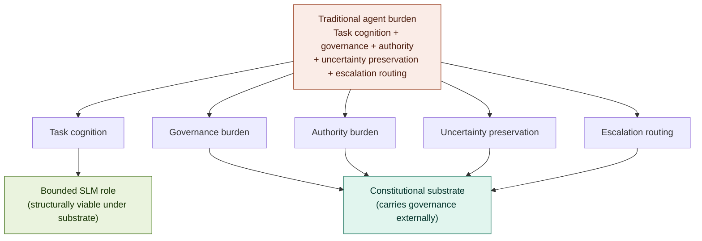

*This graph makes the sovereignty decomposition claim concrete. Task decomposition (the NVIDIA argument) reduces the complexity of what the agent must do. Sovereignty decomposition (the CRA argument) relocates the governance burden the agent must carry. These are different reductions and they compound: a bounded SLM role is viable not only because the task is simple, but because the substrate carries what would otherwise inflate the model's capability requirements.*
