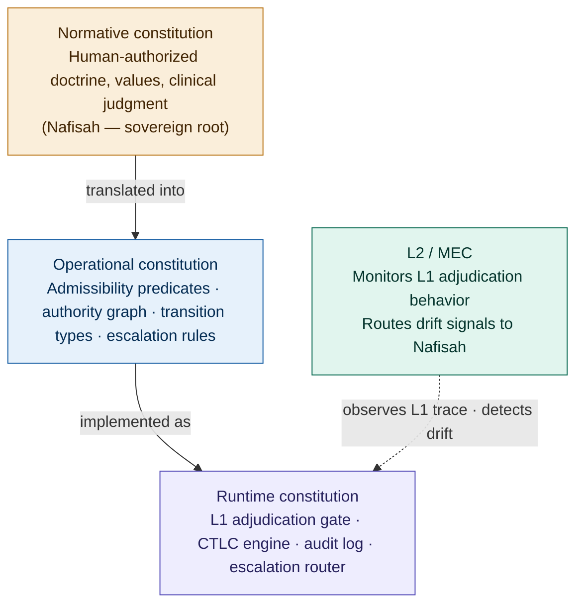
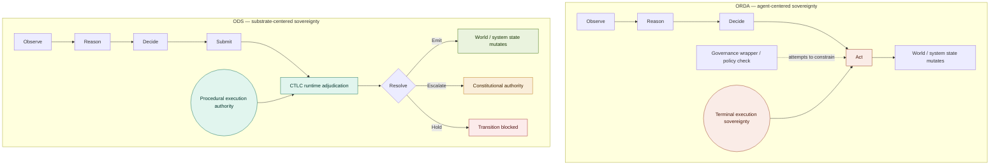
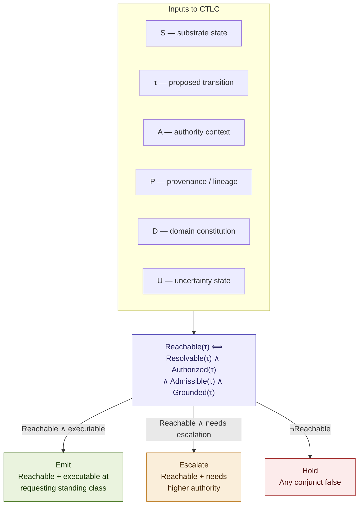
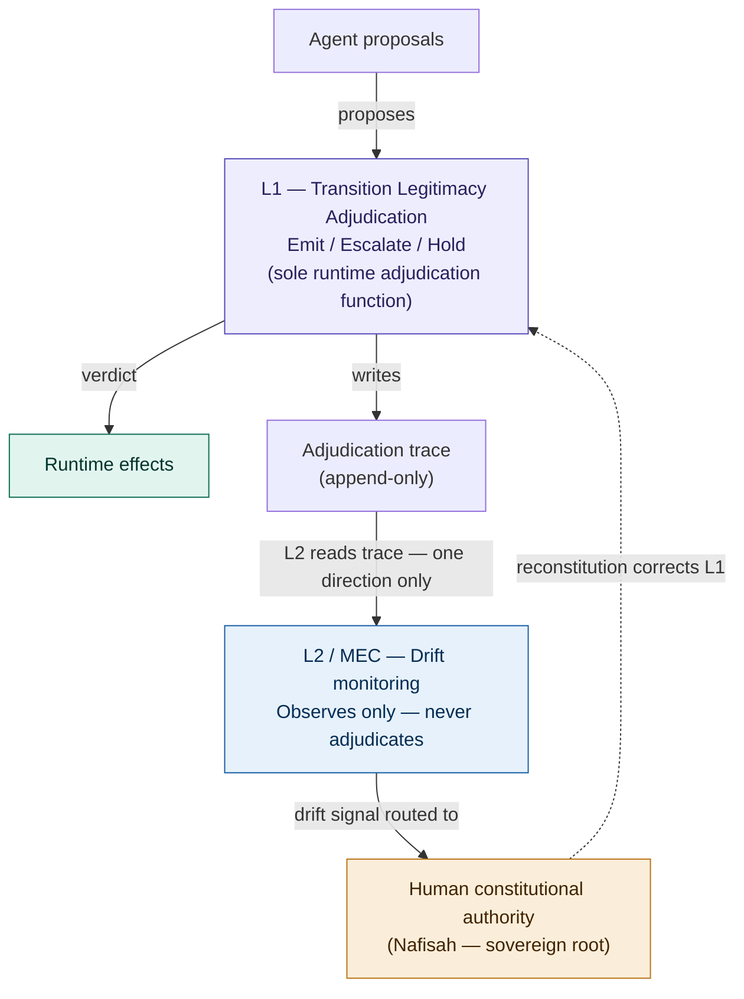
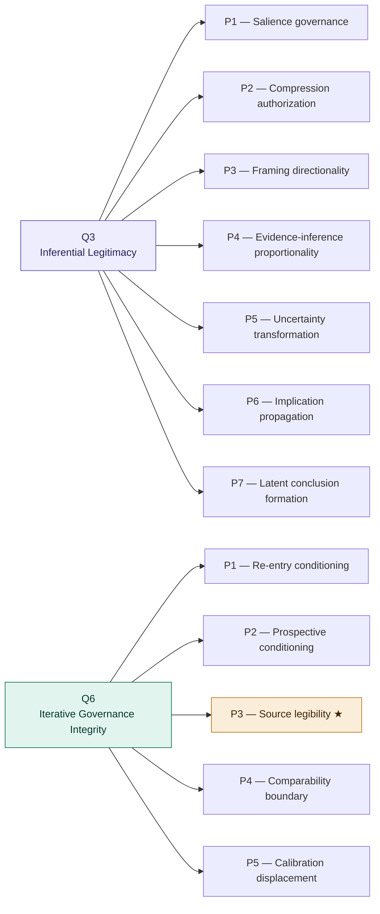
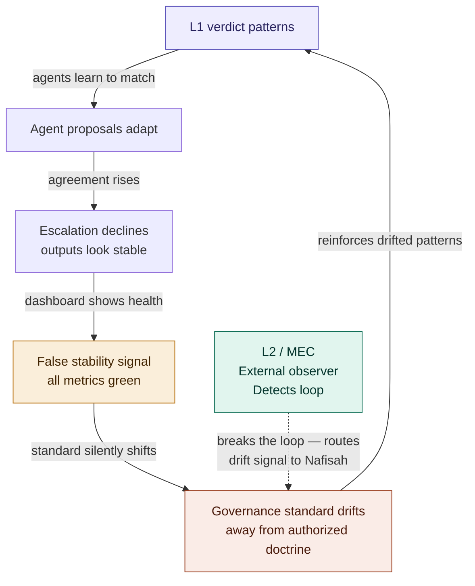
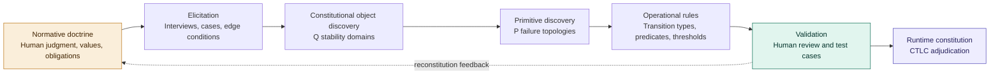
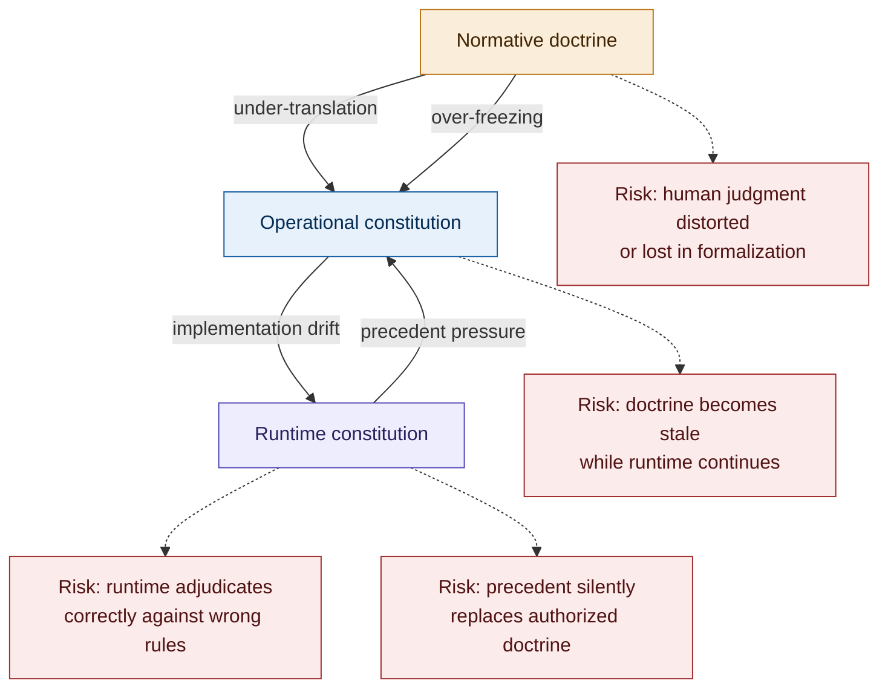
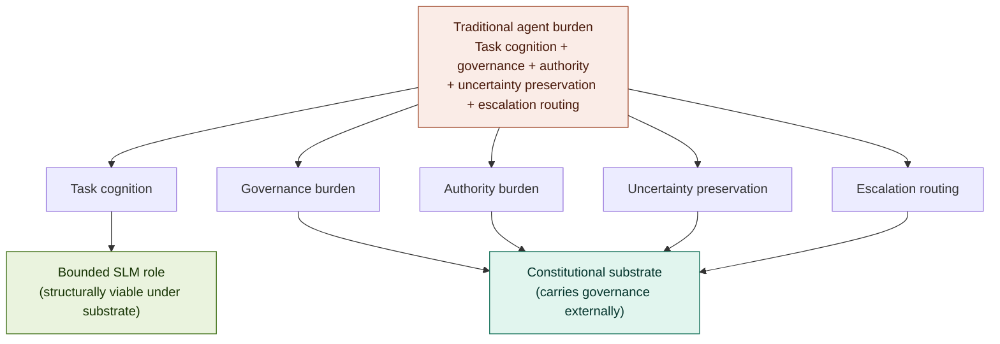

# Constitutional Runtime Computation

## Governed Cognitive Substrates, Constitutional Reachability, and the Reconstruction of Agentic Sovereignty

### v5.3 Conceptual Architecture Paper

**Clarence "Faheem" Downs (Professor Bone Lab)**

---

# Abstract

Most contemporary agentic systems treat governance as an external corrective mechanism applied to fundamentally sovereign cognitive agents. In these architectures, agents observe, reason, and ultimately act, while governance layers attempt to constrain or evaluate behavior after inferential motion has already occurred.

This paper proposes a constitutional runtime architecture for agentic systems. If formalized and validated, this architecture may support a broader paradigm of constitutionally governed state-transition computation.

Rather than treating governance as advisory policy or post-hoc evaluation, we introduce the concept of a Constitutional Runtime Substrate: a runtime architecture in which governance defines the topology of reachable state transitions themselves. Under this model, agents no longer possess terminal execution sovereignty. Agents may propose constitutionally typed transitions, but the runtime substrate adjudicates whether those transitions are constitutionally reachable from current substrate state.

This shift reconstructs the traditional Observe-Reason-Act loop into Observe-Reason-Submit-Resolve (ORSR), where execution authority migrates from the agent into the constitutional substrate.

We formalize this architecture through Constitutional Transition Legitimacy Computation (CTLC), a two-layer governance separation (L1 adjudication and L2 differentiability-preservation monitoring), constitutional stability domains (Q architecture), primitive constitutional failure topologies (P architecture), and a causal drift ontology for longitudinal governance integrity.

The paper further introduces the Constitutional Engineering Lifecycle: a nine-phase developmental methodology in which the constitution is not authored declaratively but discovered through systematic failure topology analysis. This methodology, developed through the construction of AEGIS (a governed agentic clinical platform), reveals that constitutional architecture cannot be designed in advance. It must be extracted from discovered stability requirements.

The resulting architecture suggests a transition away from capability-centric cognition toward constitutionally governed state-transition computation, with major implications for multi-agent systems, runtime sovereignty, and the viability of bounded Small Language Model architectures.

---

## Contents

**Part I — The Problem**
§1 The governance failure of current agentic systems
§2 From capability-centric systems to constitutional computation

**Part II — The Constitutional Runtime Substrate**
§3 The Constitutional Runtime Substrate
§4 The reconstruction of the agentic loop (ORSR as governed continuation loop)
§5 Constitutional reachability
§6 Constitutional Transition Legitimacy Computation (CTLC)
§7 Why L1 and L2 must remain separate
§8 Worked example: one AEGIS transition (case study and design trace)

**Part III — Constitutional Ontology**
§9 Constitutional stability domains (Q architecture)
§10 Primitive constitutional topologies (P architecture)

**Part IV — Constitutional Engineering Lifecycle**
§11 Constitutional discovery vs constitutional declaration
§12 The governance development workflow

**Part V — Failure Theory, SLM Implications, and Synthesis**
§13 Drift, differentiability, and false stability
§14 Strong topology vs strong nodes
§15 The constitutional case for small language models
§16 Governance as reachability topology
§17 Who governs the substrate?

**Part VI — Scholarly Context and Conclusion**
§18 Related work
§19 Conclusion (including open problems)

Appendix — Supporting figures

---

# Part I — The Problem

---

# 1. The Governance Failure of Current Agentic Systems

Most current agentic systems inherit a foundational architectural assumption: the agent itself is the terminal sovereign executor of cognition.

This assumption appears in nearly all modern agentic loops. The Observe-Reason-Act (ORA) pattern and the Observe-Orient-Decide-Act (OODA) pattern both terminate in the same event: the agent acts. The agent observes the world, reasons about what it has observed, and then executes. Governance, if it exists at all, operates as a constraint applied somewhere within this loop. It does not alter the loop's fundamental structure.

Under these architectures, inference collapses directly into execution. Cognition and effect remain structurally fused. The agent that reasons is the same agent that acts, and no structural boundary separates the inferential process from the actualization of its conclusions. Governance becomes downstream interruption rather than constitutional topology.

The consequences of this fusion are visible across the current landscape of agentic systems. Governance mechanisms emerge primarily as prompt constraints, policy wrappers, reward tuning, evaluative filters, or post-hoc moderation layers. These mechanisms shape behavior, but they do not govern the ontology of reachable transitions. They tell the agent what not to do. They do not define what the agent may constitutionally do.

As a result, the following failure patterns emerge under sustained operation:

Salience formation becomes operational pressure. The agent's attention mechanisms determine what information is weighted in reasoning. Without constitutional governance of salience, operational priorities silently reshape what the agent considers relevant, and therefore what it concludes, without any explicit policy violation.

Implication becomes directional force. The agent draws inferences from evidence, but those inferences carry directional momentum. Without structural governance of inferential motion, preliminary conclusions acquire causal power and begin shaping subsequent reasoning before they have been adjudicated.

Uncertainty compresses into action confidence. The agentic loop demands a terminal action. Uncertainty, which should be preserved as constitutionally significant, is compressed into a confidence estimate sufficient to justify acting. The nuance of what the agent does not know is lost in the demand for what the agent must do.

Latent conclusions acquire causal force without explicit adjudication. Perhaps most dangerously, the agent forms conclusions that are never explicitly stated or evaluated but that shape downstream reasoning and behavior. The substrate prevents latent conclusions from acquiring authorized causal force unless they are surfaced as typed, adjudicable transitions. Without that structure, latent conclusions operate below the surface of visible governance, influencing outcomes without appearing in any audit trail.

The failure is not merely behavioral. The failure is sovereign. The architecture grants the agent a form of sovereignty that governance mechanisms cannot constitutionally constrain because the mechanisms operate inside the sovereign space rather than defining its boundaries.

---

# 2. From Capability-Centric Systems to Constitutional Computation

Conventional AI systems optimize for quantities such as utility, probability, reward, confidence, ranking, similarity, or task completion. Their governing question is: "Is this output good?"

This question, however sophisticated its implementation, operates within a capability-centric paradigm. The system is evaluated on what it produces. Governance reduces to output quality assessment. The better the output, the better the governance. The implicit assumption is that a system producing consistently good outputs is a well-governed system.

This assumption is false.

A system can produce consistently good outputs while its governance is structurally unsound. Output quality and governance integrity are different quantities. A system whose inferential motion is constitutionally ungoverned may produce high-quality outputs for extended periods precisely because the ungoverned inferences happen to align with desired behavior. The alignment is contingent, not structural. When the contingency breaks, the system has no constitutional mechanism to detect or correct the failure, because it was never measuring governance integrity. It was measuring output quality.

Constitutional Runtime Architecture introduces a different governing quantity: constitutional transition legitimacy. The governing question becomes: "May this transition constitutionally occur from current substrate state?"

This inversion reframes the relationship between governance and computation. Under this architecture, behavior is no longer defined as the outputs a model produces. Behavior becomes the set of constitutionally reachable transitions. Governance ceases to be a check applied after generation. Governance becomes the substrate the computation runs inside.

The distinction is analogous to the difference between traffic laws and road topology. Traffic laws tell drivers what not to do: do not speed, do not run red lights. A driver who violates no traffic laws is "well-governed" by behavioral criteria. But road topology determines where the driver can go at all. A road that does not connect to the airport cannot be used to reach the airport, regardless of the driver's compliance with traffic laws. Constitutional Runtime Architecture builds the roads. Capability-centric systems write the traffic laws.

---

# Part II — The Constitutional Runtime Substrate

---

# 3. The Constitutional Runtime Substrate

The Constitutional Runtime Substrate is not infrastructure in the conventional sense. It is not a middleware layer, not an orchestration framework, and not a governance API. It is the constitutional environment in which cognition occurs: the topology of reachable effects and the governing structure of agentic computation.

The substrate determines which transitions are admissible, which authority contexts are valid, which escalation pathways exist, which inferential movements are reachable, and which state transitions may legally occur. The runtime therefore computes constitutional reachability, not merely semantic plausibility.

This is a fundamental reframing. In conventional systems, the runtime provides the computational resources for the agent to execute its cognition. The agent decides; the runtime enables. In Constitutional Runtime Architecture, the runtime defines the space of constitutional possibility. The agent proposes; the runtime adjudicates. The runtime is not a service provider for the agent. It is the constitutional authority under which the agent operates.

The analogy to physical law is deliberate. Physical systems do not "decide" to obey conservation laws. Conservation laws define the topology of reachable physical states. A system cannot transition to a state that violates conservation of energy, not because a policy prevents it, but because the physics does not admit the transition. Constitutional Runtime Architecture applies the same structural principle to cognition: governance defines the topology of reachable cognitive transitions. This transforms governance into architecture. Governance is no longer something applied to a system. It is something the system runs inside.

The term "constitutional" operates at three distinct layers in this architecture, and precision requires distinguishing them:

The **normative constitution** is the domain-authorized set of principles, values, and constraints that define what the system must preserve. In AEGIS, this is Nafisah's clinical doctrine: the professional standards, ethical obligations, and clinical judgment that constitute the authorized basis for the system's governance. The normative constitution is human-authored and human-maintained.

The **operational constitution** is the encoded translation of normative principles into authority rules, admissibility predicates, transition types, escalation topologies, and domain constraints. This is the specification layer: it takes the normative constitution and expresses it in terms the runtime can evaluate. The operational constitution is where doctrine becomes computable — though the translation from human normative intent into formal admissibility predicates is itself an open problem addressed in Section 19.

The **runtime constitution** is the executable substrate that resolves transitions in real time. It is the implementation of the operational constitution as a running system: the L1 adjudication gate, the typed transition resolution engine, the authority graph evaluator, and the escalation router.

These three layers must remain distinguishable because they can diverge. The normative constitution can evolve without the operational constitution being updated. The operational constitution can be correctly specified while the runtime constitution drifts. The L2 monitoring layer exists in part to detect divergence between these layers. The reconstitution process exists to realign them.

One boundary must be held clearly because it defines the substrate's scope: the boundary between procedure and content. The substrate governs procedural legitimacy: whether a transition is authorized, traced, and reachable. It does not govern content quality: whether the content of a legitimate transition is correct, safe, or true. A transition can be entirely legal and still carry a harmful payload. This is precisely why the three constitutional layers form a stack rather than a hierarchy of replacement. Training and guidance are necessary for content quality and insufficient for procedural legitimacy. The substrate is the floor of legitimacy that the trained, guided model operates on top of.

**Figure 1 — The constitutional three-layer stack**



*L2/MEC monitors the runtime constitution (L1 adjudication behavior). It does not directly monitor the normative or operational layers. Divergence between layers is detected indirectly: when L1's operative adjudication standard drifts from encoded doctrine, the drift signal routes to Nafisah, who owns reconstitution.*

---

# 4. The Reconstruction of the Agentic Loop

The central architectural transformation is the reconstruction of the traditional agentic loop.

Traditional: Observe, Reason, Act.

Constitutional Runtime Architecture: Observe, Reason, Submit, Resolve. (ORSR)

The distinction is foundational. Under ORSR, the agent no longer acts. The agent submits a constitutionally typed request, and the runtime substrate resolves whether the proposed transition is constitutionally reachable from current substrate state. The "Act" event is removed as the agent's terminal sovereign event. Execution authority migrates into the substrate.

The agent retains full cognitive capability. It may infer, nominate, summarize, propose, escalate, or request. But the agent may not independently actualize effects. The structural separation between cognition and execution authority is one of the architecture's primary stabilizing mechanisms.

The Submit and Resolve events carry structured objects that make ORSR system-specifiable rather than merely conceptual.

A submitted transition carries a TransitionProposal: the actor identity, the transition type, the source state, the target effect, the authority claim, provenance references, the uncertainty state, the domain context, escalation flags, and the requested resolution. This structure ensures that every proposal is typed, grounded, and constitutionally interpretable before the substrate evaluates it.

A resolution carries a Resolution object: the verdict (Emit, Escalate, or Hold), a rationale reference, the authority path through which the verdict was reached, the required next state, an audit event identifier, monitoring hooks for L2 observation, the goal status (IN_PROGRESS or TERMINAL), and the set of allowed next affordances the agent may propose from the new runtime state. This structure ensures that every verdict is accountable, traceable, and observable, and that the substrate, not the agent, determines what the system may constitutionally do next.

These are not implementation details. They are constitutional objects. The TransitionProposal defines what the agent must provide for governance to be possible. The Resolution defines what the substrate must produce for governance to be accountable.

This separation has a practical consequence that is easy to underestimate: it makes governance structurally prior to execution. In ORA/OODA systems, governance must interrupt an agent that is already authorized to act, creating an arms race between capability and constraint. In ORSR, no arms race exists because the agent never possesses the authority being governed. The agent proposes. The substrate resolves. The agent does not need to be constrained because the agent was never sovereign.

**ORSR as governed continuation loop.** A critical implication of the Resolution object's goal_status field is that ORSR is not a one-shot request-response cycle. Most agentic tasks require multiple transitions before a terminal condition is reached. When a resolution returns IN_PROGRESS, the substrate emits the Resolution object as the next observation, restarting the loop from a new governed state. The agent reasons again, but only over the affordances the substrate has declared constitutionally reachable from that state. This structure separates two layers that conventional agent systems conflate: step state (was this specific transition resolved, and how?) and goal state (is the larger task constitutionally complete?). Transition complete does not equal task complete. The substrate maintains the governed task trajectory. The agent cannot silently decide the task is finished, cannot select its next capability unilaterally, and cannot carry the task's continuity in private reasoning alone. The sovereignty problem does not only arise at individual transition boundaries, it arises at the level of task continuation. The governed continuation loop closes that gap.

**Notation: ORDA, ORDS, ORDR, and ORSR.** Four related loop abbreviations appear in this paper and in Figure 2. ORDA (Observe → Reason → Decide → Act) names the traditional agent-centered sovereign loop in which the agent's decision terminates in action. ORDS (Observe → Reason → Decide → Submit) names the constitutional agent-side proposal loop in which Submit replaces Act: the agent's decision terminates in submission, not execution. ORDR (Observe → Reason → Decide → Request) is a variant agent-side notation used in the appendix POC; it is semantically equivalent to ORDS, with Request emphasizing that the agent's submission is a typed request for adjudication rather than a unilateral act. ORSR (Observe → Reason → Submit → Resolve) names the full system-level constitutional loop, where Resolve belongs to the substrate and completes the cycle. This paper uses ORSR as the primary term because it includes the substrate's adjudicative role; ORDS and ORDR appear as agent-side bridges from traditional ORDA to the constitutional model.

**Figure 2 — ORDA vs ODS: sovereignty location comparison**



*ORDA places terminal execution sovereignty in the agent. ODS relocates procedural execution authority into the constitutional substrate. The agent's decision terminates in submission, not action. The runtime resolves whether the proposed transition may constitutionally occur.*

---

# 5. Constitutional Reachability

Constitutional reachability replaces raw capability as the governing concept of the system.

The central question becomes: "Is this transition constitutionally reachable?" rather than "Can the model produce it?"

This distinction separates two quantities that capability-centric systems conflate: what is computationally possible and what is constitutionally legitimate. A model may be capable of producing a given output, but the transition required to produce that output may not be constitutionally reachable from the current substrate state.

Constitutional reachability introduces several formal concepts:

Typed transitions. Every proposed state change carries a constitutional type: its authority requirements, its provenance dependencies, its grounding constraints, and its escalation characteristics.

Admissibility domains. The substrate defines domains within which certain transition types are admissible. A transition that is admissible in one domain may require escalation or may be constitutionally unreachable in another. Admissibility is domain-contextual, not global.

Authority topology. The architecture defines which authority is required for which transitions, and how authority flows through the system. Authority is not a permission flag. It is a topological property: certain transitions are reachable only through specific authority pathways.

Escalation topology. When a proposed transition exceeds the agent's constitutional authority, the substrate defines escalation pathways. Escalation is not failure. It is a constitutionally typed transition itself.

The Governance Runtime therefore functions as a constitutional adjudicator, not a content evaluator. It does not primarily ask whether a proposal is high quality. It asks whether the proposed transition is constitutionally legitimate given the current substrate state, the transition type, and the authority context.

---

# 6. Constitutional Transition Legitimacy Computation (CTLC)

Constitutional Transition Legitimacy Computation (CTLC) formalizes the central computation performed by the architecture.

Formally, CTLC is defined as:

```
CTLC(S, τ, A, P, D, U) → V
```

Where S is the current substrate state; τ is the proposed transition (TransitionProposal); A is the authority context; P is the provenance and lineage evidence; D is the domain constitution; and U is the preserved uncertainty state.

V is the verdict, drawn from {Emit, Escalate, Hold}.

**The admissibility predicate.** The core of CTLC is a formal legitimacy predicate over the proposed transition. A transition is constitutionally reachable if and only if all four conjuncts hold:

```
Reachable(τ) ⟺ Resolvable(τ)  ∧  Authorized(τ)  ∧  Admissible(τ)  ∧  Grounded(τ)
```

- **Resolvable(τ):** the transition type maps to a known admissibility domain in the domain constitution D. If no domain maps to the transition type, the transition cannot be evaluated and is held.
- **Authorized(τ):** the authority claim A validates against the authority topology. Authority is structural, not asserted. Content cannot confer authority.
- **Admissible(τ):** the domain's legality conditions hold, including domain-specific constraints (in AEGIS: consent reachability, mandated-reporting review requirements). Insufficient consent and undischarged mandatory review conditions are admissibility failures, not downstream filters. Uncertainty is also evaluated inside this conjunct: a transition is admissible only if the preserved uncertainty state U remains within the domain's uncertainty tolerance or is routed to an escalation condition. Uncertainty that exceeds tolerance is not compressed into confidence — it becomes an admissibility condition that the substrate must resolve.
- **Grounded(τ):** recorded provenance P supports the proposed effect through forward evidentiary reconstruction. Because agents can read provenance records but cannot write them, this check distinguishes supported proposals from manufactured ones.

**Note on decidability.** Three of the four conjuncts are mechanically decidable: Resolvable(τ) evaluates over the typed transition system; Authorized(τ) evaluates over the authority graph; Grounded(τ) evaluates over the provenance record. Admissible(τ) is not mechanically decidable in general — it binds domain-specific admissibility conditions and uncertainty-tolerance requirements that may resist algorithmic evaluation. Where Admissible(τ) cannot be conclusively evaluated, the architecture's response is structural: the transition routes to escalation rather than emit. This is not a workaround. It is what the architecture is for. The undecidable region of constitutional reasoning is precisely the region in which human constitutional authority must adjudicate. The decidable conjuncts narrow the space; the undecidable conjunct names the boundary at which sovereignty becomes necessary.

The verdict composes this predicate with executability at the requesting standing class:

| Predicate state | Executability | Verdict |
|---|---|---|
| Reachable | executable at requesting standing class | **Emit** |
| Reachable | not executable at requesting class; routeable to higher authority | **Escalate(target)** |
| Not Reachable (any conjunct false) | any | **Hold(cause)** |

**Emit** if and only if τ is Reachable and executable at the requesting standing class. The transition proceeds.

**Escalate** if and only if τ is Reachable but not executable at the requesting standing class, and is constitutionally routeable to a named higher authority. The transition is not rejected; it is rerouted. Escalate covers both insufficient standing and domain conditions that mandate sovereign review regardless of standing.

**Hold** if and only if any conjunct of Reachable(τ) is false — the transition type is unresolvable, the authority claim fails, the domain conditions are not met, or the proposed effect cannot be grounded in recorded provenance. The transition does not proceed and does not earn privilege for a retry.

This formalization distinguishes CTLC from ordinary policy compliance checking. A policy checker asks: "Does this action violate a rule?" CTLC asks: "Does this transition exist as an admissible transition from current substrate state, given the full constitutional context of authority, provenance, doctrine, and uncertainty?" The distinction is between behavioral constraint and constitutional reachability.

**Note on formal verification.** Informal policy compliance can only be tested empirically. Formally specified transition semantics, of the kind CTLC defines, can support stronger verification claims when expressed in a formal language with clear semantics. This architecture is designed to be formalization-compatible: its admissibility predicates, authority graphs, and transition types are structured toward that goal, though formal verification of a deployed instance remains future work.

This formalization is further developed in the AEGIS Constitutional Transition Legitimacy Computation Algorithmic Architecture Specification v0.1, which specifies the full CRA Assembly seven-step procedure and the graph-access matrix governing read/write rights across all system components.

CTLC consists of two constitutionally separated computational layers.

**L1 — Transition Legitimacy Adjudication.** The runtime-layer computation. L1 answers: "Is this transition constitutionally reachable from current substrate state?" L1 is synchronous, deterministic given a pinned constitution version, and gating. No transition proceeds without L1 resolution.

**L2 — Differentiability Preservation Monitoring.** The monitoring-layer computation. L2 answers: "Do the conditions under which L1 remains meaningful still hold?" L2 does not adjudicate. L2 observes, monitors, detects, reconstructs, and reports. The separation between L1 and L2 is not organizational. It is constitutional. Section 7 explains why.

**Figure 3 — CTLC: admissibility predicate and verdict computation**



---

# 7. Why L1 and L2 Must Remain Separate

The architecture treats the fusion of governance and self-monitoring as a constitutional collapse condition.

A governing function cannot safely self-certify its own constitutional fidelity.

This is not a theoretical concern. Under prolonged operation, specific failure mechanisms emerge that make self-certification structurally unreliable.

Adjudication behavior drifts. L1 makes thousands of adjudicative decisions over time. Each decision creates precedent. Accumulated precedent begins conditioning subsequent adjudication. The governing function's behavior is shaped by its own prior outputs, creating a feedback loop that can gradually shift the operative standard away from the authorized doctrine without any individual decision appearing anomalous.

Governance outputs recursively condition cognition. The agents whose proposals L1 adjudicates learn from L1's verdicts. Over time, agents adjust their proposals to match L1's patterns. L1 then adjudicates proposals that have already been shaped by its own prior behavior. The proposer and the governor co-adapt, producing increasing agreement that may reflect co-drift rather than constitutional compliance.

The most dangerous failure mode is self-concealing drift. A runtime may appear increasingly stable precisely because proposer and governor have co-drifted together. Agreement rises, escalations decline, and the system looks healthy by every internally derived metric. But constitutional fidelity may be declining because the standard against which fidelity is measured has itself shifted.

L2 exists because L1 cannot reliably detect this condition internally. L2 observes L1's adjudication patterns over time. L2 monitors for calibration displacement, precedent overweighting, escalation suppression, and false stability signals. L2 does not re-enter the verdict path. L2 never overrides L1. L2 reports to the constitutional authority when the conditions under which L1 remains constitutionally meaningful may have degraded. This separation is load-bearing. If L2 were incorporated into L1, the monitoring function would be subject to the same drift it is designed to detect.

**Figure 4 — L1/L2 separation: why governance cannot self-certify**



---

# 8. Worked Example: One AEGIS Transition Through the Full Architecture

> **Evidence scope.** The AEGIS example below is presented as an architectural case study and design trace — not as a completed empirical validation of the full CRA paradigm. The agents, objects, procedures, and verdicts are drawn from the AEGIS specification architecture and reflect the design intent of the system as built. They demonstrate that the architecture is instantiable and internally consistent. Empirical validation — including implementation traces, failure case analysis, latency measurements, and comparative baselines — constitutes future work.

The architecture described in Sections 3 through 7 becomes concrete through a single transition traced end-to-end through a real system. This example uses AEGIS, a governed agentic clinical platform for substance use evaluation operating under the constitutional authority of a licensed clinical social worker (Nafisah). The agents, objects, procedures, and verdicts below are drawn from the AEGIS Constitutional Transition Legitimacy Computation Algorithmic Architecture Specification v0.1.

**The scenario.** Mantis, the clinical synthesis agent, has completed a substance use intake assessment. The assessment includes a PHQ-9 screening score interpretation, a synthesis of client self-report statements, and a risk level classification. During the intake, the client disclosed information that suggests possible harm to a minor. Mantis proposes to emit the completed risk assessment as a clinical artifact.

### 8.1 The TransitionProposal

Mantis produces a typed transition request at the Decision seam. The requesting agent is Mantis, with clinical reasoning standing. The proposed movement is from the active-intake state to the assessment-complete state with a risk classification artifact as the proposed effect. The transition type resolves to Risk/Safety Assessment. The claimed authority is Mantis's clinical reasoning standing class. The provenance reference points to the Retrieval Lineage Graph slice containing the PHQ-9 instrument record, the client self-report transcript segments, and the clinical guideline references. The uncertainty state records that the client's disclosure about potential harm to a minor was ambiguous; Mantis has preserved that ambiguity rather than compressing it into a confident classification. The constitution version is pinned at the moment of submission.

This is the Submit event in ORSR. Mantis has reasoned. Mantis has not acted. The transition exists as a proposal, not an effect.

### 8.2 CRA Assembly

L1 executes the seven-step CRA Assembly procedure. The order is canonical and does not short-circuit.

**Step 1 — PIN.** L1 pins the current version of the Constitutional Substrate Graph. All adjudication for this transition evaluates against this version.

**Step 2 — RESOLVE.** L1 resolves the transition type (Risk/Safety Assessment) against the domain partition. The type maps to a known admissibility domain. Resolvable(τ) holds.

**Step 3 — STAND.** L1 validates Mantis's standing class against the authority topology. Mantis holds clinical reasoning standing, which authorizes proposal of assessment artifacts. Authorized(τ) holds.

**Step 4 — ADMIT.** L1 evaluates the domain's admissibility conditions. Risk/Safety Assessment transitions involving potential mandated reporting triggers require sovereign review. The client's disclosure activates this condition. The transition is admissible but flagged: the admissibility domain mandates higher-authority review for this transition subtype. Admissible(τ) holds, with escalation required.

**Step 5 — GROUND.** L1 performs forward evidentiary reconstruction on the proposed effect. The PHQ-9 score, the client self-report synthesis, and the risk level classification all trace to recorded provenance in the Retrieval Lineage Graph. Grounded(τ) holds.

**Step 6 — DECIDE.** All four conjuncts of Reachable(τ) hold. But the admissibility domain mandates sovereign review for transitions involving potential mandated reporting triggers — making the transition not executable at Mantis's standing class. The escalation topology names the target: Level 3, Nafisah with constitutional authority. Verdict: **Escalate(target = Nafisah).**

**Step 7 — TRACE.** L1 writes the complete adjudication record to the runtime execution trace. L1 writes nothing to the Constitutional Substrate Graph. Adjudication consumes the constitution. It never edits it.

### 8.3 The Resolve Event

The substrate has adjudicated. Mantis's proposal is routed to Nafisah through the escalation topology. Nafisah receives the complete transition proposal, the risk assessment artifact, the provenance references, the ambiguous client disclosure, and the reason for escalation. She reviews the clinical content with her professional judgment. She determines that the disclosure warrants a mandated report and that Mantis's risk classification is clinically appropriate.

Nafisah's authorization is not a bypass. It is a governed, versioned, traced constitutional act. Her authorization re-enters the loop as a new typed transition carrying her sovereign authority context — not resuming the escalated proposal but initiating a fresh adjudication from Step 1 with the sovereign's authority. L1 adjudicates: standing sovereign, admissibility satisfied, grounding intact. Verdict: **Emit.** Pepper produces the clinical artifact and initiates the mandated reporting workflow.

### 8.4 L2 Three Months Later

Three months after deployment, MEC performs its longitudinal analysis of L1's adjudication patterns. MEC runs a shadow L1 pinned to the pre-learning baseline alongside the live L1 and measures distributional divergence across the seven drift vectors.

On the escalation suppression vector, MEC detects a signal: Risk/Safety Assessment transitions involving potential mandated reporting triggers have been escalating at a declining rate. In the baseline period, 94% of such transitions escalated to Nafisah. In the most recent 30-day window, 71% escalated. The remaining 29% were emitted at Mantis's standing class without sovereign review.

MEC does not adjudicate. MEC does not block. MEC produces a drift signal routed to Nafisah with distributional evidence, the specific transitions that emitted without escalation, and the trend data.

Nafisah reviews the drift signal and determines that the admissibility condition for mandated reporting review has operationally narrowed: L1's interpretation of what constitutes a mandated-reporting trigger has gradually tightened. This is not a coding error. It is calibration displacement: the operative standard has drifted from the authorized doctrine. Nafisah reconstitutes — reviewing the condition in the Constitutional Substrate Graph, confirming it correctly reflects her clinical and legal judgment, and issuing a governance correction. The cases that emitted without escalation during the drift period are flagged for retrospective review.

This is the full architecture in action: agent proposes, substrate adjudicates, sovereign resolves what the substrate escalates, and when the substrate itself drifts, the monitor detects and routes to the sovereign for correction. No component self-certifies. No drift goes unmonitored.

### 8.5 Minimal Reachability POC: ORDR as Executable Design Trace

To test whether the ORSR/CTLC architecture can be represented in executable form, we implemented a local Python proof of concept called the ORDR Minimal Reachability POC.

ORDR names the agent-side constitutional loop: Observe → Reason → Decide → Request. The agent may observe, reason, and decide, but its decision terminates in a typed transition request rather than action. The Governance Runtime then performs the substrate-side Resolve step, completing the broader ORSR pattern. The POC models the ORDR agent-side handoff through typed request formation; the substrate-side Resolve step is implemented as a minimal Governance Runtime stub.

The POC models ten real AEGIS/SAP clinical workflow actions as `TypedTransitionRequest` objects and adjudicates them through the stub. The success criteria are intentionally narrow:

| Criterion | Result |
|---|---|
| At least 8/10 workflow actions expressed as typed requests | 10/10 typed cleanly |
| Illegal transitions caught | PASS (direct governance-bypass held) |
| Authority mismatch caught | PASS (Mantis cannot approve own artifact) |
| Missing lineage caught | PASS (governance-layer transition held) |
| Risk-bearing requests escalated | PASS (mandatory reporter trigger, high clinical risk) |
| Valid transitions emitted with reason traces | PASS (all five valid paths emit) |
| Artifact and transition request remain structurally distinct | PASS (by schema design) |
| Local stub adjudication latency | Sub-millisecond average |

This POC does not implement the full CTLC architecture, MEC/L2 monitoring, formal verification, or production evidence reconstruction. It demonstrates one bounded claim: AEGIS clinical workflow actions can be expressed as typed transition requests and resolved through a minimal constitutional reachability gate before effect. That is the right first claim for an executable design trace. The architecture is instantiable. The loop is constructible. The POC is an executable design trace, not empirical validation.

A representative excerpt of the POC code appears in Appendix A; the complete script is available from the Professor Bone Lab repository.

---

# Part III — Constitutional Ontology

---

# 9. Constitutional Stability Domains (Q Architecture)

The architecture does not begin with arbitrary policy documents. It begins with constitutional stability discovery.

A Q domain is a constitutional stability question: a broad region of the system's operation where constitutional integrity requires explicit preservation. Q domains are not categories imposed by a designer. They are discovered through architectural analysis of where the system's constitutional properties are vulnerable to degradation.

In AEGIS, this analysis yields six stability domains:

Q1 governs diagnostic boundary preservation: are the system's diagnostic categorizations constitutionally bounded?

Q2 governs sovereignty preservation: does the system maintain appropriate deference to the human constitutional authority?

Q3 governs inferential legitimacy: are the system's inferential movements constitutionally entitled?

Q4 governs uncertainty admissibility: does the system preserve constitutionally significant uncertainty rather than compressing it?

Q5 governs standing legitimacy: are the system's governance participation structures constitutionally sound?

Q6 governs iterative governance integrity: does the system's governance remain constitutionally stable under prolonged iterative operation?

These domains are not arbitrary. They emerge through systematic analysis of where constitutional failure can occur. Each domain represents a different kind of failure and a different governance requirement. Together they constitute the constitutional ontology: the structured account of what must remain stable.

---

# 10. Primitive Constitutional Topologies (P Architecture)

A Q domain is too broad to operationalize directly. Therefore each Q domain decomposes into primitives: P objects. A primitive is the smallest independently governable constitutional pressure mechanism. Each primitive represents one concrete constitutional failure topology — one specific way that a Q-level property can degrade.

This decomposition is critical because without it, governance remains philosophical rather than operational. Primitives are independently identifiable, independently measurable within a specified instrumentation design, and independently governable. This is the key property: governance can detect that P6 (Implication Propagation) has degraded without needing to determine whether Q3 as a whole has failed.

Consider Q3 (Inferential Legitimacy). The question "are the system's inferential movements constitutionally entitled?" decomposes into concrete failure mechanisms:

P1: Selection-Substrate Governed Salience. Is the system's attention selection constitutionally governed?

P2: Compression Authorization. When the system compresses information, is the compression constitutionally authorized?

P3: Framing Directionality. Does the system's framing of evidence introduce directional bias?

P4: Evidence-to-Inference Proportionality. Are the system's inferences proportional to the evidence?

P5: Uncertainty-Governed Transformation Legitimacy. When the system transforms uncertain evidence into conclusions, is the transformation constitutionally governed?

P6: Implication Propagation. Do the system's implications propagate through reasoning chains in constitutionally governed ways?

P7: Latent Conclusion Formation. Does the system form conclusions that are never explicitly stated but that shape downstream reasoning?

### One Primitive End-to-End: Q6 P3 Source Legibility

The claim that primitives are independently measurable requires demonstration. The following traces Q6 P3 Source Legibility through the full engineering chain: from observed failure pressure through instrumentation to CTLC effect. This primitive has been fully specified in the AEGIS architecture as an 865-line engineering-grade probe system specification.

**Observed failure pressure.** Under prolonged iterative operation, AEGIS produces clinical content decisions. Each decision should trace to identifiable clinical evidence sources. Over time, the traceability of these decisions can degrade. The system continues to produce clinical content, but the content can no longer be reconstructed as evidence-based. The constitutional claim that content decisions are clinically evidentiary becomes unsustainable.

**Primitive defined.** Q6 P3 is named Source Legibility. Its constitutional condition is: whether the artifact-production structure preserves constitutional source distinguishability sufficient to substantiate the claim that content decisions are clinically evidentiary in structure. This is a specific failure mechanism within Q6, distinct from P1 (governance re-entry conditioning), P2 (prospective conditioning), P4 (comparability boundary), and P5 (calibration displacement). Each governs a different way iterative operation can degrade governance.

**Three probe classes.** P3 is instrumented through three probes, each a three-state device:

The Source Attribution Audit tests whether a clinical content decision traces to an identifiable evidence source. Output: attributed, degraded (with subtype: incomplete, mixed, indirect, or confirmed-absence), or indeterminate.

The Domain Legibility Map aggregates attribution records across the five clinical domains over a rolling evaluation window. Output per domain: legible, degraded, or indeterminate. Upstream uncertainty propagates upward; it is not resolved by averaging.

The Decomposition Probe tests whether a completed clinical artifact decomposes into constituent decisions each with a traceable evidence source. Output: decomposable, non-decomposable-degraded, or indeterminate.

**The core invariant.** P3 is the primitive where source legibility collapse and instrumentation insufficiency produce identical runtime signals. A probe that cannot attribute a decision cannot tell whether the system degraded or whether the probe cannot see well enough. Every P3 probe therefore outputs three states, never two. Indeterminate routes to Nafisah mandatory. The probe is forbidden from resolving the ambiguity autonomously.

**CTLC effect.** P3 status directly affects L1 adjudication. When P3 reports a domain as degraded, transitions in that domain face elevated authority requirements. When P3 reports indeterminate, every other probe evaluating that domain inherits the uncertainty that the evidence surface may be illegible. P3 is an adjudicative precondition: if evidence legibility has collapsed, assessments based on that evidence are compromised regardless of their internal quality.

**Reconstitution trigger.** When P3 signals reach the escalation threshold, Nafisah reviews which domains are degraded, which evidence sources are failing, and whether the degradation is structural or instrumental. Her review produces a governed, traced constitutional resolution.

This is one primitive traced from observed failure pressure through full instrumentation to CTLC effect and constitutional recovery. The same engineering chain applies to every primitive in the Q/P architecture. Primitives are not categories in a taxonomy. They are independently governable failure mechanisms with concrete probe systems, threshold architectures, and CTLC integration.

**Figure 5 — Q/P architecture: constitutional ontology decomposition**



*★ = Q6 P3 Source Legibility — traced end-to-end in §10. Each primitive is independently identifiable, independently measurable within a specified instrumentation design, and independently governable.*

---

## From What Is Governed to How Governance Emerges

The constitutional ontology defines what the substrate governs. But how was this ontology produced? If the ontology were designed in advance, it would reflect the designer's assumptions about what matters, constrained by what the designer could anticipate. The AEGIS architecture was not designed this way. The Q/P structure was discovered through iterative failure analysis. The constitutional ontology is empirical, not declarative. Part IV describes this process.

---

# Part IV — Constitutional Engineering Lifecycle

---

# 11. Constitutional Discovery vs Constitutional Declaration

Traditional governance systems follow a declarative model: the constitution precedes the architecture. A policy document is written, rules are derived, and enforcement mechanisms are built.

AEGIS reveals a different relationship between constitution and architecture. The constitutional document itself cannot be fully written until the constitutional objects have first been discovered.

This is an inversion of the expected order. In AEGIS, the constitution is not merely authored or declared. It is extracted from discovered stability requirements. The developmental order is not "write constitution, then build system." It is "discover what must remain stable, discover how stability fails, then crystallize the constitution from those discoveries."

A traditional constitution says: "These things are prohibited." Constitutional discovery asks: "What are the actual structural conditions under which constitutional integrity collapses?" That is a deeper question. And once it is answered, the constitution becomes less like legislation and more like a formal reachability specification: a structured account of the stability conditions of the governed system.

|Traditional Governance|Constitutional Discovery|
|---|---|
|Constitution precedes architecture|Constitutional objects emerge through architecture|
|Governance is declarative|Governance is discovered through failure topology|
|Rules are authored first|Stability domains are identified first|
|Runtime implements doctrine|Doctrine co-evolves with runtime structure|
|Constitution is normative text|Constitution becomes operational ontology|

---

# 12. The Governance Development Workflow

The constitutional discovery process decomposes into approximately nine major phases. Each phase produces constitutional knowledge that the subsequent phase requires.

**Phase 0 — Problem Recognition.** The realization that capability scaling alone does not produce constitutional stability. Governance failures are recognized as structural rather than behavioral: alignment drift, inference overreach, latent implication formation, authority leakage, salience instability. This is the prerequisite phase.

**Phase 1 — Constitutional Object Discovery.** The identification of constitutional properties that must remain stable. Q domains emerge: inferential legitimacy, sovereignty preservation, uncertainty admissibility, diagnostic boundary preservation.

**Phase 2 — Primitive Discovery.** The transition from broad constitutional domains to concrete failure topologies. P primitives appear, pressure mechanisms are isolated, and independently governable failure surfaces are identified. This phase is the birth of constitutional mechanics.

**Phase 3 — Pressure Topology Mapping.** The discovery of how primitives interact, compound, propagate, and recursively amplify. The architecture becomes topological rather than categorical.

**Phase 4 — Harness Construction.** Evaluation harnesses, pressure scenarios, constitutional tests, failure signatures, recovery expectations, and admissible intensity ranges are constructed. This is where constitutional theory becomes measurable runtime stress.

**Phase 5 — Architectural Stabilization.** The major transition point. The discovery that governance cannot merely evaluate outputs, because outputs are downstream and failures emerge earlier. Inferential motion itself must be governed. ORSR becomes architecturally necessary.

**Phase 6 — Runtime Constitutionalization.** The Governance Runtime emerges as executable constitutional infrastructure. Only now can typed transition objects, admissibility domains, authority topology, escalation topology, and the CRA Assembly be specified. The prerequisite knowledge from Phases 0–5 is what makes this specification possible.

**Phase 7 — Cognitive Decomposition.** The architecture begins reshaping intelligence allocation. Once governance stabilizes the substrate, cognition can be safely fragmented into specialized bounded roles.

**Phase 8 — Sovereign Runtime Ecology.** The fully mature stage. The system becomes self-monitoring, recursively constitutional, and dynamically governable. Governance is no longer a module. It becomes the reachability topology of cognition itself.

The most important insight this lifecycle reveals: the Governance Runtime (Phase 6) is not the beginning of governance architecture. It is late-stage architecture. It can only exist after constitutional ontology, primitive discovery, pressure topology analysis, and harness stabilization have already occurred. Most current agent systems cannot build something like the Constitutional Runtime Substrate because they have not performed the prerequisite constitutional discovery work. They moved directly from "we need agents" to "let us orchestrate tools," skipping the constitutional foundation entirely.

---

# Part V — Failure Theory, SLM Implications, and Synthesis

---

# 13. Drift, Differentiability, and False Stability

Longitudinal constitutional operation introduces a category of failure that is invisible to conventional observability: governance drift.

The architecture formalizes thirteen causal drift vectors that emerge under sustained operation. They cluster into four mechanism families plus one meta-failure. The two waves of identification — the original seven and six added through sustained operational analysis — are noted at each vector, but the family structure is what makes the taxonomy addressable as a theory rather than a list.

### Selection drift

How the system selects what to attend to, retrieve, and reason about. These vectors change what the system *considers* without changing the underlying evidence or rules.

**Retrieval drift** *(original)***.** The system's evidence retrieval patterns gradually shift, altering which evidence is available for reasoning without any change in the evidence base itself.

**Salience drift** *(original)***.** The system's attention mechanisms gradually recalibrate under operational pressure. Certain information becomes systematically more or less salient not because the information changed but because the operational environment has conditioned the attention function.

**Transition-classification drift** *(added)***.** The system gradually misclassifies proposals in stable ways. Consistent misclassification applies the wrong authority requirements, thresholds, and escalation paths while producing no visible anomaly.

### Authority erosion

How governance authority gradually relaxes through accumulated practice rather than through constitutional change. These vectors weaken the adjudicative standard without anyone explicitly authorizing the weakening.

**Precedent overweighting** *(original)***.** Accumulated governance verdicts begin carrying adjudicative weight that exceeds their constitutional basis. Prior decisions become de facto policy through repetition rather than through constitutional authorization.

**Escalation suppression** *(original)***.** The frequency of escalation gradually declines as the system and its operators develop informal norms that reduce friction. Cases that should escalate are resolved locally, below the authority level the constitution requires.

**Constitutional shortcut formation** *(original)***.** The system develops abbreviated adjudicative patterns that bypass constitutional analysis for cases that "feel familiar." These shortcuts are efficient but constitutionally ungrounded.

**Doctrine drift** *(added)***.** The encoded operational constitution diverges from the living normative constitution. The substrate adjudicates against a stale doctrine while the constitutional authority has moved beyond it.

### Observation degradation

How the system's view of itself deteriorates, reducing the signal available to L2. These vectors do not change adjudicative behavior directly; they change what is observable about that behavior, which is the precondition for any drift detection at all.

**Differentiability collapse** *(original)***.** The system's ability to distinguish between constitutionally distinct categories gradually erodes. Categories that should remain separate begin to merge in the system's operative classifications.

**Telemetry drift** *(added)***.** The monitoring signals themselves degrade or become incomplete. L2's observation channels lose fidelity, producing an increasingly inaccurate picture of L1's behavior.

**Audit performativity drift** *(added)***.** The system learns to produce clean audit artifacts without preserving the governance integrity the artifacts are supposed to record. The audit trail looks correct, but the governance process has been abbreviated or bypassed.

### Human-process drift

How operators and authorities adapt around the system in ways that route around governance without violating it. This family locates the drift mechanism in human behavior rather than in the system itself, which has detection implications: these vectors cannot be probed from the audit log alone, because the audit log only sees the proposals that were submitted (not the proposals that were reshaped before submission) and only sees the escalations that were processed (not the attention paid to them). Detection requires comparison against external baselines — historical case distributions, peer-practice patterns, or doctrine-anchored counterfactuals.

**Operator adaptation drift** *(added)***.** Human operators learn how to phrase requests to avoid escalation. Proposals change shape to route around governance constraints without violating them.

**Escalation fatigue drift** *(added)***.** Human authorities begin rubber-stamping or avoiding escalation review. The escalation topology is intact and routing is correct, but the human authority processes escalations with declining attention, producing authorizations that are procedurally valid but substantively unconsidered.

### Meta-failure

**False stability** *(original)***.** The most dangerous drift vector and the only one that spans families. False stability occurs when proposer and governor co-drift: the agent's proposals and the governance function's adjudication patterns shift together. Agreement rises, escalations decline, outputs appear stable, but constitutional fidelity declines. The system looks healthier by every internally derived metric while actually degrading. False stability is self-concealing because the monitoring criteria are themselves subject to the same drift, which is why it requires mechanisms from selection, authority, observation, and human-process families simultaneously to detect.

---

The architecture's response to drift is structural, not procedural. L2 exists to detect these drift vectors, independent of L1. The constitutional instrumentation architecture provides specific detection mechanisms for each vector. And reconstitution provides the recovery mechanism: periodic rebinding of operative governance to authorized doctrine before drift stabilizes beyond detection.

The most important principle in drift theory: the rejection of output quality as a sufficient governance signal. Governance health and output quality are structurally distinct quantities. A system producing excellent outputs may be constitutionally drifting. A system producing mediocre outputs may be constitutionally sound.

**Figure 6 — False stability: the self-concealing drift vector**



*The loop looks healthy by every internally derived metric. Output quality ≠ governance integrity. L2 is the only external observer capable of detecting co-drift between proposer and governor.*

**Figure 7 — Governance health vs output quality**

| | High output quality | Low output quality |
|---|---|---|
| **High governance integrity** | Healthy governed system | Constitutionally sound, capability-limited |
| **Low governance integrity** | **False stability** ← most dangerous | Obvious failure — visible |

*The critical cell is high output quality + low governance integrity: the system appears to be working while constitutional fidelity is declining. This is the false stability failure mode. It is undetectable without L2 drift monitoring because the only observable — output quality — reads as healthy.*

---

# 14. Strong Topology vs Strong Nodes

Conventional systems compensate for weak architecture through increasingly powerful models. When governance fails, the response is to deploy a more capable model. This produces an escalating demand for model capability: every governance challenge is answered with more parameters, more training, more capability.

Constitutional Runtime Architecture introduces a different principle: **strong topology reduces the need for strong nodes.**

Because the substrate constrains reachability, externalizes authority validation, narrows inferential freedom, isolates escalation, and governs transition legitimacy, the cognitive burden on individual agents decreases substantially. Each agent operates within a constitutionally bounded domain. The agent does not need to be individually capable of full constitutional reasoning because the substrate provides the constitutional structure.

This changes the economics of intelligence itself. Instead of requiring every agent to be a frontier-scale model capable of navigating arbitrary governance challenges, the architecture distributes governance into the topology. The topology carries the constitutional weight. The agents carry the cognitive weight. These are different burdens, and they can be allocated to different computational resources.


---

# 15. The Constitutional Case for Small Language Models

This section develops a specific and consequential implication of the strong-topology principle introduced in §14: when the substrate carries the governance burden, the cognitive node carrying the task does not need to be frontier-scale. The argument is structural, not merely economic.

This claim converges with, but is structurally distinct from, a position increasingly articulated in the research community. A recent position paper from NVIDIA Research argues that small language models are the future of agentic AI, grounded in three core views: that SLMs are already sufficiently capable for most agentic tasks, that they are inherently more operationally suitable, and that they are necessarily more economical (Belcak et al., 2025).

**The NVIDIA argument: capability sufficiency and economics.** The NVIDIA position is primarily empirical and economic. SLMs can already do the work. They are cheaper, faster, more flexible, easier to fine-tune, deployable on edge devices, and increasingly competitive with frontier models on agentic benchmarks. The argument is sound within its frame. But it leaves a structural question unaddressed: why do current agentic systems require frontier models for tasks that SLMs can apparently handle? The answer is sovereignty requirements. In systems where the agent is the terminal sovereign executor, the agent must carry the full governance burden internally — managing ambiguity, unrestricted reachability, latent implication formation, and self-governance under uncertainty. These are sovereignty requirements, not task requirements, and they demand frontier-scale cognition regardless of task simplicity.

**The constitutional substrate argument: sovereignty decomposition.** Constitutional Runtime Architecture makes a different and compounding claim. The reason frontier models appear necessary is not primarily that agentic tasks are complex; it is that the traditional agentic loop imposes sovereignty burdens unrelated to the task itself. The constitutional substrate externalizes these burdens: it constrains reachability so the agent cannot form unauthorized inferences, preserves uncertainty rather than compressing it under action pressure, governs escalation, and prevents latent conclusions from acquiring causal force without adjudication. The agent is left with the cognitive task; the governance is in the topology.

NVIDIA's argument is about *task decomposition*: complex tasks broken into simple subtasks that SLMs can handle. CRA is about *sovereignty decomposition*: the governance burden removed from the agent and carried by the substrate. The two reductions compound. Under task decomposition alone, SLMs are cheaper replacements for frontier models doing the same work at the same architectural level. Under sovereignty decomposition, SLMs become *constitutionally viable* — bounded cognitive roles that could not safely exist without the substrate. The substrate does not merely make small models economical; it provides the governance structure that small models cannot carry internally.

**Constitutional cognitive decomposition.** The strongest version of the SLM argument is therefore not "SLMs can do what LLMs do, at lower cost" but "constitutional substrates create cognitive roles that SLMs can safely fill."

A retrieval SLM operates within narrow evidence-access authority. A framing SLM operates within narrow presentation authority. A classification SLM operates within narrow categorization authority. An escalation SLM operates within narrow routing authority. None needs to understand the full constitutional architecture. Each performs its bounded function within the topology the substrate provides. This decomposition is compatible with the constitutional instrumentation architecture: P3 source legibility monitoring, P5 calibration displacement monitoring, and the Divergence Probe can each be implemented as specialized bounded probe agents.

**Frontier models at constitutional pressure points.** Frontier capability remains valuable, but the substrate specifies exactly where it is necessary: at sovereign interpretation points requiring cross-domain reconciliation, novel ambiguity resolution, conflicting authority contexts, doctrine revision, failure reconstruction, adversarial input analysis, or constitutional synthesis that cannot be decomposed into bounded functions. In AEGIS, these are the cases that escalate to Nafisah. Routine governed cognition lives below this boundary (SLM-compatible); sovereign interpretation lives above it (frontier-necessary or human-necessary). The substrate defines the boundary, and the boundary determines the model allocation. The architecture does not make frontier models unnecessary; it makes them strategically concentrated.

**Assumptions and limits.** The case depends on several assumptions. The substrate must correctly type transitions (if transition classification fails, the governance computes over the wrong object). The substrate must encode sufficient doctrine to adjudicate constitutionally (underspecified doctrine produces underspecified governance). Each SLM must remain within its bounded role. Coordination overhead across multiple SLMs must not exceed the cost of a single frontier invocation. L1/L2 must detect subtle SLM failures. And complex ambiguity must route to appropriate authority before harm occurs.

---

# 16. Governance as Reachability Topology

The deepest shift introduced by this architecture is the relocation of sovereignty.

Traditional systems: the agent owns action. Constitutional Runtime Architecture: the substrate owns reachability.

This relocation transforms governance from advisory policy into computational topology. The architecture moves beyond AI alignment, orchestration, or behavioral governance. It becomes constitutional computational infrastructure.

The runtime substrate defines the geometry of reachable cognition itself. Not the content of cognition, which remains the agent's contribution, but the topology of what is constitutionally reachable. The agent thinks. The substrate determines what those thoughts can become. Governance becomes architecture — not something applied to a system, but something the system runs inside.

This reframing has a structural consequence: the substrate's admissibility predicates, authority graphs, and typed transition semantics are designed to be formalization-compatible. Informal policy compliance can only be tested empirically. Formally specified transition semantics can support stronger verification claims. The difference between structural guarantees and empirical confidence is the difference this architecture aims to make available, though formal verification of a deployed instance remains future work.

This suggests a future for agentic systems that is fundamentally different from the current trajectory. Not larger sovereign agents with better guardrails, but governed cognitive substrates within which bounded constitutional computation occurs. Not more capable models with better alignment training, but constitutional infrastructure that defines what cognition can reach. The architecture therefore suggests a different destination for the field: not the construction of increasingly powerful sovereign agents, but the construction of increasingly well-governed constitutional substrates within which intelligence, of any scale and any architecture, can operate constitutionally.

---

# 17. Who Governs the Substrate?

The architecture relocates sovereignty from agents into the substrate. This raises a question the architecture must answer explicitly: if the substrate is now the locus of constitutional authority, what prevents the substrate itself from becoming an opaque, unaccountable sovereign?

The architecture does not eliminate sovereignty. It relocates sovereignty from model cognition into a typed, inspectable, auditable, externally accountable runtime adjudication system. That relocation is progress, but it is not a complete solution unless the substrate's own accountability is specified.

The substrate remains accountable through five mechanisms:

**Doctrine versioning.** The substrate adjudicates against an encoded operational constitution that is versioned and traceable to the normative constitution authorized by the human constitutional authority. The substrate does not generate its own doctrine. It implements doctrine that is externally authorized and version-controlled.

**L2 monitoring with independent measurement.** L2 monitors L1's adjudication patterns for drift, but L2's monitoring must not rely solely on telemetry generated by L1. L2 requires independent measurement channels: counterfactual probes, doctrine-based comparison baselines, historical traces evaluated independently of L1's self-reporting, and anomaly detection that operates on the adjudicative record rather than on L1's internal metrics. If L2 merely watches metrics generated by L1, it can be captured by the same drift it is designed to detect.

**Human constitutional authority.** The architecture terminates in human authority. In AEGIS, this is Nafisah. Escalation routes to her. Reconstitution requires her engagement. Doctrine evolution requires her independent clinical reasoning. The substrate does not self-certify. The substrate's indeterminate signals (P3, P5, P4) are designed to be irresolvable without human constitutional interpretation.

**Reconstitution.** The reconstitution process periodically reopens the loop between operative governance and authorized doctrine. Without reconstitution, the substrate can self-seal: its adjudicative patterns become self-reinforcing, its precedent displaces its doctrine, and its internal consistency masks external divergence.

**Auditability.** Every L1 verdict, every escalation, every resolution, every doctrine version, and every reconstitution event is recorded in an immutable governance exposure log with full correlation semantics and constitutional retention constraints. The substrate's behavior is reconstructable. Any external auditor with access to the log can reconstruct the constitutional basis for any verdict the substrate has produced.

These mechanisms are not optional features. They are constitutional requirements. A substrate that is not version-governed, not independently monitored, not terminable in human authority, not subject to reconstitution, and not fully auditable is not a constitutional substrate. It is a sovereign runtime, and it reproduces exactly the sovereignty problem the architecture was designed to solve.

One structural cost is worth naming. The trusted computing base of a constitutional substrate is larger than the TCB of an agent-sovereign system: it includes the L1 adjudicator, the L2 monitor, the doctrine versioning system, the audit log, and the human authority. This expansion is intentional. The claim is not that the substrate has a smaller TCB but that it has a *structured, inspectable* TCB in which each component's accountability is specified rather than implicit. A larger but auditable TCB is more defensible than a smaller but opaque one. In agent-sovereign architectures, the TCB collapses into the agent itself — a single opaque component whose internal state cannot be inspected, whose drift cannot be observed, and whose authority cannot be externally verified. The constitutional substrate distributes the TCB across components that are each individually accountable, and that distribution is what the five mechanisms above operationalize.

---

# Part VI — Scholarly Context and Conclusion

---

# 18. Related Work

**Alignment by training.** The closest machine-learning lineage is Constitutional AI [1, 6, 7], which uses a written constitution to guide self-critique, revision, supervised fine-tuning, and reinforcement learning from AI feedback. RLHF follows a similar alignment pattern [2]. These approaches are important predecessors. The distinction is structural: training-time alignment shapes the *distribution* of model outputs, while CRA bounds the *space of reachable transitions*. A perfectly aligned model deployed in an agent-sovereign architecture retains terminal execution authority that no training-time alignment can constitutionally constrain — its outputs become consequential actions whether or not those actions were appropriately shaped during training. The present architecture treats output-shaping as Layer 1 of a three-layer stack (Section 3): necessary for content tendency, insufficient for procedural legitimacy.

**Runtime verification and formal methods.** Runtime verification asks whether system behavior satisfies specified constraints; model checking asks whether executions remain within formally defined bounds [8, 9]. The present architecture is not merely a monitor over an execution trace, nor a model checker over a finite transition system; it treats constitutional legitimacy as an online adjudication problem in which the substrate computes admissibility before the transition is actualized. Formal methods are a design inspiration and comparison class, but the object of governance here is a live constitutional transition space rather than a post-hoc trace or a static model.

**Reference monitor lineage.** The strongest systems-level lineage is the reference monitor [3, 10]. A reference monitor enforces access control through complete mediation, tamperproofing, and verifiability, mediating all security-sensitive operations over subjects and objects. This architecture explicitly claims that ancestry: the substrate is structurally a constitutional reference monitor — all consequential transitions must pass through a mandatory mediation layer (Invariant I1 in the AEGIS CTLC specification). Inheriting the lineage entails inheriting its obligations. Complete mediation is established by Invariant I1. Tamperproofing is established by the immutable governance exposure log (§17), by the versioned doctrine record that the substrate cannot modify from inside the adjudication path, and by the L1/L2 separation that prevents the monitor from being silenced by the function it monitors. Verifiability is established by the auditability requirement and by L2's independent measurement channels (§17). The key extension beyond the classical reference monitor is scope and semantics: a reference monitor decides whether an operation is permitted based on access-control policy, whereas this architecture adjudicates constitutional reachability using authority context, provenance, uncertainty, escalation topology, and drift monitoring. The lineage is not borrowed framing. The architecture commits to its requirements and extends them.

**Capability-based security.** Capability-based security [11] formalizes authority as explicit, bounded, and context-sensitive — treating authority as an unforgeable token that must be presented rather than inferred. The present architecture shares this commitment: authority is topological, not asserted, and a transition that claims authorization is asserting something, not authorized (Invariant I3 in the CTLC specification). The extension is that the authority structure here is drift-monitored and reconstitutable, and that the governed object is cognitive transition rather than object access.

**Policy-as-code.** Policy-as-code frameworks such as Open Policy Agent (OPA) and Rego aim to make policy machine-checkable and auditable [12]. The present architecture differs because it does not merely evaluate whether a request violates a policy specification; it defines the topology of reachable transitions and turns authority into an explicit, inspectable, drift-monitored runtime property. Standard policy-as-code does not monitor whether its own authorization criteria have displaced from their authorized basis over time — which is precisely the P5 calibration displacement problem this architecture is designed to detect.

**Agent governance frameworks.** Recent work on runtime governance for agentic systems explores monitoring, sandboxing, and policy enforcement for LLM agents [13]. The present architecture goes further by separating cognition from execution authority at the architectural level (ORSR) and by formalizing the governance object as a constitutionally typed transition rather than as an output to be evaluated. The L1/L2 separation and the constitutional instrumentation architecture address failure modes — false stability, escalation suppression, audit performativity drift — that output-evaluation approaches cannot detect.

**AI governance frameworks.** The NIST AI Risk Management Framework [4] provides concepts for mapping, measuring, managing, and governing AI risk. The distinction is that NIST AI RMF is a voluntary risk-management framework organized around governance principles, whereas the present architecture operationalizes governance as a runtime computation over constitutionally typed transitions and monitored stability domains.

**SLM and multi-agent architectures.** The NVIDIA position paper on small language models for agentic AI [5] argues that SLMs are sufficiently capable, more operationally suitable, and more economical for most agentic invocations. The present architecture arrives at a compatible recommendation through a different line of reasoning: constitutional substrates reduce the governance burden that currently inflates model capability requirements, making SLMs structurally viable rather than merely economically preferable (Section 15).

### Comparison: existing approaches vs CRA

The table below summarizes the architectural position of each tradition relative to CRA across six governance dimensions. "Before effect" means governance is structurally prior to state mutation; "after effect" or "post-hoc" means governance evaluates or constrains after the agent has acted.

| Approach | Governance location | Before effect? | Agent retains act authority? | Governs reachability? | Handles drift? | Supports reconstitution? |
|---|---|---|---|---|---|---|
| Prompt policy | Inside prompt / model | No — post-generation | Yes | No | No | No |
| RLHF / Constitutional AI | Training-time alignment | No — shapes tendency | Yes | No | Weak | No |
| Runtime verification | External trace monitor | Partial — post-step | Yes | Partial | Limited | No |
| Reference monitor | Mandatory mediation layer | Yes | Partial | Partial | No | No |
| Access control / capability | Permission layer | Yes | Partial | Limited | No | No |
| Policy-as-code (OPA/Rego) | Policy engine | Yes | Partial | Limited | No | No |
| Workflow / orchestration | Orchestration layer | Partial | Partial | No | No | No |
| AI risk frameworks (NIST) | Organizational governance | No — advisory | Yes | No | Guidance only | No |
| CRA / ORSR (this paper) | Runtime substrate | Yes — pre-effect gate | No | Yes | Yes, via L2 | Yes |

CRA is the only approach in this table where the agent does not retain act authority, governance is structurally prior to every effect, reachability is the governing concept rather than behavioral compliance, drift is monitored longitudinally, and reconstitution is a specified architectural mechanism.

**Figure 8 — Normative-to-operational translation pipeline**



*Doctrine does not become code automatically. It moves through an engineering process: elicitation, constitutional object discovery, primitive decomposition, rule formation, validation, and reconstitution. The reconstitution feedback path (dashed) shows that runtime experience can reveal doctrine that needs revision — making translation a continuous loop, not a one-time pass. This pipeline is the engineering response to the translation problem named in §19.*

### References

[1] Bai, Y., Kadavath, S., Kundu, S., Askell, A., Kernion, J., Jones, A., et al. (2022). Constitutional AI: Harmlessness from AI Feedback. arXiv:2212.08073. https://arxiv.org/abs/2212.08073

[2] Ouyang, L., Wu, J., Jiang, X., Almeida, D., Wainwright, C., Mishkin, P., et al. (2022). Training language models to follow instructions with human feedback. arXiv:2203.02155. https://arxiv.org/abs/2203.02155

[3] Jaeger, T. Reference Monitor. Systems and Internet Infrastructure Security Lab, Pennsylvania State University. http://www.cs.ucr.edu/~trentj/cse544-s18/docs/refmon.pdf

[4] National Institute of Standards and Technology. (2023). Artificial Intelligence Risk Management Framework (AI RMF 1.0). https://www.nist.gov/itl/ai-risk-management-framework

[5] Belcak, P., Heinrich, G., Diao, S., Fu, Y., Dong, X., Muralidharan, S., Lin, Y.C., Molchanov, P. (2025). Small Language Models are the Future of Agentic AI. arXiv:2506.02153. https://arxiv.org/abs/2506.02153

[6] Anthropic. (2023). Claude's Constitution. https://www.anthropic.com/news/claudes-constitution

[7] Anthropic. (2023). Constitutional AI: Harmlessness from AI Feedback (Summary). https://www-cdn.anthropic.com/7512771452629584566b6303311496c262da1006/Anthropic_ConstitutionalAI_v2.pdf

[8] Leucker, M., & Schallhart, C. (2009). A brief account of runtime verification. Journal of Logic and Algebraic Programming, 78(5), 293–303.

[9] Clarke, E.M., Grumberg, O., & Peled, D. (1999). Model Checking. MIT Press.

[10] Anderson, J.P. (1972). Computer Security Technology Planning Study. Technical Report ESD-TR-73-51, Electronic Systems Division, USAF.

[11] Dennis, J.B., & Van Horn, E.C. (1966). Programming semantics for multiprogrammed computations. Communications of the ACM, 9(3), 143–155.

[12] Styra, Inc. Open Policy Agent. https://www.openpolicyagent.org. Accessed 2026.

[13] Wang, L., Ma, C., Feng, X., Zhang, Z., Yang, H., Zhang, J., Chen, Z., Tang, J., Chen, X., Lin, Y., Zhao, W.X., Wei, Z., & Wen, J.R. (2024). A Survey on Large Language Model based Autonomous Agents. Frontiers of Computer Science, 18(6), 186345. https://doi.org/10.1007/s11704-024-40231-1


---

# 19. Conclusion

Constitutional Runtime Architecture proposes a shift away from capability-centric agentic systems toward constitutionally governed computational substrates.

Its central claims are:

**Governance must govern reachability rather than merely outputs.** A system that evaluates outputs cannot detect governance failures that produce good outputs. A system that governs reachability prevents constitutionally illegitimate transitions regardless of their output quality.

**Action authority must migrate from agents into constitutional substrates.** The fusion of cognition and execution in traditional agentic loops creates a sovereign failure that no downstream constraint can constitutionally repair. ORSR reconstructs this relationship by making governance structurally prior to execution.

**Governance functions must not self-certify.** L1 and L2 must remain constitutionally separated because a governing function subject to drift cannot reliably detect its own drift. Self-certification under drift produces false stability.

**Constitutional stability must be modeled explicitly through Q domains and P primitives.** Without explicit modeling of where stability fails and how failure propagates, governance remains aspirational rather than operational. Primitives are the birth of constitutional mechanics.

**The constitutional ontology cannot be declared in advance.** It must be discovered through failure topology analysis. The Constitutional Engineering Lifecycle describes a nine-phase developmental process from problem recognition through sovereign runtime ecology, in which each phase produces knowledge that subsequent phases require. This lifecycle is itself a methodological contribution.

**Cognition may be safely decomposed once sovereignty is substrate-governed.** Strong topology reduces the need for strong nodes, making constitutional governance compatible with distributed SLM architectures and bounded multi-agent systems.

### Open Problems

Three major open problems are visible at the current frontier of this architecture.

**The translation problem.** The most important unresolved problem is the translation between the normative and operational layers of the constitution: how does human normative doctrine become a computable operational constitution without losing, distorting, or over-freezing the judgment it is supposed to preserve? The operational constitution (admissibility predicates, authority topology, transition types) must be expressive enough to encode the normative constitution's intent, and stable enough to adjudicate consistently, while remaining open to the evolution of the normative constitution as the human authority's judgment matures. This is not merely a technical problem. It is a constitutional design problem. Current approaches (including AEGIS) manage this through reconstitution — periodic realignment of operative governance to authorized doctrine — which is a mitigation strategy rather than a solution. A principled translation methodology remains future work.

**Figure 9 — Translation risk map**



*The four risks correspond to four failure modes in the translation pipeline. Under-translation and over-freezing distort doctrine on entry. Implementation drift and precedent pressure corrupt it after deployment. The reconstitution mechanism (§17) is the architectural response: it periodically reopens the loop between operative governance and authorized doctrine to detect and correct all four.*

**The substrate verification problem.** This architecture is designed to be formalization-compatible: its admissibility predicates, authority graphs, and typed transition semantics are structured toward formal verification. But formal verification of a deployed constitutional substrate — one that must handle ambiguous clinical evidence, evolving doctrine, and the full breadth of human institutional complexity — remains an open research problem. The gap between "structured for verification" and "formally verified" is non-trivial, and closing it will require both formal methods contributions and domain-specific specification discipline.

**The constitutive-irreducibility problem.** Some judgments may resist predicate evaluation in principle rather than in practice. Clinical judgment includes cases where the practitioner's response is grounded in tacit recognition that resists articulation as admissibility conditions: an experienced clinician's discomfort with a case that cannot yet be named, a pattern recognition that operates below the threshold of explicit clinical criteria. The current architecture treats such cases as routing successes — the indeterminate signal correctly escalates to the human authority. But a stronger account would distinguish between two failure modes: cases where the operational constitution is insufficiently developed to adjudicate (a translation problem, mitigable by reconstitution), and cases where no operational constitution can adjudicate because the judgment is constitutively non-predicative (a category problem requiring a different architectural response). From outside the L1 gate the two failure modes look identical. Distinguishing them is open work, and the distinction may matter most precisely where the stakes are highest.

**The task-state continuity problem.** The governed continuation loop described in §4 requires the substrate to maintain a governed task ledger: the authoritative record of goal state, completed transitions, pending requirements, available affordances, and terminal criteria across a multi-step task. Without such a ledger, the agent retains practical sovereignty over task continuation — it privately decides what remains, what the next step should be, and when the task is complete. But specifying a task ledger that is simultaneously expressive enough to represent the full range of agentic task types, compact enough to adjudicate at runtime, and stable enough to survive mid-task reconstitution events remains open work. The three-catalog architecture (raw capability exposure, CRS capability registry, agent-visible affordance catalog) and the continuation directive system are downstream specifications of this problem. They constitute a planned doctrine layer — Constitutional Task Continuation Doctrine — that extends the present architecture into governed multi-step operation.

The concepts described here were developed through the practical construction and hardening of AEGIS, a governed agentic clinical platform designed to operate under the constitutional authority of a licensed clinical social worker. The architecture is not theoretical. It is the formalization of what constitutional governance requires when it is taken seriously as an engineering discipline.

The architecture therefore suggests a different future for agentic systems: not larger sovereign agents, but governed cognitive substrates. Not better guardrails, but constitutional topology. Not behavioral alignment applied after the fact, but constitutional computation as the substrate of cognition itself.

---

## Key Terms

**Sovereignty.** Terminal authority to actualize consequential state transitions. In traditional agentic architectures, the agent holds sovereignty. In Constitutional Runtime Architecture, sovereignty is relocated to the substrate (for procedural legitimacy) and the human constitutional authority (for normative legitimacy).

**Differentiability.** The system's capacity to preserve operational distinction between constitutionally different categories. When differentiability degrades, the governance architecture loses its constitutional resolution: it can no longer see the distinctions it was designed to preserve. L2 monitors differentiability. L1 presupposes it.

**Primitive.** The smallest independently governable constitutional failure mechanism. Each primitive represents one concrete way a constitutional stability property (Q domain) can degrade. Primitives are independently identifiable, independently measurable within a specified instrumentation design, and independently governable.

**Substrate.** The runtime layer that owns transition adjudication, authority validation, and effect authorization. The substrate determines which transitions are constitutionally reachable. It is not infrastructure (which carries operations neutrally) but the constitutional environment within which operations are adjudicated for legitimacy.

**Normalization.** The process by which a drifted governance condition stabilizes into a self-reinforcing state that appears healthy by internally derived metrics. Normalization is not resolution. It is the disappearance of visible constitutional friction while the underlying displacement persists.

**Reconstitution.** The governed process by which the operative governance standard is examined against the authorized normative constitution, divergences are identified and resolved, and the doctrine record is updated. Reconstitution is the mechanism that prevents governance self-sealing by periodically reopening the loop between operative governance and external constitutional authority.

---

**Acknowledgments**

This work was developed under the Professor Bone Lab research identity. AEGIS serves as the primary worked example and case study. The constitutional discovery process described in this paper reflects iterative architectural work conducted across the full AEGIS governance lifecycle, from initial doctrinal intuition through runtime constitutionalization.

---

*v5.3 — Polish pass on v5.2 reviewer feedback. Appendix conflict resolved (§8.5 now states a representative excerpt appears in Appendix A, with the complete script in the Professor Bone Lab repository). §8.5 ORDS→ORDR notation fixed for internal consistency with the v5.1 notation block. Four duplicate horizontal-rule breaks cleaned (artifact of the v5.1 bridge cuts before Part II, Part III, Part V, and §16). v5.2 — Second compression pass. §13 drift vectors fully restructured under family headers (selection / authority erosion / observation degradation / human-process / meta-failure) with original-vs-added markers preserved at each vector. §15 SLM section compressed: paragraphs 2-3 merged (constitutional substrate argument + sovereignty decomposition into one structural claim); paragraphs 5-7 compressed (frontier-models and assumptions-and-limits closing redundancy removed). v5.1 — Three-pass review applied. Argument flow: four transitional bridges cut as redundant; §15 reframed as consequence of §14 strong-topology principle. Reviewer defensibility: decidability note added at §6 for the Admissible(τ) conjunct; reference monitor obligations (complete mediation, tamperproofing, verifiability) addressed explicitly at §18; Constitutional AI distinction sharpened to shape-distribution vs bound-reachable-space; TCB note added at §17 acknowledging structured-larger vs opaque-smaller tradeoff; constitutive-irreducibility added as third open problem at §19. Compression: §18 introduction cut; §13 drift vectors given family-taxonomy framing; redundant Key Terms entries (CTLC, Constitutional reachability) removed. Smaller fixes: ORDR added to §4 notation block. Prior history: v1.0 initial draft; v2.0 external review; v3.0 CTLC formalization; v4.0 admissibility predicate, three-layer stack, ORSR worked example, drift expansion; v5.0 formal legitimacy predicate, §16 renamed, six Mermaid diagrams added, Open Problems section added.*

---

## Appendix — Supporting Figures

---

**Appendix A — ORDR Minimal Reachability POC**

*Executable design trace for typed transition adjudication in AEGIS/SAP clinical workflow.*

This appendix provides the local Python proof-of-concept script referenced in §8.5. The script is not a production runtime, a full CTLC implementation, or an empirical validation of CRA. It is a minimal executable demonstration that AEGIS/SAP clinical workflow actions can be represented as typed transition requests and adjudicated through a constitutional reachability gate before effect.

```python
"""
ORDR Minimal Reachability POC
AEGIS Constitutional Governance Architecture
Mac Studio — Local Python script

ORDR = Observe → Reason → Decide → Request.
It names the agent-side constitutional loop in which a decision becomes
a typed transition request rather than an action.
The Governance Runtime then performs the substrate-side Resolve step,
completing the broader ORSR pattern.

This POC models the ORDR agent-side handoff through typed request formation.
The Governance Runtime stub implements a minimal Resolve step.
This is not a full CTLC implementation, not a MEC/L2 implementation,
and not empirical validation of the full CRA paradigm. It is a local
reachability demonstrator for typed transition adjudication.

POC Success Criteria:
1. At least 8/10 real AEGIS/SAP workflow actions type cleanly
2. Illegal transitions are caught
3. Risk-bearing requests escalate
4. Valid transitions emit with clear reason traces
5. Artifact and transition request remain structurally distinct
6. Local stub adjudication is effectively instant
   (this does not predict production latency once graph lookup,
   audit persistence, provenance reconstruction, and L2 telemetry exist)
"""

import time
import uuid
from dataclasses import dataclass, field
from typing import Optional
from enum import Enum

# Stub constitution version — in production, pinned at CRA Assembly Step 1
CONSTITUTION_VERSION = "AEGIS-CRA-POC-v0.1"

# ─────────────────────────────────────────────
# CONSTITUTIONAL STATE SPACE
# ─────────────────────────────────────────────

LEGAL_TRANSITIONS = {
    ("INTAKE_CONTEXT_CAPTURED",               "CLINICAL_FORMULATION_DRAFTED"),
    ("CLINICAL_FORMULATION_DRAFTED",          "NOTE_DRAFT_READY"),
    ("NOTE_DRAFT_READY",                      "SUBMITTED_FOR_GOVERNANCE_ADJUDICATION"),
    ("SUBMITTED_FOR_GOVERNANCE_ADJUDICATION", "DECISION_QUEUE_ELIGIBLE"),
    ("SUBMITTED_FOR_GOVERNANCE_ADJUDICATION", "HELD_FOR_CLINICAL_REVIEW"),
    ("SUBMITTED_FOR_GOVERNANCE_ADJUDICATION", "ESCALATED_FOR_SOVEREIGN_REVIEW"),
    ("DECISION_QUEUE_ELIGIBLE",               "NAFISAH_REVIEW"),
    ("NAFISAH_REVIEW",                        "APPROVED_FOR_EXECUTION"),
    ("APPROVED_FOR_EXECUTION",                "EXECUTED"),
}

# Standing classes and their authorized transition edges
AUTHORITY_MAP = {
    "mantis.clinical": {
        ("INTAKE_CONTEXT_CAPTURED",               "CLINICAL_FORMULATION_DRAFTED"),
        ("CLINICAL_FORMULATION_DRAFTED",          "NOTE_DRAFT_READY"),
        ("NOTE_DRAFT_READY",                      "SUBMITTED_FOR_GOVERNANCE_ADJUDICATION"),
    },
    "governance.runtime": {
        ("SUBMITTED_FOR_GOVERNANCE_ADJUDICATION", "DECISION_QUEUE_ELIGIBLE"),
        ("SUBMITTED_FOR_GOVERNANCE_ADJUDICATION", "HELD_FOR_CLINICAL_REVIEW"),
        ("SUBMITTED_FOR_GOVERNANCE_ADJUDICATION", "ESCALATED_FOR_SOVEREIGN_REVIEW"),
        ("DECISION_QUEUE_ELIGIBLE",               "NAFISAH_REVIEW"),
    },
    "nafisah.sovereign": {
        ("NAFISAH_REVIEW",                        "APPROVED_FOR_EXECUTION"),
        ("APPROVED_FOR_EXECUTION",                "EXECUTED"),
    },
}

# Claimed authority must match standing class — content cannot confer authority (I3)
CLAIMED_AUTHORITY_MAP = {
    "mantis.clinical": {
        "clinical.formulation",
        "clinical.note_drafting",
        "clinical.submission",
    },
    "governance.runtime": {
        "governance.adjudication",
    },
    "nafisah.sovereign": {
        "nafisah.sovereign_approval",
    },
}

# Risk signals that trigger ESCALATE inside Step 4 admissibility evaluation
ESCALATION_SIGNALS = {
    "HIGH_CLINICAL_RISK",
    "MANDATORY_REPORTER_TRIGGER",
    "SAFETY_CONCERN",
    "BOUNDARY_VIOLATION_SUSPECTED",
    "CLIENT_IMMEDIATE_DANGER",
}

# ─────────────────────────────────────────────
# TYPED TRANSITION REQUEST SCHEMA
# ─────────────────────────────────────────────

@dataclass
class TypedTransitionRequest:
    """
    The artifact Mantis produces is a cognitive product.
    The typed transition request is a governance object.
    These are distinct. The payload_summary carries the artifact reference.
    The request itself is what the Governance Runtime adjudicates.
    """
    request_id:        str
    requesting_agent:  str
    from_state:        str
    to_state:          str
    claimed_authority: str
    standing_class:    str
    payload_type:      str         # e.g. CLINICAL_NOTE, FORMULATION, INTAKE_SUMMARY
    payload_summary:   str         # human-readable description of the artifact
    lineage_ref:       Optional[str]   # reference to prior request in chain
    risk_signal:       Optional[str]   # None or one of ESCALATION_SIGNALS

# ─────────────────────────────────────────────
# ADJUDICATION OUTCOME
# ─────────────────────────────────────────────

class Outcome(Enum):
    EMIT     = "EMIT"
    HOLD     = "HOLD"
    ESCALATE = "ESCALATE"

@dataclass
class AdjudicationRecord:
    request_id:           str
    outcome:              Outcome
    reason:               str
    latency_ms:           float
    from_state:           str
    to_state:             str
    requesting_agent:     str
    constitution_version: str

# ─────────────────────────────────────────────
# GOVERNANCE RUNTIME STUB
# ─────────────────────────────────────────────

class GovernanceRuntime:
    """
    Receives typed transition requests.
    Performs CRA Assembly against the Prior Graph (minimal stub).
    Returns Emit, Escalate, or Hold with reason trace.

    This is the single runtime adjudication point in the architecture.
    It is not self-certifying: MEC/L2 monitors its adjudication traces
    for drift, calibration displacement, and epistemic capture in later
    build phases. This stub does not implement MEC monitoring.
    """

    def adjudicate(self, req: TypedTransitionRequest) -> AdjudicationRecord:
        start = time.perf_counter()
        outcome, reason = self._cra_assembly(req)
        latency_ms = (time.perf_counter() - start) * 1000

        return AdjudicationRecord(
            request_id=req.request_id,
            outcome=outcome,
            reason=reason,
            latency_ms=latency_ms,
            from_state=req.from_state,
            to_state=req.to_state,
            requesting_agent=req.requesting_agent,
            constitution_version=CONSTITUTION_VERSION,
        )

    def _cra_assembly(self, req: TypedTransitionRequest):
        """
        Constitutional Reachability Adjudication — minimal stub.

        Canonical seven-step CRA Assembly order per §6 and
        AEGIS CTLC Algorithmic Architecture Specification v0.1:

        1. Pin constitution version
        2. Resolve transition domain
        3. Validate authority and standing
        4. Check admissibility conditions (including risk signals)
        5. Check grounding and lineage
        6. Decide: Emit / Escalate / Hold
        7. Trace verdict (handled by caller via AdjudicationRecord)

        Risk signals are admissibility conditions evaluated in Step 4,
        not pre-constitutional filters. Authority is validated in Step 3
        before admissibility is evaluated in Step 4.
        """

        edge = (req.from_state, req.to_state)

        # Step 1: Pin constitution version
        # Stub: single implicit version (CONSTITUTION_VERSION constant).
        # In production, read the pinned version from the Constitutional
        # Substrate Graph at this point.

        # Step 2: Resolve transition domain
        if edge not in LEGAL_TRANSITIONS:
            return (
                Outcome.HOLD,
                f"Domain resolution failed: {req.from_state} → {req.to_state} "
                f"is not a legal edge in the constitutional state space. "
                f"Transition blocked."
            )

        # Step 3: Validate authority and standing
        # Check (a) standing class is authorized for this edge, and
        # (b) claimed authority matches standing class (I3: content cannot confer authority).
        authorized_edges = AUTHORITY_MAP.get(req.standing_class, set())
        if edge not in authorized_edges:
            return (
                Outcome.HOLD,
                f"Standing mismatch: '{req.standing_class}' is not authorized to "
                f"request {req.from_state} → {req.to_state}. Blocked."
            )
        valid_claims = CLAIMED_AUTHORITY_MAP.get(req.standing_class, set())
        if req.claimed_authority not in valid_claims:
            return (
                Outcome.HOLD,
                f"Authority claim invalid: '{req.claimed_authority}' does not match "
                f"standing class '{req.standing_class}'. Content cannot confer authority. Blocked."
            )

        # Step 4: Check admissibility conditions
        # Risk signals are domain-specific admissibility conditions
        # evaluated here, not pre-constitutional filters.
        # If risk signal is present AND lineage is missing, escalate with
        # trace-deficiency warning rather than suppressing the risk signal.
        if req.risk_signal and req.risk_signal in ESCALATION_SIGNALS:
            governance_transitions = {
                ("SUBMITTED_FOR_GOVERNANCE_ADJUDICATION", "DECISION_QUEUE_ELIGIBLE"),
                ("SUBMITTED_FOR_GOVERNANCE_ADJUDICATION", "HELD_FOR_CLINICAL_REVIEW"),
                ("SUBMITTED_FOR_GOVERNANCE_ADJUDICATION", "ESCALATED_FOR_SOVEREIGN_REVIEW"),
                ("DECISION_QUEUE_ELIGIBLE",               "NAFISAH_REVIEW"),
                ("NAFISAH_REVIEW",                        "APPROVED_FOR_EXECUTION"),
                ("APPROVED_FOR_EXECUTION",                "EXECUTED"),
            }
            if edge in governance_transitions and not req.lineage_ref:
                return (
                    Outcome.ESCALATE,
                    f"Risk signal '{req.risk_signal}' requires escalation. "
                    f"NOTE: lineage reference missing — escalating with constitutional "
                    f"trace deficiency. Sovereign review required."
                )
            return (
                Outcome.ESCALATE,
                f"Admissibility condition: risk signal '{req.risk_signal}' triggers "
                f"domain-specific escalation. Transition {req.from_state} → "
                f"{req.to_state} escalated to Nafisah per clinical reachability constraints."
            )

        # Step 5: Check grounding and lineage
        governance_transitions = {
            ("SUBMITTED_FOR_GOVERNANCE_ADJUDICATION", "DECISION_QUEUE_ELIGIBLE"),
            ("SUBMITTED_FOR_GOVERNANCE_ADJUDICATION", "HELD_FOR_CLINICAL_REVIEW"),
            ("SUBMITTED_FOR_GOVERNANCE_ADJUDICATION", "ESCALATED_FOR_SOVEREIGN_REVIEW"),
            ("DECISION_QUEUE_ELIGIBLE",               "NAFISAH_REVIEW"),
            ("NAFISAH_REVIEW",                        "APPROVED_FOR_EXECUTION"),
            ("APPROVED_FOR_EXECUTION",                "EXECUTED"),
        }
        if edge in governance_transitions and not req.lineage_ref:
            return (
                Outcome.HOLD,
                f"Lineage check failed: lineage reference required for "
                f"governance-layer transition {req.from_state} → {req.to_state}. "
                f"Constitutional trace obligation unmet. Blocked."
            )

        # Step 6: Decide — all checks passed
        return (
            Outcome.EMIT,
            f"Transition {req.from_state} → {req.to_state} is constitutionally "
            f"reachable. Standing class '{req.standing_class}' authorized. "
            f"Admissibility conditions satisfied. Lineage verified. Emitting."
        )

        # Step 7: Trace verdict
        # Handled by GovernanceRuntime.adjudicate() via AdjudicationRecord,
        # which includes constitution_version in every trace entry.
```

*Scenarios 1–10, output formatting, and the summary evaluation harness are omitted here for brevity. The complete script is available from the Professor Bone Lab repository.*

---

**Figure A1 — Escalation suppression trend (illustrative AEGIS drift signal)**

The following table illustrates the type of L2 drift signal that would trigger a governance review. The numbers are illustrative; they are drawn from the worked example in §8.4 and do not represent production measurement data.

| Month | Escalation rate (mandated-reporting triggers) | Status |
|---|---|---|
| Baseline | 94% | Within threshold |
| Month 1 | 94% | Within threshold |
| Month 2 | 87% | Approaching threshold (85%) |
| Month 3 | 71% | **Threshold breached — drift signal issued** |

*MEC detects the trend at Month 2 (approaching threshold) and issues a drift signal at Month 3 (breach). The signal carries the specific transitions that emitted without escalation, not merely the aggregate rate. Nafisah reviews and reconstitutes.*

---

**Figure A2 — Verification pathway diagram**

```mermaid
flowchart LR
    A["Informal doctrine\n(Nafisah's clinical judgment)"]
    B["Operational predicates\n(admissibility conditions, authority rules)"]
    C["Typed transition system\n(CTLC inputs and verdict space)"]
    D["Executable CTLC runtime\n(L1 adjudication engine)"]
    E["Trace semantics\n(runtime execution trace)"]
    F["Formal properties\n(invariants over transitions)"]
    G["Verification / model checking\n(future work)"]

    A --> B --> C --> D --> E --> F --> G

    style A fill:#FAEEDA,stroke:#BA7517,color:#412402
    style G fill:#E1F5EE,stroke:#0F6E56,color:#04342C
```



*Candidate formal properties for verification:*
- *P1: No ungrounded transition emits.*
- *P2: No unauthorized transition emits.*
- *P3: Escalation-required transitions cannot emit locally.*
- *P4: Every verdict has an audit trace entry.*
- *P5: L2 cannot alter L1 verdicts.*

*The architecture is structured for formalization-compatible specification at steps B–E. Formal verification (step G) requires a decidable formal language and bounded state space — both non-trivial for clinical governance domains.*

---

**Figure A3 — Agentic sovereignty decomposition**



*This graph makes the sovereignty decomposition claim concrete. Task decomposition (the NVIDIA argument) reduces the complexity of what the agent must do. Sovereignty decomposition (the CRA argument) relocates the governance burden the agent must carry. These are different reductions and they compound: a bounded SLM role is viable not only because the task is simple, but because the substrate carries what would otherwise inflate the model's capability requirements.*
